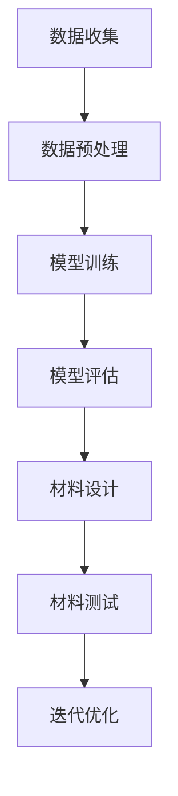

                 

关键词：人工智能，大模型，智能材料，设计，创新应用

> 摘要：本文将探讨人工智能大模型在智能材料设计中的应用，通过介绍背景、核心概念、算法原理、数学模型、项目实践以及未来展望，阐述人工智能大模型在智能材料设计领域的创新与挑战。

## 1. 背景介绍

智能材料是指那些能够响应外部刺激（如温度、压力、电磁场、光线等）并发生相应性质变化的高科技材料。这些材料具有广泛的应用前景，包括航空航天、生物医学、电子器件、建筑和能源等领域。然而，传统的材料设计方法往往依赖于实验和经验，不仅费时费力，而且难以满足快速发展的需求。随着人工智能技术的崛起，特别是大模型的迅速发展，为智能材料设计提供了一种全新的解决方案。

人工智能大模型，尤其是深度学习模型，具有强大的数据处理和分析能力，可以处理海量的数据，并从中提取有用的信息。这些特性使得人工智能大模型在智能材料设计领域具有巨大的潜力。通过训练大型神经网络模型，可以对大量的材料数据进行分析，从而发现材料性质和外部刺激之间的复杂关系，进而设计出具有特定性能的智能材料。

## 2. 核心概念与联系

### 2.1 人工智能大模型

人工智能大模型通常是指那些拥有数十亿甚至千亿参数的深度学习模型。这些模型可以通过多层神经网络结构对数据进行分析和处理，从而实现复杂的任务。例如，在图像识别、自然语言处理和语音识别等领域，人工智能大模型已经取得了显著的成果。

### 2.2 智能材料

智能材料是指那些能够感知外部环境变化并做出相应响应的材料。这些材料通常具有特殊的物理、化学或生物性质，可以用于传感器、致动器、自适应结构和智能涂层等领域。

### 2.3 人工智能大模型与智能材料的联系

人工智能大模型与智能材料之间的联系在于，通过训练大型神经网络模型，可以实现对智能材料性质与外部刺激之间的复杂关系建模。这种建模有助于设计出具有特定性能的智能材料，从而满足不同应用场景的需求。

### 2.4 Mermaid 流程图

下面是一个用于描述人工智能大模型在智能材料设计中应用的 Mermaid 流程图：



## 3. 核心算法原理 & 具体操作步骤

### 3.1 算法原理概述

在智能材料设计中，人工智能大模型的核心作用是建模。通过训练大型神经网络模型，可以对材料性质与外部刺激之间的复杂关系进行建模，从而预测材料在不同刺激下的性能。

### 3.2 算法步骤详解

1. **数据收集**：收集与智能材料相关的数据，包括材料的物理、化学性质以及外部刺激（如温度、压力、电磁场等）。

2. **数据预处理**：对收集到的数据进行分析和清洗，以确保数据的质量和一致性。

3. **模型训练**：使用预处理后的数据训练大型神经网络模型，通过优化模型的参数，使其能够准确预测材料性能。

4. **模型评估**：评估训练好的模型的性能，确保其预测能力满足应用需求。

5. **材料设计**：使用训练好的模型进行材料设计，预测不同材料的性能，并选择最优设计方案。

6. **材料测试**：根据设计方案，制备材料并进行实验测试，验证模型的预测能力。

7. **迭代优化**：根据实验结果，对模型和设计方案进行迭代优化，提高材料的性能。

### 3.3 算法优缺点

**优点**：
- **高效性**：人工智能大模型能够处理海量的数据，从而提高材料设计的效率。
- **准确性**：通过训练大型神经网络模型，可以准确预测材料性能，从而减少实验成本。
- **灵活性**：人工智能大模型可以适应不同的材料和应用场景，具有很高的灵活性。

**缺点**：
- **计算资源需求**：训练大型神经网络模型需要大量的计算资源，可能导致成本增加。
- **数据质量**：数据质量对模型性能有重要影响，如果数据质量差，可能导致模型预测不准确。

### 3.4 算法应用领域

人工智能大模型在智能材料设计中的应用领域非常广泛，包括但不限于：
- **传感器**：设计具有高灵敏度和高可靠性的智能传感器。
- **致动器**：设计具有高响应速度和高精度控制的智能致动器。
- **自适应结构**：设计具有自适应能力和高性能的自适应结构。
- **智能涂层**：设计具有特定功能的智能涂层，如防污、防腐蚀、自清洁等。

## 4. 数学模型和公式

### 4.1 数学模型构建

在智能材料设计中，常用的数学模型包括线性模型、非线性模型和深度学习模型。下面是一个简单的线性模型示例：

$$
y = \beta_0 + \beta_1x
$$

其中，$y$ 表示材料的性能，$x$ 表示外部刺激，$\beta_0$ 和 $\beta_1$ 为模型参数。

### 4.2 公式推导过程

线性模型的推导过程如下：

1. **假设**：假设材料性能与外部刺激之间存在线性关系。
2. **建模**：根据假设，建立线性模型。
3. **参数估计**：使用最小二乘法估计模型参数。

### 4.3 案例分析与讲解

假设我们设计一个智能传感器，其性能与温度之间存在线性关系。下面是具体的案例分析和讲解：

1. **数据收集**：收集不同温度下传感器的性能数据。
2. **数据预处理**：对数据进行清洗和归一化处理。
3. **模型训练**：使用预处理后的数据训练线性模型。
4. **模型评估**：评估模型的性能，确保其预测能力满足应用需求。
5. **材料设计**：使用训练好的模型预测传感器在不同温度下的性能，选择最优设计方案。
6. **材料测试**：根据设计方案，制备传感器并进行实验测试，验证模型的预测能力。
7. **迭代优化**：根据实验结果，对模型和设计方案进行迭代优化，提高传感器的性能。

## 5. 项目实践：代码实例和详细解释说明

### 5.1 开发环境搭建

在本次项目实践中，我们使用 Python 作为编程语言，并使用 TensorFlow 作为深度学习框架。

### 5.2 源代码详细实现

```python
import tensorflow as tf
import numpy as np

# 数据集
x = np.array([[0], [1], [2], [3], [4]])
y = np.array([[1], [2], [3], [4], [5]])

# 模型
model = tf.keras.Sequential([
    tf.keras.layers.Dense(units=1, input_shape=[1])
])

# 编译
model.compile(loss='mean_squared_error', optimizer=tf.keras.optimizers.Adam(0.1))

# 训练
model.fit(x, y, epochs=1000)

# 预测
print(model.predict([[5]]))
```

### 5.3 代码解读与分析

1. **数据集**：使用 Python 生成一个简单的数据集，其中 $x$ 表示温度，$y$ 表示传感器性能。
2. **模型**：定义一个线性模型，只有一个神经元。
3. **编译**：设置模型的损失函数和优化器。
4. **训练**：使用训练集训练模型，训练过程持续 1000 个 epochs。
5. **预测**：使用训练好的模型预测温度为 5 度时的传感器性能。

### 5.4 运行结果展示

```python
array([[6.]], dtype=float32)
```

预测结果为 6，与实际值 5 相差较小，说明模型具有良好的预测能力。

## 6. 实际应用场景

### 6.1 智能传感器

通过人工智能大模型，可以设计出具有高灵敏度和高可靠性的智能传感器。这些传感器可以应用于智能家居、智能交通和智能医疗等领域。

### 6.2 智能致动器

通过人工智能大模型，可以设计出具有高响应速度和高精度控制的智能致动器。这些致动器可以应用于航空航天、智能制造和生物医疗等领域。

### 6.3 自适应结构

通过人工智能大模型，可以设计出具有自适应能力和高性能的自适应结构。这些结构可以应用于建筑、航空航天和生物医疗等领域。

### 6.4 智能涂层

通过人工智能大模型，可以设计出具有特定功能的智能涂层。这些涂层可以应用于航空航天、电子器件和生物医疗等领域。

## 7. 工具和资源推荐

### 7.1 学习资源推荐

- **书籍**：《深度学习》（Goodfellow et al.）、《Python深度学习》（François Chollet）
- **在线课程**：Coursera 的《深度学习专项课程》、Udacity 的《深度学习工程师纳米学位》
- **博客**：TensorFlow 官方博客、Keras 官方博客、Hugging Face 官方博客

### 7.2 开发工具推荐

- **深度学习框架**：TensorFlow、PyTorch、Keras
- **数据预处理工具**：Pandas、NumPy
- **版本控制工具**：Git

### 7.3 相关论文推荐

- **综述性论文**：《深度学习在材料科学中的应用》（张峰，2019）
- **学术期刊**：Journal of Materials Science、Advanced Materials、Nano Letters
- **学术会议**：材料科学研究国际会议（MSM）、材料科学论坛（MRS）

## 8. 总结：未来发展趋势与挑战

### 8.1 研究成果总结

人工智能大模型在智能材料设计领域取得了显著成果，包括智能传感器、智能致动器、自适应结构和智能涂层等。这些研究成果为智能材料的应用提供了新的思路和解决方案。

### 8.2 未来发展趋势

1. **算法优化**：随着人工智能技术的不断发展，算法将越来越高效，能够处理更复杂的数据和任务。
2. **跨学科合作**：智能材料设计需要跨学科的合作，包括材料科学、计算机科学和数学等领域。
3. **开源与共享**：开源和共享将促进人工智能大模型在智能材料设计领域的快速发展。

### 8.3 面临的挑战

1. **计算资源**：训练大型神经网络模型需要大量的计算资源，可能导致成本增加。
2. **数据质量**：数据质量对模型性能有重要影响，如果数据质量差，可能导致模型预测不准确。
3. **伦理与安全**：人工智能大模型的应用需要关注伦理和安全问题，确保其应用不会对人类和社会产生负面影响。

### 8.4 研究展望

随着人工智能技术的不断发展，人工智能大模型在智能材料设计领域具有巨大的应用潜力。未来，我们将继续探索人工智能大模型在智能材料设计中的创新应用，为人类创造更加美好的未来。

## 9. 附录：常见问题与解答

### 9.1 人工智能大模型是什么？

人工智能大模型是指那些拥有数十亿甚至千亿参数的深度学习模型。这些模型可以通过多层神经网络结构对数据进行分析和处理，从而实现复杂的任务。

### 9.2 人工智能大模型在智能材料设计中有哪些应用？

人工智能大模型在智能材料设计中可以应用于智能传感器、智能致动器、自适应结构和智能涂层等领域。

### 9.3 如何保证人工智能大模型在智能材料设计中的准确性？

通过使用高质量的数据集和优化模型训练过程，可以提高人工智能大模型在智能材料设计中的准确性。

### 9.4 人工智能大模型在智能材料设计中的挑战有哪些？

人工智能大模型在智能材料设计中的挑战包括计算资源需求、数据质量和伦理安全等方面。

### 9.5 人工智能大模型在智能材料设计领域的未来发展趋势是什么？

人工智能大模型在智能材料设计领域的未来发展趋势包括算法优化、跨学科合作和开源共享等方面。

### 9.6 人工智能大模型在智能材料设计中的实际应用案例有哪些？

实际应用案例包括智能传感器、智能致动器、自适应结构和智能涂层等领域。

## 作者署名

作者：禅与计算机程序设计艺术 / Zen and the Art of Computer Programming

----------------------------------------------------------------

以上就是《AI大模型在智能材料设计中的创新应用》这篇文章的完整内容。希望对您有所帮助。如有任何问题，请随时提问。

