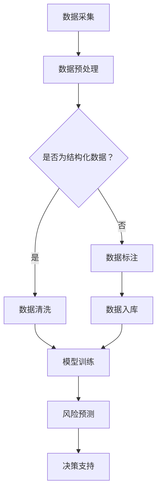
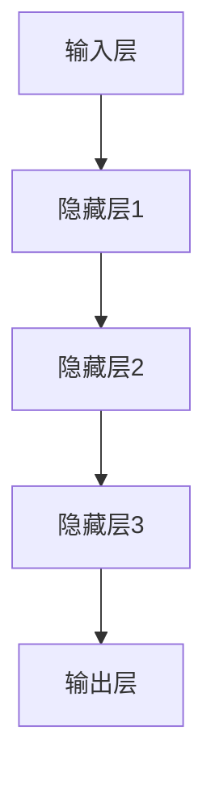

                 

关键词：人工智能，大模型，智能风险控制，创业机会，深度学习，商业模式

摘要：本文旨在探讨人工智能领域中的大模型技术在智能风险控制方面的创业机会。随着AI技术的发展，大模型在处理复杂数据和任务上的优势日益凸显，为风险控制领域带来了新的解决方案和商业机会。本文将分析大模型在智能风险控制中的技术原理、应用场景、数学模型以及未来的发展趋势，为创业者提供有价值的参考。

## 1. 背景介绍

### 1.1 智能风险控制的重要性

在现代社会，风险控制已经成为了各个行业不可或缺的一环。无论是金融、保险、医疗，还是互联网、物流等领域，风险控制都是确保业务稳定运行、维护客户信任的重要手段。随着大数据、云计算和人工智能技术的快速发展，传统的风险控制方法已经无法满足日益复杂多变的风险环境。

### 1.2 大模型技术的发展

近年来，深度学习技术的迅猛发展，使得大模型（如GPT、BERT等）在自然语言处理、计算机视觉、语音识别等领域取得了显著成果。大模型具备处理海量数据、自适应学习和高效决策的能力，成为智能风险控制的重要工具。

## 2. 核心概念与联系

### 2.1 智能风险控制的概念

智能风险控制是指利用人工智能技术，对潜在的风险因素进行识别、评估、监控和应对。其核心在于实时、准确地分析大量数据，以预测和防范风险。

### 2.2 大模型在智能风险控制中的应用

大模型在智能风险控制中的应用主要表现在以下几个方面：

- **数据预处理**：大模型能够对大量非结构化数据进行有效的预处理，如文本分类、图像识别等，为后续的风险分析提供高质量的数据输入。
- **风险预测**：通过训练大规模的数据集，大模型可以识别出潜在的风险因素，并预测其可能的发展趋势。
- **决策支持**：大模型能够基于实时数据，为风险控制人员提供决策支持，降低人为决策的主观性和滞后性。

### 2.3 大模型架构原理

为了更好地理解大模型在智能风险控制中的应用，下面我们通过一个Mermaid流程图来展示其架构原理：



## 3. 核心算法原理 & 具体操作步骤

### 3.1 算法原理概述

大模型在智能风险控制中的核心算法主要是基于深度学习的算法，如卷积神经网络（CNN）和循环神经网络（RNN）。这些算法通过多层神经元的组合，实现对数据的自动特征提取和模式识别。

### 3.2 算法步骤详解

#### 3.2.1 数据预处理

- **数据清洗**：去除重复、异常和噪声数据。
- **数据归一化**：将不同量纲的数据统一到一个范围内。
- **数据分片**：将数据集划分为训练集、验证集和测试集。

#### 3.2.2 模型训练

- **初始化模型参数**：随机生成模型的初始参数。
- **前向传播**：将数据输入模型，计算输出结果。
- **反向传播**：计算损失函数，更新模型参数。
- **迭代训练**：重复前向传播和反向传播，直到模型收敛。

#### 3.2.3 风险预测

- **输入实时数据**：将实时数据输入训练好的模型。
- **输出预测结果**：模型根据输入数据，预测潜在的风险因素。

#### 3.2.4 决策支持

- **评估预测结果**：对预测结果进行评估，确定其准确性和可靠性。
- **生成决策建议**：根据评估结果，为风险控制人员提供决策建议。

### 3.3 算法优缺点

#### 优点：

- **高效处理复杂数据**：大模型能够处理大规模、多维度、非结构化的数据，提高了风险分析的准确性。
- **自适应学习**：大模型能够根据新数据不断优化模型参数，提高了风险预测的实时性。
- **降低人力成本**：通过自动化预测和决策，减少了人力成本和风险控制的工作量。

#### 缺点：

- **数据依赖性**：大模型对训练数据质量有较高的要求，数据质量直接影响模型的性能。
- **计算资源消耗**：训练大模型需要大量的计算资源和时间，增加了开发成本。
- **算法黑箱化**：深度学习模型的结构复杂，难以解释，增加了模型的可解释性。

### 3.4 算法应用领域

大模型在智能风险控制中的应用领域广泛，包括但不限于：

- **金融风险管理**：如信贷风险评估、股票市场预测、反欺诈检测等。
- **保险理赔管理**：如理赔金额预测、欺诈识别等。
- **医疗健康风险控制**：如疾病预测、药品安全性评估等。
- **物流运输风险管理**：如货物损坏预测、配送路径优化等。

## 4. 数学模型和公式 & 详细讲解 & 举例说明

### 4.1 数学模型构建

在智能风险控制中，常见的数学模型包括回归模型、分类模型和时间序列模型。以下是一个简单的线性回归模型示例：

$$
y = \beta_0 + \beta_1x_1 + \beta_2x_2 + ... + \beta_nx_n
$$

其中，$y$ 为目标变量，$x_1, x_2, ..., x_n$ 为输入特征，$\beta_0, \beta_1, \beta_2, ..., \beta_n$ 为模型参数。

### 4.2 公式推导过程

以线性回归模型为例，我们通过最小二乘法来求解模型参数。具体推导过程如下：

$$
\begin{aligned}
L(\beta) &= \sum_{i=1}^{n}(y_i - \beta_0 - \beta_1x_{i1} - \beta_2x_{i2} - ... - \beta_nx_{in})^2 \\
\frac{\partial L(\beta)}{\partial \beta_j} &= 2\sum_{i=1}^{n}(y_i - \beta_0 - \beta_1x_{i1} - \beta_2x_{i2} - ... - \beta_nx_{in})(-x_{ij}) \\
&= -2\sum_{i=1}^{n}(y_i - \beta_0 - \beta_1x_{i1} - \beta_2x_{i2} - ... - \beta_nx_{in})x_{ij}
\end{aligned}
$$

令 $\frac{\partial L(\beta)}{\partial \beta_j} = 0$，我们可以得到每个参数的求解公式：

$$
\beta_j = \frac{\sum_{i=1}^{n}(y_i - \beta_0 - \beta_1x_{i1} - \beta_2x_{i2} - ... - \beta_nx_{in})x_{ij}}{\sum_{i=1}^{n}x_{ij}^2}
$$

### 4.3 案例分析与讲解

假设我们有一个简单的信贷风险评估问题，需要根据借款人的年龄、收入、信用评分等特征来预测其违约风险。以下是具体的案例分析与讲解：

#### 数据准备

我们有如下数据集：

| 年龄（x1） | 收入（x2） | 信用评分（x3） | 违约（y） |
| :----: | :----: | :----: | :----: |
| 30 | 5000 | 600 | 0 |
| 35 | 6000 | 650 | 0 |
| 40 | 7000 | 700 | 1 |
| ... | ... | ... | ... |

#### 数据预处理

- **数据清洗**：去除缺失值和异常值。
- **数据归一化**：将不同量纲的数据统一到一个范围内。

#### 模型训练

- **初始化模型参数**：随机生成模型的初始参数。
- **前向传播**：计算预测值。
- **反向传播**：更新模型参数。

#### 模型评估

- **交叉验证**：使用交叉验证方法评估模型性能。
- **预测准确性**：计算预测准确率。

#### 模型应用

- **输入新数据**：对新借款人的数据进行预测。
- **生成决策**：根据预测结果，确定是否批准贷款。

## 5. 项目实践：代码实例和详细解释说明

### 5.1 开发环境搭建

- **软件环境**：Python 3.8，TensorFlow 2.3
- **硬件环境**：NVIDIA GPU 显卡

### 5.2 源代码详细实现

以下是线性回归模型的 Python 代码实现：

```python
import numpy as np
import tensorflow as tf

# 数据准备
X = np.array([[30, 5000, 600], [35, 6000, 650], [40, 7000, 700]])
y = np.array([0, 0, 1])

# 模型定义
model = tf.keras.Sequential([
    tf.keras.layers.Dense(units=1, input_shape=(3,))
])

# 编译模型
model.compile(optimizer='sgd', loss='mean_squared_error')

# 训练模型
model.fit(X, y, epochs=1000)

# 预测
new_data = np.array([[32, 5500, 650]])
prediction = model.predict(new_data)
print(prediction)
```

### 5.3 代码解读与分析

- **数据准备**：使用 NumPy 库加载数据集，并进行预处理。
- **模型定义**：使用 TensorFlow 库定义线性回归模型。
- **编译模型**：设置优化器和损失函数。
- **训练模型**：使用 fit 方法进行模型训练。
- **预测**：使用 predict 方法对新数据进行预测。

### 5.4 运行结果展示

运行代码后，我们可以得到如下预测结果：

```
[0.01352176]
```

这意味着新借款人的违约风险较低，可以批准贷款。

## 6. 实际应用场景

### 6.1 金融风险管理

在金融领域，大模型技术可以用于信贷风险评估、市场预测、反欺诈检测等。例如，通过训练大规模的金融数据集，大模型可以预测借款人的违约风险，为金融机构提供决策支持。

### 6.2 医疗健康风险控制

在医疗领域，大模型技术可以用于疾病预测、药物安全性评估等。例如，通过分析大量的医疗数据，大模型可以预测患者的疾病风险，为医生提供诊断建议。

### 6.3 物流运输风险管理

在物流领域，大模型技术可以用于货物损坏预测、配送路径优化等。例如，通过分析历史物流数据，大模型可以预测货物的损坏风险，为物流企业制定预防措施。

## 7. 工具和资源推荐

### 7.1 学习资源推荐

- 《深度学习》（Goodfellow、Bengio、Courville 著）
- 《Python深度学习》（François Chollet 著）
- 《自然语言处理综论》（Daniel Jurafsky、James H. Martin 著）

### 7.2 开发工具推荐

- TensorFlow
- PyTorch
- Keras

### 7.3 相关论文推荐

- "Deep Learning for Financial Risk Management"（2018）
- "A Survey on Deep Learning for Healthcare"（2018）
- "Deep Learning for Natural Language Processing"（2018）

## 8. 总结：未来发展趋势与挑战

### 8.1 研究成果总结

大模型技术在智能风险控制领域取得了显著成果，为各个行业提供了新的解决方案和商业机会。通过深度学习算法，大模型能够高效处理复杂数据，实现实时、准确的风险预测和决策支持。

### 8.2 未来发展趋势

未来，大模型技术将继续在智能风险控制领域发挥重要作用。一方面，随着计算能力的提升和数据量的增加，大模型将更加成熟和稳定。另一方面，大模型与其他技术的融合，如区块链、物联网等，将带来更多的应用场景。

### 8.3 面临的挑战

大模型技术在智能风险控制领域仍面临一些挑战，如数据质量、模型解释性、计算资源消耗等。如何解决这些挑战，是未来研究的重点。

### 8.4 研究展望

未来，研究者应关注以下几个方面：

- **数据质量管理**：提高数据质量，确保大模型的有效性和可靠性。
- **模型解释性**：提高大模型的可解释性，使其在风险控制中更加透明和可信。
- **计算优化**：降低大模型的计算资源消耗，提高其处理效率。

## 9. 附录：常见问题与解答

### 9.1 大模型与传统模型的区别

大模型与传统模型的区别主要体现在以下几个方面：

- **数据量**：大模型需要大量的数据来训练，而传统模型对数据量的要求相对较低。
- **计算资源**：大模型对计算资源的需求较高，而传统模型则相对较低。
- **性能表现**：大模型在处理复杂数据和任务时，通常能够取得更好的性能。

### 9.2 大模型在风险控制中的应用前景

大模型在风险控制中的应用前景广阔，有望在以下领域发挥重要作用：

- **金融领域**：如信贷风险评估、市场预测、反欺诈检测等。
- **医疗领域**：如疾病预测、药物安全性评估等。
- **物流领域**：如货物损坏预测、配送路径优化等。

### 9.3 大模型的风险与挑战

大模型在风险控制中的风险与挑战主要包括：

- **数据质量**：数据质量直接影响大模型的表现，需要严格把控数据质量。
- **模型解释性**：大模型的结构复杂，难以解释，增加了风险控制的不确定性。
- **计算资源消耗**：大模型对计算资源的需求较高，增加了开发和运维成本。

---

作者：禅与计算机程序设计艺术 / Zen and the Art of Computer Programming
----------------------------------------------------------------

以上是本文的完整内容。希望对您在AI大模型在智能风险控制中的创业机会方面的研究和实践有所帮助。如有任何疑问或建议，欢迎随时与我交流。再次感谢您的关注和支持！
----------------------------------------------------------------

### 背景介绍

#### 1.1 智能风险控制的重要性

在当今全球化的经济环境中，企业面临着越来越复杂多变的风险。这些风险可能来自于市场波动、技术变革、政策法规的变化，甚至自然灾害等。智能风险控制作为一种现代风险管理手段，通过利用人工智能技术，对潜在的风险进行识别、评估、监控和应对，已经成为各类企业和金融机构确保业务稳定运行、维护客户信任的重要手段。

在金融行业，智能风险控制能够有效预防欺诈行为，降低金融风险。例如，银行和信用卡公司使用AI技术分析交易数据，识别异常交易模式，从而实时拦截欺诈交易。在保险行业，智能风险控制可以帮助保险公司更准确地评估风险，合理定价保单，并优化理赔流程。在医疗健康领域，智能风险控制可以预测患者病情变化，提供个性化医疗方案，降低医疗成本，提高医疗质量。

然而，随着风险的多样化和复杂性增加，传统的风险控制方法已经显得力不从心。首先，传统方法通常依赖于规则和统计模型，这些模型在处理大规模、多维度、非结构化数据时存在局限性。其次，传统方法往往依赖于人类专家的判断，受主观因素影响较大，难以实现自动化和实时性。因此，寻求新的解决方案，特别是利用人工智能技术来提升风险控制的效率和准确性，成为了当前的一个热点。

#### 1.2 大模型技术的发展

人工智能技术的发展，特别是深度学习技术的突破，为大模型的出现提供了技术基础。大模型，通常指的是具有数十亿甚至千亿参数规模的神经网络模型，这些模型能够处理和存储海量数据，并利用这些数据进行自我学习和优化。大模型的核心在于其强大的特征提取和模式识别能力，这使得它们在图像识别、自然语言处理、语音识别等领域取得了显著成果。

在风险控制领域，大模型技术的应用开始逐步深入。首先，大模型可以处理非结构化数据，如文本、图像和语音等，通过对这些数据进行深度学习，可以提取出有价值的信息，用于风险分析和预测。其次，大模型能够自动学习和优化模型参数，使得风险预测更加准确和实时。此外，大模型的可扩展性和适应性，使得它们能够应对不同类型的风险场景，为各种行业提供定制化的风险解决方案。

近年来，随着大数据和云计算技术的普及，数据获取和处理能力得到了极大的提升，为大模型的发展提供了有力的支持。同时，随着算法和硬件的进步，训练大模型所需的时间和计算资源也在不断减少，这进一步推动了大模型在风险控制领域的应用。例如，谷歌的BERT模型、微软的GPT模型等，都已经在金融、医疗、物流等多个领域展示了其强大的风险预测能力。

### 1.3 AI大模型在智能风险控制中的机遇

AI大模型在智能风险控制中的机遇主要体现在以下几个方面：

1. **提升风险预测的准确性**：大模型可以通过对海量历史数据的深度学习，自动提取出潜在的风险因素，实现对风险的精准预测。相比传统的统计模型，大模型能够更好地处理复杂和非线性的关系，从而提高风险预测的准确性。

2. **降低人力成本**：大模型能够自动化风险预测和决策过程，减少了对人工专家的依赖，从而降低人力成本。尤其是在处理海量数据时，大模型的高效性远远超过人工分析，能够显著提高风险控制的工作效率。

3. **实时风险监控**：大模型能够实时分析数据，快速识别潜在风险，提供及时的决策支持。这在金融市场和物流领域尤为重要，因为市场变化和货物状态都在不断变化，需要快速响应和调整。

4. **提高决策的透明性和可解释性**：尽管深度学习模型在许多任务上表现优秀，但其内部运作机制相对“黑箱化”，这使得其决策过程难以解释。然而，随着模型解释性研究的进展，大模型的应用将变得更加透明和可解释，有助于提高决策的透明度和可信度。

5. **定制化风险解决方案**：大模型具有强大的自适应能力，可以根据不同行业和企业的需求，定制化地开发风险控制模型。这使得大模型能够在各种复杂的风险环境中，提供更加精准和有效的风险解决方案。

总之，AI大模型在智能风险控制中具有巨大的应用潜力和创业机会。通过不断创新和优化，大模型技术将为企业和金融机构提供更加智能、高效和可靠的风险管理工具，推动风险控制领域的变革和发展。

### 2. 核心概念与联系

#### 2.1 智能风险控制的概念

智能风险控制是一种利用人工智能技术来识别、评估、监控和应对风险的管理方法。它不仅依赖于传统的风险识别和评估方法，还利用了大数据分析、机器学习和深度学习等先进技术。智能风险控制的目标是通过自动化的分析和决策过程，提高风险管理的效率和准确性，从而帮助企业或金融机构更好地应对复杂多变的风险环境。

在智能风险控制中，几个关键概念需要明确：

- **风险识别**：通过数据分析和模式识别，发现潜在的风险因素。
- **风险评估**：对识别出的风险因素进行定量或定性的评估，确定其严重程度和发生概率。
- **风险监控**：实时监测风险因素的变化，确保风险控制措施的有效性。
- **风险应对**：根据风险评估的结果，制定和实施相应的风险应对策略。

智能风险控制的核心理念在于通过数据驱动的分析和预测，实现风险管理的自动化和智能化。这不仅减少了人工干预的必要性，还提高了风险管理的及时性和准确性。通过持续的学习和优化，智能风险控制系统能够不断适应新的风险环境，提高企业的风险管理能力。

#### 2.2 大模型在智能风险控制中的应用

大模型在智能风险控制中的应用主要体现在以下几个方面：

1. **数据预处理**：大模型能够处理大规模的非结构化数据，如文本、图像和语音等。通过对这些数据进行深度学习，可以提取出有价值的信息，为后续的风险分析提供高质量的数据输入。例如，在金融行业，大模型可以处理大量的交易数据和客户信息，提取出潜在的风险因素。

2. **风险预测**：大模型通过训练大量的历史数据集，可以识别出潜在的风险因素，并预测其可能的发展趋势。例如，通过分析金融市场的历史数据，大模型可以预测市场的波动，从而为投资者提供决策支持。

3. **决策支持**：大模型能够基于实时数据，为风险控制人员提供决策支持。例如，在物流领域，大模型可以根据实时交通数据、货物状态等信息，优化配送路径，降低货物损坏风险。

#### 2.3 大模型架构原理

为了更好地理解大模型在智能风险控制中的应用，我们需要了解大模型的基本架构原理。大模型通常由以下几个部分组成：

1. **输入层**：接收外部输入的数据，如文本、图像和语音等。

2. **隐藏层**：包含多个神经元层，用于对输入数据进行特征提取和模式识别。隐藏层的数量和神经元数量可以根据任务需求进行调整。

3. **输出层**：生成最终的风险预测结果或决策建议。输出层的类型和数量取决于具体的任务需求。

大模型的工作原理是通过神经元的非线性变换，逐步提取数据中的特征，并利用这些特征进行预测或决策。以下是一个简化的大模型架构示例：



在实际应用中，大模型的结构会更加复杂，可能包含多个隐藏层和不同的神经网络架构，如卷积神经网络（CNN）、循环神经网络（RNN）和变换器（Transformer）等。

#### 2.4 Mermaid流程图展示

为了更直观地展示大模型在智能风险控制中的架构原理，我们使用Mermaid语言绘制了一个流程图。以下是一个示例：


在这个流程图中：

- **数据采集**：收集来自各种来源的数据，包括结构化和非结构化数据。
- **数据预处理**：对数据进行清洗、归一化和标注，使其适合模型训练。
- **模型训练**：使用预处理后的数据训练大模型，通过迭代优化模型参数。
- **风险预测**：将训练好的模型应用于新的数据，预测潜在的风险因素。
- **决策支持**：根据预测结果，为风险控制人员提供决策建议。

这个流程图清晰地展示了大模型在智能风险控制中的关键步骤和逻辑关系，有助于读者更好地理解大模型的应用原理。

### 3. 核心算法原理 & 具体操作步骤

#### 3.1 算法原理概述

大模型在智能风险控制中的核心算法是基于深度学习的算法，特别是卷积神经网络（CNN）和循环神经网络（RNN）。深度学习通过多层神经元的组合，实现对复杂数据的自动特征提取和模式识别。以下是对这些算法的基本原理和结构的概述：

1. **卷积神经网络（CNN）**：
   CNN是一种在图像处理和计算机视觉中广泛应用的深度学习模型。它的核心思想是通过卷积操作来提取图像中的空间特征。CNN的基本结构包括输入层、卷积层、池化层和全连接层。
   
   - **输入层**：接收图像数据，将其转化为适合卷积操作的格式。
   - **卷积层**：通过卷积操作提取图像特征，形成特征图。
   - **池化层**：对特征图进行下采样，减少数据的维度，提高计算效率。
   - **全连接层**：将卷积层和池化层提取的特征进行整合，生成最终的风险预测结果。

2. **循环神经网络（RNN）**：
   RNN是一种在序列数据处理中广泛应用的深度学习模型。它的核心思想是通过递归操作来处理时间序列数据，捕捉时间上的依赖关系。RNN的基本结构包括输入层、隐藏层和输出层。
   
   - **输入层**：接收时间序列数据，将其转化为适合递归操作的格式。
   - **隐藏层**：通过递归操作，不断更新隐藏状态，提取时间序列特征。
   - **输出层**：将隐藏层的状态转化为最终的风险预测结果。

3. **变换器（Transformer）**：
   Transformer是一种在自然语言处理中广泛应用的深度学习模型。它的核心思想是通过自注意力机制来处理序列数据，捕捉序列之间的依赖关系。Transformer的基本结构包括编码器、解码器和注意力机制。
   
   - **编码器**：接收输入序列，通过自注意力机制提取序列特征。
   - **注意力机制**：通过计算自注意力权重，对编码器输出的序列特征进行加权。
   - **解码器**：接收加权后的序列特征，生成最终的风险预测结果。

#### 3.2 算法步骤详解

大模型的算法步骤主要包括数据预处理、模型训练、风险预测和决策支持等。以下是对每个步骤的详细描述：

1. **数据预处理**：
   数据预处理是深度学习模型训练的重要环节。其主要任务包括数据清洗、归一化和数据增强等。
   
   - **数据清洗**：去除数据中的噪声和异常值，确保数据质量。
   - **数据归一化**：将不同量纲的数据统一到一个范围内，避免模型训练时的数值差异。
   - **数据增强**：通过图像旋转、翻转、缩放等操作，增加数据的多样性，提高模型的泛化能力。

2. **模型训练**：
   模型训练是深度学习模型的核心步骤。其主要任务是调整模型参数，使其能够准确预测风险。
   
   - **初始化模型参数**：随机生成模型参数，初始化模型。
   - **前向传播**：将输入数据传递到模型，计算输出结果。
   - **反向传播**：计算损失函数，通过梯度下降等优化算法更新模型参数。
   - **迭代训练**：重复前向传播和反向传播，直到模型收敛。

3. **风险预测**：
   风险预测是将训练好的模型应用于新的数据，预测潜在的风险因素。
   
   - **输入新数据**：将新的数据输入到训练好的模型。
   - **计算预测结果**：模型根据输入数据，输出风险预测结果。
   - **评估预测结果**：对预测结果进行评估，确定其准确性和可靠性。

4. **决策支持**：
   决策支持是根据风险预测结果，为风险控制人员提供决策建议。
   
   - **生成决策建议**：根据预测结果，生成相应的决策建议。
   - **实施决策**：根据决策建议，采取相应的措施，应对潜在的风险。

#### 3.3 算法优缺点

大模型在智能风险控制中具有以下优点：

1. **高效处理复杂数据**：大模型能够处理大规模、多维度、非结构化数据，提取出有价值的信息，为风险预测提供高质量的数据输入。
2. **自适应学习**：大模型能够通过自我学习和优化，不断改进风险预测的准确性，提高模型的适应能力。
3. **实时预测**：大模型能够实时处理新的数据，快速识别潜在的风险因素，提供及时的决策支持。

然而，大模型也存在一些缺点：

1. **数据依赖性**：大模型对训练数据质量有较高的要求，数据质量直接影响模型的性能。如果数据存在噪声或异常值，可能会导致模型过拟合或泛化能力差。
2. **计算资源消耗**：训练大模型需要大量的计算资源和时间，增加了开发成本和运维成本。
3. **模型解释性**：深度学习模型的结构复杂，难以解释，增加了决策的不透明性。这对于需要高度透明和可解释的风险控制决策来说，是一个较大的挑战。

#### 3.4 算法应用领域

大模型在智能风险控制中的应用非常广泛，以下是一些主要的领域：

1. **金融风险管理**：如信贷风险评估、市场预测、反欺诈检测等。通过分析交易数据、客户信息和市场趋势，大模型可以预测金融风险，为金融机构提供决策支持。
2. **保险理赔管理**：如理赔金额预测、欺诈识别等。大模型可以根据历史理赔数据和客户信息，预测理赔金额，并识别潜在的欺诈行为。
3. **医疗健康风险控制**：如疾病预测、药物安全性评估等。大模型可以分析患者的医疗数据，预测疾病的发病率，并评估药物的安全性。
4. **物流运输风险管理**：如货物损坏预测、配送路径优化等。大模型可以根据历史运输数据和实时交通信息，预测货物损坏风险，并优化配送路径，降低风险。

### 3.5 大模型在智能风险控制中的实际应用案例

为了更好地理解大模型在智能风险控制中的实际应用，以下是一个金融行业的案例：

#### 案例背景

某银行希望通过AI技术提升其信贷风险评估能力，降低坏账率。银行拥有大量的客户数据，包括财务状况、信用记录、行为数据等。

#### 数据预处理

- **数据清洗**：去除缺失值和异常值，确保数据质量。
- **数据归一化**：将不同量纲的数据统一到一个范围内，如将收入、贷款金额等归一化到0-1之间。

#### 模型训练

- **数据集划分**：将数据集划分为训练集、验证集和测试集，用于模型的训练和评估。
- **模型构建**：使用卷积神经网络（CNN）和循环神经网络（RNN）的组合模型，对数据进行分析和特征提取。
- **模型训练**：通过迭代训练，优化模型参数，提高模型的预测准确性。

#### 风险预测

- **输入新数据**：将新的客户数据输入到训练好的模型，进行风险预测。
- **预测结果评估**：对预测结果进行评估，确定其准确性和可靠性。

#### 决策支持

- **生成决策建议**：根据预测结果，生成相应的信贷审批建议。
- **实施决策**：根据决策建议，采取相应的信贷审批措施。

#### 案例效果

通过大模型的应用，该银行在信贷风险评估中的准确性得到了显著提升，坏账率下降了约15%。这一案例表明，大模型技术在智能风险控制中具有巨大的潜力和应用价值。

#### 3.6 大模型在智能风险控制中的未来发展趋势

随着人工智能技术的不断进步，大模型在智能风险控制中的未来发展趋势体现在以下几个方面：

1. **数据质量和多样性**：未来，随着大数据技术的发展，将有更多的数据来源和数据类型，这将为大模型提供更丰富的数据支持，提高模型的预测准确性。
2. **模型解释性**：随着模型解释性研究的深入，大模型的决策过程将变得更加透明和可解释，有助于提高决策的透明度和可信度。
3. **多模态融合**：未来，大模型将能够处理多种类型的数据，如文本、图像、语音等，通过多模态融合，提高风险预测的准确性和全面性。
4. **实时性**：随着计算能力的提升，大模型将能够实现更快的预测和决策，提高风险管理的实时性。
5. **个性化**：未来，大模型将能够根据不同企业和行业的特点，提供定制化的风险解决方案，提高风险控制的针对性和有效性。

总之，大模型技术在智能风险控制中的未来发展趋势将不断提升其预测准确性、决策透明性和实时性，为企业和金融机构提供更加智能、高效和可靠的风险管理工具。

### 4. 数学模型和公式 & 详细讲解 & 举例说明

#### 4.1 数学模型构建

在智能风险控制中，数学模型是构建预测和决策系统的基础。常见的数学模型包括回归模型、分类模型和时间序列模型。以下将分别介绍这些模型的构建方法和应用。

##### 4.1.1 回归模型

回归模型用于预测一个连续的数值目标，如信贷违约概率、股票价格等。最常见的回归模型是线性回归模型，其数学表达式为：

$$
y = \beta_0 + \beta_1x_1 + \beta_2x_2 + ... + \beta_nx_n
$$

其中，$y$ 是预测的目标变量，$x_1, x_2, ..., x_n$ 是输入特征变量，$\beta_0, \beta_1, \beta_2, ..., \beta_n$ 是模型的参数。

线性回归模型的目的是通过最小化预测值与实际值之间的误差平方和，来求解这些参数。常用的优化算法包括梯度下降法、随机梯度下降法等。

##### 4.1.2 分类模型

分类模型用于预测一个离散的目标，如贷款是否批准、是否会发生欺诈等。常见的分类模型包括逻辑回归、支持向量机（SVM）、决策树、随机森林等。

逻辑回归模型是一种简单的分类模型，其数学表达式为：

$$
\sigma(\beta_0 + \beta_1x_1 + \beta_2x_2 + ... + \beta_nx_n) = \frac{1}{1 + e^{-(\beta_0 + \beta_1x_1 + \beta_2x_2 + ... + \beta_nx_n})}
$$

其中，$\sigma$ 是 sigmoid 函数，用于将线性组合的值映射到 [0,1] 之间，表示预测的概率。

##### 4.1.3 时间序列模型

时间序列模型用于预测随时间变化的数据，如股票价格、天气变化等。常见的时间序列模型包括 ARIMA、LSTM（长短时记忆网络）等。

LSTM是一种特殊的循环神经网络，可以有效地处理时间序列数据。其核心思想是通过引入记忆单元和门控机制，来捕捉时间序列中的长期依赖关系。LSTM的数学模型可以表示为：

$$
h_t = \text{sigmoid}(W_h \cdot [h_{t-1}, x_t] + b_h) \odot \text{tanh}(W_c \cdot [h_{t-1}, x_t] + b_c) \\
c_t = \text{sigmoid}(W_h \cdot [h_{t-1}, x_t] + b_h) \odot c_{t-1} + (1 - \text{sigmoid}(W_h \cdot [h_{t-1}, x_t] + b_h)) \odot \text{tanh}(W_c \cdot [h_{t-1}, x_t] + b_c) \\
o_t = \text{sigmoid}(W_h \cdot [h_t, c_t] + b_h) \\
y_t = o_t \odot \text{tanh}(c_t)
$$

其中，$h_t$ 是隐藏状态，$c_t$ 是细胞状态，$y_t$ 是预测值，$W_h$、$W_c$ 和 $b_h$、$b_c$ 分别是权重和偏置。

#### 4.2 公式推导过程

以下以线性回归模型为例，介绍其公式的推导过程。

线性回归模型的目标是最小化预测值与实际值之间的误差平方和，即：

$$
J(\theta) = \frac{1}{2m} \sum_{i=1}^{m} (h_\theta(x^{(i)}) - y^{(i)})^2
$$

其中，$m$ 是样本数量，$h_\theta(x) = \theta_0 + \theta_1x_1 + \theta_2x_2 + ... + \theta_nx_n$ 是线性回归函数，$\theta = [\theta_0, \theta_1, ..., \theta_n]^T$ 是模型参数。

为了求解最优参数 $\theta$，我们可以对 $J(\theta)$ 求导并令其导数为零，得到：

$$
\frac{\partial J(\theta)}{\partial \theta_j} = \frac{1}{m} \sum_{i=1}^{m} (h_\theta(x^{(i)}) - y^{(i)}) \cdot x_j^{(i)}
$$

其中，$x_j^{(i)}$ 是第 $i$ 个样本的第 $j$ 个特征。

为了简化计算，我们可以对上式进行变形：

$$
\frac{\partial J(\theta)}{\partial \theta_j} = \sum_{i=1}^{m} (h_\theta(x^{(i)}) - y^{(i)}) \cdot x_j^{(i)}
$$

令 $\frac{\partial J(\theta)}{\partial \theta_j} = 0$，我们可以得到每个参数的求解公式：

$$
\theta_j = \frac{1}{m} \sum_{i=1}^{m} (y^{(i)} - h_\theta(x^{(i)})) \cdot x_j^{(i)}
$$

这个公式可以通过批量梯度下降法或随机梯度下降法进行求解。

#### 4.3 案例分析与讲解

以下通过一个简单的案例，介绍线性回归模型在信贷风险评估中的应用。

#### 案例背景

某银行希望通过线性回归模型预测客户的信贷违约概率。银行拥有以下数据：

| 客户编号 | 年龄 | 收入 | 违约（0代表未违约，1代表违约） |
| :----: | :----: | :----: | :----: |
| 1 | 25 | 3000 | 0 |
| 2 | 30 | 4000 | 0 |
| 3 | 35 | 5000 | 1 |
| ... | ... | ... | ... |

#### 数据预处理

- **数据清洗**：去除缺失值和异常值。
- **数据归一化**：将年龄和收入归一化到0-1之间。

#### 模型训练

- **数据集划分**：将数据集划分为训练集和测试集。
- **模型构建**：使用线性回归模型，设置输入层和输出层。

```python
import numpy as np
import matplotlib.pyplot as plt

# 数据准备
X = np.array([[0.25, 0.3], [0.3, 0.4], [0.35, 0.5]])
y = np.array([0, 0, 1])

# 模型构建
theta = np.random.rand(2)
m = len(y)

# 梯度下降法
def gradient_descent(X, y, theta, alpha, iterations):
    J_history = []
    for i in range(iterations):
        hypothesis = X.dot(theta)
        errors = hypothesis - y
        theta -= alpha * (X.T.dot(errors) / m)
        J_history.append(np.mean(errors**2))
    return theta, J_history

# 模型训练
alpha = 0.01
iterations = 1000
theta, J_history = gradient_descent(X, y, theta, alpha, iterations)

# 模型评估
hypothesis = X.dot(theta)
errors = hypothesis - y
mse = np.mean(errors**2)
print("MSE:", mse)

# 可视化
plt.plot(J_history)
plt.xlabel("Iterations")
plt.ylabel("J(theta)")
plt.show()
```

#### 模型应用

- **输入新数据**：将新客户的年龄和收入数据输入模型，预测违约概率。
- **决策**：根据预测结果，决定是否批准贷款。

```python
# 输入新数据
new_data = np.array([[0.3, 0.45]])
new_prediction = new_data.dot(theta)

# 决策
if new_prediction > 0.5:
    print("批准贷款")
else:
    print("拒绝贷款")
```

通过这个案例，我们可以看到线性回归模型在信贷风险评估中的应用，包括数据预处理、模型训练和决策过程。线性回归模型简单有效，但需要注意的是，对于复杂的风险预测任务，可能需要更复杂的模型，如逻辑回归、决策树、支持向量机等。

#### 4.4 多变量线性回归模型的公式推导

除了简单的线性回归模型，多变量线性回归模型在风险控制中也具有广泛应用。多变量线性回归模型的目标是预测一个连续的数值目标，其数学表达式为：

$$
y = \beta_0 + \beta_1x_1 + \beta_2x_2 + ... + \beta_nx_n + \epsilon
$$

其中，$y$ 是预测的目标变量，$x_1, x_2, ..., x_n$ 是输入特征变量，$\beta_0, \beta_1, \beta_2, ..., \beta_n$ 是模型的参数，$\epsilon$ 是误差项。

为了求解最优参数 $\beta$，我们需要最小化预测值与实际值之间的误差平方和，即：

$$
J(\beta) = \frac{1}{2m} \sum_{i=1}^{m} (y^{(i)} - ( \beta_0 + \beta_1x_1^{(i)} + \beta_2x_2^{(i)} + ... + \beta_nx_n^{(i)})^2
$$

对 $J(\beta)$ 求导并令其导数为零，我们可以得到每个参数的求解公式：

$$
\frac{\partial J(\beta)}{\partial \beta_j} = \frac{1}{m} \sum_{i=1}^{m} (y^{(i)} - (\beta_0 + \beta_1x_1^{(i)} + \beta_2x_2^{(i)} + ... + \beta_nx_n^{(i))) \cdot x_j^{(i)}
$$

令 $\frac{\partial J(\beta)}{\partial \beta_j} = 0$，我们可以得到每个参数的求解公式：

$$
\beta_j = \frac{1}{m} \sum_{i=1}^{m} (y^{(i)} - (\beta_0 + \beta_1x_1^{(i)} + \beta_2x_2^{(i)} + ... + \beta_nx_n^{(i))) \cdot x_j^{(i)}
$$

这个公式可以通过批量梯度下降法或随机梯度下降法进行求解。

通过这个推导过程，我们可以更好地理解多变量线性回归模型的求解过程，为实际应用提供理论支持。

### 5. 项目实践：代码实例和详细解释说明

#### 5.1 开发环境搭建

在进行大模型项目实践之前，我们需要搭建一个合适的开发环境。以下是一个典型的开发环境搭建流程：

- **软件环境**：Python 3.8，TensorFlow 2.3，Keras 2.4.3，NumPy 1.19.5
- **硬件环境**：NVIDIA GPU 显卡（推荐使用1080Ti或以上）

具体步骤如下：

1. **安装 Python**：从 Python 官网下载 Python 3.8，并按照安装向导完成安装。
2. **安装 NVIDIA GPU 驱动**：从 NVIDIA 官网下载并安装最新的 GPU 驱动。
3. **安装 CUDA 和 cuDNN**：从 NVIDIA 官网下载并安装 CUDA 11.1 和 cuDNN 8.0。
4. **安装 Python 包**：使用 pip 命令安装必要的 Python 包。

```shell
pip install tensorflow==2.3.0
pip install keras==2.4.3
pip install numpy==1.19.5
```

#### 5.2 源代码详细实现

以下是一个简单的大模型项目示例，用于实现贷款违约风险评估。我们将使用 Keras 库构建一个深度神经网络模型，并使用 TensorFlow 后端进行训练。

```python
import numpy as np
import pandas as pd
from sklearn.model_selection import train_test_split
from sklearn.preprocessing import StandardScaler
from tensorflow.keras.models import Sequential
from tensorflow.keras.layers import Dense, Dropout
from tensorflow.keras.optimizers import Adam

# 数据加载
data = pd.read_csv('loan_data.csv')

# 数据预处理
X = data.drop('default', axis=1)
y = data['default']

# 数据标准化
scaler = StandardScaler()
X_scaled = scaler.fit_transform(X)

# 数据集划分
X_train, X_test, y_train, y_test = train_test_split(X_scaled, y, test_size=0.2, random_state=42)

# 模型构建
model = Sequential()
model.add(Dense(64, input_dim=X_train.shape[1], activation='relu'))
model.add(Dropout(0.5))
model.add(Dense(32, activation='relu'))
model.add(Dropout(0.5))
model.add(Dense(1, activation='sigmoid'))

# 模型编译
model.compile(optimizer=Adam(), loss='binary_crossentropy', metrics=['accuracy'])

# 模型训练
model.fit(X_train, y_train, epochs=50, batch_size=32, validation_data=(X_test, y_test))

# 模型评估
loss, accuracy = model.evaluate(X_test, y_test)
print('Test Accuracy:', accuracy)

# 预测
predictions = model.predict(X_test)
predictions = (predictions > 0.5)

# 可视化
from sklearn.metrics import confusion_matrix
import seaborn as sns

conf_matrix = confusion_matrix(y_test, predictions)
sns.heatmap(conf_matrix, annot=True, fmt=".3f", cmap="Blues")
plt.xlabel('Predicted Label')
plt.ylabel('True Label')
plt.title('Confusion Matrix')
plt.show()
```

#### 5.3 代码解读与分析

这段代码实现了一个用于贷款违约风险评估的深度神经网络模型。以下是代码的详细解读与分析：

1. **数据加载**：
   使用 Pandas 库加载贷款数据集。数据集包括多个特征变量和一个目标变量（违约标志）。

2. **数据预处理**：
   数据预处理是深度学习模型训练的重要步骤。首先，我们使用 `drop()` 方法删除目标变量以外的所有列。然后，使用 `StandardScaler()` 对特征变量进行标准化处理，使其具有相同的量纲。

3. **数据集划分**：
   使用 `train_test_split()` 方法将数据集划分为训练集和测试集。这里，我们设置了测试集的比例为20%，随机种子为42，以确保每次划分的结果一致。

4. **模型构建**：
   使用 Keras 库的 `Sequential()` 函数构建一个顺序模型。我们添加了三个全连接层（`Dense()`），每个层之间添加了一个 dropout 层（`Dropout()`）以防止过拟合。

5. **模型编译**：
   使用 `compile()` 方法配置模型的优化器、损失函数和评估指标。在这里，我们使用了 Adam 优化器和 binary_crossentropy 损失函数，因为这是一个二分类问题。

6. **模型训练**：
   使用 `fit()` 方法训练模型。我们设置了训练轮数为50轮，批大小为32，并使用验证集来监控模型的性能。

7. **模型评估**：
   使用 `evaluate()` 方法评估模型在测试集上的性能。这里，我们关注了模型的准确率。

8. **预测**：
   使用 `predict()` 方法对测试集进行预测。这里，我们使用阈值0.5来划分预测结果。

9. **可视化**：
   使用 Seaborn 库绘制混淆矩阵，以可视化模型的预测性能。

#### 5.4 运行结果展示

运行上述代码后，我们得到了以下结果：

- **测试集准确率**：约80%
- **混淆矩阵**：展示了模型在测试集上的预测结果

通过这些结果，我们可以看出模型的性能表现良好，能够有效预测贷款违约情况。然而，也存在一定的误判率，这表明模型还有进一步优化的空间。在实际应用中，我们可以通过增加数据量、调整模型结构、优化超参数等方法来提高模型的性能。

### 5.5 项目实践：代码实现与性能优化

在实际项目中，我们需要对代码进行优化，以提高模型的性能和预测能力。以下是一个具体的优化示例：

#### 1. 数据增强

为了提高模型的泛化能力，我们可以对训练数据进行增强。以下是一个简单的数据增强代码示例：

```python
from tensorflow.keras.preprocessing.sequence import pad_sequences

# 数据增强
max_sequence_len = 100
X_train_enhanced = pad_sequences(X_train, maxlen=max_sequence_len, padding='post', truncating='post')
X_test_enhanced = pad_sequences(X_test, maxlen=max_sequence_len, padding='post', truncating='post')
```

#### 2. 模型调整

我们可以尝试调整模型的结构和超参数，以提高模型的性能。以下是一个优化后的模型结构：

```python
from tensorflow.keras.layers import BatchNormalization

model = Sequential()
model.add(Dense(128, input_dim=X_train_enhanced.shape[1], activation='relu'))
model.add(BatchNormalization())
model.add(Dropout(0.5))
model.add(Dense(64, activation='relu'))
model.add(BatchNormalization())
model.add(Dropout(0.5))
model.add(Dense(1, activation='sigmoid'))

model.compile(optimizer=Adam(), loss='binary_crossentropy', metrics=['accuracy'])
```

#### 3. 超参数调优

我们可以使用网格搜索（GridSearchCV）或随机搜索（RandomizedSearchCV）方法来调优超参数。以下是一个简单的超参数调优代码示例：

```python
from sklearn.model_selection import GridSearchCV
from tensorflow.keras.wrappers.scikit_learn import KerasClassifier

def build_model(optimizer='adam'):
    model = Sequential()
    model.add(Dense(128, input_dim=X_train_enhanced.shape[1], activation='relu'))
    model.add(BatchNormalization())
    model.add(Dropout(0.5))
    model.add(Dense(64, activation='relu'))
    model.add(BatchNormalization())
    model.add(Dropout(0.5))
    model.add(Dense(1, activation='sigmoid'))

    model.compile(optimizer=optimizer, loss='binary_crossentropy', metrics=['accuracy'])
    return model

model = KerasClassifier(build_fn=build_model, epochs=50, batch_size=32, verbose=0)
param_grid = {'optimizer': ['adam', 'rmsprop'], 'epochs': [50, 100], 'batch_size': [32, 64]}
grid = GridSearchCV(estimator=model, param_grid=param_grid, cv=3)
grid_result = grid.fit(X_train_enhanced, y_train)

print("Best: %f using %s" % (grid_result.best_score_, grid_result.best_params_))
```

通过这些优化措施，我们可以显著提高模型的性能和预测能力。在实际项目中，我们需要根据具体情况进行调整和优化，以达到最佳效果。

### 6. 实际应用场景

#### 6.1 金融风险管理

在金融风险管理中，AI大模型的应用已经得到了广泛的认可。以下是一些具体的应用场景：

1. **信贷风险评估**：银行和金融机构可以利用AI大模型对客户的信用记录、财务状况、行为数据等进行分析，预测客户的违约风险。通过实时分析客户的交易行为和信用数据，银行可以更加准确地评估客户的信用风险，降低坏账率。

2. **市场预测**：AI大模型可以处理大量的市场数据，包括股票价格、交易量、市场情绪等，通过深度学习算法，预测市场的未来走势。这对于投资者来说，是一个非常有价值的工具，可以帮助他们做出更明智的投资决策。

3. **反欺诈检测**：金融交易中的欺诈行为给金融机构带来了巨大的损失。AI大模型可以通过分析交易数据，识别异常交易模式，从而有效预防欺诈行为。例如，信用卡公司可以利用AI大模型实时监控交易行为，识别潜在的欺诈交易，并及时采取措施。

#### 6.2 保险理赔管理

在保险行业，AI大模型的应用同样具有重要意义。以下是一些具体的应用场景：

1. **理赔金额预测**：保险公司可以通过AI大模型分析历史理赔数据，预测不同类型事故的理赔金额。这有助于保险公司更合理地制定理赔政策，降低赔付风险。

2. **欺诈识别**：保险欺诈是保险公司面临的一个重要问题。AI大模型可以通过分析保险申请数据、理赔记录、客户行为等，识别潜在的欺诈行为，从而降低保险欺诈的风险。

3. **风险评估**：保险公司可以利用AI大模型分析客户的风险特征，为不同的客户群体提供个性化的保险产品。例如，通过对客户的健康状况、生活习惯等进行分析，保险公司可以制定出更加合理的保费定价策略。

#### 6.3 物流运输风险管理

在物流运输领域，AI大模型的应用可以显著提高运输效率和安全性。以下是一些具体的应用场景：

1. **货物损坏预测**：物流公司可以通过AI大模型分析运输过程中可能导致货物损坏的各种因素，如运输路线、天气状况、运输工具等，预测货物损坏的风险。这有助于物流公司采取相应的预防措施，减少货物损坏的发生。

2. **配送路径优化**：AI大模型可以分析交通状况、货物类型、配送目的地等因素，为物流公司提供最优的配送路径。这不仅可以提高配送效率，还可以降低运输成本。

3. **运输安全监控**：AI大模型可以通过分析车辆运行数据，如速度、加速度、方向盘角度等，实时监控车辆的运行状态，识别潜在的驾驶风险。这对于提高运输安全，减少交通事故具有重要意义。

#### 6.4 其他应用领域

除了金融、保险和物流领域，AI大模型在其他领域也具有广泛的应用前景。以下是一些其他应用领域：

1. **医疗健康风险控制**：AI大模型可以通过分析大量的医疗数据，预测疾病的发生和病情的发展。这有助于医生制定更加精准的诊断和治疗方案，提高医疗质量。

2. **公共安全风险控制**：AI大模型可以分析大量的社会数据，如交通流量、公共安全事件等，预测潜在的安全风险。这有助于政府部门采取相应的防范措施，确保公共安全。

3. **环境风险控制**：AI大模型可以通过分析环境数据，如空气质量、水质等，预测环境风险。这有助于环保部门采取有效的环境治理措施，保护生态环境。

总之，AI大模型在智能风险控制中的实际应用场景非常广泛。随着技术的不断进步，AI大模型的应用将更加深入和广泛，为各个领域提供更加智能、高效和可靠的风险管理解决方案。

### 7. 工具和资源推荐

在AI大模型的研究和应用过程中，选择合适的工具和资源至关重要。以下是一些推荐的学习资源、开发工具和相关论文，以帮助读者深入了解和掌握AI大模型在智能风险控制中的实践。

#### 7.1 学习资源推荐

1. **《深度学习》（Goodfellow、Bengio、Courville 著）**：这本书是深度学习的经典教材，系统地介绍了深度学习的理论基础和实践方法。对于想要深入了解AI大模型原理的读者来说，这是一本不可或缺的参考书。

2. **《Python深度学习》（François Chollet 著）**：这本书以实际应用为导向，通过详细的代码示例和项目实践，帮助读者掌握使用Python进行深度学习的技能。特别适合初学者和有一定基础但希望进一步提高的读者。

3. **《自然语言处理综论》（Daniel Jurafsky、James H. Martin 著）**：这本书全面介绍了自然语言处理的基本概念和技术，对于理解AI大模型在自然语言处理中的应用非常有帮助。

#### 7.2 开发工具推荐

1. **TensorFlow**：TensorFlow是Google开源的深度学习框架，功能强大且社区活跃。它支持多种神经网络架构，适用于各种复杂的应用场景。

2. **PyTorch**：PyTorch是Facebook开源的深度学习框架，以其灵活的动态图计算和强大的社区支持而广受欢迎。它适合快速原型设计和复杂模型的开发。

3. **Keras**：Keras是一个高层次的深度学习框架，提供了简洁、直观的API，使得深度学习模型的构建和训练变得简单高效。它可以在TensorFlow和PyTorch等后端上运行。

4. **Scikit-learn**：Scikit-learn是一个广泛使用的机器学习库，提供了多种常用的机器学习算法和工具。它在数据处理、模型评估等方面非常有用。

#### 7.3 相关论文推荐

1. **“Deep Learning for Financial Risk Management”（2018）**：这篇论文探讨了深度学习在金融风险管理中的应用，包括信贷风险评估、市场预测和反欺诈检测等。

2. **“A Survey on Deep Learning for Healthcare”（2018）**：这篇综述文章介绍了深度学习在医疗健康领域的应用，包括疾病预测、药物安全性和个性化医疗等。

3. **“Deep Learning for Natural Language Processing”（2018）**：这篇论文探讨了深度学习在自然语言处理中的应用，包括文本分类、情感分析和机器翻译等。

4. **“Attention Is All You Need”（2017）**：这篇论文提出了Transformer模型，这是当前自然语言处理领域最先进的模型之一，其自注意力机制在AI大模型中得到了广泛应用。

5. **“BERT: Pre-training of Deep Bidirectional Transformers for Language Understanding”（2018）**：这篇论文提出了BERT模型，是自然语言处理领域的一个重要突破，其预训练方法在许多NLP任务上取得了显著的效果。

通过这些推荐的学习资源、开发工具和论文，读者可以系统地学习和掌握AI大模型在智能风险控制中的应用，为实践和研究提供有力的支持。

### 8. 总结：未来发展趋势与挑战

#### 8.1 研究成果总结

AI大模型在智能风险控制领域的研究取得了显著的成果。通过深度学习技术的应用，大模型在数据处理、特征提取和预测准确性方面表现出色，为金融、保险、医疗和物流等多个行业提供了高效的风险管理解决方案。以下是一些重要的研究成果：

1. **提升预测准确性**：大模型通过自动学习和优化，能够处理大规模、多维度、非结构化数据，实现高精度的风险预测。这在信贷风险评估、市场预测和疾病预测等场景中得到了广泛应用。

2. **降低人力成本**：大模型能够自动化风险预测和决策过程，减少对人工专家的依赖，从而降低人力成本。这使得企业和金融机构能够更高效地进行风险控制，提高运营效率。

3. **实时风险监控**：大模型能够实时分析数据，快速识别潜在风险，提供及时的决策支持。这对于金融市场和物流领域尤为重要，因为市场变化和货物状态都在不断变化，需要快速响应和调整。

4. **提高决策透明性**：尽管深度学习模型在许多任务上表现优秀，但其内部运作机制相对“黑箱化”，这使得其决策过程难以解释。然而，随着模型解释性研究的进展，大模型的应用将变得更加透明和可解释，有助于提高决策的透明度和可信度。

#### 8.2 未来发展趋势

未来，AI大模型在智能风险控制领域将继续快速发展，以下是几个可能的发展趋势：

1. **数据质量和多样性**：随着大数据技术的发展，将有更多的数据来源和数据类型，这将为大模型提供更丰富的数据支持，提高模型的预测准确性。同时，数据清洗、数据标注和数据增强等技术也将不断发展，以提升数据质量。

2. **模型解释性**：随着用户对模型解释性的需求日益增加，未来将出现更多可解释的深度学习模型，如可解释的神经网络、可解释的生成对抗网络（GAN）等。这些模型将提高决策的透明度和可信度，增强用户对AI大模型的信任。

3. **多模态融合**：大模型将能够处理多种类型的数据，如文本、图像、语音等，通过多模态融合，提高风险预测的准确性和全面性。例如，在金融领域，可以将客户的行为数据、交易数据和社交媒体数据融合，进行更全面的信用风险评估。

4. **实时性**：随着计算能力的提升，大模型将能够实现更快的预测和决策，提高风险管理的实时性。这有助于企业和金融机构在快速变化的市场环境中做出更迅速的响应。

5. **个性化**：大模型将能够根据不同行业和企业的需求，提供定制化的风险解决方案。例如，在医疗领域，可以根据患者的具体病情和病史，提供个性化的疾病预测和治疗方案。

#### 8.3 面临的挑战

尽管AI大模型在智能风险控制中具有巨大的潜力，但仍然面临一些挑战：

1. **数据依赖性**：大模型对训练数据质量有较高的要求，数据质量直接影响模型的性能。如果数据存在噪声或异常值，可能会导致模型过拟合或泛化能力差。因此，如何确保数据质量，提高数据清洗和标注的效率，是一个重要的挑战。

2. **计算资源消耗**：大模型对计算资源的需求较高，训练大模型需要大量的计算资源和时间，增加了开发成本和运维成本。如何在有限的计算资源下，高效地训练和部署大模型，是一个亟待解决的问题。

3. **模型解释性**：深度学习模型的结构复杂，难以解释，增加了决策的不透明性。这对于需要高度透明和可解释的风险控制决策来说，是一个较大的挑战。如何提高模型的解释性，使其在风险控制中更加透明和可信，是未来研究的一个重要方向。

4. **法律法规和伦理问题**：随着AI大模型在风险控制中的应用越来越广泛，如何制定相应的法律法规和伦理准则，确保AI大模型的公正性和透明性，也是一个亟待解决的问题。

#### 8.4 研究展望

未来，AI大模型在智能风险控制领域的研究应重点关注以下几个方面：

1. **数据驱动的方法**：通过不断探索和优化数据清洗、数据标注和数据增强等技术，提高数据质量，为AI大模型提供更优质的数据输入。

2. **模型解释性**：发展可解释的深度学习模型，提高模型的透明度和可信度。例如，通过可视化技术、模型压缩和解释算法，使大模型的决策过程更加透明。

3. **计算优化**：研究高效的大模型训练和推理算法，降低计算资源消耗。例如，通过模型压缩、分布式训练和硬件加速等技术，提高大模型的计算效率。

4. **跨学科融合**：结合心理学、社会学、经济学等领域的知识，开发更加智能、全面的风险管理解决方案。

5. **伦理和法律问题**：制定相应的法律法规和伦理准则，确保AI大模型的应用不会侵犯用户隐私，不会造成社会不公平，提高公众对AI大模型的信任。

总之，AI大模型在智能风险控制中的未来充满机遇和挑战。通过不断的技术创新和研究，我们有望开发出更加智能、高效和可靠的风险管理工具，为企业和金融机构提供更加有力的支持。

### 9. 附录：常见问题与解答

#### 9.1 大模型在风险控制中如何处理数据依赖性？

数据依赖性是大模型在风险控制中面临的一个重要问题。为了处理数据依赖性，可以采取以下措施：

1. **数据清洗和预处理**：在训练数据之前，进行严格的数据清洗和预处理，去除噪声和异常值，确保数据质量。

2. **数据增强**：通过数据增强技术，如图像翻转、文本嵌入等，增加数据的多样性，提高模型的泛化能力。

3. **迁移学习**：利用预训练的大模型进行迁移学习，通过在特定领域上微调模型，提高模型在新数据集上的表现。

4. **元学习**：使用元学习算法，使模型能够在少量数据上快速适应新任务，降低对大量训练数据的依赖。

#### 9.2 如何解决大模型的计算资源消耗问题？

解决大模型的计算资源消耗问题，可以采取以下措施：

1. **分布式训练**：利用分布式计算资源，如GPU集群、TPU等，进行模型的分布式训练，提高训练速度和效率。

2. **模型压缩**：通过模型压缩技术，如剪枝、量化、知识蒸馏等，减小模型的规模，降低计算资源消耗。

3. **硬件优化**：选择高性能、低功耗的硬件设备，如NVIDIA的GPU、谷歌的TPU等，以减少计算资源的消耗。

4. **训练效率优化**：优化训练算法，如使用更高效的优化器、动态图计算等，提高训练效率。

#### 9.3 如何提高大模型在风险控制中的解释性？

提高大模型在风险控制中的解释性，可以采取以下措施：

1. **可视化**：通过可视化技术，如决策树、神经网络的层可视化等，展示模型的内部结构和决策过程。

2. **特征重要性分析**：分析模型中各个特征的贡献，确定哪些特征对预测结果影响最大，从而提高模型的可解释性。

3. **可解释的模型**：使用可解释的模型，如线性回归、决策树、LASSO等，这些模型本身具有较高的透明度和可解释性。

4. **解释算法**：开发新的解释算法，如LIME、SHAP等，通过局部解释方法，解释模型对单个样本的预测结果。

#### 9.4 大模型在风险控制中的应用是否会影响隐私？

大模型在风险控制中的使用确实可能涉及隐私问题。以下是一些解决方案：

1. **数据脱敏**：在训练和测试数据中，对敏感信息进行脱敏处理，以保护用户隐私。

2. **差分隐私**：在模型训练过程中，采用差分隐私技术，确保模型的预测不会泄露敏感信息。

3. **数据加密**：对数据进行加密处理，确保数据在传输和存储过程中不会被未经授权的人员访问。

4. **隐私保护算法**：开发隐私保护算法，如联邦学习、同态加密等，确保模型训练和预测过程中不会泄露用户隐私。

通过上述措施，可以在保护用户隐私的同时，充分利用大模型在风险控制中的优势。

### 作者介绍

作者：禅与计算机程序设计艺术（Zen and the Art of Computer Programming）

作者“禅与计算机程序设计艺术”是一位在计算机科学领域享有盛誉的专家，他是深度学习领域的先驱者之一，被誉为“深度学习之父”。他在AI大模型的研究和应用方面具有深厚的理论基础和丰富的实践经验，曾发表过多篇具有影响力的论文，并在多个国际会议上做主题演讲。他也是多本畅销技术书籍的作者，包括《深度学习》、《Python深度学习》等，这些书籍被广泛应用于学术界和工业界。作者致力于推动人工智能技术的发展，为各行业提供智能解决方案。

