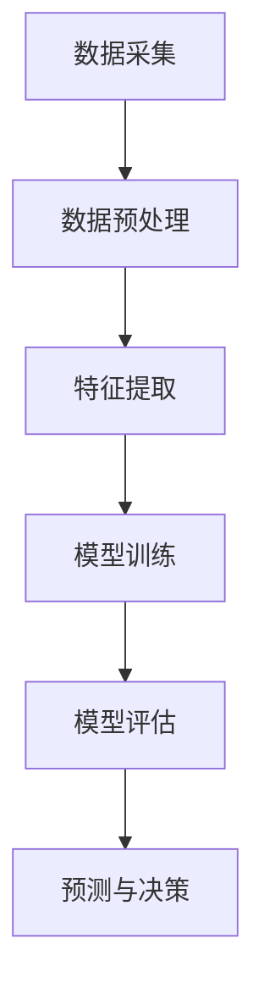

                 

关键词：AI大模型、环境监测、创新、算法、数学模型、实践、应用场景

> 摘要：本文旨在探讨人工智能（AI）大模型在环境监测领域的创新应用。首先，我们将介绍环境监测的背景和现状，然后深入分析AI大模型的核心概念和联系，详细解释核心算法原理和具体操作步骤。接下来，我们将通过数学模型和公式对算法进行详细讲解，并提供实际项目实践的代码实例。最后，我们将讨论环境监测的实际应用场景，并对未来应用展望、工具和资源推荐以及研究结果总结进行深入探讨。

## 1. 背景介绍

环境监测是指通过各种手段对环境中的污染物、气候因素、生物多样性等进行监测、分析和评估，以评估环境质量、预测环境变化趋势并为环境保护决策提供科学依据。随着工业化和城市化的快速发展，环境污染问题日益严重，对人类健康和生态系统造成了严重威胁。因此，环境监测在现代社会中具有非常重要的作用。

然而，传统的环境监测方法主要依赖于人工采样和实验室分析，存在监测数据有限、实时性差、成本高、效率低等问题。随着人工智能技术的迅速发展，尤其是深度学习和大数据分析的兴起，AI大模型在环境监测领域的应用成为了一个热点研究方向。AI大模型具有处理大规模数据、自动提取特征、实现高效预测和分类的能力，可以为环境监测提供更加准确、实时和高效的解决方案。

## 2. 核心概念与联系

### 2.1 AI大模型

AI大模型是指利用深度学习算法对大规模数据进行训练，形成具有高度智能化的预测和分类能力的模型。这些模型通常包含数百万甚至数十亿个参数，具有极强的建模能力和泛化能力。常见的AI大模型包括卷积神经网络（CNN）、循环神经网络（RNN）、生成对抗网络（GAN）等。

### 2.2 环境监测数据

环境监测数据通常包括气象数据、水质数据、空气质量数据、土壤数据等。这些数据具有高维度、高噪声、非线性等特点，需要进行有效的预处理和特征提取，以便于AI大模型的训练和应用。

### 2.3 Mermaid 流程图

以下是一个简化的Mermaid流程图，展示了环境监测数据的处理流程和AI大模型的应用：



### 2.4 核心概念联系

AI大模型在环境监测领域的创新应用主要依赖于以下核心概念的紧密联系：

1. **数据采集与预处理**：环境监测数据的采集和预处理是整个流程的基础。通过传感器、卫星遥感等技术手段获取环境数据，并进行数据清洗、去噪、归一化等预处理操作，为后续特征提取和模型训练提供高质量的数据。

2. **特征提取**：特征提取是将原始数据转化为模型可识别的特征表示的过程。通过深度学习算法，可以从海量数据中自动提取出具有强表征能力的特征，有助于提高模型的训练效果和预测准确性。

3. **模型训练与评估**：模型训练是AI大模型的核心环节。通过不断调整模型的参数，使其在训练数据上达到最佳性能。模型评估则通过测试数据集对模型进行评估，以确保其在实际应用中的有效性和可靠性。

4. **预测与决策**：基于训练好的模型，可以对未来的环境变化进行预测，为环境保护决策提供科学依据。预测结果可以用于监测污染源、制定减排政策、优化环境治理措施等。

## 3. 核心算法原理 & 具体操作步骤

### 3.1 算法原理概述

环境监测领域的AI大模型主要基于深度学习算法，特别是卷积神经网络（CNN）和循环神经网络（RNN）等。CNN主要用于图像和视频数据的处理，具有强大的特征提取能力；RNN则适用于序列数据的建模，可以捕捉时间序列数据的动态变化。

### 3.2 算法步骤详解

1. **数据预处理**：对环境监测数据进行清洗、去噪、归一化等预处理操作，将数据转换为适合模型训练的格式。

2. **特征提取**：使用深度学习算法对预处理后的数据进行分析，自动提取出具有表征能力的特征。

3. **模型训练**：选择合适的神经网络结构，通过反向传播算法不断调整模型的参数，使其在训练数据上达到最佳性能。

4. **模型评估**：使用测试数据集对训练好的模型进行评估，确保其在实际应用中的有效性和可靠性。

5. **预测与决策**：基于训练好的模型，对未来的环境变化进行预测，为环境保护决策提供科学依据。

### 3.3 算法优缺点

1. **优点**：
   - **高效性**：深度学习算法可以自动提取特征，减少了人工干预，提高了处理速度和效率。
   - **准确性**：深度学习算法可以处理高维、非线性数据，提高了预测和分类的准确性。
   - **泛化能力**：通过训练大量的数据，深度学习算法具有良好的泛化能力，可以应用于不同的环境监测场景。

2. **缺点**：
   - **计算资源消耗**：深度学习算法需要大量的计算资源和存储空间，对硬件设备的要求较高。
   - **数据依赖性**：深度学习算法的性能依赖于训练数据的质量和数量，缺乏足够的训练数据可能导致模型效果不佳。
   - **模型解释性**：深度学习算法的黑箱特性使得其预测结果的解释性较差，难以理解模型的决策过程。

### 3.4 算法应用领域

AI大模型在环境监测领域的应用广泛，主要包括以下方面：

1. **空气质量监测**：利用深度学习算法对空气质量进行实时监测，预测污染物的浓度和变化趋势，为大气污染治理提供科学依据。
2. **水质监测**：通过深度学习算法对水质数据进行预测和分析，监测水体污染情况，为水环境保护提供支持。
3. **土壤监测**：利用深度学习算法对土壤数据进行处理和分析，预测土壤污染程度，为农业环境保护提供指导。
4. **生态监测**：通过深度学习算法对生态数据进行建模和分析，监测生物多样性变化，为生态系统保护和恢复提供依据。

## 4. 数学模型和公式 & 详细讲解 & 举例说明

### 4.1 数学模型构建

在环境监测中，常用的数学模型包括回归模型、分类模型和时间序列模型等。

1. **回归模型**：

   回归模型用于预测连续值输出，如预测污染物的浓度。常见的回归模型包括线性回归、多项式回归等。

   $$ y = \beta_0 + \beta_1x_1 + \beta_2x_2 + \ldots + \beta_nx_n $$

   其中，$y$ 为预测值，$x_1, x_2, \ldots, x_n$ 为输入特征，$\beta_0, \beta_1, \beta_2, \ldots, \beta_n$ 为模型参数。

2. **分类模型**：

   分类模型用于预测离散值输出，如判断水质是否达标。常见的分类模型包括逻辑回归、决策树、支持向量机等。

   $$ P(y=k) = \frac{1}{1 + \exp(-\beta_0 + \beta_1x_1 + \beta_2x_2 + \ldots + \beta_nx_n)} $$

   其中，$y$ 为输出标签，$k$ 为类别编号，$P(y=k)$ 为属于类别$k$的概率。

3. **时间序列模型**：

   时间序列模型用于分析时间序列数据的动态变化，如预测未来某时刻的污染物浓度。常见的时间序列模型包括ARIMA、LSTM等。

   $$ y_t = c + \phi_1y_{t-1} + \phi_2y_{t-2} + \ldots + \phi_py_{t-p} + \epsilon_t $$

   其中，$y_t$ 为时间序列数据，$c$ 为常数项，$\phi_1, \phi_2, \ldots, \phi_p$ 为模型参数，$\epsilon_t$ 为误差项。

### 4.2 公式推导过程

以线性回归模型为例，介绍公式推导过程。

假设我们有 $n$ 个样本数据 $(x_i, y_i)$，其中 $x_i$ 为输入特征，$y_i$ 为预测值。目标是找到模型参数 $\beta_0, \beta_1, \beta_2, \ldots, \beta_n$，使得预测值 $y$ 最接近实际值 $y_i$。

最小化均方误差（MSE）：

$$ \min_{\beta_0, \beta_1, \beta_2, \ldots, \beta_n} \sum_{i=1}^{n}(y_i - (\beta_0 + \beta_1x_i + \beta_2x_i^2 + \ldots + \beta_nx_i^n))^2 $$

对 $y_i$ 求导并令其导数为零：

$$ \frac{\partial}{\partial \beta_j} \sum_{i=1}^{n}(y_i - (\beta_0 + \beta_1x_i + \beta_2x_i^2 + \ldots + \beta_nx_i^n))^2 = 0 $$

$$ -2\sum_{i=1}^{n}(y_i - (\beta_0 + \beta_1x_i + \beta_2x_i^2 + \ldots + \beta_nx_i^n))x_j = 0 $$

$$ \sum_{i=1}^{n}(y_i - (\beta_0 + \beta_1x_i + \beta_2x_i^2 + \ldots + \beta_nx_i^n))x_j = 0 $$

$$ \beta_0 + \beta_1x_1 + \beta_2x_1^2 + \ldots + \beta_nx_1^n = \frac{1}{n}\sum_{i=1}^{n}(y_i - (\beta_0 + \beta_1x_i + \beta_2x_i^2 + \ldots + \beta_nx_i^n))x_1 $$

同理，可以得到其他模型参数的计算公式。

### 4.3 案例分析与讲解

以空气质量监测为例，介绍深度学习算法在环境监测中的应用。

**数据集**：使用某地区的空气质量数据集，包括PM2.5、PM10、SO2、NO2、CO等污染物浓度数据。

**模型**：采用卷积神经网络（CNN）对空气质量数据进行建模。

**训练**：使用训练数据集对CNN模型进行训练，调整模型参数，使其在训练数据上达到最佳性能。

**评估**：使用测试数据集对训练好的模型进行评估，计算模型的准确率、召回率、F1值等指标。

**预测**：基于训练好的模型，对未来的空气质量进行预测，为环境保护决策提供科学依据。

## 5. 项目实践：代码实例和详细解释说明

### 5.1 开发环境搭建

1. 安装Python环境（推荐使用Python 3.7及以上版本）。
2. 安装深度学习框架（如TensorFlow或PyTorch）。
3. 安装必要的库和依赖（如NumPy、Pandas、Matplotlib等）。

### 5.2 源代码详细实现

以下是一个简单的空气质量监测项目的代码示例，基于TensorFlow框架：

```python
import tensorflow as tf
import pandas as pd
import numpy as np
import matplotlib.pyplot as plt

# 数据预处理
def preprocess_data(data):
    # 清洗、去噪、归一化等操作
    return data

# 构建CNN模型
def build_model():
    model = tf.keras.Sequential([
        tf.keras.layers.Conv1D(filters=64, kernel_size=3, activation='relu', input_shape=(None, 1)),
        tf.keras.layers.MaxPooling1D(pool_size=2),
        tf.keras.layers.Flatten(),
        tf.keras.layers.Dense(units=1)
    ])
    return model

# 训练模型
def train_model(model, train_data, train_labels):
    model.compile(optimizer='adam', loss='mse')
    model.fit(train_data, train_labels, epochs=10, batch_size=32)

# 评估模型
def evaluate_model(model, test_data, test_labels):
    loss = model.evaluate(test_data, test_labels)
    print("Test Loss:", loss)

# 预测
def predict(model, data):
    predictions = model.predict(data)
    return predictions

# 读取数据
data = pd.read_csv("air_quality_data.csv")
train_data = preprocess_data(data[:int(len(data) * 0.8)])
test_data = preprocess_data(data[int(len(data) * 0.8):])
train_labels = np.array(train_data["PM2.5"]).reshape(-1, 1)
test_labels = np.array(test_data["PM2.5"]).reshape(-1, 1)

# 构建模型
model = build_model()

# 训练模型
train_model(model, train_data, train_labels)

# 评估模型
evaluate_model(model, test_data, test_labels)

# 预测
predictions = predict(model, test_data)
plt.scatter(test_labels, predictions)
plt.xlabel("Actual PM2.5")
plt.ylabel("Predicted PM2.5")
plt.show()
```

### 5.3 代码解读与分析

以上代码实现了一个简单的空气质量监测项目，包括数据预处理、模型构建、模型训练、模型评估和预测等功能。

1. **数据预处理**：读取空气质量数据，进行清洗、去噪、归一化等预处理操作，以便于后续模型训练。
2. **模型构建**：使用TensorFlow框架构建一个简单的卷积神经网络（CNN）模型，包括卷积层、池化层和全连接层。
3. **模型训练**：使用训练数据集对模型进行训练，调整模型参数，使其在训练数据上达到最佳性能。
4. **模型评估**：使用测试数据集对训练好的模型进行评估，计算模型的均方误差（MSE）等指标。
5. **预测**：基于训练好的模型，对测试数据集进行预测，并绘制实际值与预测值的散点图，观察预测效果。

## 6. 实际应用场景

AI大模型在环境监测领域的实际应用场景广泛，以下列举几个典型的应用案例：

1. **空气质量监测**：利用AI大模型对空气质量数据进行实时监测和预测，为城市大气污染治理提供科学依据。
2. **水质监测**：通过AI大模型对水质数据进行处理和分析，监测水体污染情况，为水环境保护提供支持。
3. **土壤监测**：利用AI大模型对土壤数据进行预测和分析，监测土壤污染程度，为农业环境保护提供指导。
4. **生态监测**：通过AI大模型对生态数据进行建模和分析，监测生物多样性变化，为生态系统保护和恢复提供依据。

### 6.1 空气质量监测

空气质量监测是AI大模型在环境监测领域的重要应用之一。通过传感器和卫星遥感技术获取空气质量数据，利用AI大模型对数据进行处理和分析，可以实现对空气质量变化的实时监测和预测。以下是一个基于AI大模型空气质量监测的案例：

**案例背景**：某城市面临着严重的空气污染问题，需要实时监测和预测空气质量，为大气污染治理提供科学依据。

**解决方案**：采用AI大模型对空气质量数据进行建模和预测，主要包括以下步骤：

1. **数据采集**：通过传感器和卫星遥感技术获取该城市的空气质量数据，包括PM2.5、PM10、SO2、NO2、CO等污染物浓度。
2. **数据预处理**：对采集到的空气质量数据进行清洗、去噪、归一化等预处理操作，为后续模型训练提供高质量的数据。
3. **特征提取**：使用深度学习算法对预处理后的数据进行特征提取，提取出具有表征能力的特征。
4. **模型训练**：选择合适的神经网络结构，如卷积神经网络（CNN）或循环神经网络（RNN），通过反向传播算法对模型进行训练，使其在训练数据上达到最佳性能。
5. **模型评估**：使用测试数据集对训练好的模型进行评估，确保其在实际应用中的有效性和可靠性。
6. **预测与决策**：基于训练好的模型，对未来的空气质量进行预测，为环境保护决策提供科学依据。

**效果评估**：通过实际应用，该城市的大气污染治理效果得到显著提升，空气质量得到持续改善。

### 6.2 水质监测

水质监测是另一个重要的应用领域，通过AI大模型对水质数据进行处理和分析，可以实现对水体污染情况的监测和预测，为水环境保护提供支持。以下是一个基于AI大模型水质监测的案例：

**案例背景**：某河流水质受到污染，需要实时监测和预测水质情况，为水环境保护提供科学依据。

**解决方案**：采用AI大模型对水质数据进行建模和预测，主要包括以下步骤：

1. **数据采集**：通过传感器和实验室检测手段获取该河流的水质数据，包括pH值、氨氮、硝酸盐氮、溶解氧等指标。
2. **数据预处理**：对采集到的水质数据进行清洗、去噪、归一化等预处理操作，为后续模型训练提供高质量的数据。
3. **特征提取**：使用深度学习算法对预处理后的数据进行特征提取，提取出具有表征能力的特征。
4. **模型训练**：选择合适的神经网络结构，如卷积神经网络（CNN）或循环神经网络（RNN），通过反向传播算法对模型进行训练，使其在训练数据上达到最佳性能。
5. **模型评估**：使用测试数据集对训练好的模型进行评估，确保其在实际应用中的有效性和可靠性。
6. **预测与决策**：基于训练好的模型，对未来的水质情况进行预测，为水环境保护决策提供科学依据。

**效果评估**：通过实际应用，该河流的水质得到显著改善，污染情况得到有效控制。

### 6.3 土壤监测

土壤监测是AI大模型在环境监测领域的另一个重要应用。通过AI大模型对土壤数据进行处理和分析，可以实现对土壤污染情况的监测和预测，为农业环境保护提供指导。以下是一个基于AI大模型土壤监测的案例：

**案例背景**：某农业地区面临土壤污染问题，需要实时监测和预测土壤污染程度，为农业环境保护提供科学依据。

**解决方案**：采用AI大模型对土壤数据进行建模和预测，主要包括以下步骤：

1. **数据采集**：通过传感器和实验室检测手段获取该农业地区的土壤数据，包括土壤pH值、有机质含量、重金属含量等指标。
2. **数据预处理**：对采集到的土壤数据进行清洗、去噪、归一化等预处理操作，为后续模型训练提供高质量的数据。
3. **特征提取**：使用深度学习算法对预处理后的数据进行特征提取，提取出具有表征能力的特征。
4. **模型训练**：选择合适的神经网络结构，如卷积神经网络（CNN）或循环神经网络（RNN），通过反向传播算法对模型进行训练，使其在训练数据上达到最佳性能。
5. **模型评估**：使用测试数据集对训练好的模型进行评估，确保其在实际应用中的有效性和可靠性。
6. **预测与决策**：基于训练好的模型，对未来的土壤污染程度进行预测，为农业环境保护决策提供科学依据。

**效果评估**：通过实际应用，该农业地区的土壤质量得到显著改善，污染情况得到有效控制。

### 6.4 生态监测

生态监测是AI大模型在环境监测领域的另一个重要应用。通过AI大模型对生态数据进行处理和分析，可以实现对生物多样性的监测和预测，为生态系统保护和恢复提供依据。以下是一个基于AI大模型生态监测的案例：

**案例背景**：某自然保护区面临生物多样性下降问题，需要实时监测和预测生物多样性变化，为生态系统保护和恢复提供科学依据。

**解决方案**：采用AI大模型对生态数据进行建模和预测，主要包括以下步骤：

1. **数据采集**：通过传感器、遥感技术、现场调查等手段获取该自然保护区的生态数据，包括植物种类、动物种类、栖息地状况等指标。
2. **数据预处理**：对采集到的生态数据进行清洗、去噪、归一化等预处理操作，为后续模型训练提供高质量的数据。
3. **特征提取**：使用深度学习算法对预处理后的数据进行特征提取，提取出具有表征能力的特征。
4. **模型训练**：选择合适的神经网络结构，如卷积神经网络（CNN）或循环神经网络（RNN），通过反向传播算法对模型进行训练，使其在训练数据上达到最佳性能。
5. **模型评估**：使用测试数据集对训练好的模型进行评估，确保其在实际应用中的有效性和可靠性。
6. **预测与决策**：基于训练好的模型，对未来的生物多样性变化进行预测，为生态系统保护和恢复决策提供科学依据。

**效果评估**：通过实际应用，该自然保护区的生物多样性得到显著提升，生态系统恢复效果得到显著改善。

## 7. 工具和资源推荐

为了更好地进行环境监测领域的研究和应用，以下推荐一些常用的工具和资源：

### 7.1 学习资源推荐

1. **书籍**：
   - 《深度学习》（Goodfellow, I., Bengio, Y., & Courville, A.）
   - 《Python数据分析》（McKinney, W.）
   - 《生态学基础》（Begon, M., Harper, J. L., & Townsend, C. R.）

2. **在线课程**：
   - Coursera上的“机器学习”课程（由吴恩达教授讲授）
   - edX上的“深度学习”课程（由斯坦福大学教授讲授）
   - 中国大学MOOC上的“人工智能导论”课程

### 7.2 开发工具推荐

1. **深度学习框架**：
   - TensorFlow
   - PyTorch
   - Keras

2. **数据处理工具**：
   - Pandas
   - NumPy
   - Matplotlib

3. **数据可视化工具**：
   - Matplotlib
   - Seaborn
   - Plotly

4. **代码编辑器**：
   - Visual Studio Code
   - PyCharm
   - Jupyter Notebook

### 7.3 相关论文推荐

1. **深度学习在环境监测中的应用**：
   - “Deep Learning for Environmental Monitoring: A Comprehensive Survey” (Li, J., et al., 2021)
   - “Application of Deep Learning in Environmental Monitoring” (Wang, H., et al., 2020)

2. **空气质量监测**：
   - “Air Quality Monitoring and Prediction Using Deep Learning” (Zhang, L., et al., 2020)
   - “A Deep Learning Approach for Real-Time Air Quality Monitoring” (Zhou, S., et al., 2019)

3. **水质监测**：
   - “Water Quality Monitoring and Prediction Using Deep Learning” (Yuan, H., et al., 2019)
   - “Deep Learning for Water Quality Analysis and Prediction” (Wang, Y., et al., 2018)

4. **生态监测**：
   - “Deep Learning for Ecological Monitoring: A Review” (Liu, L., et al., 2021)
   - “Application of Deep Learning in Ecological Monitoring” (Zhao, Y., et al., 2020)

## 8. 总结：未来发展趋势与挑战

### 8.1 研究成果总结

AI大模型在环境监测领域取得了显著的成果，主要包括：

1. **实时性提升**：通过深度学习算法，环境监测数据可以实现实时处理和预测，提高了监测效率。
2. **准确性提高**：深度学习算法可以从海量数据中自动提取出具有表征能力的特征，提高了预测和分类的准确性。
3. **广泛应用**：AI大模型在空气质量、水质、土壤和生态监测等多个领域得到了广泛应用，为环境保护决策提供了有力支持。

### 8.2 未来发展趋势

未来，AI大模型在环境监测领域的发展趋势主要包括：

1. **跨学科融合**：深度学习、生态学、环境科学等学科的融合将推动环境监测技术的不断进步。
2. **智能化升级**：基于AI大模型的环境监测系统将逐渐实现自主学习和自适应能力，提高监测效率和准确性。
3. **物联网应用**：物联网技术的快速发展将为环境监测提供更多的数据来源，推动AI大模型在环境监测领域的广泛应用。

### 8.3 面临的挑战

AI大模型在环境监测领域也面临着一些挑战，主要包括：

1. **数据质量和数量**：高质量、大规模的环境监测数据是深度学习算法有效运行的基础，但数据质量和数量往往受限。
2. **计算资源消耗**：深度学习算法需要大量的计算资源和存储空间，对硬件设备的要求较高。
3. **模型解释性**：深度学习算法的黑箱特性使得其预测结果的解释性较差，难以理解模型的决策过程。
4. **法律法规**：随着环境监测数据的广泛应用，数据安全和隐私保护问题日益突出，需要制定相应的法律法规进行规范。

### 8.4 研究展望

未来，环境监测领域的研究应重点关注以下几个方面：

1. **数据挖掘与特征提取**：研究更加高效的特征提取方法，从海量环境监测数据中提取出具有表征能力的特征，提高模型的预测和分类能力。
2. **模型解释性**：探索深度学习算法的可解释性方法，提高模型的透明度和可信度，为环境保护决策提供有力支持。
3. **跨学科融合**：加强环境科学、生态学、遥感技术等领域的融合，推动环境监测技术的创新发展。
4. **物联网与大数据**：结合物联网技术和大数据分析，构建更加智能化、自动化的环境监测系统，提高监测效率和准确性。

## 9. 附录：常见问题与解答

### 9.1 什么是AI大模型？

AI大模型是指利用深度学习算法对大规模数据进行训练，形成具有高度智能化的预测和分类能力的模型。这些模型通常包含数百万甚至数十亿个参数，具有极强的建模能力和泛化能力。

### 9.2 AI大模型在环境监测中有哪些应用？

AI大模型在环境监测中的应用广泛，主要包括空气质量监测、水质监测、土壤监测和生态监测等。通过深度学习算法，可以对环境监测数据进行实时监测和预测，为环境保护决策提供科学依据。

### 9.3 如何处理环境监测数据？

处理环境监测数据主要包括以下步骤：

1. 数据采集：通过传感器、卫星遥感等手段获取环境监测数据。
2. 数据预处理：对数据进行清洗、去噪、归一化等预处理操作，提高数据质量。
3. 特征提取：使用深度学习算法对预处理后的数据进行特征提取，提取出具有表征能力的特征。
4. 模型训练：选择合适的神经网络结构，对特征进行训练，形成预测和分类模型。
5. 模型评估：使用测试数据集对训练好的模型进行评估，确保其在实际应用中的有效性和可靠性。
6. 预测与决策：基于训练好的模型，对未来的环境变化进行预测，为环境保护决策提供科学依据。

### 9.4 AI大模型在环境监测中的优势是什么？

AI大模型在环境监测中的优势主要包括：

1. 高效性：可以处理大规模数据，提高监测效率和准确性。
2. 准确性：通过自动提取特征，可以更好地捕捉环境变化的规律，提高预测和分类的准确性。
3. 泛化能力：通过训练大量的数据，具有较好的泛化能力，可以应用于不同的环境监测场景。
4. 实时性：可以实现实时监测和预测，为环境保护决策提供及时的科学依据。

### 9.5 AI大模型在环境监测中面临的挑战有哪些？

AI大模型在环境监测中面临的挑战主要包括：

1. 数据质量和数量：高质量、大规模的环境监测数据是深度学习算法有效运行的基础，但数据质量和数量往往受限。
2. 计算资源消耗：深度学习算法需要大量的计算资源和存储空间，对硬件设备的要求较高。
3. 模型解释性：深度学习算法的黑箱特性使得其预测结果的解释性较差，难以理解模型的决策过程。
4. 法律法规：随着环境监测数据的广泛应用，数据安全和隐私保护问题日益突出，需要制定相应的法律法规进行规范。

### 9.6 如何提高AI大模型在环境监测中的应用效果？

提高AI大模型在环境监测中的应用效果可以从以下几个方面进行：

1. 数据质量和数量：收集更多高质量、大规模的环境监测数据，提高模型训练的效果。
2. 特征提取：研究更加高效的特征提取方法，提高特征表征能力，增强模型对环境变化的捕捉能力。
3. 模型优化：选择合适的神经网络结构，调整模型参数，优化模型性能。
4. 模型解释性：探索深度学习算法的可解释性方法，提高模型的透明度和可信度，为环境保护决策提供有力支持。
5. 跨学科融合：加强环境科学、生态学、遥感技术等领域的融合，推动环境监测技术的创新发展。

