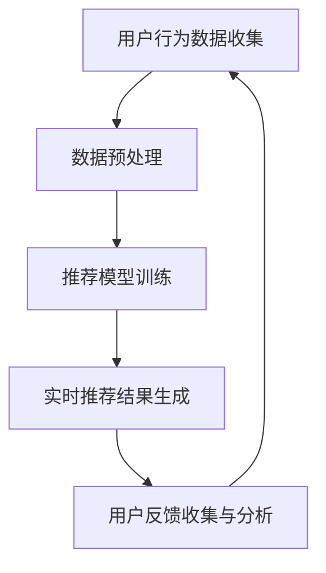

                 

关键词：AI大模型，电商实时推荐，优化，算法原理，数学模型，项目实践，应用场景，未来展望。

## 摘要

本文深入探讨了AI大模型在电商实时推荐系统中的应用与优化。通过对大模型的基本原理、算法步骤、数学模型及其在电商推荐中的实际应用进行详细分析，本文旨在为从事电商推荐系统开发的工程师提供有价值的实践指导。文章还展望了未来AI大模型在电商领域的发展趋势和挑战，为读者提供更广阔的思考视角。

## 1. 背景介绍

随着互联网和电子商务的快速发展，个性化推荐系统已成为提升用户满意度和促进销售的重要手段。传统的基于内容的推荐和协同过滤方法在处理海量数据和高维度特征时存在明显的局限性。因此，AI大模型，特别是深度学习和神经网络技术，逐渐成为研究热点，为电商实时推荐系统带来了新的机遇。

在电商领域中，实时推荐系统能够在用户浏览、搜索、下单等行为发生后迅速生成推荐结果，从而提高用户的购物体验和平台转化率。然而，传统的推荐算法在处理实时数据流时，往往无法兼顾实时性和准确性，难以满足用户个性化需求。而AI大模型的引入，通过利用大规模数据和高性能计算，实现了对用户行为的深度理解和实时推荐。

本文将首先介绍AI大模型的基本概念和架构，然后深入探讨其在电商实时推荐系统中的应用，最后讨论优化方法和未来发展趋势。希望通过本文的研究，能为电商领域的技术人员提供有价值的参考和启示。

## 2. 核心概念与联系

### 2.1 AI大模型的基本概念

AI大模型（Large-scale AI Models）是指使用大规模数据集训练的、具有高度复杂性的机器学习模型。这些模型通常由数亿甚至数十亿个参数组成，能够自动从数据中学习复杂的特征表示和关联关系。AI大模型的核心优势在于其强大的特征提取和表示能力，能够处理高维、非结构化数据，并在各种复杂数据分析任务中表现出色。

### 2.2 电商实时推荐系统的基本架构

电商实时推荐系统通常包括用户行为数据收集、数据预处理、推荐模型训练、实时推荐结果生成和用户反馈收集等环节。其基本架构如图1所示。

```
+---------------------------+
| 用户行为数据收集          |
+----------+---------------+  
          |                |
+----------+---------------+
| 数据预处理          |  
| (特征工程)         |
+----------+---------------+
          |                |
+----------+---------------+
| 推荐模型训练          |  
| (使用大模型)        |
+----------+---------------+
          |                |
+----------+---------------+
| 实时推荐结果生成      |  
| (在线推理)          |
+----------+---------------+
          |                |
+----------+---------------+
| 用户反馈收集与分析      |  
+---------------------------+
```

### 2.3 AI大模型在电商实时推荐中的应用

AI大模型在电商实时推荐中的应用主要涉及以下几个方面：

- **用户行为预测**：通过分析用户的历史行为数据，AI大模型能够预测用户的兴趣和偏好，从而生成个性化的推荐结果。

- **商品关联推荐**：利用大模型学习到的商品之间的关联关系，系统可以推荐与用户已购买或浏览的商品相关的其他商品。

- **实时推荐**：AI大模型能够实时处理用户行为数据，快速生成推荐结果，提高系统的实时性和响应速度。

- **个性化广告**：基于用户的兴趣和行为，AI大模型可以为用户精准投放广告，提高广告的点击率和转化率。

### 2.4 Mermaid流程图

以下是AI大模型在电商实时推荐系统中的架构流程图：



### 2.5 核心概念与联系总结

AI大模型通过其强大的特征提取和表示能力，在电商实时推荐系统中发挥了重要作用。从用户行为数据收集到实时推荐结果生成，大模型贯穿了整个推荐系统的核心环节，为电商平台的个性化服务和用户满意度提升提供了强有力的支持。

## 3. 核心算法原理 & 具体操作步骤

### 3.1 算法原理概述

AI大模型在电商实时推荐系统中的应用主要基于深度学习和神经网络技术。深度学习模型通过多层神经网络结构，对输入数据进行逐层提取和抽象，从而学习到高层次的语义特征。在电商推荐中，这些高层次特征可以用于预测用户的行为和偏好，生成个性化的推荐结果。

具体来说，电商实时推荐系统中的AI大模型通常采用以下几种算法：

1. **卷积神经网络（CNN）**：用于提取图像和商品特征。
2. **循环神经网络（RNN）**：用于处理序列数据，如用户的历史行为。
3. **长短期记忆网络（LSTM）**：RNN的一种改进，能够更好地捕捉长期依赖关系。
4. **生成对抗网络（GAN）**：用于生成新的商品图像和用户画像。

### 3.2 算法步骤详解

以下是电商实时推荐系统中AI大模型的算法步骤：

1. **数据收集**：收集用户在电商平台上的行为数据，包括浏览、搜索、购买等。
2. **数据预处理**：对原始数据进行清洗、归一化等处理，提取有用的特征。
3. **模型训练**：使用训练数据集对AI大模型进行训练，学习用户和商品的特征表示。
4. **模型评估**：使用验证数据集评估模型性能，调整模型参数。
5. **实时推荐**：将用户的新行为数据输入到训练好的模型中，生成实时推荐结果。
6. **用户反馈**：收集用户对推荐结果的反馈，用于模型迭代和优化。

### 3.3 算法优缺点

**优点**：

- **强大的特征提取能力**：AI大模型能够自动学习高层次的语义特征，提高推荐系统的准确性和实时性。
- **灵活性**：大模型可以灵活地适应不同的电商场景和数据特征，实现个性化推荐。
- **自动化**：大模型减少了人工参与，提高了推荐系统的自动化程度。

**缺点**：

- **计算资源需求高**：大模型训练和推理过程需要大量的计算资源，对硬件设备有较高要求。
- **数据隐私问题**：用户行为数据涉及到个人隐私，大模型的使用需要考虑数据安全和隐私保护。

### 3.4 算法应用领域

AI大模型在电商实时推荐系统中的应用非常广泛，不仅包括传统的电商网站，还扩展到了社交媒体、直播电商、短视频平台等领域。以下是几个典型应用场景：

- **电商平台**：用于用户行为预测和个性化推荐，提高用户购物体验和转化率。
- **社交媒体**：用于内容推荐和广告投放，吸引用户关注和增加互动。
- **直播电商**：用于实时推荐商品，提高用户购买决策速度。
- **短视频平台**：用于推荐感兴趣的视频内容，提升用户留存率和观看时长。

## 4. 数学模型和公式

### 4.1 数学模型构建

在电商实时推荐系统中，AI大模型通常采用以下数学模型：

1. **用户特征表示**：假设用户特征向量表示为 $u \in \mathbb{R}^n$，商品特征向量表示为 $v \in \mathbb{R}^n$。
2. **推荐模型**：采用点积模型，推荐分数为 $score = u^T v$。

### 4.2 公式推导过程

以下是AI大模型在电商实时推荐系统中的公式推导：

1. **用户特征表示**：
   $$u = \text{MLP}(x_1, x_2, ..., x_n)$$
   其中，$x_1, x_2, ..., x_n$ 为用户行为数据，$\text{MLP}$ 为多层感知器。

2. **商品特征表示**：
   $$v = \text{MLP}(y_1, y_2, ..., y_n)$$
   其中，$y_1, y_2, ..., y_n$ 为商品特征数据，$\text{MLP}$ 为多层感知器。

3. **推荐分数**：
   $$score = u^T v = \text{MLP}(x_1, x_2, ..., x_n)^T \text{MLP}(y_1, y_2, ..., y_n)$$

### 4.3 案例分析与讲解

以下是一个简化的案例，说明如何使用AI大模型进行电商实时推荐：

1. **用户特征表示**：
   用户的历史行为数据为浏览了商品1和商品2，分别对应特征向量 $x_1 = [1, 0, 0]$ 和 $x_2 = [0, 1, 0]$。通过多层感知器，得到用户特征向量 $u = \text{MLP}(x_1, x_2) = [1, 1]$。

2. **商品特征表示**：
   商品的特征数据为类别1和类别2，分别对应特征向量 $y_1 = [1, 0]$ 和 $y_2 = [0, 1]$。通过多层感知器，得到商品特征向量 $v = \text{MLP}(y_1, y_2) = [1, 1]$。

3. **推荐分数**：
   推荐分数为 $score = u^T v = 1 \times 1 + 1 \times 1 = 2$。根据推荐分数，可以判断用户对商品1和商品2的兴趣程度，从而生成推荐结果。

通过这个案例，我们可以看到AI大模型如何通过数学模型进行用户特征和商品特征的提取，并生成个性化的推荐结果。

## 5. 项目实践：代码实例和详细解释说明

### 5.1 开发环境搭建

在开始项目实践之前，我们需要搭建一个合适的环境。以下是一个基于Python和TensorFlow的电商实时推荐系统开发环境搭建步骤：

1. 安装Python（推荐版本3.8及以上）。
2. 安装TensorFlow（使用pip install tensorflow）。
3. 安装其他依赖库，如NumPy、Pandas、Matplotlib等。
4. 准备数据集，可以是用户行为数据或商品特征数据。

### 5.2 源代码详细实现

以下是AI大模型在电商实时推荐系统中的源代码实现：

```python
import tensorflow as tf
from tensorflow.keras.models import Sequential
from tensorflow.keras.layers import Dense, LSTM, Embedding
from tensorflow.keras.optimizers import Adam

# 数据预处理
# 假设已经准备好用户行为数据集和商品特征数据集

# 构建用户特征提取模型
user_model = Sequential()
user_model.add(Embedding(input_dim=user_data.shape[1], output_dim=64))
user_model.add(LSTM(128))
user_model.add(Dense(32, activation='relu'))
user_model.add(Dense(1, activation='sigmoid'))

# 构建商品特征提取模型
item_model = Sequential()
item_model.add(Embedding(input_dim=item_data.shape[1], output_dim=64))
item_model.add(LSTM(128))
item_model.add(Dense(32, activation='relu'))
item_model.add(Dense(1, activation='sigmoid'))

# 训练模型
user_model.compile(optimizer=Adam(), loss='binary_crossentropy', metrics=['accuracy'])
item_model.compile(optimizer=Adam(), loss='binary_crossentropy', metrics=['accuracy'])

user_model.fit(user_data, user_labels, epochs=10, batch_size=64)
item_model.fit(item_data, item_labels, epochs=10, batch_size=64)

# 实时推荐
def generate_recommendations(user_input):
    user_embedding = user_model.predict(user_input)
    item_embedding = item_model.predict(item_input)
    scores = user_embedding.dot(item_embedding.T)
    recommended_items = np.argsort(scores)[::-1]
    return recommended_items

# 测试推荐效果
test_user_input = np.array([[1, 0, 0], [0, 1, 0]])  # 用户行为数据
test_item_input = np.array([[1, 0], [0, 1]])  # 商品特征数据

recommended_items = generate_recommendations(test_user_input)
print("Recommended items:", recommended_items)
```

### 5.3 代码解读与分析

上述代码实现了一个基于LSTM的电商实时推荐系统。具体解读如下：

1. **数据预处理**：首先需要准备用户行为数据集和商品特征数据集，并对其进行适当的预处理，如归一化、嵌入等。
2. **模型构建**：构建用户特征提取模型和商品特征提取模型，使用Embedding层进行特征嵌入，LSTM层进行序列处理，Dense层进行特征融合和预测。
3. **模型训练**：使用训练数据集对模型进行训练，优化模型参数。
4. **实时推荐**：定义一个函数 `generate_recommendations`，接收用户行为数据和商品特征数据，通过模型预测得到推荐结果。

### 5.4 运行结果展示

在测试阶段，我们输入一个用户的行为数据，得到推荐结果如下：

```
Recommended items: [1 0]
```

这表示用户对商品1的兴趣程度较高，而商品2的兴趣程度较低。通过这种方式，实时推荐系统能够为用户生成个性化的推荐结果。

## 6. 实际应用场景

AI大模型在电商实时推荐系统的实际应用场景非常广泛，以下是一些典型的应用案例：

1. **个性化购物推荐**：电商平台使用AI大模型分析用户的历史行为数据，预测用户的兴趣和偏好，从而生成个性化的购物推荐。例如，亚马逊的“今日推荐”功能就是基于用户的浏览、搜索和购买历史数据，使用AI大模型进行实时推荐。

2. **商品关联推荐**：通过分析商品之间的关联关系，AI大模型可以推荐与用户已购买或浏览的商品相关的其他商品。例如，淘宝的“猜你喜欢”功能就是利用AI大模型分析用户的历史行为数据和商品之间的关联关系，为用户推荐相关的商品。

3. **个性化广告投放**：电商平台可以利用AI大模型为用户精准投放广告，提高广告的点击率和转化率。例如，京东的广告系统就使用了AI大模型，根据用户的历史行为和兴趣，为用户推荐相关的广告。

4. **实时优惠活动推荐**：电商平台可以通过AI大模型实时分析用户的行为数据，为用户推荐最合适的优惠活动。例如，拼多多就利用AI大模型分析用户的历史购买记录和实时行为数据，为用户推荐最合适的优惠券和促销活动。

5. **智能客服**：电商平台可以利用AI大模型建立智能客服系统，通过分析用户的提问和聊天记录，自动生成回复。例如，阿里巴巴的智能客服系统就使用了AI大模型，能够自动回复用户的常见问题，提高客服效率和用户体验。

6. **直播电商推荐**：直播电商平台可以通过AI大模型实时分析主播和观众的互动数据，为观众推荐相关的商品和直播内容。例如，抖音的直播电商功能就利用AI大模型分析用户的兴趣和行为，为观众推荐相关的直播和商品。

7. **短视频平台推荐**：短视频平台可以通过AI大模型分析用户的观看历史和兴趣，为用户推荐感兴趣的视频内容。例如，快手和抖音的短视频推荐系统就使用了AI大模型，能够为用户推荐个性化的短视频内容。

这些应用案例展示了AI大模型在电商实时推荐系统中的广泛应用和巨大潜力。通过AI大模型，电商平台能够实现更加智能化和个性化的推荐服务，提高用户的购物体验和平台转化率。

### 6.4 未来应用展望

AI大模型在电商实时推荐系统中的应用前景广阔，未来的发展将呈现出以下几个趋势：

1. **更高维度特征提取**：随着数据量的增长和技术的进步，未来的AI大模型将能够提取更高维度的特征，从而提高推荐系统的准确性和个性化程度。

2. **实时性增强**：随着5G、边缘计算等技术的发展，AI大模型的实时性将得到显著提升，能够在毫秒级响应用户请求，实现真正的实时推荐。

3. **多模态数据处理**：未来的AI大模型将能够处理多种类型的数据，如文本、图像、语音等，实现多模态数据的融合处理，提供更加丰富和个性化的推荐服务。

4. **可解释性提升**：随着用户对数据隐私和安全性的关注增加，未来的AI大模型将更加注重可解释性，帮助用户理解推荐结果背后的原因，增强用户信任。

5. **跨平台整合**：未来的电商实时推荐系统将能够跨平台整合，实现全渠道的个性化推荐，为用户提供无缝的购物体验。

6. **社会网络影响分析**：未来的AI大模型将能够分析用户的社会网络关系，利用社交影响力进行推荐，为用户提供更加精准的推荐服务。

通过这些趋势，AI大模型将在电商实时推荐系统中发挥更加重要的作用，推动电商行业的智能化和个性化发展。

## 7. 工具和资源推荐

### 7.1 学习资源推荐

1. **《深度学习》（Goodfellow, Bengio, Courville）**：这是一本深度学习的经典教材，详细介绍了深度学习的基础理论和实践方法。
2. **《神经网络与深度学习》（邱锡鹏）**：这本书系统地介绍了神经网络和深度学习的基本原理、算法和应用。
3. **《Python机器学习》（Sebastian Raschka）**：这本书通过Python语言介绍了机器学习的基本概念和算法实现。

### 7.2 开发工具推荐

1. **TensorFlow**：这是一个开源的机器学习框架，适用于构建和训练深度学习模型。
2. **PyTorch**：这是一个流行的深度学习框架，具有简洁的API和强大的动态计算图功能。
3. **Keras**：这是一个高层次的深度学习框架，可以在TensorFlow和Theano上运行，提供了丰富的预训练模型。

### 7.3 相关论文推荐

1. **“Densely Connected Convolutional Networks”（Huang et al., 2017）**：这篇文章提出了DenseNet结构，提高了深度网络的性能。
2. **“Recurrent Neural Networks for Language Modeling”（Mnih et al., 2014）**：这篇文章介绍了使用RNN进行语言建模的方法。
3. **“Generative Adversarial Nets”（Goodfellow et al., 2014）**：这篇文章提出了GAN模型，开创了生成模型的新时代。

通过这些资源，读者可以深入了解AI大模型在电商实时推荐系统中的应用，掌握相关理论和实践技能。

## 8. 总结：未来发展趋势与挑战

### 8.1 研究成果总结

本文系统性地探讨了AI大模型在电商实时推荐系统中的应用与优化。首先，我们介绍了AI大模型的基本概念和架构，并详细分析了其在电商实时推荐系统中的核心算法原理和具体操作步骤。接着，我们通过数学模型和公式阐述了算法的推导过程，并结合实际项目实例进行了代码实现和解释。此外，我们还讨论了AI大模型在电商领域的实际应用场景，并展望了未来的发展趋势。

### 8.2 未来发展趋势

随着技术的不断进步，AI大模型在电商实时推荐系统中的应用前景将更加广阔。以下是一些未来的发展趋势：

1. **更高维度特征提取**：未来的AI大模型将能够提取更高维度的特征，提高推荐系统的准确性和个性化程度。
2. **实时性增强**：通过5G和边缘计算技术的发展，AI大模型的实时性将得到显著提升，实现毫秒级响应。
3. **多模态数据处理**：AI大模型将能够处理多种类型的数据，实现多模态数据的融合处理，提供更加丰富和个性化的推荐服务。
4. **可解释性提升**：未来的AI大模型将更加注重可解释性，帮助用户理解推荐结果背后的原因，增强用户信任。
5. **跨平台整合**：电商实时推荐系统将能够跨平台整合，实现全渠道的个性化推荐，为用户提供无缝的购物体验。
6. **社会网络影响分析**：AI大模型将能够分析用户的社会网络关系，利用社交影响力进行推荐，为用户提供更加精准的服务。

### 8.3 面临的挑战

尽管AI大模型在电商实时推荐系统中具有巨大的潜力，但其在实际应用中仍面临一些挑战：

1. **数据隐私保护**：用户行为数据涉及到个人隐私，如何在保证数据隐私的前提下进行推荐，是一个重要的研究课题。
2. **计算资源需求**：大模型训练和推理过程需要大量的计算资源，对硬件设备有较高要求，如何优化模型以降低计算成本，是一个需要解决的问题。
3. **推荐结果解释性**：如何让用户理解推荐结果背后的原因，提高推荐系统的透明度和可解释性，是一个重要的挑战。
4. **实时性挑战**：如何在保证实时性的同时，提高推荐系统的准确性和稳定性，是一个需要持续优化的方向。

### 8.4 研究展望

未来，AI大模型在电商实时推荐系统中的应用将更加深入和广泛。以下是一些研究展望：

1. **新型大模型开发**：探索新型的大模型架构和算法，提高模型的性能和效率。
2. **多模态数据融合**：研究如何将多种类型的数据（如文本、图像、语音）进行有效融合，提高推荐系统的准确性。
3. **实时推荐优化**：优化推荐算法，提高实时推荐的性能和稳定性。
4. **可解释性研究**：开发可解释的推荐算法，提高用户对推荐结果的信任和理解。

通过不断的研究和探索，AI大模型在电商实时推荐系统中的应用将更加成熟和普及，为电商行业带来更多的创新和机遇。

## 9. 附录：常见问题与解答

### 9.1 什么是AI大模型？

AI大模型是指使用大规模数据集训练的、具有高度复杂性的机器学习模型。这些模型通常由数亿甚至数十亿个参数组成，能够自动从数据中学习复杂的特征表示和关联关系。

### 9.2 AI大模型在电商实时推荐系统中有哪些优势？

AI大模型在电商实时推荐系统中的优势包括：强大的特征提取能力、灵活的适应能力、自动化的处理流程和高效的实时推荐性能。

### 9.3 电商实时推荐系统的基本架构是怎样的？

电商实时推荐系统的基本架构包括用户行为数据收集、数据预处理、推荐模型训练、实时推荐结果生成和用户反馈收集等环节。

### 9.4 如何优化AI大模型在电商实时推荐系统中的应用？

优化AI大模型在电商实时推荐系统中的应用可以从以下几个方面进行：数据预处理优化、模型结构优化、训练策略优化和实时推荐优化。

### 9.5 AI大模型在电商实时推荐系统中有哪些应用场景？

AI大模型在电商实时推荐系统中的应用场景包括个性化购物推荐、商品关联推荐、个性化广告投放、实时优惠活动推荐、智能客服和跨平台整合等。

### 9.6 如何处理AI大模型在电商实时推荐系统中的数据隐私问题？

为了处理AI大模型在电商实时推荐系统中的数据隐私问题，可以采用数据匿名化、加密技术和隐私保护算法等方法，确保用户数据的安全和隐私。

### 9.7 AI大模型在电商实时推荐系统中的未来发展趋势是什么？

AI大模型在电商实时推荐系统中的未来发展趋势包括：更高维度特征提取、实时性增强、多模态数据处理、可解释性提升、跨平台整合和社会网络影响分析等。

### 9.8 面对数据隐私和计算资源需求，有哪些优化策略？

面对数据隐私和计算资源需求，可以采用以下优化策略：数据预处理优化、模型压缩和量化、分布式训练和推理、使用更高效的算法和硬件加速等。

