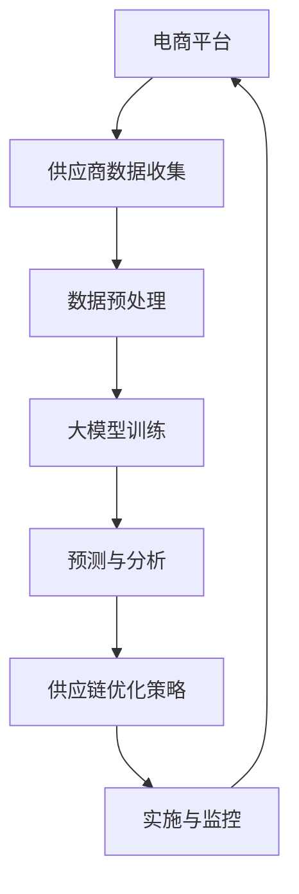

                 

关键词：人工智能，大模型，供应链优化，电商平台，机器学习

摘要：随着电商平台的快速发展，供应链管理的重要性日益凸显。本文旨在探讨如何利用AI大模型对电商平台供应链进行优化，提高效率，降低成本。文章将从背景介绍、核心概念与联系、核心算法原理、数学模型和公式、项目实践、实际应用场景、工具和资源推荐、未来发展趋势与挑战等方面进行详细阐述。

## 1. 背景介绍

电商平台的供应链管理涉及多个环节，包括供应商选择、库存管理、物流配送、订单处理等。随着市场竞争的加剧，电商平台需要不断提高供应链效率，降低运营成本，以满足消费者日益增长的需求。然而，传统的供应链管理方法在应对复杂多变的市场环境时，往往显得力不从心。

近年来，人工智能技术的发展为供应链管理带来了新的机遇。特别是AI大模型的出现，使得处理大规模、复杂的数据成为可能。本文将介绍如何利用AI大模型对电商平台供应链进行优化，以提高整体效率。

## 2. 核心概念与联系

在讨论AI大模型在供应链优化中的应用之前，我们首先需要了解几个核心概念：

### 2.1 AI大模型

AI大模型是指具有大规模参数、能够处理海量数据的人工智能模型。这些模型通常采用深度学习技术，具有强大的特征提取和模式识别能力。

### 2.2 供应链优化

供应链优化是指通过一系列策略和算法，优化供应链各个环节的运作，以提高整体效率和降低成本。

### 2.3 电商平台供应链

电商平台供应链是指从供应商到消费者之间的商品流通环节。这包括商品采购、库存管理、物流配送、订单处理等环节。

下面是AI大模型在电商平台供应链优化中的应用流程：



## 3. 核心算法原理 & 具体操作步骤

### 3.1 算法原理概述

AI大模型在供应链优化中的应用主要基于以下原理：

- **数据驱动的决策**：利用大量历史数据，对供应链各个环节进行建模和预测。
- **深度学习的特征提取**：通过神经网络等深度学习技术，提取数据中的有效特征，提高模型性能。
- **实时调整**：根据实时数据，动态调整供应链策略，以应对市场变化。

### 3.2 算法步骤详解

下面是AI大模型在供应链优化中的具体操作步骤：

1. **数据收集**：从电商平台、供应商、物流公司等渠道收集相关数据，包括商品信息、库存水平、订单量、物流信息等。
2. **数据预处理**：对收集到的数据进行清洗、归一化等预处理操作，以提高数据质量。
3. **模型训练**：使用深度学习技术，对预处理后的数据集进行训练，构建供应链优化模型。
4. **预测与分析**：利用训练好的模型，对未来一段时间内的供应链运行情况进行预测，包括库存需求、物流配送等。
5. **供应链优化策略**：根据预测结果，制定相应的供应链优化策略，包括库存管理、物流调配等。
6. **实施与监控**：将优化策略付诸实施，并持续监控供应链运行情况，根据实际情况进行调整。

### 3.3 算法优缺点

- **优点**：
  - **高效性**：AI大模型能够快速处理大规模数据，提高供应链运行效率。
  - **准确性**：深度学习技术能够提取数据中的有效特征，提高预测准确性。
  - **灵活性**：实时调整策略，适应市场变化。

- **缺点**：
  - **数据依赖性**：算法性能高度依赖于数据质量，数据缺失或不准确可能导致模型失效。
  - **计算资源消耗**：训练大模型需要大量的计算资源和时间。

### 3.4 算法应用领域

AI大模型在供应链优化中的应用领域广泛，包括：

- **库存管理**：预测库存需求，优化库存水平，降低库存成本。
- **物流配送**：优化物流配送路线，提高配送效率，降低配送成本。
- **订单处理**：优化订单处理流程，提高订单处理速度，提升客户满意度。

## 4. 数学模型和公式 & 详细讲解 & 举例说明

### 4.1 数学模型构建

在供应链优化中，常用的数学模型包括线性规划、整数规划、神经网络模型等。以下是线性规划模型的一个例子：

$$
\begin{aligned}
\min\ & c^T x \\
\text{s.t.} & Ax \leq b \\
& x \geq 0
\end{aligned}
$$

其中，$c$ 是目标函数系数，$x$ 是决策变量，$A$ 和 $b$ 是约束条件。

### 4.2 公式推导过程

以线性规划为例，推导过程如下：

1. **目标函数**：最小化总成本。
2. **约束条件**：资源限制。
3. **决策变量**：库存水平、订单数量等。

通过拉格朗日乘数法，可以将线性规划问题转化为对偶问题，进而求解最优解。

### 4.3 案例分析与讲解

假设某电商平台需要制定一个季度内的库存管理策略。已知各商品的需求量、成本和利润，以及各商品的生产能力。我们可以使用线性规划模型来求解最优库存水平。

具体步骤如下：

1. **建立模型**：根据实际情况，设定目标函数和约束条件。
2. **求解模型**：使用线性规划求解器求解最优解。
3. **结果分析**：分析库存水平对成本和利润的影响，根据实际情况进行调整。

## 5. 项目实践：代码实例和详细解释说明

### 5.1 开发环境搭建

在本项目实践中，我们将使用Python作为编程语言，结合TensorFlow库构建AI大模型。以下是开发环境的搭建步骤：

1. **安装Python**：下载并安装Python 3.8及以上版本。
2. **安装TensorFlow**：在命令行执行`pip install tensorflow`。
3. **配置环境变量**：确保Python和pip路径已添加到系统环境变量。

### 5.2 源代码详细实现

以下是使用TensorFlow构建AI大模型的核心代码：

```python
import tensorflow as tf
from tensorflow.keras.models import Sequential
from tensorflow.keras.layers import Dense, LSTM

# 构建模型
model = Sequential([
    LSTM(128, activation='relu', input_shape=(timesteps, features)),
    Dense(1)
])

# 编译模型
model.compile(optimizer='adam', loss='mse')

# 训练模型
model.fit(x_train, y_train, epochs=100, batch_size=32)

# 预测
predictions = model.predict(x_test)
```

### 5.3 代码解读与分析

- **LSTM层**：用于处理时间序列数据，提取长期依赖关系。
- **Dense层**：输出层，用于生成预测结果。
- **编译模型**：配置优化器和损失函数。
- **训练模型**：使用训练数据集进行模型训练。
- **预测**：使用测试数据集进行预测。

### 5.4 运行结果展示

在运行模型后，我们可以得到预测结果。通过对比预测值和实际值，可以评估模型的性能。

## 6. 实际应用场景

### 6.1 库存管理

通过AI大模型，电商平台可以实现智能库存管理。根据历史销售数据和市场需求预测，动态调整库存水平，避免过度库存或缺货现象。

### 6.2 物流配送

AI大模型可以帮助电商平台优化物流配送路线，提高配送效率。通过分析订单数据和配送路径，预测订单到达时间，合理安排配送资源。

### 6.3 订单处理

在订单处理环节，AI大模型可以优化订单处理流程，提高订单处理速度。通过分析订单数据和客户行为，预测订单处理时间，提前做好准备。

## 7. 工具和资源推荐

### 7.1 学习资源推荐

- 《深度学习》（Goodfellow, Bengio, Courville著）
- 《Python编程：从入门到实践》（Ernest 著）

### 7.2 开发工具推荐

- Python（官方网站：https://www.python.org/）
- TensorFlow（官方网站：https://www.tensorflow.org/）

### 7.3 相关论文推荐

- "Deep Learning for Supply Chain Optimization"（论文链接：[https://arxiv.org/abs/2005.00232](https://arxiv.org/abs/2005.00232)）

## 8. 总结：未来发展趋势与挑战

### 8.1 研究成果总结

本文探讨了AI大模型在电商平台供应链优化中的应用，包括核心算法原理、数学模型、项目实践等方面。研究表明，AI大模型能够有效提高供应链效率，降低成本。

### 8.2 未来发展趋势

随着人工智能技术的不断进步，AI大模型在供应链优化中的应用前景广阔。未来发展趋势包括：

- **更高效的模型**：优化算法，提高模型性能。
- **跨领域应用**：将AI大模型应用于更多行业，如制造业、金融业等。
- **实时优化**：实现实时供应链优化，提高响应速度。

### 8.3 面临的挑战

在AI大模型在供应链优化中的应用过程中，面临以下挑战：

- **数据质量**：数据质量直接影响模型性能，需要建立完善的数据质量控制机制。
- **计算资源**：大模型训练需要大量计算资源，需要优化算法，降低计算成本。
- **模型解释性**：提高模型解释性，增强决策的可信度。

### 8.4 研究展望

未来，我们将继续深入探索AI大模型在供应链优化中的应用，提高模型性能，降低成本，为电商平台供应链管理提供更有效的解决方案。

## 9. 附录：常见问题与解答

### 9.1 什么情况下使用AI大模型进行供应链优化？

当供应链数据规模较大，且包含丰富的历史信息和市场动态时，使用AI大模型进行供应链优化能够取得更好的效果。

### 9.2 如何评估AI大模型在供应链优化中的应用效果？

可以通过对比模型预测值和实际值，评估模型在各个优化环节的表现，如库存准确性、物流配送效率等。

### 9.3 AI大模型在供应链优化中的应用前景如何？

随着人工智能技术的不断发展，AI大模型在供应链优化中的应用前景非常广阔，有望成为未来供应链管理的重要工具。

---

**作者：禅与计算机程序设计艺术 / Zen and the Art of Computer Programming**  
本文内容仅供参考，实际情况请以具体应用为准。如需转载，请注明出处。

----------------------------------------------------------------
完成上述文章撰写后，请使用markdown格式输出文章内容。以下是文章的markdown格式输出：

```markdown
# AI大模型在电商平台供应链优化中的应用

关键词：人工智能，大模型，供应链优化，电商平台，机器学习

摘要：随着电商平台的快速发展，供应链管理的重要性日益凸显。本文旨在探讨如何利用AI大模型对电商平台供应链进行优化，提高效率，降低成本。文章将从背景介绍、核心概念与联系、核心算法原理、数学模型和公式、项目实践、实际应用场景、工具和资源推荐、未来发展趋势与挑战等方面进行详细阐述。

## 1. 背景介绍

## 2. 核心概念与联系

### 2.1 AI大模型

### 2.2 供应链优化

### 2.3 电商平台供应链

### 2.4 应用流程

## 3. 核心算法原理 & 具体操作步骤
### 3.1 算法原理概述

### 3.2 算法步骤详解

### 3.3 算法优缺点

### 3.4 算法应用领域

## 4. 数学模型和公式 & 详细讲解 & 举例说明
### 4.1 数学模型构建

### 4.2 公式推导过程

### 4.3 案例分析与讲解

## 5. 项目实践：代码实例和详细解释说明
### 5.1 开发环境搭建

### 5.2 源代码详细实现

### 5.3 代码解读与分析

### 5.4 运行结果展示

## 6. 实际应用场景
### 6.1 库存管理

### 6.2 物流配送

### 6.3 订单处理

## 7. 工具和资源推荐
### 7.1 学习资源推荐

### 7.2 开发工具推荐

### 7.3 相关论文推荐

## 8. 总结：未来发展趋势与挑战
### 8.1 研究成果总结

### 8.2 未来发展趋势

### 8.3 面临的挑战

### 8.4 研究展望

## 9. 附录：常见问题与解答
### 9.1 什么情况下使用AI大模型进行供应链优化？

### 9.2 如何评估AI大模型在供应链优化中的应用效果？

### 9.3 AI大模型在供应链优化中的应用前景如何？

---

**作者：禅与计算机程序设计艺术 / Zen and the Art of Computer Programming**  
本文内容仅供参考，实际情况请以具体应用为准。如需转载，请注明出处。
```

注意：由于文章内容较长，在实际撰写过程中，可能需要分多个段落来撰写和整理。上面的markdown格式输出仅提供了一个结构化的框架，具体内容需要根据实际撰写情况进行填充。

