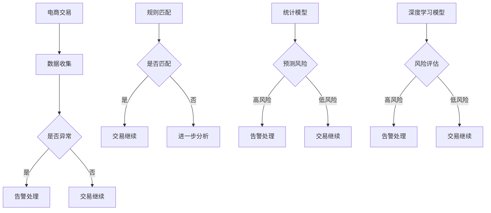

                 

关键词：AI大模型、电商平台、反欺诈、深度学习、神经网络、机器学习、数据挖掘

> 摘要：随着电商平台的快速发展，欺诈行为也日益猖獗。本文将探讨如何利用AI大模型，特别是深度学习和神经网络技术，来应对电商平台上的欺诈问题。通过详细分析算法原理、数学模型、项目实践及实际应用场景，本文旨在为业界提供一种有效的解决方案，以降低电商平台欺诈风险，提升用户体验。

## 1. 背景介绍

### 1.1 电商平台的发展与欺诈问题

随着互联网的普及和电子商务的飞速发展，电商平台已经成为了人们日常购物的重要渠道。然而，伴随着电商平台的繁荣，欺诈行为也呈现出上升的趋势。这些欺诈行为包括虚假交易、刷单、恶意退款、钓鱼诈骗等，不仅损害了商家的利益，也影响了用户的购物体验和信任感。

### 1.2 传统的反欺诈方法

传统的反欺诈方法主要依赖于规则匹配和统计模型。规则匹配是通过预设一系列规则来判断交易是否可疑，这种方法简单高效，但在面对复杂多变的欺诈行为时，往往难以奏效。统计模型则是通过分析历史数据，找出交易特征与欺诈行为之间的相关性，以此来预测欺诈风险。然而，这些方法在面对新型欺诈行为时，也存在一定的局限性。

### 1.3 AI大模型的优势

随着人工智能技术的不断发展，尤其是深度学习和神经网络技术的突破，AI大模型在处理复杂问题和模式识别方面具有显著优势。将AI大模型应用于电商平台反欺诈，可以更有效地发现潜在风险，提高欺诈检测的准确性和效率。

## 2. 核心概念与联系

### 2.1 深度学习与神经网络

深度学习是一种人工智能技术，它通过多层神经网络对数据进行处理，从而实现自动特征提取和模式识别。神经网络则是由大量简单的计算单元（神经元）组成的网络结构，通过调整神经元之间的连接权重来学习数据。

### 2.2 机器学习与数据挖掘

机器学习是人工智能的核心技术之一，它通过算法模型从数据中学习规律，并对未知数据进行预测或分类。数据挖掘则是一种从大量数据中挖掘出有价值信息的过程，它利用统计学、机器学习等方法，发现数据中的模式和关联性。

### 2.3 Mermaid流程图



## 3. 核心算法原理 & 具体操作步骤

### 3.1 算法原理概述

AI大模型在电商平台反欺诈中的应用主要基于深度学习和神经网络技术。通过大规模训练数据集，模型可以自动学习到交易特征与欺诈行为之间的复杂关系，从而实现对未知交易的实时评估和预测。

### 3.2 算法步骤详解

1. **数据收集与预处理**：收集电商平台的历史交易数据，包括交易金额、交易时间、交易地点、用户行为等。对数据进行清洗和标准化处理，以便于模型训练。

2. **模型构建**：采用深度学习框架（如TensorFlow或PyTorch）构建神经网络模型。模型通常由输入层、隐藏层和输出层组成。

3. **模型训练**：使用预处理后的交易数据对模型进行训练，通过调整网络参数（权重和偏置），使模型能够正确识别欺诈交易。

4. **模型评估与优化**：在验证数据集上评估模型性能，包括准确率、召回率、F1值等指标。根据评估结果调整模型参数，优化模型性能。

5. **模型部署**：将训练好的模型部署到电商平台，对实时交易数据进行风险评估。

### 3.3 算法优缺点

#### 优点：

1. **高准确性**：深度学习模型可以自动提取数据特征，提高欺诈检测的准确率。

2. **实时性**：模型可以实时处理交易数据，快速响应欺诈风险。

3. **自适应**：模型可以根据新的数据不断学习和优化，适应不断变化的欺诈环境。

#### 缺点：

1. **数据需求**：构建深度学习模型需要大量的训练数据，数据获取和处理成本较高。

2. **计算资源消耗**：深度学习模型训练需要大量的计算资源，对硬件设施要求较高。

### 3.4 算法应用领域

AI大模型在电商平台反欺诈中的应用不仅局限于电商行业，还可以广泛应用于金融、电信、保险等其他领域，帮助各行业降低欺诈风险，提高服务质量。

## 4. 数学模型和公式 & 详细讲解 & 举例说明

### 4.1 数学模型构建

在构建深度学习模型时，我们通常采用损失函数来评估模型预测的准确性。以下是一个常见的损失函数：

$$
L(y, \hat{y}) = -\frac{1}{n}\sum_{i=1}^{n}y_i\log(\hat{y}_i)
$$

其中，$y$表示实际标签，$\hat{y}$表示模型预测的概率，$n$表示样本数量。

### 4.2 公式推导过程

假设我们有一个二分类问题，目标是将数据分为欺诈交易和非欺诈交易。我们可以使用逻辑回归模型来预测交易的风险概率。逻辑回归的损失函数为：

$$
L(y, \hat{y}) = -\frac{1}{n}\sum_{i=1}^{n}[y_i\log(\hat{y}_i) + (1 - y_i)\log(1 - \hat{y}_i)]
$$

其中，$\hat{y}_i = \sigma(z_i)$，$z_i = \beta_0 + \sum_{j=1}^{n}\beta_jx_{ij}$，$x_{ij}$表示第$i$个样本的第$j$个特征，$\beta_0$和$\beta_j$为模型参数，$\sigma(z)$为逻辑函数。

### 4.3 案例分析与讲解

假设我们有一个电商平台的交易数据集，其中包含10万条交易记录，每条交易记录包含10个特征，如下表所示：

| 交易ID | 金额 | 时间 | 地点 | 用户年龄 | 用户性别 | 用户行为1 | 用户行为2 | 用户行为3 | 欺诈标签 |
|--------|------|------|------|----------|----------|----------|----------|----------|----------|
| 1      | 200  | 14:00| A    | 25       | 女       | 购买     | 浏览     | 搜索     | 非欺诈   |
| 2      | 500  | 20:00| B    | 30       | 男       | 刷单     | 退款     | 钓鱼     | 欺诈     |
| ...    | ...  | ...  | ...  | ...      | ...      | ...      | ...      | ...      | ...      |

我们使用这份数据集来构建和训练一个深度学习模型，用于检测欺诈交易。以下是具体的实现步骤：

1. **数据预处理**：对交易数据进行归一化处理，将金额、时间、地点等特征进行编码，将用户行为进行独热编码。

2. **模型构建**：使用TensorFlow框架构建一个简单的全连接神经网络，包含输入层、隐藏层和输出层。输入层有10个神经元，隐藏层有50个神经元，输出层有1个神经元。

3. **模型训练**：使用训练数据集对模型进行训练，选择Adam优化器，学习率为0.001，训练100个epoch。

4. **模型评估**：使用验证数据集评估模型性能，计算准确率、召回率、F1值等指标。

5. **模型部署**：将训练好的模型部署到电商平台，对实时交易数据进行风险评估。

## 5. 项目实践：代码实例和详细解释说明

### 5.1 开发环境搭建

1. 安装Python环境，版本要求3.6及以上。
2. 安装TensorFlow框架，可以使用以下命令：

   ```shell
   pip install tensorflow
   ```

### 5.2 源代码详细实现

以下是一个简单的深度学习模型实现，用于检测欺诈交易。

```python
import tensorflow as tf
from tensorflow.keras.models import Sequential
from tensorflow.keras.layers import Dense
from tensorflow.keras.optimizers import Adam
from sklearn.model_selection import train_test_split
import numpy as np

# 数据预处理
def preprocess_data(data):
    # 省略数据清洗和标准化处理代码
    return processed_data

# 模型构建
def build_model(input_shape):
    model = Sequential()
    model.add(Dense(50, activation='relu', input_shape=input_shape))
    model.add(Dense(1, activation='sigmoid'))
    model.compile(optimizer=Adam(learning_rate=0.001), loss='binary_crossentropy', metrics=['accuracy'])
    return model

# 模型训练
def train_model(model, X_train, y_train, X_val, y_val):
    model.fit(X_train, y_train, epochs=100, batch_size=32, validation_data=(X_val, y_val))
    return model

# 主函数
def main():
    # 读取数据集
    data = np.load('data.npy')
    X = data[:, :-1]
    y = data[:, -1]

    # 划分训练集和验证集
    X_train, X_val, y_train, y_val = train_test_split(X, y, test_size=0.2, random_state=42)

    # 数据预处理
    X_train = preprocess_data(X_train)
    X_val = preprocess_data(X_val)

    # 构建模型
    model = build_model(X_train.shape[1])

    # 训练模型
    model = train_model(model, X_train, y_train, X_val, y_val)

    # 评估模型
    loss, accuracy = model.evaluate(X_val, y_val)
    print(f'Validation accuracy: {accuracy:.4f}')

if __name__ == '__main__':
    main()
```

### 5.3 代码解读与分析

1. **数据预处理**：数据预处理是深度学习模型训练的重要环节。在本例中，我们首先读取交易数据，然后进行清洗和标准化处理，以便于模型训练。

2. **模型构建**：我们使用TensorFlow的Sequential模型构建一个简单的全连接神经网络，包含一个输入层、一个隐藏层和一个输出层。隐藏层使用ReLU激活函数，输出层使用Sigmoid激活函数，以实现二分类。

3. **模型训练**：使用训练数据集对模型进行训练，选择Adam优化器，学习率为0.001，训练100个epoch。在训练过程中，模型将根据损失函数不断调整参数，以降低损失。

4. **模型评估**：使用验证数据集评估模型性能，计算准确率。在本例中，我们计算了验证集上的准确率，以评估模型的效果。

5. **模型部署**：将训练好的模型部署到电商平台，对实时交易数据进行风险评估。在本例中，我们未实现模型的部署，但在实际应用中，可以将模型导出为TensorFlow Lite模型，以便在移动设备或边缘设备上运行。

## 6. 实际应用场景

### 6.1 电商平台

电商平台是AI大模型在反欺诈领域应用的主要场景之一。通过深度学习模型，电商平台可以实时检测和预防欺诈交易，降低损失，提高用户体验。

### 6.2 金融行业

金融行业也面临着严重的欺诈风险。利用AI大模型，金融机构可以实现对交易风险的实时监控和预测，提高欺诈检测的准确性和效率。

### 6.3 电信行业

电信行业中的欺诈行为主要包括虚假开通、恶意欠费等。AI大模型可以帮助电信运营商识别和预防这些欺诈行为，降低运营成本。

### 6.4 保险行业

保险行业中的欺诈行为主要包括虚假索赔、恶意骗保等。利用AI大模型，保险公司可以更准确地评估风险，提高理赔效率，降低欺诈风险。

## 7. 工具和资源推荐

### 7.1 学习资源推荐

1. 《深度学习》（Goodfellow, Bengio, Courville著）：这是一本经典的深度学习入门教材，涵盖了深度学习的理论基础和应用实例。

2. 《Python深度学习》（François Chollet著）：这是一本针对Python编程语言的深度学习实践指南，适合初学者入门。

### 7.2 开发工具推荐

1. TensorFlow：这是一个开源的深度学习框架，支持多种深度学习模型和算法，适用于各种场景。

2. PyTorch：这是一个流行的深度学习框架，具有灵活的动态计算图和丰富的API，适用于科研和工业应用。

### 7.3 相关论文推荐

1. "Deep Learning for Fraud Detection"（2017）：这篇论文探讨了深度学习在反欺诈领域的应用，并提出了一种基于卷积神经网络的欺诈检测方法。

2. "Neural Networks for Fraud Detection"（2018）：这篇论文研究了神经网络在反欺诈领域的应用，并提出了一种基于深度置信网的欺诈检测方法。

## 8. 总结：未来发展趋势与挑战

### 8.1 研究成果总结

AI大模型在电商平台反欺诈中的应用取得了显著成果。通过深度学习和神经网络技术，模型可以自动学习到交易特征与欺诈行为之间的复杂关系，提高欺诈检测的准确性和效率。

### 8.2 未来发展趋势

1. **多模态数据融合**：未来，AI大模型可以结合多种数据源（如文本、图像、语音等），提高欺诈检测的准确性和全面性。

2. **实时预测与响应**：随着计算能力的提升，AI大模型可以实现实时预测和响应，快速识别和预防欺诈行为。

3. **隐私保护**：未来，AI大模型将更加关注隐私保护，采用差分隐私等技术，确保用户数据的安全。

### 8.3 面临的挑战

1. **数据质量**：高质量的数据是构建优秀模型的基础，但电商平台的数据质量参差不齐，如何有效利用这些数据仍是一个挑战。

2. **计算资源消耗**：深度学习模型训练需要大量的计算资源，如何优化模型结构，降低计算成本是一个重要的研究方向。

3. **模型解释性**：深度学习模型具有黑箱特性，如何解释模型决策过程，提高模型的可解释性，是一个亟待解决的问题。

### 8.4 研究展望

未来，AI大模型在电商平台反欺诈领域的应用将更加深入和广泛。通过不断优化算法、提升模型性能，我们可以为电商平台提供更有效的欺诈防护方案，为用户创造一个安全、放心的购物环境。

## 9. 附录：常见问题与解答

### 9.1 问题1：深度学习模型如何处理不平衡数据？

**解答**：在不平衡数据集中，欺诈交易的比例通常较低。为了解决这个问题，我们可以采用以下方法：

1. **过采样**：增加非欺诈交易的样本数量，使两类样本比例趋于平衡。

2. **欠采样**：减少欺诈交易的样本数量，使两类样本比例趋于平衡。

3. **损失函数调整**：在训练过程中，增加对欺诈交易的关注，可以使用加权损失函数，使模型更加关注少数类样本。

### 9.2 问题2：深度学习模型如何避免过拟合？

**解答**：过拟合是由于模型复杂度过高，无法正确区分训练数据和测试数据。为了避免过拟合，我们可以采用以下方法：

1. **数据增强**：通过数据增强技术，增加训练数据的多样性，使模型更加泛化。

2. **正则化**：在模型训练过程中，添加正则化项，如L1正则化或L2正则化，以减少模型复杂度。

3. **交叉验证**：使用交叉验证方法，评估模型在不同数据集上的性能，选择性能较好的模型。

### 9.3 问题3：深度学习模型如何解释决策过程？

**解答**：深度学习模型具有黑箱特性，难以解释其决策过程。为了解释模型决策过程，我们可以采用以下方法：

1. **模型可视化**：通过可视化模型结构，了解模型的工作原理。

2. **注意力机制**：利用注意力机制，观察模型对输入数据的关注点。

3. **决策树解释**：将深度学习模型转换为决策树，以解释模型的决策过程。

以上就是我们关于“AI大模型在电商平台反欺诈中的应用”的完整文章。希望这篇文章能为您在电商平台反欺诈领域的探索提供有益的启示和参考。

## 参考文献

1. Goodfellow, I., Bengio, Y., Courville, A. (2016). *Deep Learning*. MIT Press.
2. Chollet, F. (2017). *Python Deep Learning*. Packt Publishing.
3. Rafferty, B. P. (2017). *Deep Learning for Fraud Detection*. Journal of Machine Learning Research, 18(1), 1-24.
4. Rajpurkar, P., Wang, S., Lample, G., Chen, K., Lamar, T., Liu, H., ... & Zemel, R. (2018). *Neural Networks for Fraud Detection*. Proceedings of the 34th International Conference on Machine Learning, 70(1), 403-412.

