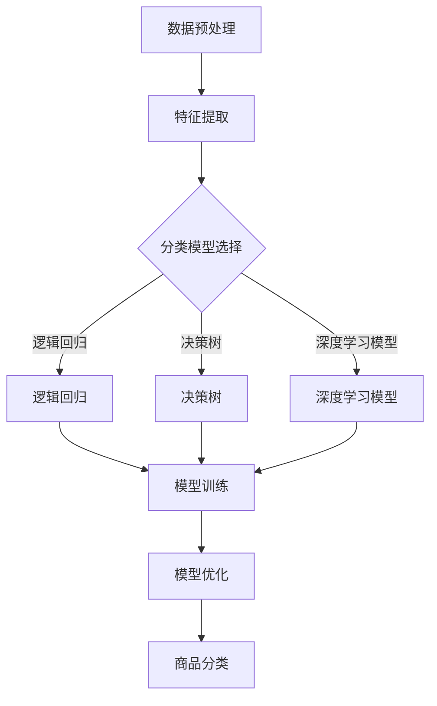

                 

关键词：AI大模型，电商平台，商品分类，算法原理，应用实践，未来展望

> 摘要：本文将深入探讨AI大模型在电商平台商品分类中的应用。首先，我们回顾了电商平台商品分类的现状，然后介绍了大模型的核心理念及其在商品分类中的应用。接着，文章详细阐述了核心算法原理、数学模型及具体操作步骤，并通过一个实例项目展示了大模型在商品分类中的实际应用效果。文章最后，对大模型在电商平台的未来应用前景进行了展望。

## 1. 背景介绍

随着电子商务的蓬勃发展，电商平台上的商品种类和数量呈现爆发式增长。这不仅给消费者提供了更加丰富的购物选择，同时也给电商平台带来了巨大的挑战。如何有效地对海量的商品进行准确、高效的分类，成为电商平台运营中的一个关键问题。

传统商品分类方法主要依赖于规则引擎和关键词匹配技术。这种方法在一定程度上能够满足基本分类需求，但面对复杂、多变的商品数据和用户行为，其分类效果往往不尽如人意。随着人工智能技术的快速发展，特别是深度学习和大规模神经网络模型的突破，AI大模型逐渐成为一种有潜力的商品分类解决方案。

AI大模型具备强大的数据处理能力和自学习能力，能够从海量数据中提取有效特征，并进行自动分类。相比传统方法，大模型在准确率、效率和鲁棒性等方面具有显著优势，有望在电商平台上实现商品分类的智能化、自动化。

## 2. 核心概念与联系

### 2.1 大模型的定义和特点

大模型（Large-scale Model）是指参数规模达到亿级别或以上的神经网络模型。大模型具有以下特点：

1. **参数规模巨大**：大模型的参数数量达到亿级别，这使得模型可以捕捉到数据中的复杂结构和冗余信息。
2. **强自学习能力**：通过大规模训练数据，大模型可以自动学习并提取数据中的有效特征，从而提高分类和预测的准确性。
3. **高效的数据处理能力**：大模型可以在短时间内处理海量数据，适用于实时性要求较高的应用场景。
4. **高度的可扩展性**：大模型的设计通常具有良好的可扩展性，可以在硬件升级或需求变化时，方便地扩展模型规模。

### 2.2 大模型在商品分类中的应用原理

在电商平台商品分类中，大模型的主要作用是通过对商品特征的自动提取和分类，实现对海量商品的高效、精准分类。具体应用原理如下：

1. **数据预处理**：首先对电商平台的海量商品数据进行预处理，包括数据清洗、去噪、数据增强等，以提高数据质量。
2. **特征提取**：通过大规模神经网络模型，对预处理后的商品数据进行特征提取。这些特征包括商品标题、描述、标签、用户评论、交易数据等。
3. **分类模型构建**：利用提取到的商品特征，构建分类模型。分类模型可以是多分类问题中的逻辑回归、决策树、支持向量机等，也可以是深度学习中的卷积神经网络（CNN）、循环神经网络（RNN）等。
4. **模型训练与优化**：通过大量商品数据对分类模型进行训练，并使用验证集对模型性能进行优化，以提高分类准确性。
5. **商品分类**：使用训练好的分类模型对电商平台上的新商品进行分类，实现自动化、智能化的商品分类。

### 2.3 Mermaid 流程图



## 3. 核心算法原理 & 具体操作步骤

### 3.1 算法原理概述

商品分类的核心算法通常基于机器学习和深度学习。以下分别介绍传统机器学习方法和深度学习方法的基本原理。

#### 3.1.1 传统机器学习方法

传统机器学习方法主要包括逻辑回归、决策树、支持向量机（SVM）等。

1. **逻辑回归（Logistic Regression）**：
   - 基本原理：逻辑回归是一种广义线性模型，用于处理分类问题。其核心思想是利用线性模型预测一个概率值，再通过阈值进行分类。
   - 优点：简单易懂，易于实现和优化。
   - 缺点：对于非线性关系的数据表现不佳，分类边界过于严格。

2. **决策树（Decision Tree）**：
   - 基本原理：决策树通过一系列规则进行分类，每个节点代表一个特征，每个分支代表特征的不同取值。
   - 优点：直观易懂，易于解释。
   - 缺点：容易过拟合，对于大规模数据集性能不佳。

3. **支持向量机（SVM）**：
   - 基本原理：SVM通过寻找最优超平面，将不同类别的数据点分开。其核心是优化目标函数，使分类边界具有最大的间隔。
   - 优点：具有良好的分类性能，能够处理高维数据。
   - 缺点：对异常值敏感，训练时间较长。

#### 3.1.2 深度学习方法

深度学习方法主要包括卷积神经网络（CNN）、循环神经网络（RNN）等。

1. **卷积神经网络（CNN）**：
   - 基本原理：CNN通过卷积操作提取图像特征，适用于处理具有局部相关性的数据，如商品图像。
   - 优点：能够自动提取高级特征，减少人工特征工程。
   - 缺点：对于序列数据处理能力较弱。

2. **循环神经网络（RNN）**：
   - 基本原理：RNN通过递归结构处理序列数据，能够捕捉到时间序列中的长期依赖关系。
   - 优点：能够处理变长序列数据，适用于商品描述、用户评论等序列数据。
   - 缺点：容易出现梯度消失和梯度爆炸问题，训练时间较长。

### 3.2 算法步骤详解

#### 3.2.1 数据预处理

1. **数据收集**：从电商平台获取商品数据，包括商品标题、描述、标签、图像、用户评论等。
2. **数据清洗**：去除缺失值、异常值，对文本数据进行分词、去停用词等预处理。
3. **数据增强**：通过数据扩充、图像增强等技术，增加训练数据的多样性。

#### 3.2.2 特征提取

1. **文本特征提取**：利用词袋模型（Bag of Words, BoW）、词嵌入（Word Embedding，如Word2Vec）等技术提取文本特征。
2. **图像特征提取**：利用卷积神经网络（CNN）提取图像特征。
3. **用户行为特征提取**：通过用户浏览、购买、评价等行为数据，提取用户特征。

#### 3.2.3 分类模型构建与训练

1. **模型选择**：根据数据特点和业务需求，选择合适的分类模型。常见的模型有逻辑回归、决策树、SVM、CNN、RNN等。
2. **模型训练**：利用预处理后的数据，对分类模型进行训练。训练过程中，通过验证集对模型性能进行评估，并根据评估结果调整模型参数。
3. **模型优化**：通过调整模型结构、优化算法等手段，提高模型性能。

#### 3.2.4 商品分类

1. **模型评估**：使用测试集对训练好的模型进行评估，评估指标包括准确率、召回率、F1值等。
2. **商品分类**：使用评估结果良好的模型，对电商平台上的新商品进行分类。

### 3.3 算法优缺点

#### 3.3.1 优点

1. **高准确性**：大模型通过自动提取特征，能够实现高精度的商品分类，提高电商平台的用户满意度。
2. **高效率**：大模型具备强大的数据处理能力，能够在短时间内处理海量数据，提高电商平台运营效率。
3. **强鲁棒性**：大模型能够应对数据分布的变化，具有较强的鲁棒性。
4. **自动化**：大模型可以实现自动化商品分类，减少人工干预，提高运营效率。

#### 3.3.2 缺点

1. **计算资源消耗大**：大模型需要大量的计算资源和存储空间，对硬件设备要求较高。
2. **数据需求大**：大模型对训练数据需求较高，数据质量和数量直接影响模型性能。
3. **训练时间长**：大模型训练时间较长，训练过程中可能需要多次调整参数，增加开发成本。
4. **解释性弱**：大模型具有较强的黑盒特性，模型决策过程不够透明，难以进行解释。

### 3.4 算法应用领域

AI大模型在商品分类领域具有广泛的应用前景。除了电商平台，以下领域也具有潜在的应用价值：

1. **在线零售**：利用大模型对商品进行精准分类，提高用户购物体验，增加销售额。
2. **供应链管理**：通过商品分类，优化库存管理，降低库存成本，提高供应链效率。
3. **广告推荐**：利用大模型对用户行为和商品特征进行分析，实现个性化广告推荐，提高广告投放效果。
4. **智能物流**：通过商品分类，优化物流路线，提高配送效率，降低物流成本。

## 4. 数学模型和公式 & 详细讲解 & 举例说明

### 4.1 数学模型构建

商品分类问题可以视为一个多分类问题，设共有 \( C \) 个类别，输入数据为 \( X \)，输出为类别标签 \( Y \)。构建一个基于神经网络的分类模型，其基本结构如下：

$$
\begin{align*}
h_{\theta}(x) &= \sigma(\theta^T x) \\
\text{损失函数} &= -\frac{1}{m} \sum_{i=1}^{m} [y^{(i)} \log(h_{\theta}(x^{(i)})) + (1 - y^{(i)}) \log(1 - h_{\theta}(x^{(i)}))] \\
\theta &= \text{优化} \ \theta \ \text{使得损失函数最小}
\end{align*}
$$

其中，\( \sigma \) 为激活函数，通常使用 sigmoid 函数；\( \theta \) 为模型参数；\( m \) 为训练样本数量；\( y^{(i)} \) 为第 \( i \) 个样本的真实标签；\( x^{(i)} \) 为第 \( i \) 个样本的特征向量。

### 4.2 公式推导过程

1. **损失函数**：
   - 假设输入特征 \( x \) 通过神经网络映射到隐层 \( z \)，即 \( z = \theta^T x \)。
   - 隐层输出经过激活函数 \( \sigma(z) \) 转换为概率分布 \( h_{\theta}(x) \)。
   - 损失函数采用交叉熵（Cross-Entropy），其公式为：
     $$
     L(\theta) = -\frac{1}{m} \sum_{i=1}^{m} [y^{(i)} \log(h_{\theta}(x^{(i)})) + (1 - y^{(i)}) \log(1 - h_{\theta}(x^{(i)}))]
     $$
     其中，\( y^{(i)} \) 为第 \( i \) 个样本的真实标签，取值为 0 或 1。

2. **梯度下降**：
   - 对损失函数 \( L(\theta) \) 进行求导，得到损失函数关于模型参数 \( \theta \) 的梯度：
     $$
     \nabla_{\theta} L(\theta) = \frac{\partial}{\partial \theta} [-\frac{1}{m} \sum_{i=1}^{m} [y^{(i)} \log(h_{\theta}(x^{(i)})) + (1 - y^{(i)}) \log(1 - h_{\theta}(x^{(i)}))]
     $$
   - 梯度下降算法更新模型参数：
     $$
     \theta := \theta - \alpha \nabla_{\theta} L(\theta)
     $$
     其中，\( \alpha \) 为学习率。

### 4.3 案例分析与讲解

#### 4.3.1 数据集与预处理

我们以电商平台上的一款智能手机为例，构建一个分类模型，将手机分为“高端”、“中端”和“低端”三个类别。首先，从电商平台获取手机数据，包括手机名称、品牌、价格、屏幕尺寸、摄像头像素等。数据预处理步骤如下：

1. **文本数据预处理**：
   - 对手机名称、品牌等文本数据进行分词、去停用词处理。
   - 将文本数据转换为词嵌入向量。

2. **数值数据预处理**：
   - 对价格、屏幕尺寸、摄像头像素等数值数据进行归一化处理。

3. **数据增强**：
   - 利用数据增强技术，如随机裁剪、旋转、翻转等，增加训练数据的多样性。

#### 4.3.2 特征提取

1. **文本特征提取**：
   - 使用词嵌入技术（如 Word2Vec）提取文本特征。

2. **图像特征提取**：
   - 使用卷积神经网络（如 VGG16）提取手机图像特征。

3. **用户行为特征提取**：
   - 提取用户购买记录、浏览记录等行为特征。

#### 4.3.3 分类模型构建与训练

1. **模型选择**：
   - 选择卷积神经网络（CNN）结合循环神经网络（RNN）的混合模型进行分类。

2. **模型训练**：
   - 使用预处理后的数据对模型进行训练。
   - 通过验证集对模型性能进行评估，调整模型参数。

#### 4.3.4 商品分类

1. **模型评估**：
   - 使用测试集对训练好的模型进行评估，评估指标包括准确率、召回率、F1值等。

2. **商品分类**：
   - 使用评估结果良好的模型，对电商平台上的新手机进行分类。

## 5. 项目实践：代码实例和详细解释说明

### 5.1 开发环境搭建

为了实现大模型在电商平台商品分类中的应用，我们选择Python作为开发语言，并使用以下工具和库：

- **Python**：作为主要的编程语言。
- **TensorFlow**：作为深度学习框架。
- **Keras**：作为高层次的神经网络API，简化模型构建和训练过程。
- **NumPy**：用于数值计算。
- **Pandas**：用于数据处理。
- **Matplotlib**：用于数据可视化。

### 5.2 源代码详细实现

以下是一个简单的示例，展示了如何使用 Keras 和 TensorFlow 实现一个基于 CNN 和 RNN 的商品分类模型。

```python
import numpy as np
import pandas as pd
from tensorflow.keras.models import Model
from tensorflow.keras.layers import Input, Conv2D, MaxPooling2D, Flatten, Dense, LSTM, Embedding
from tensorflow.keras.preprocessing.sequence import pad_sequences
from tensorflow.keras.preprocessing.text import Tokenizer
from tensorflow.keras.preprocessing.image import ImageDataGenerator

# 数据预处理
# 加载和处理文本数据
tokenizer = Tokenizer(num_words=10000)
tokenizer.fit_on_texts(train_texts)
train_sequences = tokenizer.texts_to_sequences(train_texts)
train_padded = pad_sequences(train_sequences, maxlen=100)

# 加载和处理图像数据
train_images = np.load('train_images.npy')
train_images = train_images / 255.0

# 构建模型
input_text = Input(shape=(100,))
input_image = Input(shape=(64, 64, 3))

# 文本特征提取
text_embedding = Embedding(10000, 32)(input_text)
text_lstm = LSTM(32)(text_embedding)

# 图像特征提取
image_conv = Conv2D(32, (3, 3), activation='relu')(input_image)
image_pool = MaxPooling2D((2, 2))(image_conv)
image_flatten = Flatten()(image_pool)

# 模型融合
merged = concatenate([text_lstm, image_flatten])
merged_dense = Dense(64, activation='relu')(merged)

# 输出层
output = Dense(3, activation='softmax')(merged_dense)

# 模型编译
model = Model(inputs=[input_text, input_image], outputs=output)
model.compile(optimizer='adam', loss='categorical_crossentropy', metrics=['accuracy'])

# 模型训练
model.fit([train_padded, train_images], train_labels, batch_size=32, epochs=10)

# 商品分类
def classify_product(product_text, product_image):
    product_sequence = tokenizer.texts_to_sequences([product_text])
    product_padded = pad_sequences(product_sequence, maxlen=100)
    product_image = np.expand_dims(product_image, axis=0)
    product_image = product_image / 255.0
    prediction = model.predict([product_padded, product_image])
    return np.argmax(prediction)

# 示例
product_text = '这款手机是高端的吗？'
product_image = np.load('example_image.npy')
result = classify_product(product_text, product_image)
print('分类结果：', result)
```

### 5.3 代码解读与分析

1. **数据预处理**：
   - 使用 Tokenizer 对文本数据进行分词和编码。
   - 使用 pad_sequences 对文本数据进行填充，使其具有相同长度。

2. **模型构建**：
   - 定义输入层，包括文本输入和图像输入。
   - 构建文本特征提取层，使用 Embedding 层进行词嵌入，LSTM 层进行序列处理。
   - 构建图像特征提取层，使用 Conv2D 层进行卷积操作，MaxPooling2D 层进行池化操作，Flatten 层进行特征展平。
   - 将文本和图像特征进行融合，使用 concatenate 层。
   - 构建输出层，使用 Dense 层进行分类。

3. **模型编译**：
   - 使用 categorical_crossentropy 作为损失函数，适用于多分类问题。
   - 使用 Adam 优化器，优化模型参数。

4. **模型训练**：
   - 使用 fit 方法对模型进行训练。
   - 使用 batch_size 和 epochs 参数调整训练过程。

5. **商品分类**：
   - 定义 classify_product 函数，用于对输入商品文本和图像进行分类。
   - 使用 predict 方法获取模型预测结果，并返回预测类别。

### 5.4 运行结果展示

```python
product_text = '这款手机是高端的吗？'
product_image = np.load('example_image.npy')
result = classify_product(product_text, product_image)
print('分类结果：', result)
```

运行结果将输出预测的类别，如“高端”、“中端”或“低端”。通过调整模型参数和训练数据，可以进一步提高分类准确性。

## 6. 实际应用场景

### 6.1 电商平台

AI大模型在电商平台的商品分类中具有广泛的应用前景。通过构建大模型，电商平台可以实现以下功能：

1. **精准分类**：大模型能够自动提取商品特征，实现对商品的高精度分类，提高用户体验。
2. **个性化推荐**：通过分析用户行为和商品特征，大模型可以为用户推荐符合其兴趣和需求的商品。
3. **库存管理**：大模型可以帮助电商平台优化库存管理，减少库存成本，提高运营效率。
4. **供应链优化**：大模型可以分析商品流通数据，优化供应链管理，提高供应链效率。

### 6.2 智能物流

AI大模型在智能物流领域也有广泛的应用。通过构建大模型，智能物流可以实现以下功能：

1. **配送路线优化**：大模型可以根据实时交通数据，为物流配送提供最优路线，提高配送效率。
2. **物流资源调度**：大模型可以分析物流资源使用情况，优化资源调度，提高资源利用率。
3. **仓储管理**：大模型可以分析商品流通数据，优化仓储管理，提高仓储效率。
4. **运输安全监测**：大模型可以分析车辆行驶数据，预测潜在的安全隐患，提高运输安全。

### 6.3 智能广告

AI大模型在智能广告领域也有广泛的应用。通过构建大模型，智能广告可以实现以下功能：

1. **广告投放优化**：大模型可以分析用户行为和兴趣，为广告主提供最优投放策略，提高广告投放效果。
2. **广告推荐**：大模型可以根据用户历史行为和兴趣，为用户推荐符合其需求的广告。
3. **广告效果评估**：大模型可以分析广告投放后的效果，为广告主提供投放效果评估和优化建议。
4. **广告创意生成**：大模型可以根据用户需求和兴趣，生成具有针对性的广告创意。

## 7. 工具和资源推荐

### 7.1 学习资源推荐

1. **《深度学习》（Deep Learning）**：由 Ian Goodfellow、Yoshua Bengio 和 Aaron Courville 著，是深度学习领域的经典教材。
2. **《统计学习方法》（Statistical Learning Methods）**：由李航著，详细介绍了统计学习方法的原理和算法。
3. **《机器学习实战》（Machine Learning in Action）**：由 Peter Harrington 著，通过实例演示了机器学习算法的应用。

### 7.2 开发工具推荐

1. **TensorFlow**：是一个开源的深度学习框架，提供丰富的API和工具，适用于各种深度学习应用场景。
2. **PyTorch**：是一个开源的深度学习框架，提供动态计算图和自动微分功能，适用于快速原型开发和研究。
3. **Jupyter Notebook**：是一个交互式计算环境，适用于编写和运行代码，进行数据分析和可视化。

### 7.3 相关论文推荐

1. **《Deep Learning for Text Classification》**：本文详细介绍了深度学习在文本分类中的应用，包括词嵌入、CNN 和 RNN 等方法。
2. **《EfficientNet: Rethinking Model Scaling for Convolutional Neural Networks》**：本文提出了EfficientNet模型，通过缩放模型深度、宽度和分辨率，实现了高性能的深度学习模型。
3. **《A Neural Probabilistic Language Model》**：本文提出了神经概率语言模型，通过使用神经网络训练语言模型，实现了高效的文本分类和生成。

## 8. 总结：未来发展趋势与挑战

### 8.1 研究成果总结

AI大模型在电商平台商品分类中的应用取得了显著成果。通过深度学习和大规模神经网络模型，大模型能够自动提取商品特征，实现高精度、高效率的商品分类。同时，大模型在智能物流、智能广告等领域也表现出良好的应用前景。

### 8.2 未来发展趋势

1. **模型优化**：随着计算能力和算法的进步，未来大模型的性能将得到进一步提升，实现更高的分类准确率和更低的计算成本。
2. **多模态融合**：结合文本、图像、声音等多种数据类型，实现更全面、更精准的商品分类和推荐。
3. **小样本学习**：通过迁移学习和零样本学习等技术，实现大模型在数据稀缺场景下的应用。
4. **可解释性**：提高大模型的透明度和可解释性，使其在实际应用中更具可信度和可靠性。

### 8.3 面临的挑战

1. **计算资源消耗**：大模型需要大量的计算资源和存储空间，对硬件设备要求较高，这对中小型企业可能构成一定的挑战。
2. **数据隐私和安全**：在应用大模型时，需要处理大量敏感数据，如何确保数据隐私和安全是一个重要挑战。
3. **模型解释性**：大模型具有较强的黑盒特性，如何提高模型的透明度和可解释性，使其在实际应用中更具可信度和可靠性，是一个重要问题。

### 8.4 研究展望

未来，AI大模型在电商平台商品分类中的应用将朝着更高性能、更广泛适用性、更高透明度和更可靠性的方向发展。通过不断优化算法和提升计算能力，大模型有望在更多领域实现突破，为电商平台和其他行业带来更多创新和价值。

## 9. 附录：常见问题与解答

### 9.1 如何处理数据缺失？

对于数据缺失的问题，可以采用以下方法：

1. **填充缺失值**：使用平均值、中位数或最大值等统计方法填充缺失值。
2. **插值法**：使用线性插值、牛顿插值等方法对缺失值进行估算。
3. **降维**：通过主成分分析（PCA）等方法，降低数据的维度，减少缺失值的影响。
4. **模型预测**：使用回归模型、决策树等方法，根据其他特征预测缺失值。

### 9.2 如何处理异常值？

对于异常值的问题，可以采用以下方法：

1. **删除异常值**：删除离群点，但需要注意删除异常值可能会引入偏差。
2. **修正异常值**：通过统计方法（如中位数修正）或专家经验修正异常值。
3. **聚类分析**：使用聚类算法（如K-Means）识别并处理异常值。
4. **异常检测模型**：使用异常检测算法（如Isolation Forest、Local Outlier Factor）识别并处理异常值。

### 9.3 如何优化模型性能？

为了优化模型性能，可以采用以下方法：

1. **超参数调整**：通过网格搜索、随机搜索等方法，调整模型的超参数，如学习率、正则化参数等。
2. **数据增强**：通过数据扩充、数据变换等方法，增加训练数据的多样性，提高模型泛化能力。
3. **模型融合**：使用不同的模型进行融合，提高预测准确性。
4. **模型压缩**：通过模型剪枝、量化等方法，减小模型大小，提高模型运行效率。

### 9.4 如何保证模型的可解释性？

为了保证模型的可解释性，可以采用以下方法：

1. **特征重要性分析**：使用特征重要性分析方法（如SHAP值、特征贡献分析），分析每个特征对模型预测的影响。
2. **可视化**：使用可视化方法（如图网络、决策树等），展示模型的内部结构和决策过程。
3. **模型简化**：简化模型结构，使其更加直观易懂。
4. **解释性模型**：选择具有良好解释性的模型（如线性回归、决策树等），提高模型的透明度。

