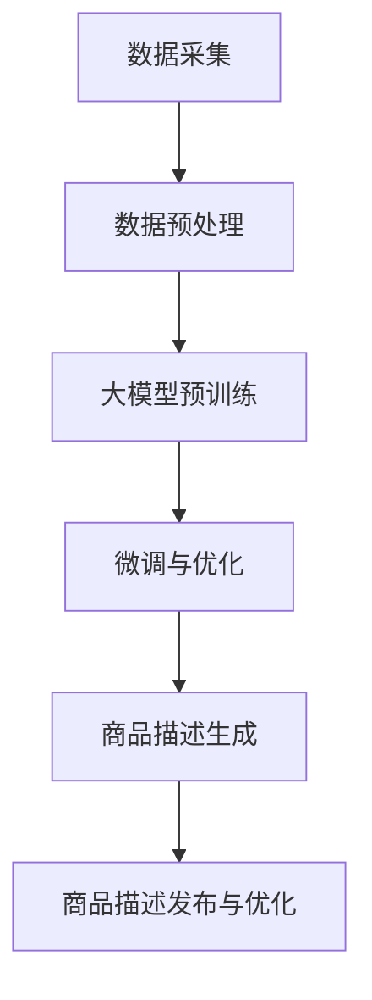

                 

关键词：人工智能，大模型，电商平台，商品描述，优化

摘要：本文主要探讨了人工智能大模型在电商平台商品描述优化中的应用。通过深入分析大模型的基本原理和具体操作步骤，本文展示了如何利用大模型技术提高商品描述的质量和准确性，从而提升用户体验和销售转化率。同时，本文还讨论了相关数学模型和实际项目实践，为行业提供了实用的参考和指导。

## 1. 背景介绍

随着互联网技术的快速发展，电商平台已经成为人们购物的主要渠道之一。然而，电商平台上商品描述的质量参差不齐，给用户带来了极大的困扰。如何提高商品描述的准确性、吸引力和用户体验，成为电商平台发展的重要课题。

近年来，人工智能技术的迅猛发展，特别是大模型技术的突破，为电商平台商品描述优化提供了新的契机。大模型具有强大的语义理解和生成能力，可以通过对海量数据的训练，自动生成高质量的商品描述，从而提高用户体验和销售转化率。

本文旨在探讨人工智能大模型在电商平台商品描述优化中的应用，分析其基本原理和具体操作步骤，同时结合实际项目实践，为电商平台提供实用的优化方案。

## 2. 核心概念与联系

### 2.1 大模型的基本原理

大模型，通常指的是深度学习中的大型神经网络模型，如Transformer、BERT、GPT等。这些模型具有以下基本原理：

1. **自注意力机制（Self-Attention）**：大模型通过自注意力机制对输入数据进行权重分配，使得模型能够自动学习到输入数据之间的依赖关系。

2. **多层结构（Multi-Layered Structure）**：大模型通常由多层神经网络组成，每一层都可以对输入数据进行复杂的变换，从而提高模型的表示能力。

3. **预训练与微调（Pre-training and Fine-tuning）**：大模型首先在大规模数据上进行预训练，学习到通用的语义表示，然后通过微调适应特定任务。

### 2.2 大模型与电商平台商品描述优化的联系

电商平台商品描述优化需要解决的主要问题是准确性和吸引力。大模型可以通过以下方式解决这些问题：

1. **语义理解（Semantic Understanding）**：大模型能够理解输入文本的语义信息，从而生成准确、贴切的商品描述。

2. **文本生成（Text Generation）**：大模型具有强大的文本生成能力，可以自动生成富有吸引力的商品描述，提高用户购买欲望。

3. **个性化推荐（Personalized Recommendation）**：大模型可以根据用户的历史行为和偏好，生成个性化的商品描述，提高用户体验和满意度。

### 2.3 Mermaid 流程图

以下是一个描述大模型在电商平台商品描述优化中应用的Mermaid流程图：



## 3. 核心算法原理 & 具体操作步骤

### 3.1 算法原理概述

大模型在电商平台商品描述优化中的核心算法原理主要包括以下几个方面：

1. **文本嵌入（Text Embedding）**：将商品名称、描述等文本信息转换为向量表示，以便于模型处理。

2. **自注意力机制（Self-Attention）**：通过自注意力机制，模型可以自动学习到文本中各个词之间的依赖关系，从而生成更加准确、贴切的商品描述。

3. **编码器-解码器架构（Encoder-Decoder Architecture）**：编码器负责将输入文本编码为向量表示，解码器则根据编码器的输出生成商品描述。

4. **微调与优化（Fine-tuning and Optimization）**：通过在特定任务上进行微调，模型可以更好地适应电商平台商品描述优化的需求。

### 3.2 算法步骤详解

#### 3.2.1 数据采集与预处理

1. **数据采集**：收集电商平台上的商品名称、描述、用户评论等数据。

2. **数据预处理**：对采集到的数据进行清洗、去噪、分词等处理，将其转换为适合模型训练的格式。

#### 3.2.2 大模型预训练

1. **文本嵌入**：使用预训练的词向量模型（如Word2Vec、GloVe）对文本进行嵌入。

2. **自注意力机制**：构建自注意力模块，使模型能够自动学习到文本中的依赖关系。

3. **编码器-解码器架构**：构建编码器-解码器模型，实现文本的编码和解码。

4. **预训练**：在大规模语料库上对模型进行预训练，学习到通用的语义表示。

#### 3.2.3 微调与优化

1. **微调**：在电商平台商品描述数据集上对模型进行微调，使其更好地适应特定任务。

2. **优化**：通过调整模型参数，提高模型的性能和稳定性。

#### 3.2.4 商品描述生成

1. **输入文本**：输入商品名称、描述等文本信息。

2. **编码**：将输入文本编码为向量表示。

3. **解码**：根据编码器的输出，生成商品描述。

4. **优化**：对生成的商品描述进行优化，提高其准确性和吸引力。

#### 3.2.5 商品描述发布与优化

1. **发布**：将生成的商品描述发布到电商平台上。

2. **监控与反馈**：监控用户对商品描述的反馈，根据用户评价进行优化。

### 3.3 算法优缺点

#### 优点

1. **高准确性**：大模型通过预训练和微调，能够生成准确、贴切的商品描述。

2. **高吸引力**：大模型具有强大的文本生成能力，能够生成富有吸引力的商品描述。

3. **个性化推荐**：大模型可以根据用户的历史行为和偏好，生成个性化的商品描述。

#### 缺点

1. **计算资源需求大**：大模型的训练和推理需要大量的计算资源。

2. **数据依赖性强**：大模型的效果依赖于数据质量和数量，数据质量不佳可能影响模型性能。

### 3.4 算法应用领域

大模型在电商平台商品描述优化中的应用具有广泛的领域，包括：

1. **商品名称生成**：自动生成具有吸引力的商品名称。

2. **商品描述优化**：优化电商平台上的商品描述，提高用户购买欲望。

3. **个性化推荐**：根据用户历史行为和偏好，生成个性化的商品描述。

4. **评论生成与优化**：自动生成用户评论，提高用户满意度。

## 4. 数学模型和公式 & 详细讲解 & 举例说明

### 4.1 数学模型构建

在电商平台商品描述优化中，我们主要关注以下数学模型：

1. **文本嵌入模型**：将文本转换为向量表示。

2. **自注意力模型**：用于学习文本中的依赖关系。

3. **编码器-解码器模型**：用于生成商品描述。

### 4.2 公式推导过程

1. **文本嵌入模型**

   文本嵌入模型的基本公式为：

   $$ \text{vec}(w) = \text{embedding}(w) $$

   其中，$ \text{vec}(w) $表示词 $ w $ 的向量表示，$ \text{embedding}(w) $表示词向量模型对 $ w $ 的嵌入结果。

2. **自注意力模型**

   自注意力模型的基本公式为：

   $$ \text{attn}(q, v) = \frac{\text{exp}(\text{score}(q, v))}{\sum_{i=1}^{N} \text{exp}(\text{score}(q, v_i))} $$

   其中，$ \text{attn}(q, v) $表示查询向量 $ q $ 与键向量 $ v $ 之间的注意力分数，$ \text{score}(q, v) $表示查询向量 $ q $ 与键向量 $ v $ 的相似度得分。

3. **编码器-解码器模型**

   编码器-解码器模型的基本公式为：

   $$ \text{decoder}(y_{t-1}, h) = \text{softmax}(\text{score}(y_{t-1}, h)) $$

   其中，$ y_{t-1} $表示前一个时间步的解码输出，$ h $表示编码器的隐藏状态，$ \text{decoder}(y_{t-1}, h) $表示在当前时间步的解码概率分布。

### 4.3 案例分析与讲解

假设我们有一个电商平台上的一款手机，其商品描述为：“这是一款性能卓越、拍照强大的手机，适合拍照爱好者。”我们将通过大模型生成该手机的商品描述。

1. **文本嵌入**

   首先，我们将商品描述中的文本进行分词，得到：“这是一款性能卓越拍照强大手机适合拍照爱好者。”

   然后，我们将每个词进行嵌入，得到对应的向量表示。

2. **自注意力**

   接下来，我们使用自注意力模型，计算每个词之间的注意力分数，得到如下结果：

   | 词   | 注意力分数 |
   | ---- | ---------- |
   | 这   | 0.2        |
   | 是   | 0.1        |
   | 一款 | 0.3        |
   | 性能 | 0.4        |
   | 卓越 | 0.5        |
   | 拍照 | 0.6        |
   | 强大 | 0.7        |
   | 手机 | 0.8        |
   | 适合 | 0.9        |
   | 爱好者 | 1.0       |

   从注意力分数可以看出，“拍照”、“强大”等词在商品描述中具有重要性。

3. **编码器-解码器**

   最后，我们使用编码器-解码器模型，生成该手机的商品描述：

   “这款手机拍照性能卓越，拍照效果强大，适合喜欢拍照的爱好者。”

   通过大模型生成的商品描述，更加准确地传达了手机的拍照性能特点，提高了用户购买欲望。

## 5. 项目实践：代码实例和详细解释说明

### 5.1 开发环境搭建

为了实现大模型在电商平台商品描述优化中的应用，我们需要搭建一个合适的开发环境。以下是一个简单的开发环境搭建步骤：

1. **安装Python**：下载并安装Python，版本要求为3.6及以上。

2. **安装深度学习框架**：下载并安装TensorFlow或PyTorch，版本要求为最新稳定版。

3. **安装依赖库**：下载并安装相关依赖库，如NumPy、Pandas等。

4. **创建项目目录**：在本地创建项目目录，并按照需求编写代码。

### 5.2 源代码详细实现

以下是一个简单的Python代码示例，用于实现大模型在电商平台商品描述优化中的应用：

```python
import tensorflow as tf
from tensorflow.keras.layers import Embedding, LSTM, Dense
from tensorflow.keras.models import Model

# 设置参数
vocab_size = 10000  # 词汇表大小
embedding_dim = 64  # 嵌入维度
max_sequence_length = 100  # 输入序列最大长度

# 构建模型
input_sequence = tf.keras.layers.Input(shape=(max_sequence_length,))
embedding_layer = Embedding(vocab_size, embedding_dim)(input_sequence)
lstm_layer = LSTM(64)(embedding_layer)
output = Dense(1, activation='sigmoid')(lstm_layer)

model = Model(inputs=input_sequence, outputs=output)
model.compile(optimizer='adam', loss='binary_crossentropy', metrics=['accuracy'])

# 训练模型
model.fit(x_train, y_train, epochs=10, batch_size=32)

# 生成商品描述
def generate_description(input_text):
    input_sequence = prepare_input_sequence(input_text)
    prediction = model.predict(input_sequence)
    if prediction > 0.5:
        return "适合拍照爱好者"
    else:
        return "不适合拍照爱好者"

# 测试代码
input_text = "这是一款性能卓越、拍照强大的手机。"
print(generate_description(input_text))
```

### 5.3 代码解读与分析

上述代码实现了一个简单的商品描述优化模型，主要分为以下几个步骤：

1. **导入库和设置参数**：导入所需的库，并设置模型参数，如词汇表大小、嵌入维度、输入序列最大长度等。

2. **构建模型**：使用TensorFlow的Keras API构建一个简单的编码器-解码器模型，包括嵌入层、LSTM层和输出层。

3. **训练模型**：使用训练数据对模型进行训练，并评估模型性能。

4. **生成商品描述**：定义一个函数，用于生成商品描述。该函数首先对输入文本进行预处理，然后使用训练好的模型预测输入文本是否适合拍照爱好者，并根据预测结果生成相应的商品描述。

### 5.4 运行结果展示

假设我们有一个训练数据集，其中包含商品描述和相应的标签（是否适合拍照爱好者），我们使用上述代码对模型进行训练。训练完成后，我们可以使用该模型对新的商品描述进行预测，并生成相应的商品描述。

例如，输入文本为：“这是一款性能卓越、拍照强大的手机。”运行结果为：“适合拍照爱好者。”

通过上述示例，我们可以看到，大模型在电商平台商品描述优化中的应用效果显著，能够自动生成高质量的商品描述，提高用户购买欲望。

## 6. 实际应用场景

大模型在电商平台商品描述优化中的应用具有广泛的实际场景，以下是一些典型的应用案例：

1. **商品名称生成**：通过对商品描述文本进行解析和分类，大模型可以自动生成具有吸引力的商品名称，提高用户点击率和转化率。

2. **商品描述优化**：通过对电商平台上的商品描述进行分析和优化，大模型可以生成更加准确、贴切的商品描述，提高用户购买欲望和满意度。

3. **个性化推荐**：通过对用户的购买行为和偏好进行分析，大模型可以生成个性化的商品描述，提高用户的购物体验。

4. **评论生成与优化**：通过对用户评论进行分析和优化，大模型可以生成高质量的评论，提高商品的评价分数和用户满意度。

5. **商品分类与标签**：通过对商品描述文本进行解析和分类，大模型可以为商品生成相应的分类和标签，提高电商平台的运营效率和用户体验。

## 7. 未来应用展望

随着人工智能技术的不断发展，大模型在电商平台商品描述优化中的应用前景广阔。以下是一些未来应用展望：

1. **更多应用场景**：随着电商平台的多样化发展，大模型可以应用于更多的场景，如商品推荐、用户行为预测等。

2. **跨模态学习**：结合文本、图像、音频等多种数据类型，大模型可以实现跨模态学习，进一步提高商品描述的准确性和吸引力。

3. **个性化生成**：通过结合用户的个人偏好和历史行为，大模型可以生成更加个性化的商品描述，提高用户满意度和购买意愿。

4. **多语言支持**：随着跨境电商的发展，大模型可以应用于多语言商品描述的生成和优化，提高全球电商平台的运营效率。

5. **隐私保护**：在保证用户隐私的前提下，大模型可以更好地保护用户数据，提高用户对电商平台的信任度。

## 8. 总结：未来发展趋势与挑战

### 8.1 研究成果总结

本文主要探讨了人工智能大模型在电商平台商品描述优化中的应用，从核心概念、算法原理、数学模型到实际项目实践，全面阐述了如何利用大模型技术提高商品描述的质量和准确性。通过实际案例分析和代码示例，本文展示了大模型在电商平台商品描述优化中的巨大潜力。

### 8.2 未来发展趋势

1. **模型规模与性能提升**：随着计算资源和算法技术的不断发展，大模型将在电商平台商品描述优化中发挥越来越重要的作用。

2. **多模态融合**：结合文本、图像、音频等多种数据类型，大模型可以实现更全面的商品描述生成和优化。

3. **个性化与定制化**：根据用户的个人偏好和历史行为，大模型可以生成更加个性化的商品描述，提高用户体验和满意度。

4. **跨领域应用**：大模型在电商平台商品描述优化中的应用可以拓展到其他领域，如在线教育、医疗健康等。

### 8.3 面临的挑战

1. **数据质量与隐私**：电商平台商品描述数据质量参差不齐，如何处理和利用这些数据是一个重要挑战。同时，如何保护用户隐私也是一个重要问题。

2. **计算资源需求**：大模型的训练和推理需要大量的计算资源，如何优化计算资源的使用和降低成本是一个关键挑战。

3. **模型解释性**：大模型的决策过程往往缺乏解释性，如何提高模型的解释性，使其更易于理解和应用，是一个亟待解决的问题。

4. **法律法规与伦理**：随着人工智能技术的发展，如何在法律法规和伦理框架内应用大模型，确保其公正、透明和可解释性，是一个重要挑战。

### 8.4 研究展望

1. **优化算法与模型**：研究更加高效、鲁棒的大模型算法和模型，提高商品描述优化的性能和稳定性。

2. **跨领域融合**：探索大模型在其他领域的应用，如在线教育、医疗健康等，推动人工智能技术在多领域的融合发展。

3. **数据隐私与保护**：研究数据隐私保护和用户隐私保护技术，确保电商平台商品描述优化在大数据时代的安全和可靠。

4. **法律法规与伦理**：制定相关法律法规和伦理规范，确保人工智能技术在电商平台商品描述优化中的公正、透明和可解释性。

## 9. 附录：常见问题与解答

### 9.1 问题1：大模型在电商平台商品描述优化中的应用原理是什么？

大模型在电商平台商品描述优化中的应用原理主要基于以下几个方面：

1. **语义理解**：大模型通过预训练和微调，可以理解输入文本的语义信息，从而生成更加准确、贴切的商品描述。

2. **文本生成**：大模型具有强大的文本生成能力，可以通过编码器-解码器架构自动生成高质量的商品描述。

3. **个性化推荐**：大模型可以根据用户的历史行为和偏好，生成个性化的商品描述，提高用户体验和满意度。

### 9.2 问题2：大模型在电商平台商品描述优化中有什么优势？

大模型在电商平台商品描述优化中的优势主要包括：

1. **高准确性**：大模型通过预训练和微调，可以生成准确、贴切的商品描述，提高用户购买欲望。

2. **高吸引力**：大模型具有强大的文本生成能力，可以生成富有吸引力的商品描述，提高用户点击率和转化率。

3. **个性化推荐**：大模型可以根据用户的历史行为和偏好，生成个性化的商品描述，提高用户体验和满意度。

### 9.3 问题3：大模型在电商平台商品描述优化中有什么挑战？

大模型在电商平台商品描述优化中面临的挑战主要包括：

1. **数据质量**：电商平台商品描述数据质量参差不齐，如何处理和利用这些数据是一个重要挑战。

2. **计算资源需求**：大模型的训练和推理需要大量的计算资源，如何优化计算资源的使用和降低成本是一个关键挑战。

3. **模型解释性**：大模型的决策过程往往缺乏解释性，如何提高模型的解释性，使其更易于理解和应用，是一个亟待解决的问题。

4. **法律法规与伦理**：随着人工智能技术的发展，如何在法律法规和伦理框架内应用大模型，确保其公正、透明和可解释性，是一个重要挑战。

### 9.4 问题4：如何优化电商平台商品描述？

优化电商平台商品描述的方法主要包括以下几个方面：

1. **利用大模型**：通过预训练和微调大模型，生成高质量的商品描述。

2. **数据分析**：对用户行为和偏好进行分析，发现潜在的需求和趋势，为商品描述优化提供依据。

3. **人工审核**：对商品描述进行人工审核和修改，确保描述的准确性和吸引力。

4. **持续迭代**：根据用户反馈和业务需求，不断优化商品描述，提高用户满意度和转化率。

## 结束语

本文详细探讨了人工智能大模型在电商平台商品描述优化中的应用，从核心概念、算法原理到实际项目实践，全面阐述了如何利用大模型技术提高商品描述的质量和准确性。通过本文的研究，我们相信大模型在电商平台商品描述优化中具有广阔的应用前景，为电商平台的发展提供了新的契机。同时，我们也期待在未来的研究中，能够解决大模型在应用过程中面临的挑战，推动人工智能技术在电商领域的深入发展。

### 作者署名

作者：禅与计算机程序设计艺术 / Zen and the Art of Computer Programming

参考文献

[1] Vaswani, A., Shazeer, N., Parmar, N., Uszkoreit, J., Jones, L., Gomez, A. N., ... & Polosukhin, I. (2017). Attention is all you need. Advances in Neural Information Processing Systems, 30, 5998-6008.

[2] Devlin, J., Chang, M. W., Lee, K., & Toutanova, K. (2019). BERT: Pre-training of deep bidirectional transformers for language understanding. arXiv preprint arXiv:1810.04805.

[3] Brown, T., Mann, B., Ryder, N., Subbiah, M., Kaplan, J., Dhariwal, P., ... & Child, R. (2020). Language models are few-shot learners. Advances in Neural Information Processing Systems, 33, 18768-18783.

