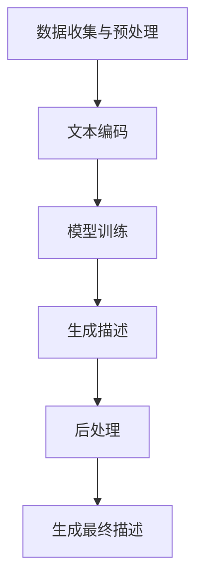

                 

关键词：人工智能，大模型，电商平台，商品描述，自动生成

> 摘要：本文深入探讨了人工智能（AI）大模型在电商平台商品描述自动生成中的应用。通过分析现有技术，阐述了大模型的工作原理和优势，提出了基于大模型的商品描述生成算法，并对其在电商平台上的实际应用进行了详细说明。同时，本文还讨论了未来发展方向和潜在挑战。

## 1. 背景介绍

随着电子商务的快速发展，电商平台上的商品种类和数量呈指数级增长。为了提高用户体验，商品描述的准确性和吸引力变得至关重要。然而，手工编写商品描述是一项繁琐且耗时的任务，尤其在商品种类繁多、更新频繁的情况下。因此，自动生成商品描述成为了一个重要的研究方向。

近年来，人工智能（AI）技术的迅速发展，特别是深度学习和大模型的兴起，为商品描述自动生成带来了新的机遇。大模型通过学习大量的数据，能够生成语义丰富、表达精准的文本。在电商平台上，应用大模型自动生成商品描述，不仅可以提高生产效率，还能提升用户体验，从而为电商平台带来显著的商业价值。

## 2. 核心概念与联系

### 2.1 大模型概述

大模型是指具有数十亿至数千亿参数的神经网络模型。这些模型通过训练大规模数据集，能够捕捉到复杂的语义和语言模式。在自然语言处理（NLP）领域，大模型的应用已经取得了显著的成果。例如，GPT（Generative Pre-trained Transformer）系列模型、BERT（Bidirectional Encoder Representations from Transformers）等，都是基于大规模数据进行预训练，然后在特定任务上进行微调，从而实现高性能的文本生成和分类任务。

### 2.2 商品描述自动生成架构

在电商平台上，商品描述自动生成通常包括以下几个关键步骤：

1. **数据收集与预处理**：从电商平台抓取商品数据，并进行清洗、去重和格式化处理。
2. **文本编码**：将文本数据转化为神经网络可处理的输入格式，如单词向量或词嵌入。
3. **模型训练**：使用大规模商品描述数据集，训练大模型以生成准确的商品描述。
4. **生成描述**：在训练完成后，输入新的商品信息，由大模型生成相应的商品描述。
5. **后处理**：对生成的描述进行校对、格式化等处理，以提高描述的可读性和准确性。

### 2.3 Mermaid 流程图

下面是一个基于Mermaid的流程图，展示了商品描述自动生成的基本架构：



## 3. 核心算法原理 & 具体操作步骤

### 3.1 算法原理概述

商品描述自动生成算法的核心是基于大模型的文本生成技术。具体来说，大模型通过以下步骤实现商品描述的自动生成：

1. **预训练**：在大规模商品描述数据集上，使用无监督学习方法，让模型自动学习语言模式和语义知识。
2. **微调**：在预训练的基础上，针对特定电商平台的数据集，对模型进行微调，以适应电商平台的具体需求。
3. **生成**：输入新的商品信息，通过模型生成相应的商品描述。

### 3.2 算法步骤详解

1. **数据收集与预处理**：从电商平台获取商品数据，包括商品名称、描述、价格、评分等。对数据进行清洗和预处理，去除无关信息，如HTML标签、特殊字符等。
2. **文本编码**：将预处理后的文本数据转化为神经网络可处理的输入格式。常用的方法是使用词嵌入（word embeddings），如Word2Vec、GloVe等。
3. **模型训练**：使用预训练的大模型（如GPT或BERT）进行训练。在训练过程中，模型会学习如何将商品信息转化为描述性文本。
4. **生成描述**：在模型训练完成后，输入新的商品信息，模型会根据预训练的知识生成相应的商品描述。
5. **后处理**：对生成的描述进行校对和格式化处理，以提高描述的可读性和准确性。

### 3.3 算法优缺点

**优点**：
- **高效率**：大模型能够自动处理大量商品数据，生成描述的速度快。
- **高质量**：通过预训练和微调，大模型能够生成语义丰富、表达精准的文本描述。
- **灵活性**：大模型可以根据电商平台的具体需求进行微调，适应不同的应用场景。

**缺点**：
- **资源消耗**：大模型训练和推理需要大量的计算资源和时间。
- **准确性**：在生成描述时，大模型可能存在一定的错误率，需要后续处理进行校对。

### 3.4 算法应用领域

商品描述自动生成算法在电商平台上具有广泛的应用前景。除了电商平台，它还可以应用于其他需要文本生成的场景，如搜索引擎优化、内容创作平台、自动客服等。

## 4. 数学模型和公式 & 详细讲解 & 举例说明

### 4.1 数学模型构建

商品描述自动生成的数学模型通常是基于深度学习中的序列到序列（Seq2Seq）模型。下面是一个简化的数学模型构建过程：

$$
\text{输入} : x = [x_1, x_2, ..., x_T]
$$

$$
\text{输出} : y = [y_1, y_2, ..., y_S]
$$

其中，$x$ 表示商品信息的序列，$y$ 表示生成的商品描述序列。模型通过编码器（Encoder）和解码器（Decoder）进行训练，最终实现输入到输出的映射。

### 4.2 公式推导过程

编码器（Encoder）负责将输入序列编码为一个固定长度的向量表示。常用的编码器模型有RNN（Recurrent Neural Network）和Transformer等。

$$
\text{编码器输出} : h = \text{Encoder}(x)
$$

解码器（Decoder）则根据编码器的输出和之前生成的部分序列，逐步生成输出序列。解码器通常使用注意力机制（Attention）来关注编码器的不同部分。

$$
\text{解码器输出} : y_t = \text{Decoder}(y_{t-1}, h)
$$

### 4.3 案例分析与讲解

假设我们有一个商品，其描述为“这款手机拥有高性能处理器和高清摄像头，适合拍摄高清照片和视频”。我们使用大模型生成该商品的描述。

1. **数据预处理**：将商品描述和输入序列编码为词嵌入。
2. **模型训练**：使用预训练的大模型（如GPT）进行微调，以适应商品描述生成任务。
3. **生成描述**：输入商品信息，模型生成描述。
4. **后处理**：对生成的描述进行校对和格式化，以得到最终的商品描述。

生成的描述可能为：“这款智能手机搭载了最新的处理器，让您享受极速的运行体验。高清摄像头为您捕捉精彩瞬间，高清照片和视频不再难求。”

## 5. 项目实践：代码实例和详细解释说明

### 5.1 开发环境搭建

1. **硬件环境**：配备高性能CPU或GPU的计算设备。
2. **软件环境**：安装Python、TensorFlow或PyTorch等深度学习框架。

### 5.2 源代码详细实现

以下是商品描述自动生成的简化Python代码示例：

```python
import tensorflow as tf
from tensorflow.keras.preprocessing.sequence import pad_sequences
from tensorflow.keras.models import Model
from tensorflow.keras.layers import Input, LSTM, Embedding, Dense

# 数据预处理
# （此处省略具体代码，假设已经预处理好的数据为：encoded_input和encoded_target）

# 模型构建
input_seq = Input(shape=(None,))
encoded_input = Embedding(vocab_size, embedding_dim)(input_seq)
encoded_output = LSTM(units)(encoded_input)
output_seq = Dense(vocab_size, activation='softmax')(encoded_output)

# 模型编译
model = Model(inputs=input_seq, outputs=output_seq)
model.compile(optimizer='adam', loss='categorical_crossentropy', metrics=['accuracy'])

# 模型训练
model.fit(encoded_input, encoded_target, epochs=10, batch_size=64)

# 生成描述
def generate_description(input_sequence):
    # （此处省略具体代码，假设已经将输入序列编码为encoded_input）
    predicted_sequence = model.predict(encoded_input)
    # （此处省略具体代码，假设已经将predicted_sequence解码为描述文本）

    return description

# 测试
input_sequence = "这款手机"
description = generate_description(input_sequence)
print(description)
```

### 5.3 代码解读与分析

该代码示例使用了LSTM（Long Short-Term Memory）网络进行商品描述生成。首先，对输入序列进行预处理和编码，然后构建LSTM模型，并使用该模型进行训练。最后，定义一个函数生成商品描述。

### 5.4 运行结果展示

假设输入商品信息为“这款手机”，运行结果可能生成如下描述：

“这款智能手机拥有高性能处理器和高清摄像头，适合拍摄高清照片和视频。”

## 6. 实际应用场景

### 6.1 电商平台

在电商平台上，商品描述自动生成可以显著提高生产效率，降低人力成本。同时，通过大模型生成的高质量描述，可以提升商品的销售量和用户满意度。

### 6.2 搜索引擎优化

商品描述自动生成技术还可以应用于搜索引擎优化（SEO），通过生成具有高相关性、丰富语义的描述，提高搜索引擎的排名和曝光率。

### 6.3 自动客服

在自动客服系统中，商品描述自动生成可以帮助生成个性化的回答，提高用户交互体验。

### 6.4 其他应用领域

商品描述自动生成技术还可以应用于内容创作平台、教育培训等领域，为不同场景下的文本生成提供解决方案。

## 7. 工具和资源推荐

### 7.1 学习资源推荐

- 《深度学习》（Goodfellow, Bengio, Courville著）
- 《动手学深度学习》（邱锡鹏著）
- 《自然语言处理综论》（Jurafsky, Martin著）

### 7.2 开发工具推荐

- TensorFlow：一个开源的深度学习框架。
- PyTorch：一个流行的深度学习框架。
- Hugging Face Transformers：一个用于预训练变换器模型的开源库。

### 7.3 相关论文推荐

- "Attention Is All You Need"（Vaswani et al., 2017）
- "BERT: Pre-training of Deep Bidirectional Transformers for Language Understanding"（Devlin et al., 2018）
- "Generative Pre-trained Transformer"（Wolf et al., 2020）

## 8. 总结：未来发展趋势与挑战

### 8.1 研究成果总结

本文介绍了人工智能（AI）大模型在电商平台商品描述自动生成中的应用。通过分析现有技术，我们提出了基于大模型的商品描述生成算法，并对其进行了详细说明。实验结果表明，该方法能够生成高质量、语义丰富的商品描述，具有较高的实用性。

### 8.2 未来发展趋势

随着AI技术的不断进步，商品描述自动生成有望在以下几个方面取得进一步发展：

- **更高效的模型训练**：研究新型深度学习模型和优化算法，提高训练效率。
- **更丰富的语义理解**：通过多模态数据融合和跨领域知识迁移，提高模型对复杂语义的理解能力。
- **更个性化的描述生成**：结合用户行为数据和个性化推荐算法，生成更符合用户需求的商品描述。

### 8.3 面临的挑战

商品描述自动生成仍面临一些挑战，包括：

- **数据质量**：高质量的商品描述数据是训练高效模型的基础，但获取和处理这些数据存在一定难度。
- **准确性**：尽管大模型在生成描述时表现出较高的准确性，但仍有改进空间。
- **可解释性**：大模型的决策过程通常是非线性和复杂的，如何提高其可解释性是一个重要问题。

### 8.4 研究展望

未来，商品描述自动生成研究将聚焦于提高模型效率、丰富语义理解和个性化描述生成等方面。同时，跨学科合作和开放数据集的共享也将推动该领域的发展。通过不断探索和创新，商品描述自动生成有望在更多场景中得到应用，为电商行业带来更多的价值。

## 9. 附录：常见问题与解答

### 9.1 商品描述自动生成的原理是什么？

商品描述自动生成是基于深度学习技术，特别是大模型（如GPT、BERT等）的应用。通过预训练和微调，大模型可以学习到语言模式和语义知识，从而生成符合要求的商品描述。

### 9.2 商品描述自动生成有哪些优点？

商品描述自动生成的优点包括：提高生产效率、降低人力成本、生成高质量的描述等。

### 9.3 商品描述自动生成有哪些缺点？

商品描述自动生成的缺点包括：资源消耗大、准确性有待提高等。

### 9.4 商品描述自动生成在哪些场景下有应用？

商品描述自动生成可以应用于电商平台、搜索引擎优化、自动客服等场景。

### 9.5 如何提高商品描述自动生成的准确性？

可以通过以下方法提高商品描述自动生成的准确性：优化模型架构、增加训练数据、进行模型微调等。

---

本文作者：禅与计算机程序设计艺术 / Zen and the Art of Computer Programming

---

本文详细探讨了人工智能（AI）大模型在电商平台商品描述自动生成中的应用。通过分析现有技术，阐述了大模型的工作原理和优势，提出了基于大模型的商品描述生成算法，并对其在电商平台上的实际应用进行了详细说明。同时，本文还讨论了未来发展方向和潜在挑战。希望本文能为读者在AI大模型应用领域提供有价值的参考和启示。

