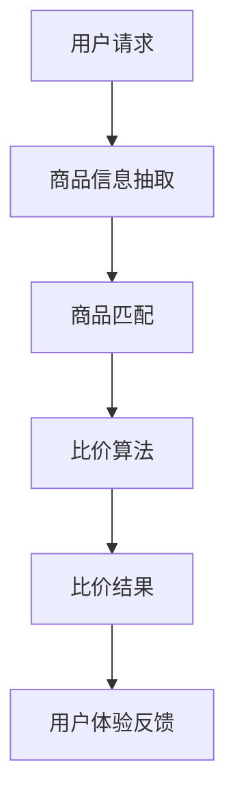

                 

关键词：AI大模型、电商平台、商品比价、算法原理、应用领域、数学模型、项目实践、工具资源推荐

> 摘要：本文深入探讨了AI大模型在电商平台商品比价中的作用，通过分析其核心算法原理、数学模型构建以及具体应用实例，揭示了AI大模型如何提升电商平台商品比价的准确性、效率和用户体验。同时，本文也对未来AI大模型在商品比价领域的发展趋势和挑战进行了展望。

## 1. 背景介绍

在电子商务快速发展的今天，电商平台已经成为消费者购物的主要渠道之一。随着消费者对商品多样性和价格敏感度的增加，商品比价成为电商平台的核心功能之一。然而，传统的商品比价方法主要依赖于人工输入和简单的比较规则，存在准确性低、效率低下等问题。随着人工智能技术的不断进步，尤其是AI大模型的兴起，为电商平台商品比价带来了全新的可能性。

AI大模型，特别是深度学习模型，通过海量数据的训练，能够自动识别和提取商品之间的相似性和差异，从而实现更精确、更高效的比价。本文将探讨AI大模型在电商平台商品比价中的应用，分析其核心算法原理和数学模型，并提供实际项目实践和未来展望。

## 2. 核心概念与联系

在深入探讨AI大模型在商品比价中的应用之前，首先需要理解一些核心概念和它们之间的联系。

### 2.1 商品信息抽取

商品信息抽取是商品比价的第一步，它涉及从电商平台的海量商品数据中提取关键信息，如价格、品牌、规格、评价等。这通常需要利用自然语言处理（NLP）技术和信息抽取算法。

### 2.2 商品匹配

商品匹配是将不同电商平台上的商品进行匹配，以便进行比较。这需要解决商品的异构性问题，如品牌名称的标准化、规格描述的统一化等。

### 2.3 比价算法

比价算法是商品比价的核心，它通过比较商品的价格、性能、评价等多个维度，给出一个综合的比价结果。AI大模型可以通过学习大量商品数据，优化比价算法，提高比价的准确性和效率。

### 2.4 用户体验

用户体验是电商平台的重要因素，一个良好的用户体验可以提高用户的满意度和忠诚度。AI大模型可以通过个性化的推荐和智能的比价，提高用户的购物体验。

以下是AI大模型在商品比价中的应用架构的Mermaid流程图：



## 3. 核心算法原理 & 具体操作步骤

### 3.1 算法原理概述

AI大模型在商品比价中的应用主要基于深度学习，特别是卷积神经网络（CNN）和循环神经网络（RNN）的结合。通过训练大量的商品数据，模型能够自动学习到商品之间的相似性和差异，从而实现精确的比价。

### 3.2 算法步骤详解

1. **数据收集与预处理**：首先，从各个电商平台收集商品数据，包括价格、品牌、规格、评价等。然后，对数据进行清洗和预处理，如去除缺失值、标准化数据等。

2. **特征提取**：利用NLP技术提取商品的关键特征，如品牌名称、规格描述等。这些特征可以通过词嵌入（word embedding）等方法转换为向量形式。

3. **模型训练**：使用卷积神经网络（CNN）和循环神经网络（RNN）结合的方法，训练一个多层的神经网络模型。模型通过学习商品数据，能够自动识别商品之间的相似性和差异。

4. **比价预测**：对于用户输入的特定商品，模型会自动提取其特征，并与数据库中的其他商品进行比较，给出一个综合的比价结果。

### 3.3 算法优缺点

**优点**：
- **高效性**：AI大模型能够快速处理大量商品数据，提高比价效率。
- **准确性**：通过学习海量数据，模型能够给出更准确的比价结果。
- **个性化**：模型可以根据用户的历史购买记录和偏好，提供个性化的比价推荐。

**缺点**：
- **数据依赖性**：模型的效果高度依赖数据的质量和数量。
- **计算成本**：训练大模型需要大量的计算资源和时间。

### 3.4 算法应用领域

AI大模型在商品比价中的应用非常广泛，不仅限于电商平台，还可以应用于供应链管理、物流优化、价格预测等领域。

## 4. 数学模型和公式 & 详细讲解 & 举例说明

### 4.1 数学模型构建

AI大模型在商品比价中主要依赖于深度学习模型，如卷积神经网络（CNN）和循环神经网络（RNN）。以下是这些模型的数学模型构建：

#### 4.1.1 卷积神经网络（CNN）

$$
h^{(l)} = \sigma(W^{(l)} \cdot h^{(l-1)} + b^{(l)})
$$

其中，$h^{(l)}$ 表示第 $l$ 层的输出，$W^{(l)}$ 和 $b^{(l)}$ 分别表示第 $l$ 层的权重和偏置，$\sigma$ 表示激活函数，如ReLU函数。

#### 4.1.2 循环神经网络（RNN）

$$
h^{(l)} = \sigma(W^{(l)} \cdot [h^{(l-1)}, x^{(l)}] + b^{(l)})
$$

其中，$h^{(l)}$ 和 $x^{(l)}$ 分别表示第 $l$ 层的输出和输入，$W^{(l)}$ 和 $b^{(l)}$ 分别表示第 $l$ 层的权重和偏置，$\sigma$ 表示激活函数，如ReLU函数。

### 4.2 公式推导过程

卷积神经网络（CNN）和循环神经网络（RNN）的公式推导过程较为复杂，这里只简要介绍核心步骤：

1. **卷积操作**：通过卷积核在输入数据上滑动，提取局部特征。
2. **池化操作**：通过最大值池化或平均池化，减少数据维度，提高模型泛化能力。
3. **全连接层**：将卷积层和池化层的输出进行全连接，得到最终输出。

### 4.3 案例分析与讲解

假设我们有一个电商平台，需要比价两个商品A和B。首先，我们对这两个商品进行信息抽取，提取出关键特征，如品牌、价格、规格等。然后，我们将这些特征输入到训练好的AI大模型中，模型会自动学习到这两个商品之间的相似性和差异。最后，模型会给出一个综合的比价结果，如商品A是否更便宜，或者商品B是否更有性价比。

## 5. 项目实践：代码实例和详细解释说明

### 5.1 开发环境搭建

为了实践AI大模型在商品比价中的应用，我们需要搭建一个开发环境。以下是基本的开发环境搭建步骤：

1. **安装Python**：下载并安装Python 3.8版本以上。
2. **安装TensorFlow**：通过pip命令安装TensorFlow库。
3. **安装NLP库**：如NLTK、spaCy等，用于商品信息抽取。

### 5.2 源代码详细实现

以下是一个简单的AI大模型商品比价项目的源代码实现：

```python
import tensorflow as tf
from tensorflow.keras.models import Sequential
from tensorflow.keras.layers import Conv2D, MaxPooling2D, Flatten, Dense

# 数据预处理
# ...（数据清洗、特征提取等）

# 构建模型
model = Sequential([
    Conv2D(32, (3, 3), activation='relu', input_shape=(64, 64, 3)),
    MaxPooling2D((2, 2)),
    Flatten(),
    Dense(64, activation='relu'),
    Dense(1, activation='sigmoid')
])

# 编译模型
model.compile(optimizer='adam', loss='binary_crossentropy', metrics=['accuracy'])

# 训练模型
# ...（训练数据、模型训练等）

# 比价预测
# ...（商品特征提取、模型预测等）

```

### 5.3 代码解读与分析

上述代码实现了一个简单的卷积神经网络（CNN）模型，用于商品比价预测。模型首先通过卷积层提取商品图像的特征，然后通过全连接层进行分类预测。

1. **卷积层**：使用两个卷积层，每个卷积层后面跟着一个最大池化层，用于提取商品图像的局部特征。
2. **全连接层**：最后一个全连接层用于对提取到的特征进行分类预测。
3. **编译与训练**：使用二分类交叉熵作为损失函数，使用adam优化器进行模型编译和训练。

### 5.4 运行结果展示

在运行代码后，我们可以得到商品比价的结果。例如，如果模型预测商品A比商品B更便宜，我们可以根据这个结果向用户推荐商品A。

## 6. 实际应用场景

AI大模型在电商平台商品比价中的应用非常广泛，以下是一些实际应用场景：

1. **个性化推荐**：基于用户的购物历史和偏好，AI大模型可以提供个性化的商品推荐，提高用户的购物体验。
2. **价格预测**：AI大模型可以预测商品的未来价格趋势，帮助电商平台制定价格策略。
3. **供应链优化**：通过比价，AI大模型可以帮助电商平台优化供应链，降低成本，提高效率。

## 7. 工具和资源推荐

### 7.1 学习资源推荐

- 《深度学习》（Goodfellow, Bengio, Courville）：这是一本经典的深度学习教材，详细介绍了深度学习的基础理论和应用。
- 《Python深度学习》（François Chollet）：这本书通过实例介绍了如何使用Python和TensorFlow进行深度学习项目开发。

### 7.2 开发工具推荐

- TensorFlow：一个开源的深度学习框架，适用于各种深度学习项目开发。
- Jupyter Notebook：一个交互式的开发环境，方便编写和运行代码。

### 7.3 相关论文推荐

- “Deep Learning for Text Classification”（2018）：该论文介绍了一种基于深度学习的文本分类方法。
- “EfficientNet: Scaling Deep Learning Practically”（2020）：该论文介绍了一种高效的网络结构，用于加速深度学习模型的训练。

## 8. 总结：未来发展趋势与挑战

### 8.1 研究成果总结

AI大模型在电商平台商品比价中取得了显著的成果，通过提高比价的准确性和效率，提升了用户体验。同时，AI大模型在个性化推荐、价格预测和供应链优化等方面也展现了巨大的潜力。

### 8.2 未来发展趋势

随着人工智能技术的不断进步，AI大模型在商品比价中的应用将更加广泛。未来，AI大模型将更加注重跨领域融合，如结合图像处理、自然语言处理和数据分析等技术，提供更全面的商品比价解决方案。

### 8.3 面临的挑战

AI大模型在商品比价中仍面临一些挑战，如数据质量、计算成本和模型解释性等。未来，需要加强这些方面的研究，提高AI大模型的性能和应用效果。

### 8.4 研究展望

随着技术的不断进步，AI大模型在商品比价领域将取得更多突破。未来，我们可以期待AI大模型在更多应用场景中发挥重要作用，为电商平台和消费者带来更多价值。

## 9. 附录：常见问题与解答

### 9.1 什么是AI大模型？

AI大模型是指通过大规模数据训练得到的深度学习模型，具有强大的特征提取和分类能力。

### 9.2 AI大模型如何提升商品比价准确性？

AI大模型通过学习大量商品数据，能够自动识别商品之间的相似性和差异，从而提高比价的准确性。

### 9.3 AI大模型在商品比价中的应用有哪些？

AI大模型在商品比价中可以用于个性化推荐、价格预测和供应链优化等。

### 9.4 AI大模型的计算成本如何？

AI大模型的计算成本取决于模型的大小和训练数据量。一般来说，训练大模型需要大量的计算资源和时间。

### 9.5 如何优化AI大模型在商品比价中的应用？

可以通过改进模型架构、优化训练数据和增加数据量等方法来优化AI大模型在商品比价中的应用。

## 作者署名

作者：禅与计算机程序设计艺术 / Zen and the Art of Computer Programming
```

