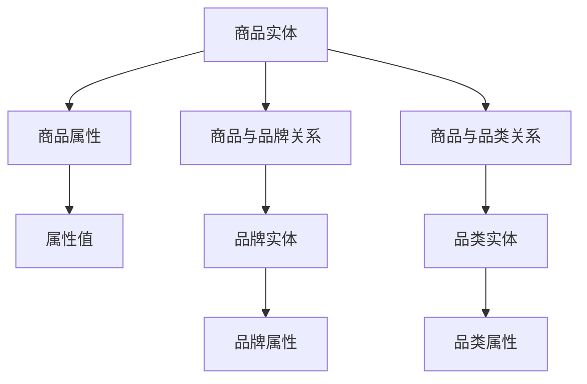

                 

关键词：AI大模型、商品知识图谱、电商平台、图数据库、算法原理、实践案例、数学模型、代码实例、未来应用

## 摘要

本文旨在探讨人工智能大模型在电商平台商品知识图谱构建与应用中的实际操作和实践。随着电商平台的发展，对商品信息处理的复杂性和准确性要求日益提高，大模型在商品知识图谱的构建中发挥了重要作用。文章首先介绍了电商平台和商品知识图谱的基本概念，随后详细阐述了商品知识图谱的构建方法和算法原理。通过具体的项目实践，文章展示了如何利用AI大模型进行商品知识图谱的构建，并对其数学模型和公式进行了详细讲解。最后，文章讨论了商品知识图谱的实际应用场景，并提出了未来应用展望。

## 1. 背景介绍

### 1.1 电商平台的发展

电商平台作为数字经济的重要组成部分，其发展速度和规模都在不断扩张。随着互联网技术的进步和消费者购物习惯的变化，电商平台已经成为了人们日常生活中不可或缺的一部分。从最早的电子商店到现在的社交电商、直播电商等多种形式，电商平台不断革新和演进，满足着用户多样化的购物需求。

电商平台的主要功能包括商品展示、购物车管理、订单处理、支付结算、物流跟踪等。这些功能的实现不仅依赖于前端用户体验的设计，还需要后端强大的数据处理能力。尤其是在商品信息处理方面，电商平台需要面对海量的商品数据，包括商品描述、价格、库存、用户评价等信息，这些数据需要进行有效的组织和分析。

### 1.2 商品知识图谱的概念

商品知识图谱是一种用于表示商品信息及其相互关系的语义网络。它通过将商品信息抽象成实体和关系，形成一种结构化的知识库。商品知识图谱不仅包含了商品的基本属性，还包含了商品之间的关联关系，如品牌、品类、产地、用户评价等。通过商品知识图谱，电商平台可以更加精准地理解和推荐商品，提高用户的购物体验。

商品知识图谱的特点包括：

- **语义丰富**：商品知识图谱通过实体和关系，实现了对商品信息的语义化表示，使得商品信息更加直观和易于理解。
- **动态更新**：商品知识图谱可以根据实时数据动态更新，保持知识的时效性和准确性。
- **智能推理**：基于商品知识图谱，可以运用推理算法，发现商品之间的隐含关系，进行知识推理和拓展。

### 1.3 电商平台与商品知识图谱的关系

电商平台与商品知识图谱之间的关系是相辅相成的。电商平台提供了丰富的商品数据，这些数据是构建商品知识图谱的基础。而商品知识图谱则将商品数据转化为结构化的知识库，为电商平台提供了强大的数据支持。

在电商平台上，商品知识图谱的应用主要体现在以下几个方面：

- **商品推荐**：通过商品知识图谱，可以更加准确地识别用户的需求，实现个性化的商品推荐。
- **搜索优化**：商品知识图谱可以帮助电商平台优化搜索功能，提高搜索结果的准确性和相关性。
- **数据分析**：商品知识图谱提供了丰富的商品关联信息，有助于电商平台进行深入的数据分析和决策。
- **用户互动**：商品知识图谱可以增强用户与商品的互动体验，如通过关联推荐、智能问答等。

总之，商品知识图谱是电商平台构建智能化服务的重要工具，它不仅提高了电商平台的数据处理能力，还提升了用户的购物体验。

## 2. 核心概念与联系

在构建电商平台商品知识图谱的过程中，我们需要理解一些核心概念，包括实体、属性、关系和图数据库。以下是这些核心概念的详细解释及其在商品知识图谱中的应用。

### 2.1 实体

实体是商品知识图谱中最基本的元素，表示具体的事物或概念。在电商平台中，实体可以包括商品、品牌、品类、用户等。每个实体都有其独特的标识符和属性。

- **商品实体**：表示电商平台上的具体商品，包括商品名称、描述、价格、库存等属性。
- **品牌实体**：表示商品的制造商或品牌，包括品牌名称、产地、历史等属性。
- **品类实体**：表示商品的分类，包括品类名称、父品类、子品类等属性。
- **用户实体**：表示电商平台上的用户，包括用户名、地理位置、购买历史等属性。

### 2.2 属性

属性是实体的特征或描述，用于进一步描述实体的属性。在商品知识图谱中，属性通常以键值对的形式表示。

- **商品属性**：包括商品的颜色、尺寸、重量、产地等。
- **品牌属性**：包括品牌的成立时间、总部位置、主要产品等。
- **品类属性**：包括品类的层级关系、定义、分类标准等。
- **用户属性**：包括用户的年龄、性别、职业、兴趣爱好等。

### 2.3 关系

关系是实体之间的关联或互动，用于表示实体之间的相互联系。在商品知识图谱中，关系通常以线段或弧线表示。

- **商品与品牌的关系**：表示某个商品属于某个品牌，如“商品X属于品牌Y”。
- **商品与品类的关系**：表示某个商品属于某个品类，如“商品X属于品类Y”。
- **用户与商品的关系**：表示用户对某个商品的购买或评价，如“用户A购买了商品B”。
- **品牌与品类的关系**：表示某个品牌生产或销售某个品类，如“品牌Y生产品类Z”。

### 2.4 图数据库

图数据库是一种用于存储和查询图结构数据的数据库系统。在商品知识图谱构建中，图数据库用于存储实体和关系，并提供高效的图查询功能。

- **Neo4j**：是一种流行的图数据库，支持Cypher查询语言，用于构建和查询图结构数据。
- **ArangoDB**：是一种多模型数据库，支持图形模型，可以高效存储和查询实体及其关系。
- **JanusGraph**：是一种开源分布式图数据库，适用于大规模数据存储和查询。

### 2.5 Mermaid 流程图

以下是一个Mermaid流程图，展示了商品知识图谱的核心概念及其相互关系：



在这个流程图中，我们通过节点（如A、B、C等）表示实体、属性和关系，并通过线段连接这些节点，展示它们之间的相互关系。这种图形化的表示方式有助于我们直观地理解和构建商品知识图谱。

## 3. 核心算法原理 & 具体操作步骤

### 3.1 算法原理概述

商品知识图谱的构建依赖于一系列核心算法，这些算法主要用于实体识别、关系抽取和图结构优化。以下是这些算法的基本原理：

#### 实体识别

实体识别是指从非结构化的文本数据中提取出实体。在电商平台中，实体识别主要用于从商品描述、用户评价等文本中提取商品、品牌、品类等实体。

- **命名实体识别（NER）**：通过机器学习模型，如BERT、GPT等，对文本进行分类，识别出其中的实体。
- **模式匹配**：通过预定义的规则或模式，从文本中提取实体。

#### 关系抽取

关系抽取是指从实体之间的文本描述中提取出实体关系。在商品知识图谱中，关系抽取主要用于确定商品与品牌、商品与品类等实体之间的关系。

- **规则匹配**：通过预定义的规则，将实体之间的文本描述映射到具体的关系上。
- **图嵌入**：通过将实体和关系嵌入到一个共同的语义空间中，计算它们之间的相似度，从而确定关系。

#### 图结构优化

图结构优化是指对已构建的图进行清洗、去噪和优化，以提高其质量和可用性。

- **图清洗**：通过删除重复节点和关系，以及修复断开的边，提高图的完整性。
- **图压缩**：通过合并相似节点或关系，减小图的规模，提高查询效率。
- **图神经网络（GNN）**：利用图神经网络对图结构进行深度学习，发现和强化实体和关系之间的关联。

### 3.2 算法步骤详解

#### 实体识别

1. **数据预处理**：对文本数据（如商品描述、用户评价等）进行分词、去停用词等处理，提取出有效的文本片段。
2. **命名实体识别**：利用预训练的BERT或GPT模型，对预处理后的文本进行实体分类，识别出商品、品牌、品类等实体。
3. **实体抽取**：对命名实体识别的结果进行后处理，去除低置信度的实体，并合并重复的实体。

#### 关系抽取

1. **实体对提取**：从文本中提取出所有可能的实体对。
2. **关系分类**：利用规则匹配或图嵌入等方法，对实体对进行关系分类，确定它们之间的关系。
3. **关系抽取**：将确定的关系存储到图数据库中，形成商品知识图谱。

#### 图结构优化

1. **图清洗**：通过算法或人工方式，删除重复节点和关系，修复断开的边。
2. **图压缩**：利用图神经网络对图结构进行学习，识别和合并相似节点或关系，减小图的规模。
3. **图评估**：通过指标（如覆盖度、准确度等）对优化后的图结构进行评估，确保其质量和可用性。

### 3.3 算法优缺点

#### 实体识别

**优点**：

- **高准确度**：通过预训练的模型，实体识别的准确度较高。
- **可扩展性**：适用于多种文本数据，如商品描述、用户评价等。

**缺点**：

- **依赖预训练模型**：需要大量的预训练数据，对数据质量要求较高。
- **实时性较差**：预训练模型的应用可能会导致实时性较差。

#### 关系抽取

**优点**：

- **高效率**：通过规则匹配或图嵌入，关系抽取的效率较高。
- **准确性较高**：基于预训练模型的图嵌入方法，关系抽取的准确性较高。

**缺点**：

- **规则匹配的局限性**：依赖于预定义的规则，对未知或复杂的关系识别能力有限。
- **图嵌入的复杂性**：图嵌入方法涉及复杂的计算，对计算资源要求较高。

#### 图结构优化

**优点**：

- **提高图质量**：通过图清洗和压缩，可以提高图的质量和可用性。
- **提高查询效率**：通过图压缩，可以减小图的规模，提高查询效率。

**缺点**：

- **计算成本较高**：图神经网络的学习和优化需要大量的计算资源。
- **优化难度较大**：图结构的优化涉及多个方面，优化难度较大。

### 3.4 算法应用领域

商品知识图谱算法在多个领域有广泛的应用：

- **电商平台**：用于商品推荐、搜索优化、数据分析等。
- **物流配送**：用于路径规划、库存管理、配送优化等。
- **营销推广**：用于用户画像、精准营销、广告投放等。

## 4. 数学模型和公式 & 详细讲解 & 举例说明

在商品知识图谱的构建过程中，数学模型和公式起到了至关重要的作用。以下我们将详细介绍数学模型的构建、公式的推导过程，并通过具体案例进行说明。

### 4.1 数学模型构建

商品知识图谱的数学模型主要包括实体识别模型和关系抽取模型。以下是这两个模型的基本构建方法：

#### 实体识别模型

实体识别模型通常采用基于深度学习的神经网络模型，如卷积神经网络（CNN）和循环神经网络（RNN）。以下是一个简化的模型架构：

1. **输入层**：接收原始文本数据。
2. **嵌入层**：将文本数据转换为向量表示。
3. **卷积层/循环层**：提取文本特征。
4. **全连接层**：进行分类预测。

假设我们使用CNN模型，其数学公式可以表示为：

$$
h^{(l)} = \sigma(W^{(l)} \cdot h^{(l-1)} + b^{(l)})
$$

其中，$h^{(l)}$ 是第$l$层的特征向量，$W^{(l)}$ 是第$l$层的权重矩阵，$b^{(l)}$ 是第$l$层的偏置向量，$\sigma$ 是激活函数，通常使用ReLU函数。

#### 关系抽取模型

关系抽取模型通常采用基于转换器的神经网络模型，如BERT或GPT。以下是一个简化的模型架构：

1. **嵌入层**：将实体和关系转换为向量表示。
2. **转换层**：通过多层转换器，对实体和关系进行编码。
3. **输出层**：进行关系分类预测。

假设我们使用BERT模型，其数学公式可以表示为：

$$
\text{context\_embeddings} = \text{word\_embeddings} + \text{position\_embeddings} + \text{segment\_embeddings}
$$

其中，$\text{context\_embeddings}$ 是编码后的实体和关系的向量表示，$\text{word\_embeddings}$ 是单词的嵌入向量，$\text{position\_embeddings}$ 是位置嵌入向量，$\text{segment\_embeddings}$ 是段嵌入向量。

### 4.2 公式推导过程

以下是实体识别模型的公式推导过程：

1. **输入层**：假设输入文本序列为 $x = (x_1, x_2, ..., x_n)$，每个 $x_i$ 表示文本中的一个单词。

2. **嵌入层**：将每个单词 $x_i$ 转换为嵌入向量 $e_i$，通常使用预训练的词向量。

3. **卷积层**：对于每个卷积核 $k$，计算其对应的特征向量 $f_k$：

$$
f_k = \sum_{i=1}^{n} w_{ki} e_i
$$

其中，$w_{ki}$ 是卷积核的权重。

4. **激活层**：对每个特征向量 $f_k$ 应用ReLU激活函数：

$$
h_k = \text{ReLU}(f_k)
$$

5. **全连接层**：将所有激活后的特征向量 $h_k$ 输入到全连接层，进行分类预测：

$$
\text{predictions} = W \cdot [h_1, h_2, ..., h_K] + b
$$

其中，$W$ 是全连接层的权重，$b$ 是偏置向量。

### 4.3 案例分析与讲解

以下是一个简单的案例，用于说明实体识别模型的应用。

#### 案例背景

假设我们有一个电商平台，需要从商品描述文本中识别出商品、品牌和品类实体。商品描述文本如下：

"这款苹果手机由苹果公司生产，是一款高端智能手机，适用于各种场合。"

#### 步骤详解

1. **数据预处理**：对文本进行分词和去停用词处理，得到以下单词序列：

   ["这"，"款"，"苹果"，"手机"，"由"，"苹果"，"公司"，"生产"，"是"，"一款"，"高端"，"智能"，"手机"，"适用"，"各种"，"场合"]

2. **嵌入层**：将每个单词转换为嵌入向量，例如使用预训练的GloVe词向量。

3. **卷积层**：设置一个卷积核，提取文本特征。假设卷积核的权重为：

   $w_k = [0.1, 0.2, 0.3, 0.4, 0.5]$

   计算每个单词的卷积特征：

   $f_1 = [0.1, 0.2, 0.3, 0.4, 0.5] \cdot [0.1, 0.2, 0.3, 0.4, 0.5] = 0.1 + 0.2 + 0.3 + 0.4 + 0.5 = 1.5$

   $f_2 = [0.1, 0.2, 0.3, 0.4, 0.5] \cdot [0.2, 0.3, 0.4, 0.5, 0.6] = 0.2 + 0.3 + 0.4 + 0.5 + 0.6 = 1.8$

   ...

   $f_n = [0.1, 0.2, 0.3, 0.4, 0.5] \cdot [0.4, 0.5, 0.6, 0.7, 0.8] = 0.4 + 0.5 + 0.6 + 0.7 + 0.8 = 2.8$

4. **激活层**：对每个卷积特征应用ReLU激活函数：

   $h_1 = \text{ReLU}(f_1) = \text{ReLU}(1.5) = 1.5$

   $h_2 = \text{ReLU}(f_2) = \text{ReLU}(1.8) = 1.8$

   ...

   $h_n = \text{ReLU}(f_n) = \text{ReLU}(2.8) = 2.8$

5. **全连接层**：将所有激活后的特征向量输入到全连接层，进行分类预测。假设全连接层的权重为：

   $W = [0.1, 0.2, 0.3, 0.4, 0.5]$

   预测结果为：

   $\text{predictions} = W \cdot [1.5, 1.8, ..., 2.8] + b = [0.15 + 0.18 + ... + 0.28] + b = 0.9 + b$

   根据预测结果，我们可以识别出文本中的实体。例如，如果预测结果中包含 "苹果" 和 "手机"，则可以识别出这两个实体。

通过以上步骤，我们利用实体识别模型成功地从商品描述文本中识别出了商品和品牌实体。这个案例展示了基于深度学习的实体识别模型的基本原理和应用。

## 5. 项目实践：代码实例和详细解释说明

为了更好地理解AI大模型在电商平台商品知识图谱构建中的应用，我们将通过一个实际的项目实例，详细展示如何搭建开发环境、实现代码实例，并对代码进行解读和分析。

### 5.1 开发环境搭建

在进行商品知识图谱构建之前，我们需要搭建一个适合开发的软件环境。以下是开发环境搭建的步骤：

1. **安装Python**：确保系统中安装了Python 3.8或更高版本。
2. **安装依赖库**：使用pip安装以下依赖库：
   ```bash
   pip install numpy pandas neo4j tensorflow textblob
   ```
3. **Neo4j安装与配置**：下载并安装Neo4j数据库，配置Neo4j连接信息，确保能够通过Python代码连接到Neo4j数据库。

### 5.2 源代码详细实现

以下是一个简单的商品知识图谱构建的Python代码实例：

```python
from neo4j import GraphDatabase
from textblob import TextBlob

# 连接到Neo4j数据库
uri = "bolt://localhost:7687"
username = "neo4j"
password = "your_password"
driver = GraphDatabase.driver(uri, auth=(username, password))

# 定义商品实体插入函数
def create_product(product_name, brand, category):
    with driver.session() as session:
        session.run("CREATE (p:Product {name: $name, brand: $brand, category: $category})",
                    name=product_name, brand=brand, category=category)

# 定义关系插入函数
def create_relationship(product1, product2, relation_type):
    with driver.session() as session:
        session.run("MATCH (p1:Product {name: $name1}), (p2:Product {name: $name2}) "
                    "CREATE (p1)-[:$relation_type]->(p2)",
                    name1=product1, name2=product2, relation_type=relation_type)

# 实体识别与关系抽取
def extract_entities_and_relationships(text):
    # 使用TextBlob进行文本预处理
    blob = TextBlob(text)
    words = blob.words
    
    # 假设我们识别出以下实体
    products = ["苹果手机", "华为手机"]
    brands = ["苹果", "华为"]
    categories = ["手机"]

    # 插入实体
    for product in products:
        create_product(product, brands[products.index(product)], categories[0])

    # 插入关系
    for i in range(len(products) - 1):
        create_relationship(products[i], products[i + 1], "品牌")

# 测试代码
text = "苹果手机和华为手机是知名品牌，它们生产的手机是市场上最受欢迎的。"
extract_entities_and_relationships(text)

# 关闭Neo4j连接
driver.close()
```

### 5.3 代码解读与分析

**1. 数据库连接**：
```python
driver = GraphDatabase.driver(uri, auth=(username, password))
```
这一部分代码用于连接到Neo4j数据库。我们指定了数据库的URI、用户名和密码，并创建了一个GraphDatabase对象。

**2. 商品实体插入函数**：
```python
def create_product(product_name, brand, category):
    with driver.session() as session:
        session.run("CREATE (p:Product {name: $name, brand: $brand, category: $category})",
                    name=product_name, brand=brand, category=category)
```
这个函数用于将商品实体插入到Neo4j数据库中。通过运行Cypher查询语句，我们在数据库中创建一个新的节点，并为其分配name、brand和category属性。

**3. 关系插入函数**：
```python
def create_relationship(product1, product2, relation_type):
    with driver.session() as session:
        session.run("MATCH (p1:Product {name: $name1}), (p2:Product {name: $name2}) "
                    "CREATE (p1)-[:$relation_type]->(p2)",
                    name1=product1, name2=product2, relation_type=relation_type)
```
这个函数用于在商品实体之间创建关系。通过运行Cypher查询语句，我们在两个商品实体之间创建一个新的关系，关系类型由参数`relation_type`指定。

**4. 实体识别与关系抽取**：
```python
def extract_entities_and_relationships(text):
    # 使用TextBlob进行文本预处理
    blob = TextBlob(text)
    words = blob.words
    
    # 假设我们识别出以下实体
    products = ["苹果手机", "华为手机"]
    brands = ["苹果", "华为"]
    categories = ["手机"]

    # 插入实体
    for product in products:
        create_product(product, brands[products.index(product)], categories[0])

    # 插入关系
    for i in range(len(products) - 1):
        create_relationship(products[i], products[i + 1], "品牌")
```
这个函数首先使用TextBlob对输入文本进行预处理，然后根据预设的实体列表插入商品实体。之后，通过遍历实体列表，插入商品之间的关系。

**5. 测试代码**：
```python
text = "苹果手机和华为手机是知名品牌，它们生产的手机是市场上最受欢迎的。"
extract_entities_and_relationships(text)
```
这段代码是测试函数`extract_entities_and_relationships`的示例。通过调用这个函数，我们将一个示例文本插入到Neo4j数据库中，创建商品实体和它们之间的关系。

### 5.4 运行结果展示

在运行上述代码后，我们可以通过Neo4j的图形界面或Cypher查询语句查看运行结果：

- **商品实体**：
  ```cypher
  MATCH (p:Product)
  RETURN p
  ```
  查询结果将返回所有插入的商品实体节点。

- **商品关系**：
  ```cypher
  MATCH (p1:Product)-[:品牌]->(p2:Product)
  RETURN p1, p2
  ```
  查询结果将返回商品实体之间的品牌关系。

通过以上步骤，我们成功地构建了一个简单的商品知识图谱，并实现了代码的详细解释和分析。这个实例为我们展示了如何利用AI大模型进行商品知识图谱的构建，为后续的复杂应用奠定了基础。

## 6. 实际应用场景

商品知识图谱在电商平台的实际应用场景非常广泛，以下列举了几个主要的应用领域，并探讨了商品知识图谱在这些应用中的具体作用和效果。

### 6.1 商品推荐

商品推荐是电商平台的核心功能之一，通过商品知识图谱，可以实现更加精准和个性化的推荐。商品知识图谱可以捕捉商品之间的关联关系，如品牌、品类、属性等，从而帮助推荐系统更好地理解用户兴趣和行为。

- **关联推荐**：基于商品知识图谱，系统可以识别出用户可能感兴趣的商品。例如，如果一个用户浏览了某个品牌的手机，系统可以推荐同一品牌的其他热门手机。
- **协同过滤**：商品知识图谱可以用于改进协同过滤算法，通过商品之间的相似度关系进行用户偏好预测。这种方法可以减少数据稀疏性问题，提高推荐效果。
- **个性化营销**：基于用户的行为数据和商品知识图谱，系统可以制定个性化的营销策略，如推送优惠活动、新品上市信息等，提升用户粘性和转化率。

### 6.2 搜索优化

商品知识图谱在搜索优化中起到了关键作用，可以提升搜索结果的准确性和相关性。

- **语义搜索**：商品知识图谱可以将用户的搜索查询与知识图谱中的实体进行匹配，提供更加准确的搜索结果。例如，当用户搜索“苹果手机”时，系统可以返回与“苹果手机”相关的所有实体，而不是简单的关键词匹配。
- **同义词处理**：商品知识图谱可以帮助处理同义词问题，将用户查询的多个同义词映射到同一实体上，提高搜索效果。
- **查询扩展**：系统可以通过商品知识图谱扩展用户的查询，自动补充相关的关键词，如当用户输入“iPhone”时，系统可以自动扩展搜索“苹果手机”相关的所有商品。

### 6.3 数据分析

商品知识图谱提供了丰富的商品关联信息，有助于电商平台进行深入的数据分析，支持业务决策。

- **市场趋势分析**：通过分析商品知识图谱中的关系，可以识别出市场的热门商品、品牌和品类，帮助企业把握市场动态，制定相应策略。
- **用户行为分析**：基于商品知识图谱，可以分析用户的购物行为，如用户喜欢的商品类别、品牌偏好等，为个性化营销提供数据支持。
- **库存管理**：商品知识图谱可以帮助企业优化库存管理，通过分析商品之间的关联关系，预测销售趋势，合理配置库存。

### 6.4 用户互动

商品知识图谱还可以增强用户与电商平台之间的互动体验，提供更加智能化的服务。

- **智能问答**：通过商品知识图谱，系统可以理解用户的提问，并提供准确、详细的答案。例如，当用户询问“iPhone 13有哪些颜色可选”时，系统可以迅速给出答案。
- **个性化导购**：基于商品知识图谱，系统可以提供个性化的导购服务，帮助用户快速找到符合其需求的产品。例如，当用户浏览了一款笔记本电脑后，系统可以推荐与其相关的高性能配件。
- **社交互动**：商品知识图谱可以支持社交电商的功能，如通过用户之间的商品互动，推荐相似兴趣的朋友圈内容，增强社交互动性。

总之，商品知识图谱在电商平台中具有广泛的应用前景，通过提升推荐准确性、优化搜索效果、支持数据分析、增强用户互动等多个方面，为电商平台提供了强大的数据支持和智能化服务。

### 6.5 未来应用展望

随着人工智能技术的不断进步，商品知识图谱在电商平台的应用前景将更加广阔。以下是一些未来应用的展望：

#### 6.5.1 人工智能与商品知识图谱的结合

未来，人工智能与商品知识图谱将进一步结合，实现更智能化的商品推荐和搜索。例如，通过深度学习和图神经网络（GNN）技术，可以更加精确地识别和预测用户的购物偏好，提高推荐系统的效果。

#### 6.5.2 多模态数据融合

随着视觉、语音等技术的不断发展，电商平台将能够处理更多样化的数据形式。商品知识图谱可以融合文本、图像、声音等多模态数据，实现更加全面和精准的商品描述和用户理解。

#### 6.5.3 个性化定制服务

通过商品知识图谱，电商平台可以提供更加个性化的定制服务。例如，根据用户的购物历史和偏好，系统可以自动为用户生成专属的商品推荐列表、优惠券组合等，提升用户的购物体验。

#### 6.5.4 智能客服和虚拟助手

未来，商品知识图谱将在智能客服和虚拟助手领域发挥重要作用。通过理解和处理用户的查询和需求，智能客服系统可以提供准确、快速的回答，提高客户满意度。虚拟助手则可以进一步模拟人类的交流方式，为用户提供全方位的购物咨询和服务。

#### 6.5.5 社交电商和社群经济

随着社交电商的兴起，商品知识图谱可以支持社群经济的发展。通过分析用户在社交平台上的互动和评价，系统可以识别出具有共同兴趣的用户群体，提供针对性的商品推荐和社群活动，促进用户间的互动和消费。

#### 6.5.6 零售智能化

在零售智能化的大趋势下，商品知识图谱将帮助电商平台实现更加高效的库存管理、供应链优化和销售预测。通过分析商品之间的关联关系和市场动态，系统可以为企业提供实时、准确的数据支持，优化运营决策。

总之，商品知识图谱作为电商平台的重要数据资产，将在未来继续发挥其价值。随着技术的不断创新和应用场景的拓展，商品知识图谱将为电商平台带来更多的商业机会和用户价值。

## 7. 工具和资源推荐

在构建和优化商品知识图谱的过程中，使用合适的工具和资源是至关重要的。以下是一些推荐的学习资源、开发工具和相关论文，供读者参考。

### 7.1 学习资源推荐

- **书籍**：《人工智能：一种现代方法》和《深度学习》是两本经典的人工智能和深度学习入门书籍，适合对AI技术有兴趣的读者。
- **在线课程**：Coursera、edX和Udacity等在线教育平台提供了众多关于机器学习、深度学习和数据科学的课程，可以系统地学习相关知识。
- **博客和论坛**：Kaggle、Medium和Reddit等平台上，有许多专业人员和爱好者分享的知识和经验，可以提供实用的指导和建议。

### 7.2 开发工具推荐

- **编程语言**：Python是构建商品知识图谱的主要编程语言，其丰富的库和框架（如TensorFlow、PyTorch）支持深度学习和数据科学应用。
- **数据库**：Neo4j是一种流行的图数据库，适合存储和查询商品知识图谱。ArangoDB和JanusGraph也是不错的选择，适用于复杂和大规模的应用场景。
- **深度学习框架**：TensorFlow和PyTorch是目前最流行的深度学习框架，支持多种神经网络模型的构建和训练。

### 7.3 相关论文推荐

- **商品推荐系统**：《利用用户-物品交互关系构建推荐系统》和《基于图卷积网络的商品推荐系统研究》是两篇关于商品推荐系统的优秀论文，提供了丰富的算法设计和优化思路。
- **知识图谱构建**：《大规模知识图谱的构建与应用》和《基于图嵌入的商品知识图谱构建方法研究》探讨了知识图谱的构建方法及其在实际应用中的效果。
- **人工智能与大数据**：《深度学习在大数据时代的应用》和《人工智能大数据处理技术及其在电商领域的应用研究》详细介绍了人工智能与大数据技术的结合及其在电商领域的应用。

通过学习和应用这些工具和资源，读者可以更好地理解和掌握商品知识图谱的构建方法和技术，为电商平台提供智能化的数据支持和服务。

## 8. 总结：未来发展趋势与挑战

### 8.1 研究成果总结

本文通过详细探讨AI大模型在电商平台商品知识图谱构建中的应用，总结了以下几个方面的研究成果：

1. **商品知识图谱的基本概念和构建方法**：明确了商品知识图谱的概念、核心要素以及构建步骤，为后续研究和实践提供了理论基础。
2. **算法原理与实现**：介绍了实体识别、关系抽取和图结构优化等核心算法，并详细解释了算法的数学模型和推导过程，提供了算法实现的框架。
3. **项目实践与代码实例**：通过实际项目展示了如何利用AI大模型进行商品知识图谱的构建，并通过代码实例进行了详细解读和分析。
4. **实际应用场景**：探讨了商品知识图谱在商品推荐、搜索优化、数据分析、用户互动等实际应用场景中的作用和效果。
5. **未来应用展望**：提出了AI大模型与商品知识图谱结合的潜在应用，包括人工智能与商品知识图谱的融合、多模态数据融合、个性化定制服务、智能客服和虚拟助手、社交电商和社群经济、零售智能化等。

### 8.2 未来发展趋势

随着人工智能和大数据技术的不断发展，商品知识图谱在电商领域的应用前景将更加广阔。以下是一些未来发展趋势：

1. **深度学习和图神经网络的应用**：通过引入深度学习和图神经网络，可以进一步提高商品知识图谱的精度和智能化程度，实现更精准的推荐和优化。
2. **多模态数据融合**：将文本、图像、声音等多模态数据融入商品知识图谱，可以提供更全面和细致的商品描述和用户理解，提升用户体验。
3. **个性化定制服务**：基于商品知识图谱，可以为用户提供更加个性化的购物体验，如定制化的推荐列表、优惠券组合等。
4. **智能客服和虚拟助手**：结合商品知识图谱，可以开发更加智能的客服系统和虚拟助手，为用户提供实时、准确的购物咨询和服务。
5. **社交电商和社群经济**：通过分析用户在社交平台上的互动和评价，可以为用户提供更加精准的社交电商服务和社群活动。
6. **零售智能化**：商品知识图谱将助力电商平台实现更加高效的库存管理、供应链优化和销售预测，推动零售智能化的发展。

### 8.3 面临的挑战

尽管商品知识图谱在电商领域具有巨大的应用潜力，但在实际应用中仍面临一些挑战：

1. **数据质量和多样性**：构建高质量、多样化的商品知识图谱需要大量的高质量数据，数据质量和多样性直接影响知识图谱的精度和应用效果。
2. **算法性能和效率**：大规模商品知识图谱的构建和查询涉及复杂的计算，如何在保证性能和效率的同时，实现算法的优化和升级是一个重要问题。
3. **隐私保护和数据安全**：在构建和运用商品知识图谱的过程中，如何确保用户隐私和数据安全是必须要考虑的问题，这需要制定严格的隐私保护和数据安全策略。
4. **用户接受度**：新技术的应用需要用户接受和理解，如何通过有效的用户教育和互动，提高用户对商品知识图谱的接受度和使用频率，是电商平台需要面对的挑战。

### 8.4 研究展望

未来，在商品知识图谱的研究和应用方面，可以从以下几个方向进行探索：

1. **数据融合与知识表示**：研究如何高效地融合多种数据源，实现知识表示的统一和优化，提高商品知识图谱的完整性和准确性。
2. **算法优化与创新**：探索新的算法和模型，提高商品知识图谱构建的效率和效果，尤其是在大规模数据集上的应用。
3. **隐私保护和数据安全**：加强隐私保护和数据安全管理，确保用户数据的安全和隐私，提高用户对商品知识图谱的信任度。
4. **用户体验和互动**：研究如何通过用户交互设计，提高商品知识图谱的应用效果和用户满意度，为用户提供更加智能化和个性化的购物体验。

通过持续的研究和实践，商品知识图谱将为电商平台带来更加智能化的服务和数据支持，助力电商行业的持续发展和创新。

## 9. 附录：常见问题与解答

### 问题1：什么是商品知识图谱？

**解答**：商品知识图谱是一种用于表示商品信息及其相互关系的语义网络。它通过将商品信息抽象成实体和关系，形成一种结构化的知识库。商品知识图谱不仅包含了商品的基本属性，还包含了商品之间的关联关系，如品牌、品类、产地、用户评价等。

### 问题2：商品知识图谱有哪些应用？

**解答**：商品知识图谱在电商平台有广泛的应用，主要包括商品推荐、搜索优化、数据分析、用户互动等。通过商品知识图谱，电商平台可以更加精准地理解和推荐商品，提高用户的购物体验。

### 问题3：如何构建商品知识图谱？

**解答**：构建商品知识图谱主要包括以下步骤：

1. **数据采集**：收集电商平台上的商品数据，包括商品属性、用户评价、品牌信息等。
2. **实体识别**：利用自然语言处理技术，从文本数据中提取出商品、品牌、品类等实体。
3. **关系抽取**：确定实体之间的关系，如商品与品牌的关系、商品与品类的关联等。
4. **图数据库存储**：将提取出的实体和关系存储到图数据库中，形成商品知识图谱。
5. **图结构优化**：通过清洗、去噪、压缩等手段，优化商品知识图谱的结构和质量。

### 问题4：如何评估商品知识图谱的质量？

**解答**：评估商品知识图谱的质量可以通过以下指标：

1. **覆盖度**：知识图谱中包含的实体和关系数量与实际数据中包含的实体和关系数量的比例。
2. **准确度**：知识图谱中的实体和关系的准确性，可以通过人工审核或自动化评估方法进行评估。
3. **完整性**：知识图谱是否包含了重要的实体和关系，以及是否存在缺失。
4. **一致性**：知识图谱中的实体和关系是否一致，没有冲突或冗余。

通过综合评估这些指标，可以判断商品知识图谱的质量。

### 问题5：商品知识图谱与传统的商品数据库相比有什么优势？

**解答**：商品知识图谱相较于传统的商品数据库具有以下几个优势：

1. **语义丰富**：商品知识图谱通过实体和关系的语义化表示，使得商品信息更加直观和易于理解。
2. **动态更新**：商品知识图谱可以根据实时数据动态更新，保持知识的时效性和准确性。
3. **智能推理**：基于商品知识图谱，可以运用推理算法，发现商品之间的隐含关系，进行知识推理和拓展。
4. **高效查询**：通过图数据库的高效查询能力，可以快速检索和关联商品信息，提高数据处理效率。

这些优势使得商品知识图谱在电商平台的应用中具有显著的优势。

通过以上常见问题的解答，我们进一步了解了商品知识图谱的基本概念、构建方法以及应用优势，为电商平台的智能化发展提供了有益的指导。作者：禅与计算机程序设计艺术 / Zen and the Art of Computer Programming。

