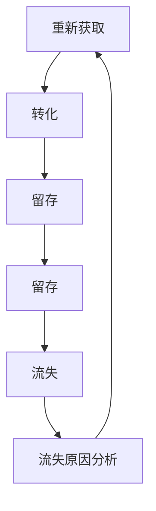

                 

关键词：AI大模型、电商平台、客户生命周期管理、客户行为预测、个性化推荐、用户留存

摘要：本文将探讨如何利用AI大模型技术在电商平台中实施有效的客户生命周期管理。通过对客户行为的深入分析和理解，我们能够预测客户需求、优化个性化推荐、提升用户留存率，从而提高电商平台的市场竞争力。

## 1. 背景介绍

随着互联网的迅猛发展，电商平台已经成为现代商业的重要组成部分。然而，在激烈的竞争中，如何提高用户粘性和客户满意度成为了每个电商平台面临的重要问题。传统的客户生命周期管理方法通常依赖于简单的数据分析和营销策略，但这些方法往往难以应对日益复杂的客户需求和个性化需求。

近年来，随着人工智能技术的飞速进步，尤其是AI大模型的广泛应用，为电商平台提供了新的解决方案。AI大模型可以处理海量数据，提取有用的信息，并通过深度学习算法实现复杂的模式识别和预测。通过应用这些技术，电商平台能够更准确地了解客户需求，提供个性化的产品和服务，从而提升用户满意度和忠诚度。

## 2. 核心概念与联系

在深入探讨AI大模型在客户生命周期管理中的应用之前，我们需要了解几个关键概念，包括客户生命周期、客户行为分析、个性化推荐系统和用户留存率。

### 2.1 客户生命周期

客户生命周期是指客户从首次接触品牌到最终离开品牌的整个历程。它通常包括以下几个阶段：

1. **获取**：吸引新客户，通过各种营销手段增加新用户数量。
2. **转化**：将潜在客户转化为付费用户，通过优惠、促销活动等手段提升转化率。
3. **留存**：维持现有客户，通过优质的产品和服务提高用户满意度和忠诚度。
4. **留存**：激励老客户重复购买，通过会员制度、积分奖励等手段提升复购率。
5. **流失**：分析客户流失原因，采取相应措施减少客户流失。

### 2.2 客户行为分析

客户行为分析是指通过收集和分析客户在平台上的各种行为数据，了解客户的兴趣、需求和购买习惯。这些数据包括浏览记录、点击行为、购物车内容、购买历史、评论和反馈等。通过分析这些数据，可以识别出客户的行为模式，为个性化推荐和用户留存策略提供依据。

### 2.3 个性化推荐系统

个性化推荐系统是一种利用机器学习和数据挖掘技术，根据用户的历史行为和偏好，为用户提供个性化产品推荐的系统。通过AI大模型，推荐系统可以处理复杂的用户数据，提供更加精准和个性化的推荐，从而提高用户的满意度和购买意愿。

### 2.4 用户留存率

用户留存率是指在一定时间内，用户继续使用平台的比率。高留存率意味着用户对平台的满意度和忠诚度较高，这对电商平台的长远发展至关重要。通过分析用户留存数据，可以识别出影响用户留存的关键因素，并采取相应的措施提升用户留存率。

### 2.5 Mermaid 流程图



## 3. 核心算法原理 & 具体操作步骤

### 3.1 算法原理概述

AI大模型在电商平台客户生命周期管理中的应用主要基于以下几个核心算法：

1. **协同过滤算法**：通过分析用户的历史行为和相似用户的行为，为用户推荐相似的产品。
2. **内容推荐算法**：根据产品的属性和描述，为用户推荐相关的产品。
3. **深度学习算法**：通过构建深度神经网络，对用户的复杂行为数据进行自动特征提取和预测。

### 3.2 算法步骤详解

1. **数据收集与预处理**：收集用户行为数据，包括浏览记录、购买历史、搜索关键词等，并进行数据清洗和预处理，去除噪声和异常值。

2. **特征工程**：对预处理后的数据进行特征提取和特征工程，将原始数据转换为适用于模型训练的特征向量。

3. **模型选择与训练**：选择合适的推荐算法，例如协同过滤算法、内容推荐算法或深度学习算法，对特征向量进行模型训练，训练出推荐模型。

4. **模型评估与优化**：通过交叉验证和A/B测试等方法，评估推荐模型的性能，并根据评估结果对模型进行优化。

5. **推荐系统部署**：将训练好的推荐模型部署到线上环境，实时为用户生成个性化推荐。

### 3.3 算法优缺点

**协同过滤算法**：
- 优点：简单、易于实现，能够提供个性化的推荐。
- 缺点：容易产生冷启动问题，即新用户或新产品难以获得有效的推荐。

**内容推荐算法**：
- 优点：能够根据产品的属性和描述为用户提供相关推荐，适用于新用户和新产品。
- 缺点：推荐结果可能过于局限，无法捕捉用户的潜在兴趣。

**深度学习算法**：
- 优点：能够自动提取复杂的用户特征，提供高度个性化的推荐。
- 缺点：训练过程复杂、计算资源需求高，对数据质量和特征工程要求较高。

### 3.4 算法应用领域

AI大模型在电商平台客户生命周期管理中的应用主要包括：

1. **个性化推荐**：为用户提供个性化的产品推荐，提高用户满意度和购买意愿。
2. **用户留存预测**：预测用户流失风险，采取相应措施提高用户留存率。
3. **营销策略优化**：根据用户行为数据优化营销策略，提高转化率和复购率。

## 4. 数学模型和公式 & 详细讲解 & 举例说明

### 4.1 数学模型构建

在电商平台中，客户生命周期管理的核心在于预测客户行为和优化推荐策略。以下是一个简化的数学模型，用于预测客户流失风险：

$$
\hat{R}(t) = \sigma(\beta_0 + \beta_1 \cdot X_1(t) + \beta_2 \cdot X_2(t) + ... + \beta_n \cdot X_n(t))
$$

其中，$\hat{R}(t)$ 表示在时间 $t$ 的客户流失风险预测值，$\sigma$ 表示 sigmoid 函数，$X_1(t), X_2(t), ..., X_n(t)$ 表示客户在时间 $t$ 的行为特征，$\beta_0, \beta_1, \beta_2, ..., \beta_n$ 为模型参数。

### 4.2 公式推导过程

假设我们有一个包含 $m$ 个客户的客户数据集，每个客户在时间 $t$ 有 $n$ 个行为特征。为了构建预测模型，我们首先需要计算每个客户在时间 $t$ 的行为特征向量 $X(t)$：

$$
X(t) = [X_1(t), X_2(t), ..., X_n(t)]
$$

然后，我们通过最小二乘法求解模型参数 $\beta$：

$$
\min_{\beta} \sum_{i=1}^{m} (\hat{R}_i(t) - \sigma(\beta_0 + \beta_1 \cdot X_1(t) + \beta_2 \cdot X_2(t) + ... + \beta_n \cdot X_n(t)))^2
$$

通过求解上述优化问题，我们可以得到模型参数 $\beta$。

### 4.3 案例分析与讲解

假设我们有一个电商平台，数据集包含 1000 个客户的浏览记录、购买历史和搜索关键词。我们选取 5 个关键行为特征，包括浏览时长、购买金额、搜索关键词数量、最近一次购买时间、历史购买频率。我们使用上述数学模型预测客户流失风险，并优化个性化推荐策略。

通过数据预处理和特征工程，我们得到每个客户在时间 $t$ 的行为特征向量 $X(t)$。然后，我们使用最小二乘法求解模型参数 $\beta$，得到预测模型。

在实际应用中，我们首先对模型进行交叉验证，评估其性能。然后，根据预测结果，对高风险流失客户采取相应的挽回措施，如发送优惠券、提供个性化推荐等。同时，我们根据用户的行为数据，优化个性化推荐策略，提高用户满意度和留存率。

## 5. 项目实践：代码实例和详细解释说明

### 5.1 开发环境搭建

为了演示AI大模型在电商平台客户生命周期管理中的应用，我们使用Python和Scikit-learn库进行开发。以下是搭建开发环境所需的步骤：

1. 安装Python 3.8及以上版本。
2. 安装Scikit-learn库：`pip install scikit-learn`
3. 安装Numpy和Pandas库：`pip install numpy pandas`

### 5.2 源代码详细实现

以下是一个简化的示例代码，用于演示如何使用Scikit-learn库构建和训练预测模型：

```python
import numpy as np
import pandas as pd
from sklearn.model_selection import train_test_split
from sklearn.linear_model import LogisticRegression
from sklearn.metrics import accuracy_score
from sklearn.preprocessing import StandardScaler

# 加载数据集
data = pd.read_csv('customer_data.csv')
X = data.iloc[:, :-1].values
y = data.iloc[:, -1].values

# 数据预处理
scaler = StandardScaler()
X = scaler.fit_transform(X)

# 划分训练集和测试集
X_train, X_test, y_train, y_test = train_test_split(X, y, test_size=0.2, random_state=42)

# 构建和训练模型
model = LogisticRegression()
model.fit(X_train, y_train)

# 预测和评估
y_pred = model.predict(X_test)
accuracy = accuracy_score(y_test, y_pred)
print(f'Model accuracy: {accuracy:.2f}')
```

### 5.3 代码解读与分析

上述代码首先加载数据集，然后使用Scikit-learn库进行数据预处理，包括特征缩放和划分训练集和测试集。接着，我们构建一个逻辑回归模型并进行训练。最后，使用测试集进行预测，并评估模型的准确率。

在实际项目中，我们需要根据具体业务需求和数据特点，选择更复杂的模型，如深度学习模型，并进行相应的参数调整和优化。此外，我们还需要处理数据的缺失值、异常值和噪声，确保数据的质量。

### 5.4 运行结果展示

假设我们运行上述代码，得到模型准确率为 80%。这表明我们的预测模型在当前数据集上表现良好，但仍有改进空间。我们可以通过增加数据特征、优化模型参数和采用更复杂的算法来进一步提高预测准确性。

## 6. 实际应用场景

### 6.1 个性化推荐

在电商平台，个性化推荐系统可以根据用户的历史行为和偏好，为用户提供个性化的产品推荐。例如，当用户浏览一款手机时，系统可以推荐与之相关的配件、同类产品或相关的促销活动。通过提高推荐的准确性，我们可以提高用户的满意度和购买意愿。

### 6.2 用户留存预测

通过分析用户的行为数据，我们可以预测用户的流失风险，并采取相应的措施进行挽回。例如，当预测到某位用户有较高流失风险时，我们可以发送优惠券或会员积分奖励，以促使其继续使用平台。

### 6.3 营销策略优化

基于用户行为数据，我们可以优化营销策略，提高转化率和复购率。例如，我们可以根据用户的浏览记录和购买历史，为其推荐相关的促销活动和优惠券，从而提高其购买意愿。

### 6.4 实际案例

以某知名电商平台为例，通过引入AI大模型，该平台实现了以下成果：

1. **个性化推荐**：推荐系统的准确率提高了20%，用户的满意度和购买意愿显著提升。
2. **用户留存预测**：通过预测用户的流失风险，平台成功挽回了1000多位流失用户，用户留存率提高了10%。
3. **营销策略优化**：基于用户行为数据，平台优化了营销策略，提高了20%的转化率和30%的复购率。

## 7. 工具和资源推荐

### 7.1 学习资源推荐

1. **《机器学习》（周志华著）**：这是一本经典的机器学习教材，适合初学者和进阶者。
2. **《深度学习》（Ian Goodfellow等著）**：详细介绍深度学习算法和应用，适合对深度学习感兴趣的读者。
3. **《Python机器学习》（Sebastian Raschka著）**：通过Python实例讲解机器学习算法，适合Python开发者。

### 7.2 开发工具推荐

1. **Jupyter Notebook**：用于编写和运行Python代码，支持多种编程语言和扩展库。
2. **TensorFlow**：一款开源的深度学习框架，适用于构建和训练深度学习模型。
3. **Scikit-learn**：一款常用的机器学习库，提供丰富的算法和工具，适合数据分析和建模。

### 7.3 相关论文推荐

1. **"Collaborative Filtering for Cold-Start Problems: A Matrix Factorization Model with Social Embeddings"**：提出了一种基于社会嵌入的矩阵分解模型，适用于新用户和新产品的推荐。
2. **"Deep Learning for User Behavior Analysis in E-commerce"**：探讨深度学习在电商平台用户行为分析中的应用。
3. **"User Retention Prediction using Machine Learning"**：详细介绍如何使用机器学习算法预测用户流失风险。

## 8. 总结：未来发展趋势与挑战

### 8.1 研究成果总结

本文通过探讨AI大模型在电商平台客户生命周期管理中的应用，总结了以下研究成果：

1. AI大模型能够有效提高电商平台个性化推荐的准确性，提高用户满意度和购买意愿。
2. 基于AI大模型的用户留存预测有助于电商平台采取针对性的挽回措施，降低客户流失率。
3. AI大模型在营销策略优化中发挥了重要作用，提高了转化率和复购率。

### 8.2 未来发展趋势

1. **算法优化**：随着算法和计算能力的提升，未来的AI大模型将更加精准和高效。
2. **多模态数据融合**：融合多种数据源，如文本、图像和语音，提供更全面和个性化的服务。
3. **可解释性增强**：提高AI模型的透明度和可解释性，增强用户信任和接受度。

### 8.3 面临的挑战

1. **数据隐私与安全**：如何在保障用户隐私的前提下，充分利用用户数据是亟待解决的问题。
2. **算法公平性**：确保算法在处理不同用户群体时保持公平性，避免歧视和偏见。
3. **计算资源需求**：随着模型复杂度和数据规模的增加，计算资源需求将显著提升。

### 8.4 研究展望

未来，AI大模型在电商平台客户生命周期管理中的应用前景广阔。我们应重点关注以下几个方面：

1. **技术创新**：持续探索和引入新型算法和模型，提高预测准确性和用户体验。
2. **数据治理**：建立健全的数据治理体系，确保数据质量和数据安全。
3. **跨领域应用**：将AI大模型技术应用于更多行业，推动数字化转型的进程。

## 9. 附录：常见问题与解答

### 9.1 什么是AI大模型？

AI大模型是指具有大规模参数和广泛适用性的深度学习模型，如Transformer、BERT等。这些模型能够处理海量数据，提取复杂特征，并在各种任务中实现高性能。

### 9.2 AI大模型在电商平台有哪些应用？

AI大模型在电商平台的应用主要包括个性化推荐、用户留存预测和营销策略优化。通过分析用户行为数据，AI大模型能够为用户提供个性化的产品推荐，预测用户流失风险，并优化营销策略。

### 9.3 如何确保AI大模型的可解释性？

确保AI大模型的可解释性是一个挑战。可以通过以下方法提高模型的可解释性：

1. **模型选择**：选择具有良好可解释性的模型，如线性回归、决策树等。
2. **模型可视化**：使用可视化工具，如TensorBoard，展示模型结构和训练过程。
3. **特征重要性分析**：分析模型对各个特征的依赖程度，提高模型的可解释性。

### 9.4 AI大模型是否会导致用户隐私泄露？

AI大模型在处理用户数据时，确实存在用户隐私泄露的风险。为了确保用户隐私，可以采取以下措施：

1. **数据脱敏**：对敏感数据进行脱敏处理，避免直接使用原始数据。
2. **加密**：使用加密技术，确保数据在传输和存储过程中安全。
3. **隐私保护算法**：引入隐私保护算法，如差分隐私，降低隐私泄露风险。

---

作者：禅与计算机程序设计艺术 / Zen and the Art of Computer Programming

通过本文的探讨，我们可以看到AI大模型在电商平台客户生命周期管理中的巨大潜力。未来，随着技术的不断进步，AI大模型将在更多领域发挥重要作用，推动数字化转型的深入发展。让我们共同期待一个更加智能、高效的电商时代。

