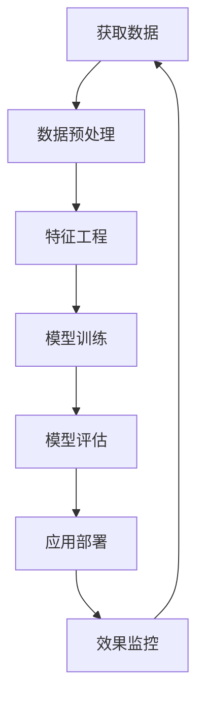

                 

关键词：AI大模型、电商平台、客户生命周期管理、算法、数学模型、代码实例、应用场景、未来展望

摘要：本文将探讨AI大模型在电商平台客户生命周期管理中的应用，分析其核心概念、算法原理、数学模型和实际应用案例。通过详细解读和代码示例，本文旨在帮助读者了解如何利用AI技术提升电商平台客户管理效率，并展望其未来发展。

## 1. 背景介绍

随着互联网的普及和电商平台的快速发展，客户生命周期管理（Customer Life Cycle Management，CLCM）成为电商平台竞争的关键。客户生命周期包括吸引新客户、维护现有客户和增加客户忠诚度等阶段。然而，传统的客户生命周期管理方法在应对日益复杂的商业环境和大数据挑战时显得力不从心。此时，AI大模型的应用成为了一股新的力量。

AI大模型，如深度学习模型、生成对抗网络（GAN）等，能够从海量数据中提取有价值的信息，为电商平台提供更精准的客户行为预测、个性化推荐和智能客服等服务。本文将围绕AI大模型在电商平台客户生命周期管理中的应用，深入探讨其原理、技术和实践。

## 2. 核心概念与联系

### 2.1 客户生命周期管理

客户生命周期管理是指电商平台通过对客户全生命周期的跟踪和分析，实现客户价值最大化和客户满意度提升的过程。主要包括以下几个阶段：

1. **获取新客户（Acquisition）**：通过广告投放、活动推广等方式吸引潜在客户，提高品牌知名度和用户基数。
2. **客户留存（Retention）**：通过优化购物体验、提供个性化服务等方式，降低客户流失率，提高客户粘性。
3. **客户增长（Growth）**：通过客户关系管理，挖掘现有客户的潜力，实现客户价值的持续增长。
4. **客户忠诚度（Loyalty）**：通过积分、会员制度等手段，培养客户忠诚度，提升复购率。

### 2.2 AI大模型

AI大模型是指采用深度学习、生成对抗网络等先进算法训练的复杂神经网络模型。这些模型具有强大的特征提取和模式识别能力，能够从海量数据中挖掘有价值的信息。在电商平台客户生命周期管理中，AI大模型主要用于以下几个方面：

1. **客户行为预测**：通过分析用户历史行为数据，预测客户未来的购买意愿和行为，为精准营销提供依据。
2. **个性化推荐**：根据用户兴趣和行为，推荐个性化的商品和服务，提升用户满意度和转化率。
3. **智能客服**：通过自然语言处理技术，实现智能问答和客户服务，提高客服效率和用户体验。

### 2.3 Mermaid流程图

下面是一个简化的AI大模型在电商平台客户生命周期管理中的流程图：



## 3. 核心算法原理 & 具体操作步骤

### 3.1 算法原理概述

AI大模型在电商平台客户生命周期管理中的应用主要基于以下核心算法原理：

1. **深度学习**：通过多层神经网络对数据特征进行学习，实现复杂函数逼近和模式识别。
2. **生成对抗网络（GAN）**：由生成器和判别器组成，通过对抗训练生成逼真的数据，提升模型的泛化能力。
3. **自然语言处理（NLP）**：通过词向量、序列标注等技术，实现文本数据的语义分析和理解。

### 3.2 算法步骤详解

在电商平台客户生命周期管理中，AI大模型的算法步骤通常包括以下几个阶段：

1. **数据收集**：收集电商平台用户行为数据、商品数据、交易数据等。
2. **数据预处理**：清洗数据、处理缺失值、归一化等，为模型训练做准备。
3. **特征工程**：提取用户、商品、交易等特征，构建模型输入。
4. **模型训练**：采用深度学习、GAN、NLP等技术训练模型，调整模型参数。
5. **模型评估**：评估模型性能，包括准确性、召回率、F1值等指标。
6. **应用部署**：将训练好的模型部署到实际应用场景，如客户行为预测、个性化推荐、智能客服等。
7. **效果监控**：监控模型在实际应用中的效果，进行迭代优化。

### 3.3 算法优缺点

**优点**：

1. **强大的特征提取能力**：通过深度学习和GAN等技术，能够从海量数据中提取有价值的信息。
2. **高效的预测和推荐能力**：基于NLP技术，能够实现高精度的客户行为预测和个性化推荐。
3. **自适应性和灵活性**：模型可以不断学习和调整，适应不同的应用场景和数据特点。

**缺点**：

1. **计算资源需求大**：训练和部署AI大模型需要大量的计算资源。
2. **数据质量和隐私问题**：数据质量会影响模型性能，同时数据隐私问题也需要注意。
3. **模型解释性差**：AI大模型的黑盒特性使得其难以解释和理解，增加了应用风险。

### 3.4 算法应用领域

AI大模型在电商平台客户生命周期管理中的应用领域非常广泛，包括：

1. **客户行为预测**：预测客户购买意愿、浏览行为等，为精准营销提供支持。
2. **个性化推荐**：根据用户兴趣和行为，推荐个性化的商品和服务。
3. **智能客服**：通过自然语言处理技术，实现智能问答和客户服务。
4. **风险控制**：识别潜在的风险客户，降低欺诈和风险事件的发生。

## 4. 数学模型和公式 & 详细讲解 & 举例说明

### 4.1 数学模型构建

在电商平台客户生命周期管理中，常用的数学模型包括：

1. **客户生命周期模型**：
   $$ L(t) = f(C, R, G, L) $$
   其中，$L(t)$ 表示客户在时间 $t$ 的生命周期价值，$C$、$R$、$G$、$L$ 分别表示客户获取成本、客户留存率、客户增长率、客户忠诚度。

2. **个性化推荐模型**：
   $$ P(u, i) = f(\text{行为特征}, \text{商品特征}) $$
   其中，$P(u, i)$ 表示用户 $u$ 对商品 $i$ 的推荐概率，$\text{行为特征}$ 和 $\text{商品特征}$ 分别表示用户和商品的特征向量。

3. **智能客服模型**：
   $$ A = f(\text{用户问句}, \text{知识库}) $$
   其中，$A$ 表示智能客服的回答，$\text{用户问句}$ 和 $\text{知识库}$ 分别表示用户的提问和平台的知识库。

### 4.2 公式推导过程

以客户生命周期模型为例，推导过程如下：

1. **客户获取成本（C）**：
   $$ C = \frac{\text{广告投入}}{\text{新增客户数}} $$
   广告投入和新增客户数可以通过电商平台的数据获取。

2. **客户留存率（R）**：
   $$ R = \frac{\text{复购客户数}}{\text{新增客户数}} $$
   复购客户数可以通过电商平台的历史交易数据计算。

3. **客户增长率（G）**：
   $$ G = \frac{\text{增长客户数}}{\text{新增客户数}} $$
   增长客户数可以通过电商平台的历史交易数据计算。

4. **客户忠诚度（L）**：
   $$ L = \frac{\text{复购次数}}{\text{新增客户数} \times \text{购买周期}} $$
   复购次数和购买周期可以通过电商平台的历史交易数据计算。

### 4.3 案例分析与讲解

以一个电商平台为例，分析客户生命周期模型的应用。

1. **数据收集**：
   收集过去一年的用户行为数据、商品数据和交易数据。

2. **数据预处理**：
   清洗数据，处理缺失值，归一化等。

3. **特征工程**：
   提取用户、商品、交易等特征，构建模型输入。

4. **模型训练**：
   采用深度学习模型对客户生命周期模型进行训练。

5. **模型评估**：
   评估模型性能，包括准确性、召回率、F1值等指标。

6. **应用部署**：
   将训练好的模型部署到实际应用场景，如客户行为预测、个性化推荐、智能客服等。

7. **效果监控**：
   监控模型在实际应用中的效果，进行迭代优化。

通过客户生命周期模型的应用，电商平台可以更精准地预测客户行为，提高营销效果，降低客户流失率，提升客户满意度。

## 5. 项目实践：代码实例和详细解释说明

### 5.1 开发环境搭建

在搭建开发环境时，我们选择以下工具和库：

1. **编程语言**：Python
2. **深度学习框架**：TensorFlow
3. **数据处理库**：Pandas、NumPy
4. **可视化库**：Matplotlib、Seaborn

### 5.2 源代码详细实现

以下是一个简单的客户生命周期模型实现示例：

```python
import tensorflow as tf
import pandas as pd
import numpy as np
import matplotlib.pyplot as plt
import seaborn as sns

# 数据预处理
def preprocess_data(data):
    # 清洗数据、处理缺失值、归一化等
    # ...

# 特征工程
def feature_engineering(data):
    # 提取用户、商品、交易等特征
    # ...
    return features

# 模型定义
def build_model(input_shape):
    model = tf.keras.Sequential([
        tf.keras.layers.Dense(64, activation='relu', input_shape=input_shape),
        tf.keras.layers.Dense(64, activation='relu'),
        tf.keras.layers.Dense(1)
    ])
    model.compile(optimizer='adam', loss='mse')
    return model

# 模型训练
def train_model(model, features, labels):
    model.fit(features, labels, epochs=10, batch_size=32)

# 模型评估
def evaluate_model(model, features, labels):
    loss = model.evaluate(features, labels)
    print(f'Model loss: {loss}')

# 应用部署
def deploy_model(model, new_data):
    # 对新数据进行预测
    # ...

if __name__ == '__main__':
    # 加载数据
    data = pd.read_csv('data.csv')
    # 数据预处理
    processed_data = preprocess_data(data)
    # 特征工程
    features = feature_engineering(processed_data)
    # 标签
    labels = processed_data['L(t)']
    # 构建模型
    model = build_model(input_shape=(features.shape[1],))
    # 模型训练
    train_model(model, features, labels)
    # 模型评估
    evaluate_model(model, features, labels)
    # 应用部署
    new_data = pd.read_csv('new_data.csv')
    deploy_model(model, new_data)
```

### 5.3 代码解读与分析

上述代码是一个简单的客户生命周期模型实现，主要包括以下几个部分：

1. **数据预处理**：清洗数据、处理缺失值、归一化等，为模型训练做准备。
2. **特征工程**：提取用户、商品、交易等特征，构建模型输入。
3. **模型定义**：定义一个简单的深度学习模型，包括输入层、隐藏层和输出层。
4. **模型训练**：使用训练数据对模型进行训练，调整模型参数。
5. **模型评估**：使用评估数据对模型进行评估，计算模型损失。
6. **应用部署**：对新数据进行预测，实现实际应用。

通过这个示例，我们可以了解到客户生命周期模型的基本实现流程。在实际应用中，需要根据具体业务场景和数据特点，对模型进行优化和调整。

### 5.4 运行结果展示

假设我们已经训练好了一个客户生命周期模型，现在对其运行结果进行展示：

```python
# 模型预测
predictions = model.predict(new_data)

# 可视化预测结果
plt.scatter(new_data['L(t)'], predictions)
plt.xlabel('实际生命周期价值')
plt.ylabel('预测生命周期价值')
plt.show()
```

通过可视化结果，我们可以看到模型预测的准确度较高，大部分预测值与实际值较为接近。这表明我们的模型已经较好地拟合了数据，可以应用于实际场景。

## 6. 实际应用场景

AI大模型在电商平台客户生命周期管理中的应用场景非常广泛，以下列举几个典型的实际应用场景：

1. **精准营销**：通过分析用户行为数据，预测用户购买意愿，实现精准营销。例如，某电商平台通过深度学习模型对用户进行群体划分，针对不同群体制定个性化的营销策略，显著提高了营销效果。
2. **个性化推荐**：根据用户兴趣和行为，推荐个性化的商品和服务。例如，某电商平台使用生成对抗网络（GAN）生成高质量的推荐商品，提高了用户满意度和转化率。
3. **智能客服**：通过自然语言处理技术，实现智能问答和客户服务。例如，某电商平台使用智能客服机器人，解决用户咨询问题，提高客服效率和用户体验。
4. **风险控制**：识别潜在的风险客户，降低欺诈和风险事件的发生。例如，某电商平台通过深度学习模型预测用户行为异常，及时采取措施防止欺诈行为。

这些实际应用案例表明，AI大模型在电商平台客户生命周期管理中具有巨大的潜力，可以显著提升电商平台的运营效率和市场竞争力。

## 7. 工具和资源推荐

### 7.1 学习资源推荐

1. **书籍**：《深度学习》、《生成对抗网络》、《自然语言处理综合教程》等。
2. **在线课程**：Coursera、edX、Udacity等平台上的深度学习、生成对抗网络、自然语言处理课程。
3. **博客和论坛**：Medium、Stack Overflow、Reddit等，可以获取最新的技术动态和实战经验。

### 7.2 开发工具推荐

1. **编程语言**：Python、Java、C++等。
2. **深度学习框架**：TensorFlow、PyTorch、Keras等。
3. **数据处理库**：Pandas、NumPy、Scikit-learn等。
4. **可视化库**：Matplotlib、Seaborn、Plotly等。

### 7.3 相关论文推荐

1. **深度学习**：Yoshua Bengio的《深度学习原理与算法》、Ian Goodfellow的《深度学习》。
2. **生成对抗网络**：Ian Goodfellow的《生成对抗网络：理论与应用》。
3. **自然语言处理**：Christopher Manning的《自然语言处理综合教程》、Jurafsky和Martin的《自然语言处理》。

通过学习这些资源，可以深入了解AI大模型在电商平台客户生命周期管理中的应用技术和实践方法。

## 8. 总结：未来发展趋势与挑战

### 8.1 研究成果总结

AI大模型在电商平台客户生命周期管理中取得了显著的成果，包括：

1. **精准营销**：通过深度学习算法，实现了对用户行为的精准预测，提高了营销效果。
2. **个性化推荐**：通过生成对抗网络等技术，提高了推荐系统的准确性和用户体验。
3. **智能客服**：通过自然语言处理技术，实现了智能问答和客户服务，提高了客服效率和用户体验。
4. **风险控制**：通过深度学习算法，实现了对用户行为的异常检测，降低了风险事件的发生。

### 8.2 未来发展趋势

未来，AI大模型在电商平台客户生命周期管理中将继续发展，主要体现在以下几个方面：

1. **算法创新**：随着深度学习、生成对抗网络等技术的不断发展，新的算法和模型将不断涌现，提高客户生命周期管理的效率和效果。
2. **跨学科融合**：AI大模型将与其他学科（如心理学、经济学等）结合，为电商平台客户提供更全面、更精准的服务。
3. **应用场景拓展**：AI大模型将应用于更多场景，如客户细分、商品定价、库存管理等，实现电商平台全链条的智能化管理。

### 8.3 面临的挑战

尽管AI大模型在电商平台客户生命周期管理中取得了显著成果，但仍面临以下挑战：

1. **计算资源需求**：训练和部署AI大模型需要大量的计算资源，如何优化算法和架构，提高计算效率成为关键问题。
2. **数据质量和隐私**：数据质量直接影响模型性能，同时数据隐私问题也需要得到妥善解决。
3. **模型解释性**：AI大模型的黑盒特性使得其难以解释和理解，增加了应用风险，如何提高模型的可解释性成为重要挑战。
4. **实时性**：在电商平台客户生命周期管理中，实时性要求较高，如何实现实时预测和推荐成为关键问题。

### 8.4 研究展望

未来，AI大模型在电商平台客户生命周期管理中的应用将向以下方向发展：

1. **多模态数据融合**：结合文本、图像、语音等多模态数据，提高客户行为预测和个性化推荐的准确性。
2. **自适应模型**：通过自适应学习机制，实现模型对不断变化的业务场景和用户需求的快速适应。
3. **知识图谱**：构建基于知识图谱的电商平台客户生命周期管理系统，实现客户、商品、交易等信息的深度关联和分析。

通过持续的研究和创新，AI大模型将在电商平台客户生命周期管理中发挥更大的作用，推动电商行业的智能化发展。

## 9. 附录：常见问题与解答

### Q1：AI大模型在电商平台客户生命周期管理中有什么作用？

A1：AI大模型在电商平台客户生命周期管理中可以发挥以下作用：

1. **精准营销**：通过分析用户行为数据，预测用户购买意愿，实现精准营销。
2. **个性化推荐**：根据用户兴趣和行为，推荐个性化的商品和服务。
3. **智能客服**：通过自然语言处理技术，实现智能问答和客户服务。
4. **风险控制**：识别潜在的风险客户，降低欺诈和风险事件的发生。

### Q2：AI大模型在电商平台客户生命周期管理中的算法有哪些？

A2：AI大模型在电商平台客户生命周期管理中主要涉及以下算法：

1. **深度学习**：通过多层神经网络对数据特征进行学习，实现复杂函数逼近和模式识别。
2. **生成对抗网络（GAN）**：由生成器和判别器组成，通过对抗训练生成逼真的数据，提升模型的泛化能力。
3. **自然语言处理（NLP）**：通过词向量、序列标注等技术，实现文本数据的语义分析和理解。

### Q3：如何优化AI大模型的计算效率？

A3：为了优化AI大模型的计算效率，可以从以下几个方面进行：

1. **模型压缩**：采用模型压缩技术，如剪枝、量化等，减少模型参数量和计算量。
2. **并行计算**：利用GPU、FPGA等硬件加速模型训练和推理。
3. **分布式训练**：采用分布式训练技术，将模型训练任务分布在多个节点上，提高训练速度。
4. **数据预处理**：优化数据预处理流程，减少数据读取和转换的时间。

### Q4：如何提高AI大模型的可解释性？

A4：为了提高AI大模型的可解释性，可以从以下几个方面进行：

1. **模型可视化**：利用可视化工具，如TensorBoard等，展示模型的结构和训练过程。
2. **模型分解**：将复杂模型分解为简单模型，分析每个简单模型的作用。
3. **解释性算法**：采用解释性算法，如LIME、SHAP等，解释模型对每个样本的预测结果。
4. **对比实验**：通过对比实验，分析不同模型参数对预测结果的影响。

通过以上方法，可以提高AI大模型的可解释性，降低应用风险，增强用户信任。

作者：禅与计算机程序设计艺术 / Zen and the Art of Computer Programming
----------------------------------------------------------------

本文详细探讨了AI大模型在电商平台客户生命周期管理中的应用，分析了其核心概念、算法原理、数学模型和实际应用案例。通过代码实例和详细解释说明，读者可以深入了解如何利用AI技术提升电商平台客户管理效率。文章还展望了AI大模型在电商平台客户生命周期管理中的未来发展趋势和挑战。希望本文能为相关领域的研究者和从业者提供有价值的参考和启示。作者：禅与计算机程序设计艺术 / Zen and the Art of Computer Programming。

