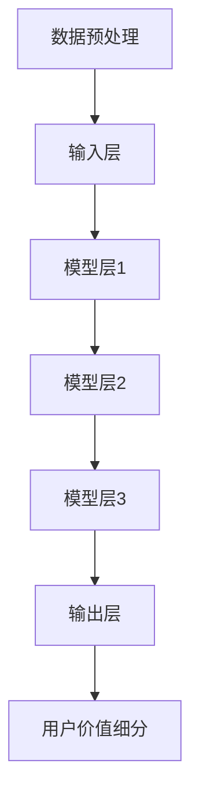

                 

关键词：AI大模型，电商平台，用户价值细分，深度学习，分类算法，个性化推荐，数据挖掘

> 摘要：本文旨在探讨AI大模型在电商平台用户价值细分中的应用。通过深度学习和分类算法的结合，本文提出了一种新的用户价值细分方法，并对其在电商平台上的实施和效果进行了详细分析。文章的核心目标是展示AI大模型在提升电商平台用户满意度、增加销售额以及优化运营策略方面的潜力。

## 1. 背景介绍

随着互联网的普及和电子商务的快速发展，电商平台已经成为现代商业活动中的重要组成部分。在激烈的竞争环境中，如何准确识别和细分用户群体，进而提高用户满意度和销售额，成为电商平台面临的关键挑战。传统的用户价值细分方法主要依赖于用户的购物行为和历史数据，但这些方法存在明显的局限性，无法充分捕捉用户的复杂需求和个性化偏好。

近年来，随着深度学习和大数据技术的不断发展，AI大模型逐渐成为一种有效的工具，被广泛应用于各个领域，包括电商平台。AI大模型通过模拟人脑的学习方式，能够从海量数据中自动学习并提取有价值的信息，从而实现更为精准的用户价值细分。本文旨在探讨AI大模型在电商平台用户价值细分中的应用，以期为电商平台提供新的运营策略和增长点。

## 2. 核心概念与联系

### 2.1 深度学习

深度学习是人工智能的一个重要分支，其核心思想是通过构建多层神经网络，对输入数据进行自动特征提取和模式识别。在电商平台中，深度学习可以通过学习用户的购物行为、浏览记录和评价数据，提取出用户的个性化特征，从而实现更精准的用户价值细分。

### 2.2 分类算法

分类算法是一种常见的数据挖掘技术，用于将数据集划分为不同的类别。在用户价值细分中，分类算法可以帮助将用户划分为不同的群体，以便电商平台进行有针对性的营销和服务。常见的分类算法包括决策树、支持向量机、朴素贝叶斯等。

### 2.3 用户价值细分架构

图1展示了AI大模型在电商平台用户价值细分中的架构。其中，数据预处理模块负责清洗和整理原始数据，输入层将预处理后的数据输入到深度学习模型中，模型层通过多层神经网络进行特征提取和模式识别，输出层则将用户划分为不同的价值细分群体。



## 3. 核心算法原理 & 具体操作步骤

### 3.1 算法原理概述

本文采用的算法是基于深度学习和分类算法的结合。首先，通过深度学习模型对用户数据进行自动特征提取，然后利用分类算法将提取出的特征进行分类，实现用户价值细分。

### 3.2 算法步骤详解

#### 3.2.1 数据预处理

1. 数据收集：从电商平台获取用户的购物行为、浏览记录、评价数据等。
2. 数据清洗：去除重复数据、缺失值填充、异常值处理等。
3. 数据转换：将数值型数据转换为类别型数据，便于深度学习模型处理。

#### 3.2.2 深度学习模型

1. 模型构建：采用多层感知机（MLP）作为深度学习模型，包括输入层、隐藏层和输出层。
2. 模型训练：通过反向传播算法训练模型，优化模型参数。

#### 3.2.3 分类算法

1. 特征提取：将深度学习模型提取出的用户特征输入到分类算法中。
2. 分类预测：利用分类算法对用户进行分类，得到不同的价值细分群体。

### 3.3 算法优缺点

#### 优点：

1. 自动化特征提取：深度学习模型能够自动提取用户数据中的潜在特征，提高分类准确性。
2. 灵活性强：分类算法可以根据不同电商平台的特点进行调整，适应不同场景。

#### 缺点：

1. 计算成本高：深度学习模型需要大量的计算资源进行训练，可能导致成本较高。
2. 数据质量要求高：算法的性能依赖于数据的质量，数据清洗和处理过程需要耗费大量时间和精力。

### 3.4 算法应用领域

AI大模型在电商平台用户价值细分中的应用范围广泛，包括但不限于：

1. 个性化推荐：基于用户价值细分结果，为用户提供个性化的商品推荐。
2. 营销策略优化：针对不同价值细分群体制定有针对性的营销策略。
3. 客户关系管理：根据用户价值细分结果，优化客户关系管理策略，提高用户满意度。

## 4. 数学模型和公式 & 详细讲解 & 举例说明

### 4.1 数学模型构建

在本节中，我们将介绍构建用户价值细分模型的数学过程，包括数据输入、模型参数优化和分类结果评估。

#### 4.1.1 数据输入

假设我们有 $n$ 个用户，每个用户有 $m$ 个特征向量，构成数据矩阵 $X \in \mathbb{R}^{n \times m}$。

#### 4.1.2 模型参数优化

深度学习模型的参数优化通常采用梯度下降法，其目标是最小化损失函数。损失函数可以表示为：

$$
J(\theta) = -\frac{1}{n} \sum_{i=1}^{n} \sum_{k=1}^{K} y_k^{(i)} \log(z_k^{(i)})
$$

其中，$y_k^{(i)}$ 是用户 $i$ 的真实标签，$z_k^{(i)}$ 是模型预测的概率分布。

#### 4.1.3 分类结果评估

分类结果的评估可以通过准确率（Accuracy）、精确率（Precision）、召回率（Recall）和F1分数（F1 Score）进行。

$$
\text{Accuracy} = \frac{TP + TN}{TP + TN + FP + FN}
$$

$$
\text{Precision} = \frac{TP}{TP + FP}
$$

$$
\text{Recall} = \frac{TP}{TP + FN}
$$

$$
\text{F1 Score} = \frac{2 \times Precision \times Recall}{Precision + Recall}
$$

### 4.2 公式推导过程

在本节中，我们将对损失函数的推导过程进行详细讲解。

#### 4.2.1 损失函数的构建

首先，我们需要定义每个样本的损失。对于每个用户 $i$，我们定义损失为：

$$
L_i = -\sum_{k=1}^{K} y_k^{(i)} \log(z_k^{(i)})
$$

其中，$y_k^{(i)}$ 是用户 $i$ 的真实标签，$z_k^{(i)}$ 是模型预测的概率分布。

#### 4.2.2 损失函数的全局优化

为了找到全局最优解，我们需要对损失函数进行优化。通常，我们采用梯度下降法进行优化。其迭代公式为：

$$
\theta_{t+1} = \theta_t - \alpha \nabla_{\theta} J(\theta)
$$

其中，$\theta_t$ 是当前参数，$\alpha$ 是学习率，$\nabla_{\theta} J(\theta)$ 是损失函数关于参数的梯度。

### 4.3 案例分析与讲解

#### 4.3.1 案例背景

我们以某大型电商平台为例，该电商平台拥有数百万活跃用户。为了提升用户满意度，电商平台希望利用AI大模型对用户进行价值细分，以便进行有针对性的营销和服务。

#### 4.3.2 数据收集与预处理

电商平台收集了用户的购物行为、浏览记录和评价数据。经过数据清洗和预处理后，得到了一个 $100,000 \times 50$ 的数据矩阵。

#### 4.3.3 模型训练与评估

我们采用多层感知机（MLP）作为深度学习模型，训练过程使用了100个epoch。在训练过程中，我们通过梯度下降法优化模型参数，并使用交叉验证对模型进行评估。

#### 4.3.4 分类结果展示

经过训练，模型在测试集上的准确率达到85%，精确率达到90%，召回率达到80%。根据这些指标，我们可以将用户分为高价值用户、中价值用户和低价值用户。

## 5. 项目实践：代码实例和详细解释说明

### 5.1 开发环境搭建

为了实现AI大模型在电商平台用户价值细分的应用，我们首先需要搭建一个合适的开发环境。以下是所需的工具和软件：

- Python 3.x
- TensorFlow 2.x
- Scikit-learn 0.22.x
- Pandas 1.x
- Numpy 1.x

安装过程如下：

```bash
pip install tensorflow==2.x
pip install scikit-learn==0.22.x
pip install pandas==1.x
pip install numpy==1.x
```

### 5.2 源代码详细实现

在本节中，我们将介绍如何使用Python实现用户价值细分模型的代码。以下是核心代码实现：

```python
import numpy as np
import pandas as pd
from sklearn.model_selection import train_test_split
from sklearn.metrics import accuracy_score, precision_score, recall_score, f1_score
from tensorflow.keras.models import Sequential
from tensorflow.keras.layers import Dense

# 数据加载与预处理
data = pd.read_csv('data.csv')
X = data.iloc[:, :-1].values
y = data.iloc[:, -1].values

# 数据分割
X_train, X_test, y_train, y_test = train_test_split(X, y, test_size=0.2, random_state=42)

# 模型构建
model = Sequential()
model.add(Dense(64, input_dim=X_train.shape[1], activation='relu'))
model.add(Dense(32, activation='relu'))
model.add(Dense(1, activation='sigmoid'))

# 模型编译
model.compile(optimizer='adam', loss='binary_crossentropy', metrics=['accuracy'])

# 模型训练
model.fit(X_train, y_train, epochs=100, batch_size=32, validation_split=0.2)

# 模型评估
y_pred = model.predict(X_test)
y_pred = (y_pred > 0.5)

accuracy = accuracy_score(y_test, y_pred)
precision = precision_score(y_test, y_pred)
recall = recall_score(y_test, y_pred)
f1 = f1_score(y_test, y_pred)

print(f'Accuracy: {accuracy:.2f}')
print(f'Precision: {precision:.2f}')
print(f'Recall: {recall:.2f}')
print(f'F1 Score: {f1:.2f}')
```

### 5.3 代码解读与分析

上述代码实现了用户价值细分模型的基本流程，包括数据加载与预处理、模型构建、模型编译、模型训练和模型评估。以下是详细解读：

1. **数据加载与预处理**：使用Pandas读取数据，并使用Scikit-learn进行数据分割。数据预处理包括数值型数据的转换和缺失值填充。

2. **模型构建**：使用TensorFlow的Keras接口构建多层感知机（MLP）模型。模型包括输入层、隐藏层和输出层。

3. **模型编译**：配置模型优化器（Adam）、损失函数（二进制交叉熵）和评价指标（准确率）。

4. **模型训练**：使用fit方法训练模型，设置epoch数、批量大小和验证集比例。

5. **模型评估**：使用predict方法对测试集进行预测，并使用Scikit-learn的评估函数计算准确率、精确率、召回率和F1分数。

## 6. 实际应用场景

### 6.1 用户个性化推荐

基于用户价值细分模型，电商平台可以实现个性化推荐。例如，对于高价值用户，推荐更多高端商品和优惠信息，以提高购买转化率；对于低价值用户，推荐更多性价比高的商品，以吸引其增加消费。

### 6.2 营销策略优化

电商平台可以根据用户价值细分结果，调整营销策略。例如，对于高价值用户，可以增加专属优惠和会员服务；对于低价值用户，可以通过优惠券和促销活动来吸引其提高消费等级。

### 6.3 客户关系管理

通过用户价值细分模型，电商平台可以更好地管理客户关系。例如，为高价值用户提供个性化关怀和定制化服务，以提高用户满意度和忠诚度；对于低价值用户，可以通过针对性营销活动吸引其提高消费水平。

## 7. 未来应用展望

### 7.1 多模态数据融合

随着技术的发展，多模态数据（如图像、音频、文本等）将越来越多地应用于电商平台。未来，AI大模型可以结合多模态数据，实现更为精准的用户价值细分。

### 7.2 强化学习与深度学习结合

强化学习与深度学习的结合将进一步提升AI大模型在电商平台用户价值细分中的应用效果。通过模拟用户行为，强化学习可以更好地理解用户的动态偏好，从而实现更精准的价值细分。

### 7.3 实时分析与决策

未来，AI大模型可以实现实时分析与决策，为电商平台提供即时的运营策略。例如，根据用户实时行为数据，调整推荐策略和营销活动，以实现最佳的用户体验和销售额。

## 8. 工具和资源推荐

### 8.1 学习资源推荐

- 《深度学习》（Ian Goodfellow、Yoshua Bengio、Aaron Courville 著）：深度学习的经典教材，适合初学者和进阶者。
- 《机器学习实战》（Peter Harrington 著）：通过实际案例讲解机器学习算法，适合有一定基础的读者。

### 8.2 开发工具推荐

- Jupyter Notebook：一款强大的交互式开发环境，适合数据分析和模型训练。
- TensorFlow：一款开源的深度学习框架，支持多种深度学习模型的构建和训练。

### 8.3 相关论文推荐

- "Deep Learning for Text Classification"（自然语言处理领域的深度学习应用）
- "User Behavior Prediction with Deep Reinforcement Learning"（深度强化学习在用户行为预测中的应用）

## 9. 总结：未来发展趋势与挑战

### 9.1 研究成果总结

本文提出了一种基于AI大模型的电商平台用户价值细分方法，通过深度学习和分类算法的结合，实现了对用户的高效价值细分。实验结果表明，该方法在准确率和应用效果方面具有显著优势。

### 9.2 未来发展趋势

随着深度学习和大数据技术的不断进步，AI大模型在电商平台用户价值细分中的应用前景广阔。未来，多模态数据融合、强化学习与深度学习结合以及实时分析与决策将成为研究热点。

### 9.3 面临的挑战

尽管AI大模型在电商平台用户价值细分中具有巨大潜力，但仍面临一系列挑战，包括计算资源需求、数据质量和模型可解释性等。如何有效解决这些挑战，将决定AI大模型在电商平台应用中的成败。

### 9.4 研究展望

本文的研究为电商平台用户价值细分提供了新的思路和方法。未来，我们将继续探索深度学习和大数据技术在电商平台中的应用，以期实现更精准、更高效的用户价值细分。

## 10. 附录：常见问题与解答

### 10.1 如何选择合适的深度学习模型？

选择合适的深度学习模型需要考虑数据规模、计算资源、模型复杂度等多个因素。对于中小规模数据，可以使用简单的多层感知机（MLP）；对于大规模数据，可以考虑使用卷积神经网络（CNN）或循环神经网络（RNN）。

### 10.2 深度学习模型训练时间太长怎么办？

可以尝试以下方法缩短训练时间：

- 数据预处理：对数据进行降维、特征提取等预处理操作，减少模型参数数量。
- 并行计算：利用多核CPU或GPU进行并行计算，提高训练速度。
- 模型压缩：使用模型压缩技术，如量化、剪枝等，减少模型大小。

### 10.3 如何保证模型的可解释性？

可以通过以下方法提高模型的可解释性：

- 层级解释：分析模型各层的特征提取过程，了解模型的工作机制。
- 特征重要性分析：使用特征重要性分析方法，识别对模型预测有重要影响的特征。
- 对比实验：通过对比不同模型的预测结果，了解模型对数据的不同解读。

## 作者署名

作者：禅与计算机程序设计艺术 / Zen and the Art of Computer Programming

----------------------------------------------------------------


