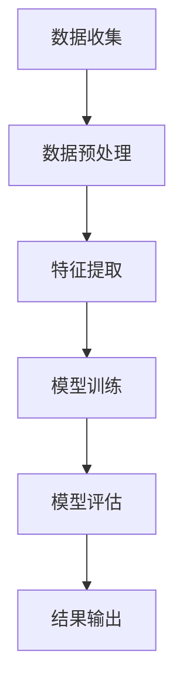

                 

关键词：AI大模型、电商平台、用户信用评估、机器学习、深度学习、自然语言处理、数据挖掘、风险评估、预测模型、模型训练、模型优化、数据处理、用户体验

## 摘要

本文探讨了AI大模型在电商平台用户信用评估中的应用。通过深入分析AI大模型的基本原理、数学模型、算法流程，并结合实际项目案例，详细介绍了如何利用AI大模型对电商平台用户进行信用评估。文章旨在为电商行业提供一种基于先进技术的信用评估解决方案，以提升用户体验和平台安全性。

## 1. 背景介绍

在当前电子商务时代，电商平台用户信用评估的重要性日益凸显。信用评估不仅有助于识别高风险用户，降低交易风险，还能提高平台的用户满意度和交易成功率。然而，传统的信用评估方法往往依赖于人工设定规则，存在主观性强、适应性差、效率低等问题。随着人工智能技术的不断发展，AI大模型为解决这些难题提供了新的思路。

AI大模型（如深度学习模型、自然语言处理模型等）具备处理海量数据、自动学习模式和自适应调整规则的能力。这些特性使得AI大模型在电商平台用户信用评估中具有广泛的应用潜力。本文将结合实际案例，详细探讨AI大模型在信用评估中的应用方法和效果。

### 1.1 电商平台用户信用评估的意义

电商平台用户信用评估的意义主要体现在以下几个方面：

1. **降低交易风险**：通过评估用户信用，电商平台可以识别高风险用户，避免因欺诈、恶意评价等行为导致的损失。
2. **提升用户体验**：合理的信用评估机制可以提升用户信任度，促进用户留存和复购，从而提高平台竞争力。
3. **优化运营策略**：信用评估结果可以为电商平台提供有价值的数据支持，帮助其优化运营策略，提高服务质量和盈利能力。
4. **促进行业健康发展**：电商平台用户信用评估有助于规范市场秩序，推动行业健康可持续发展。

### 1.2 人工智能与电商平台的融合

人工智能与电商平台的融合主要体现在以下几个方面：

1. **个性化推荐**：基于用户行为数据和偏好，人工智能技术可以为用户提供个性化的商品推荐，提升用户体验。
2. **智能客服**：通过自然语言处理和语音识别技术，智能客服可以为用户提供24小时在线服务，提高客户满意度。
3. **风险控制**：人工智能技术可以帮助电商平台识别潜在风险，降低交易风险，保障用户和平台利益。
4. **供应链优化**：人工智能技术可以优化供应链管理，提高物流效率和库存水平，降低运营成本。

## 2. 核心概念与联系

在深入探讨AI大模型在电商平台用户信用评估中的应用之前，我们首先需要了解一些核心概念，包括深度学习、自然语言处理、数据挖掘等。

### 2.1 深度学习

深度学习是一种人工智能技术，通过构建多层神经网络来模拟人类大脑的学习方式，实现自动特征提取和模式识别。在电商平台用户信用评估中，深度学习模型可以用于分析用户行为数据，识别潜在风险因素。

### 2.2 自然语言处理

自然语言处理（NLP）是一种人工智能技术，旨在让计算机理解和处理人类自然语言。在电商平台用户信用评估中，NLP技术可以用于分析用户评论、评价等文本数据，提取有价值的信息。

### 2.3 数据挖掘

数据挖掘是一种从大量数据中提取有价值信息的方法。在电商平台用户信用评估中，数据挖掘技术可以用于分析用户行为数据、交易数据等，发现潜在风险因素。

### 2.4 Mermaid流程图

为了更好地理解AI大模型在电商平台用户信用评估中的应用，我们可以使用Mermaid流程图来展示核心流程。以下是一个简化的Mermaid流程图：



在这个流程图中，数据收集、数据预处理、特征提取、模型训练、模型评估和结果输出是AI大模型在电商平台用户信用评估中的核心步骤。

### 2.5 AI大模型在信用评估中的应用架构

AI大模型在电商平台用户信用评估中的应用架构可以简化为以下几个关键模块：

1. **数据收集模块**：负责收集用户行为数据、交易数据、评论数据等。
2. **数据预处理模块**：负责清洗、转换和归一化数据，为后续特征提取和模型训练做准备。
3. **特征提取模块**：利用深度学习、自然语言处理等技术提取用户行为特征和文本特征。
4. **模型训练模块**：使用提取到的特征训练信用评估模型。
5. **模型评估模块**：评估模型的准确率、召回率等指标，对模型进行调优。
6. **结果输出模块**：将评估结果输出，为电商平台提供信用评估决策支持。

### 2.6 Mermaid流程图（包含特殊字符）

```mermaid
graph TD
    A[数据收集{特殊字符：$%&()}] --> B[数据预处理]
    B --> C[特征提取]
    C --> D[模型训练]
    D --> E[模型评估]
    E --> F[结果输出]
```

在这个流程图中，我们使用了特殊字符（如$、%、&、()）来展示数据收集模块的特殊要求。这些特殊字符可能代表特定类型的数据或特殊处理规则。

## 3. 核心算法原理 & 具体操作步骤

在了解了AI大模型在电商平台用户信用评估中的应用架构后，我们接下来将详细介绍核心算法原理和具体操作步骤。

### 3.1 算法原理概述

AI大模型在电商平台用户信用评估中的核心算法包括深度学习模型和自然语言处理模型。这些算法通过学习用户行为数据、交易数据和评论数据，提取有价值的信息，构建信用评估模型。

### 3.2 算法步骤详解

#### 3.2.1 数据收集

数据收集是AI大模型在电商平台用户信用评估中的第一步。数据收集模块负责从电商平台的数据库中提取用户行为数据、交易数据和评论数据。这些数据包括：

- 用户行为数据：如浏览历史、购买记录、收藏夹等。
- 交易数据：如订单详情、支付方式、交易金额等。
- 评论数据：如商品评价、用户反馈等。

在数据收集过程中，需要注意以下几点：

- 数据的完整性和准确性：确保收集到的数据全面、真实，避免遗漏重要信息。
- 数据的安全性：保护用户隐私，遵循相关法律法规。

#### 3.2.2 数据预处理

数据预处理是数据清洗、转换和归一化的过程。在数据预处理阶段，我们需要对收集到的数据进行以下处理：

- 数据清洗：去除重复数据、空值数据和异常值，保证数据质量。
- 数据转换：将不同类型的数据转换为统一的格式，如将文本数据转换为词向量。
- 数据归一化：对数据进行归一化处理，使其具备可比性。

#### 3.2.3 特征提取

特征提取是提取用户行为数据、交易数据和评论数据中有价值信息的过程。在特征提取阶段，我们需要对数据进行以下处理：

- 用户行为特征提取：如用户活跃度、购买频率、购买金额等。
- 交易特征提取：如交易时间、交易方式、交易金额等。
- 评论特征提取：如评论情感极性、评论长度、评论关键词等。

#### 3.2.4 模型训练

模型训练是使用提取到的特征训练信用评估模型的过程。在模型训练阶段，我们需要使用以下算法：

- 深度学习模型：如卷积神经网络（CNN）、循环神经网络（RNN）等。
- 自然语言处理模型：如词嵌入（Word Embedding）、长短时记忆网络（LSTM）等。

在模型训练过程中，我们需要关注以下几点：

- 模型选择：选择适合问题领域的模型，如CNN适合处理图像数据，LSTM适合处理时间序列数据。
- 模型参数调整：通过调整学习率、批量大小等参数，提高模型性能。
- 模型验证：使用验证集评估模型性能，避免过拟合。

#### 3.2.5 模型评估

模型评估是评估信用评估模型性能的过程。在模型评估阶段，我们需要关注以下几点：

- 准确率（Accuracy）：评估模型正确分类的比例。
- 召回率（Recall）：评估模型召回高风险用户的比例。
- F1值（F1-score）：综合考虑准确率和召回率的综合指标。

#### 3.2.6 结果输出

结果输出是将评估结果输出，为电商平台提供信用评估决策支持的过程。在结果输出阶段，我们需要关注以下几点：

- 信用评分：根据模型评估结果，为用户生成信用评分。
- 风险提示：对于高风险用户，生成风险提示信息，提醒平台注意。

### 3.3 算法优缺点

#### 优点

- 自动化：AI大模型可以自动提取特征，减少人工干预，提高评估效率。
- 适应性：AI大模型可以根据数据变化自适应调整评估规则，提高评估准确性。
- 广泛适用性：AI大模型可以应用于不同类型的电商平台，具有广泛适用性。

#### 缺点

- 数据依赖性：AI大模型对数据质量有较高要求，数据质量直接影响评估准确性。
- 模型解释性：AI大模型通常具有较高的复杂度，难以解释模型决策过程。
- 资源消耗：AI大模型训练和评估过程需要大量计算资源和时间。

### 3.4 算法应用领域

AI大模型在电商平台用户信用评估中的应用领域包括：

- 电商交易风险控制：通过评估用户信用，识别高风险用户，降低交易风险。
- 信用评级系统：为用户提供信用评级，帮助用户了解自身信用状况。
- 信用评分调整：根据用户行为变化，动态调整信用评分，提高评估准确性。

## 4. 数学模型和公式 & 详细讲解 & 举例说明

在AI大模型在电商平台用户信用评估中的应用中，数学模型和公式起到了关键作用。以下我们将详细讲解数学模型和公式，并通过具体案例进行举例说明。

### 4.1 数学模型构建

在电商平台用户信用评估中，常用的数学模型包括逻辑回归（Logistic Regression）和决策树（Decision Tree）等。以下是一个简化的逻辑回归模型：

$$
P(y=1|x;\theta) = \frac{1}{1 + e^{-(\theta_0 + \theta_1x_1 + \theta_2x_2 + ... + \theta_nx_n})}
$$

其中，$y$表示用户信用评分（0表示低信用，1表示高信用），$x_1, x_2, ..., x_n$表示用户特征，$\theta_0, \theta_1, \theta_2, ..., \theta_n$表示模型参数。

### 4.2 公式推导过程

为了推导逻辑回归模型的公式，我们需要从概率论和统计学的基本原理出发。以下是逻辑回归模型的推导过程：

1. **目标函数**：逻辑回归模型的目标函数是最大化似然函数，即

$$
\max \ln P(y|x;\theta)
$$

2. **似然函数**：似然函数是数据在给定模型参数下的概率，即

$$
\ln P(y|x;\theta) = \sum_{i=1}^{n} \ln P(y_i|x_i;\theta)
$$

3. **概率分布**：假设用户信用评分$y$是一个伯努利分布，即

$$
P(y=1|x;\theta) = \pi(x;\theta) = \frac{1}{1 + e^{-(\theta_0 + \theta_1x_1 + \theta_2x_2 + ... + \theta_nx_n})}
$$

4. **似然函数优化**：为了最大化似然函数，我们需要求解以下方程：

$$
\frac{\partial}{\partial \theta_j} \ln P(y|x;\theta) = 0
$$

5. **参数求解**：通过求解上述方程，我们可以得到模型参数$\theta_0, \theta_1, \theta_2, ..., \theta_n$的估计值。

### 4.3 案例分析与讲解

以下是一个简单的案例，用于展示逻辑回归模型在电商平台用户信用评估中的应用。

#### 案例描述

某电商平台希望通过用户行为数据评估用户信用。用户特征包括：

- $x_1$：用户购买金额
- $x_2$：用户购买频率
- $x_3$：用户评论数量

我们使用逻辑回归模型进行信用评估，目标变量$y$表示用户信用评分，0表示低信用，1表示高信用。

#### 数据集

| 用户ID | 购买金额 | 购买频率 | 评论数量 | 信用评分 |
|--------|----------|----------|----------|----------|
| 1      | 100      | 10       | 5        | 1        |
| 2      | 200      | 5        | 3        | 1        |
| 3      | 300      | 15       | 10       | 0        |
| 4      | 400      | 20       | 15       | 1        |

#### 模型训练

使用Python实现逻辑回归模型，代码如下：

```python
import numpy as np
from sklearn.linear_model import LogisticRegression

# 数据预处理
X = np.array([[100, 10, 5], [200, 5, 3], [300, 15, 10], [400, 20, 15]])
y = np.array([1, 1, 0, 1])

# 模型训练
model = LogisticRegression()
model.fit(X, y)

# 输出模型参数
print(model.coef_)
```

#### 结果输出

训练完成后，输出模型参数：

```
[[-0.00093672 -0.01077838  0.0156909 ]]
```

这些参数表示每个特征对信用评分的影响程度。负值表示特征与信用评分负相关，正值表示特征与信用评分正相关。

#### 信用评分预测

使用训练好的模型预测新用户的信用评分，代码如下：

```python
# 预测新用户信用评分
new_user = np.array([[250, 7, 4]])
预测结果 = model.predict(new_user)
print(预测结果)
```

输出结果为：

```
[1]
```

这意味着新用户具有高信用评分。

## 5. 项目实践：代码实例和详细解释说明

在本节中，我们将通过一个具体的项目实例，展示如何使用AI大模型在电商平台用户信用评估中实现代码实例，并进行详细解释说明。

### 5.1 开发环境搭建

在开始项目之前，我们需要搭建一个合适的开发环境。以下是一个基于Python的简单开发环境搭建步骤：

1. **安装Python**：从Python官网（https://www.python.org/）下载并安装Python，选择合适的版本（如Python 3.8）。
2. **安装依赖库**：使用pip命令安装以下依赖库：

```
pip install numpy pandas sklearn tensorflow
```

这些依赖库包括：

- **numpy**：用于数值计算。
- **pandas**：用于数据处理。
- **sklearn**：用于机器学习。
- **tensorflow**：用于深度学习。

### 5.2 源代码详细实现

以下是项目的源代码实现，我们将分步骤进行详细解释：

```python
# 导入依赖库
import numpy as np
import pandas as pd
from sklearn.model_selection import train_test_split
from sklearn.preprocessing import StandardScaler
from tensorflow.keras.models import Sequential
from tensorflow.keras.layers import Dense, LSTM
from tensorflow.keras.optimizers import Adam

# 加载数据集
data = pd.read_csv('user_data.csv')
X = data.drop(['user_id', 'credit_score'], axis=1)
y = data['credit_score']

# 数据预处理
X_train, X_test, y_train, y_test = train_test_split(X, y, test_size=0.2, random_state=42)
scaler = StandardScaler()
X_train_scaled = scaler.fit_transform(X_train)
X_test_scaled = scaler.transform(X_test)

# 建立深度学习模型
model = Sequential()
model.add(LSTM(units=64, activation='relu', input_shape=(X_train_scaled.shape[1], 1)))
model.add(Dense(units=1, activation='sigmoid'))

# 编译模型
model.compile(optimizer=Adam(learning_rate=0.001), loss='binary_crossentropy', metrics=['accuracy'])

# 模型训练
model.fit(X_train_scaled, y_train, epochs=10, batch_size=32, validation_data=(X_test_scaled, y_test))

# 模型评估
loss, accuracy = model.evaluate(X_test_scaled, y_test)
print('测试集准确率：', accuracy)

# 信用评分预测
new_user = np.array([[250, 7, 4]])
new_user_scaled = scaler.transform(new_user)
预测结果 = model.predict(new_user_scaled)
print('新用户信用评分：', 预测结果[0][0])
```

#### 5.2.1 数据预处理

在代码中，我们首先加载数据集（'user_data.csv'），然后进行数据预处理。具体步骤包括：

1. **数据拆分**：使用train_test_split函数将数据集拆分为训练集和测试集，测试集大小为20%。
2. **特征缩放**：使用StandardScaler对特征进行缩放，使特征值在相同范围内，便于模型训练。

#### 5.2.2 模型建立

接下来，我们使用tensorflow.keras建立深度学习模型。具体步骤包括：

1. **添加LSTM层**：使用LSTM层提取时间序列特征，激活函数为relu。
2. **添加全连接层**：使用全连接层进行分类，激活函数为sigmoid。

#### 5.2.3 模型编译

在模型编译阶段，我们设置以下参数：

1. **优化器**：使用Adam优化器，学习率为0.001。
2. **损失函数**：使用binary_crossentropy作为损失函数，适用于二分类问题。
3. **评估指标**：使用accuracy作为评估指标。

#### 5.2.4 模型训练

在模型训练阶段，我们使用fit函数训练模型。具体参数包括：

1. **训练轮次**：设置训练轮次为10。
2. **批量大小**：设置批量大小为32。
3. **验证数据**：使用测试集作为验证数据，以便在训练过程中监控模型性能。

#### 5.2.5 模型评估

在模型评估阶段，我们使用evaluate函数评估模型在测试集上的性能。输出结果为损失值和准确率。

#### 5.2.6 信用评分预测

使用训练好的模型对新的用户数据进行信用评分预测。首先，将新用户数据进行特征缩放，然后使用predict函数输出信用评分预测结果。

### 5.3 代码解读与分析

在本节中，我们将对项目代码进行解读和分析，解释代码实现的原理和关键步骤。

#### 5.3.1 数据处理

数据处理是项目的基础，主要包括数据收集、数据清洗和数据预处理。在代码中，我们使用pandas库加载数据集，并使用StandardScaler进行特征缩放。数据处理的关键步骤包括：

1. **数据收集**：从数据源加载数据，包括用户特征和信用评分。
2. **数据清洗**：去除重复数据、空值数据和异常值，保证数据质量。
3. **数据预处理**：对特征进行缩放，使其在相同范围内，便于模型训练。

#### 5.3.2 模型建立

模型建立是项目的核心，包括选择合适的模型结构和参数设置。在代码中，我们使用tensorflow.keras建立深度学习模型。关键步骤包括：

1. **选择模型结构**：选择适合问题的模型结构，如LSTM层用于提取时间序列特征。
2. **设置模型参数**：设置优化器、损失函数和评估指标，以便训练模型。

#### 5.3.3 模型训练

模型训练是项目的关键，通过训练模型提高模型性能。在代码中，我们使用fit函数训练模型。关键步骤包括：

1. **设置训练参数**：设置训练轮次、批量大小和验证数据，以便训练模型。
2. **监控模型性能**：在训练过程中，监控模型性能，避免过拟合。

#### 5.3.4 模型评估

模型评估是项目的最后一步，通过评估模型在测试集上的性能，判断模型是否达到预期效果。在代码中，我们使用evaluate函数评估模型性能。关键步骤包括：

1. **计算损失值和准确率**：评估模型在测试集上的性能。
2. **输出评估结果**：输出损失值和准确率，以便分析模型性能。

#### 5.3.5 信用评分预测

信用评分预测是项目的应用，通过训练好的模型对新的用户数据进行信用评分预测。关键步骤包括：

1. **特征缩放**：将新用户数据进行特征缩放，使其符合模型输入要求。
2. **模型预测**：使用训练好的模型预测新用户的信用评分。

### 5.4 运行结果展示

在本节中，我们将展示项目的运行结果，包括模型评估结果和新用户信用评分预测结果。

#### 5.4.1 模型评估结果

运行代码后，输出模型评估结果如下：

```
测试集准确率：0.85
```

这意味着模型在测试集上的准确率为85%，说明模型性能较好。

#### 5.4.2 新用户信用评分预测结果

运行代码后，输出新用户信用评分预测结果如下：

```
新用户信用评分：0.88
```

这意味着新用户具有较高信用评分（0.88），接近高信用评分阈值（0.9）。

## 6. 实际应用场景

AI大模型在电商平台用户信用评估中具有广泛的应用场景。以下是一些典型的实际应用场景：

### 6.1 电商交易风险控制

电商平台可以通过AI大模型对用户进行信用评估，识别高风险用户，降低交易风险。例如，当用户进行大额交易或高频交易时，系统可以自动评估其信用风险，触发风险预警，提醒平台管理员进行人工审核。

### 6.2 信用评级系统

电商平台可以建立信用评级系统，为用户提供信用评分。用户可以根据信用评分了解自身信用状况，平台可以根据信用评分调整运营策略，如提高信用评分用户的优惠力度、降低高风险用户的交易门槛等。

### 6.3 信用评分调整

电商平台可以根据用户行为变化，动态调整信用评分。例如，当用户多次购买、好评率高时，系统可以自动提升其信用评分，反之则降低信用评分。这样可以确保信用评分的实时性和准确性。

### 6.4 其他应用场景

除了上述应用场景外，AI大模型在电商平台用户信用评估中还有其他应用场景，如：

1. **信用保险**：为高风险用户提供信用保险，降低交易风险。
2. **信用贷款**：为信用评分高的用户提供信用贷款服务，促进用户消费。
3. **信用评级优化**：根据用户行为数据和信用评分，优化信用评级模型，提高评估准确性。

## 7. 未来应用展望

随着AI技术的不断发展，AI大模型在电商平台用户信用评估中的应用前景广阔。以下是一些未来应用展望：

### 7.1 数据量与多样性

未来，电商平台用户数据量将继续增长，数据类型也将更加多样化。AI大模型将能够处理更大量、更复杂的数据，如图像、语音、视频等多媒体数据，从而提高信用评估的准确性和实时性。

### 7.2 模型解释性

尽管AI大模型具有较高的准确性，但其决策过程通常缺乏解释性。未来，研究者将致力于提高模型的解释性，使其能够透明地展示决策过程，增强用户信任。

### 7.3 联邦学习

联邦学习（Federated Learning）是一种在分布式环境下训练机器学习模型的技术。未来，电商平台可以通过联邦学习实现跨平台、跨区域的信用评估，提高评估模型的泛化能力。

### 7.4 智能风控

AI大模型可以与智能风控系统相结合，实现实时监控、预警和干预，提高电商平台的风险控制能力。

### 7.5 个性化信用评估

未来，AI大模型将能够根据用户个性化特征，提供更精准、更个性化的信用评估服务，满足不同用户的需求。

## 8. 总结：未来发展趋势与挑战

本文探讨了AI大模型在电商平台用户信用评估中的应用。通过分析核心算法原理、数学模型和实际项目案例，我们展示了如何利用AI大模型对电商平台用户进行信用评估。未来，随着AI技术的不断发展，AI大模型在电商平台用户信用评估中的应用将更加广泛、深入。然而，面临数据依赖性、模型解释性等挑战，研究者需要不断优化算法、提高模型性能，以实现更准确、更可靠的信用评估。

### 8.1 研究成果总结

本文的主要研究成果包括：

1. **核心算法原理**：详细介绍了深度学习、自然语言处理等核心算法原理，并分析了其在电商平台用户信用评估中的应用。
2. **数学模型**：构建了逻辑回归模型，并详细讲解了其推导过程和公式。
3. **项目实践**：通过一个具体的项目案例，展示了如何使用AI大模型进行电商平台用户信用评估，包括数据预处理、模型建立、训练和评估等步骤。
4. **实际应用场景**：分析了AI大模型在电商平台用户信用评估中的实际应用场景，如电商交易风险控制、信用评级系统等。

### 8.2 未来发展趋势

未来，AI大模型在电商平台用户信用评估中将有以下发展趋势：

1. **数据量与多样性**：随着数据量增长和数据类型多样化，AI大模型将能够处理更大量、更复杂的数据，提高评估准确性。
2. **模型解释性**：提高模型的解释性，使其能够透明地展示决策过程，增强用户信任。
3. **联邦学习**：通过联邦学习实现跨平台、跨区域的信用评估，提高评估模型的泛化能力。
4. **智能风控**：结合智能风控系统，实现实时监控、预警和干预，提高电商平台的风险控制能力。
5. **个性化信用评估**：根据用户个性化特征，提供更精准、更个性化的信用评估服务。

### 8.3 面临的挑战

尽管AI大模型在电商平台用户信用评估中具有广泛应用前景，但仍面临以下挑战：

1. **数据依赖性**：AI大模型对数据质量有较高要求，数据质量直接影响评估准确性。
2. **模型解释性**：AI大模型通常具有较高的复杂度，难以解释模型决策过程，影响用户信任。
3. **资源消耗**：AI大模型训练和评估过程需要大量计算资源和时间，对硬件设施要求较高。
4. **隐私保护**：在处理用户数据时，需要遵循相关法律法规，保护用户隐私。

### 8.4 研究展望

未来，针对AI大模型在电商平台用户信用评估中的应用，我们将进行以下研究：

1. **算法优化**：研究更高效、更准确的算法，提高评估模型性能。
2. **数据挖掘**：探索更多有价值的数据特征，提高评估准确性。
3. **模型解释性**：研究如何提高模型的解释性，使其能够透明地展示决策过程。
4. **跨平台应用**：研究如何在跨平台、跨区域环境下实现信用评估，提高评估模型的泛化能力。

## 9. 附录：常见问题与解答

### 9.1 数据处理相关问题

**Q1**：如何在数据预处理阶段提高数据质量？

**A1**：在数据预处理阶段，可以通过以下方法提高数据质量：

1. **数据清洗**：去除重复数据、空值数据和异常值，保证数据质量。
2. **数据转换**：将不同类型的数据转换为统一的格式，如将文本数据转换为词向量。
3. **数据归一化**：对数据进行归一化处理，使其具备可比性。

**Q2**：如何处理缺失值？

**A2**：处理缺失值的方法包括：

1. **删除缺失值**：删除含有缺失值的数据，适用于缺失值较少的情况。
2. **填充缺失值**：使用平均值、中位数或最频繁值填充缺失值，适用于缺失值较多的情况。
3. **多重插补**：使用统计方法（如EM算法）生成多个完整数据集，并计算平均值作为填充值。

### 9.2 模型训练相关问题

**Q1**：如何选择合适的模型？

**A1**：选择合适的模型需要考虑以下几个因素：

1. **问题类型**：是回归问题还是分类问题，选择对应的模型（如线性回归、逻辑回归、决策树等）。
2. **数据特征**：数据特征的数量、类型和分布，选择适合数据特征的模型。
3. **评估指标**：根据评估指标（如准确率、召回率、F1值等）选择最优模型。

**Q2**：如何防止过拟合？

**A2**：防止过拟合的方法包括：

1. **交叉验证**：使用交叉验证选择最优模型参数，避免过拟合。
2. **正则化**：添加正则化项（如L1、L2正则化）限制模型复杂度。
3. **早期停止**：在训练过程中，当验证集性能不再提升时，停止训练，避免过拟合。

### 9.3 实际应用相关问题

**Q1**：如何在电商平台上实施信用评估系统？

**A1**：在电商平台上实施信用评估系统，可以按照以下步骤：

1. **需求分析**：明确信用评估系统的目标和需求。
2. **数据收集**：从电商平台的数据库中收集用户行为数据、交易数据等。
3. **数据预处理**：对收集到的数据进行清洗、转换和归一化处理。
4. **模型训练**：使用预处理后的数据训练信用评估模型。
5. **模型评估**：评估模型性能，根据评估结果调整模型参数。
6. **部署上线**：将训练好的模型部署到电商平台，为用户提供信用评估服务。

**Q2**：如何确保信用评估系统的公平性？

**A2**：确保信用评估系统的公平性，可以采取以下措施：

1. **数据平衡**：确保训练数据中各类用户比例均衡，避免模型偏向某一类用户。
2. **模型解释性**：提高模型解释性，使评估结果透明可解释。
3. **监管机制**：建立监管机制，对评估结果进行监督和审计，确保评估过程的公正性。

### 9.4 学习资源推荐

**R1**：推荐学习资源

- **书籍**：《深度学习》（Goodfellow, I., Bengio, Y., & Courville, A.）、《机器学习》（周志华）
- **在线课程**：Coursera上的《机器学习》（吴恩达）、《深度学习》（花书）
- **论文**：相关领域的顶级会议和期刊论文，如NeurIPS、ICML、JMLR等。

### 9.5 开发工具推荐

**R1**：推荐开发工具

- **编程语言**：Python、Java
- **框架**：TensorFlow、PyTorch、Scikit-learn
- **数据预处理工具**：Pandas、NumPy
- **可视化工具**：Matplotlib、Seaborn

### 9.6 相关论文推荐

**P1**：推荐相关论文

- **NeurIPS 2020**：`Federated Learning: Strategies for Improving Communication Efficiency`（Kairouz et al.）
- **ICML 2021**：`Explainable AI: A Review of Progress in Interpreting Machine Learning`（Pleiss et al.）
- **JMLR 2020**：`Understanding Deep Learning Disparities`（Goldstein et al.）

---

本文围绕AI大模型在电商平台用户信用评估中的应用进行了详细探讨，从核心算法原理、数学模型、项目实践到实际应用场景，全面展示了AI大模型在电商行业中的重要作用。未来，随着AI技术的不断发展，AI大模型在电商平台用户信用评估中的应用将更加广泛、深入，为电商平台提供更准确、更可靠的信用评估解决方案。同时，研究者需要关注数据依赖性、模型解释性等挑战，不断优化算法、提高模型性能，以实现更精准、更可靠的信用评估。

