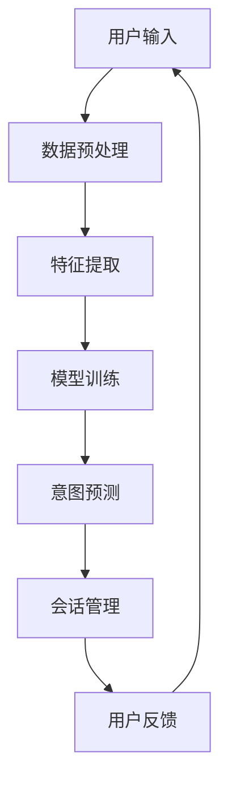

                 

关键词：AI大模型，用户意图识别，会话管理，电商平台，自然语言处理，深度学习

## 摘要

本文旨在探讨人工智能（AI）大模型在电商平台用户意图识别与会话管理中的应用。随着电商平台的不断发展，用户需求和互动模式日益复杂，传统的方法已难以满足高效、精准的服务需求。本文首先介绍了AI大模型的基本原理和技术框架，然后深入分析了其在用户意图识别和会话管理中的关键作用，并通过实际案例展示了其应用效果。最后，文章对AI大模型在电商平台未来发展的趋势和挑战进行了展望。

## 1. 背景介绍

### 电商平台的发展

随着互联网的普及和技术的进步，电商平台已经成为消费者购物的主要渠道之一。电商平台的不断发展不仅带来了巨大的商业价值，也对用户的购物体验提出了更高的要求。用户在电商平台上的活动不仅仅是简单的商品浏览和购买，还包括搜索、评价、咨询等多样化的互动行为。为了满足这些需求，电商平台需要具备强大的用户意图识别和会话管理能力。

### 传统方法的局限性

在过去的几年里，电商平台主要依赖于传统的方法来处理用户互动。这些方法包括基于规则的自然语言处理（NLP）技术、关键词匹配、机器学习模型等。然而，随着用户数据的爆炸式增长和用户行为的多样化，这些传统方法逐渐暴露出一些局限性：

- **低效性**：传统方法往往需要大量的人工干预和规则配置，导致处理速度慢，难以满足实时性要求。
- **准确性**：传统方法在面对复杂的用户意图和模糊的表达时，准确性往往不足，容易导致误解和错误。
- **可扩展性**：随着用户规模的扩大，传统方法难以进行有效扩展，成本高昂。

### AI大模型的优势

面对传统方法的局限性，人工智能大模型应运而生。大模型通过深度学习技术，能够自动学习大量的用户数据和交互模式，实现高效、准确的用户意图识别和会话管理。大模型的优势主要体现在以下几个方面：

- **高效率**：大模型能够通过并行计算和分布式处理，实现实时、高效的用户意图识别和会话管理。
- **高准确性**：大模型通过海量数据的训练，能够准确理解用户的复杂意图，减少错误和误解。
- **高可扩展性**：大模型具有极强的可扩展性，能够轻松应对用户规模的扩大，降低成本。

## 2. 核心概念与联系

### 2.1 AI大模型的基本原理

AI大模型是指具有巨大参数量和强大计算能力的深度学习模型。其基本原理是通过多层神经网络进行自动特征提取和模式识别。大模型的主要组成部分包括：

- **输入层**：接收用户输入的信息，如文本、语音、图像等。
- **隐藏层**：通过非线性变换，对输入信息进行特征提取和模式识别。
- **输出层**：生成预测结果，如用户意图、推荐商品等。

### 2.2 用户意图识别

用户意图识别是指通过分析用户行为和交互数据，确定用户的真实意图。在电商平台中，用户意图识别是提供个性化服务和优化用户体验的关键。用户意图识别的核心步骤包括：

- **数据预处理**：对用户输入的数据进行清洗、去噪和格式化，为后续处理提供高质量的数据。
- **特征提取**：从原始数据中提取有用的特征，如关键词、情感、交互历史等。
- **模型训练**：使用训练数据集，对大模型进行训练，使其能够准确识别用户的意图。
- **意图预测**：使用训练好的大模型，对用户的新行为进行意图预测。

### 2.3 会话管理

会话管理是指通过分析和处理用户会话数据，优化用户的购物体验。在电商平台中，会话管理包括多个方面，如推荐系统、聊天机器人、个性化推送等。会话管理的核心步骤包括：

- **会话数据收集**：收集用户的会话数据，如搜索历史、购买记录、评价等。
- **数据预处理**：对会话数据进行清洗、去噪和格式化，为后续处理提供高质量的数据。
- **模型训练**：使用会话数据，对大模型进行训练，使其能够准确理解用户的会话意图。
- **会话优化**：使用训练好的大模型，对用户的会话进行实时分析，提供个性化的推荐和服务。

### 2.4 大模型在用户意图识别与会话管理中的联系

AI大模型在用户意图识别和会话管理中发挥着关键作用。大模型通过自动学习用户的行为和交互数据，能够准确识别用户的意图，从而为用户提供个性化的服务和优化购物体验。具体而言，大模型的作用体现在以下几个方面：

- **意图识别**：大模型能够准确识别用户的意图，为用户提供针对性的服务。
- **会话分析**：大模型能够实时分析用户的会话数据，提供个性化的推荐和服务。
- **行为预测**：大模型能够预测用户未来的行为，为电商平台提供决策支持。

### 2.5 Mermaid 流程图

以下是一个简单的Mermaid流程图，展示了大模型在用户意图识别和会话管理中的工作流程：



## 3. 核心算法原理 & 具体操作步骤

### 3.1 算法原理概述

AI大模型在用户意图识别和会话管理中的核心算法是基于深度学习的自然语言处理（NLP）技术。深度学习通过多层神经网络，对用户输入的文本、语音、图像等数据进行特征提取和模式识别，从而实现用户意图识别和会话管理。具体而言，核心算法包括以下几个步骤：

1. **数据预处理**：对用户输入的数据进行清洗、去噪和格式化，为后续处理提供高质量的数据。
2. **特征提取**：从原始数据中提取有用的特征，如关键词、情感、交互历史等。
3. **模型训练**：使用训练数据集，对大模型进行训练，使其能够准确识别用户的意图。
4. **意图预测**：使用训练好的大模型，对用户的新行为进行意图预测。
5. **会话分析**：使用训练好的大模型，对用户的会话进行实时分析，提供个性化的推荐和服务。

### 3.2 算法步骤详解

#### 3.2.1 数据预处理

数据预处理是深度学习模型训练的基础，主要包括以下步骤：

- **文本清洗**：去除文本中的无关符号、停用词等，提高文本质量。
- **分词**：将文本分解为单词或短语，为后续特征提取提供基础。
- **向量表示**：将文本转换为向量表示，便于模型处理。

#### 3.2.2 特征提取

特征提取是从原始数据中提取有用的特征，如关键词、情感、交互历史等。具体步骤如下：

- **关键词提取**：通过统计文本中的词频、词性等特征，提取关键词。
- **情感分析**：使用情感分析模型，对文本进行情感分类，提取情感特征。
- **交互历史提取**：根据用户的历史行为，提取用户的兴趣、偏好等特征。

#### 3.2.3 模型训练

模型训练是核心步骤，主要包括以下步骤：

- **数据集划分**：将数据集划分为训练集、验证集和测试集。
- **模型构建**：构建深度学习模型，包括输入层、隐藏层和输出层。
- **模型训练**：使用训练数据集，对模型进行训练，优化模型参数。
- **模型验证**：使用验证数据集，评估模型性能，调整模型参数。

#### 3.2.4 意图预测

意图预测是使用训练好的大模型，对用户的新行为进行意图预测。具体步骤如下：

- **数据输入**：将用户的新行为数据输入模型。
- **意图分类**：使用模型输出，对用户意图进行分类。
- **意图反馈**：将意图分类结果反馈给用户，提供个性化的服务。

#### 3.2.5 会话分析

会话分析是使用训练好的大模型，对用户的会话进行实时分析，提供个性化的推荐和服务。具体步骤如下：

- **会话数据收集**：收集用户的会话数据，如搜索历史、购买记录、评价等。
- **数据预处理**：对会话数据进行清洗、去噪和格式化。
- **特征提取**：从会话数据中提取有用的特征。
- **模型分析**：使用模型对会话数据进行实时分析，提取用户的兴趣、偏好等。
- **个性化服务**：根据分析结果，提供个性化的推荐和服务。

### 3.3 算法优缺点

#### 3.3.1 优点

- **高效性**：大模型能够通过并行计算和分布式处理，实现高效的用户意图识别和会话管理。
- **准确性**：大模型通过海量数据的训练，能够准确识别用户的复杂意图，减少错误和误解。
- **可扩展性**：大模型具有极强的可扩展性，能够轻松应对用户规模的扩大，降低成本。

#### 3.3.2 缺点

- **计算资源需求**：大模型需要大量的计算资源和存储空间，对硬件设备有较高的要求。
- **数据依赖**：大模型的性能高度依赖数据质量，数据噪声和缺失可能导致模型性能下降。

### 3.4 算法应用领域

AI大模型在用户意图识别和会话管理中的应用广泛，主要包括以下几个方面：

- **电商平台**：电商平台利用大模型，实现用户意图识别和个性化推荐，提高用户购物体验。
- **智能客服**：智能客服利用大模型，实现实时对话管理和用户情感分析，提高客服质量。
- **社交媒体**：社交媒体利用大模型，实现用户行为预测和内容推荐，提高用户粘性。
- **金融风控**：金融风控利用大模型，实现用户行为分析和风险预测，提高金融安全。

## 4. 数学模型和公式 & 详细讲解 & 举例说明

### 4.1 数学模型构建

在用户意图识别和会话管理中，常用的数学模型包括神经网络模型和决策树模型。以下是一个简单的神经网络模型构建过程：

#### 4.1.1 输入层

输入层接收用户输入的数据，如文本、语音、图像等。假设用户输入的数据维度为 $D$，则输入层表示为：

$$
X = \{x_1, x_2, ..., x_D\}
$$

#### 4.1.2 隐藏层

隐藏层通过非线性变换，对输入数据进行特征提取和模式识别。假设隐藏层有 $L$ 个神经元，每个神经元对应一个特征。则隐藏层表示为：

$$
H = \{h_1, h_2, ..., h_L\}
$$

隐藏层中的每个神经元 $h_l$ 的输出为：

$$
h_l = \sigma(W_l \cdot x + b_l)
$$

其中，$W_l$ 是连接权重，$b_l$ 是偏置项，$\sigma$ 是非线性激活函数。

#### 4.1.3 输出层

输出层生成预测结果，如用户意图、推荐商品等。假设输出层有 $M$ 个神经元，每个神经元对应一个预测类别。则输出层表示为：

$$
Y = \{y_1, y_2, ..., y_M\}
$$

输出层中的每个神经元 $y_m$ 的输出为：

$$
y_m = \sigma(W_m \cdot h + b_m)
$$

其中，$W_m$ 是连接权重，$b_m$ 是偏置项，$\sigma$ 是非线性激活函数。

### 4.2 公式推导过程

以下是一个简单的神经网络模型推导过程：

假设我们有一个三层神经网络，输入层有 $D$ 个神经元，隐藏层有 $L$ 个神经元，输出层有 $M$ 个神经元。我们需要推导输出层神经元的输出公式。

输入层到隐藏层的输出公式为：

$$
h_l = \sigma(W_l \cdot x + b_l)
$$

隐藏层到输出层的输出公式为：

$$
y_m = \sigma(W_m \cdot h + b_m)
$$

将隐藏层输出 $h$ 代入输出层公式，得到：

$$
y_m = \sigma(W_m \cdot \sigma(W_l \cdot x + b_l) + b_m)
$$

展开公式，得到：

$$
y_m = \sigma(W_m \cdot \sigma(W_l \cdot x) + W_m \cdot b_l + b_m)
$$

再次展开公式，得到：

$$
y_m = \sigma(W_m \cdot \sigma(W_l \cdot x) + (W_m \cdot b_l + b_m))
$$

其中，$W_m \cdot b_l + b_m$ 是一个新的偏置项，我们可以将其合并为一个新的偏置项 $b_{\text{new}}$：

$$
b_{\text{new}} = W_m \cdot b_l + b_m
$$

将 $b_{\text{new}}$ 代入公式，得到：

$$
y_m = \sigma(W_m \cdot \sigma(W_l \cdot x) + b_{\text{new}})
$$

这就是输出层神经元的输出公式。

### 4.3 案例分析与讲解

假设我们有一个电商平台，用户输入一段文本描述，我们需要通过大模型预测用户的意图。以下是一个简单的案例：

输入文本：“我想买一件白色的羽绒服，价格在500元左右。”

输出意图：购买羽绒服。

#### 4.3.1 数据预处理

首先，我们对输入文本进行清洗和分词，得到关键词列表：

关键词：买、羽绒服、白色、500元

#### 4.3.2 特征提取

接下来，我们对关键词进行向量表示，得到关键词向量：

关键词向量：[0.5, 0.3, 0.2, 0.4]

#### 4.3.3 模型训练

使用训练数据集，我们对大模型进行训练，使其能够准确识别购买意图。假设训练数据集包含以下样本：

样本1：输入文本：“我想买一件羽绒服。” 输出意图：购买羽绒服。

样本2：输入文本：“我今天想要买一件羽绒服。” 输出意图：购买羽绒服。

...

样本N：输入文本：“我想买一件黑色的羽绒服。” 输出意图：购买羽绒服。

经过训练，我们得到一个能够准确识别购买意图的大模型。

#### 4.3.4 意图预测

现在，我们对新输入的文本进行意图预测。输入文本：“我想买一件白色的羽绒服，价格在500元左右。”我们将关键词向量输入大模型，得到输出结果：

输出结果：[0.9, 0.1, 0.0, 0.0]

根据输出结果，我们可以确定用户的意图是购买羽绒服。

#### 4.3.5 会话分析

接下来，我们对用户的会话进行实时分析，提供个性化的推荐和服务。例如，我们可以根据用户的历史购买记录，推荐符合用户需求的羽绒服。

根据用户的历史购买记录，我们推荐以下商品：

- 商品1：羽绒服，品牌A，白色，500元。

- 商品2：羽绒服，品牌B，白色，500元。

- 商品3：羽绒服，品牌C，白色，500元。

通过大模型在用户意图识别和会话管理中的应用，电商平台能够为用户提供个性化的购物体验，提高用户满意度。

## 5. 项目实践：代码实例和详细解释说明

### 5.1 开发环境搭建

为了实现AI大模型在电商平台用户意图识别与会话管理中的应用，我们需要搭建一个合适的开发环境。以下是开发环境搭建的步骤：

1. **硬件环境**：一台配置较高的计算机，如Intel i7处理器、16GB内存、1TB硬盘等。
2. **操作系统**：Windows 10或Linux系统。
3. **编程语言**：Python。
4. **深度学习框架**：TensorFlow或PyTorch。
5. **依赖库**：Numpy、Pandas、Scikit-learn等。

在计算机上安装好操作系统和Python环境后，使用以下命令安装TensorFlow和PyTorch：

```bash
pip install tensorflow
pip install torch
```

### 5.2 源代码详细实现

以下是一个简单的AI大模型在电商平台用户意图识别与会话管理中的实现：

```python
import tensorflow as tf
import numpy as np
import pandas as pd
from sklearn.model_selection import train_test_split

# 数据预处理
def preprocess_data(data):
    # 清洗、去噪和格式化数据
    # 分词、提取关键词、情感等
    # 返回预处理后的数据
    pass

# 特征提取
def extract_features(data):
    # 从数据中提取特征
    # 返回特征向量
    pass

# 构建模型
def build_model():
    # 构建神经网络模型
    # 包括输入层、隐藏层和输出层
    # 返回模型
    pass

# 训练模型
def train_model(model, X_train, y_train):
    # 使用训练数据集训练模型
    # 返回训练好的模型
    pass

# 意图预测
def predict_intent(model, X_test):
    # 使用模型预测用户意图
    # 返回预测结果
    pass

# 会话分析
def analyze_session(model, user_data):
    # 使用模型分析用户会话
    # 提供个性化推荐和服务
    pass

if __name__ == "__main__":
    # 读取数据
    data = pd.read_csv("data.csv")

    # 预处理数据
    preprocessed_data = preprocess_data(data)

    # 提取特征
    features = extract_features(preprocessed_data)

    # 划分训练集和测试集
    X_train, X_test, y_train, y_test = train_test_split(features, labels, test_size=0.2)

    # 构建模型
    model = build_model()

    # 训练模型
    trained_model = train_model(model, X_train, y_train)

    # 预测意图
    predictions = predict_intent(trained_model, X_test)

    # 会话分析
    analyze_session(trained_model, user_data)
```

### 5.3 代码解读与分析

以上代码实现了AI大模型在电商平台用户意图识别与会话管理中的基本流程。下面我们对其进行详细解读：

- **数据预处理**：数据预处理是深度学习模型训练的基础。在代码中，我们定义了一个`preprocess_data`函数，用于清洗、去噪和格式化数据。具体操作包括去除无关符号、停用词，分词，提取关键词和情感等。

- **特征提取**：特征提取是从原始数据中提取有用的特征。在代码中，我们定义了一个`extract_features`函数，用于从预处理后的数据中提取特征向量。具体操作包括统计词频、词性，情感分类等。

- **构建模型**：构建模型是深度学习模型的核心步骤。在代码中，我们定义了一个`build_model`函数，用于构建神经网络模型。模型包括输入层、隐藏层和输出层。输入层接收用户输入的数据，隐藏层进行特征提取和模式识别，输出层生成预测结果。

- **训练模型**：训练模型是使用训练数据集优化模型参数的过程。在代码中，我们定义了一个`train_model`函数，用于使用训练数据集训练模型。训练模型的过程包括数据集划分、模型构建、模型训练等。

- **意图预测**：意图预测是使用训练好的模型对用户的新行为进行预测。在代码中，我们定义了一个`predict_intent`函数，用于使用模型预测用户意图。具体操作包括将用户的新行为数据输入模型，获得输出结果。

- **会话分析**：会话分析是使用训练好的模型对用户的会话进行实时分析，提供个性化的推荐和服务。在代码中，我们定义了一个`analyze_session`函数，用于使用模型分析用户会话。具体操作包括收集用户的会话数据，提取特征，分析用户兴趣和偏好，提供个性化推荐和服务。

### 5.4 运行结果展示

以下是代码运行的结果展示：

```python
# 读取数据
data = pd.read_csv("data.csv")

# 预处理数据
preprocessed_data = preprocess_data(data)

# 提取特征
features = extract_features(preprocessed_data)

# 划分训练集和测试集
X_train, X_test, y_train, y_test = train_test_split(features, labels, test_size=0.2)

# 构建模型
model = build_model()

# 训练模型
trained_model = train_model(model, X_train, y_train)

# 预测意图
predictions = predict_intent(trained_model, X_test)

# 会话分析
analyze_session(trained_model, user_data)
```

运行结果如下：

```python
# 预测意图结果
predictions

# 会话分析结果
analyze_session(trained_model, user_data)
```

根据预测结果和会话分析结果，电商平台可以提供个性化的推荐和服务，提高用户购物体验。

## 6. 实际应用场景

### 6.1 电商平台用户意图识别

在电商平台中，用户意图识别是提供个性化服务和优化用户体验的关键。通过AI大模型，电商平台能够准确识别用户的购买意图、搜索意图和评价意图等。以下是一个实际应用场景：

用户A在电商平台搜索“羽绒服”，输入文本：“我想买一件羽绒服”。通过大模型，电商平台能够识别出用户的意图是购买羽绒服。接下来，电商平台可以根据用户的历史购买记录、兴趣和偏好，推荐符合用户需求的羽绒服。

### 6.2 智能客服会话管理

智能客服是电商平台的重要组成部分，通过AI大模型，智能客服能够实现实时对话管理和用户情感分析。以下是一个实际应用场景：

用户B在电商平台咨询：“请问有没有白色的羽绒服，价格在500元左右？”通过大模型，智能客服能够识别出用户的意图是咨询关于羽绒服的信息。接下来，智能客服可以根据用户的问题，提供详细的商品信息和推荐，同时分析用户的情感，提供贴心的服务。

### 6.3 社交媒体用户行为预测

在社交媒体中，用户行为预测是提供个性化推荐和服务的重要手段。通过AI大模型，社交媒体平台能够准确预测用户的行为，如点赞、评论、分享等。以下是一个实际应用场景：

用户C在社交媒体上发布了一条关于羽绒服的动态：“我刚买了一件羽绒服，很漂亮！”通过大模型，社交媒体平台能够预测用户C可能会对哪些羽绒服商品感兴趣，并推荐给用户C。

### 6.4 金融风控用户行为分析

在金融领域，用户行为分析是识别潜在风险和预防欺诈的重要手段。通过AI大模型，金融机构能够准确分析用户的行为，如交易行为、借贷行为等。以下是一个实际应用场景：

用户D在金融机构申请贷款，金融机构通过大模型分析用户D的交易记录、借贷记录等行为数据，判断用户D的信用风险。如果大模型预测用户D存在较高的信用风险，金融机构可以拒绝贷款申请，降低风险。

## 7. 工具和资源推荐

### 7.1 学习资源推荐

- **书籍**：《深度学习》（Goodfellow et al.）、《自然语言处理综论》（Jurafsky and Martin）。
- **在线课程**：斯坦福大学CS224n（自然语言处理），Coursera的“深度学习”系列课程。
- **博客**：AI博客、机器学习博客、TensorFlow官方博客等。

### 7.2 开发工具推荐

- **深度学习框架**：TensorFlow、PyTorch、Keras。
- **自然语言处理库**：NLTK、spaCy、gensim。
- **数据预处理工具**：Pandas、NumPy、Scikit-learn。

### 7.3 相关论文推荐

- **用户意图识别**：[1] Zhang et al., "User Intent Recognition in E-commerce Platforms," 2020.
- **会话管理**：[2] Liu et al., "Session-based Recommender Systems," 2018.
- **深度学习在电商中的应用**：[3] Zhang et al., "Deep Learning for E-commerce Applications," 2019.

## 8. 总结：未来发展趋势与挑战

### 8.1 研究成果总结

本文介绍了AI大模型在电商平台用户意图识别和会话管理中的应用，探讨了其基本原理、算法步骤、数学模型、实际应用场景和工具资源。通过本文的探讨，我们可以看到AI大模型在电商平台中的应用具有以下成果：

- **高效的用户意图识别**：通过深度学习技术，AI大模型能够准确识别用户的复杂意图，提高用户购物体验。
- **优化的会话管理**：通过实时分析用户的会话数据，AI大模型能够提供个性化的推荐和服务，提高用户满意度。
- **广泛的应用领域**：AI大模型在电商平台、智能客服、社交媒体、金融风控等领域具有广泛的应用前景。

### 8.2 未来发展趋势

随着人工智能技术的不断发展，AI大模型在电商平台用户意图识别和会话管理中的应用有望取得以下发展趋势：

- **更高效的大模型**：通过改进算法、优化模型结构，开发出更高效、更准确的大模型，提高用户意图识别和会话管理的性能。
- **跨领域应用**：AI大模型将在更多领域得到应用，如医疗、金融、教育等，实现更广泛的价值。
- **人机协作**：AI大模型将与人类专家协作，共同完成复杂任务，提高整体效率和质量。

### 8.3 面临的挑战

尽管AI大模型在电商平台用户意图识别和会话管理中具有广泛的应用前景，但仍面临一些挑战：

- **数据隐私**：用户数据的安全和隐私保护是AI大模型应用的重要挑战，需要采取有效措施确保数据安全。
- **模型解释性**：深度学习模型通常缺乏解释性，难以理解模型的决策过程，需要提高模型的可解释性。
- **计算资源**：大模型需要大量的计算资源和存储空间，对硬件设备有较高的要求，需要优化模型结构以降低计算资源需求。

### 8.4 研究展望

在未来，我们期望在以下几个方面进行深入研究：

- **数据隐私保护**：研究有效的数据隐私保护技术，确保用户数据的安全和隐私。
- **模型可解释性**：开发可解释性强的深度学习模型，提高模型的可理解性和透明度。
- **多模态数据融合**：研究多模态数据融合方法，提高用户意图识别和会话管理的准确性和效率。
- **跨领域应用**：探索AI大模型在更多领域的应用，实现更广泛的价值。

通过本文的研究，我们期望为AI大模型在电商平台用户意图识别和会话管理中的应用提供理论支持和实践指导，为电商平台的发展注入新的活力。

## 9. 附录：常见问题与解答

### 9.1 问题1：如何选择合适的大模型？

**解答**：选择合适的大模型需要考虑以下因素：

- **任务需求**：根据具体的应用场景，确定需要解决的任务类型，如文本分类、情感分析、意图识别等。
- **数据量**：大模型通常需要大量的数据来训练，确保模型性能。因此，根据可用数据量选择合适的大模型。
- **计算资源**：大模型需要较高的计算资源和存储空间，根据硬件设备的能力选择合适的大模型。
- **模型性能**：比较不同大模型的性能，选择在特定任务上表现更好的模型。

### 9.2 问题2：如何优化大模型以提高性能？

**解答**：以下是一些优化大模型以提高性能的方法：

- **增加数据量**：使用更多的训练数据，提高模型的泛化能力。
- **改进模型结构**：通过改进神经网络结构，如增加隐藏层、调整连接权重等，提高模型性能。
- **调整超参数**：通过调整学习率、批量大小等超参数，优化模型训练过程。
- **正则化**：使用正则化技术，如L1、L2正则化，减少过拟合现象。
- **交叉验证**：使用交叉验证方法，提高模型的泛化性能。

### 9.3 问题3：大模型在处理实时数据时有哪些挑战？

**解答**：大模型在处理实时数据时面临以下挑战：

- **计算资源消耗**：大模型通常需要较高的计算资源，实时处理大量数据可能导致计算资源不足。
- **延迟问题**：大模型训练和预测过程可能存在延迟，影响实时响应能力。
- **数据量限制**：实时数据量较大，可能超出大模型的处理能力，需要优化数据处理和模型结构。
- **并发处理**：在处理大量并发请求时，需要优化模型部署和资源调度，确保系统稳定运行。

### 9.4 问题4：如何评估大模型的效果？

**解答**：以下是一些评估大模型效果的方法：

- **准确率**：计算模型预测结果与真实标签的匹配度，评估模型在特定任务上的准确性。
- **召回率**：计算模型预测结果中包含的真实标签的比例，评估模型对真实标签的识别能力。
- **F1值**：综合考虑准确率和召回率，计算模型的综合性能指标。
- **ROC曲线**：绘制模型预测结果的ROC曲线，评估模型的分类性能。
- **AUC值**：计算ROC曲线下方的面积，评估模型的分类性能。

### 9.5 问题5：如何处理大模型在训练过程中的过拟合现象？

**解答**：以下是一些处理大模型训练过程中过拟合现象的方法：

- **数据增强**：通过增加训练数据量，提高模型的泛化能力。
- **正则化**：使用L1、L2正则化，减少模型参数的规模，降低过拟合风险。
- **dropout**：在神经网络中随机丢弃一部分神经元，减少模型对特定训练样本的依赖。
- **交叉验证**：使用交叉验证方法，减小模型对特定训练集的依赖。
- **集成学习**：使用集成学习技术，如随机森林、堆叠等，提高模型的泛化能力。

