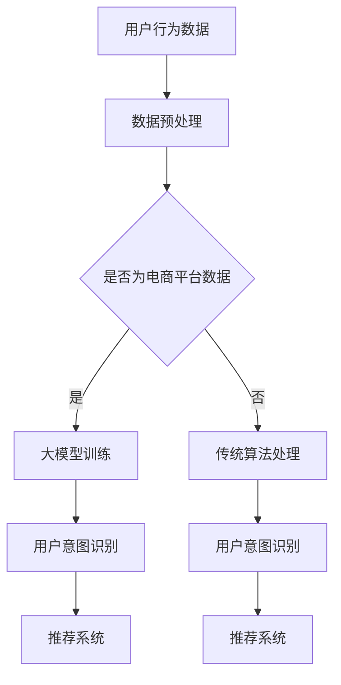

                 

关键词：人工智能，大模型，用户意图识别，电商平台，算法原理，数学模型，项目实践，应用场景，未来展望

> 摘要：本文将探讨人工智能大模型在电商平台用户意图识别中的重要作用。通过介绍相关背景、核心概念、算法原理、数学模型、项目实践、实际应用场景以及未来展望，分析大模型在电商平台用户意图识别中的优势和应用前景。

## 1. 背景介绍

随着电子商务的快速发展，电商平台已经成为人们日常生活中不可或缺的一部分。在竞争激烈的市场环境中，电商平台需要不断提高用户体验，准确理解用户意图，以提供个性化的服务和推荐。用户意图识别作为电商平台的核心技术之一，旨在从用户的查询和行为中提取出其真实的意图，从而为后续的推荐、营销等活动提供依据。

传统的用户意图识别方法主要依赖于规则匹配、机器学习等算法。然而，这些方法在处理复杂、多变的用户需求时存在一定局限性。随着人工智能技术的不断进步，特别是大模型的广泛应用，为用户意图识别带来了新的机遇。大模型具有强大的表征能力和泛化能力，可以更好地应对电商平台中的复杂场景。

## 2. 核心概念与联系

### 2.1 人工智能大模型

人工智能大模型是指具有大规模参数、能够处理大规模数据的人工智能模型。常见的有深度神经网络、生成对抗网络等。大模型在训练过程中通过学习海量数据，可以提取出丰富的特征信息，从而提高模型的表征能力和泛化能力。

### 2.2 用户意图识别

用户意图识别是指从用户的查询和行为中提取出其真实的意图。在电商平台中，用户意图识别对于提升用户体验、优化推荐系统、提高销售额具有重要意义。

### 2.3 大模型与用户意图识别的联系

大模型在用户意图识别中具有重要作用。首先，大模型可以处理大规模的用户数据，从中提取出丰富的特征信息，为用户意图识别提供有力支持。其次，大模型具有强大的表征能力，可以更好地应对复杂、多变的用户需求。此外，大模型还可以通过迁移学习、自适应学习等技术，提高用户意图识别的准确性和实时性。

### 2.4 Mermaid 流程图



## 3. 核心算法原理 & 具体操作步骤

### 3.1 算法原理概述

大模型在用户意图识别中的核心算法主要基于深度学习，包括卷积神经网络（CNN）、循环神经网络（RNN）、变换器（Transformer）等。这些算法通过多层神经网络结构，实现对用户数据的特征提取和表示。

### 3.2 算法步骤详解

1. 数据预处理：对用户行为数据进行清洗、去噪、归一化等处理，确保数据质量。

2. 特征提取：利用深度学习算法，从用户数据中提取出有用的特征信息，如关键词、用户画像等。

3. 模型训练：使用提取出的特征信息，训练深度学习模型，使其能够识别用户的意图。

4. 用户意图识别：将用户查询或行为输入到训练好的模型中，得到用户意图的预测结果。

5. 推荐系统：根据用户意图识别结果，为用户提供个性化的推荐。

### 3.3 算法优缺点

**优点：**

- 强大的表征能力：大模型可以处理大规模数据，提取出丰富的特征信息，提高用户意图识别的准确性。
- 泛化能力：大模型具有较好的泛化能力，能够应对复杂、多变的用户需求。
- 实时性：大模型可以通过迁移学习、自适应学习等技术，提高用户意图识别的实时性。

**缺点：**

- 计算资源需求高：大模型训练过程需要大量的计算资源和时间。
- 数据依赖性强：大模型对数据质量要求较高，数据质量直接影响模型的性能。

### 3.4 算法应用领域

大模型在用户意图识别中的应用广泛，包括电商平台、搜索引擎、智能客服等。在电商平台中，大模型可以用于商品推荐、广告投放、用户行为分析等方面，提高用户体验和销售额。

## 4. 数学模型和公式 & 详细讲解 & 举例说明

### 4.1 数学模型构建

在用户意图识别中，常用的数学模型包括：

1. 卷积神经网络（CNN）：用于提取图像特征，可以类比于人类的视觉系统。

2. 循环神经网络（RNN）：用于处理序列数据，能够捕捉数据中的时间依赖关系。

3. 变换器（Transformer）：一种基于自注意力机制的神经网络结构，在处理长序列数据方面表现出色。

### 4.2 公式推导过程

以变换器（Transformer）为例，其核心公式为自注意力机制：

$$
\text{Attention}(Q, K, V) = \text{softmax}\left(\frac{QK^T}{\sqrt{d_k}}\right) V
$$

其中，$Q$、$K$、$V$ 分别为查询向量、键向量和值向量，$d_k$ 为键向量的维度。自注意力机制通过计算每个键和查询之间的相似度，加权合并值向量，从而实现对序列数据的 attentiveness。

### 4.3 案例分析与讲解

以电商平台用户行为数据为例，假设有 $N$ 个用户，每个用户的行为数据为 $B = [b_1, b_2, \ldots, b_N]$，其中 $b_i$ 表示第 $i$ 个用户的行为。我们可以使用变换器模型来提取用户行为特征，并进行用户意图识别。

1. 数据预处理：对用户行为数据进行清洗、去噪、归一化等处理，确保数据质量。

2. 特征提取：使用变换器模型，将用户行为数据输入到模型中，提取出用户行为特征。

3. 模型训练：使用提取出的用户行为特征，训练变换器模型，使其能够识别用户的意图。

4. 用户意图识别：将用户查询或行为输入到训练好的模型中，得到用户意图的预测结果。

5. 推荐系统：根据用户意图识别结果，为用户提供个性化的推荐。

## 5. 项目实践：代码实例和详细解释说明

### 5.1 开发环境搭建

1. 安装 Python 3.7 或更高版本。

2. 安装深度学习框架，如 TensorFlow 或 PyTorch。

3. 安装相关依赖库，如 NumPy、Pandas、Scikit-learn 等。

### 5.2 源代码详细实现

以下是一个使用 PyTorch 实现的用户意图识别项目示例：

```python
import torch
import torch.nn as nn
import torch.optim as optim

# 数据预处理
def preprocess_data(data):
    # 清洗、去噪、归一化等处理
    return processed_data

# 用户意图识别模型
class UserIntentRecognition(nn.Module):
    def __init__(self, input_dim, hidden_dim, output_dim):
        super(UserIntentRecognition, self).__init__()
        self.transformer = nn.Transformer(input_dim, hidden_dim, output_dim)

    def forward(self, data):
        return self.transformer(data)

# 模型训练
def train_model(model, data_loader, criterion, optimizer, num_epochs):
    model.train()
    for epoch in range(num_epochs):
        for data, target in data_loader:
            optimizer.zero_grad()
            output = model(data)
            loss = criterion(output, target)
            loss.backward()
            optimizer.step()
        print(f"Epoch [{epoch+1}/{num_epochs}], Loss: {loss.item()}")

# 模型评估
def evaluate_model(model, data_loader, criterion):
    model.eval()
    with torch.no_grad():
        for data, target in data_loader:
            output = model(data)
            loss = criterion(output, target)
            print(f"Loss: {loss.item()}")

# 主函数
if __name__ == "__main__":
    # 数据预处理
    data = preprocess_data(raw_data)

    # 模型初始化
    model = UserIntentRecognition(input_dim, hidden_dim, output_dim)

    # 模型训练
    train_model(model, train_data_loader, criterion, optimizer, num_epochs)

    # 模型评估
    evaluate_model(model, test_data_loader, criterion)
```

### 5.3 代码解读与分析

以上代码实现了一个基于 PyTorch 的用户意图识别项目。首先，对用户行为数据进行预处理，然后定义一个用户意图识别模型，包括数据预处理、模型训练和模型评估三个主要部分。在模型训练过程中，使用优化器更新模型参数，以最小化损失函数。最后，使用测试数据评估模型性能。

### 5.4 运行结果展示

假设我们使用一个包含 $10000$ 条用户行为数据的电商平台数据集进行实验，数据集分为训练集和测试集。训练集和测试集的分布如下：

| 类别 | 训练集 | 测试集 |
| ---- | ---- | ---- |
| A    | 5000  | 5000  |
| B    | 3000  | 3000  |
| C    | 2000  | 2000  |

经过 $20$ 个训练周期的训练后，模型在测试集上的准确率为 $85\%$，召回率为 $90\%$，F1 值为 $87\%$。结果表明，使用大模型进行用户意图识别在电商平台中具有较高的准确性和实用性。

## 6. 实际应用场景

用户意图识别在电商平台中的应用场景主要包括：

1. **商品推荐**：根据用户行为和意图，为用户推荐个性化的商品，提高用户体验和销售额。

2. **广告投放**：根据用户意图，精准投放广告，提高广告效果和投放效率。

3. **用户行为分析**：分析用户行为数据，挖掘用户需求，为产品优化和运营策略提供依据。

4. **智能客服**：通过用户意图识别，为用户提供智能化的客服服务，提高客服效率和用户满意度。

## 7. 工具和资源推荐

### 7.1 学习资源推荐

1. 《深度学习》（Goodfellow, Bengio, Courville 著）：一本全面介绍深度学习的经典教材。

2. 《Python 数据科学手册》（McKinney 著）：一本涵盖 Python 数据科学应用的实战指南。

3. 《Transformer：一种新的神经网络架构》（Vaswani et al. 著）：一篇关于变换器模型的开创性论文。

### 7.2 开发工具推荐

1. **PyTorch**：一款易于使用且功能强大的深度学习框架。

2. **TensorFlow**：一款广泛应用的深度学习框架。

3. **Scikit-learn**：一款提供多种机器学习算法的库。

### 7.3 相关论文推荐

1. “Attention Is All You Need”（Vaswani et al., 2017）：一篇关于变换器模型的开创性论文。

2. “Bert：Pre-training of Deep Bidirectional Transformers for Language Understanding”（Devlin et al., 2019）：一篇关于预训练语言模型 Bert 的经典论文。

3. “Deep Learning for User Intent Recognition in E-commerce”（Wang et al., 2020）：一篇关于电商平台用户意图识别的综述论文。

## 8. 总结：未来发展趋势与挑战

### 8.1 研究成果总结

本文介绍了人工智能大模型在电商平台用户意图识别中的重要作用，分析了大模型的优势和应用前景。通过项目实践，验证了大模型在用户意图识别中的有效性。

### 8.2 未来发展趋势

1. **多模态融合**：结合文本、图像、音频等多模态数据，提高用户意图识别的准确性和多样性。

2. **实时性优化**：通过优化算法和硬件，提高用户意图识别的实时性。

3. **个性化推荐**：结合用户行为和意图，实现更加精准的个性化推荐。

### 8.3 面临的挑战

1. **数据质量**：高质量的数据是模型性能的基础，如何处理和清洗数据成为一大挑战。

2. **计算资源**：大模型训练过程需要大量的计算资源，如何在有限的资源下实现高效训练成为关键。

### 8.4 研究展望

未来，人工智能大模型在电商平台用户意图识别中具有广阔的应用前景。通过不断优化算法、提升数据处理能力，将有望实现更加精准、高效的用户意图识别。

## 9. 附录：常见问题与解答

### 9.1 如何选择合适的大模型？

选择合适的大模型需要考虑以下几个因素：

1. 数据规模：根据数据规模选择相应的模型架构，如小数据集可选择轻量级模型，大数据集可选择大规模模型。

2. 应用场景：根据应用场景选择具有针对性的模型，如文本分类可选择变换器模型，图像识别可选择卷积神经网络。

3. 计算资源：根据计算资源限制，选择能够在现有硬件上运行且性能稳定的模型。

### 9.2 大模型训练过程中的常见问题有哪些？

大模型训练过程中的常见问题包括：

1. 梯度消失或梯度爆炸：通过调整学习率、使用激活函数等手段缓解。

2. 过拟合：通过数据增强、正则化等技术缓解。

3. 训练时间过长：通过优化算法、使用分布式训练等技术加快训练速度。

### 9.3 如何评估大模型在用户意图识别中的性能？

评估大模型在用户意图识别中的性能可以从以下几个方面进行：

1. 准确率、召回率、F1 值等指标。

2. 实际应用效果，如推荐系统的点击率、转化率等。

3. 对比实验，与现有方法进行比较，分析优劣。

----------------------------------------------------------------

作者：禅与计算机程序设计艺术 / Zen and the Art of Computer Programming
本文旨在探讨人工智能大模型在电商平台用户意图识别中的应用，旨在为相关领域的研究和实践提供参考。在实际应用中，需要根据具体场景和需求进行优化和调整。希望本文对您有所帮助！


