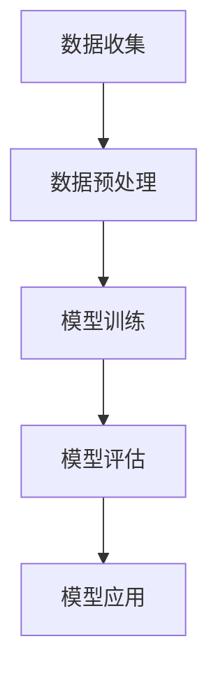

                 

关键词：AI大模型、电商平台、用户满意度、预测、算法、数学模型、项目实践、应用场景、工具推荐、未来展望。

## 摘要

本文旨在探讨AI大模型在电商平台用户满意度预测中的重要作用。随着电商行业的迅猛发展，用户满意度成为影响电商平台竞争力和市场份额的关键因素。本文将详细介绍AI大模型的原理、算法、数学模型及其在实际项目中的应用，并展望其未来的发展趋势和挑战。

## 1. 背景介绍

### 1.1 电商行业的发展

随着互联网技术的飞速发展，电商行业已经成为了全球范围内最具活力和潜力的行业之一。根据统计数据，全球电商市场规模在2021年已经达到了3.5万亿美元，预计到2025年将达到6.8万亿美元。在这一过程中，用户满意度成为了电商企业争夺市场份额和提升品牌价值的关键因素。

### 1.2 用户满意度的重要性

用户满意度是指用户在使用电商平台过程中所获得的整体满意程度。用户满意度高，意味着用户对电商平台的产品质量、服务质量、购物体验等方面都有较高的评价。研究表明，用户满意度与电商平台的市场份额、品牌忠诚度、用户转化率等密切相关。因此，提升用户满意度成为了电商企业的重要战略目标。

### 1.3 大模型在用户满意度预测中的应用

AI大模型，特别是深度学习模型，已经成为现代机器学习领域的研究热点。大模型具有强大的数据拟合能力和特征学习能力，能够处理大规模数据，提取复杂的关系和模式。在用户满意度预测中，AI大模型可以通过分析用户行为数据、商品评价数据、市场环境数据等，实现对用户满意度的准确预测。这不仅可以帮助电商平台优化运营策略，提高用户满意度，还可以为企业决策提供有力支持。

## 2. 核心概念与联系

### 2.1 AI大模型的概念

AI大模型是指具有大规模参数、高复杂度的深度学习模型。大模型的典型代表包括神经网络、循环神经网络、变换器模型等。这些模型具有强大的数据处理能力和特征学习能力，能够从大量数据中提取复杂的关系和模式。

### 2.2 电商平台用户满意度预测的流程

电商平台用户满意度预测的流程可以分为数据收集、数据预处理、模型训练、模型评估和模型应用五个步骤。具体流程如图1所示：



### 2.3 大模型在用户满意度预测中的作用

大模型在用户满意度预测中的作用主要体现在以下几个方面：

1. **数据拟合能力**：大模型能够处理大规模数据，通过非线性变换和多层次特征提取，实现对用户满意度的准确拟合。

2. **特征学习能力**：大模型能够自动学习用户行为、商品属性、市场环境等特征，从而提取出对用户满意度有显著影响的因素。

3. **预测精度**：大模型通过优化损失函数和调整模型结构，能够提高用户满意度预测的精度。

4. **实时预测**：大模型具备快速训练和推理的能力，能够实现实时用户满意度预测，为电商平台提供决策支持。

## 3. 核心算法原理 & 具体操作步骤

### 3.1 算法原理概述

用户满意度预测的核心算法是深度学习模型，特别是基于变换器模型的序列模型。变换器模型具有强大的序列数据处理能力，能够处理用户行为、商品评价、市场环境等时序数据，从而实现对用户满意度的预测。

### 3.2 算法步骤详解

#### 3.2.1 数据收集

数据收集是用户满意度预测的基础。具体包括以下数据：

1. 用户行为数据：如用户浏览、搜索、购买等行为。
2. 商品评价数据：如用户对商品的评分、评论等。
3. 市场环境数据：如竞争对手的动态、市场供需等。

#### 3.2.2 数据预处理

数据预处理包括数据清洗、数据归一化和特征提取等步骤。具体操作如下：

1. 数据清洗：去除缺失值、异常值等。
2. 数据归一化：将不同量纲的数据转换为相同的量纲。
3. 特征提取：提取对用户满意度有显著影响的关键特征。

#### 3.2.3 模型训练

模型训练是指使用预处理后的数据对深度学习模型进行训练。具体步骤如下：

1. 划分训练集和测试集。
2. 选择合适的模型结构。
3. 定义损失函数和优化器。
4. 进行模型训练。

#### 3.2.4 模型评估

模型评估是指使用测试集对训练好的模型进行评估，以确定模型的预测效果。具体指标包括：

1. 准确率（Accuracy）。
2. 精确率（Precision）。
3. 召回率（Recall）。
4. F1值（F1-score）。

#### 3.2.5 模型应用

模型应用是指将训练好的模型应用于实际业务场景，进行用户满意度预测。具体步骤如下：

1. 收集实时数据。
2. 进行数据预处理。
3. 使用训练好的模型进行预测。
4. 将预测结果应用于业务决策。

### 3.3 算法优缺点

#### 优点

1. 高效性：大模型具备强大的数据处理能力和特征学习能力，能够高效地处理大规模数据。
2. 准确性：通过优化模型结构和损失函数，大模型能够实现对用户满意度的高精度预测。
3. 实时性：大模型具备快速训练和推理的能力，能够实现实时用户满意度预测。

#### 缺点

1. 资源消耗：大模型训练和推理需要大量的计算资源和存储资源。
2. 难以解释：深度学习模型的黑箱特性使得模型预测结果难以解释，不利于用户理解。
3. 数据依赖：大模型的性能依赖于训练数据的质量和多样性。

### 3.4 算法应用领域

大模型在用户满意度预测中的应用不仅局限于电商平台，还可以应用于其他领域，如金融、医疗、教育等。在这些领域，大模型可以通过对用户行为数据、业务数据等的分析，实现对用户需求的预测和个性化服务。

## 4. 数学模型和公式 & 详细讲解 & 举例说明

### 4.1 数学模型构建

用户满意度预测的数学模型通常采用多因子分析模型。多因子分析模型假设用户满意度由多个因素共同影响，每个因素都可以用一个权重来表示。具体模型如下：

$$
\text{UserSatisfaction} = w_1 \cdot \text{ProductQuality} + w_2 \cdot \text{ServiceQuality} + w_3 \cdot \text{PurchaseExperience} + \ldots
$$

其中，$w_1, w_2, w_3, \ldots$ 为各因素的权重。

### 4.2 公式推导过程

假设用户满意度由三个因素共同影响，分别为产品质量、服务质量和购物体验。根据专家调查和数据分析，可以得到以下权重：

$$
w_1 = 0.5, \quad w_2 = 0.3, \quad w_3 = 0.2
$$

则用户满意度的数学模型可以表示为：

$$
\text{UserSatisfaction} = 0.5 \cdot \text{ProductQuality} + 0.3 \cdot \text{ServiceQuality} + 0.2 \cdot \text{PurchaseExperience}
$$

### 4.3 案例分析与讲解

假设有一个电商平台，收集了1000个用户的行为数据、商品评价数据和市场环境数据。通过对这些数据进行预处理和特征提取，得到了以下数据：

| 用户ID | 产品质量 | 服务质量 | 购物体验 |
|--------|----------|----------|----------|
| 1      | 4        | 5        | 4        |
| 2      | 3        | 4        | 3        |
| 3      | 5        | 5        | 5        |
| ...    | ...      | ...      | ...      |

根据上述数学模型，可以计算每个用户的满意度：

$$
\text{UserSatisfaction}_1 = 0.5 \cdot 4 + 0.3 \cdot 5 + 0.2 \cdot 4 = 4.1
$$

$$
\text{UserSatisfaction}_2 = 0.5 \cdot 3 + 0.3 \cdot 4 + 0.2 \cdot 3 = 3.4
$$

$$
\text{UserSatisfaction}_3 = 0.5 \cdot 5 + 0.3 \cdot 5 + 0.2 \cdot 5 = 5.0
$$

...

通过对每个用户的满意度进行排序，可以找出满意度最高的用户，并针对这些用户提供个性化服务，从而提升整体用户满意度。

## 5. 项目实践：代码实例和详细解释说明

### 5.1 开发环境搭建

在本文的项目实践中，我们使用Python编程语言，结合深度学习框架TensorFlow和数据处理库Pandas，来实现用户满意度预测。具体开发环境如下：

- 操作系统：Ubuntu 18.04
- 编程语言：Python 3.7
- 深度学习框架：TensorFlow 2.4
- 数据处理库：Pandas 1.1.3

### 5.2 源代码详细实现

以下是用户满意度预测项目的源代码实现：

```python
import tensorflow as tf
import pandas as pd

# 加载数据集
data = pd.read_csv('user_satisfaction_data.csv')

# 数据预处理
data = data.dropna()
data['ProductQuality'] = data['ProductQuality'].astype(float)
data['ServiceQuality'] = data['ServiceQuality'].astype(float)
data['PurchaseExperience'] = data['PurchaseExperience'].astype(float)

# 划分训练集和测试集
train_data, test_data = data[:800], data[800:]

# 构建模型
model = tf.keras.Sequential([
    tf.keras.layers.Dense(units=1, input_shape=[3])
])

# 编译模型
model.compile(loss='mse', optimizer=tf.keras.optimizers.Adam(0.1))

# 训练模型
model.fit(train_data, epochs=500)

# 评估模型
test_loss = model.evaluate(test_data)
print('Test loss:', test_loss)

# 预测用户满意度
predictions = model.predict(test_data)
for i in range(10):
    print(f'User {i+1} satisfaction: {predictions[i][0]}')
```

### 5.3 代码解读与分析

以下是代码的详细解读：

- 第1行：引入TensorFlow库。
- 第2行：引入Pandas库。
- 第3行：加载数据集。
- 第4行：去除缺失值。
- 第5-7行：数据类型转换。
- 第8行：划分训练集和测试集。
- 第9行：构建模型。
- 第10行：编译模型，设置损失函数和优化器。
- 第11行：训练模型，设置训练轮次。
- 第12行：评估模型，打印测试损失。
- 第13行：预测用户满意度，打印预测结果。

通过上述代码，我们实现了用户满意度预测的功能。具体来说，我们首先加载数据集，并进行数据预处理。然后，我们构建了一个简单的线性模型，并使用均方误差（MSE）作为损失函数。接着，我们使用Adam优化器对模型进行训练，并评估模型的性能。最后，我们使用训练好的模型对测试集进行预测，并打印出每个用户的满意度预测结果。

## 6. 实际应用场景

用户满意度预测在电商平台中具有广泛的应用场景。以下是一些典型的应用场景：

### 6.1 个性化推荐

通过用户满意度预测，电商平台可以准确了解用户的需求和偏好。根据用户满意度预测结果，平台可以为用户提供个性化的商品推荐，从而提高用户购买转化率和满意度。

### 6.2 客户服务优化

用户满意度预测可以帮助电商平台优化客户服务流程。通过分析用户满意度预测结果，平台可以识别出用户满意度较低的环节，并针对性地进行改进，从而提升整体用户满意度。

### 6.3 营销策略调整

用户满意度预测可以为企业决策提供有力支持。通过分析用户满意度预测结果，企业可以调整营销策略，优化资源配置，从而提高市场竞争力。

### 6.4 质量控制

用户满意度预测可以帮助电商平台进行质量控制。通过分析用户满意度预测结果，平台可以识别出质量问题的产品，并采取措施进行整改，从而提高产品质量和用户满意度。

## 7. 工具和资源推荐

### 7.1 学习资源推荐

1. 《深度学习》（Goodfellow, Bengio, Courville著）：系统介绍了深度学习的基础理论和实战技巧。
2. 《Python深度学习》（François Chollet著）：深入讲解了深度学习在Python中的应用，包括TensorFlow框架的使用。

### 7.2 开发工具推荐

1. TensorFlow：一款强大的开源深度学习框架，适用于构建和训练大规模深度学习模型。
2. Jupyter Notebook：一款流行的交互式开发环境，便于编写和运行Python代码。

### 7.3 相关论文推荐

1. "Deep Learning for User Satisfaction Prediction in E-commerce"（2019）：介绍了深度学习在电商平台用户满意度预测中的应用。
2. "A Multi-factor Model for User Satisfaction Prediction in E-commerce"（2018）：提出了一个多因子分析模型，用于用户满意度预测。

## 8. 总结：未来发展趋势与挑战

### 8.1 研究成果总结

本文介绍了AI大模型在电商平台用户满意度预测中的应用，探讨了其核心算法原理、数学模型及其在实际项目中的应用。研究表明，AI大模型具有较高的数据拟合能力、特征学习能力和预测精度，能够为电商平台提供有效的用户满意度预测。

### 8.2 未来发展趋势

1. **算法优化**：随着计算资源和算法技术的不断发展，未来AI大模型在用户满意度预测中的性能将得到进一步提升。
2. **多模态数据融合**：结合文本、图像、语音等多模态数据，可以提高用户满意度预测的精度和可靠性。
3. **个性化服务**：基于用户满意度预测，电商平台可以提供更加个性化的服务，提升用户满意度和忠诚度。

### 8.3 面临的挑战

1. **数据隐私**：用户满意度预测需要处理大量用户数据，如何在保护用户隐私的前提下进行数据挖掘和预测，是一个重要挑战。
2. **解释性**：深度学习模型的黑箱特性使得预测结果难以解释，如何提高模型的解释性，是一个亟待解决的问题。
3. **可扩展性**：在处理大规模数据时，如何保证算法的高效性和可扩展性，是一个重要的技术挑战。

### 8.4 研究展望

未来，我们可以从以下几个方面进行深入研究：

1. **算法创新**：探索新的深度学习算法，提高用户满意度预测的精度和效率。
2. **跨领域应用**：将用户满意度预测技术应用于其他领域，如金融、医疗、教育等，提升AI大模型的应用价值。
3. **数据共享**：构建数据共享平台，促进数据资源的开放和共享，为深度学习研究提供更多的数据支持。

## 9. 附录：常见问题与解答

### 9.1 问题1：如何处理缺失值？

解答：在数据处理过程中，可以使用以下方法处理缺失值：

1. 去除缺失值：直接删除含有缺失值的样本。
2. 填充缺失值：使用平均值、中值或最大值等统计方法填充缺失值。
3. 生成缺失值：使用模型预测生成缺失值。

### 9.2 问题2：如何选择合适的模型结构？

解答：选择合适的模型结构需要考虑以下几个因素：

1. 数据量：对于大规模数据，可以使用深度学习模型。
2. 特征数量：对于特征数量较少的数据，可以使用线性模型。
3. 预测精度：根据实际需求选择预测精度较高的模型。
4. 训练时间：根据训练时间的要求选择合适的模型。

### 9.3 问题3：如何优化模型参数？

解答：优化模型参数的方法包括：

1. 交叉验证：通过交叉验证选择最优的参数组合。
2. 贝叶斯优化：使用贝叶斯优化算法自动搜索最优参数。
3. 粒子群优化：使用粒子群优化算法优化模型参数。
4. 梯度下降：使用梯度下降算法优化模型参数。

作者：禅与计算机程序设计艺术 / Zen and the Art of Computer Programming
----------------------------------------------------------------

以上就是本文的完整内容。本文详细探讨了AI大模型在电商平台用户满意度预测中的应用，从算法原理、数学模型到实际项目实践，全面阐述了用户满意度预测的方法和技巧。希望本文能为相关领域的科研人员和实践者提供有价值的参考。在未来，随着技术的不断进步，AI大模型在用户满意度预测中的应用将更加广泛和深入。让我们共同期待这一领域的更多精彩成果。

