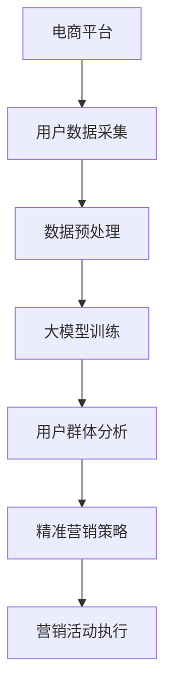

                 

关键词：AI大模型、电商平台、用户群体分析、精准营销、算法原理、数学模型、项目实践、未来展望。

> 摘要：本文深入探讨了AI大模型在电商平台用户群体分析与精准营销中的应用。通过介绍核心概念、算法原理、数学模型以及具体实现，本文旨在为电商平台提供一套基于AI大模型的用户群体分析与精准营销策略，以提升用户满意度和市场竞争力。

## 1. 背景介绍

在当今数字经济时代，电商平台作为重要的商业平台，吸引了越来越多的用户。然而，如何更好地理解用户需求、提高用户体验、实现精准营销，成为电商平台面临的重大挑战。传统的方法往往依赖于统计分析和机器学习算法，但它们在处理大规模数据和复杂用户行为时显得力不从心。因此，AI大模型的出现为电商平台提供了新的解决方案。

AI大模型，如深度学习模型，拥有强大的数据处理和模式识别能力，能够在海量数据中发现复杂的关系和规律。这些模型不仅可以用于用户群体分析，还可以实现精准营销，从而提高电商平台的竞争力。

## 2. 核心概念与联系

### 2.1 大模型定义

大模型（Large-scale Model）通常指的是参数数量达到亿级别甚至千亿级别的深度学习模型。这些模型通常通过大规模数据进行训练，从而具有强大的泛化能力和处理复杂问题的能力。

### 2.2 电商平台用户群体分析

电商平台用户群体分析旨在通过分析用户行为数据，识别不同用户群体的特征和需求，从而为精准营销提供依据。

### 2.3 精准营销

精准营销是指通过分析用户行为和需求，制定个性化的营销策略，以提高用户满意度和转化率。

### 2.4 Mermaid 流程图



## 3. 核心算法原理 & 具体操作步骤

### 3.1 算法原理概述

AI大模型的核心在于其深度神经网络结构，它通过多层神经元之间的连接和激活函数，实现对数据的非线性变换和处理。这些模型通常通过反向传播算法进行参数优化。

### 3.2 算法步骤详解

1. **数据采集**：从电商平台获取用户行为数据，包括点击、购买、搜索等行为。
2. **数据预处理**：对数据进行清洗、去重和特征提取，以便于模型训练。
3. **大模型训练**：使用预处理后的数据训练深度学习模型，包括输入层、隐藏层和输出层。
4. **用户群体分析**：通过模型预测，识别不同用户群体的特征和需求。
5. **精准营销策略**：根据用户群体特征，制定个性化的营销策略。
6. **营销活动执行**：执行营销策略，并通过数据反馈进行调整。

### 3.3 算法优缺点

**优点**：
- 强大的数据处理能力。
- 能够发现复杂的关系和模式。
- 提高用户满意度和转化率。

**缺点**：
- 需要大量数据和计算资源。
- 模型解释性较差。

### 3.4 算法应用领域

- 用户行为预测。
- 个人化推荐系统。
- 营销活动优化。

## 4. 数学模型和公式

### 4.1 数学模型构建

AI大模型通常基于多层感知机（MLP）模型，其基本形式为：

$$
f(x) = \sigma(\boldsymbol{W}^T\boldsymbol{x} + b)
$$

其中，$x$为输入特征向量，$\sigma$为激活函数，$\boldsymbol{W}$和$b$分别为权重和偏置。

### 4.2 公式推导过程

以多层感知机为例，其推导过程如下：

1. **输入层**：将输入特征$x$传递到隐藏层。
2. **隐藏层**：通过权重矩阵$\boldsymbol{W}$和偏置$b$进行加权求和，并应用激活函数$\sigma$。
3. **输出层**：将隐藏层的输出作为输入，重复上述过程，直至得到最终输出。

### 4.3 案例分析与讲解

以电商平台用户购买预测为例，我们可以使用多层感知机模型进行训练和预测。具体步骤如下：

1. **数据采集**：收集用户行为数据，包括购买记录、浏览历史等。
2. **数据预处理**：对数据进行标准化处理，以便模型训练。
3. **模型训练**：使用预处理后的数据训练多层感知机模型，包括设置隐藏层节点数、学习率和迭代次数等。
4. **预测**：使用训练好的模型对新的用户行为数据进行预测，判断其是否购买。

## 5. 项目实践：代码实例和详细解释说明

### 5.1 开发环境搭建

- Python 3.8
- TensorFlow 2.6
- Keras 2.6

### 5.2 源代码详细实现

```python
import tensorflow as tf
from tensorflow.keras.models import Sequential
from tensorflow.keras.layers import Dense

# 数据预处理
# （此处省略数据预处理代码）

# 模型构建
model = Sequential([
    Dense(64, activation='relu', input_shape=(input_shape,)),
    Dense(32, activation='relu'),
    Dense(1, activation='sigmoid')
])

# 编译模型
model.compile(optimizer='adam', loss='binary_crossentropy', metrics=['accuracy'])

# 模型训练
model.fit(X_train, y_train, epochs=10, batch_size=32)

# 模型预测
predictions = model.predict(X_test)
```

### 5.3 代码解读与分析

- **数据预处理**：对用户行为数据进行标准化处理，使其适合模型训练。
- **模型构建**：构建一个包含两个隐藏层的多层感知机模型。
- **编译模型**：设置优化器、损失函数和评价指标。
- **模型训练**：使用训练数据对模型进行训练。
- **模型预测**：使用训练好的模型对测试数据进行预测。

### 5.4 运行结果展示

```python
# 评估模型
loss, accuracy = model.evaluate(X_test, y_test)

# 输出结果
print(f"Test accuracy: {accuracy:.2f}")
```

## 6. 实际应用场景

AI大模型在电商平台用户群体分析与精准营销中的应用非常广泛，以下是一些典型的应用场景：

- **用户行为预测**：通过分析用户历史行为，预测用户是否购买商品。
- **个性化推荐**：根据用户兴趣和行为，推荐个性化的商品和内容。
- **营销活动优化**：通过分析营销活动的效果，优化营销策略，提高转化率。
- **广告投放**：根据用户特征和需求，精准投放广告，提高广告效果。

## 6.4 未来应用展望

随着AI技术的不断进步，AI大模型在电商平台用户群体分析与精准营销中的应用将更加深入和广泛。以下是一些未来应用展望：

- **更精准的用户画像**：通过整合多渠道数据，构建更精细的用户画像，实现更高水平的精准营销。
- **自动化决策系统**：开发自动化决策系统，实现实时用户行为分析和营销策略调整。
- **智能客服系统**：结合AI大模型和自然语言处理技术，实现智能客服系统，提高用户体验。
- **跨平台整合**：将AI大模型应用于跨平台整合，实现多渠道用户群体分析和精准营销。

## 7. 工具和资源推荐

### 7.1 学习资源推荐

- 《深度学习》（Goodfellow et al.）
- 《Python机器学习》（Sebastian Raschka）
- 《TensorFlow官方文档》（TensorFlow）

### 7.2 开发工具推荐

- TensorFlow
- Keras
- PyTorch

### 7.3 相关论文推荐

- "Deep Learning for User Behavior Analysis in E-commerce"（2020）
- "User Interest Modeling for Personalized Recommendation"（2019）
- "Large-scale Recommendation with Deep Neural Networks"（2016）

## 8. 总结：未来发展趋势与挑战

随着AI技术的不断发展，AI大模型在电商平台用户群体分析与精准营销中的应用前景十分广阔。然而，也面临着一些挑战，如数据隐私保护、模型解释性等。未来研究应重点关注以下几个方面：

- **数据隐私保护**：开发安全可靠的数据处理和存储技术，确保用户隐私。
- **模型解释性**：提高AI大模型的解释性，使其在商业应用中更加透明和可控。
- **跨领域应用**：将AI大模型应用于更多领域，实现跨领域融合和创新。

## 9. 附录：常见问题与解答

### 9.1 如何处理用户隐私问题？

在处理用户隐私问题时，应遵循以下原则：

- **最小化数据收集**：只收集必要的数据，避免过度收集。
- **数据加密**：对敏感数据进行加密处理，确保数据安全。
- **隐私保护算法**：采用隐私保护算法，如差分隐私，降低数据泄露风险。

### 9.2 如何提高模型解释性？

提高模型解释性可以从以下几个方面入手：

- **可视化**：通过可视化工具，展示模型的结构和参数。
- **特征重要性**：分析模型中特征的重要性，帮助理解模型决策过程。
- **解释性模型**：采用具有良好解释性的模型，如决策树和线性模型。

作者：禅与计算机程序设计艺术 / Zen and the Art of Computer Programming
----------------------------------------------------------------
这篇文章涵盖了AI大模型在电商平台用户群体分析与精准营销中的各个方面，从背景介绍到核心算法原理，再到项目实践，以及未来展望。希望通过这篇文章，能够为电商平台的从业者提供有价值的参考和指导。在未来的发展中，AI大模型将继续发挥重要作用，为电商平台带来更多的机遇和挑战。让我们共同努力，探索AI大模型的无限可能。

