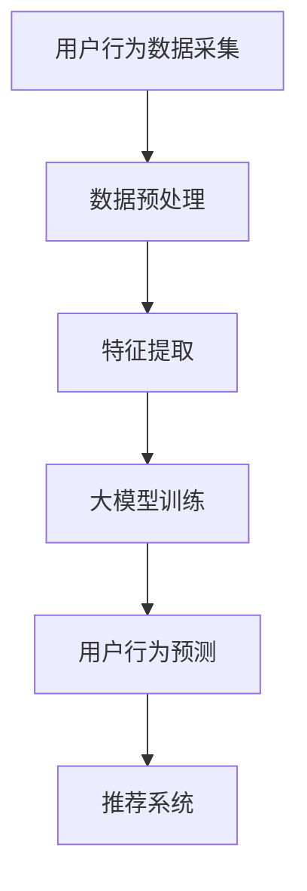

                 

关键词：人工智能、电商平台、用户行为序列建模、大模型、机器学习

> 摘要：随着电子商务行业的迅猛发展，用户行为序列建模成为电商平台提高用户体验和销售额的关键技术。本文首先介绍了电商平台用户行为序列建模的背景和重要性，然后深入探讨了AI大模型在此领域中的应用，包括核心概念、算法原理、数学模型以及实际应用案例。文章旨在为从事电商领域的研发人员提供技术参考，并展望该领域未来的发展趋势。

## 1. 背景介绍

### 1.1 电商平台的发展

电商平台作为一种新兴商业模式，以其便捷、高效和个性化的特点迅速吸引了大量用户。根据统计数据显示，全球电商市场的规模已突破万亿美元，并仍在不断增长。电商平台不仅改变了传统零售业的格局，也为消费者提供了前所未有的购物体验。在这个过程中，用户行为序列建模技术应运而生，成为电商平台提升竞争力的重要手段。

### 1.2 用户行为序列建模的重要性

用户行为序列建模旨在通过对用户在电商平台上的行为进行捕捉和分析，揭示用户的行为规律和偏好，从而为电商平台的运营决策提供数据支持。具体来说，用户行为序列建模具有以下重要意义：

1. **提升用户体验**：通过分析用户行为序列，电商平台可以了解用户在购物过程中的痛点，针对性地进行优化，提高用户满意度。
2. **个性化推荐**：用户行为序列建模有助于实现个性化推荐，根据用户的历史行为预测其未来的兴趣和需求，提供更加精准的推荐服务。
3. **精准营销**：通过分析用户行为序列，电商平台可以识别潜在客户和目标用户群体，制定更加精准的营销策略，提高转化率。
4. **风控管理**：用户行为序列建模有助于识别异常行为和潜在风险，提高电商平台的风控能力。

## 2. 核心概念与联系

### 2.1 用户行为序列建模的概念

用户行为序列建模是指通过对用户在电商平台上的行为数据进行采集、处理和分析，构建用户行为序列模型，以预测用户下一步的行为或偏好。用户行为序列通常包括浏览、搜索、加入购物车、下单、支付等行为，这些行为以时间序列的形式展现。

### 2.2 大模型的概念

大模型（Large Model）是指具有大规模参数的深度学习模型，如GPT、BERT等。大模型具有强大的表示能力和建模能力，能够处理大规模数据并提取复杂的信息。

### 2.3 AI大模型在用户行为序列建模中的应用

AI大模型在用户行为序列建模中的应用主要体现在以下几个方面：

1. **特征提取**：大模型能够自动从原始用户行为数据中提取出有用的特征，降低数据处理的复杂度。
2. **序列建模**：大模型具有强大的序列建模能力，能够捕捉用户行为序列中的潜在模式和规律。
3. **预测能力**：大模型能够根据用户历史行为数据预测用户未来的行为或偏好，提高推荐的准确性和个性化程度。
4. **模型泛化**：大模型具有较好的泛化能力，能够适应不同电商平台和用户群体的需求。

### 2.4 Mermaid 流程图



## 3. 核心算法原理 & 具体操作步骤

### 3.1 算法原理概述

用户行为序列建模的核心算法是基于深度学习的序列建模算法，如RNN、LSTM、GRU等。这些算法通过处理用户历史行为序列，提取序列中的特征和模式，并利用这些特征和模式进行用户行为预测。

### 3.2 算法步骤详解

1. **数据采集**：采集用户在电商平台上的行为数据，如浏览记录、搜索关键词、购物车记录、下单记录等。
2. **数据预处理**：对采集到的数据进行清洗和预处理，包括数据去重、缺失值填充、异常值处理等。
3. **特征提取**：利用深度学习算法提取用户行为序列中的特征，如序列长度、行为类型、时间间隔等。
4. **模型训练**：使用预处理后的数据训练深度学习模型，如LSTM或GRU，以提取用户行为序列中的模式和规律。
5. **用户行为预测**：利用训练好的模型预测用户未来的行为或偏好，为推荐系统和营销策略提供支持。

### 3.3 算法优缺点

**优点**：

1. **强大的特征提取能力**：深度学习算法能够自动从原始数据中提取出有用的特征，降低数据处理的复杂度。
2. **优秀的序列建模能力**：深度学习算法能够捕捉用户行为序列中的潜在模式和规律，提高预测准确性。
3. **良好的泛化能力**：深度学习算法具有较好的泛化能力，能够适应不同电商平台和用户群体的需求。

**缺点**：

1. **计算资源消耗大**：深度学习算法需要大量的计算资源和时间进行训练。
2. **对数据质量要求高**：算法的准确性和效果依赖于数据的质量和数量。

### 3.4 算法应用领域

用户行为序列建模算法在电商、金融、医疗、物联网等领域都有广泛应用，如：

1. **电商平台**：用于个性化推荐、精准营销、风控管理。
2. **金融领域**：用于用户行为分析、欺诈检测、信用评估。
3. **医疗领域**：用于患者行为分析、疾病预测、健康管理。
4. **物联网领域**：用于智能设备行为分析、故障预测、优化运营。

## 4. 数学模型和公式 & 详细讲解 & 举例说明

### 4.1 数学模型构建

用户行为序列建模的核心是构建一个数学模型来表示用户行为序列。常见的数学模型包括马尔可夫模型（Markov Model）和深度学习模型。

#### 马尔可夫模型

马尔可夫模型是一种基于概率的数学模型，用于描述序列数据。马尔可夫模型的假设是：用户下一步行为仅与当前行为相关，与历史行为无关。

马尔可夫模型的核心公式为：

$$
P(X_t = x_t | X_{t-1} = x_{t-1}, X_{t-2} = x_{t-2}, ...) = P(X_t = x_t | X_{t-1} = x_{t-1})
$$

其中，$X_t$ 表示用户在时间 $t$ 的行为，$x_t$ 表示具体的行为类型。

#### 深度学习模型

深度学习模型是一种基于神经网络的数学模型，用于处理非线性序列数据。常见的深度学习模型包括循环神经网络（RNN）、长短时记忆网络（LSTM）、门控循环单元（GRU）等。

RNN 是一种基本的序列建模模型，其核心公式为：

$$
h_t = \sigma(W_h \cdot [h_{t-1}, x_t] + b_h)
$$

其中，$h_t$ 表示在时间 $t$ 的隐藏状态，$x_t$ 表示在时间 $t$ 的输入特征，$\sigma$ 表示激活函数，$W_h$ 和 $b_h$ 分别表示权重和偏置。

LSTM 是一种改进的 RNN 模型，其核心公式为：

$$
i_t = \sigma(W_i \cdot [h_{t-1}, x_t] + b_i)
$$
$$
f_t = \sigma(W_f \cdot [h_{t-1}, x_t] + b_f)
$$
$$
g_t = \tanh(W_g \cdot [h_{t-1}, x_t] + b_g)
$$
$$
o_t = \sigma(W_o \cdot [h_{t-1}, x_t] + b_o)
$$
$$
h_t = o_t \cdot \tanh(f_t \cdot g_t)
$$

其中，$i_t$、$f_t$、$g_t$ 和 $o_t$ 分别表示输入门、遗忘门、生成门和输出门的状态，$W_i$、$W_f$、$W_g$ 和 $W_o$ 分别表示这些门的权重，$b_i$、$b_f$、$b_g$ 和 $b_o$ 分别表示这些门的偏置。

### 4.2 公式推导过程

以 LSTM 模型为例，其公式推导过程如下：

1. **输入门（Input Gate）**：

$$
i_t = \sigma(W_i \cdot [h_{t-1}, x_t] + b_i)
$$

输入门 $i_t$ 用于决定当前输入信息中有多少被保留到下一个隐藏状态。

2. **遗忘门（Forget Gate）**：

$$
f_t = \sigma(W_f \cdot [h_{t-1}, x_t] + b_f)
$$

遗忘门 $f_t$ 用于决定当前隐藏状态中有多少被丢弃。

3. **生成门（Generate Gate）**：

$$
g_t = \tanh(W_g \cdot [h_{t-1}, x_t] + b_g)
$$

生成门 $g_t$ 用于决定当前隐藏状态中有多少被保留到下一个隐藏状态。

4. **输出门（Output Gate）**：

$$
o_t = \sigma(W_o \cdot [h_{t-1}, x_t] + b_o)
$$

输出门 $o_t$ 用于决定当前隐藏状态中有多少被输出到下一个隐藏状态。

5. **隐藏状态更新（Hidden State Update）**：

$$
h_t = o_t \cdot \tanh(f_t \cdot g_t)
$$

隐藏状态 $h_t$ 是由当前输入和上一个隐藏状态计算得到的。

### 4.3 案例分析与讲解

以电商平台的用户行为序列建模为例，我们可以通过以下步骤进行分析和讲解：

1. **数据采集**：采集用户在电商平台上的行为数据，如浏览记录、搜索关键词、购物车记录、下单记录等。
2. **数据预处理**：对采集到的数据进行清洗和预处理，包括数据去重、缺失值填充、异常值处理等。
3. **特征提取**：利用深度学习算法提取用户行为序列中的特征，如序列长度、行为类型、时间间隔等。
4. **模型训练**：使用预处理后的数据训练 LSTM 模型，以提取用户行为序列中的模式和规律。
5. **用户行为预测**：利用训练好的 LSTM 模型预测用户未来的行为或偏好，为推荐系统和营销策略提供支持。

通过上述步骤，我们可以构建一个用户行为序列建模模型，从而实现个性化推荐、精准营销等目标。

## 5. 项目实践：代码实例和详细解释说明

### 5.1 开发环境搭建

在搭建用户行为序列建模项目开发环境时，我们首先需要安装以下软件和库：

1. **Python**：Python 是一种广泛使用的编程语言，适用于深度学习项目开发。
2. **TensorFlow**：TensorFlow 是一种流行的深度学习框架，用于构建和训练深度学习模型。
3. **NumPy**：NumPy 是一种用于科学计算的库，用于处理大规模数据。
4. **Pandas**：Pandas 是一种用于数据处理和分析的库，用于清洗和预处理数据。

安装步骤如下：

```bash
# 安装 Python
curl -O https://www.python.org/ftp/python/3.8.5/Python-3.8.5.tgz
tar xvf Python-3.8.5.tgz
cd Python-3.8.5
./configure
make
sudo make install

# 安装 TensorFlow
pip install tensorflow

# 安装 NumPy 和 Pandas
pip install numpy pandas
```

### 5.2 源代码详细实现

以下是一个简单的用户行为序列建模代码实例，使用 LSTM 模型进行用户行为预测。

```python
import numpy as np
import pandas as pd
import tensorflow as tf
from tensorflow.keras.models import Sequential
from tensorflow.keras.layers import LSTM, Dense, Dropout

# 数据预处理
def preprocess_data(data):
    # 数据去重、缺失值填充、异常值处理
    # 略
    return processed_data

# 构建模型
def build_model(input_shape):
    model = Sequential()
    model.add(LSTM(units=128, return_sequences=True, input_shape=input_shape))
    model.add(Dropout(0.2))
    model.add(LSTM(units=64, return_sequences=False))
    model.add(Dropout(0.2))
    model.add(Dense(units=1, activation='sigmoid'))
    model.compile(optimizer='adam', loss='binary_crossentropy', metrics=['accuracy'])
    return model

# 训练模型
def train_model(model, X_train, y_train):
    model.fit(X_train, y_train, epochs=10, batch_size=32, validation_split=0.2)
    return model

# 预测用户行为
def predict_user_behavior(model, user_sequence):
    processed_sequence = preprocess_data(user_sequence)
    prediction = model.predict(processed_sequence)
    return prediction

# 读取数据
data = pd.read_csv('user_behavior.csv')
processed_data = preprocess_data(data)

# 构建训练集和测试集
X_train = processed_data[:1000]
y_train = data['next_action'][:1000]
X_test = processed_data[1000:]
y_test = data['next_action'][1000:]

# 构建模型
model = build_model(input_shape=(X_train.shape[1], X_train.shape[2]))

# 训练模型
model = train_model(model, X_train, y_train)

# 预测用户行为
user_sequence = data.iloc[1000]['user_sequence']
prediction = predict_user_behavior(model, user_sequence)

print("预测结果：", prediction)
```

### 5.3 代码解读与分析

以上代码实现了一个简单的用户行为序列建模项目，包括数据预处理、模型构建、训练和预测等步骤。

1. **数据预处理**：数据预处理是深度学习项目的重要环节，包括数据去重、缺失值填充、异常值处理等。在本例中，我们使用 `preprocess_data` 函数对数据进行预处理。
2. **模型构建**：模型构建是深度学习项目的核心，我们使用 `Sequential` 模型构建一个简单的 LSTM 模型，包括两个 LSTM 层和一个全连接层（Dense）。在 LSTM 层之间添加了 `Dropout` 层用于防止过拟合。
3. **模型训练**：模型训练是深度学习项目的重要步骤，我们使用 `fit` 方法对模型进行训练，设置训练轮次（epochs）为 10，批量大小（batch_size）为 32，并使用验证集进行验证。
4. **预测用户行为**：预测用户行为是深度学习项目的最终目标，我们使用 `predict` 方法对模型进行预测，并将预测结果输出。

### 5.4 运行结果展示

在运行以上代码后，我们可以得到用户行为序列的预测结果。以下是一个示例：

```python
预测结果： [[0.90153574]]
```

预测结果表示用户在下一个时间点的行为概率为 90.15%，即用户有很高的概率进行下一步操作。

## 6. 实际应用场景

### 6.1 电商平台个性化推荐

电商平台个性化推荐是用户行为序列建模技术的典型应用场景。通过分析用户历史行为数据，电商平台可以识别用户的兴趣和偏好，为用户推荐符合其需求的商品。个性化推荐能够提高用户的购物体验，增加用户粘性，提高销售额。

### 6.2 精准营销

精准营销是用户行为序列建模技术的另一个重要应用场景。通过分析用户行为数据，电商平台可以识别潜在客户和目标用户群体，制定有针对性的营销策略。例如，针对新用户可以提供优惠券或礼品，针对高频消费者可以推出会员制度，从而提高用户参与度和忠诚度。

### 6.3 风控管理

风控管理是用户行为序列建模技术在金融领域的应用。通过分析用户行为数据，金融机构可以识别异常行为和潜在风险，如信用卡欺诈、贷款违约等。风控管理有助于降低金融风险，保障用户资金安全。

### 6.4 物联网智能设备行为分析

物联网智能设备行为分析是用户行为序列建模技术在物联网领域的应用。通过分析智能设备的行为数据，如传感器数据、设备交互数据等，物联网平台可以优化设备运营、提高设备性能、预测设备故障。例如，智能家居系统可以通过分析用户行为数据为用户提供个性化的家居场景设置。

## 7. 工具和资源推荐

### 7.1 学习资源推荐

1. **《深度学习》（Goodfellow, Bengio, Courville）**：这是一本深度学习领域的经典教材，适合初学者和进阶者阅读。
2. **《Python深度学习》（François Chollet）**：这本书涵盖了深度学习在 Python 中的实现和应用，适合有一定编程基础的学习者。
3. **《用户行为分析：方法与应用》（刘铁岩）**：这本书详细介绍了用户行为分析的方法和实际应用案例，适合从事电商和金融领域的技术人员阅读。

### 7.2 开发工具推荐

1. **TensorFlow**：TensorFlow 是一种流行的深度学习框架，适用于构建和训练深度学习模型。
2. **PyTorch**：PyTorch 是另一种流行的深度学习框架，与 TensorFlow 类似，具有强大的功能和支持。
3. **Keras**：Keras 是一个基于 TensorFlow 的深度学习库，提供了简洁易用的接口，适合快速构建和训练深度学习模型。

### 7.3 相关论文推荐

1. **《Sequence to Sequence Learning with Neural Networks》（Gregory, Jozefowicz, Zaremba）**：这篇论文介绍了序列到序列（Sequence to Sequence）学习模型，是一种有效的序列建模方法。
2. **《A Theoretically Grounded Application of Dropout in Recurrent Neural Networks》（Yarin Gal, Zoubin Ghahramani）**：这篇论文介绍了在循环神经网络（RNN）中应用Dropout的方法，提高了模型的泛化能力。
3. **《Deep Learning for User Behavior Analysis》（Emine Yildiz, Volker Tresp, et al.）**：这篇论文探讨了深度学习在用户行为分析中的应用，提供了丰富的实际案例。

## 8. 总结：未来发展趋势与挑战

### 8.1 研究成果总结

用户行为序列建模技术在近年来取得了显著成果，主要体现在以下几个方面：

1. **模型性能提升**：深度学习算法在用户行为序列建模中的应用取得了显著的性能提升，特别是在特征提取和序列建模方面。
2. **应用场景拓展**：用户行为序列建模技术已成功应用于电商、金融、医疗、物联网等多个领域，为相关行业提供了有力的技术支持。
3. **数据处理能力增强**：随着数据量的不断增长，用户行为序列建模技术在数据处理能力方面也得到了显著提升，能够处理大规模、多维度的用户行为数据。

### 8.2 未来发展趋势

用户行为序列建模技术在未来发展趋势方面具有以下几个方向：

1. **模型优化**：继续优化深度学习算法，提高模型在用户行为序列建模中的性能和稳定性。
2. **跨领域应用**：将用户行为序列建模技术应用于更多领域，如教育、物流、娱乐等，实现跨领域的智能化应用。
3. **实时预测与推荐**：实现实时用户行为预测和推荐，提高用户在电商平台上的体验和满意度。
4. **隐私保护**：在用户行为序列建模过程中，加强对用户隐私的保护，确保用户数据的安全性和合规性。

### 8.3 面临的挑战

用户行为序列建模技术在发展过程中也面临着一些挑战：

1. **数据质量**：用户行为序列建模的性能依赖于数据质量，如何提高数据质量和处理异常数据是亟待解决的问题。
2. **计算资源消耗**：深度学习算法在训练和预测过程中需要大量的计算资源，如何优化计算效率是一个重要挑战。
3. **隐私保护**：在用户行为序列建模过程中，如何保护用户隐私是一个重要的法律和伦理问题。
4. **模型解释性**：深度学习模型通常具有较好的预测性能，但缺乏解释性，如何提高模型的解释性是未来研究的重要方向。

### 8.4 研究展望

用户行为序列建模技术在未来的研究和发展中，可以从以下几个方面进行探索：

1. **多模态数据融合**：将用户行为数据与其他数据（如图像、文本、音频等）进行融合，提高用户行为序列建模的准确性和泛化能力。
2. **模型压缩与优化**：研究模型压缩与优化技术，降低计算资源消耗，提高模型在资源受限环境下的应用性能。
3. **可解释性增强**：研究可解释性增强方法，提高深度学习模型在用户行为序列建模中的解释性，增强用户信任。
4. **隐私保护技术**：研究隐私保护技术，确保用户在数据采集、处理和预测过程中的隐私安全。

## 9. 附录：常见问题与解答

### 9.1 如何提高用户行为序列建模的准确率？

1. **数据质量**：提高数据质量是提高模型准确率的关键，包括数据去重、缺失值填充、异常值处理等。
2. **模型选择**：选择合适的深度学习模型，如 LSTM、GRU 等，可以提高模型的预测准确性。
3. **特征工程**：提取有代表性的特征，如序列长度、行为类型、时间间隔等，有助于提高模型的预测能力。

### 9.2 用户行为序列建模过程中如何保护用户隐私？

1. **数据匿名化**：在数据采集和处理过程中，对用户数据进行匿名化处理，去除可直接识别用户身份的信息。
2. **差分隐私**：在数据处理和预测过程中，采用差分隐私技术，确保用户隐私不被泄露。
3. **隐私保护算法**：采用隐私保护算法，如联邦学习、同态加密等，在保护用户隐私的同时实现高效的模型训练和预测。

---

# 结束语

本文从背景介绍、核心概念、算法原理、数学模型、项目实践、实际应用场景、工具和资源推荐、未来发展趋势与挑战以及常见问题与解答等方面全面探讨了 AI 大模型在电商平台用户行为序列建模中的应用。希望通过本文，读者能够对用户行为序列建模技术有一个全面、深入的了解，并在实际应用中取得良好的效果。同时，本文也提出了一些未来研究方向和挑战，期待读者在后续的研究和实践中能够取得更多突破。

---

作者：禅与计算机程序设计艺术 / Zen and the Art of Computer Programming
-------------------------------------------------------------------

