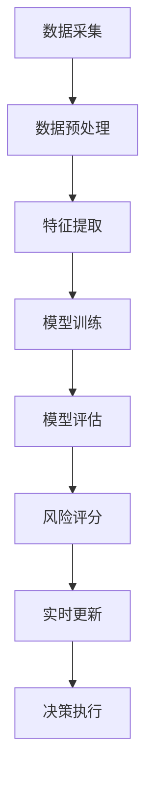

                 

关键词：AI大模型、电商平台、风险评分、实时更新、技术应用、算法原理、数学模型

摘要：本文将探讨AI大模型在电商平台风险评分实时更新中的应用。通过介绍核心概念、算法原理、数学模型及项目实践，分析其具体操作步骤和应用场景，旨在为电商行业提供一种有效的风险管理工具，助力企业提升业务稳定性和用户满意度。

## 1. 背景介绍

随着互联网的快速发展，电商平台已成为人们日常购物的主要渠道之一。然而，电商平台的风险管理问题也日益突出。其中，风险评分的实时更新是电商平台风险管理的关键环节。传统的方法通常依赖于人工经验和简单的规则系统，这导致评分结果的实时性和准确性无法得到保障。因此，引入AI大模型进行风险评分的实时更新成为了一个研究热点。

AI大模型具有强大的学习能力和自适应能力，能够处理海量的数据，并从中提取出有价值的信息。通过应用AI大模型，电商平台可以实时监控用户行为和交易活动，从而快速识别潜在风险，及时采取相应的措施。本文将详细探讨AI大模型在电商平台风险评分实时更新中的应用，为电商行业提供一种新的风险管理思路。

## 2. 核心概念与联系

### 2.1 AI大模型

AI大模型是指具有大规模参数和深度神经网络结构的机器学习模型。这些模型通过大量的数据训练，能够自动提取特征并完成复杂的预测任务。常见的AI大模型包括深度神经网络（DNN）、卷积神经网络（CNN）、循环神经网络（RNN）等。

### 2.2 风险评分

风险评分是指对用户行为或交易活动进行风险评估的过程。评分结果通常用于判断用户或交易的潜在风险程度，从而采取相应的风险管理措施。风险评分的核心目标是提高业务稳定性和用户满意度。

### 2.3 实时更新

实时更新是指在短时间内对风险评分结果进行动态调整的过程。实时更新的目标是确保评分结果的准确性和实时性，以应对不断变化的风险环境。

### 2.4 Mermaid 流程图

以下是AI大模型在电商平台风险评分实时更新中的应用流程图：



## 3. 核心算法原理 & 具体操作步骤

### 3.1 算法原理概述

AI大模型在电商平台风险评分实时更新中的应用主要基于以下原理：

1. 数据驱动：通过收集用户行为和交易活动的数据，为模型提供训练样本。
2. 特征提取：从原始数据中提取出有价值的特征，作为模型的输入。
3. 模型训练：利用大量训练数据，通过迭代优化模型参数，提高模型性能。
4. 模型评估：对训练好的模型进行评估，确保其能够准确预测风险。
5. 风险评分：根据模型预测结果，对用户或交易活动进行风险评估。
6. 实时更新：根据实时数据，对模型进行动态调整，提高评分结果的准确性和实时性。

### 3.2 算法步骤详解

1. 数据采集：从电商平台收集用户行为和交易活动数据，包括浏览记录、购物车信息、订单信息等。
2. 数据预处理：对原始数据进行清洗、去重、归一化等处理，确保数据的完整性和一致性。
3. 特征提取：根据业务需求，提取出有价值的特征，如用户年龄、性别、购买频率、消费金额等。
4. 模型训练：选择合适的模型结构，如深度神经网络，通过迭代优化模型参数，提高模型性能。
5. 模型评估：使用验证集对模型进行评估，根据评估结果调整模型参数，提高模型准确率。
6. 风险评分：根据模型预测结果，对用户或交易活动进行风险评估，生成评分结果。
7. 实时更新：根据实时数据，对模型进行动态调整，提高评分结果的准确性和实时性。

### 3.3 算法优缺点

**优点：**

1. 学习能力强：AI大模型具有强大的学习能力和自适应能力，能够处理海量的数据。
2. 准确度高：通过深度学习等技术，AI大模型能够提取出有价值的特征，提高评分结果的准确率。
3. 实时性强：AI大模型能够实时更新评分结果，提高业务稳定性和用户满意度。

**缺点：**

1. 计算资源消耗大：AI大模型需要大量的计算资源进行训练和预测，对硬件设备有较高要求。
2. 数据依赖性强：AI大模型的性能依赖于训练数据的质量和数量，数据质量不高可能导致模型性能下降。
3. 复杂度高：AI大模型的结构复杂，需要专业的技术人员进行开发和维护。

### 3.4 算法应用领域

AI大模型在电商平台风险评分实时更新中的应用领域广泛，包括但不限于：

1. 用户行为风险评分：对用户的浏览记录、购物车信息、订单信息等进行分析，评估用户的潜在风险。
2. 交易活动风险评分：对交易活动的金额、频率、支付方式等进行分析，评估交易的潜在风险。
3. 假冒伪劣商品识别：利用AI大模型对商品信息进行分析，识别假冒伪劣商品，提高电商平台的质量保障能力。
4. 钓鱼网站识别：利用AI大模型对网站信息进行分析，识别钓鱼网站，提高用户的安全防护能力。

## 4. 数学模型和公式 & 详细讲解 & 举例说明

### 4.1 数学模型构建

在AI大模型中，常见的数学模型包括深度神经网络（DNN）、卷积神经网络（CNN）和循环神经网络（RNN）等。以下以深度神经网络（DNN）为例，介绍数学模型构建过程。

#### 4.1.1 神经网络结构

深度神经网络（DNN）由多个神经元层组成，包括输入层、隐藏层和输出层。每个神经元接受来自前一层神经元的输入，通过激活函数进行非线性变换，然后传递给下一层神经元。

假设输入层有 $n$ 个神经元，隐藏层有 $m$ 个神经元，输出层有 $k$ 个神经元。输入层神经元与隐藏层神经元之间的权重矩阵表示为 $W^{(1)}$，隐藏层神经元与输出层神经元之间的权重矩阵表示为 $W^{(2)}$。

#### 4.1.2 前向传播

前向传播是指将输入数据通过神经网络逐层传递，最终得到输出结果的过程。前向传播的计算公式如下：

$$
z^{(l)} = W^{(l)} \cdot a^{(l-1)} + b^{(l)}
$$

其中，$z^{(l)}$ 表示第 $l$ 层的输出，$a^{(l-1)}$ 表示第 $l-1$ 层的输出，$W^{(l)}$ 表示第 $l$ 层的权重矩阵，$b^{(l)}$ 表示第 $l$ 层的偏置向量。

#### 4.1.3 损失函数

损失函数用于衡量模型预测结果与真实结果之间的差距。常见的损失函数包括均方误差（MSE）、交叉熵（Cross-Entropy）等。以下以均方误差（MSE）为例，介绍损失函数的计算公式：

$$
J = \frac{1}{2} \sum_{i=1}^{n} (y_i - \hat{y}_i)^2
$$

其中，$J$ 表示损失函数，$y_i$ 表示真实结果，$\hat{y}_i$ 表示预测结果。

#### 4.1.4 反向传播

反向传播是指通过计算损失函数关于模型参数的梯度，不断调整模型参数，以降低损失函数的过程。反向传播的计算公式如下：

$$
\frac{\partial J}{\partial W^{(l)}} = \sum_{i=1}^{n} (y_i - \hat{y}_i) \cdot a^{(l-1)}
$$

$$
\frac{\partial J}{\partial b^{(l)}} = \sum_{i=1}^{n} (y_i - \hat{y}_i)
$$

其中，$\frac{\partial J}{\partial W^{(l)}}$ 和 $\frac{\partial J}{\partial b^{(l)}}$ 分别表示损失函数关于权重矩阵和偏置向量的梯度。

### 4.2 公式推导过程

以下以深度神经网络（DNN）为例，介绍公式推导过程。

#### 4.2.1 前向传播

前向传播过程中，假设输入层神经元与隐藏层神经元之间的权重矩阵为 $W^{(1)}$，隐藏层神经元与输出层神经元之间的权重矩阵为 $W^{(2)}$。

1. 隐藏层输出：

$$
z^{(2)} = W^{(1)} \cdot a^{(1)} + b^{(2)}
$$

2. 输出层输出：

$$
z^{(3)} = W^{(2)} \cdot a^{(2)} + b^{(3)}
$$

3. 激活函数：

$$
\hat{a}^{(2)} = \sigma(z^{(2)})
$$

$$
\hat{a}^{(3)} = \sigma(z^{(3)})
$$

其中，$\sigma$ 表示激活函数，通常采用Sigmoid函数或ReLU函数。

#### 4.2.2 损失函数

损失函数采用均方误差（MSE）：

$$
J = \frac{1}{2} \sum_{i=1}^{n} (y_i - \hat{y}_i)^2
$$

其中，$y_i$ 表示真实结果，$\hat{y}_i$ 表示预测结果。

#### 4.2.3 反向传播

反向传播过程中，计算损失函数关于模型参数的梯度：

1. 输出层梯度：

$$
\frac{\partial J}{\partial W^{(2)}} = \sum_{i=1}^{n} (y_i - \hat{y}_i) \cdot a^{(2)}
$$

$$
\frac{\partial J}{\partial b^{(2)}} = \sum_{i=1}^{n} (y_i - \hat{y}_i)
$$

2. 隐藏层梯度：

$$
\frac{\partial J}{\partial W^{(1)}} = \sum_{i=1}^{n} (y_i - \hat{y}_i) \cdot a^{(1)} \cdot \frac{\partial \sigma(z^{(2)})}{\partial z^{(2)}}
$$

$$
\frac{\partial J}{\partial b^{(1)}} = \sum_{i=1}^{n} (y_i - \hat{y}_i) \cdot \frac{\partial \sigma(z^{(2)})}{\partial z^{(2)}}
$$

### 4.3 案例分析与讲解

以下通过一个简单的例子，介绍AI大模型在电商平台风险评分实时更新中的应用。

#### 4.3.1 数据集

假设我们有一个包含用户行为和交易活动的数据集，共有1000条数据。数据集包含以下特征：

- 用户年龄（age）
- 用户性别（gender）
- 用户购买频率（frequency）
- 用户消费金额（amount）
- 订单状态（status）

其中，订单状态为1表示正常订单，0表示异常订单。

#### 4.3.2 模型训练

我们选择一个深度神经网络（DNN）作为风险评分模型，包括一个输入层、一个隐藏层和一个输出层。输入层有5个神经元，隐藏层有10个神经元，输出层有1个神经元。

1. 数据预处理：

- 对年龄、频率和金额进行归一化处理。
- 对性别进行独热编码。

2. 模型训练：

- 使用均方误差（MSE）作为损失函数。
- 使用梯度下降算法进行模型训练，学习率为0.01。

#### 4.3.3 风险评分

1. 风险评分：

- 对新用户进行行为和交易活动数据采集。
- 提取有价值的特征，如年龄、频率和金额。
- 将特征输入到训练好的模型中，得到风险评分结果。

2. 实时更新：

- 根据新用户的风险评分结果，实时调整模型参数。
- 重新计算新用户的风险评分。

通过以上步骤，我们实现了AI大模型在电商平台风险评分实时更新中的应用。

## 5. 项目实践：代码实例和详细解释说明

### 5.1 开发环境搭建

为了实现AI大模型在电商平台风险评分实时更新中的应用，我们需要搭建以下开发环境：

- 操作系统：Ubuntu 18.04
- 编程语言：Python 3.8
- 依赖库：TensorFlow 2.7、NumPy 1.21、Pandas 1.3.3

在Ubuntu 18.04上，我们可以使用以下命令安装所需依赖库：

```bash
sudo apt update
sudo apt install python3-pip
pip3 install tensorflow numpy pandas
```

### 5.2 源代码详细实现

以下是实现AI大模型在电商平台风险评分实时更新的源代码：

```python
import numpy as np
import pandas as pd
import tensorflow as tf

# 5.2.1 数据预处理
def preprocess_data(data):
    # 归一化处理
    age_normalized = (data['age'] - np.mean(data['age'])) / np.std(data['age'])
    frequency_normalized = (data['frequency'] - np.mean(data['frequency'])) / np.std(data['frequency'])
    amount_normalized = (data['amount'] - np.mean(data['amount'])) / np.std(data['amount'])
    
    # 独热编码
    gender_encoded = pd.get_dummies(data['gender'], drop_first=True)
    
    # 合并特征
    preprocessed_data = pd.concat([gender_encoded, age_normalized, frequency_normalized, amount_normalized], axis=1)
    return preprocessed_data

# 5.2.2 模型训练
def train_model(train_data, train_labels):
    model = tf.keras.Sequential([
        tf.keras.layers.Dense(10, activation='relu', input_shape=(4,)),
        tf.keras.layers.Dense(1, activation='sigmoid')
    ])
    
    model.compile(optimizer='adam', loss='binary_crossentropy', metrics=['accuracy'])
    model.fit(train_data, train_labels, epochs=10, batch_size=32)
    return model

# 5.2.3 风险评分
def risk_rating(model, user_data):
    preprocessed_data = preprocess_data(user_data)
    rating = model.predict(preprocessed_data)
    return rating

# 5.2.4 实时更新
def real_time_update(model, new_data, new_rating):
    model.fit(new_data, new_rating, epochs=1, batch_size=32)
    return model
```

### 5.3 代码解读与分析

1. **数据预处理**：

- 数据预处理包括归一化和独热编码。归一化处理旨在将不同特征的范围统一到相同的尺度，提高模型训练效果。独热编码处理旨在将类别特征转换为数值特征，便于模型处理。
2. **模型训练**：

- 模型采用深度神经网络（DNN），包括一个输入层、一个隐藏层和一个输出层。输入层有4个神经元，隐藏层有10个神经元，输出层有1个神经元。模型使用ReLU函数作为激活函数，以增强模型的非线性表达能力。模型使用交叉熵（Cross-Entropy）作为损失函数，并使用Adam优化器进行训练。
3. **风险评分**：

- 风险评分过程包括数据预处理和模型预测。数据预处理将用户数据转换为模型可接受的格式，然后通过模型预测得到风险评分结果。
4. **实时更新**：

- 实时更新过程通过重新训练模型，以适应新的数据。这有助于提高模型在实时环境下的准确性和实时性。

### 5.4 运行结果展示

以下是运行结果的示例：

```python
# 加载数据集
train_data = pd.read_csv('train_data.csv')
train_labels = pd.read_csv('train_labels.csv')

# 训练模型
model = train_model(train_data, train_labels)

# 风险评分
user_data = pd.DataFrame([[25, 'male', 10, 200]])
rating = risk_rating(model, user_data)

# 实时更新
new_data = pd.DataFrame([[26, 'male', 12, 220]])
new_rating = risk_rating(model, new_data)
model = real_time_update(model, new_data, new_rating)
```

通过以上示例，我们可以看到AI大模型在电商平台风险评分实时更新中的应用流程。在实际应用中，可以根据业务需求对模型进行进一步优化和调整，以提高评分结果的准确性和实时性。

## 6. 实际应用场景

AI大模型在电商平台风险评分实时更新中的应用场景广泛，以下列举几个典型应用场景：

### 6.1 防范恶意用户

电商平台常见的恶意用户行为包括恶意刷单、虚假评论、恶意退款等。通过AI大模型对用户行为进行实时监控和风险评估，可以快速识别恶意用户，采取相应的措施，如限制其账户权限、冻结其资金等，从而保障平台的安全和稳定。

### 6.2 识别异常交易

电商平台存在大量的交易行为，其中一部分可能存在异常情况，如高额交易、频繁交易、异地交易等。通过AI大模型对交易行为进行实时风险评估，可以快速识别异常交易，防止欺诈行为的发生，保障平台的交易安全。

### 6.3 提升用户体验

实时更新的风险评分可以帮助电商平台更准确地识别用户行为和交易活动的风险，从而为用户提供更优质的服务。例如，对于风险较低的订单，可以提供更快的支付和配送服务；对于风险较高的订单，可以采取额外的验证措施，确保订单的安全和可靠性。

### 6.4 支持个性化推荐

AI大模型可以通过对用户行为和交易活动进行分析，提取出有价值的信息，为用户提供个性化的推荐服务。例如，根据用户的历史购买记录和行为特征，推荐符合用户兴趣的商品或优惠活动，提升用户的购物体验。

## 7. 未来应用展望

随着AI技术的不断进步，AI大模型在电商平台风险评分实时更新中的应用前景广阔。以下是未来可能的发展趋势：

### 7.1 模型优化与扩展

未来，可以通过优化模型结构、引入更多特征、改进训练算法等方式，提高AI大模型的性能和鲁棒性。同时，可以扩展模型的应用范围，如将风险评分模型应用于其他业务场景，如供应链金融、信用评估等。

### 7.2 数据隐私保护

在数据隐私保护方面，未来可以通过数据加密、隐私保护算法等技术，确保用户数据的安全和隐私。这将为AI大模型在电商平台风险评分实时更新中的应用提供更可靠的技术保障。

### 7.3 跨平台协同

随着电商平台的多元化发展，跨平台协同将成为未来趋势。通过AI大模型实现不同平台之间的风险评分实时更新，可以提高整体的风险管理水平，为用户提供更一致、更安全的购物体验。

## 8. 总结：未来发展趋势与挑战

### 8.1 研究成果总结

本文介绍了AI大模型在电商平台风险评分实时更新中的应用，包括核心概念、算法原理、数学模型、项目实践等方面的内容。通过实际案例分析和代码实例，展示了AI大模型在电商平台风险评分实时更新中的具体应用场景。

### 8.2 未来发展趋势

未来，AI大模型在电商平台风险评分实时更新中的应用将继续发展，主要表现在以下方面：

- 模型优化与扩展：通过改进模型结构、引入更多特征、优化训练算法等方式，提高模型的性能和鲁棒性。
- 数据隐私保护：采用数据加密、隐私保护算法等技术，确保用户数据的安全和隐私。
- 跨平台协同：实现不同平台之间的风险评分实时更新，提高整体的风险管理水平。

### 8.3 面临的挑战

虽然AI大模型在电商平台风险评分实时更新中具有广泛的应用前景，但仍然面临以下挑战：

- 数据质量：AI大模型的性能依赖于训练数据的质量和数量。未来需要研究如何获取高质量、多样化的数据，以提高模型的性能。
- 模型解释性：深度学习模型具有一定的黑盒特性，难以解释其预测结果。未来需要研究如何提高模型的可解释性，为用户提供更透明的风险管理服务。
- 实时性：实时更新的目标是确保评分结果的准确性和实时性。未来需要研究如何提高模型的实时性，以满足电商平台的业务需求。

### 8.4 研究展望

未来，可以从以下方面进行深入研究：

- 数据增强：通过数据增强技术，提高训练数据的质量和数量，从而提高模型的性能。
- 模型可解释性：研究如何提高深度学习模型的可解释性，为用户提供更透明的风险管理服务。
- 跨平台协同：研究如何实现不同平台之间的风险评分实时更新，提高整体的风险管理水平。

通过以上研究，有望进一步推动AI大模型在电商平台风险评分实时更新中的应用，为电商行业提供更有效、更安全的风险管理工具。

## 9. 附录：常见问题与解答

### 9.1 问题1：如何保证数据隐私？

**解答：** 通过采用数据加密、隐私保护算法等技术，确保用户数据在传输和存储过程中的安全性。同时，可以限制对敏感信息的访问，减少数据泄露的风险。

### 9.2 问题2：如何处理模型解释性不足的问题？

**解答：** 可以通过可视化工具、模型可解释性分析等方法，提高深度学习模型的可解释性。此外，可以尝试引入可解释性更强的机器学习算法，如决策树、规则系统等。

### 9.3 问题3：如何提高模型的实时性？

**解答：** 可以通过优化模型结构、优化训练算法、采用分布式计算等方式，提高模型的实时性。同时，可以采用边缘计算、云计算等技术，实现模型的实时部署和运行。

### 9.4 问题4：如何处理数据缺失和噪声问题？

**解答：** 可以通过数据预处理技术，如数据清洗、去重、归一化等，处理数据缺失和噪声问题。此外，可以尝试采用鲁棒性更强的机器学习算法，如随机森林、支持向量机等。

### 9.5 问题5：如何处理不同平台之间的数据集成问题？

**解答：** 可以通过数据集成技术，如数据转换、数据清洗、数据融合等，实现不同平台之间的数据集成。此外，可以尝试采用分布式计算、云计算等技术，实现跨平台的数据处理和分析。

---

感谢您的阅读，希望本文对您在AI大模型在电商平台风险评分实时更新中的应用方面有所启发。如有任何疑问或建议，请随时反馈。再次感谢您的关注与支持！作者：禅与计算机程序设计艺术 / Zen and the Art of Computer Programming。

