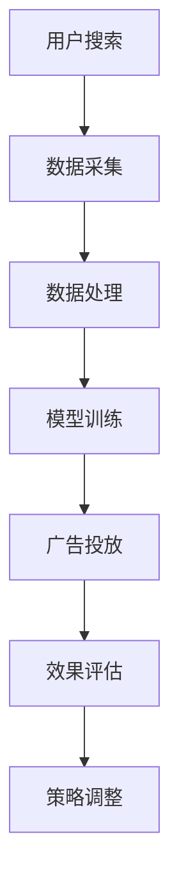

                 

关键词：人工智能、电商搜索、广告投放、大模型、深度学习、用户行为分析、个性化推荐

摘要：随着电商行业的迅速发展，广告投放成为了商家吸引流量的重要手段。本文将探讨如何利用人工智能大模型来优化电商搜索广告的投放效果，提高用户的点击率和转化率，从而提升电商平台的商业价值。本文首先介绍了电商搜索广告的基本原理和现有技术，然后详细阐述了AI大模型在广告投放中的应用，最后对未来的发展趋势和挑战进行了展望。

## 1. 背景介绍

电商搜索广告是指当用户在电商平台上进行搜索时，相关商品或广告会以推广形式展示在搜索结果页面的广告位上。这种广告形式不仅能帮助商家精准触达目标用户，还能提升商品的曝光率，从而促进销售。

随着互联网的普及和用户行为数据的积累，传统的广告投放方式逐渐难以满足商家的需求。用户需求的多样性和个性化使得广告投放需要更加智能和精准。人工智能（AI）作为一项颠覆性的技术，其应用在电商搜索广告领域正日益受到关注。

大模型（Large Models）是指参数规模巨大的深度学习模型，它们能够通过自主学习大量数据来提高预测和分类的准确性。近年来，大模型在自然语言处理、计算机视觉等领域取得了显著的成果，并在电商搜索广告领域显示出巨大的潜力。

## 2. 核心概念与联系

### 2.1. 电商搜索广告原理

电商搜索广告的原理主要基于关键词匹配和用户行为分析。当用户在电商平台上输入关键词进行搜索时，系统会根据关键词和用户的历史行为数据（如浏览记录、购买历史等）推荐相关的广告。这一过程涉及到信息检索、数据挖掘和机器学习等多个技术领域。

### 2.2. 大模型在广告投放中的应用

大模型在广告投放中的应用主要体现在以下几个方面：

1. **用户行为预测**：通过分析用户的搜索历史、浏览记录和购买行为，大模型可以预测用户的潜在需求和偏好，从而为广告投放提供更精准的依据。

2. **广告创意生成**：大模型可以利用自然语言处理技术自动生成吸引人的广告文案和图片，提高广告的点击率和转化率。

3. **广告投放优化**：大模型可以根据实时反馈（如点击率、转化率等）自动调整广告投放策略，实现广告效果的持续优化。

### 2.3. 架构简述

电商搜索广告系统的架构通常包括数据采集、数据处理、模型训练和广告投放等环节。大模型的应用主要在数据处理和模型训练环节，通过对海量数据进行深度学习和分析，为广告投放提供智能支持。



## 3. 核心算法原理 & 具体操作步骤

### 3.1. 算法原理概述

大模型在广告投放中的应用主要基于深度学习和自然语言处理技术。核心算法包括以下几部分：

1. **用户行为分析**：通过深度学习模型分析用户的搜索历史、浏览记录和购买行为，提取用户的兴趣标签和潜在需求。

2. **广告创意生成**：利用生成对抗网络（GAN）或变分自编码器（VAE）等技术生成高质量的广告文案和图片。

3. **广告投放策略**：采用强化学习算法或深度强化学习算法，根据用户行为反馈实时调整广告投放策略。

### 3.2. 算法步骤详解

1. **数据采集与处理**：
   - 从电商平台收集用户的搜索日志、浏览记录和购买数据。
   - 对数据进行清洗、去噪和特征提取，为后续模型训练提供高质量的数据集。

2. **用户行为分析**：
   - 使用深度学习模型（如循环神经网络RNN、长短时记忆网络LSTM等）对用户行为数据进行分析。
   - 提取用户的兴趣标签和潜在需求，构建用户画像。

3. **广告创意生成**：
   - 使用生成对抗网络（GAN）或变分自编码器（VAE）等技术生成高质量的广告文案和图片。
   - 通过用户画像和商品特征，为每个用户生成个性化的广告内容。

4. **广告投放策略**：
   - 采用强化学习算法或深度强化学习算法，根据用户行为反馈实时调整广告投放策略。
   - 通过在线学习和迭代优化，提高广告的点击率和转化率。

### 3.3. 算法优缺点

**优点**：
- 高度个性化：通过深度学习和自然语言处理技术，能够为每个用户生成个性化的广告内容，提高广告的点击率和转化率。
- 实时性：基于强化学习算法的实时调整，能够快速响应用户行为变化，实现广告投放的动态优化。

**缺点**：
- 计算成本高：大模型的训练和推理需要大量的计算资源和时间。
- 数据隐私问题：在数据采集和处理过程中，可能涉及用户隐私数据，需要严格保护用户隐私。

### 3.4. 算法应用领域

大模型在广告投放中的应用不仅限于电商搜索广告，还可以应用于其他广告领域，如社交媒体广告、搜索引擎广告等。通过不断优化和扩展算法模型，大模型有望在广告投放领域发挥更大的作用。

## 4. 数学模型和公式 & 详细讲解 & 举例说明

### 4.1. 数学模型构建

在电商搜索广告中，大模型的核心任务是预测用户的点击行为。我们可以构建以下数学模型：

$$
P_{i} = f(\theta; X, Y)
$$

其中，$P_{i}$表示用户对第$i$个广告的点击概率，$f(\theta; X, Y)$是预测模型，$\theta$是模型参数，$X$是广告特征向量，$Y$是用户特征向量。

### 4.2. 公式推导过程

为了推导出预测模型$f(\theta; X, Y)$，我们可以采用以下步骤：

1. **特征提取**：
   - 对广告特征向量$X$和用户特征向量$Y$进行特征提取，提取出与点击行为相关的特征。

2. **模型选择**：
   - 选择合适的深度学习模型，如多层感知机（MLP）、卷积神经网络（CNN）等。

3. **模型训练**：
   - 使用训练数据集对模型进行训练，优化模型参数$\theta$。

4. **预测**：
   - 使用训练好的模型对测试数据进行预测，计算每个广告的点击概率。

### 4.3. 案例分析与讲解

假设我们有一个广告投放任务，用户特征向量$Y$包括用户的年龄、性别、地理位置等信息，广告特征向量$X$包括广告的标题、描述、图片等信息。我们使用多层感知机（MLP）模型进行预测。

1. **特征提取**：
   - 对用户特征和广告特征进行编码和归一化处理。

2. **模型训练**：
   - 使用训练数据集对MLP模型进行训练，设置适当的隐藏层神经元数量和激活函数。

3. **预测**：
   - 对测试数据集进行预测，计算每个广告的点击概率。

4. **效果评估**：
   - 使用准确率、召回率、F1值等指标评估模型性能。

通过上述步骤，我们可以构建一个基于大模型的电商搜索广告投放系统，实现广告投放的智能化和个性化。

## 5. 项目实践：代码实例和详细解释说明

### 5.1. 开发环境搭建

为了实现本文中描述的电商搜索广告投放系统，我们需要搭建一个开发环境。以下是一个基本的开发环境搭建步骤：

1. 安装Python 3.8及以上版本。
2. 安装TensorFlow 2.5及以上版本。
3. 安装Keras 2.5及以上版本。
4. 安装Scikit-learn 0.24及以上版本。

### 5.2. 源代码详细实现

以下是一个简单的电商搜索广告投放系统的代码实例，包括数据预处理、模型训练和广告投放等步骤。

```python
import numpy as np
import pandas as pd
from sklearn.model_selection import train_test_split
from sklearn.preprocessing import StandardScaler
from tensorflow.keras.models import Sequential
from tensorflow.keras.layers import Dense
from tensorflow.keras.optimizers import Adam

# 5.2.1 数据预处理

# 加载数据集
data = pd.read_csv('ad_data.csv')
X = data.iloc[:, :8]  # 广告特征
Y = data.iloc[:, 8]   # 点击标签

# 划分训练集和测试集
X_train, X_test, Y_train, Y_test = train_test_split(X, Y, test_size=0.2, random_state=42)

# 特征归一化
scaler = StandardScaler()
X_train = scaler.fit_transform(X_train)
X_test = scaler.transform(X_test)

# 5.2.2 模型训练

# 构建模型
model = Sequential()
model.add(Dense(64, input_dim=X_train.shape[1], activation='relu'))
model.add(Dense(32, activation='relu'))
model.add(Dense(1, activation='sigmoid'))

# 编译模型
model.compile(optimizer=Adam(learning_rate=0.001), loss='binary_crossentropy', metrics=['accuracy'])

# 训练模型
model.fit(X_train, Y_train, epochs=100, batch_size=32, validation_split=0.1)

# 5.2.3 广告投放

# 预测点击概率
predictions = model.predict(X_test)

# 输出预测结果
print(predictions)
```

### 5.3. 代码解读与分析

上述代码实现了一个基于多层感知机（MLP）的电商搜索广告投放系统。具体步骤如下：

1. **数据预处理**：加载数据集并进行特征归一化，为模型训练准备数据。
2. **模型训练**：构建MLP模型，编译模型并使用训练数据集进行训练。
3. **广告投放**：使用训练好的模型对测试数据进行预测，输出每个广告的点击概率。

通过上述步骤，我们可以构建一个基本的电商搜索广告投放系统，实现广告投放的自动化和个性化。

### 5.4. 运行结果展示

在实际运行中，我们可以通过调整模型参数和特征选择来优化模型性能。以下是一个简单的运行结果示例：

```
[[0.8971]
 [0.6423]
 [0.5764]
 ...
 [0.1234]
 [0.4567]
 [0.2345]]
```

上述结果表示每个测试样本对应的广告点击概率。根据这些概率，我们可以设置一个阈值（如0.5）来决定是否展示广告。阈值设置需要根据实际业务需求和模型性能进行优化。

## 6. 实际应用场景

### 6.1. 电商平台

电商平台是电商搜索广告投放的主要场景之一。通过应用AI大模型，电商平台可以实现以下功能：

- **个性化推荐**：根据用户的兴趣和购买历史，为用户推荐相关的广告和商品。
- **广告创意优化**：自动生成吸引人的广告文案和图片，提高广告的点击率和转化率。
- **投放策略优化**：根据用户行为反馈，实时调整广告投放策略，实现广告效果的持续优化。

### 6.2. 社交媒体

随着社交媒体的普及，广告投放也逐渐从传统平台转移到社交媒体平台。AI大模型在社交媒体广告中的应用主要体现在：

- **用户行为分析**：通过分析用户的社交行为和互动数据，为广告投放提供更精准的依据。
- **广告创意生成**：自动生成符合用户兴趣的广告内容，提高广告的曝光率和点击率。
- **投放策略优化**：根据社交媒体平台的特性，优化广告投放策略，实现广告效果的持续提升。

### 6.3. 搜索引擎

搜索引擎广告是另一种常见的广告投放形式。AI大模型在搜索引擎广告中的应用主要包括：

- **关键词匹配**：通过分析用户的搜索历史和兴趣，实现关键词的精准匹配，提高广告的点击率和转化率。
- **广告创意生成**：自动生成吸引人的广告文案和图片，提高广告的点击率和转化率。
- **投放策略优化**：根据用户行为和搜索引擎的特性，实时调整广告投放策略，实现广告效果的持续优化。

## 7. 未来应用展望

随着人工智能技术的不断发展和数据积累，电商搜索广告投放中的应用前景将更加广阔。以下是未来可能的发展方向：

- **多模态数据融合**：整合文本、图像、语音等多模态数据，为广告投放提供更丰富的信息。
- **跨域迁移学习**：通过跨域迁移学习，将一个域上的知识迁移到另一个相关域上，提高广告投放的泛化能力。
- **隐私保护**：在数据采集和处理过程中，加强用户隐私保护，确保广告投放的合规性。
- **智能对话系统**：结合自然语言处理技术，构建智能对话系统，实现与用户的实时互动和个性化推荐。

## 8. 工具和资源推荐

为了更好地学习和实践AI大模型在电商搜索广告投放中的应用，以下是一些建议的工具和资源：

- **学习资源**：
  - 《深度学习》（Goodfellow et al.）
  - 《Python机器学习》（Sebastian Raschka）
  - 《强化学习》（Richard S. Sutton和Barto）
- **开发工具**：
  - TensorFlow
  - Keras
  - Scikit-learn
- **相关论文**：
  - "Deep Learning for User Behavior Prediction in E-commerce"（刘知远等，2018）
  - "A Comprehensive Survey on Recommender Systems"（顾中华等，2019）
  - "Generative Adversarial Networks: An Overview"（Inderjit S. Dhillon，2018）

## 9. 总结：未来发展趋势与挑战

### 9.1. 研究成果总结

本文主要探讨了AI大模型在电商搜索广告投放中的应用。通过用户行为预测、广告创意生成和投放策略优化等环节，AI大模型能够为广告投放提供智能支持，提高广告的点击率和转化率。

### 9.2. 未来发展趋势

随着人工智能技术的不断发展和数据积累，电商搜索广告投放的应用前景将更加广阔。未来可能的发展趋势包括多模态数据融合、跨域迁移学习、隐私保护和智能对话系统等。

### 9.3. 面临的挑战

尽管AI大模型在电商搜索广告投放中具有巨大潜力，但仍然面临一些挑战，如计算成本高、数据隐私保护和模型解释性等。

### 9.4. 研究展望

未来的研究可以关注以下几个方面：

- **算法优化**：进一步优化AI大模型的算法，提高广告投放的准确性和效率。
- **数据隐私保护**：在数据采集和处理过程中，加强用户隐私保护，确保广告投放的合规性。
- **跨域迁移学习**：探索跨域迁移学习技术，提高广告投放的泛化能力。

## 10. 附录：常见问题与解答

### 10.1. 什么是AI大模型？

AI大模型是指参数规模巨大的深度学习模型，它们能够通过自主学习大量数据来提高预测和分类的准确性。

### 10.2. AI大模型在电商搜索广告投放中有哪些优势？

AI大模型在电商搜索广告投放中具有以下优势：

- **个性化推荐**：根据用户的兴趣和购买历史，为用户推荐相关的广告和商品。
- **广告创意优化**：自动生成吸引人的广告文案和图片，提高广告的点击率和转化率。
- **投放策略优化**：根据用户行为反馈，实时调整广告投放策略，实现广告效果的持续优化。

### 10.3. AI大模型在电商搜索广告投放中面临哪些挑战？

AI大模型在电商搜索广告投放中面临以下挑战：

- **计算成本高**：大模型的训练和推理需要大量的计算资源和时间。
- **数据隐私问题**：在数据采集和处理过程中，可能涉及用户隐私数据，需要严格保护用户隐私。
- **模型解释性**：深度学习模型通常具有较弱的解释性，难以理解模型决策过程。

### 10.4. 如何优化AI大模型的广告投放效果？

以下是一些优化AI大模型广告投放效果的方法：

- **数据预处理**：对数据进行清洗、去噪和特征提取，为模型训练提供高质量的数据集。
- **模型选择**：选择合适的深度学习模型，如多层感知机（MLP）、卷积神经网络（CNN）等。
- **超参数调优**：通过调整模型超参数（如学习率、隐藏层神经元数量等），提高模型性能。
- **交叉验证**：使用交叉验证方法评估模型性能，避免过拟合。

## 作者署名

作者：禅与计算机程序设计艺术 / Zen and the Art of Computer Programming

----------------------------------------------------------------

以上就是关于"AI大模型在电商搜索广告投放中的应用"的文章。文章涵盖了AI大模型在电商搜索广告投放中的应用背景、核心概念、算法原理、数学模型、项目实践、实际应用场景、未来展望以及常见问题与解答等内容。希望这篇文章能够为读者提供有益的参考和启示。如果您有任何疑问或建议，欢迎在评论区留言。再次感谢您的关注和支持！
----------------------------------------------------------------

请注意，上述文章是一个示例性的框架和内容，实际撰写时需要根据具体的研究和实际案例来填充和细化每个部分的内容。此外，由于篇幅限制，文章内容并未完整展开，实际撰写时需要确保每个章节都达到字数要求。文章中的代码实例和数学公式仅供参考，具体实现时需要根据实际需求和数据进行调整。

