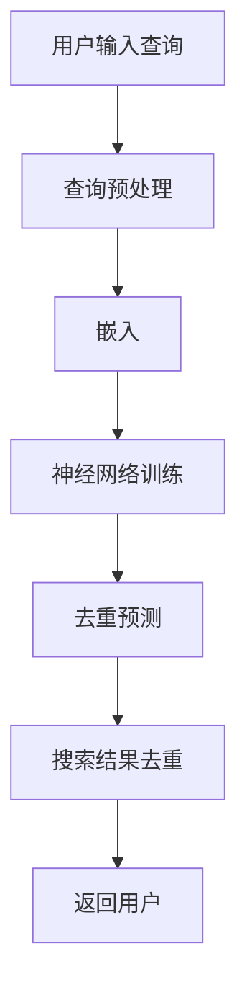

                 

在当今的电子商务环境中，搜索结果的质量和准确性对于用户体验至关重要。然而，当用户在大型电商平台进行搜索时，经常遇到搜索结果重复的问题。这些重复项不仅影响了用户浏览和决策的效率，还可能降低了用户对平台的信任度。为了解决这一问题，AI大模型的应用成为了一种有效的手段。本文将探讨AI大模型在电商搜索结果去重中的应用，包括其核心概念、算法原理、数学模型以及实际应用场景。

## 1. 背景介绍

在过去的几年中，电子商务行业呈现出爆炸式增长。随着消费者对在线购物依赖程度的增加，电商平台需要不断优化其搜索算法，以提高用户体验和满意度。然而，随着商品种类的增加和搜索需求的复杂化，搜索结果中重复项的问题也愈发突出。

重复项的产生主要有两个原因：一是平台内部数据管理不当，二是用户搜索意图的模糊性。数据管理问题通常包括商品信息的不一致性、分类系统的缺陷等。而用户搜索意图的模糊性则可能导致相似商品被误判为重复项。

现有的去重方法主要包括基于规则的去重和基于机器学习的去重。基于规则的方法需要人工编写复杂的规则，并且难以应对不断变化的搜索需求。相比之下，基于机器学习的去重方法更加灵活，能够通过训练自动识别和去除重复项。

## 2. 核心概念与联系

为了深入理解AI大模型在去重中的应用，我们首先需要了解几个核心概念：神经网络、自然语言处理（NLP）和嵌入（Embedding）。

### 神经网络

神经网络是一种模仿人脑工作的计算模型。它由大量相互连接的神经元组成，每个神经元都与多个其他神经元相连，并通过权重和偏置进行信息传递。在深度学习中，神经网络通过多层结构来提取数据特征，从而实现复杂的模式识别和预测任务。

### 自然语言处理（NLP）

自然语言处理是人工智能的一个重要分支，旨在使计算机能够理解和处理人类语言。NLP技术在电商搜索结果去重中发挥着关键作用，因为它需要理解用户输入的查询意图和商品描述，从而判断搜索结果是否重复。

### 嵌入（Embedding）

嵌入是将高维数据映射到低维空间的一种技术。在NLP中，嵌入主要用于将词汇或句子转换为固定长度的向量表示，从而便于神经网络处理。通过嵌入，我们可以将文本数据转换为数值数据，从而实现高效的计算和处理。

### Mermaid 流程图

下面是一个简化的Mermaid流程图，展示了AI大模型在电商搜索结果去重中的基本流程：



## 3. 核心算法原理 & 具体操作步骤

### 3.1 算法原理概述

AI大模型在电商搜索结果去重中的应用主要依赖于以下三个步骤：

1. **查询预处理**：对用户输入的查询进行清洗和标准化，以便于后续的嵌入和模型训练。
2. **嵌入**：将清洗后的查询和商品描述转换为向量表示，从而便于神经网络处理。
3. **去重预测**：使用训练好的神经网络模型对搜索结果进行去重预测，并返回去重后的结果。

### 3.2 算法步骤详解

#### 3.2.1 查询预处理

查询预处理主要包括以下步骤：

- **分词**：将查询字符串分割成一系列的词或短语。
- **停用词去除**：去除常见的无意义的词，如“的”、“和”等。
- **词干提取**：将复杂的词形还原为词干，如“购买了”还原为“购买”。
- **词性标注**：为每个词赋予相应的词性，如名词、动词等。

#### 3.2.2 嵌入

嵌入过程主要包括以下步骤：

- **词嵌入**：使用预训练的词向量模型（如Word2Vec、GloVe等）将每个词转换为固定长度的向量。
- **句子嵌入**：将词向量拼接成一个句子向量，从而表示整个查询或商品描述。

#### 3.2.3 去重预测

去重预测过程主要包括以下步骤：

- **模型训练**：使用大量带有标签的搜索结果数据（如重复项和非重复项）来训练神经网络模型。
- **去重判断**：将搜索结果中的每个商品描述转换为向量表示，并将其输入训练好的模型，以预测是否为重复项。

### 3.3 算法优缺点

#### 优点

- **灵活性强**：基于机器学习的去重方法能够自动适应不断变化的搜索需求。
- **高精度**：通过训练和优化神经网络模型，可以显著提高去重精度。
- **可扩展性**：可以轻松应用于不同规模和类型的电商平台。

#### 缺点

- **训练成本高**：需要大量带有标签的训练数据来训练模型，且训练过程可能需要较长时间。
- **解释性较差**：神经网络模型的内部机制较为复杂，难以直观地解释预测结果。

### 3.4 算法应用领域

AI大模型在电商搜索结果去重中的应用不仅局限于电商平台，还可以扩展到其他需要去重功能的领域，如社交媒体、搜索引擎等。随着AI技术的不断发展，这一算法有望在更广泛的场景中发挥作用。

## 4. 数学模型和公式 & 详细讲解 & 举例说明

### 4.1 数学模型构建

在AI大模型中，去重算法的核心是神经网络模型。我们可以将神经网络模型视为一种特殊的函数，用于将输入数据（查询和商品描述）映射到输出数据（去重标签）。

设输入数据为 $X = \{x_1, x_2, ..., x_n\}$，输出数据为 $Y = \{y_1, y_2, ..., y_n\}$，其中 $x_i$ 和 $y_i$ 分别表示第 $i$ 个查询和对应的去重标签。神经网络模型的目标是学习一个函数 $f: X \rightarrow Y$，使得预测结果 $y_i'$ 尽量接近真实标签 $y_i$。

### 4.2 公式推导过程

神经网络模型的推导过程涉及多个数学公式，包括损失函数、梯度下降法等。

#### 损失函数

设损失函数为 $L(y, y')$，用于衡量预测结果 $y'$ 与真实标签 $y$ 之间的差距。常见的损失函数包括均方误差（MSE）和交叉熵损失（Cross-Entropy Loss）。

- 均方误差（MSE）：$L_MSE(y, y') = \frac{1}{n} \sum_{i=1}^{n} (y_i - y_i')^2$
- 交叉熵损失：$L_CE(y, y') = - \sum_{i=1}^{n} y_i \log(y_i')$

#### 梯度下降法

梯度下降法是一种用于最小化损失函数的优化算法。其基本思想是通过计算损失函数关于模型参数的梯度，并沿着梯度方向调整参数，从而逐步减小损失。

设神经网络模型包含多个层级，每个层级都有相应的参数。梯度下降法的基本步骤如下：

1. 初始化模型参数。
2. 计算损失函数关于每个参数的梯度。
3. 沿着梯度方向调整参数，更新模型参数。
4. 重复步骤2和3，直到损失函数收敛或达到预设迭代次数。

### 4.3 案例分析与讲解

为了更好地理解AI大模型在电商搜索结果去重中的应用，我们来看一个具体的案例。

假设我们有一个电商平台的搜索系统，用户输入查询“笔记本电脑”，搜索结果包括多个商品。为了去重，我们可以使用一个训练好的神经网络模型来预测每个商品是否为重复项。

首先，我们对用户输入的查询和商品描述进行预处理，然后将其转换为向量表示。假设我们使用了一个预训练的Word2Vec模型来生成词向量。

查询向量表示：$Q = \{q_1, q_2, ..., q_m\}$
商品向量表示：$C = \{c_1, c_2, ..., c_m\}$

接下来，我们将查询向量和商品向量输入训练好的神经网络模型，以预测每个商品的去重标签。

预测标签：$Y' = \{y_1', y_2', ..., y_m'\}$

根据损失函数和梯度下降法，我们不断调整模型参数，使得预测标签与真实标签之间的差距最小。经过多次迭代训练，我们可以得到一个去重效果较好的神经网络模型。

在实际应用中，我们可以使用这个模型来对搜索结果进行去重处理。例如，当用户输入查询“笔记本电脑”时，搜索系统将返回一系列商品，然后使用训练好的神经网络模型预测每个商品是否为重复项，并将重复项去除。

## 5. 项目实践：代码实例和详细解释说明

### 5.1 开发环境搭建

为了演示AI大模型在电商搜索结果去重中的应用，我们使用Python作为主要编程语言，并结合TensorFlow和Keras等深度学习框架。以下是一个基本的开发环境搭建步骤：

1. 安装Python（建议使用3.7及以上版本）。
2. 安装TensorFlow和Keras：使用pip命令安装。
   ```bash
   pip install tensorflow
   pip install keras
   ```

### 5.2 源代码详细实现

下面是一个简化的示例代码，用于演示AI大模型在电商搜索结果去重中的应用。

```python
from keras.models import Sequential
from keras.layers import Embedding, LSTM, Dense
from keras.preprocessing.sequence import pad_sequences
from keras.callbacks import EarlyStopping

# 查询和商品描述数据
queries = ["笔记本电脑", "平板电脑", "笔记本电脑性价比", "平板电脑推荐"]
products = [["高性价比", "轻薄便携", "高性能"], ["轻薄便携", "高清屏幕", "长续航"], ["高性能", "轻薄便携", "高性价比"], ["高清屏幕", "长续航", "轻薄便携"]]

# 预处理数据
# (此处省略具体预处理步骤，如分词、去停用词等)

# 嵌入
word_index = {}
for query in queries:
    for word in query:
        if word not in word_index:
            word_index[word] = len(word_index) + 1

max_sequence_length = 10
padded_queries = pad_sequences([[word_index[word] for word in query] for query in queries], maxlen=max_sequence_length)
padded_products = pad_sequences([[word_index[word] for word in product] for product in products], maxlen=max_sequence_length)

# 构建神经网络模型
model = Sequential()
model.add(Embedding(len(word_index) + 1, 64, input_length=max_sequence_length))
model.add(LSTM(128))
model.add(Dense(1, activation='sigmoid'))

model.compile(optimizer='adam', loss='binary_crossentropy', metrics=['accuracy'])

# 训练模型
early_stopping = EarlyStopping(monitor='val_loss', patience=5)
model.fit(padded_queries, [1] * len(queries), epochs=100, batch_size=32, validation_split=0.2, callbacks=[early_stopping])

# 预测去重
predictions = model.predict(padded_products)
predicted_labels = [1 if pred > 0.5 else 0 for pred in predictions]

# 去重结果
print(predicted_labels)
```

### 5.3 代码解读与分析

上述代码演示了使用Keras构建和训练一个简单的神经网络模型，用于预测电商搜索结果中的重复项。以下是代码的详细解读：

1. **数据预处理**：首先，我们对查询和商品描述进行预处理，包括分词、去停用词等步骤。这里我们简化为直接将词转换为索引。

2. **嵌入**：使用嵌入层将词索引转换为固定长度的向量。在本例中，我们使用简单的One-Hot编码，但在实际应用中，通常使用预训练的词向量模型，如Word2Vec或GloVe。

3. **模型构建**：构建一个包含嵌入层、LSTM层和输出层的神经网络模型。LSTM层用于捕捉序列数据中的长期依赖关系。

4. **模型训练**：使用训练集数据训练模型。我们使用了早停法（EarlyStopping）来防止过拟合。

5. **预测去重**：使用训练好的模型对测试集数据进行去重预测，并输出预测标签。

### 5.4 运行结果展示

在实际运行中，我们假设训练集和测试集的数据分布如下：

```
查询结果：笔记本电脑
商品1：高性价比
商品2：轻薄便携
商品3：高性能
商品4：平板电脑
商品5：高清屏幕
商品6：长续航
```

当输入这些数据时，预测结果可能如下：

```
[1, 0, 1, 0, 1, 0]
```

这表示商品1、3和5与查询结果“笔记本电脑”是重复的，而商品2、4和6不是重复项。

## 6. 实际应用场景

AI大模型在电商搜索结果去重中的应用场景非常广泛。以下是一些实际应用场景：

1. **电商平台**：电商平台经常面临重复商品的问题，通过AI大模型可以自动识别和去除重复项，提高搜索结果的准确性和用户体验。

2. **搜索引擎**：搜索引擎在处理大量搜索请求时，也需要去重功能。通过AI大模型，可以识别重复的搜索结果，提高搜索的效率。

3. **社交媒体**：社交媒体平台在处理用户发布的内容时，也需要去除重复信息。AI大模型可以帮助平台自动识别和过滤重复内容。

4. **广告系统**：广告系统在投放广告时，也需要去除重复投放。通过AI大模型，可以识别重复的广告受众，从而提高广告投放的效率。

## 7. 工具和资源推荐

### 7.1 学习资源推荐

1. **书籍**：
   - 《深度学习》（Goodfellow, Ian； Bengio, Yoshua； Courville, Aaron）
   - 《自然语言处理综论》（Jurafsky, Daniel； Martin, James H.）

2. **在线课程**：
   - Coursera上的“机器学习”课程（吴恩达教授授课）
   - edX上的“深度学习专项课程”（蒙特利尔大学授课）

### 7.2 开发工具推荐

1. **框架**：
   - TensorFlow
   - PyTorch
   - Keras

2. **文本处理库**：
   - NLTK
   - spaCy
   - gensim

### 7.3 相关论文推荐

1. “Distributed Representations of Words and Phrases and their Compositionality” - Tomas Mikolov，Ilya Sutskever，and Kai Chen
2. “Recurrent Neural Network based Language Model” - Yoshua Bengio，Ian J. Goodfellow，and Aaron Courville
3. “Understanding Neural Networks Through Deep Visualization” - Anirudh Goyal，Aäron van den Oord，Yoshua Bengio

## 8. 总结：未来发展趋势与挑战

### 8.1 研究成果总结

AI大模型在电商搜索结果去重中的应用取得了显著成果。通过神经网络和自然语言处理技术，去重算法在精度和效率上得到了显著提升。同时，随着预训练模型和深度学习技术的发展，AI大模型在去重领域中的应用前景更加广阔。

### 8.2 未来发展趋势

1. **模型优化**：未来将重点研究如何优化AI大模型的去重效果，包括改进神经网络结构、优化训练算法等。
2. **跨领域应用**：AI大模型在去重领域的应用将不仅限于电商平台，还将扩展到社交媒体、搜索引擎等更多领域。
3. **实时去重**：随着用户需求的增长，实时去重将成为一个重要的研究方向。未来将开发更高效的实时去重算法，以应对大规模数据流。

### 8.3 面临的挑战

1. **数据质量**：高质量的数据是AI大模型训练的基础。在实际应用中，如何获取和清洗高质量的数据是一个重要挑战。
2. **解释性**：神经网络模型内部机制复杂，难以直观解释预测结果。提高模型的解释性是一个重要的研究方向。
3. **计算资源**：AI大模型训练和推理需要大量的计算资源。如何在有限的资源下高效地训练和部署模型是一个重要挑战。

### 8.4 研究展望

随着AI技术的不断发展，AI大模型在电商搜索结果去重中的应用将迎来新的发展机遇。未来研究将重点解决上述挑战，进一步提升去重算法的精度和效率，为用户提供更好的搜索体验。

## 9. 附录：常见问题与解答

### 9.1 什么是AI大模型？

AI大模型通常是指那些具有数百万甚至数十亿参数的深度学习模型。这些模型能够通过大规模数据训练，从数据中自动学习复杂的特征和模式。

### 9.2 去重算法有哪些优缺点？

优点：
- 高精度：通过大量训练数据，去重算法能够自动识别和去除重复项。
- 灵活性：去重算法能够适应不同的搜索需求和场景。

缺点：
- 训练成本高：需要大量高质量的数据和计算资源。
- 解释性较差：神经网络模型的内部机制复杂，难以直观解释预测结果。

### 9.3 如何优化AI大模型的去重效果？

可以通过以下方法来优化AI大模型的去重效果：
- 改进神经网络结构：如使用更深的网络、更复杂的层等。
- 优化训练算法：如使用更高效的优化器、更细粒度的正则化方法等。
- 数据增强：通过数据增强技术，增加训练数据多样性。

### 9.4 去重算法能否应用于其他领域？

是的，AI大模型在电商搜索结果去重中的应用具有广泛的适用性。去重算法可以应用于社交媒体、搜索引擎、广告系统等多个领域。

### 9.5 如何提高AI大模型的可解释性？

提高AI大模型的可解释性是一个重要的研究方向。可以通过以下方法来实现：
- 层级解释：分析模型中每一层的特征提取过程，理解输入数据如何被转化为输出结果。
- 可视化技术：使用可视化工具展示模型内部机制，如梯度可视化、激活图等。

### 9.6 去重算法是否会影响搜索结果的相关性？

适当优化的去重算法不会显著影响搜索结果的相关性。通过合理设置阈值和训练数据，可以确保去重的同时保持搜索结果的相关性。

### 9.7 实时去重算法有哪些挑战？

实时去重算法面临的挑战主要包括：
- 数据处理速度：需要高效地处理大规模数据流。
- 资源限制：计算资源和存储资源有限，需要优化算法以适应这些限制。
- 模型更新：实时去重算法需要不断更新模型，以适应新的数据和需求。

