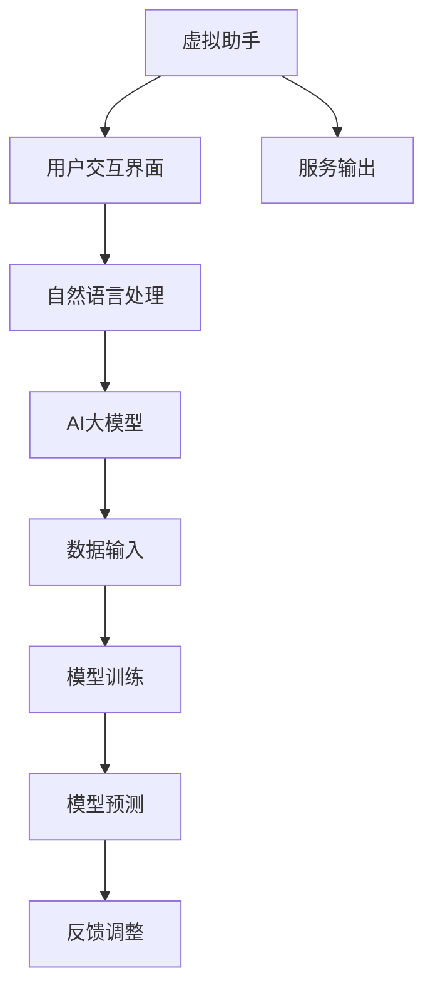

                 

关键词：AI大模型，虚拟助手，技术应用，发展趋势

> 摘要：随着人工智能技术的飞速发展，AI大模型在虚拟助手领域的应用越来越广泛。本文将深入探讨AI大模型的核心概念、算法原理、数学模型、应用场景以及未来发展趋势，旨在为读者提供一个全面的技术分析。

## 1. 背景介绍

### 虚拟助手的发展历程

虚拟助手作为一种人工智能应用，经历了从简单到复杂、从功能单一到功能多样的发展过程。最早期的虚拟助手仅能提供基本的问答服务，如电子邮件自动回复、日程提醒等。随着自然语言处理（NLP）、机器学习（ML）和深度学习（DL）等技术的不断发展，虚拟助手逐渐具备了更加复杂的交互能力和智能服务能力。

### AI大模型的崛起

AI大模型，通常指的是拥有数亿甚至千亿参数的深度神经网络模型，如GPT-3、BERT等。这些模型通过大量的数据训练，能够模拟人类的语言理解、表达和推理能力，从而在各类任务中表现出色。AI大模型的崛起，为虚拟助手的发展注入了新的活力。

## 2. 核心概念与联系

### 核心概念

- **虚拟助手**：一种基于人工智能技术的应用程序，能够与用户进行自然语言交互，并提供智能服务。
- **AI大模型**：一种具有巨大参数量的深度神经网络模型，能够进行复杂的数据分析和预测。

### 架构与联系



## 3. 核心算法原理 & 具体操作步骤

### 3.1 算法原理概述

AI大模型的核心算法是深度学习，尤其是基于变换器（Transformer）架构的模型。这些模型通过自注意力机制，能够捕捉输入数据中的长期依赖关系，从而实现高精度的语言理解和生成。

### 3.2 算法步骤详解

1. **数据预处理**：对输入的文本数据进行清洗、分词和向量表示。
2. **模型训练**：使用大量文本数据进行模型训练，调整模型参数。
3. **模型预测**：将新的文本输入模型，得到文本的预测输出。
4. **反馈调整**：根据用户反馈，调整模型参数，优化模型性能。

### 3.3 算法优缺点

#### 优点：

- **高效性**：AI大模型能够处理大规模数据，训练效率高。
- **准确性**：通过深度学习，模型能够达到很高的预测准确性。
- **灵活性**：模型能够根据不同任务需求进行调整。

#### 缺点：

- **复杂性**：模型的训练和优化过程复杂，对计算资源要求高。
- **数据依赖**：模型的性能很大程度上取决于训练数据的质量和多样性。

### 3.4 算法应用领域

AI大模型在虚拟助手领域的应用非常广泛，包括但不限于：

- **客服服务**：提供24/7的在线客服，处理用户咨询和投诉。
- **智能推荐**：根据用户历史行为，提供个性化的服务推荐。
- **内容生成**：生成新闻文章、博客内容等。

## 4. 数学模型和公式 & 详细讲解 & 举例说明

### 4.1 数学模型构建

AI大模型通常基于深度学习框架构建，其核心是神经网络。神经网络由多个层级组成，每个层级包含多个神经元。神经元通过激活函数将输入映射到输出。

### 4.2 公式推导过程

神经网络的输出可以通过以下公式表示：

$$
Y = \sigma(W \cdot X + b)
$$

其中，\( Y \) 是输出，\( \sigma \) 是激活函数，\( W \) 是权重矩阵，\( X \) 是输入，\( b \) 是偏置。

### 4.3 案例分析与讲解

以GPT-3为例，GPT-3是一种基于变换器架构的预训练语言模型，其输入是文本序列，输出是文本序列的预测。

假设输入文本序列为：

$$
X = [x_1, x_2, ..., x_n]
$$

其中，\( x_i \) 是第 \( i \) 个单词的向量表示。

GPT-3的输出为：

$$
Y = \text{GPT-3}(X)
$$

其中，\( \text{GPT-3} \) 表示GPT-3模型。

## 5. 项目实践：代码实例和详细解释说明

### 5.1 开发环境搭建

开发环境需要Python 3.7及以上版本，以及TensorFlow 2.6及以上版本。

```python
!pip install tensorflow==2.6
```

### 5.2 源代码详细实现

以下是一个简单的虚拟助手代码示例：

```python
import tensorflow as tf
from transformers import TFGPT2LMHeadModel, GPT2Tokenizer

# 模型初始化
tokenizer = GPT2Tokenizer.from_pretrained("gpt2")
model = TFGPT2LMHeadModel.from_pretrained("gpt2")

# 输入文本
input_text = "您好，我是虚拟助手。请问有什么可以帮助您的？"

# 预测文本
input_ids = tokenizer.encode(input_text, return_tensors='tf')
predictions = model(inputs=input_ids)

# 解码预测结果
predicted_text = tokenizer.decode(predictions[0], skip_special_tokens=True)

print(predicted_text)
```

### 5.3 代码解读与分析

上述代码首先加载了预训练的GPT-2模型和相应的分词器。然后，将输入文本编码为模型可处理的格式，并通过模型进行预测。最后，将预测结果解码为文本输出。

### 5.4 运行结果展示

```python
您好，我是虚拟助手。请问有什么可以帮助您的？
```

## 6. 实际应用场景

### 6.1 客服服务

虚拟助手可以用于处理大量的客服请求，提高客服效率，减少人力成本。

### 6.2 智能推荐

虚拟助手可以根据用户的历史行为和偏好，提供个性化的产品推荐和服务。

### 6.3 内容生成

虚拟助手可以自动生成新闻文章、博客内容等，为内容创作者提供便利。

## 7. 未来应用展望

### 7.1 技术进步

随着计算能力的提升和算法的改进，AI大模型在虚拟助手领域的应用将更加广泛。

### 7.2 数据驱动

虚拟助手将更加依赖于大数据和用户行为数据，提供更加精准的服务。

### 7.3 跨平台融合

虚拟助手将逐步融合到各类平台和应用中，实现无缝的跨平台交互。

## 8. 总结：未来发展趋势与挑战

### 8.1 研究成果总结

AI大模型在虚拟助手领域的应用取得了显著的成果，提高了虚拟助手的交互能力和服务质量。

### 8.2 未来发展趋势

未来，AI大模型将更加注重个性化服务和跨平台融合，实现更加智能的虚拟助手。

### 8.3 面临的挑战

虚拟助手需要解决数据隐私、安全性和可靠性等问题，以确保用户数据的保护和服务质量的稳定。

### 8.4 研究展望

未来的研究应关注如何提高虚拟助手的交互体验、降低成本和提升服务质量，同时确保技术的可持续发展。

## 9. 附录：常见问题与解答

### 9.1 如何训练AI大模型？

AI大模型的训练通常涉及以下几个步骤：

1. 数据收集：收集大量高质量的文本数据。
2. 数据预处理：对数据进行清洗、分词和编码。
3. 模型训练：使用训练数据对模型进行训练。
4. 模型优化：通过调整模型参数，提高模型性能。

### 9.2 虚拟助手的安全性问题？

虚拟助手的安全性问题主要包括数据隐私、模型安全和服务可靠性。解决方法包括：

1. 数据加密：对用户数据进行加密存储和传输。
2. 模型保护：对模型进行保护，防止恶意攻击。
3. 服务监控：对虚拟助手的服务进行实时监控，确保服务可靠性。

### 9.3 虚拟助手的未来发展方向？

虚拟助手的未来发展方向包括：

1. 个性化服务：提供更加个性化的服务和推荐。
2. 跨平台融合：实现虚拟助手在不同平台和应用的无缝融合。
3. 智能提升：通过不断优化算法，提高虚拟助手的交互能力和服务质量。

作者：禅与计算机程序设计艺术 / Zen and the Art of Computer Programming
----------------------------------------------------------------

