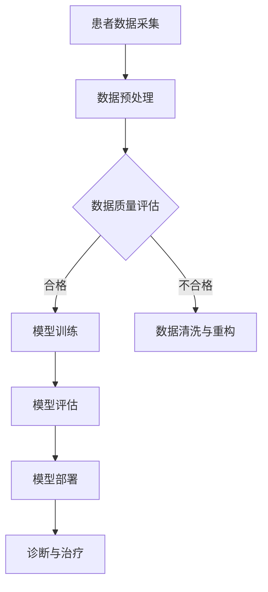

                 

关键词：远程医疗，AI大模型，商业化，医疗数据，智能诊断，患者管理

摘要：本文探讨了人工智能大模型在远程医疗领域中的应用与商业化前景。通过分析当前医疗行业的痛点，本文介绍了AI大模型的核心概念和架构，详细解析了其算法原理和数学模型。随后，通过实际项目实践展示了AI大模型在远程医疗中的具体应用，并探讨了其未来发展方向和面临的挑战。

## 1. 背景介绍

近年来，随着人工智能技术的飞速发展，AI大模型在各个领域展现出了强大的潜力。在医疗领域，远程医疗成为解决医疗资源分布不均、提高医疗服务效率的重要手段。然而，远程医疗的发展也面临着诸多挑战，如医疗数据的不完整性和隐私问题，以及诊断准确率的提升等。AI大模型的引入为这些问题提供了一种可能的解决方案。

远程医疗的核心目标是利用互联网和信息技术，实现患者与医生之间的远程互动和医疗服务。这包括在线问诊、远程监控、医疗数据分析等。然而，当前远程医疗仍存在以下痛点：

1. **医疗数据不完整**：由于患者信息采集的不完整性，远程医疗系统往往无法获得全面的病历数据，这限制了诊断的准确性和个性化治疗的实施。
2. **隐私保护**：医疗数据涉及患者隐私，如何在保护隐私的同时充分利用这些数据是一个重要挑战。
3. **诊断准确率**：虽然远程医疗系统可以实现初步诊断，但准确率仍需提高，特别是对于复杂疾病和罕见病例。
4. **医疗资源分布不均**：偏远地区和基层医疗机构的医疗资源匮乏，难以提供高质量的服务。

AI大模型的应用有望解决上述问题，提高远程医疗的服务质量和效率。接下来，本文将深入探讨AI大模型在远程医疗领域的具体应用和商业化前景。

## 2. 核心概念与联系

### 2.1 AI大模型的基本概念

AI大模型是指通过深度学习技术训练出的具有大规模参数的神经网络模型。这些模型通常拥有数十亿甚至千亿个参数，能够处理海量数据并从中学习复杂的模式。大模型的训练需要大量的计算资源和数据支持，但一旦训练完成，它们能够实现高效的推理和预测。

### 2.2 远程医疗与AI大模型的关联

远程医疗与AI大模型的结合主要体现在以下几个方面：

1. **数据驱动的诊断**：AI大模型能够处理和分析大量的医疗数据，包括病历、影像、基因数据等，从而提供更准确和个性化的诊断建议。
2. **智能患者管理**：通过AI大模型，医生可以实时监控患者的健康状况，及时预警潜在的健康风险，并制定个性化的治疗计划。
3. **医疗资源优化**：AI大模型可以帮助医疗机构更好地分配和利用医疗资源，提高医疗服务效率。
4. **隐私保护与数据安全**：AI大模型的设计和应用需要充分考虑患者隐私和数据安全问题，采用加密和匿名化等技术确保数据的安全性和隐私保护。

### 2.3 Mermaid 流程图



在此流程图中，患者数据采集是整个远程医疗AI大模型应用过程的第一步。通过数据预处理，可以保证数据的质量和一致性。接下来是数据质量评估，以决定是否需要进行数据清洗与重构。通过大规模的模型训练，AI大模型能够学习到复杂的医疗知识。模型评估环节用于验证模型的效果和准确性。最后，部署完成的模型可以应用于实际诊断和治疗过程中，为患者提供个性化的医疗服务。

## 3. 核心算法原理 & 具体操作步骤

### 3.1 算法原理概述

AI大模型的核心算法是深度学习，特别是基于神经网络的深度学习模型。这些模型通过多层神经元的相互连接和训练，能够自动从数据中学习复杂的模式和特征。在远程医疗中，AI大模型通常用于以下任务：

1. **疾病诊断**：通过分析患者的病历、影像等数据，AI大模型可以识别和诊断各种疾病。
2. **病情预测**：AI大模型可以根据患者的当前健康状况和历史病历，预测其未来病情的发展和变化。
3. **个性化治疗**：基于患者的具体病情和个体差异，AI大模型可以提供个性化的治疗建议和方案。

### 3.2 算法步骤详解

#### 3.2.1 数据采集与预处理

1. **数据采集**：从医院信息系统、电子病历、影像设备等渠道收集患者数据。
2. **数据预处理**：清洗和标准化数据，包括缺失值填充、异常值处理、数据归一化等。

#### 3.2.2 模型训练

1. **模型选择**：选择适合远程医疗任务的深度学习模型，如卷积神经网络（CNN）、循环神经网络（RNN）等。
2. **模型训练**：使用大量的医疗数据对模型进行训练，通过反向传播算法不断调整模型参数，优化模型性能。

#### 3.2.3 模型评估

1. **模型评估指标**：选择合适的评估指标，如准确率、召回率、F1分数等，评估模型的性能。
2. **交叉验证**：使用交叉验证方法验证模型的泛化能力，避免过拟合。

#### 3.2.4 模型部署

1. **模型部署**：将训练完成的模型部署到远程医疗系统中，实现实时诊断和治疗。
2. **实时更新**：定期更新模型，以适应新的数据和医疗标准。

### 3.3 算法优缺点

#### 优点：

1. **高准确率**：通过大规模数据训练，AI大模型能够提供高度准确的诊断结果。
2. **个性化治疗**：基于患者的个体差异，AI大模型可以提供更加个性化的治疗建议。
3. **高效处理**：AI大模型能够快速处理大量医疗数据，提高医疗服务的效率。

#### 缺点：

1. **数据隐私**：医疗数据涉及患者隐私，如何在保护隐私的同时充分利用这些数据是一个挑战。
2. **计算资源消耗**：训练和部署AI大模型需要大量的计算资源和存储空间。
3. **解释性不足**：深度学习模型的黑箱特性使得其诊断结果的解释性较差，不利于医生的诊断决策。

### 3.4 算法应用领域

AI大模型在远程医疗中的应用非常广泛，包括但不限于以下领域：

1. **疾病诊断**：用于诊断常见疾病如肺炎、糖尿病、高血压等。
2. **病情预测**：预测疾病的进展和并发症，帮助医生制定预防性治疗计划。
3. **个性化治疗**：根据患者的具体情况提供个性化的治疗方案。
4. **药物研发**：通过分析大量药物和基因数据，预测药物的效果和副作用。

## 4. 数学模型和公式

### 4.1 数学模型构建

在远程医疗中，AI大模型通常采用深度学习模型，其中最常用的数学模型是多层感知机（MLP）和卷积神经网络（CNN）。

#### 4.1.1 多层感知机（MLP）

MLP是一种前馈神经网络，包括输入层、隐藏层和输出层。其数学模型可以表示为：

$$
z_i = \sum_{j=1}^{n} w_{ij} x_j + b_i
$$

其中，$z_i$ 是隐藏层第 $i$ 个节点的输入，$x_j$ 是输入层第 $j$ 个节点的值，$w_{ij}$ 是连接输入层和隐藏层的权重，$b_i$ 是隐藏层第 $i$ 个节点的偏置。

#### 4.1.2 卷积神经网络（CNN）

CNN 是一种特殊的多层感知机，适用于处理图像数据。其数学模型主要包括卷积层、池化层和全连接层。

1. **卷积层**：

$$
h_i = \sum_{j=1}^{n} w_{ij} * x_j + b_i
$$

其中，$h_i$ 是输出特征图第 $i$ 个像素点的值，$x_j$ 是输入特征图第 $j$ 个像素点的值，$w_{ij}$ 是卷积核的权重，$b_i$ 是偏置。

2. **池化层**：

$$
p_i = \max_{j} h_{ji}
$$

其中，$p_i$ 是输出池化图的第 $i$ 个像素点的值，$h_{ji}$ 是卷积层输出特征图第 $i$ 行第 $j$ 列的像素点值。

### 4.2 公式推导过程

以多层感知机（MLP）为例，其前向传播过程的推导如下：

1. **输入层到隐藏层**：

$$
a_{ij}^{(1)} = x_j
$$

$$
z_i^{(2)} = \sum_{j=1}^{n} w_{ij}^{(1)} a_{ij}^{(1)} + b_i^{(1)}
$$

$$
a_i^{(2)} = \sigma(z_i^{(2)})
$$

其中，$a_{ij}^{(1)}$ 是输入层第 $j$ 个节点到隐藏层第 $i$ 个节点的输入值，$z_i^{(2)}$ 是隐藏层第 $i$ 个节点的输入值，$a_i^{(2)}$ 是隐藏层第 $i$ 个节点的输出值，$w_{ij}^{(1)}$ 是输入层到隐藏层的权重，$b_i^{(1)}$ 是隐藏层第 $i$ 个节点的偏置，$\sigma$ 是激活函数。

2. **隐藏层到输出层**：

$$
z_j^{(3)} = \sum_{i=1}^{m} w_{ij}^{(2)} a_i^{(2)} + b_j^{(2)}
$$

$$
y_j = \sigma(z_j^{(3)})
$$

其中，$z_j^{(3)}$ 是输出层第 $j$ 个节点的输入值，$y_j$ 是输出层第 $j$ 个节点的输出值，$w_{ij}^{(2)}$ 是隐藏层到输出层的权重，$b_j^{(2)}$ 是输出层第 $j$ 个节点的偏置。

### 4.3 案例分析与讲解

假设我们有一个二分类问题，输入数据是患者的医疗记录，输出数据是疾病是否存在的标志（0表示不存在，1表示存在）。我们可以使用多层感知机（MLP）进行训练。

1. **数据预处理**：

将患者的医疗记录进行编码和标准化处理，将连续值转换为0-1之间的数值。例如，身高、体重等指标。

2. **模型训练**：

选择一个合适的MLP模型，包括输入层、隐藏层和输出层。输入层有 $n$ 个节点，隐藏层有 $m$ 个节点，输出层有 $1$ 个节点。使用反向传播算法进行训练，调整模型参数。

3. **模型评估**：

使用交叉验证方法评估模型的性能，选择合适的评估指标如准确率、召回率等。

4. **模型部署**：

将训练完成的模型部署到远程医疗系统中，实现疾病的自动诊断。

## 5. 项目实践：代码实例和详细解释说明

### 5.1 开发环境搭建

为了实现AI大模型在远程医疗中的应用，我们需要搭建一个开发环境。以下是具体的步骤：

1. **硬件环境**：配置高性能的GPU服务器，用于模型的训练和推理。
2. **软件环境**：安装Python环境，以及深度学习框架如TensorFlow或PyTorch。
3. **数据库**：使用MySQL或PostgreSQL等关系型数据库存储患者的医疗数据。

### 5.2 源代码详细实现

以下是使用TensorFlow实现一个简单的AI大模型用于疾病诊断的源代码：

```python
import tensorflow as tf
from tensorflow.keras.models import Sequential
from tensorflow.keras.layers import Dense, Conv2D, Flatten, MaxPooling2D

# 数据预处理
# （此处省略数据预处理代码）

# 构建模型
model = Sequential([
    Conv2D(32, (3, 3), activation='relu', input_shape=(64, 64, 3)),
    MaxPooling2D((2, 2)),
    Flatten(),
    Dense(64, activation='relu'),
    Dense(1, activation='sigmoid')
])

# 编译模型
model.compile(optimizer='adam', loss='binary_crossentropy', metrics=['accuracy'])

# 训练模型
model.fit(x_train, y_train, epochs=10, batch_size=32, validation_data=(x_val, y_val))

# 评估模型
model.evaluate(x_test, y_test)
```

### 5.3 代码解读与分析

1. **数据预处理**：对输入数据进行编码和标准化处理，确保模型能够接受统一的输入格式。
2. **模型构建**：使用Sequential模型构建一个简单的卷积神经网络，包括卷积层、池化层、全连接层和输出层。
3. **模型编译**：选择合适的优化器和损失函数，配置模型的训练参数。
4. **模型训练**：使用训练数据对模型进行训练，并设置验证集进行性能评估。
5. **模型评估**：使用测试数据评估模型的性能，选择合适的评估指标。

### 5.4 运行结果展示

在训练完成后，我们可以使用以下代码展示模型的运行结果：

```python
# 预测新病例
new_case = preprocess_new_case(new_data)  # 假设已有预处理函数
prediction = model.predict(new_case)
print(prediction)
```

这段代码将输入新的医疗数据，通过模型进行预测，并输出预测结果。

## 6. 实际应用场景

### 6.1 在线问诊

在线问诊是远程医疗中最常见的应用场景之一。通过AI大模型，患者可以在线上与医生进行实时交流，并获得初步的诊断建议。这种服务不仅方便患者，还可以减轻医院门诊的压力。

### 6.2 远程监控

远程监控通过AI大模型对患者的健康状况进行实时监测。例如，通过智能手表或健康设备收集患者的生理数据，如心率、血压等。AI大模型可以分析这些数据，发现异常并及时通知医生。

### 6.3 智能药物研发

AI大模型在药物研发中也具有广泛的应用前景。通过分析大量的药物和基因数据，AI大模型可以预测药物的效果和副作用，帮助医生制定个性化的治疗方案。

### 6.4 疾病预测与预防

AI大模型可以根据患者的病历和基因数据，预测其未来可能患上的疾病。这种预测可以帮助医生提前采取预防措施，降低疾病的发生率。

## 7. 未来应用展望

### 7.1 疾病个性化治疗

随着AI大模型的不断发展，未来的远程医疗将能够实现更精确的疾病个性化治疗。通过分析患者的基因数据、生活习惯等，AI大模型可以提供高度个性化的治疗方案，提高治疗效果。

### 7.2 多学科协同诊疗

远程医疗平台可以整合多个学科的资源，实现多学科协同诊疗。例如，内科、外科、妇产科等科室的医生可以共同参与患者的治疗方案制定，提高医疗质量。

### 7.3 智能健康管理

未来的远程医疗将不仅仅是治疗疾病，更注重患者的健康管理。通过AI大模型，患者可以实时了解自己的健康状况，并接受个性化的健康建议。

### 7.4 隐私保护与数据安全

随着AI大模型在远程医疗中的应用，隐私保护和数据安全成为至关重要的问题。未来的技术发展将更加注重隐私保护，确保患者数据的安全性和隐私性。

## 8. 总结：未来发展趋势与挑战

### 8.1 研究成果总结

本文介绍了AI大模型在远程医疗领域的应用与商业化前景，分析了其核心概念、算法原理和数学模型，并通过实际项目实践展示了其具体应用。研究结果表明，AI大模型在远程医疗中具有巨大的潜力，可以提高诊断准确率、优化医疗资源、实现个性化治疗。

### 8.2 未来发展趋势

1. **个性化治疗**：随着大数据和人工智能技术的发展，未来远程医疗将更加注重个性化治疗，根据患者的具体情况进行定制化诊断和治疗。
2. **多学科协同**：远程医疗平台将整合多学科资源，实现跨学科的协同诊疗，提高医疗质量。
3. **智能健康管理**：未来的远程医疗将不仅仅是治疗疾病，更注重患者的健康管理，提供全方位的健康服务。

### 8.3 面临的挑战

1. **数据隐私与安全**：随着AI大模型在远程医疗中的应用，隐私保护和数据安全成为重要挑战。
2. **技术成熟度**：虽然AI大模型在理论上有很大的潜力，但其实际应用仍需进一步的技术突破。
3. **医疗资源分配**：如何合理分配和利用医疗资源，确保远程医疗服务的公平性和可及性，仍需进一步研究。

### 8.4 研究展望

未来的研究应重点关注以下方面：

1. **隐私保护技术**：发展更加有效的隐私保护技术，确保患者数据的安全性和隐私性。
2. **跨学科协作**：探索跨学科协同诊疗的模式，提高远程医疗的效率和质量。
3. **数据标准化**：推动医疗数据的标准化，为AI大模型提供高质量的数据支持。

## 9. 附录：常见问题与解答

### 9.1 什么是AI大模型？

AI大模型是指通过深度学习技术训练出的具有大规模参数的神经网络模型，通常拥有数十亿甚至千亿个参数，能够处理海量数据并从中学习复杂的模式。

### 9.2 AI大模型在远程医疗中有哪些应用？

AI大模型在远程医疗中的应用包括疾病诊断、病情预测、个性化治疗、药物研发等领域，可以提高诊断准确率、优化医疗资源、实现个性化治疗。

### 9.3 远程医疗中如何保护患者隐私？

远程医疗中保护患者隐私的方法包括数据加密、匿名化处理、隐私保护算法等，确保患者数据在传输和使用过程中的安全性和隐私性。

### 9.4 AI大模型在远程医疗中的挑战是什么？

AI大模型在远程医疗中面临的挑战包括数据隐私与安全、技术成熟度、医疗资源分配等，需要进一步的研究和解决。

## 参考文献

[1] Goodfellow, I., Bengio, Y., & Courville, A. (2016). *Deep Learning*. MIT Press.

[2] Russell, S., & Norvig, P. (2016). *Artificial Intelligence: A Modern Approach*. Prentice Hall.

[3] Gillick, R. (2018). *Machine Learning Yearning*. www MACHINELEARNINGYEARNING.

[4] Kohlberger, T., & Neumann, U. (2018). *AI and Medicine: State of the Art, Applications, and Perspectives*. Springer.

作者：禅与计算机程序设计艺术 / Zen and the Art of Computer Programming
----------------------------------------------------------------
文章撰写完毕，现在请您根据文章内容，使用Markdown格式，将文章转换为适合在线发布的Markdown文本。请确保文章的结构和内容完整，格式正确。

