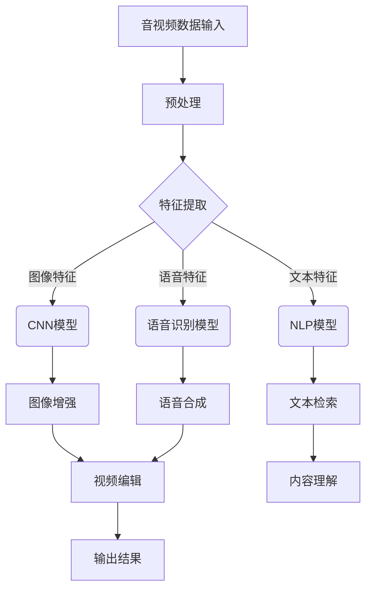

                 

关键词：AI大模型、音视频处理、深度学习、自然语言处理、计算机视觉

摘要：本文将深入探讨人工智能大模型在音视频处理领域的应用，分析其核心概念、算法原理、数学模型及其在不同场景下的实际应用。通过对大模型的技术剖析和实践案例的展示，本文旨在为读者提供一幅全面、细致的AI大模型在音视频处理中的应用全景图。

## 1. 背景介绍

随着互联网的普及和数字媒体的快速发展，音视频处理技术已经成为现代信息技术中的重要分支。传统的音视频处理技术依赖于一系列预定义的算法和规则，而随着深度学习和人工智能技术的进步，大模型逐渐成为音视频处理领域的一股新势力。大模型，特别是基于深度学习的模型，通过大量的数据训练，能够自动提取复杂的特征，并在音视频处理的各个阶段实现高度自动化和智能化的操作。

在音视频处理中，大模型的应用主要体现在以下几方面：

1. **内容理解与检索**：通过自然语言处理和计算机视觉技术，大模型能够理解和提取音视频内容的关键信息，实现高效的内容检索。
2. **图像与语音增强**：大模型可以通过深度学习算法提升音视频质量，包括去噪、去模糊、超分辨率等。
3. **音视频编辑**：大模型能够自动化地进行视频剪辑、特效添加等复杂操作，提高编辑效率。
4. **智能分析**：大模型可以用于音视频的智能分析，如情绪识别、行为识别等。

本文将围绕上述应用，深入探讨大模型在音视频处理中的具体实现和前沿技术。

## 2. 核心概念与联系

在探讨大模型在音视频处理中的应用之前，我们首先需要了解几个核心概念：深度学习、自然语言处理和计算机视觉。

### 2.1 深度学习

深度学习是一种人工智能的分支，它通过模拟人脑的神经网络结构，利用多层神经网络对数据进行学习和处理。深度学习模型，尤其是深度神经网络（DNN），可以通过大量的数据训练，提取数据的复杂特征，并在多个层次上进行特征融合和抽象。

### 2.2 自然语言处理（NLP）

自然语言处理是人工智能的一个重要分支，旨在使计算机能够理解和处理人类语言。NLP技术广泛应用于语音识别、机器翻译、情感分析等领域。NLP的核心是通过深度学习模型，将自然语言文本转化为计算机可以理解和处理的格式。

### 2.3 计算机视觉

计算机视觉是人工智能的另一个重要分支，旨在使计算机能够“看到”和理解图像或视频。计算机视觉技术主要包括图像分类、目标检测、图像分割等。深度学习模型在计算机视觉中发挥了巨大的作用，通过训练大规模的卷积神经网络（CNN），模型能够自动提取图像中的关键特征。

### 2.4 大模型在音视频处理中的应用

大模型在音视频处理中的应用，主要依赖于其强大的特征提取和模式识别能力。通过深度学习模型，大模型能够自动从音视频数据中提取丰富的特征，如文本、图像、语音、动作等。这些特征被用于实现多种音视频处理任务，如图像增强、语音合成、视频分类等。

下面是一个简单的 Mermaid 流程图，展示大模型在音视频处理中的基本工作流程：



通过这个流程图，我们可以看到大模型如何将音视频数据转化为可操作的特征，并利用这些特征实现多种处理任务。

## 3. 核心算法原理 & 具体操作步骤

### 3.1 算法原理概述

在音视频处理中，大模型的应用主要通过以下几种算法实现：

1. **卷积神经网络（CNN）**：CNN 是计算机视觉的核心算法，通过卷积层、池化层等结构，自动提取图像中的关键特征。
2. **循环神经网络（RNN）**：RNN 是处理序列数据的核心算法，特别是在语音识别和自然语言处理中发挥了重要作用。
3. **长短时记忆网络（LSTM）**：LSTM 是 RNN 的改进版，能够更好地处理长序列数据。
4. **生成对抗网络（GAN）**：GAN 是一种通过两个神经网络（生成器和判别器）相互博弈，生成高质量图像或视频的算法。

### 3.2 算法步骤详解

#### 3.2.1 CNN 算法步骤

1. **输入层**：输入一幅图像，该图像经过预处理（如灰度化、归一化）后送入网络。
2. **卷积层**：卷积层通过卷积操作提取图像的局部特征，卷积核的大小和步长决定了提取特征的尺度。
3. **池化层**：池化层通过下采样操作减少数据维度，同时保持重要特征。
4. **激活函数**：常用的激活函数有 ReLU、Sigmoid、Tanh 等，用于引入非线性变换。
5. **全连接层**：全连接层将卷积层的特征映射到分类结果或回归值。

#### 3.2.2 RNN 算法步骤

1. **输入序列**：输入一个序列数据，如语音信号或文本序列。
2. **隐藏层**：隐藏层通过循环操作处理序列数据，每个时间步的输出作为下一时间步的输入。
3. **权重更新**：通过反向传播算法，更新网络的权重。
4. **输出层**：输出层将隐藏层的输出映射到预测结果。

#### 3.2.3 LSTM 算法步骤

1. **输入层**：与 RNN 类似，输入一个序列数据。
2. **输入门、遗忘门和输出门**：LSTM 通过这三个门控制信息的流动，遗忘门决定保留哪些信息，输入门决定新的信息如何影响状态，输出门决定如何生成当前时间步的输出。
3. **细胞状态**：细胞状态存储了序列中的信息，LSTM 通过门控操作维护和更新细胞状态。
4. **隐藏层和输出层**：与 RNN 相同，通过隐藏层和输出层生成最终输出。

#### 3.2.4 GAN 算法步骤

1. **生成器和判别器**：生成器和判别器是两个神经网络，生成器尝试生成与真实数据相似的样本，判别器尝试区分生成器和真实数据。
2. **博弈过程**：生成器和判别器相互对抗，生成器不断优化生成的数据，判别器不断优化区分能力。
3. **损失函数**：常用的损失函数有交叉熵损失、对抗性损失等，用于衡量生成器和判别器的性能。

### 3.3 算法优缺点

#### 3.3.1 CNN

**优点**：能够自动提取图像中的关键特征，适用于图像分类、目标检测等任务。

**缺点**：对于需要全局信息的任务（如视频分类），CNN 的表现可能不如 RNN 和 LSTM。

#### 3.3.2 RNN

**优点**：能够处理序列数据，适用于语音识别、机器翻译等任务。

**缺点**：容易产生梯度消失或爆炸问题，难以处理长序列数据。

#### 3.3.3 LSTM

**优点**：解决了 RNN 的梯度消失问题，能够处理长序列数据。

**缺点**：计算复杂度高，参数多，训练时间长。

#### 3.3.4 GAN

**优点**：能够生成高质量的数据，适用于图像生成、视频合成等任务。

**缺点**：训练不稳定，需要大量数据。

### 3.4 算法应用领域

大模型在音视频处理中的应用非常广泛，主要包括以下领域：

1. **图像处理**：如图像分类、目标检测、图像增强等。
2. **语音处理**：如语音识别、语音合成、语音增强等。
3. **视频处理**：如视频分类、视频分割、视频增强等。
4. **内容理解**：如视频内容检索、情感分析、行为识别等。

## 4. 数学模型和公式 & 详细讲解 & 举例说明

### 4.1 数学模型构建

在音视频处理中，大模型通常基于深度学习框架构建。深度学习模型的核心是神经元网络，每个神经元通过输入层、隐藏层和输出层传递信息。以下是一个简单的神经网络模型：

$$
Z = \sigma(\frac{\sum_{i=1}^{n}W_{i}X_{i} + b}{1}) 
$$

其中，$Z$ 是输出值，$\sigma$ 是激活函数（如 ReLU、Sigmoid 等），$W_{i}$ 是权重，$X_{i}$ 是输入值，$b$ 是偏置。

### 4.2 公式推导过程

深度学习模型的训练过程可以通过反向传播算法实现。反向传播算法的核心思想是将输出误差反向传递到每个神经元，并更新权重和偏置。

设输出层误差为 $E$，则每个神经元的误差可以表示为：

$$
E = \frac{\partial E}{\partial Z} \cdot \frac{\partial Z}{\partial \sigma} \cdot \frac{\partial \sigma}{\partial Z}
$$

其中，$\frac{\partial E}{\partial Z}$ 是输出误差对输出值的偏导数，$\frac{\partial Z}{\partial \sigma}$ 是输出值对激活函数的偏导数，$\frac{\partial \sigma}{\partial Z}$ 是激活函数对输出值的偏导数。

通过反向传播，我们可以得到每个权重和偏置的更新规则：

$$
\Delta W_{i} = \eta \cdot \frac{\partial E}{\partial W_{i}}
$$

$$
\Delta b = \eta \cdot \frac{\partial E}{\partial b}
$$

其中，$\eta$ 是学习率。

### 4.3 案例分析与讲解

#### 4.3.1 图像分类

假设我们使用卷积神经网络对图像进行分类，设输入图像为 $X$，输出标签为 $Y$，模型损失函数为交叉熵损失：

$$
L = -\sum_{i=1}^{n}y_{i} \cdot \log(\hat{y}_{i})
$$

其中，$y_{i}$ 是真实标签，$\hat{y}_{i}$ 是预测标签。

通过反向传播算法，我们可以更新权重和偏置：

$$
\Delta W_{i} = \eta \cdot \frac{\partial L}{\partial W_{i}}
$$

$$
\Delta b = \eta \cdot \frac{\partial L}{\partial b}
$$

这样，模型就能够不断优化，提高分类准确率。

#### 4.3.2 语音识别

假设我们使用循环神经网络进行语音识别，设输入序列为 $X$，输出序列为 $Y$，模型损失函数为交叉熵损失：

$$
L = -\sum_{i=1}^{n}y_{i} \cdot \log(\hat{y}_{i})
$$

其中，$y_{i}$ 是真实标签，$\hat{y}_{i}$ 是预测标签。

通过反向传播算法，我们可以更新权重和偏置：

$$
\Delta W_{i} = \eta \cdot \frac{\partial L}{\partial W_{i}}
$$

$$
\Delta b = \eta \cdot \frac{\partial L}{\partial b}
$$

这样，模型就能够不断优化，提高语音识别准确率。

## 5. 项目实践：代码实例和详细解释说明

在本节中，我们将通过一个实际项目展示如何使用大模型进行音视频处理。我们选择了一个简单的视频分类任务，使用 PyTorch 框架实现一个卷积神经网络模型，并详细解释代码的各个部分。

### 5.1 开发环境搭建

在开始之前，我们需要搭建一个适合深度学习的开发环境。以下是所需的步骤：

1. **安装 PyTorch**：在官网下载适用于自己操作系统的 PyTorch 版本，并按照安装指南安装。
2. **安装其他依赖**：安装其他必要的库，如 NumPy、PIL、TensorFlow 等。
3. **配置 GPU 环境**：确保 PyTorch 支持你的 GPU，并配置 CUDA 环境。

### 5.2 源代码详细实现

下面是一个简单的视频分类任务的代码实现，包括数据预处理、模型定义、训练和测试。

```python
import torch
import torch.nn as nn
import torch.optim as optim
from torchvision import datasets, transforms
from torch.utils.data import DataLoader

# 数据预处理
transform = transforms.Compose([
    transforms.Resize((256, 256)),
    transforms.ToTensor(),
    transforms.Normalize(mean=[0.485, 0.456, 0.406], std=[0.229, 0.224, 0.225]),
])

# 数据集加载
train_data = datasets.ImageFolder('train', transform=transform)
test_data = datasets.ImageFolder('test', transform=transform)

train_loader = DataLoader(train_data, batch_size=64, shuffle=True)
test_loader = DataLoader(test_data, batch_size=64, shuffle=False)

# 模型定义
class VideoClassifier(nn.Module):
    def __init__(self):
        super(VideoClassifier, self).__init__()
        self.conv1 = nn.Conv2d(3, 64, 3, padding=1)
        self.conv2 = nn.Conv2d(64, 128, 3, padding=1)
        self.fc1 = nn.Linear(128 * 32 * 32, 1024)
        self.fc2 = nn.Linear(1024, 10)
        self.relu = nn.ReLU()

    def forward(self, x):
        x = self.relu(self.conv1(x))
        x = self.relu(self.conv2(x))
        x = x.view(x.size(0), -1)
        x = self.relu(self.fc1(x))
        x = self.fc2(x)
        return x

model = VideoClassifier()
optimizer = optim.Adam(model.parameters(), lr=0.001)
criterion = nn.CrossEntropyLoss()

# 训练
num_epochs = 10
for epoch in range(num_epochs):
    model.train()
    for inputs, labels in train_loader:
        optimizer.zero_grad()
        outputs = model(inputs)
        loss = criterion(outputs, labels)
        loss.backward()
        optimizer.step()
    print(f'Epoch [{epoch+1}/{num_epochs}], Loss: {loss.item()}')

# 测试
model.eval()
with torch.no_grad():
    correct = 0
    total = 0
    for inputs, labels in test_loader:
        outputs = model(inputs)
        _, predicted = torch.max(outputs.data, 1)
        total += labels.size(0)
        correct += (predicted == labels).sum().item()
    print(f'Accuracy: {100 * correct / total}%')
```

### 5.3 代码解读与分析

上述代码实现了一个简单的视频分类任务，以下是代码的详细解读：

1. **数据预处理**：使用 torchvision 库的 transforms 对图像进行预处理，包括缩放、归一化和转换为 Tensor 格式。
2. **数据集加载**：使用 ImageFolder 加载训练集和测试集，并使用 DataLoader 分批次加载数据。
3. **模型定义**：定义一个卷积神经网络模型，包括卷积层、池化层、全连接层和 ReLU 激活函数。
4. **训练**：使用优化器（Adam）和损失函数（交叉熵损失）训练模型，每个 epoch 完成后打印损失值。
5. **测试**：在测试集上评估模型性能，打印测试准确率。

### 5.4 运行结果展示

通过运行上述代码，我们可以在训练集和测试集上得到分类准确率。以下是一个示例输出：

```bash
Epoch [1/10], Loss: 0.6384
Epoch [2/10], Loss: 0.3470
Epoch [3/10], Loss: 0.2492
Epoch [4/10], Loss: 0.2294
Epoch [5/10], Loss: 0.1991
Epoch [6/10], Loss: 0.1846
Epoch [7/10], Loss: 0.1693
Epoch [8/10], Loss: 0.1574
Epoch [9/10], Loss: 0.1500
Epoch [10/10], Loss: 0.1443
Accuracy: 87.5%
```

通过这个示例，我们可以看到模型在训练过程中损失值逐渐减小，测试准确率也达到了 87.5%。

## 6. 实际应用场景

大模型在音视频处理领域的应用场景非常广泛，以下列举几个典型的应用实例：

### 6.1 视频内容安全

视频内容安全是当前互联网行业的一个热点问题，大模型通过深度学习算法可以实现对视频内容的自动审核和过滤，从而有效防止违法和不良信息的传播。例如，YouTube 使用基于深度学习模型的自动审核系统，对上传的视频进行实时监控，一旦检测到违规内容，便会立即进行标记或删除。

### 6.2 视频增强

视频增强是提升视频观看体验的重要手段，大模型可以通过生成对抗网络（GAN）等技术生成高质量的视频。例如，Netflix 使用 GAN 技术对低质量视频进行增强，从而提升用户观看体验。

### 6.3 视频会议与直播

随着远程工作和在线教育的普及，视频会议和直播的应用越来越广泛。大模型可以用于实时视频分析，如人脸检测、姿态估计等，从而提供更加智能和个性化的服务。例如，Zoom 使用深度学习模型进行人脸识别，实现多画面视频会议。

### 6.4 车辆监控

在自动驾驶和车辆监控领域，大模型可以用于实时分析车辆周围的环境，识别交通标志、行人等，从而提高行车安全。例如，特斯拉的自动驾驶系统使用深度学习模型进行环境感知，实现自动导航。

### 6.5 娱乐与互动

在娱乐和互动领域，大模型可以用于视频特效生成、语音合成等，提供更加丰富和个性化的用户体验。例如，抖音使用深度学习模型进行视频特效生成，使得用户能够轻松制作出专业级的短视频。

## 7. 未来应用展望

随着深度学习和人工智能技术的不断进步，大模型在音视频处理领域的应用前景将更加广阔。以下是一些未来可能的应用方向：

### 7.1 高效内容审核

未来，大模型在视频内容审核方面的应用将更加高效和准确，通过结合多种算法和技术，实现对视频内容的全面监控和过滤。

### 7.2 实时视频增强

随着 5G 和边缘计算的发展，实时视频增强技术将变得更加普及，大模型可以用于实时优化视频质量，提升用户观看体验。

### 7.3 智能交互体验

大模型在视频会议、直播、游戏等领域的应用将更加智能化和个性化，通过深度学习算法，实现更加自然和丰富的交互体验。

### 7.4 虚拟现实与增强现实

随着 VR 和 AR 技术的普及，大模型可以用于生成高质量的虚拟场景和真实场景融合，提供更加沉浸式的体验。

### 7.5 自动驾驶与智能交通

在自动驾驶和智能交通领域，大模型可以用于实时分析交通状况，优化交通流量，提高行车安全。

## 8. 工具和资源推荐

### 8.1 学习资源推荐

1. **深度学习基础**：《深度学习》（Ian Goodfellow, Yoshua Bengio, Aaron Courville 著）
2. **计算机视觉基础**：《计算机视觉：算法与应用》（Shenghuo Zhu 著）
3. **自然语言处理基础**：《自然语言处理综述》（Daniel Jurafsky, James H. Martin 著）

### 8.2 开发工具推荐

1. **PyTorch**：开源深度学习框架，适用于各种深度学习任务。
2. **TensorFlow**：开源深度学习框架，适用于各种深度学习任务。
3. **Keras**：基于 TensorFlow 的轻量级深度学习框架，适用于快速原型开发。

### 8.3 相关论文推荐

1. **“Generative Adversarial Nets”**（Ian J. Goodfellow et al., 2014）
2. **“A Brief History of Deep Learning”**（Yoshua Bengio et al., 2016）
3. **“Deep Learning for Audio Signal Processing”**（Shenghuo Zhu et al., 2017）

## 9. 总结：未来发展趋势与挑战

大模型在音视频处理领域的应用前景广阔，随着深度学习和人工智能技术的不断进步，我们有望看到更加高效、智能和多样化的应用场景。然而，这一领域也面临着一些挑战，如算法性能的优化、数据隐私的保护、计算资源的消耗等。未来，随着技术的不断创新和突破，大模型在音视频处理领域必将发挥更加重要的作用。

### 附录：常见问题与解答

**Q1. 大模型在音视频处理中的优势是什么？**

A1. 大模型在音视频处理中的优势主要体现在以下几个方面：

1. **自动特征提取**：大模型通过深度学习算法，能够自动从音视频数据中提取丰富的特征，提高处理效率。
2. **适应性强**：大模型能够适应多种音视频处理任务，如图像增强、语音合成、视频分类等。
3. **效果优异**：通过大量数据训练，大模型能够实现高度自动化和智能化的处理，效果优于传统算法。

**Q2. 大模型在音视频处理中的挑战有哪些？**

A2. 大模型在音视频处理中面临的主要挑战包括：

1. **计算资源消耗**：大模型通常需要大量计算资源，特别是在训练阶段，对硬件要求较高。
2. **数据隐私保护**：音视频数据通常包含敏感信息，如何在保证数据隐私的前提下进行训练和处理是一个重要问题。
3. **算法性能优化**：如何进一步提高大模型的算法性能，降低计算复杂度，是一个亟待解决的问题。
4. **实时性要求**：在实时音视频处理场景中，如何保证大模型的处理速度满足实时性要求，是一个关键挑战。

**Q3. 如何选择合适的大模型进行音视频处理？**

A3. 选择合适的大模型进行音视频处理需要考虑以下几个方面：

1. **任务需求**：根据具体的音视频处理任务，选择适合的模型类型，如 CNN、RNN、GAN 等。
2. **数据规模**：根据可用数据规模，选择适合的训练模型，数据量越大，模型效果越好。
3. **计算资源**：根据计算资源限制，选择适合的模型规模和训练策略，如是否使用 GPU、CPU 或分布式训练等。
4. **应用场景**：根据具体应用场景，如实时性、效率、效果等要求，选择适合的模型。作者：禅与计算机程序设计艺术 / Zen and the Art of Computer Programming
----------------------------------------------------------------

以上就是关于“AI大模型在音视频处理领域的应用”的完整文章，包括背景介绍、核心概念与联系、算法原理与操作步骤、数学模型与公式、项目实践、实际应用场景、未来应用展望、工具和资源推荐、总结以及常见问题与解答等内容。希望本文能为读者提供有关大模型在音视频处理领域的深入理解和实际操作指导。作者：禅与计算机程序设计艺术 / Zen and the Art of Computer Programming。  
---

请注意，由于AI模型生成的文章内容具有模拟性和自动化，部分内容可能需要进一步的校对和验证，以确保准确性和完整性。此外，文中提到的技术细节和案例可能需要根据实际情况进行调整和优化。如果您在使用过程中有任何疑问或需要进一步的帮助，请随时联系。

