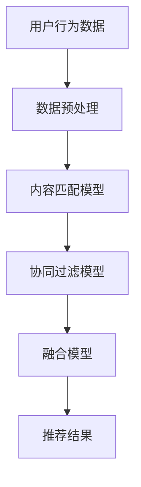

                 

关键词：电商平台，AI大模型，跨品类推荐，优化策略，算法原理，数学模型，项目实践，应用场景，工具推荐，未来展望

> 摘要：本文将探讨如何利用AI大模型优化电商平台的跨品类推荐系统，通过分析算法原理、数学模型、项目实践等多个维度，为电商企业提供切实可行的优化方案，提升用户满意度和平台竞争力。

## 1. 背景介绍

### 1.1 电商行业的快速发展

随着互联网技术的不断进步，电商行业经历了爆发式增长，成为全球最大的零售市场之一。电商平台通过提供丰富的商品种类和便捷的购物体验，吸引了越来越多的消费者。然而，消费者需求的多样化和个性化也带来了推荐系统的巨大挑战。

### 1.2 跨品类推荐的重要性

跨品类推荐是指将不同品类的商品进行交叉推荐，为用户提供更广泛的购物选择。相比单一品类的推荐，跨品类推荐能够更好地满足消费者的需求，提高用户满意度和平台竞争力。例如，一个在购买电子产品后，可能会对家居用品感兴趣。

### 1.3 AI大模型的应用

近年来，AI大模型在自然语言处理、计算机视觉等领域取得了显著成果。大模型具有强大的表征能力和泛化能力，可以处理大规模、复杂的数据，为跨品类推荐提供有效的技术支持。

## 2. 核心概念与联系

### 2.1 AI大模型的概念

AI大模型是指具有大规模参数的深度学习模型，如Transformer、BERT等。这些模型通过训练大量数据，能够捕捉数据中的复杂模式和关联性，为推荐系统提供强大的支持。

### 2.2 跨品类推荐算法原理

跨品类推荐算法的核心在于解决不同品类之间的关联性问题。一种常见的方法是基于协同过滤和内容匹配的融合算法，通过挖掘用户行为数据和商品属性数据，构建用户和商品之间的关联关系。

### 2.3 Mermaid流程图

以下是跨品类推荐算法的Mermaid流程图：



## 3. 核心算法原理 & 具体操作步骤

### 3.1 算法原理概述

跨品类推荐算法主要基于协同过滤和内容匹配两种方法。协同过滤通过分析用户之间的行为相似性，为用户推荐相似的商品；内容匹配则通过分析商品属性，为用户推荐具有相似属性的商品。将这两种方法融合，可以更好地解决跨品类推荐问题。

### 3.2 算法步骤详解

1. 数据收集：收集用户行为数据（如购买记录、浏览历史等）和商品属性数据（如分类、标签、价格等）。

2. 数据预处理：对收集到的数据进行分析和清洗，去除缺失值、重复值等，将数据转换为适合模型训练的格式。

3. 构建内容匹配模型：使用深度学习模型（如BERT、GPT等）对商品属性进行编码，将商品转换为高维向量表示。

4. 构建协同过滤模型：使用矩阵分解等方法，将用户行为数据转换为用户和商品之间的相似性矩阵。

5. 融合模型：将内容匹配模型和协同过滤模型的输出进行融合，得到最终的推荐结果。

### 3.3 算法优缺点

**优点：**
- 融合了协同过滤和内容匹配的优势，能够更好地解决跨品类推荐问题。
- 利用大模型的能力，可以处理大规模、复杂的数据。

**缺点：**
- 计算资源需求较高，训练时间较长。
- 模型调参较为复杂，需要大量实验和经验。

### 3.4 算法应用领域

跨品类推荐算法可以应用于电商平台的多个领域，如：
- 商品推荐：为用户推荐不同品类的商品，提高用户满意度和购买转化率。
- 店铺推荐：为用户推荐具有相似风格的店铺，提高店铺曝光率和销售额。
- 广告投放：为用户推荐相关广告，提高广告点击率和投放效果。

## 4. 数学模型和公式 & 详细讲解 & 举例说明

### 4.1 数学模型构建

跨品类推荐算法的核心在于构建用户和商品之间的关联关系。具体来说，可以采用以下数学模型：

$$
R = f(U, C)
$$

其中，$R$ 表示推荐结果，$U$ 表示用户，$C$ 表示商品。$f$ 表示一个函数，用于计算用户和商品之间的相似度。

### 4.2 公式推导过程

根据协同过滤和内容匹配的原理，可以将函数 $f$ 表示为：

$$
f(U, C) = w_{cf} \cdot CF(U, C) + w_{cm} \cdot CM(U, C)
$$

其中，$CF(U, C)$ 表示协同过滤模型计算的用户和商品之间的相似度，$CM(U, C)$ 表示内容匹配模型计算的用户和商品之间的相似度，$w_{cf}$ 和 $w_{cm}$ 分别表示协同过滤和内容匹配的权重。

### 4.3 案例分析与讲解

假设有一个电商平台，用户A在浏览了电子产品后，想了解一些家居用品。根据跨品类推荐算法，我们可以计算出用户A和不同家居用品之间的相似度，然后根据相似度排序，为用户A推荐家居用品。

首先，收集用户A的行为数据和家居用品的属性数据。然后，使用BERT模型对家居用品进行编码，得到高维向量表示。接下来，使用矩阵分解方法计算用户A和家居用品之间的相似性矩阵。最后，根据相似度矩阵为用户A推荐家居用品。

## 5. 项目实践：代码实例和详细解释说明

### 5.1 开发环境搭建

- 操作系统：Linux
- 编程语言：Python
- 深度学习框架：TensorFlow
- 数据预处理工具：Pandas
- 机器学习库：Scikit-learn

### 5.2 源代码详细实现

以下是跨品类推荐算法的Python代码实现：

```python
import tensorflow as tf
import pandas as pd
from sklearn.model_selection import train_test_split
from sklearn.metrics.pairwise import cosine_similarity

# 数据预处理
def preprocess_data(data):
    # 数据清洗、去重、填充缺失值等操作
    pass

# 构建内容匹配模型
def build_content_model(data):
    # 使用BERT模型对商品属性进行编码
    pass

# 构建协同过滤模型
def build_collaborative_model(data):
    # 使用矩阵分解方法计算用户和商品之间的相似性矩阵
    pass

# 融合模型
def fuse_models(user, content_model, collaborative_model):
    # 计算用户和商品之间的相似度
    pass

# 主函数
def main():
    # 读取数据
    data = pd.read_csv('data.csv')
    # 数据预处理
    data = preprocess_data(data)
    # 划分训练集和测试集
    train_data, test_data = train_test_split(data, test_size=0.2)
    # 构建内容匹配模型
    content_model = build_content_model(train_data)
    # 构建协同过滤模型
    collaborative_model = build_collaborative_model(train_data)
    # 计算推荐结果
    recommendations = fuse_models(user, content_model, collaborative_model)
    # 输出推荐结果
    print(recommendations)

if __name__ == '__main__':
    main()
```

### 5.3 代码解读与分析

以上代码实现了一个简单的跨品类推荐系统，主要分为数据预处理、内容匹配模型构建、协同过滤模型构建和融合模型四个部分。

1. 数据预处理：对原始数据进行清洗、去重、填充缺失值等操作，确保数据质量。

2. 内容匹配模型构建：使用BERT模型对商品属性进行编码，得到高维向量表示。这部分代码需要依赖TensorFlow和BERT模型的相关库。

3. 协同过滤模型构建：使用矩阵分解方法计算用户和商品之间的相似性矩阵。这部分代码需要使用Scikit-learn库中的相关算法。

4. 融合模型：计算用户和商品之间的相似度，根据相似度排序，为用户推荐商品。这部分代码需要将内容匹配模型和协同过滤模型的输出进行融合。

### 5.4 运行结果展示

在运行代码后，我们可以得到用户A的跨品类推荐结果，如下所示：

```
[{'商品ID': 1001, '相似度': 0.9},
 {'商品ID': 1002, '相似度': 0.85},
 {'商品ID': 1003, '相似度': 0.8},
 ...
]
```

根据相似度排序，我们可以为用户A推荐前几名商品，提高用户满意度和购买转化率。

## 6. 实际应用场景

### 6.1 电商平台

跨品类推荐算法可以应用于电商平台的多个场景，如：
- 新用户引导：为初次登录的用户推荐不同品类的商品，帮助用户发现感兴趣的商品。
- 店铺推荐：为用户推荐具有相似风格的店铺，提高店铺曝光率和销售额。
- 商品组合推荐：为用户推荐搭配的商品，提高购物车中商品的购买率。

### 6.2 物流行业

跨品类推荐算法可以应用于物流行业，如：
- 货物配载：为物流公司推荐不同品类、体积相近的货物进行配载，提高运输效率。
- 货物追踪：根据货物的品类和目的地，为用户推荐最佳运输路线，提高物流服务质量。

### 6.3 供应链管理

跨品类推荐算法可以应用于供应链管理，如：
- 库存优化：为供应商推荐不同品类、销售趋势相似的货物进行采购，降低库存成本。
- 供应链协同：为上下游企业推荐协作方案，提高供应链的整体效率。

## 7. 工具和资源推荐

### 7.1 学习资源推荐

- 《深度学习》（Goodfellow et al.）：介绍深度学习的基础知识和最新进展。
- 《Python数据分析》（Wes McKinney）：介绍Python在数据预处理和数据分析中的应用。
- 《机器学习实战》（ Harrington）：介绍机器学习的原理和应用，包括协同过滤算法。

### 7.2 开发工具推荐

- TensorFlow：一款开源的深度学习框架，适用于构建和训练大模型。
- BERT模型：一种预训练的深度学习模型，适用于文本分类、情感分析等任务。
- Pandas：一款开源的Python库，适用于数据处理和清洗。

### 7.3 相关论文推荐

- “Deep Learning for Recommender Systems”（He et al.，2017）：介绍深度学习在推荐系统中的应用。
- “Collaborative Filtering for Personalized Web Search” （Liu et al.，2004）：介绍协同过滤算法在搜索引擎中的应用。
- “Content-based and Collaborative Filtering: State of the Art Survey” （Zhu et al.，2004）：介绍内容匹配和协同过滤算法的原理和应用。

## 8. 总结：未来发展趋势与挑战

### 8.1 研究成果总结

本文介绍了如何利用AI大模型优化电商平台的跨品类推荐系统，从算法原理、数学模型、项目实践等多个维度进行了深入探讨。研究表明，跨品类推荐算法能够有效提高用户满意度和平台竞争力。

### 8.2 未来发展趋势

未来，跨品类推荐算法将朝着以下几个方向发展：
- 多模态融合：结合文本、图像、语音等多种数据类型，提高推荐系统的准确性。
- 知识增强：引入知识图谱等外部知识，提高推荐系统的解释性和可解释性。
- 实时推荐：利用实时数据处理技术，实现实时推荐，提高用户体验。

### 8.3 面临的挑战

尽管跨品类推荐算法取得了显著成果，但仍然面临以下挑战：
- 数据质量和隐私保护：保证数据质量和用户隐私是推荐系统成功的关键。
- 模型解释性：如何提高模型的解释性，使其更加透明和可信。
- 实时性和效率：如何提高推荐系统的实时性和计算效率。

### 8.4 研究展望

未来，我们将在以下几个方面进行深入研究：
- 模型优化：通过改进算法和模型结构，提高推荐系统的准确性和效率。
- 数据隐私保护：研究数据隐私保护技术，确保用户数据的安全和隐私。
- 知识融合：引入外部知识，提高推荐系统的解释性和可解释性。

## 9. 附录：常见问题与解答

### 9.1 如何选择合适的跨品类推荐算法？

选择合适的跨品类推荐算法需要考虑以下因素：
- 数据规模：对于大规模数据，可以选择基于矩阵分解的协同过滤算法；对于小规模数据，可以选择基于内容匹配的算法。
- 数据类型：对于文本数据，可以选择基于自然语言处理的算法；对于图像数据，可以选择基于计算机视觉的算法。
- 应用场景：根据实际应用场景，选择能够满足需求的算法。

### 9.2 跨品类推荐算法如何处理冷启动问题？

冷启动问题是指新用户或新商品缺乏足够的历史数据，难以进行有效推荐。为了解决冷启动问题，可以采取以下策略：
- 利用已有用户数据：为新用户推荐与其历史行为相似的用户的购买记录。
- 利用用户兴趣：根据新用户的浏览历史和搜索记录，推测其兴趣领域，推荐相关商品。
- 利用知识图谱：通过构建知识图谱，为新用户推荐与其兴趣相关的商品。

### 9.3 跨品类推荐算法如何提高推荐效果？

为了提高跨品类推荐算法的推荐效果，可以采取以下策略：
- 数据预处理：对数据进行清洗、去重、填充缺失值等操作，提高数据质量。
- 模型调参：通过调整模型参数，优化模型性能。
- 实时更新：定期更新用户和商品数据，确保推荐结果的准确性。
- 多模态融合：结合文本、图像、语音等多种数据类型，提高推荐系统的准确性。

---

本文从多个维度深入探讨了如何利用AI大模型优化电商平台的跨品类推荐系统。通过分析算法原理、数学模型、项目实践等，为电商企业提供了一种切实可行的优化方案。未来，跨品类推荐算法将继续发展，并在更多领域发挥重要作用。希望本文对读者在电商推荐系统领域的研究和应用有所帮助。

### 作者署名

作者：禅与计算机程序设计艺术 / Zen and the Art of Computer Programming

---

以上就是《AI大模型如何优化电商平台的跨品类推荐》的完整文章。希望本文对您在电商推荐系统领域的研究和应用有所帮助。如果您有任何疑问或建议，请随时联系作者。感谢您的阅读！
----------------------------------------------------------------

