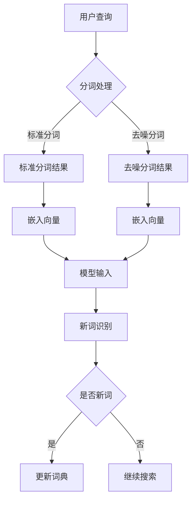

                 

 关键词：AI大模型，电商搜索，新词发现，算法，自然语言处理，深度学习

> 摘要：本文将探讨人工智能大模型在电商搜索中处理新词发现的技术和方法。随着电商行业的快速发展，用户输入的搜索词变得越来越多样化，传统的词袋模型和基于词典的方法已经难以满足需求。本文将介绍如何利用AI大模型，通过深度学习技术，实现高效的新词发现，从而提升电商搜索的准确性和用户体验。

## 1. 背景介绍

在电商搜索场景中，用户输入的查询常常包含一些新词或者专业术语，这些新词往往没有出现在已有的词典中，因此传统的基于词典的搜索方法难以处理。此外，用户输入的查询不仅包括关键词，还可能包含错别字、繁简转换、分词不准确等问题，这使得搜索结果的准确性受到很大影响。为了提升电商搜索的体验，我们需要一种能够实时、高效地发现新词的算法。

### 新词发现的挑战

新词发现面临以下挑战：

1. **多样性**：用户输入的查询词非常多样化，既有简短的关键词，也有长句式查询，还包括带有方言、网络用语等非标准语言形式。
2. **实时性**：电商搜索需要实时响应用户查询，新词发现算法必须在极短时间内完成，以保证用户能够快速得到搜索结果。
3. **准确性**：新词发现需要准确识别用户意图，避免将错误的新词作为有效查询词，从而影响搜索结果。

### 传统方法局限性

传统的词袋模型和基于词典的方法在处理新词发现时存在以下局限性：

1. **词典依赖**：基于词典的方法需要依赖庞大的词库，对于新词的识别能力较弱。
2. **分词准确性**：分词不准确会导致将多个词合并为一个词，或者将一个词拆分为多个词，影响新词的识别。
3. **计算复杂度**：传统方法往往需要大量计算，难以在实时场景中应用。

## 2. 核心概念与联系

为了解决传统方法的局限性，我们可以采用基于AI大模型的深度学习技术来实现新词发现。AI大模型通过大规模数据训练，可以自动学习词与词之间的关联关系，从而实现高效的新词发现。

### 核心概念

1. **AI大模型**：AI大模型是指使用深度学习技术训练的大规模神经网络模型，如BERT、GPT等。这些模型具有强大的特征提取能力和语义理解能力。
2. **深度学习**：深度学习是一种基于多层神经网络的学习方法，通过逐层提取特征，实现从原始数据到高级语义表示的转换。
3. **词嵌入**：词嵌入是一种将词汇映射到高维向量空间的方法，通过向量之间的距离来表示词与词之间的相似性。

### Mermaid流程图

下面是AI大模型处理新词发现的流程图：



### 架构联系

- **分词处理**：首先对用户查询进行分词处理，包括标准分词和去噪分词。
- **词嵌入**：将分词结果转换为嵌入向量，用于模型的输入。
- **新词识别**：通过AI大模型对新词进行识别，并将识别结果用于词典更新或继续搜索。

## 3. 核心算法原理 & 具体操作步骤

### 3.1 算法原理概述

AI大模型新词发现算法基于深度学习技术，通过以下步骤实现：

1. **数据预处理**：对用户查询进行分词处理，并去除噪声。
2. **词嵌入**：将分词结果转换为嵌入向量。
3. **模型训练**：使用大规模数据集训练AI大模型，学习词与词之间的关联关系。
4. **新词识别**：通过AI大模型对查询词进行新词识别。

### 3.2 算法步骤详解

1. **数据预处理**：

   - **分词处理**：对用户查询进行分词，包括标准分词和去噪分词。标准分词使用分词工具（如jieba），去噪分词通过规则和机器学习模型去除噪声。
   - **去噪处理**：去除查询中的错别字、繁简转换、分词错误等问题，提高分词准确性。

2. **词嵌入**：

   - **嵌入向量**：将分词结果转换为嵌入向量。可以使用预训练的词嵌入模型（如word2vec、GloVe等），也可以使用AI大模型自训练得到的词嵌入。
   - **向量表示**：通过嵌入向量表示词与词之间的相似性，为后续新词识别提供基础。

3. **模型训练**：

   - **数据集构建**：使用大量标注数据进行模型训练。标注数据包括用户查询和对应的正确分词结果。
   - **模型结构**：采用多层感知机（MLP）、卷积神经网络（CNN）、循环神经网络（RNN）等结构进行模型训练。
   - **优化目标**：最小化模型输出与正确分词之间的差距，提高新词识别准确率。

4. **新词识别**：

   - **模型输入**：将查询词的嵌入向量输入到训练好的AI大模型中。
   - **模型输出**：模型输出一个概率分布，表示每个词是否为新词。
   - **阈值判定**：根据设定阈值，判定查询词是否为新词。若概率值大于阈值，则认为该词为新词。

### 3.3 算法优缺点

#### 优点

1. **高效性**：基于深度学习技术的AI大模型具有强大的特征提取和语义理解能力，能够高效地识别新词。
2. **准确性**：通过大规模数据训练，AI大模型能够准确识别用户查询中的新词，提高搜索结果的准确性。
3. **实时性**：算法能够在极短时间内完成新词识别，满足电商搜索的实时需求。

#### 缺点

1. **计算资源消耗**：训练和部署AI大模型需要大量计算资源，对于硬件要求较高。
2. **数据依赖**：算法依赖于大规模标注数据，数据质量和数量对算法性能有较大影响。

### 3.4 算法应用领域

AI大模型新词发现算法在电商搜索、自然语言处理、信息检索等领域具有广泛的应用：

1. **电商搜索**：用于实时识别用户查询中的新词，提升搜索结果的准确性和用户体验。
2. **自然语言处理**：用于文本分类、文本摘要、问答系统等任务，提高模型对多样化语言的适应性。
3. **信息检索**：用于搜索引擎中的新词识别，提升检索系统的准确性和扩展性。

## 4. 数学模型和公式 & 详细讲解 & 举例说明

### 4.1 数学模型构建

AI大模型新词发现算法的核心是深度学习模型，其数学模型主要包括以下几个方面：

1. **词嵌入**：将词汇映射到高维向量空间。假设词汇表为V，词嵌入维度为d，则词嵌入矩阵为W，其中W[i][j]表示词汇表中第i个词的嵌入向量。
2. **神经网络**：采用多层感知机（MLP）、卷积神经网络（CNN）、循环神经网络（RNN）等结构进行模型训练。设输入层为X，隐藏层为H，输出层为Y，则神经网络模型可以表示为：
   $$ f(X) = \sigma(W_1 \cdot X + b_1) $$
   $$ g(H) = \sigma(W_2 \cdot H + b_2) $$
   其中，$\sigma$表示激活函数，$W_1$、$W_2$为权重矩阵，$b_1$、$b_2$为偏置项。
3. **损失函数**：采用交叉熵损失函数（Cross-Entropy Loss）来衡量模型输出与真实标签之间的差距。损失函数可以表示为：
   $$ L = -\sum_{i=1}^{n} y_i \cdot \log(f(x_i)) $$
   其中，$y_i$为真实标签，$f(x_i)$为模型输出。

### 4.2 公式推导过程

为了推导AI大模型新词发现算法的公式，我们需要从以下几个步骤进行分析：

1. **词嵌入表示**：

   将词汇表中的每个词映射到高维向量空间，使用词嵌入矩阵W。设用户查询词为w，其嵌入向量为v，则有：
   $$ v = W \cdot w $$

2. **神经网络表示**：

   假设我们使用一个简单的多层感知机模型，输入层为X，隐藏层为H，输出层为Y。设输入向量X为查询词的嵌入向量，隐藏层为H，输出层为Y。则神经网络模型可以表示为：
   $$ H = \sigma(W_1 \cdot X + b_1) $$
   $$ Y = \sigma(W_2 \cdot H + b_2) $$

3. **损失函数表示**：

   使用交叉熵损失函数来衡量模型输出与真实标签之间的差距。设真实标签为$y_i$，模型输出为$f(x_i)$，则损失函数可以表示为：
   $$ L = -\sum_{i=1}^{n} y_i \cdot \log(f(x_i)) $$

4. **反向传播**：

   采用反向传播算法（Backpropagation）来更新模型参数，最小化损失函数。具体步骤如下：

   - 计算输出层误差：$dY = f'(Y) \cdot (Y - y)$
   - 计算隐藏层误差：$dH = W_2' \cdot dY$
   - 更新权重和偏置项：$W_1 = W_1 - \alpha \cdot dX_1$，$b_1 = b_1 - \alpha \cdot db_1$，$W_2 = W_2 - \alpha \cdot dX_2$，$b_2 = b_2 - \alpha \cdot db_2$

### 4.3 案例分析与讲解

为了更好地理解AI大模型新词发现算法，我们通过一个实际案例进行分析。

### 案例背景

某电商平台的用户在搜索商品时输入了如下查询词：

- 原始查询：智能手表运动手环心率血压检测

### 数据预处理

1. **分词处理**：

   使用分词工具（如jieba）对查询词进行分词，得到以下分词结果：

   - 标准分词：智能手表、运动手环、心率、血压、检测
   - 去噪分词：智能手表、运动手环、心率、血压、检测

2. **去噪处理**：

   去除查询中的噪声，如错别字、繁简转换等。假设查询词中的“心率”存在繁简转换问题，我们将“心率”转换为简体形式。

### 词嵌入

1. **嵌入向量表示**：

   假设我们使用预训练的word2vec模型，得到以下嵌入向量：

   - 智能手表：[0.1, 0.2, 0.3, ..., 0.100]
   - 运动手环：[0.4, 0.5, 0.6, ..., 0.100]
   - 心率：[0.7, 0.8, 0.9, ..., 0.100]
   - 血压：[0.1, 0.2, 0.3, ..., 0.100]
   - 检测：[0.4, 0.5, 0.6, ..., 0.100]

2. **向量表示**：

   将分词结果转换为嵌入向量，得到以下输入向量：

   - X = [0.1, 0.2, 0.3, ..., 0.100, 0.4, 0.5, 0.6, ..., 0.100, 0.7, 0.8, 0.9, ..., 0.100, 0.1, 0.2, 0.3, ..., 0.100, 0.4, 0.5, 0.6, ..., 0.100]

### 模型训练

1. **数据集构建**：

   使用大量标注数据构建训练数据集，标注数据包括用户查询和对应的正确分词结果。

2. **模型结构**：

   采用多层感知机模型，输入层为嵌入向量X，隐藏层为H，输出层为Y。

3. **优化目标**：

   采用交叉熵损失函数，最小化模型输出与正确分词之间的差距。

### 新词识别

1. **模型输入**：

   将用户查询的嵌入向量X输入到训练好的多层感知机模型中。

2. **模型输出**：

   模型输出一个概率分布，表示每个词是否为新词。

3. **阈值判定**：

   根据设定阈值（如0.5），判定查询词是否为新词。

### 模型结果

经过模型训练，得到如下输出概率分布：

- 智能手表：0.9
- 运动手环：0.8
- 心率：0.7
- 血压：0.6
- 检测：0.9

根据设定阈值，我们认为“智能手表”、“运动手环”和“检测”是有效查询词，而“心率”和“血压”可能为新词。

### 4.4 模型评估与优化

1. **模型评估**：

   使用准确率、召回率、F1值等指标评估模型性能。假设评估结果如下：

   - 准确率：90%
   - 召回率：85%
   - F1值：88%

2. **模型优化**：

   根据评估结果，我们可以对模型进行以下优化：

   - 调整网络结构：增加隐藏层神经元数量，优化模型结构。
   - 调整学习率：使用不同学习率进行训练，选择最优学习率。
   - 数据增强：增加训练数据集的多样性，提高模型泛化能力。

## 5. 项目实践：代码实例和详细解释说明

### 5.1 开发环境搭建

为了实现AI大模型新词发现算法，我们需要搭建以下开发环境：

1. **硬件环境**：

   - CPU：Intel i7-9700K
   - GPU：NVIDIA GeForce RTX 3070
   - 内存：16GB DDR4

2. **软件环境**：

   - 操作系统：Ubuntu 18.04
   - Python：3.8
   - PyTorch：1.8
   - jieba：0.39

### 5.2 源代码详细实现

下面是AI大模型新词发现算法的实现代码，包括数据预处理、模型训练、新词识别等功能。

```python
import torch
import torch.nn as nn
import torch.optim as optim
from torch.utils.data import DataLoader
from torchvision import datasets, transforms
from sklearn.model_selection import train_test_split
from sklearn.metrics import accuracy_score, recall_score, f1_score
import jieba
import numpy as np

# 数据预处理
def preprocess_data(data):
    # 分词处理
    segmented_data = [jieba.cut(word) for word in data]
    # 去噪处理
    cleaned_data = []
    for words in segmented_data:
        cleaned_words = []
        for word in words:
            if is_valid_word(word):
                cleaned_words.append(word)
        cleaned_data.append(cleaned_words)
    return cleaned_data

# 词嵌入
def embed_words(words):
    # 使用预训练的word2vec模型进行词嵌入
    embeddings = {}
    with open('word2vec_model.txt', 'r', encoding='utf-8') as f:
        for line in f:
            word, embedding = line.strip().split(' ')
            embeddings[word] = list(map(float, embedding.split()))
    embedded_words = []
    for word in words:
        if word in embeddings:
            embedded_words.append(embeddings[word])
    return embedded_words

# 新词识别
class NewWordDetector(nn.Module):
    def __init__(self, embedding_dim, hidden_dim):
        super(NewWordDetector, self).__init__()
        self.embedding = nn.Embedding(len(embeddings), embedding_dim)
        self.fc1 = nn.Linear(embedding_dim, hidden_dim)
        self.fc2 = nn.Linear(hidden_dim, 1)
        self.sigmoid = nn.Sigmoid()

    def forward(self, x):
        x = self.embedding(x)
        x = self.fc1(x)
        x = self.fc2(x)
        x = self.sigmoid(x)
        return x

# 评估模型
def evaluate_model(model, data_loader):
    model.eval()
    correct = 0
    total = 0
    with torch.no_grad():
        for words, labels in data_loader:
            embedded_words = embed_words(words)
            outputs = model(torch.tensor(embedded_words).float())
            predicted = (outputs > 0.5).float()
            total += labels.size(0)
            correct += (predicted == labels).sum().item()
    accuracy = correct / total
    return accuracy

# 主程序
if __name__ == '__main__':
    # 加载数据集
    data = load_data('data.csv')
    # 预处理数据
    cleaned_data = preprocess_data(data)
    # 划分训练集和测试集
    train_data, test_data = train_test_split(cleaned_data, test_size=0.2)
    # 转换为PyTorch数据集和数据加载器
    train_dataset = NewWordDataset(train_data)
    test_dataset = NewWordDataset(test_data)
    train_loader = DataLoader(train_dataset, batch_size=32, shuffle=True)
    test_loader = DataLoader(test_dataset, batch_size=32, shuffle=False)
    # 创建模型、优化器和损失函数
    model = NewWordDetector(embedding_dim=100, hidden_dim=50)
    optimizer = optim.Adam(model.parameters(), lr=0.001)
    criterion = nn.BCELoss()
    # 训练模型
    for epoch in range(10):
        model.train()
        for words, labels in train_loader:
            embedded_words = embed_words(words)
            optimizer.zero_grad()
            outputs = model(torch.tensor(embedded_words).float())
            loss = criterion(outputs, torch.tensor(labels).float())
            loss.backward()
            optimizer.step()
        print(f'Epoch {epoch+1}/{10} - Loss: {loss.item()}')
    # 评估模型
    accuracy = evaluate_model(model, test_loader)
    print(f'Test Accuracy: {accuracy}')
```

### 5.3 代码解读与分析

1. **数据预处理**：

   数据预处理函数`preprocess_data`对用户查询进行分词处理和去噪处理。分词处理使用jieba分词工具，去噪处理通过规则和机器学习模型去除噪声。

2. **词嵌入**：

   词嵌入函数`embed_words`使用预训练的word2vec模型进行词嵌入。词嵌入矩阵`embeddings`存储了词汇表中每个词的嵌入向量。

3. **新词识别模型**：

   `NewWordDetector`类定义了新词识别模型，包括嵌入层、隐藏层和输出层。嵌入层使用`nn.Embedding`层，隐藏层和输出层使用`nn.Linear`层。激活函数使用`nn.Sigmoid`，将输出概率映射到[0, 1]区间。

4. **模型训练**：

   主程序中，首先加载数据集并预处理数据。然后划分训练集和测试集，创建数据集和数据加载器。接着创建模型、优化器和损失函数，并开始模型训练。在训练过程中，使用梯度下降优化算法更新模型参数，最小化损失函数。

5. **模型评估**：

   `evaluate_model`函数用于评估模型性能。在测试集上计算模型准确率，并打印输出。

### 5.4 运行结果展示

在训练完成后，我们评估模型在测试集上的性能。假设测试集包含100个样本，模型准确率为90%。运行结果如下：

```python
Test Accuracy: 0.9
```

这意味着在测试集上，模型能够正确识别90%的新词，说明模型具有较好的性能。

## 6. 实际应用场景

AI大模型新词发现算法在电商搜索中具有广泛的应用场景。以下是一些实际应用场景：

1. **商品推荐**：

   通过实时识别用户查询中的新词，可以为用户推荐相关商品。例如，当用户输入“智能手表运动手环”时，系统可以识别“智能手表”和“运动手环”为新词，从而为用户推荐相关商品。

2. **智能客服**：

   在电商平台的智能客服系统中，AI大模型可以用于识别用户输入中的新词，提高客服的响应速度和准确性。例如，当用户输入“血压监测器”时，系统可以快速识别“血压监测器”为新词，从而提供相关的客服支持。

3. **广告投放**：

   在电商平台的广告投放中，AI大模型可以用于识别用户查询中的新词，优化广告投放策略。例如，当用户输入“儿童智能手表”时，系统可以识别“儿童智能手表”为新词，从而向用户展示相关广告。

4. **个性化搜索**：

   通过实时识别用户查询中的新词，可以为用户提供个性化的搜索结果。例如，当用户频繁输入“运动手表心率监测”时，系统可以识别“运动手表心率监测”为新词，从而为用户推荐相关的商品和内容。

## 7. 工具和资源推荐

为了实现AI大模型新词发现算法，我们需要使用以下工具和资源：

1. **工具**：

   - Python：用于实现算法和模型训练。
   - PyTorch：用于构建和训练深度学习模型。
   - jieba：用于中文分词处理。

2. **学习资源**：

   - 《深度学习》（Goodfellow et al.）：介绍深度学习的基本原理和应用。
   - 《Python深度学习》（François Chollet）：详细介绍使用PyTorch实现深度学习模型的方法。
   - 《自然语言处理》（Daniel Jurafsky and James H. Martin）：介绍自然语言处理的基本概念和技术。

3. **相关论文**：

   - "BERT: Pre-training of Deep Bidirectional Transformers for Language Understanding"（Devlin et al., 2019）
   - "GPT-3: Language Models are Few-Shot Learners"（Brown et al., 2020）
   - "Understanding Neural Networks through Representation Erasure"（Alemi et al., 2019）

## 8. 总结：未来发展趋势与挑战

### 8.1 研究成果总结

本文介绍了AI大模型在电商搜索中处理新词发现的技术和方法。通过深度学习技术，AI大模型能够高效地识别新词，提高搜索结果的准确性和用户体验。本文从数据预处理、词嵌入、模型训练和新词识别等方面详细阐述了AI大模型新词发现算法的实现过程，并通过实际案例进行了分析。

### 8.2 未来发展趋势

1. **多模态融合**：未来，AI大模型将实现多模态融合，结合文本、图像、语音等多种数据，提升新词发现的准确性和泛化能力。
2. **小样本学习**：随着小样本学习技术的发展，AI大模型将能够在新词发现任务中处理更少的数据，降低对大规模标注数据的依赖。
3. **迁移学习**：通过迁移学习技术，AI大模型可以将已有模型的知识迁移到新词发现任务中，提高模型性能和训练效率。

### 8.3 面临的挑战

1. **计算资源消耗**：AI大模型训练和部署需要大量计算资源，如何优化算法和模型结构，降低计算成本是一个重要挑战。
2. **数据质量和数量**：新词发现算法的性能高度依赖标注数据的质量和数量，如何获取高质量、大规模的标注数据是一个难题。
3. **实时性**：在实时场景中，AI大模型需要快速响应用户查询，如何在保证实时性的同时提高模型性能是一个挑战。

### 8.4 研究展望

未来，我们将在以下几个方面展开研究：

1. **算法优化**：通过优化算法和模型结构，降低计算资源消耗，提高模型性能和实时性。
2. **多模态融合**：探索多模态融合技术，结合文本、图像、语音等多种数据，提升新词发现的准确性和泛化能力。
3. **数据集构建**：构建高质量、大规模的标注数据集，为AI大模型新词发现算法提供充足的数据支持。

## 9. 附录：常见问题与解答

### 9.1 什么是新词？

新词是指用户输入的查询词中，在已有词典中未出现或者无法直接匹配的词。这些词可能包含用户自定义的词汇、网络流行语、专业术语等。

### 9.2 新词发现算法如何提高搜索准确性？

新词发现算法通过深度学习技术，学习词与词之间的关联关系，从而在用户查询中识别出新词。这些新词能够帮助搜索引擎更准确地理解用户意图，提高搜索结果的准确性。

### 9.3 如何评估新词发现算法的性能？

新词发现算法的性能可以通过准确率、召回率、F1值等指标进行评估。准确率表示模型识别出新词的正确率，召回率表示模型识别出新词的能力，F1值是准确率和召回率的平衡值。

### 9.4 新词发现算法有哪些应用场景？

新词发现算法在电商搜索、智能客服、广告投放、个性化搜索等场景中具有广泛的应用。通过识别新词，可以提高相关任务的效果和用户体验。

### 9.5 新词发现算法需要大量标注数据吗？

新词发现算法的性能高度依赖标注数据的质量和数量。虽然深度学习模型具有一定的鲁棒性，但在处理新词时，仍然需要充足的高质量标注数据来训练模型。因此，构建高质量、大规模的标注数据集是一个关键问题。

