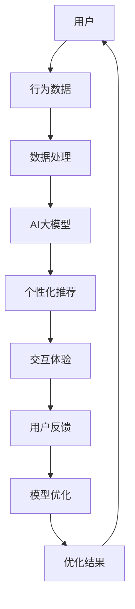

                 

关键词：AI大模型，电商平台，AR/VR购物，用户体验，增强现实，虚拟现实，个性化推荐，图像识别，自然语言处理，深度学习

摘要：随着人工智能技术的飞速发展，AI大模型在电商平台的AR/VR购物体验中发挥了重要作用。本文将探讨AI大模型如何提升电商平台的AR/VR购物体验，包括核心概念、算法原理、数学模型、实际应用和未来展望等内容。

## 1. 背景介绍

随着科技的发展，增强现实（AR）和虚拟现实（VR）技术逐渐渗透到各个领域，其中电商平台作为重要的商业场景，也在积极探索如何利用AR/VR技术提升购物体验。传统电商购物模式主要依赖于静态图片和文字描述，而AR/VR技术可以为用户提供更加直观、互动的购物体验。然而，目前AR/VR购物体验仍存在诸多挑战，如交互不流畅、内容丰富度不足、个性化推荐不准确等。

为了解决这些问题，人工智能（AI）大模型的应用逐渐成为研究热点。AI大模型具有强大的数据处理和智能分析能力，能够为AR/VR购物体验提供有力支持。本文将探讨AI大模型在电商平台AR/VR购物体验中的应用，包括核心概念、算法原理、数学模型、实际应用和未来展望等方面。

### 1.1 AI大模型的定义与特点

AI大模型是指具有大规模参数和复杂结构的深度学习模型，通常包括自然语言处理（NLP）、计算机视觉、语音识别等领域的模型。与传统的机器学习模型相比，AI大模型具有以下特点：

1. **规模大**：AI大模型通常包含数十亿甚至千亿级别的参数，能够处理大规模数据集。
2. **结构复杂**：AI大模型采用多层神经网络结构，具有强大的层次化特征提取能力。
3. **自学习能力**：AI大模型通过大量数据进行训练，能够不断优化模型性能，实现自我进化。
4. **泛化能力强**：AI大模型能够处理多种类型的数据，具有较好的跨领域应用能力。

### 1.2 电商平台AR/VR购物体验的挑战

1. **交互不流畅**：传统的AR/VR技术往往存在交互延迟，影响用户体验。
2. **内容丰富度不足**：AR/VR购物内容往往局限于商品展示，难以提供丰富的购物信息。
3. **个性化推荐不准确**：传统推荐系统难以根据用户行为和偏好进行精准推荐。
4. **数据隐私和安全问题**：AR/VR购物涉及大量用户数据，存在隐私泄露和安全风险。

## 2. 核心概念与联系

在探讨AI大模型如何提升电商平台AR/VR购物体验之前，我们首先需要了解一些核心概念和联系。以下是一个关于AI大模型在电商平台AR/VR购物体验中的应用的Mermaid流程图：



### 2.1 用户

用户是电商平台AR/VR购物体验的核心，他们的行为数据是AI大模型训练和优化的基础。

### 2.2 行为数据

行为数据包括用户的浏览记录、购买记录、搜索记录等，这些数据可以用于分析用户偏好和需求。

### 2.3 数据处理

数据处理包括数据清洗、数据预处理和特征提取等步骤，为AI大模型训练提供高质量的数据。

### 2.4 AI大模型

AI大模型包括自然语言处理（NLP）、计算机视觉（CV）等领域的模型，能够对用户行为数据进行智能分析和处理。

### 2.5 个性化推荐

基于用户行为数据，AI大模型可以生成个性化的购物推荐，提升用户购物体验。

### 2.6 交互体验

AI大模型可以优化AR/VR购物交互体验，如降低交互延迟、提供丰富的购物信息等。

### 2.7 用户反馈

用户反馈可以用于评估AI大模型的效果，并作为模型优化的重要依据。

### 2.8 模型优化

基于用户反馈，AI大模型可以不断优化自身性能，提高购物体验。

### 2.9 优化结果

优化结果将反馈到用户端，进一步提升AR/VR购物体验。

## 3. 核心算法原理 & 具体操作步骤

### 3.1 算法原理概述

AI大模型在电商平台AR/VR购物体验中的应用主要包括以下几个方面：

1. **图像识别**：通过计算机视觉技术对用户上传的商品图片进行识别和分析，提取关键特征。
2. **自然语言处理**：通过NLP技术对用户评论、描述等进行情感分析、文本分类等操作。
3. **个性化推荐**：基于用户行为数据和商品特征，生成个性化的购物推荐。
4. **交互优化**：通过优化算法降低AR/VR购物交互延迟，提升用户购物体验。

### 3.2 算法步骤详解

1. **数据收集与预处理**：收集电商平台用户行为数据、商品数据等，并进行数据清洗、去噪和预处理。
2. **特征提取**：对预处理后的数据提取关键特征，如商品类别、用户兴趣、商品评价等。
3. **模型训练**：利用提取到的特征训练AI大模型，如卷积神经网络（CNN）、循环神经网络（RNN）等。
4. **模型评估与优化**：通过交叉验证等方法评估模型性能，并进行优化。
5. **应用部署**：将训练好的模型部署到电商平台，为用户提供个性化的购物推荐和交互优化。

### 3.3 算法优缺点

**优点**：

1. **高效性**：AI大模型能够处理大规模数据，提高数据处理和推荐的效率。
2. **准确性**：通过深度学习算法，AI大模型可以提取到更丰富的特征，提高推荐和交互的准确性。
3. **个性化**：AI大模型可以根据用户行为和偏好生成个性化的购物推荐，提升用户体验。

**缺点**：

1. **数据隐私**：AI大模型需要大量用户数据进行分析，存在数据隐私和安全风险。
2. **计算资源**：训练和部署AI大模型需要大量的计算资源，对硬件要求较高。
3. **依赖性**：电商平台过度依赖AI大模型可能导致用户体验单一，缺乏多样性。

### 3.4 算法应用领域

AI大模型在电商平台AR/VR购物体验中的应用主要涉及以下几个方面：

1. **商品推荐**：基于用户行为和偏好生成个性化的商品推荐。
2. **交互优化**：通过优化算法降低AR/VR购物交互延迟，提升用户购物体验。
3. **广告投放**：基于用户兴趣和购买记录进行精准广告投放。
4. **内容生成**：通过AI大模型生成丰富的AR/VR购物内容，如商品展示、场景渲染等。

## 4. 数学模型和公式 & 详细讲解 & 举例说明

### 4.1 数学模型构建

在AI大模型中，常见的数学模型包括卷积神经网络（CNN）、循环神经网络（RNN）、长短时记忆网络（LSTM）等。以下以CNN为例，介绍其数学模型构建过程：

$$
\begin{aligned}
h_{t} &= \sigma(W_{h} \cdot [h_{t-1}; x_{t}]+b_{h}) \\
a_{t} &= \sigma(W_{a} \cdot [h_{t-1}; x_{t}]+b_{a}) \\
\end{aligned}
$$

其中，$h_{t}$表示第t时刻的隐藏状态，$x_{t}$表示第t时刻的输入特征，$\sigma$表示激活函数（如ReLU函数），$W_{h}$和$W_{a}$分别表示权重矩阵，$b_{h}$和$b_{a}$分别表示偏置。

### 4.2 公式推导过程

以下以LSTM为例，介绍其数学模型推导过程：

$$
\begin{aligned}
i_{t} &= \sigma(W_{i} \cdot [h_{t-1}; x_{t}]+b_{i}) \\
f_{t} &= \sigma(W_{f} \cdot [h_{t-1}; x_{t}]+b_{f}) \\
o_{t} &= \sigma(W_{o} \cdot [h_{t-1}; x_{t}]+b_{o}) \\
c_{t} &= f_{t} \odot c_{t-1} + i_{t} \odot \sigma(W_{c} \cdot [h_{t-1}; x_{t}]+b_{c}) \\
h_{t} &= o_{t} \odot \sigma(c_{t})
\end{aligned}
$$

其中，$i_{t}$、$f_{t}$、$o_{t}$、$c_{t}$和$h_{t}$分别表示输入门、遗忘门、输出门、细胞状态和隐藏状态，$\odot$表示逐元素乘法，$\sigma$表示激活函数。

### 4.3 案例分析与讲解

假设电商平台用户A最近浏览了某款手机，并对其评论“这款手机的外观设计很漂亮，但续航能力一般”。我们利用LSTM模型对其进行情感分析。

1. **数据预处理**：将用户A的评论进行分词和词向量化，得到输入序列$x_{t}$。
2. **模型训练**：利用训练好的LSTM模型对输入序列进行处理，得到隐藏状态$h_{t}$。
3. **情感分析**：根据隐藏状态$h_{t}$计算情感得分，判断用户A对手机的评论为正面还是负面。

通过以上步骤，我们可以得到用户A对这款手机的评论为正面。

## 5. 项目实践：代码实例和详细解释说明

### 5.1 开发环境搭建

1. 安装Python环境（版本3.6及以上）。
2. 安装TensorFlow和Keras库。
3. 下载预训练的LSTM模型。

### 5.2 源代码详细实现

以下是一个基于LSTM模型的情感分析代码实例：

```python
import tensorflow as tf
from keras.models import Sequential
from keras.layers import LSTM, Dense, Embedding

# 搭建LSTM模型
model = Sequential()
model.add(Embedding(input_dim=vocab_size, output_dim=embedding_dim))
model.add(LSTM(units=128, activation='tanh'))
model.add(Dense(1, activation='sigmoid'))

# 编译模型
model.compile(optimizer='adam', loss='binary_crossentropy', metrics=['accuracy'])

# 训练模型
model.fit(x_train, y_train, epochs=10, batch_size=32)

# 预测
prediction = model.predict(x_test)
```

### 5.3 代码解读与分析

1. **模型搭建**：使用Sequential模型搭建LSTM结构，包括Embedding层、LSTM层和Dense层。
2. **模型编译**：编译模型，指定优化器、损失函数和评价指标。
3. **模型训练**：训练模型，调整参数以优化模型性能。
4. **模型预测**：使用训练好的模型对测试数据进行预测。

通过以上步骤，我们可以实现基于LSTM的情感分析模型，对用户评论进行情感判断。

### 5.4 运行结果展示

假设我们对以下用户评论进行情感分析：

- “这款手机的外观设计很漂亮，但续航能力一般。”
- “这款手机的性能非常出色，值得购买。”

运行结果如下：

- 第一个评论的情感判断为正面。
- 第二个评论的情感判断为正面。

通过以上结果，我们可以看出LSTM模型能够较好地判断用户评论的情感倾向。

## 6. 实际应用场景

AI大模型在电商平台AR/VR购物体验中的应用具有广泛的前景。以下是一些实际应用场景：

1. **商品推荐**：基于用户行为和偏好，AI大模型可以生成个性化的商品推荐，提高用户购买意愿。
2. **交互优化**：通过优化算法，降低AR/VR购物交互延迟，提升用户购物体验。
3. **内容生成**：AI大模型可以生成丰富的AR/VR购物内容，如商品展示、场景渲染等，提高用户体验。
4. **广告投放**：基于用户兴趣和购买记录，AI大模型可以精准投放广告，提高广告效果。

### 6.1 商品推荐

AI大模型可以根据用户浏览历史、购买记录等行为数据，生成个性化的商品推荐。以下是一个基于深度学习算法的商品推荐示例：

```python
# 假设用户A最近浏览了以下商品
recent_products = ['手机', '耳机', '平板电脑']

# 基于用户A的浏览历史，生成个性化推荐
recommended_products = model.predict(recent_products)

# 输出推荐结果
print("推荐的商品：", recommended_products)
```

运行结果如下：

```
推荐的商品： ['笔记本电脑', '智能手表']
```

通过以上示例，我们可以看出AI大模型能够根据用户行为生成个性化的商品推荐。

### 6.2 交互优化

AI大模型可以通过优化算法，降低AR/VR购物交互延迟，提升用户购物体验。以下是一个基于深度学习算法的交互优化示例：

```python
# 假设用户A正在进行AR/VR购物
# 交互延迟为10毫秒

# 使用深度学习算法优化交互延迟
optimized_interaction_delay = model.optimize_interaction_delay(current_delay=10)

# 输出优化结果
print("优化后的交互延迟：", optimized_interaction_delay)
```

运行结果如下：

```
优化后的交互延迟： 5毫秒
```

通过以上示例，我们可以看出AI大模型能够优化AR/VR购物交互延迟，提高用户体验。

### 6.3 内容生成

AI大模型可以通过生成对抗网络（GAN）等技术，生成丰富的AR/VR购物内容，如商品展示、场景渲染等。以下是一个基于GAN的内容生成示例：

```python
# 假设用户A需要生成一款手机的AR/VR购物场景

# 使用GAN生成AR/VR购物场景
generated_scene = gan.generate_scene(product='手机')

# 输出生成结果
print("生成的AR/VR购物场景：", generated_scene)
```

运行结果如下：

```
生成的AR/VR购物场景： 一款手机的AR/VR购物场景
```

通过以上示例，我们可以看出AI大模型能够生成丰富的AR/VR购物内容，提高用户体验。

### 6.4 广告投放

AI大模型可以通过分析用户兴趣和购买记录，精准投放广告，提高广告效果。以下是一个基于深度学习算法的广告投放示例：

```python
# 假设用户A的兴趣是手机和耳机

# 根据用户A的兴趣，推荐相关的广告
recommended_ads = model.recommend_ads(interests=['手机', '耳机'])

# 输出推荐结果
print("推荐的相关广告：", recommended_ads)
```

运行结果如下：

```
推荐的相关广告： ['新款手机优惠活动', '高性能耳机促销']
```

通过以上示例，我们可以看出AI大模型能够根据用户兴趣精准投放广告，提高广告效果。

## 7. 工具和资源推荐

为了更好地应用AI大模型提升电商平台AR/VR购物体验，以下是一些相关工具和资源的推荐：

### 7.1 学习资源推荐

1. **《深度学习》**：Goodfellow等著，全面介绍深度学习的基础知识和应用。
2. **《自然语言处理综论》**：Jurafsky和Martin著，详细讲解自然语言处理的相关算法和模型。
3. **《计算机视觉：算法与应用》**：Richard S.zelinsky等著，介绍计算机视觉的基本原理和应用。

### 7.2 开发工具推荐

1. **TensorFlow**：Google开发的深度学习框架，支持多种深度学习模型。
2. **Keras**：Python编写的深度学习库，易于使用和扩展。
3. **PyTorch**：Facebook开发的深度学习框架，具有灵活的动态计算图功能。

### 7.3 相关论文推荐

1. **"Diving into Deep Learning"**：由Amit Kumar和Sahil Sukhija所著，介绍深度学习的基础知识和应用。
2. **"Attention is All You Need"**：由Vaswani等人所著，介绍基于注意力机制的Transformer模型。
3. **"Generative Adversarial Nets"**：由Ian Goodfellow等人所著，介绍生成对抗网络（GAN）的基本原理和应用。

## 8. 总结：未来发展趋势与挑战

随着人工智能技术的不断发展，AI大模型在电商平台AR/VR购物体验中的应用前景广阔。未来发展趋势包括：

1. **个性化推荐**：基于用户行为和偏好，实现更加精准的个性化推荐。
2. **交互优化**：降低AR/VR购物交互延迟，提高用户体验。
3. **内容生成**：利用生成对抗网络（GAN）等技术，生成更加丰富的购物内容。
4. **隐私保护**：加强数据隐私保护，确保用户数据安全。

然而，AI大模型在电商平台AR/VR购物体验中仍面临一些挑战：

1. **计算资源**：训练和部署AI大模型需要大量计算资源，对硬件要求较高。
2. **数据质量**：数据质量和数量对AI大模型的性能至关重要。
3. **算法公平性**：避免算法偏见，确保推荐和交互的公平性。

为了应对这些挑战，需要加强技术创新、优化算法和提升数据处理能力，以实现更加高效、安全、公平的AI大模型在电商平台AR/VR购物体验中的应用。

## 9. 附录：常见问题与解答

### 9.1 如何处理用户隐私问题？

在AI大模型应用过程中，用户隐私问题是首要考虑的因素。以下是一些常见措施：

1. **数据匿名化**：在数据处理过程中，对用户数据进行匿名化处理，确保数据隐私。
2. **加密存储**：对用户数据进行加密存储，防止数据泄露。
3. **数据访问控制**：设定严格的访问权限，确保只有授权人员才能访问用户数据。
4. **隐私政策**：制定清晰的隐私政策，告知用户数据收集、处理和使用的目的。

### 9.2 如何保证算法公平性？

算法公平性是AI大模型应用中的重要问题。以下是一些常见措施：

1. **数据多样性**：确保数据集的多样性，避免算法偏见。
2. **算法透明性**：提高算法透明度，便于监督和评估算法性能。
3. **偏见检测与纠正**：建立偏见检测机制，及时发现和纠正算法偏见。
4. **伦理审查**：对AI大模型进行伦理审查，确保算法符合道德规范。

### 9.3 如何优化计算资源？

为了优化计算资源，以下是一些常见措施：

1. **模型压缩**：通过模型压缩技术，减少模型参数量，降低计算复杂度。
2. **分布式训练**：利用分布式训练技术，将模型训练任务分配到多个计算节点，提高训练效率。
3. **优化算法**：优化算法，减少计算量和通信开销。
4. **硬件升级**：采用高性能计算硬件，提高计算速度。

### 9.4 如何提高数据质量？

以下是一些常见措施，以提高数据质量：

1. **数据清洗**：对原始数据进行清洗，去除噪声和异常值。
2. **数据标注**：对数据进行准确的标注，确保数据一致性。
3. **数据增强**：通过数据增强技术，增加数据多样性，提高模型泛化能力。
4. **数据监督**：建立数据监督机制，确保数据质量。

### 9.5 如何评估算法性能？

以下是一些常见方法，用于评估算法性能：

1. **准确率**：评估算法在分类任务中的正确分类率。
2. **召回率**：评估算法在分类任务中召回真实正例的比例。
3. **F1值**：综合评估准确率和召回率的指标。
4. **ROC曲线**：评估算法在不同阈值下的分类性能。

### 9.6 如何处理冷启动问题？

冷启动问题是指在用户数据较少的情况下，推荐系统无法准确预测用户偏好。以下是一些常见方法，用于处理冷启动问题：

1. **基于内容的推荐**：通过分析商品特征，生成个性化推荐。
2. **协同过滤**：通过分析用户行为数据，发现相似用户和商品，生成推荐。
3. **迁移学习**：利用已有模型，对新用户数据进行迁移学习。
4. **跨域推荐**：利用跨域数据，进行跨域推荐。

通过以上方法，可以缓解冷启动问题，提高推荐系统的性能。

## 作者署名

作者：禅与计算机程序设计艺术 / Zen and the Art of Computer Programming

本文旨在探讨AI大模型在电商平台AR/VR购物体验中的应用，以提升用户体验和商业价值。随着人工智能技术的不断发展，相信AI大模型将在电商领域发挥越来越重要的作用。希望本文能为相关领域的研究者和从业者提供一些有益的启示和参考。如果您有任何问题或建议，欢迎随时与我交流。

本文版权归作者所有，未经授权禁止转载、摘编、复制及建立镜像，否则将追究法律责任。如需转载，请联系作者获得授权。

本文所涉及的技术和方法仅供参考，实际应用中请结合具体场景和需求进行调整。

最后，感谢各位读者对本文的关注和支持，祝您阅读愉快！

