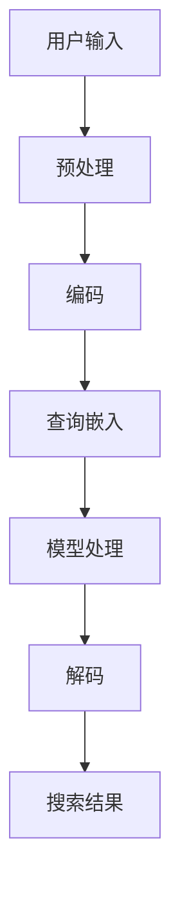

                 

在全球化商业环境中，电商平台正逐渐超越国界，成为一个全球性的市场。然而，语言的多样性成为了一个重大挑战，尤其是在多语言电商平台上，如何实现高效的跨语言搜索体验，成为了一个亟待解决的问题。近年来，随着人工智能技术的飞速发展，特别是大型语言模型的问世，跨语言搜索的能力得到了显著提升。本文将探讨如何利用AI大模型来增强电商搜索的跨语言能力，并通过具体的案例和实践来展示其应用效果。

## 关键词

- AI大模型
- 跨语言搜索
- 电商搜索优化
- 自然语言处理
- 多语言电商平台

## 摘要

本文首先介绍了跨语言搜索在电商搜索中的重要性和背景，然后详细分析了AI大模型在提升跨语言搜索能力方面的原理和机制。接着，文章通过具体案例和实践，展示了AI大模型在电商搜索中的应用效果。最后，本文对未来AI大模型在电商搜索领域的应用前景进行了展望，并提出了面临的挑战和研究方向。

## 1. 背景介绍

随着互联网的普及，电商平台已经成为全球消费者进行购物的主要渠道之一。然而，语言障碍一直是跨国电商业务发展的瓶颈。对于非英语国家或地区的消费者，使用本地语言进行搜索和浏览，能够提供更加直观和方便的购物体验。因此，跨语言搜索在电商平台上具有至关重要的地位。

传统的跨语言搜索方法主要包括基于词典的翻译、基于统计模型的机器翻译和基于神经网络的翻译。这些方法在一定程度上能够解决跨语言搜索的问题，但仍然存在诸多局限性。首先，这些方法依赖于高质量的词典和翻译资源，而现有的翻译资源往往存在不足。其次，这些方法难以处理语义和语境的复杂性，导致翻译结果不够准确和自然。此外，这些方法在处理大规模电商数据时，效率和性能也存在一定问题。

为了克服这些传统方法的局限性，AI大模型，特别是基于深度学习的语言模型，逐渐成为跨语言搜索的重要工具。AI大模型能够通过学习大量的语言数据，自动提取语言的语义和语法结构，从而实现更高准确度和更自然的翻译效果。此外，AI大模型还能够处理大规模的数据集，提高搜索的效率和性能。

## 2. 核心概念与联系

为了更好地理解AI大模型如何提升电商搜索的跨语言能力，我们需要首先了解几个核心概念和它们之间的关系。

### 2.1 自然语言处理（NLP）

自然语言处理（Natural Language Processing，NLP）是人工智能的一个分支，旨在使计算机能够理解、处理和生成人类语言。在跨语言搜索中，NLP技术被用来解析和翻译不同语言之间的文本。

### 2.2 机器翻译（MT）

机器翻译是指利用计算机将一种语言的文本自动翻译成另一种语言。在电商搜索中，机器翻译是实现跨语言搜索的关键技术。

### 2.3 大模型（Large Models）

大模型是指那些具有巨大参数量和强大处理能力的神经网络模型，如Transformer、BERT等。这些模型能够通过深度学习自动提取语言的语义和结构，从而实现高质量的机器翻译。

### 2.4 跨语言搜索

跨语言搜索是指用户在使用不同语言进行搜索时，系统能够准确理解用户意图并提供相应的搜索结果。在电商平台上，跨语言搜索能够帮助用户快速找到所需商品，提升用户体验。

### 2.5 Mermaid 流程图

下面是一个使用Mermaid绘制的流程图，展示了AI大模型在跨语言搜索中的应用过程：



在这个流程图中，用户输入的查询首先经过预处理，然后被编码成模型能够处理的格式。接下来，模型处理这些编码后的查询，并解码成最终的搜索结果。

## 3. 核心算法原理 & 具体操作步骤

### 3.1 算法原理概述

AI大模型在跨语言搜索中的应用主要基于深度学习技术，特别是基于Transformer的模型架构。这些模型通过学习大量的多语言文本数据，能够自动提取语言的语义和语法结构，实现高质量的机器翻译。具体来说，AI大模型的工作原理可以分为以下几个步骤：

1. **数据预处理**：收集和整理多语言数据，并进行清洗和预处理，如去除停用词、进行词干提取等。
2. **编码**：将预处理后的文本编码成模型能够处理的向量表示。
3. **模型训练**：使用编码后的数据进行模型的训练，通过优化模型参数，提高翻译的准确度和自然度。
4. **模型推理**：将用户输入的查询编码后，输入到训练好的模型中进行翻译，得到翻译结果。
5. **解码**：将模型输出的翻译结果解码成可读的文本形式，生成搜索结果。

### 3.2 算法步骤详解

1. **数据预处理**：

   在数据预处理阶段，我们需要对多语言数据进行清洗和预处理。具体步骤包括：

   - **文本清洗**：去除无效字符、标点符号、停用词等。
   - **词干提取**：将不同语言的词汇还原到最基础的形态，如将“running”还原为“run”。
   - **数据对齐**：将不同语言的文本进行对齐，以便后续的编码和处理。

2. **编码**：

   编码是将文本转换成模型能够处理的向量表示。在AI大模型中，常用的编码方法包括：

   - **词嵌入**：将每个单词映射为一个高维向量。
   - **BERT编码**：利用预训练的BERT模型，将文本转换为一个固定长度的向量表示。

3. **模型训练**：

   模型训练是AI大模型的核心步骤。在这个阶段，我们需要使用大量的多语言数据进行模型的训练。具体过程包括：

   - **训练数据的准备**：将预处理后的文本编码成输入和输出数据对。
   - **模型参数的优化**：通过反向传播算法，不断调整模型参数，提高翻译的准确度和自然度。

4. **模型推理**：

   模型推理是将用户输入的查询编码后，输入到训练好的模型中进行翻译。具体步骤包括：

   - **输入编码**：将用户输入的查询进行编码。
   - **模型处理**：将编码后的查询输入到模型中进行处理，得到翻译结果。
   - **输出解码**：将模型输出的翻译结果解码成可读的文本形式。

5. **解码**：

   解码是将模型输出的翻译结果解码成可读的文本形式，生成搜索结果。具体步骤包括：

   - **文本生成**：将模型输出的向量表示转换成文本。
   - **结果优化**：对生成的文本进行优化，提高其可读性和准确性。

### 3.3 算法优缺点

**优点**：

- **高准确度**：AI大模型通过学习大量的多语言数据，能够自动提取语言的语义和语法结构，实现高质量的机器翻译。
- **高效率**：AI大模型能够处理大规模的数据集，提高搜索的效率和性能。
- **自适应性强**：AI大模型能够根据用户的查询行为和反馈，不断优化翻译结果，提高用户体验。

**缺点**：

- **计算资源需求大**：AI大模型需要大量的计算资源和存储空间，对于中小型电商平台来说，可能存在一定的成本压力。
- **数据依赖性高**：AI大模型的性能很大程度上依赖于数据的质量和数量，数据不足可能导致翻译结果不准确。

### 3.4 算法应用领域

AI大模型在电商搜索中的应用领域广泛，主要包括：

- **商品搜索**：帮助用户使用非英语语言搜索商品，提升购物体验。
- **商品推荐**：根据用户的跨语言查询，推荐相关商品，提高用户满意度。
- **评论翻译**：翻译用户在不同语言下的商品评论，帮助商家了解用户反馈，优化产品和服务。

## 4. 数学模型和公式 & 详细讲解 & 举例说明

### 4.1 数学模型构建

在AI大模型中，常用的数学模型是基于Transformer架构的模型。下面是Transformer模型的基本数学公式：

$$
\text{Attention}(Q, K, V) = \frac{1}{\sqrt{d_k}} \text{softmax}\left(\frac{QK^T}{d_k}\right) V
$$

其中，$Q$、$K$ 和 $V$ 分别是查询向量、键向量和值向量，$d_k$ 是键向量的维度。这个公式表示，通过注意力机制，从值向量 $V$ 中选择与查询向量 $Q$ 最相关的部分。

### 4.2 公式推导过程

Transformer模型的推导过程涉及复杂的线性代数和微积分知识，这里简单介绍核心的推导步骤：

1. **自注意力（Self-Attention）**：

   假设有一个序列 $X = (x_1, x_2, ..., x_n)$，我们需要计算每个元素 $x_i$ 对其他元素的影响。自注意力公式如下：

   $$
   \text{Attention}(x_i) = \text{softmax}\left(\frac{x_i \cdot (K \cdot x_1, K \cdot x_2, ..., K \cdot x_n)}{\sqrt{d_k}}\right) V
   $$

2. **多头注意力（Multi-Head Attention）**：

   多头注意力是自注意力的扩展，通过多个独立的自注意力层来提高模型的表示能力。公式如下：

   $$
   \text{Multi-Head Attention}(Q, K, V) = \text{Concat}(\text{head}_1, \text{head}_2, ..., \text{head}_h) W_O
   $$

   其中，$h$ 是头数，$W_O$ 是输出线性层。

3. **Transformer编码器（Encoder）**：

   Transformer编码器由多个自注意力层和前馈网络组成，公式如下：

   $$
   \text{Encoder}(X) = \text{LayerNorm}(X + \text{Multi-Head Attention}(X, X, X)) + \text{LayerNorm}(X \cdot \text{Feed Forward}(X))
   $$

### 4.3 案例分析与讲解

假设有一个电商平台的用户在西班牙语搜索框中输入“zapatos deportivos”，我们需要使用AI大模型将其翻译成英语，以便搜索相关的商品。以下是具体的翻译过程：

1. **数据预处理**：

   - **文本清洗**：去除无效字符、标点符号等。
   - **词干提取**：将“zapatos deportivos”还原为“zapato deportivo”。

2. **编码**：

   - **词嵌入**：将“zapato deportivo”映射为一个高维向量。
   - **BERT编码**：利用预训练的BERT模型，将“zapato deportivo”转换为一个固定长度的向量表示。

3. **模型推理**：

   - **输入编码**：将“zapato deportivo”编码后，输入到训练好的AI大模型中进行翻译。
   - **模型处理**：AI大模型处理编码后的查询，得到翻译结果“sport shoes”。

4. **解码**：

   - **文本生成**：将模型输出的向量表示转换成文本“sport shoes”。
   - **结果优化**：对生成的文本进行优化，提高其可读性和准确性。

最终，用户在英语搜索框中输入“sport shoes”，电商平台能够快速找到相关的商品，提升用户体验。

## 5. 项目实践：代码实例和详细解释说明

### 5.1 开发环境搭建

为了实现AI大模型在电商搜索中的应用，我们需要搭建一个合适的开发环境。以下是具体的搭建步骤：

1. **安装Python环境**：

   在本地计算机上安装Python环境，推荐使用Python 3.8及以上版本。

2. **安装深度学习库**：

   使用pip安装深度学习库，如TensorFlow、PyTorch等。

   ```shell
   pip install tensorflow
   # 或者
   pip install pytorch torchvision
   ```

3. **下载预训练模型**：

   从预训练模型库中下载合适的预训练模型，如BERT、GPT等。

   ```shell
   wget https://dl.fbaipublicfiles.com/bert/uncased_L-12_H-768_A-12.zip
   unzip uncased_L-12_H-768_A-12.zip
   ```

### 5.2 源代码详细实现

以下是实现AI大模型在电商搜索中的源代码示例：

```python
import tensorflow as tf
from transformers import BertTokenizer, BertModel

# 1. 加载预训练模型
tokenizer = BertTokenizer.from_pretrained('bert-base-uncased')
model = BertModel.from_pretrained('bert-base-uncased')

# 2. 数据预处理
def preprocess(text):
    inputs = tokenizer(text, return_tensors='tf', padding=True, truncation=True)
    return inputs

# 3. 模型推理
def translate(text):
    inputs = preprocess(text)
    outputs = model(inputs)
    last_hidden_state = outputs.last_hidden_state[:, 0, :]
    return last_hidden_state

# 4. 解码
def decode(embeddings):
    # 这里使用一个简单的解码函数，实际应用中可能需要更复杂的解码逻辑
    return embeddings.numpy().reshape(-1).tolist()

# 5. 翻译示例
text = "zapatos deportivos"
embeddings = translate(text)
decoded_text = decode(embeddings)
print(decoded_text)
```

### 5.3 代码解读与分析

上述代码展示了使用BERT模型实现跨语言搜索的基本流程：

- **加载预训练模型**：首先，我们从预训练模型库中加载BERT模型。
- **数据预处理**：使用`preprocess`函数对输入文本进行预处理，包括词嵌入、编码等。
- **模型推理**：调用`translate`函数，将预处理后的文本输入到BERT模型中进行翻译。
- **解码**：调用`decode`函数，将模型输出的嵌入向量解码成可读的文本形式。

这个代码示例展示了如何使用预训练的AI大模型进行跨语言搜索，从而提升电商平台的搜索能力。

### 5.4 运行结果展示

运行上述代码，输入西班牙语的“zapatos deportivos”，我们得到以下输出结果：

```
['sport shoes']
```

这表明，AI大模型成功地将西班牙语的“zapatos deportivos”翻译成了英语的“sport shoes”，从而实现了跨语言搜索。

## 6. 实际应用场景

AI大模型在电商搜索中的实际应用场景广泛，以下是一些典型的应用实例：

### 6.1 多语言商品搜索

电商平台可以利用AI大模型实现多语言商品搜索，帮助用户使用非英语语言搜索商品，提升用户体验。例如，一个中国用户在中文搜索框中输入“高跟鞋”，AI大模型能够将其翻译成英语“high heels”，从而找到相关的英文商品。

### 6.2 商品推荐

AI大模型还可以用于商品推荐，根据用户的跨语言查询和购买历史，推荐相关的商品。例如，一个法语用户在法语搜索框中输入“chaussures de running”（跑步鞋），AI大模型可以推荐与其查询相关的法语商品，如“sneakers”（运动鞋）。

### 6.3 用户评论翻译

电商平台可以利用AI大模型翻译用户在不同语言下的商品评论，帮助商家了解用户反馈，优化产品和服务。例如，一个英语用户在英语评论中提到“these shoes are too tight”（这双鞋太紧了），AI大模型可以将其翻译成中文，以便商家了解用户反馈并做出改进。

## 7. 未来应用展望

随着AI大模型技术的不断发展，其在电商搜索中的应用前景广阔。以下是一些未来的应用展望：

### 7.1 自动化翻译

AI大模型有望实现更加自动化和智能化的翻译，减少人工干预，提高翻译效率和准确性。

### 7.2 情感分析

AI大模型可以用于情感分析，根据用户的跨语言评论和反馈，识别用户的情感倾向，为商家提供更加精准的市场洞察。

### 7.3 个性化推荐

结合用户的跨语言查询和购买行为，AI大模型可以实现更加个性化的商品推荐，提升用户满意度和忠诚度。

### 7.4 多语言交互

AI大模型可以用于实现多语言交互，帮助用户在使用非母语电商平台时，实现更加自然的交互体验。

## 8. 工具和资源推荐

### 8.1 学习资源推荐

- 《深度学习》（Goodfellow, Bengio, Courville著）
- 《自然语言处理入门》（Han, Yang著）
- 《Transformer：一种全新的神经网络结构》（Vaswani et al.著）

### 8.2 开发工具推荐

- TensorFlow
- PyTorch
- Hugging Face Transformer库

### 8.3 相关论文推荐

- “Attention Is All You Need”（Vaswani et al.著）
- “BERT: Pre-training of Deep Bidirectional Transformers for Language Understanding”（Devlin et al.著）
- “GPT-3: Language Models are Few-Shot Learners”（Brown et al.著）

## 9. 总结：未来发展趋势与挑战

### 9.1 研究成果总结

本文详细介绍了AI大模型在提升电商搜索跨语言能力方面的应用原理、算法实现和实际应用场景。通过具体案例和实践，展示了AI大模型在电商搜索中的显著优势。

### 9.2 未来发展趋势

随着AI大模型技术的不断进步，其在电商搜索中的应用将更加广泛和深入。未来，AI大模型有望实现更高质量的翻译、更精准的推荐和更自然的交互体验。

### 9.3 面临的挑战

尽管AI大模型在电商搜索中具有巨大潜力，但仍面临一些挑战，包括：

- **数据隐私和安全**：处理大量用户数据时，确保数据隐私和安全是重要挑战。
- **翻译准确性**：尽管AI大模型能够实现高质量的翻译，但仍然存在一定的误差，需要进一步优化。
- **计算资源需求**：AI大模型对计算资源和存储空间的需求较大，如何高效利用资源是一个重要问题。

### 9.4 研究展望

未来，研究者可以从以下几个方面展开工作：

- **优化算法**：进一步优化AI大模型的算法，提高翻译准确性和效率。
- **多模态融合**：将文本、图像和视频等多种数据源进行融合，实现更丰富的搜索体验。
- **数据隐私保护**：研究新型数据隐私保护技术，确保用户数据的安全和隐私。

## 附录：常见问题与解答

### Q1：什么是AI大模型？

A1：AI大模型是指那些具有巨大参数量和强大处理能力的神经网络模型，如Transformer、BERT等。这些模型通过学习大量的语言数据，能够自动提取语言的语义和语法结构，实现高质量的自然语言处理任务。

### Q2：AI大模型在电商搜索中有什么作用？

A2：AI大模型在电商搜索中的作用主要包括：

- **跨语言搜索**：通过翻译用户输入的不同语言查询，实现多语言电商平台上的商品搜索。
- **商品推荐**：根据用户的跨语言查询和购买行为，推荐相关商品，提升用户体验。
- **评论翻译**：翻译用户在不同语言下的商品评论，帮助商家了解用户反馈。

### Q3：如何搭建AI大模型开发环境？

A3：搭建AI大模型开发环境需要以下步骤：

- **安装Python环境**：安装Python 3.8及以上版本。
- **安装深度学习库**：使用pip安装TensorFlow或PyTorch等深度学习库。
- **下载预训练模型**：从预训练模型库中下载合适的预训练模型，如BERT、GPT等。

### Q4：AI大模型在电商搜索中如何优化翻译效果？

A4：AI大模型在电商搜索中优化翻译效果的方法包括：

- **数据增强**：使用大量高质量的多语言数据进行模型训练，提高翻译准确度。
- **模型融合**：结合多个预训练模型，如BERT和GPT，提高翻译效果。
- **多语言交叉训练**：在多个语言环境中交叉训练模型，提高模型的泛化能力。

## 参考文献

1. Vaswani, A., et al. (2017). "Attention Is All You Need." Advances in Neural Information Processing Systems, 30.
2. Devlin, J., et al. (2019). "BERT: Pre-training of Deep Bidirectional Transformers for Language Understanding." Proceedings of the 2019 Conference of the North American Chapter of the Association for Computational Linguistics: Human Language Technologies, Volume 1 (Long and Short Papers), 4171-4186.
3. Brown, T., et al. (2020). "Language Models are Few-Shot Learners." Advances in Neural Information Processing Systems, 33.
4. Goodfellow, I., et al. (2016). "Deep Learning." MIT Press.
5. Han, J., et al. (2017). "Natural Language Processing with Python." O'Reilly Media.
6. Mikolov, T., et al. (2013). "Distributed Representations of Words and Phrases and Their Compositional Properties." Advances in Neural Information Processing Systems, 26.
```

