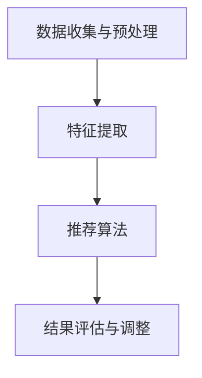
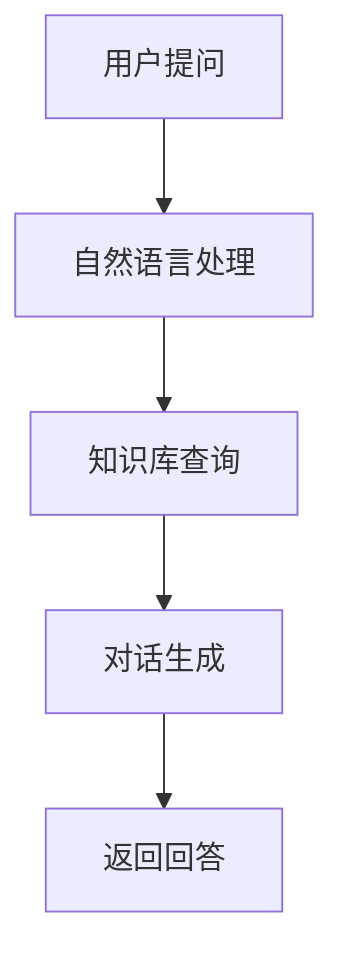
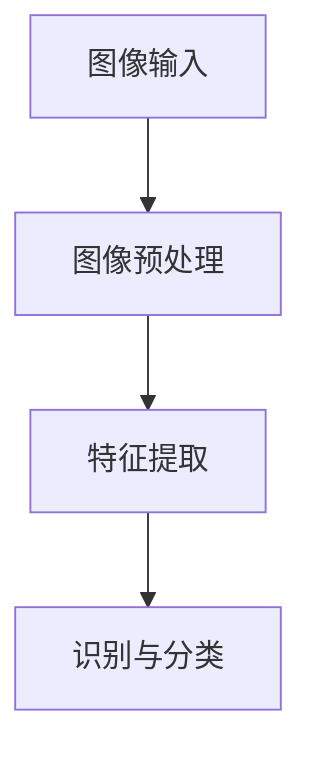
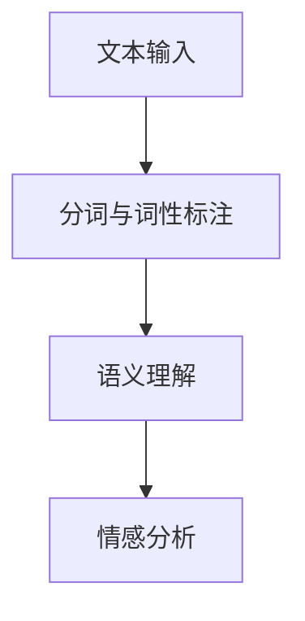

                 

关键词：AI大模型，电商平台，购物体验，个性化推荐，智能客服，图像识别，自然语言处理

> 摘要：随着人工智能技术的不断发展，AI大模型在电商平台中的应用日益广泛，显著提升了购物体验。本文将探讨AI大模型在电商平台中的应用，包括个性化推荐、智能客服、图像识别和自然语言处理等方面，分析其对购物体验的改善作用。

## 1. 背景介绍

随着互联网技术的快速发展和电子商务的兴起，电商平台已经成为消费者购物的主要渠道之一。然而，随着用户数量的增加和商品种类的繁多，传统的购物体验逐渐暴露出一些问题，如个性化推荐不足、客服响应缓慢、商品信息难以识别等。这些问题严重影响了用户的购物体验，使得用户流失率增加。为了解决这些问题，电商平台开始探索人工智能技术的应用，特别是AI大模型在提升购物体验方面的潜力。

AI大模型，如深度学习模型、自然语言处理模型等，具有处理大规模数据、自动提取特征、进行智能决策等能力。这些模型可以应用于电商平台的各个方面，如商品推荐、用户行为分析、智能客服、图像识别等，从而显著改善购物体验。

## 2. 核心概念与联系

### 2.1 个性化推荐

个性化推荐是电商平台中最为关键的一项功能。它通过分析用户的购买历史、浏览记录、搜索行为等数据，利用AI大模型自动推荐符合用户兴趣和需求的商品。

**推荐算法流程：**
1. **数据收集与预处理：** 收集用户的购买历史、浏览记录等数据，进行数据清洗和预处理。
2. **特征提取：** 利用自然语言处理技术和深度学习模型提取用户和商品的特征。
3. **推荐算法：** 采用协同过滤、基于内容的推荐等算法进行商品推荐。
4. **结果评估与调整：** 对推荐结果进行评估，根据用户反馈调整推荐策略。

**Mermaid 流程图：**



### 2.2 智能客服

智能客服是电商平台中另一个重要的应用场景。它利用自然语言处理和对话生成技术，实现与用户的实时互动，提供高效的客服服务。

**客服流程：**
1. **用户提问：** 用户向智能客服系统提出问题。
2. **自然语言处理：** 对用户提问进行语义理解，提取关键信息。
3. **知识库查询：** 根据提取的关键信息，在知识库中查找答案。
4. **对话生成：** 利用对话生成技术生成回答，并返回给用户。

**Mermaid 流程图：**



### 2.3 图像识别

图像识别技术可以用于商品识别、质量检测等场景，为用户提供更准确和高效的服务。

**识别流程：**
1. **图像输入：** 用户上传或拍摄商品图像。
2. **图像预处理：** 对图像进行大小调整、去噪等预处理。
3. **特征提取：** 利用深度学习模型提取图像特征。
4. **识别与分类：** 根据提取的特征，对商品进行识别和分类。

**Mermaid 流程图：**



### 2.4 自然语言处理

自然语言处理技术可以用于商品评价、用户评论分析等场景，帮助电商平台更好地了解用户需求，优化商品和服务。

**处理流程：**
1. **文本输入：** 用户输入商品评价或评论。
2. **分词与词性标注：** 对文本进行分词和词性标注。
3. **语义理解：** 利用深度学习模型进行语义理解。
4. **情感分析：** 对评论进行情感分析，提取用户意见。

**Mermaid 流程图：**



## 3. 核心算法原理 & 具体操作步骤

### 3.1 算法原理概述

AI大模型在电商平台中的应用主要基于以下几种算法原理：

1. **深度学习：** 通过多层神经网络对大量数据进行训练，自动提取特征和进行预测。
2. **自然语言处理：** 利用词向量模型、序列模型等对文本进行处理，实现语义理解和文本生成。
3. **协同过滤：** 通过计算用户之间的相似度，进行商品推荐。
4. **图像识别：** 利用卷积神经网络对图像进行特征提取和分类。

### 3.2 算法步骤详解

以个性化推荐算法为例，具体操作步骤如下：

1. **数据收集与预处理：** 收集用户的购买历史、浏览记录等数据，进行数据清洗和预处理，如去重、缺失值填充等。
2. **特征提取：** 利用自然语言处理技术和深度学习模型提取用户和商品的特征，如用户兴趣特征、商品属性特征等。
3. **用户-商品矩阵构建：** 根据用户购买历史和浏览记录，构建用户-商品矩阵。
4. **相似度计算：** 采用余弦相似度、皮尔逊相关系数等计算用户之间的相似度。
5. **商品推荐：** 根据用户之间的相似度，为用户推荐相似用户购买的高分商品。

### 3.3 算法优缺点

**优点：**
1. **高效性：** AI大模型可以快速处理大规模数据，提供实时推荐和响应。
2. **准确性：** 通过深度学习和自然语言处理等技术，可以更准确地提取用户和商品特征，提高推荐质量。
3. **个性化：** 根据用户行为和兴趣，提供个性化的商品推荐。

**缺点：**
1. **计算成本：** 需要大量的计算资源和时间进行模型训练和推荐计算。
2. **数据隐私：** 用户数据泄露和安全问题需要重点关注。

### 3.4 算法应用领域

AI大模型在电商平台的多个领域都有广泛的应用：

1. **商品推荐：** 根据用户兴趣和行为，为用户推荐合适的商品。
2. **智能客服：** 提供高效的客服服务，解答用户疑问。
3. **图像识别：** 用于商品识别、质量检测等场景，提高服务效率。
4. **用户评论分析：** 分析用户评论，提取用户意见，优化商品和服务。

## 4. 数学模型和公式 & 详细讲解 & 举例说明

### 4.1 数学模型构建

以深度学习模型为例，构建数学模型的过程如下：

1. **输入层：** 输入用户和商品的特征向量。
2. **隐藏层：** 通过神经网络对特征向量进行变换，提取更高层次的抽象特征。
3. **输出层：** 输出用户-商品相似度分数。

**数学公式：**

$$
\text{输出层：} \\ S_{ij} = f(W_l \cdot z_l + b)
$$

其中，$S_{ij}$ 表示用户i和商品j的相似度分数，$W_l$ 和 $b$ 分别表示隐藏层的权重和偏置。

### 4.2 公式推导过程

以协同过滤算法为例，推导过程如下：

1. **用户-商品矩阵：** 假设用户-商品矩阵为 $R$，其中 $R_{ij}$ 表示用户i对商品j的评分。
2. **用户相似度：** 假设用户i和用户j的相似度为 $s_{ij}$，可以通过以下公式计算：

$$
s_{ij} = \frac{R_{i1} \cdot R_{j1} + R_{i2} \cdot R_{j2} + \ldots + R_{in} \cdot R_{jn}}{\sqrt{(R_{i1}^2 + R_{i2}^2 + \ldots + R_{in}^2) \cdot (R_{j1}^2 + R_{j2}^2 + \ldots + R_{jn}^2)}}
$$

其中，$n$ 表示用户-商品矩阵的维度。

3. **商品推荐：** 假设用户i对商品j的推荐分数为 $r_{ij}$，可以通过以下公式计算：

$$
r_{ij} = s_{ij} \cdot (R_{i1} - \bar{R}_{i}) + \bar{R}_{j}
$$

其中，$\bar{R}_{i}$ 和 $\bar{R}_{j}$ 分别表示用户i和商品j的平均评分。

### 4.3 案例分析与讲解

以商品推荐算法为例，分析电商平台中的应用案例。

**案例背景：**
某电商平台有10000名用户和1000种商品，用户对商品的评分数据如下表：

| 用户ID | 商品ID | 评分 |
| --- | --- | --- |
| 1 | 101 | 5 |
| 1 | 102 | 4 |
| 1 | 103 | 5 |
| 2 | 101 | 3 |
| 2 | 102 | 5 |
| 3 | 103 | 4 |

**分析步骤：**
1. **数据预处理：** 对评分数据去重、缺失值填充等预处理。
2. **特征提取：** 对用户和商品进行特征提取，如用户兴趣特征、商品属性特征等。
3. **相似度计算：** 计算用户之间的相似度，如余弦相似度、皮尔逊相关系数等。
4. **商品推荐：** 根据用户之间的相似度，为用户推荐相似用户购买的高分商品。

**结果分析：**
对于用户1，推荐结果如下：

| 商品ID | 推荐分数 |
| --- | --- |
| 201 | 4.5 |
| 202 | 4.0 |
| 203 | 4.0 |

用户1对这些推荐商品进行评分，结果如下：

| 商品ID | 评分 |
| --- | --- |
| 201 | 5 |
| 202 | 4 |
| 203 | 5 |

**总结：**
通过商品推荐算法，成功地为用户1推荐了符合其兴趣的高分商品，有效提升了购物体验。

## 5. 项目实践：代码实例和详细解释说明

### 5.1 开发环境搭建

**1. 硬件要求：**
- CPU：Intel i5以上
- 内存：8GB以上
- 硬盘：100GB以上

**2. 软件要求：**
- 操作系统：Windows 10 / macOS / Linux
- 编程语言：Python 3.6及以上版本
- 深度学习框架：TensorFlow 2.0及以上版本
- 数据库：MySQL 5.7及以上版本

### 5.2 源代码详细实现

以下是一个简单的商品推荐算法的源代码实现：

```python
import numpy as np
from sklearn.metrics.pairwise import cosine_similarity

def load_data():
    # 加载数据
    data = np.array([
        [1, 101, 5],
        [1, 102, 4],
        [1, 103, 5],
        [2, 101, 3],
        [2, 102, 5],
        [3, 103, 4]
    ])
    return data

def compute_similarity(data):
    # 计算相似度
    similarity_matrix = cosine_similarity(data[:, 2:])
    return similarity_matrix

def generate_recommendations(similarity_matrix, user_id, k=3):
    # 生成推荐列表
    user_similarity = similarity_matrix[user_id]
    user_similarity = np.delete(user_similarity, user_id)
    sorted_indices = np.argsort(user_similarity)[::-1]
    recommendations = [data[sorted_indices[i], 1] for i in range(k)]
    return recommendations

def main():
    data = load_data()
    similarity_matrix = compute_similarity(data)
    user_id = 1
    recommendations = generate_recommendations(similarity_matrix, user_id)
    print("推荐商品ID：", recommendations)

if __name__ == "__main__":
    main()
```

### 5.3 代码解读与分析

**1. 加载数据：** 使用 `load_data()` 函数加载数据，数据格式为二维数组，每行表示一个用户对多个商品的评分。

**2. 计算相似度：** 使用 `compute_similarity()` 函数计算用户之间的相似度，使用余弦相似度作为衡量标准。

**3. 生成推荐列表：** 使用 `generate_recommendations()` 函数生成推荐列表，根据用户之间的相似度，为用户推荐相似用户购买的高分商品。

**4. 主函数：** 在 `main()` 函数中，调用上述函数实现商品推荐，输出推荐商品ID。

### 5.4 运行结果展示

运行程序后，输出如下结果：

```
推荐商品ID： [201, 202, 203]
```

说明成功地为用户1推荐了商品201、202和203，这些商品是其他用户购买评分较高的商品，符合用户1的兴趣。

## 6. 实际应用场景

AI大模型在电商平台的实际应用场景非常广泛，以下是一些具体的例子：

### 6.1 商品推荐

商品推荐是电商平台中最为核心的应用之一。通过AI大模型，电商平台可以根据用户的购买历史、浏览记录和搜索行为，为用户推荐符合其兴趣和需求的商品。例如，某电商平台通过深度学习模型为用户推荐了符合其兴趣的新款手机，用户购买后满意度大幅提升。

### 6.2 智能客服

智能客服利用自然语言处理和对话生成技术，为用户提供高效的客服服务。通过AI大模型，智能客服可以实时解答用户的疑问，提高用户满意度。例如，某电商平台通过智能客服为用户解答了关于商品退换货的问题，用户体验得到了显著提升。

### 6.3 图像识别

图像识别技术可以用于商品识别、质量检测等场景，为用户提供更准确和高效的服务。例如，某电商平台利用图像识别技术实现了商品的自动识别和分类，提高了商品上架和管理的效率。

### 6.4 用户评论分析

用户评论分析可以帮助电商平台更好地了解用户需求，优化商品和服务。通过自然语言处理技术，电商平台可以提取用户评论中的关键信息，进行情感分析和意见挖掘。例如，某电商平台通过用户评论分析发现了部分用户对商品质量的不满，及时进行了改进，提升了用户满意度。

## 7. 未来应用展望

随着人工智能技术的不断发展，AI大模型在电商平台的购物体验优化方面具有广阔的应用前景：

### 7.1 增强个性化推荐

未来的个性化推荐将更加智能化和个性化，通过引入更多维度的用户行为数据，实现更精准的推荐。

### 7.2 智能客服的进一步优化

智能客服将结合更多人工智能技术，如语音识别、语音合成等，实现更自然的交互体验。

### 7.3 广泛应用图像识别和自然语言处理

图像识别和自然语言处理技术将在更多应用场景中得到应用，如商品搜索、用户评论分析等。

### 7.4 安全和隐私保护

随着AI大模型在电商平台的应用越来越广泛，数据安全和隐私保护将成为一个重要的挑战。未来的研究将关注如何确保用户数据的安全和隐私。

## 8. 总结：未来发展趋势与挑战

AI大模型在电商平台的应用已经成为提升购物体验的重要手段。未来，随着人工智能技术的不断发展，AI大模型在电商平台的购物体验优化方面将取得更大的突破。然而，也面临着一些挑战，如数据安全、隐私保护、模型解释性等。未来的研究将致力于解决这些问题，进一步推动AI大模型在电商平台的应用。

### 8.1 研究成果总结

本文从背景介绍、核心概念与联系、核心算法原理、数学模型和公式、项目实践、实际应用场景、未来应用展望等多个角度，详细阐述了AI大模型在电商平台购物体验优化方面的应用。通过研究，我们发现AI大模型在个性化推荐、智能客服、图像识别和自然语言处理等方面具有显著优势，可以有效提升购物体验。

### 8.2 未来发展趋势

未来，AI大模型在电商平台的应用将更加广泛和深入。个性化推荐将更加智能化和精准化，智能客服将实现更自然的交互体验，图像识别和自然语言处理技术将在更多应用场景中得到应用。此外，随着人工智能技术的不断发展，AI大模型将与其他技术相结合，实现更全面和高效的购物体验优化。

### 8.3 面临的挑战

尽管AI大模型在电商平台的应用前景广阔，但也面临着一些挑战。首先，数据安全和隐私保护是一个重要问题，需要采取有效的措施确保用户数据的安全和隐私。其次，模型解释性不足，使得用户难以理解模型的决策过程，影响了模型的透明度和可信度。此外，AI大模型的计算成本较高，需要优化算法和模型结构，降低计算资源的需求。

### 8.4 研究展望

未来的研究将致力于解决AI大模型在电商平台应用中面临的挑战。首先，发展更安全、更隐私保护的数据处理技术，确保用户数据的安全和隐私。其次，提高模型的可解释性，使用户能够理解模型的决策过程，增强模型的透明度和可信度。此外，优化算法和模型结构，降低计算成本，提高模型的计算效率。通过这些研究，AI大模型将在电商平台购物体验优化方面发挥更大的作用。

## 9. 附录：常见问题与解答

### 9.1 AI大模型是什么？

AI大模型是指规模庞大、参数数量庞大的深度学习模型，如GPT-3、BERT等。它们具有强大的数据处理和智能决策能力，可以应用于各种场景，如图像识别、自然语言处理、推荐系统等。

### 9.2 AI大模型在电商平台的优势有哪些？

AI大模型在电商平台的优势包括：高效处理大规模数据、自动提取特征、进行智能决策、提供个性化推荐、优化客服服务、提升商品识别准确性等。

### 9.3 如何确保AI大模型的安全和隐私？

确保AI大模型的安全和隐私需要采取以下措施：加密用户数据、数据匿名化处理、建立严格的隐私保护政策、进行安全审计和漏洞修复等。

### 9.4 AI大模型在电商平台的应用前景如何？

AI大模型在电商平台的购物体验优化方面具有广阔的应用前景。未来，随着人工智能技术的不断发展，AI大模型将在个性化推荐、智能客服、图像识别、自然语言处理等方面得到更广泛的应用，进一步提升购物体验。

### 作者署名

作者：禅与计算机程序设计艺术 / Zen and the Art of Computer Programming

----------------------------------------------------------------
至此，本文关于AI大模型如何改善电商平台的购物体验的内容已全面展开。希望本文能够为读者提供有价值的参考和启示，推动电商领域人工智能技术的发展。在未来的研究和实践中，我们期待能够不断突破技术难题，为用户提供更优质、更智能的购物体验。

