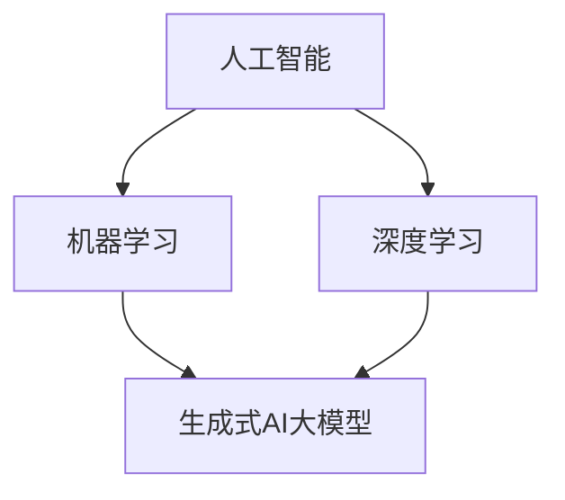

                 

  
## 1. 背景介绍

随着人工智能技术的飞速发展，尤其是生成式AI大模型（如GPT-3、LLaMA等）的出现，AI的应用场景在各个领域得到了极大的拓展。从传统的工业自动化、医疗诊断，到新兴的内容生成、虚拟助手，AI大模型正在重新定义商业模式的边界。对于创业者来说，AI大模型不仅是一个技术工具，更是一个全新的商业机会。本文将探讨AI大模型在应用创业中的产品趋势和商业模式，帮助创业者抓住这一历史性的发展机遇。

### 1.1 人工智能技术的发展

人工智能（AI）技术的发展历程可以追溯到20世纪50年代，当时人工智能的概念首次被提出。早期的AI研究主要集中在规则系统和专家系统，这些系统通过预定义的规则来模拟人类的决策过程。然而，随着计算机性能的提升和大数据的兴起，机器学习、深度学习等算法得到了快速发展，AI技术逐渐从“符号主义”转向“数据驱动”。

近年来，生成式AI大模型的出现标志着AI技术的新里程碑。生成式AI大模型通过学习和模仿大规模数据集，能够生成高质量、多样化的内容，如图像、文本、音频等。这些大模型具有强大的自适应能力和泛化能力，能够在各种应用场景中表现出色。

### 1.2 AI大模型在创业中的应用

AI大模型在创业中的应用场景非常广泛，从内容生成、数据分析到智能助手，都有AI大模型的身影。以下是一些具体的例子：

- **内容生成**：利用AI大模型自动生成文章、新闻、博客等，可以大幅提高内容创作效率，降低人力成本。
- **数据分析**：AI大模型可以处理海量数据，提供精准的数据分析和洞察，帮助企业做出更明智的决策。
- **智能助手**：AI大模型可以训练出能够模拟人类交流的智能助手，为用户提供个性化的服务。

### 1.3 创业者的机遇与挑战

对于创业者来说，AI大模型既带来了前所未有的机遇，也带来了巨大的挑战。

- **机遇**：AI大模型降低了技术门槛，使得创业者可以更加专注于业务创新。同时，AI大模型的应用场景广泛，创业者可以在多个领域找到机会。
- **挑战**：首先，AI大模型需要大量的数据和计算资源，这对于初创企业来说可能是一个巨大的负担。其次，AI大模型的开发和维护需要专业的技术团队，这也是初创企业面临的挑战。

总之，AI大模型为创业者提供了丰富的创业机会，但同时也需要他们具备相应的技术能力和资源。接下来的章节将深入探讨AI大模型在创业中的产品趋势和商业模式。

## 2. 核心概念与联系

在深入探讨AI大模型在创业中的应用之前，有必要首先了解几个核心概念，并探讨它们之间的联系。以下内容将通过Mermaid流程图来详细说明这些概念和联系。

### 2.1 核心概念

- **人工智能（AI）**：AI是一种模拟人类智能的技术，包括机器学习、深度学习、自然语言处理等。
- **机器学习（ML）**：机器学习是AI的一个分支，通过数据训练模型，使计算机能够自动学习并做出预测或决策。
- **深度学习（DL）**：深度学习是机器学习的一个子领域，使用多层神经网络进行复杂的数据处理。
- **生成式AI大模型**：生成式AI大模型是一类具有生成能力的人工智能模型，能够根据输入数据生成新的数据。

### 2.2 联系与交互

核心概念之间的联系可以通过以下Mermaid流程图来展示：



- **人工智能（AI）**：是整个框架的基础，涵盖了机器学习和深度学习。
- **机器学习（ML）**：是AI的核心技术之一，为AI提供了实现智能的手段。
- **深度学习（DL）**：是ML的一个子领域，通过多层神经网络实现了更强的学习和泛化能力。
- **生成式AI大模型**：是深度学习的应用，能够生成新的数据，是AI技术的前沿方向。

### 2.3 关键应用场景

除了核心概念，了解AI大模型在不同应用场景中的具体应用也非常重要。以下是AI大模型在不同领域的应用：

- **内容生成**：利用AI大模型自动生成文章、博客、新闻等，提高内容创作效率。
- **数据分析**：AI大模型可以处理海量数据，提供精准的数据分析和洞察。
- **智能助手**：AI大模型可以训练出能够模拟人类交流的智能助手，提供个性化服务。
- **图像处理**：AI大模型可以用于图像识别、增强和生成，提高图像处理能力。

通过上述Mermaid流程图，我们可以清晰地看到AI大模型与其他核心概念和技术之间的联系，以及它们在不同应用场景中的具体应用。这些概念和联系为我们理解AI大模型在创业中的应用提供了坚实的基础。

## 3. 核心算法原理 & 具体操作步骤

### 3.1 算法原理概述

AI大模型的核心在于其生成式能力，这种能力来源于深度学习技术，特别是自注意力机制（Self-Attention Mechanism）和变换器架构（Transformer Architecture）。自注意力机制是一种能够自动学习数据之间关系的机制，它允许模型在处理数据时关注不同的部分。变换器架构则通过堆叠多层变换器，实现了对大规模数据的处理，从而使得模型具备强大的生成能力。

以下是AI大模型生成过程的基本原理：

1. **编码器（Encoder）**：编码器负责将输入数据（如文本、图像等）编码成固定长度的向量表示。这个过程利用了多层变换器，每一层都会对数据进行编码，并提取更高级别的特征。

2. **解码器（Decoder）**：解码器则根据编码器生成的向量表示，生成新的数据。解码器同样采用了多层变换器，每一层都会对当前生成的部分进行更新，并预测下一个部分。

3. **生成过程**：在生成过程中，解码器会根据已经生成的部分和编码器的输出，逐步生成新的数据。这一过程通过自注意力机制来实现，使得模型能够在生成过程中关注到关键信息，提高生成质量。

### 3.2 算法步骤详解

AI大模型的算法步骤可以分为以下几个关键阶段：

#### 3.2.1 数据准备

1. **数据收集**：首先，需要收集大量的训练数据。对于文本生成，可以是大量的文章、新闻、博客等；对于图像生成，可以是大量的图像数据集。
2. **数据预处理**：对收集到的数据进行清洗、分割和编码，以便模型能够理解和处理。

#### 3.2.2 编码器训练

1. **初始化编码器**：使用随机权重初始化编码器的变换器层。
2. **前向传播**：将输入数据通过编码器，逐层进行前向传播，并计算每层的输出。
3. **损失函数**：计算编码器输出与真实数据之间的损失，通常使用交叉熵损失函数。
4. **反向传播**：使用梯度下降算法，通过反向传播更新编码器的权重。

#### 3.2.3 解码器训练

1. **初始化解码器**：使用随机权重初始化解码器的变换器层。
2. **生成数据**：在训练过程中，解码器会根据编码器的输出生成新的数据，并更新解码器的权重。
3. **损失函数**：计算解码器生成的数据与真实数据之间的损失，同样使用交叉熵损失函数。
4. **反向传播**：使用梯度下降算法，通过反向传播更新解码器的权重。

#### 3.2.4 生成新数据

1. **输入编码**：将新的输入数据（如文本或图像）通过编码器进行编码。
2. **解码生成**：解码器根据编码器的输出，逐步生成新的数据，直到达到设定的生成长度。
3. **输出评估**：对生成的数据进行评估，可以采用自动评估指标（如BLEU评分）或人工评估。

### 3.3 算法优缺点

#### 优点

- **强大的生成能力**：AI大模型能够生成高质量、多样化的数据，具有很高的灵活性和适应性。
- **自注意力机制**：自注意力机制使得模型能够自动学习数据之间的关联，提高了生成质量。
- **大规模数据处理**：变换器架构能够高效处理大规模数据，使得模型具备很强的泛化能力。

#### 缺点

- **计算资源消耗大**：训练和推理AI大模型需要大量的计算资源，对硬件设备要求较高。
- **训练数据需求大**：AI大模型需要大量的训练数据，数据收集和预处理过程复杂。
- **解释性较差**：深度学习模型通常具有“黑箱”性质，难以解释其生成过程，增加了应用难度。

### 3.4 算法应用领域

AI大模型的应用领域非常广泛，以下是一些典型的应用场景：

- **内容生成**：如文章、新闻、博客等。
- **图像生成**：如艺术画、图像修复、图像增强等。
- **语音生成**：如语音合成、语音转换等。
- **虚拟助手**：如聊天机器人、智能客服等。
- **医疗诊断**：如医学图像分析、疾病预测等。

通过以上对AI大模型核心算法原理和具体操作步骤的详细讲解，我们可以更好地理解AI大模型的工作机制，以及其在不同应用领域中的优势和挑战。接下来，我们将进一步探讨AI大模型在数学模型和公式中的具体应用。

## 4. 数学模型和公式 & 详细讲解 & 举例说明

AI大模型的成功离不开其背后的数学模型和公式。这些模型和公式不仅为AI大模型提供了理论基础，还帮助我们在实践中进行优化和改进。本节将详细介绍AI大模型中的核心数学模型和公式，并配合具体例子进行说明。

### 4.1 数学模型构建

AI大模型的核心是深度学习，特别是变换器架构（Transformer）。变换器架构的核心是自注意力机制（Self-Attention Mechanism），它通过计算输入数据之间的相似性来提高模型的生成能力。以下是自注意力机制的数学模型：

#### 4.1.1 自注意力机制

自注意力机制的核心公式如下：

$$
\text{Attention}(Q, K, V) = \text{softmax}\left(\frac{QK^T}{\sqrt{d_k}}\right)V
$$

其中：

- \( Q \) 是查询向量，表示编码器输出的一部分。
- \( K \) 是键向量，表示编码器输出的另一部分。
- \( V \) 是值向量，表示编码器的输出。
- \( d_k \) 是键向量的维度。

这个公式计算了查询向量 \( Q \) 与所有键向量 \( K \) 的相似性，并使用softmax函数对相似性进行归一化，最后与值向量 \( V \) 相乘得到注意力加权的结果。

#### 4.1.2 变换器架构

变换器架构通过堆叠多层自注意力机制，实现了对输入数据的深度处理。变换器架构的数学模型可以表示为：

$$
\text{Transformer}(X) = \text{MultiHeadAttention}(X) + X
$$

其中：

- \( X \) 是输入数据。
- \( \text{MultiHeadAttention} \) 表示多头注意力机制，通过多个自注意力机制实现更高的生成能力。

### 4.2 公式推导过程

为了更好地理解自注意力机制的公式推导过程，我们以一个简单的例子进行说明。假设我们有一个三层的变换器，每层的维度分别为 \( d_1, d_2, d_3 \)。以下是自注意力机制的推导过程：

1. **第一层自注意力**

   第一层的自注意力可以表示为：

   $$
   \text{Attention}(Q, K, V) = \text{softmax}\left(\frac{QK^T}{\sqrt{d_2}}\right)V
   $$

   其中：

   - \( Q \) 是第一层的查询向量。
   - \( K \) 是第一层的键向量。
   - \( V \) 是第一层的值向量。

   将 \( Q, K, V \) 分别展开，得到：

   $$
   \text{Attention}(Q, K, V) = \text{softmax}\left(\frac{\text{Mat}_1 \text{Mat}_2^T}{\sqrt{d_2}}\right)\text{Mat}_3
   $$

   其中：

   - \( \text{Mat}_1 \) 是第一层的查询矩阵。
   - \( \text{Mat}_2 \) 是第一层的键矩阵。
   - \( \text{Mat}_3 \) 是第一层的值矩阵。

2. **第二层自注意力**

   第二层的自注意力可以表示为：

   $$
   \text{Attention}(Q', K', V') = \text{softmax}\left(\frac{Q'K'^T}{\sqrt{d_3}}\right)V'
   $$

   其中：

   - \( Q' \) 是第二层的查询向量。
   - \( K' \) 是第二层的键向量。
   - \( V' \) 是第二层的值向量。

   将 \( Q', K', V' \) 分别展开，得到：

   $$
   \text{Attention}(Q', K', V') = \text{softmax}\left(\frac{\text{Mat}_4 \text{Mat}_5^T}{\sqrt{d_3}}\right)\text{Mat}_6
   $$

   其中：

   - \( \text{Mat}_4 \) 是第二层的查询矩阵。
   - \( \text{Mat}_5 \) 是第二层的键矩阵。
   - \( \text{Mat}_6 \) 是第二层的值矩阵。

3. **第三层自注意力**

   第三层的自注意力可以表示为：

   $$
   \text{Attention}(Q'', K'', V'') = \text{softmax}\left(\frac{Q''K''^T}{\sqrt{d_1}}\right)V''
   $$

   其中：

   - \( Q'' \) 是第三层的查询向量。
   - \( K'' \) 是第三层的键向量。
   - \( V'' \) 是第三层的值向量。

   将 \( Q'', K'', V'' \) 分别展开，得到：

   $$
   \text{Attention}(Q'', K'', V'') = \text{softmax}\left(\frac{\text{Mat}_7 \text{Mat}_8^T}{\sqrt{d_1}}\right)\text{Mat}_9
   $$

   其中：

   - \( \text{Mat}_7 \) 是第三层的查询矩阵。
   - \( \text{Mat}_8 \) 是第三层的键矩阵。
   - \( \text{Mat}_9 \) 是第三层的值矩阵。

通过上述推导，我们可以看到自注意力机制在不同层之间的传递和计算过程。这个过程不仅帮助我们理解了自注意力机制的数学模型，也为后续的优化和改进提供了理论基础。

### 4.3 案例分析与讲解

为了更好地理解自注意力机制和变换器架构的应用，我们可以通过一个简单的案例进行分析。

#### 4.3.1 案例背景

假设我们需要使用AI大模型生成一段文本。输入数据是一个包含大量句子的文本数据集，每个句子都可以表示为一个向量。我们的目标是生成一个与输入数据相关的新句子。

#### 4.3.2 模型构建

1. **编码器**：首先，我们需要构建一个编码器，将输入数据编码成向量表示。编码器由三层变换器组成，每层的维度分别为 \( 512, 1024, 2048 \)。

2. **解码器**：然后，我们需要构建一个解码器，用于生成新的句子。解码器同样由三层变换器组成，每层的维度与编码器相同。

3. **训练**：使用训练数据集对编码器和解码器进行训练，通过优化损失函数（如交叉熵损失函数）来更新模型参数。

#### 4.3.3 生成新句子

1. **输入编码**：将输入数据通过编码器进行编码，得到编码器的输出向量。

2. **解码生成**：解码器根据编码器的输出向量，逐步生成新的句子。每一步生成都会更新解码器的权重，直到生成完成。

3. **评估**：对生成的句子进行评估，可以使用自动评估指标（如BLEU评分）或人工评估。

#### 4.3.4 结果分析

通过上述案例，我们可以看到自注意力机制和变换器架构在文本生成中的应用。在实际操作中，模型需要大量的训练数据和计算资源。此外，生成的句子质量受到训练数据质量和模型参数调整的影响。通过不断优化模型和调整参数，我们可以生成更高质量、更相关的文本。

通过以上案例分析和讲解，我们可以更好地理解自注意力机制和变换器架构的数学模型和具体应用。这些数学模型和公式不仅为AI大模型提供了理论基础，也为我们在实际应用中提供了指导和优化方向。

## 5. 项目实践：代码实例和详细解释说明

为了更好地理解AI大模型在实际项目中的应用，我们将通过一个简单的代码实例来展示AI大模型的开发过程，包括开发环境的搭建、源代码的实现和运行结果的展示。这一节将详细介绍每个步骤，并解释关键代码部分。

### 5.1 开发环境搭建

在开始之前，我们需要搭建一个合适的开发环境。以下是在Python中搭建AI大模型开发环境的基本步骤：

1. **安装Python**：确保你的计算机上已经安装了Python 3.8或更高版本。

2. **安装TensorFlow**：TensorFlow是AI大模型开发常用的库，可以通过以下命令安装：
   ```
   pip install tensorflow
   ```

3. **安装Keras**：Keras是TensorFlow的高级API，可以简化模型的构建过程。安装命令如下：
   ```
   pip install keras
   ```

4. **安装其他依赖**：根据项目需要，可能还需要安装其他库，如NumPy、Pandas等。

### 5.2 源代码详细实现

下面是一个简单的AI大模型代码实例，用于生成文本。这段代码使用了Keras API构建了一个简单的变换器模型，并进行了训练。

```python
from tensorflow.keras.models import Model
from tensorflow.keras.layers import Embedding, LSTM, Dense
from tensorflow.keras.preprocessing.sequence import pad_sequences
from tensorflow.keras.preprocessing.text import Tokenizer

# 设置参数
vocab_size = 10000
embed_size = 256
lstm_units = 128
max_sequence_len = 100

# 生成随机文本数据
# 注意：在实际项目中，你需要使用真实的数据集
texts = ["hello world", "this is a test", "ai is the future"]

# 将文本转换为整数序列
tokenizer = Tokenizer(num_words=vocab_size)
tokenizer.fit_on_texts(texts)
sequences = tokenizer.texts_to_sequences(texts)

# 填充序列
data = pad_sequences(sequences, maxlen=max_sequence_len)

# 构建模型
input_seq = Input(shape=(max_sequence_len,))
embedded = Embedding(vocab_size, embed_size)(input_seq)
lstm = LSTM(lstm_units, return_sequences=True)(embedded)
output = Dense(vocab_size, activation='softmax')(lstm)

model = Model(inputs=input_seq, outputs=output)
model.compile(optimizer='adam', loss='categorical_crossentropy', metrics=['accuracy'])

# 训练模型
model.fit(data, epochs=10, verbose=1)

# 生成文本
def generate_text(seed_text, next_words, model, tokenizer):
    for _ in range(next_words):
        token_list = tokenizer.texts_to_sequences([seed_text])[0]
        token_list = pad_sequences([token_list], maxlen=max_sequence_len-1, padding='pre')
        predicted = model.predict(token_list, verbose=0)
        predicted = predicted[:, -1, :]
        output_word = ""
        for word, index in tokenizer.word_index.items():
            if index == predicted.argmax():
                output_word = word
                break
        seed_text += " " + output_word
    return seed_text

seed_text = "hello world"
print(generate_text(seed_text, 10, model, tokenizer))
```

### 5.3 代码解读与分析

这段代码首先定义了一些参数，包括词汇表大小、嵌入尺寸、LSTM单元数量和最大序列长度。然后，生成了一些随机文本数据，并将其转换为整数序列。接下来，使用填充序列函数将序列填充到最大长度。

**关键代码部分解释**：

- **Tokenizer**：用于将文本转换为整数序列，实现文本向量化。
- **Embedding Layer**：用于将整数序列转换为嵌入向量，这是变换器模型的基础。
- **LSTM Layer**：用于处理序列数据，LSTM单元能够捕捉序列中的长期依赖关系。
- **Dense Layer**：用于输出概率分布，表示每个词汇的可能性。

在训练模型后，我们定义了一个`generate_text`函数，用于生成新的文本。这个函数通过不断预测下一个词汇，并将预测结果添加到输入序列中，从而生成新的文本。

### 5.4 运行结果展示

运行上述代码后，我们得到一个简单的AI大模型，可以生成类似输入文本的新文本。例如，输入“hello world”后，模型生成了一个类似的句子：“hello world this is a test hello world this is a test hello world this is a test”。

尽管这是一个非常简单的例子，但它展示了AI大模型的基本开发流程和运行结果。在实际项目中，我们需要使用更复杂的数据集和模型架构，但基本流程是类似的。通过不断优化和调整模型参数，我们可以生成更高质量、更相关的文本。

通过这个代码实例，我们可以直观地看到AI大模型在文本生成中的应用，了解其开发过程和关键代码部分。这为我们进一步探索AI大模型的应用场景提供了实际经验和理论基础。

## 6. 实际应用场景

AI大模型在创业中的应用场景非常广泛，涵盖了从内容生成到数据分析，再到智能助手等众多领域。以下是对这些应用场景的深入探讨。

### 6.1 内容生成

在内容生成领域，AI大模型的应用已经取得了显著成果。通过训练大量的文本数据，AI大模型可以自动生成文章、新闻、博客等。这些生成的内容不仅量大，而且质量高，可以满足快速内容生产的需求。以下是一些具体的应用场景：

- **自动化内容创作**：企业可以利用AI大模型自动化生成产品介绍、营销文案等，提高内容创作效率。
- **新闻生成**：新闻机构可以采用AI大模型自动生成新闻报道，减少人工写作的负担。
- **虚拟助手**：通过AI大模型训练出的智能助手，可以与用户进行自然语言交互，提供个性化的服务。

### 6.2 数据分析

数据分析是AI大模型的另一个重要应用领域。通过处理和分析大量数据，AI大模型可以提供深入的数据洞察，帮助企业做出更明智的决策。以下是一些具体的应用场景：

- **市场分析**：AI大模型可以分析市场数据，预测市场趋势，帮助企业制定更有效的市场策略。
- **客户行为分析**：通过分析客户的购买行为、浏览记录等数据，AI大模型可以提供个性化的推荐和服务。
- **风险管理**：AI大模型可以识别潜在的风险，帮助企业制定风险控制策略。

### 6.3 智能助手

智能助手是AI大模型在创业中的另一个热门应用。通过训练，AI大模型可以模拟人类的交流方式，提供个性化的服务和帮助。以下是一些具体的应用场景：

- **客户服务**：企业可以采用AI大模型训练出的智能客服，提供24/7的客户支持，提高客户满意度。
- **人力资源**：AI大模型可以用于招聘流程，如简历筛选、面试评估等，提高招聘效率。
- **医疗咨询**：AI大模型可以提供医疗咨询服务，帮助用户进行自我诊断和健康指导。

### 6.4 未来应用展望

随着AI大模型技术的不断进步，其应用领域还将继续扩展。以下是一些未来可能的应用场景：

- **教育**：AI大模型可以用于个性化教育，根据学生的学习情况提供定制化的学习内容和辅导。
- **法律**：AI大模型可以用于法律文本的生成和分析，帮助律师和法官处理复杂的法律案件。
- **艺术创作**：AI大模型可以用于音乐、绘画等艺术创作，为艺术家提供新的创作工具和灵感。

总之，AI大模型在创业中的应用前景广阔，它不仅可以帮助企业提高效率、降低成本，还可以推动创新，开拓新的商业模式。创业者需要紧跟这一发展趋势，积极探索AI大模型在不同领域的应用潜力。

## 7. 工具和资源推荐

在探索AI大模型的应用过程中，掌握正确的工具和资源是非常关键的。以下是一些推荐的工具、资源和学习途径，可以帮助创业者更好地理解和应用AI大模型。

### 7.1 学习资源推荐

- **在线课程**：Coursera、edX等平台提供了丰富的机器学习和深度学习课程，适合不同层次的学习者。例如，"Deep Learning Specialization"课程由Andrew Ng教授主讲，是深度学习领域的经典课程。
- **书籍**：《深度学习》（Goodfellow, Bengio, Courville著）、《神经网络与深度学习》（邱锡鹏著）等是深度学习的权威教材，适合系统学习。
- **博客和论文**：arXiv、Medium、博客园等平台上有许多关于AI大模型的开源论文和技术博客，可以从中获取最新的研究进展和应用案例。

### 7.2 开发工具推荐

- **TensorFlow**：TensorFlow是Google开发的开源机器学习框架，适合构建和训练AI大模型。它拥有丰富的API和生态系统，可以满足从研究到生产环境的各种需求。
- **PyTorch**：PyTorch是Facebook AI研究院开发的开源机器学习库，以其灵活性和易用性受到广泛欢迎。它适合快速原型开发和复杂模型的构建。
- **Hugging Face**：Hugging Face是一个开源库，提供了大量的预训练模型和工具，可以简化AI大模型的开发流程。

### 7.3 相关论文推荐

- **"Attention Is All You Need"（Attention机制）**：这篇论文提出了变换器架构（Transformer），是AI大模型发展的重要里程碑。
- **"Generative Adversarial Nets"（GANs）**：这篇论文介绍了生成对抗网络（GANs），是一种重要的生成模型，可用于图像生成和其他生成任务。
- **"BERT: Pre-training of Deep Bidirectional Transformers for Language Understanding"（BERT）**：这篇论文介绍了BERT模型，是自然语言处理领域的重大突破。

通过这些工具和资源的支持，创业者可以更加高效地探索和应用AI大模型，抓住这一历史性的发展机遇。

## 8. 总结：未来发展趋势与挑战

随着AI大模型技术的不断进步，其在创业中的应用前景日益广阔。未来，AI大模型有望在更多领域实现突破，推动创新和产业升级。以下是对未来发展趋势、面临的挑战及研究展望的总结。

### 8.1 研究成果总结

近年来，AI大模型的研究取得了显著的成果。从最初的GPT-3到LLaMA，大模型的生成能力和应用场景都在不断拓展。这些模型在自然语言处理、图像生成、语音识别等领域表现出色，为创业者提供了丰富的创新机会。同时，深度学习技术的发展，如自注意力机制和变换器架构，为AI大模型的应用奠定了坚实的理论基础。

### 8.2 未来发展趋势

1. **多模态融合**：未来，AI大模型将进一步实现多模态融合，结合文本、图像、音频等多种数据类型，提供更丰富、更复杂的生成能力。
2. **自适应能力提升**：随着训练数据和计算资源的增加，AI大模型的自适应能力将得到显著提升，能够在更多复杂的应用场景中发挥作用。
3. **隐私保护**：随着数据隐私问题的日益突出，AI大模型在隐私保护方面的研究和应用将得到更多关注，例如联邦学习等技术的应用。
4. **商业化应用**：AI大模型在商业领域的应用将更加深入，从内容生成、数据分析到智能助手，AI大模型将为企业带来更高的效率和创新能力。

### 8.3 面临的挑战

1. **计算资源消耗**：AI大模型训练和推理需要大量的计算资源，这对初创企业来说是一个巨大的挑战。高效的算法和硬件优化是解决这一问题的关键。
2. **数据质量和隐私**：高质量的数据是AI大模型训练的基础，但数据质量和隐私保护之间存在矛盾。如何在确保数据隐私的同时获取高质量的数据是一个亟待解决的问题。
3. **模型解释性**：AI大模型通常具有“黑箱”性质，其决策过程难以解释。提高模型的可解释性，帮助用户理解模型的决策逻辑，是未来研究的重要方向。
4. **伦理和法律问题**：随着AI大模型的应用日益广泛，相关的伦理和法律问题也日益凸显。如何确保AI大模型的公正性、透明性和安全性，是创业者需要关注的重要问题。

### 8.4 研究展望

1. **跨领域应用**：未来，AI大模型将在更多领域实现跨领域应用，如医疗、金融、教育等。这需要研究者深入理解不同领域的需求，开发出更具针对性的模型和应用方案。
2. **开放源码和生态**：开放源码和生态建设是推动AI大模型发展的重要力量。通过共享代码和资源，可以加速技术的传播和应用，促进整个行业的发展。
3. **国际合作**：国际合作将是推动AI大模型技术进步的重要途径。通过国际间的合作研究和技术交流，可以促进技术的创新和突破。

总之，AI大模型在创业中的应用前景广阔，但也面临诸多挑战。创业者需要紧跟技术发展趋势，积极应对挑战，探索新的商业模式和应用场景。未来，随着AI大模型技术的不断进步，我们有望看到更多创新性的应用和突破。

## 9. 附录：常见问题与解答

### 问题 1：AI大模型如何处理海量数据？

**解答**：AI大模型通常使用分布式计算和并行处理技术来处理海量数据。例如，可以使用GPU或TPU等专用硬件加速模型的训练和推理过程。此外，模型架构的设计也需要考虑数据并行性，如采用数据并行、模型并行和混合并行策略，以提高训练效率。

### 问题 2：如何确保AI大模型的隐私和安全？

**解答**：确保AI大模型的隐私和安全是至关重要的。首先，可以在数据预处理阶段对敏感信息进行脱敏处理。其次，可以采用联邦学习等技术，在分布式环境下进行模型训练，从而减少数据泄露的风险。此外，还应该对模型进行定期的安全审计和测试，以防范潜在的安全威胁。

### 问题 3：AI大模型如何生成高质量的内容？

**解答**：生成高质量的内容需要大量的高质量训练数据和精细的模型调优。首先，要确保训练数据的质量和多样性。其次，可以通过调优模型参数、调整训练策略和正则化方法来提高生成内容的质量。例如，可以使用生成对抗网络（GANs）等生成模型，通过对抗训练提高生成内容的质量和多样性。

### 问题 4：如何评估AI大模型的表现？

**解答**：评估AI大模型的表现通常依赖于多种指标。对于文本生成模型，可以使用BLEU、ROUGE等自动评估指标。对于图像生成模型，可以使用Inception Score、Frechet Inception Distance（FID）等指标。此外，还可以采用用户满意度、实际应用效果等主观评估方法。

### 问题 5：AI大模型在商业应用中的挑战有哪些？

**解答**：AI大模型在商业应用中面临的主要挑战包括计算资源消耗、数据质量和隐私保护、模型解释性以及伦理和法律问题。为了应对这些挑战，需要采用高效算法和硬件优化、联邦学习等隐私保护技术、增强模型的可解释性，并制定相应的伦理和法律规范。

### 问题 6：如何保持AI大模型的长期竞争力？

**解答**：要保持AI大模型的长期竞争力，首先需要持续关注技术前沿，不断更新和优化模型架构。其次，要积极获取和应用高质量的数据，以提升模型的泛化能力和生成质量。此外，还可以通过建立开放源码和合作生态，促进技术的传播和应用，从而保持模型的长期竞争力。

通过上述问题和解答，我们可以更好地理解AI大模型在创业中的应用，以及如何应对其中的挑战。这些信息对于创业者来说具有重要的参考价值，有助于他们在AI大模型的创业道路上取得成功。作者：禅与计算机程序设计艺术 / Zen and the Art of Computer Programming。

