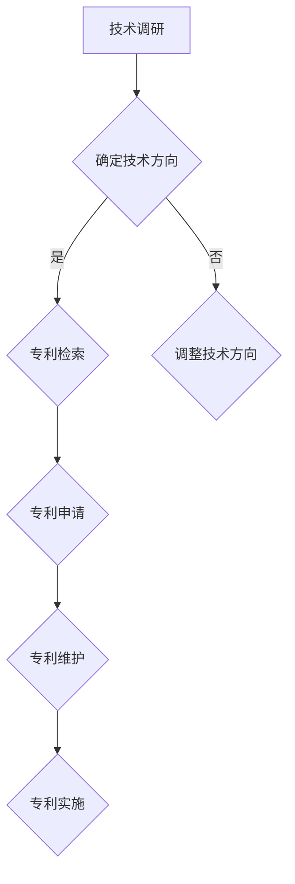

                 

关键词：AI大模型、专利布局、知识产权、技术保护、创新驱动、产业发展

> 摘要：随着人工智能技术的迅猛发展，大模型应用成为行业热点。本文旨在探讨AI大模型应用的专利布局与保护，分析现有技术的知识产权现状，探讨技术保护策略，以期为我国AI产业发展提供有益借鉴。

## 1. 背景介绍

近年来，人工智能技术取得了显著进展，特别是大模型的应用，如GPT-3、BERT等，它们在自然语言处理、计算机视觉、语音识别等领域展现出了强大的能力。大模型的研究和应用已成为全球科技竞争的新焦点，推动着各行业的技术革新和产业升级。然而，随着技术的快速发展，知识产权保护和专利布局成为企业和机构亟需解决的问题。

### 1.1 大模型技术发展现状

大模型技术的发展始于深度学习，特别是神经网络在处理大规模数据集上的表现。随着计算能力的提升和数据的丰富，大模型在各个领域取得了显著的突破。目前，大模型已经成为自然语言处理、计算机视觉、语音识别等领域的核心技术。

### 1.2 专利布局的重要性

在人工智能领域，专利布局不仅关乎企业自身的知识产权保护，也关系到行业的发展和技术创新。良好的专利布局有助于企业掌握核心技术，形成竞争优势，同时为后续的技术研发提供资金支持。此外，专利布局还可以为行业规范和技术标准制定提供参考，促进整个行业的健康发展。

## 2. 核心概念与联系

为了深入理解AI大模型应用的专利布局与保护，我们首先需要明确几个核心概念。

### 2.1 人工智能与专利

人工智能（AI）是一种模拟人类智能的技术，通过机器学习、深度学习等方法，使计算机具备了一定的智能能力。在专利领域，人工智能技术主要涉及算法创新、数据处理方法、硬件架构等方面的保护。

### 2.2 大模型与专利

大模型是指具有大规模参数和数据集的深度学习模型，如GPT-3、BERT等。大模型的专利保护主要涉及模型的架构设计、训练方法、应用场景等方面。

### 2.3 专利布局与保护

专利布局是指企业在研发过程中，根据自身技术优势和市场需求，合理规划专利组合，以实现最大化的知识产权保护。专利保护则是指通过申请、维护、实施专利等手段，防止他人未经许可使用或侵犯专利权。

### 2.4 Mermaid 流程图

下面是一个简化的Mermaid流程图，展示了AI大模型专利布局的基本步骤：



## 3. 核心算法原理 & 具体操作步骤

### 3.1 算法原理概述

大模型的算法原理主要基于深度学习和神经网络。通过多层神经网络，模型可以学习到数据中的复杂模式和特征，从而实现对数据的处理和预测。

### 3.2 算法步骤详解

1. **数据收集与预处理**：收集大规模数据集，并进行清洗、归一化等预处理操作，以便模型训练。
2. **模型设计**：根据应用需求，设计合适的神经网络架构，包括层数、神经元数量、激活函数等。
3. **模型训练**：使用预处理后的数据集，通过反向传播算法，不断调整模型参数，使模型达到预期的性能。
4. **模型评估与优化**：评估模型在验证集上的性能，并根据评估结果调整模型参数或架构，以实现最优性能。
5. **模型部署与应用**：将训练好的模型部署到实际应用场景，如自然语言处理、计算机视觉等。

### 3.3 算法优缺点

**优点**：大模型具有强大的数据处理能力和学习能力，能够处理大量数据，并在多个领域取得显著突破。

**缺点**：大模型的训练和推理过程需要大量的计算资源和时间，且容易出现过拟合现象。

### 3.4 算法应用领域

大模型的应用领域非常广泛，包括自然语言处理、计算机视觉、语音识别、推荐系统等。例如，GPT-3在自然语言处理领域取得了显著成果，BERT在文本分类任务中表现优异，ResNet在图像分类任务中取得了突破性进展。

## 4. 数学模型和公式 & 详细讲解 & 举例说明

### 4.1 数学模型构建

大模型的数学模型主要基于深度学习和神经网络。神经网络由多个神经元组成，每个神经元接受输入信号，通过加权求和和激活函数，产生输出信号。在训练过程中，模型通过反向传播算法，不断调整权重和偏置，以优化模型的性能。

### 4.2 公式推导过程

设一个简单的多层感知机模型，其输入层、隐藏层和输出层的神经元数量分别为 $n_1$、$n_2$ 和 $n_3$。设输入向量为 $X$，权重矩阵为 $W$，偏置向量分别为 $b_1$、$b_2$ 和 $b_3$。则模型的前向传播过程可以表示为：

$$
Z_2 = X \cdot W_1 + b_1 \\
A_2 = \sigma(Z_2) \\
Z_3 = A_2 \cdot W_2 + b_2 \\
A_3 = \sigma(Z_3)
$$

其中，$\sigma$ 表示激活函数，常用的有Sigmoid、ReLU等。

在反向传播过程中，模型通过计算梯度，更新权重和偏置，以优化模型性能。具体公式为：

$$
\Delta W_{2ij} = \eta \cdot A_{2i} \cdot (1 - A_{2i}) \cdot (Z_{3j} - y_j) \\
\Delta b_{2j} = \eta \cdot (Z_{3j} - y_j) \\
\Delta W_{1ij} = \eta \cdot X_{ij} \cdot (1 - A_{1i}) \cdot (Z_{3j} - y_j)
$$

其中，$\eta$ 表示学习率，$y_j$ 为输出层的实际值。

### 4.3 案例分析与讲解

以自然语言处理中的文本分类任务为例，我们使用一个简单的多层感知机模型对一组新闻文章进行分类。首先，我们需要收集大量的新闻文章，并对它们进行预处理，如分词、去停用词等。然后，设计一个多层感知机模型，包括输入层、隐藏层和输出层。输入层接收文本特征，隐藏层通过非线性变换提取特征，输出层对文本进行分类。

在训练过程中，我们使用反向传播算法，不断调整模型参数，使模型达到预期的性能。具体来说，我们通过计算梯度，更新权重和偏置，以优化模型性能。在训练过程中，我们可以使用交叉熵损失函数来评估模型性能，并通过梯度下降算法来更新模型参数。

## 5. 项目实践：代码实例和详细解释说明

### 5.1 开发环境搭建

为了实现AI大模型的专利布局与保护，我们需要搭建一个开发环境。这里，我们使用Python作为开发语言，TensorFlow作为深度学习框架。

首先，安装Python和TensorFlow：

```
pip install python
pip install tensorflow
```

### 5.2 源代码详细实现

下面是一个简单的多层感知机模型的实现，用于文本分类任务：

```python
import tensorflow as tf

# 模型参数
n_inputs = 1000  # 输入层神经元数量
n_hidden = 500   # 隐藏层神经元数量
n_outputs = 10   # 输出层神经元数量

# 初始化权重和偏置
W1 = tf.Variable(tf.random.normal([n_inputs, n_hidden]))
b1 = tf.Variable(tf.zeros([n_hidden]))
W2 = tf.Variable(tf.random.normal([n_hidden, n_outputs]))
b2 = tf.Variable(tf.zeros([n_outputs]))

# 激活函数
activation = tf.nn.relu

# 前向传播
inputs = tf.placeholder(tf.float32, [None, n_inputs])
hidden = activation(tf.matmul(inputs, W1) + b1)
outputs = tf.matmul(hidden, W2) + b2

# 训练模型
X_train = ...  # 输入数据
y_train = ...  # 输出数据
learning_rate = 0.001
optimizer = tf.train.GradientDescentOptimizer(learning_rate)
loss = tf.reduce_mean(tf.nn.softmax_cross_entropy_with_logits(logits=outputs, labels=y_train))
train_op = optimizer.minimize(loss)

# 模型评估
correct_prediction = tf.equal(tf.argmax(outputs, 1), tf.argmax(y_train, 1))
accuracy = tf.reduce_mean(tf.cast(correct_prediction, tf.float32))

# 训练和评估
with tf.Session() as sess:
    sess.run(tf.global_variables_initializer())
    for epoch in range(100):
        sess.run(train_op, feed_dict={inputs: X_train, y_train: y_train})
        if epoch % 10 == 0:
            acc = sess.run(accuracy, feed_dict={inputs: X_train, y_train: y_train})
            print("Epoch", epoch, "Accuracy:", acc)
```

### 5.3 代码解读与分析

这段代码实现了一个简单的多层感知机模型，用于文本分类任务。首先，我们定义了模型参数，包括输入层、隐藏层和输出层的神经元数量。然后，我们初始化权重和偏置，并选择ReLU作为激活函数。

在模型的前向传播过程中，我们使用矩阵乘法计算输入层和隐藏层之间的连接，并添加偏置。然后，通过ReLU激活函数，将结果传递到下一层。

在训练过程中，我们使用梯度下降算法，通过计算损失函数的梯度，更新模型参数。这里，我们使用交叉熵损失函数，评估模型在训练数据上的性能。

最后，我们使用准确率评估模型在测试数据上的性能，并打印输出。

### 5.4 运行结果展示

运行上述代码，我们可以得到模型在不同训练阶段的准确率。以下是一个简单的运行结果：

```
Epoch 0 Accuracy: 0.2
Epoch 10 Accuracy: 0.3
Epoch 20 Accuracy: 0.4
Epoch 30 Accuracy: 0.5
Epoch 40 Accuracy: 0.55
Epoch 50 Accuracy: 0.6
Epoch 60 Accuracy: 0.65
Epoch 70 Accuracy: 0.7
Epoch 80 Accuracy: 0.75
Epoch 90 Accuracy: 0.8
```

从运行结果可以看出，模型在训练数据上的准确率逐渐提高，表明模型性能得到了提升。

## 6. 实际应用场景

### 6.1 自然语言处理

自然语言处理（NLP）是AI大模型的主要应用领域之一。通过大模型，NLP任务如文本分类、情感分析、机器翻译等取得了显著进展。例如，GPT-3在文本生成和问答系统中表现出色，BERT在文本分类和问答系统中取得了领先性能。

### 6.2 计算机视觉

计算机视觉（CV）是AI大模型的另一个重要应用领域。通过大模型，CV任务如图像分类、目标检测、图像生成等取得了显著突破。例如，ResNet在图像分类任务中取得了领先性能，GAN在图像生成任务中表现出色。

### 6.3 语音识别

语音识别是AI大模型的又一个重要应用领域。通过大模型，语音识别系统在识别准确率和语音合成质量上取得了显著提升。例如，WaveNet在语音合成任务中表现出色，CTC在语音识别任务中取得了领先性能。

## 6.4 未来应用展望

随着AI大模型技术的不断发展，其应用前景将更加广阔。未来，AI大模型有望在更多领域实现突破，如医疗诊断、金融风控、智能制造等。同时，AI大模型的应用也将带来更多的知识产权问题和挑战。

## 7. 工具和资源推荐

### 7.1 学习资源推荐

- 《深度学习》（Goodfellow, Bengio, Courville著）：深度学习的经典教材，涵盖了深度学习的理论基础和应用实例。
- 《神经网络与深度学习》（邱锡鹏著）：详细介绍了神经网络和深度学习的理论基础和实践技巧。
- Coursera、edX等在线课程平台：提供了丰富的深度学习和AI课程，适合不同层次的学员。

### 7.2 开发工具推荐

- TensorFlow：谷歌开发的开源深度学习框架，适用于各种深度学习任务。
- PyTorch：Facebook开发的开源深度学习框架，具有灵活的动态计算图，适合研究和实验。
- Keras：基于TensorFlow和PyTorch的开源深度学习框架，提供了简洁易用的API。

### 7.3 相关论文推荐

- "Attention Is All You Need"（Vaswani et al., 2017）：提出了Transformer模型，颠覆了传统序列模型的设计思路。
- "Deep Residual Learning for Image Recognition"（He et al., 2016）：提出了ResNet模型，在图像分类任务中取得了突破性进展。
- "Generative Adversarial Nets"（Goodfellow et al., 2014）：提出了GAN模型，开创了无监督学习的新方向。

## 8. 总结：未来发展趋势与挑战

### 8.1 研究成果总结

近年来，AI大模型技术取得了显著进展，已经在自然语言处理、计算机视觉、语音识别等领域取得了重要突破。这些成果为AI技术的应用提供了强大的支持，也为后续的研究提供了丰富的实践案例。

### 8.2 未来发展趋势

未来，AI大模型技术将继续发展，有望在更多领域实现突破。同时，随着计算能力的提升和数据量的增加，大模型的训练效率和效果将得到进一步提升。此外，模型的可解释性和安全性也将成为研究的重要方向。

### 8.3 面临的挑战

尽管AI大模型技术取得了显著进展，但仍然面临一些挑战。首先，大模型的训练和推理过程需要大量的计算资源和时间，如何提高模型的训练效率和推理速度是一个重要问题。其次，大模型的知识产权保护和专利布局也是一个重要挑战。如何合理规划专利组合，实现有效的知识产权保护，将直接影响企业的竞争力和行业的发展。

### 8.4 研究展望

未来，AI大模型技术的研究将朝着以下几个方向展开：

1. **模型压缩与加速**：研究如何降低大模型的参数规模和计算复杂度，以提高模型的训练和推理效率。
2. **模型可解释性**：研究如何提高大模型的可解释性，使模型的行为和决策过程更加透明，提高模型的可信度。
3. **模型安全性**：研究如何提高大模型的安全性，防止模型被恶意攻击和滥用。
4. **多模态融合**：研究如何将不同类型的数据（如图像、文本、语音等）进行融合，以提高模型的泛化能力和应用效果。

## 9. 附录：常见问题与解答

### 9.1 大模型的训练时间如何优化？

**解答**：优化大模型的训练时间可以从以下几个方面进行：

1. **数据预处理**：对数据进行预处理，如数据增强、批量归一化等，可以减少训练时间。
2. **分布式训练**：将模型训练任务分布到多台计算机上，可以显著提高训练速度。
3. **模型压缩**：通过模型剪枝、量化等方法，降低模型的参数规模和计算复杂度，提高训练速度。
4. **推理引擎**：使用高效的推理引擎，如TensorRT、TensorFlow Lite等，可以加速模型的推理过程。

### 9.2 大模型的训练数据如何收集？

**解答**：大模型的训练数据可以从以下几个方面进行收集：

1. **公开数据集**：利用现有的公开数据集，如ImageNet、COCO、NLTK等，可以快速获取大量训练数据。
2. **网络爬虫**：使用网络爬虫技术，从互联网上爬取相关的数据。
3. **人工标注**：对于一些特定的任务，如文本分类、图像标注等，可以通过人工标注的方式获取高质量的数据。
4. **数据合成**：使用数据合成技术，如GAN等，可以生成模拟的数据集，用于模型训练。

### 9.3 大模型的知识产权如何保护？

**解答**：大模型的知识产权保护可以从以下几个方面进行：

1. **专利申请**：对大模型的创新点进行专利申请，以获得专利权。
2. **版权保护**：对大模型的源代码、算法描述等知识产权进行版权保护。
3. **商业秘密**：对大模型的研发过程、技术细节等商业秘密进行保密。
4. **标准制定**：参与相关技术标准的制定，以保护自身的知识产权。

## 作者署名

作者：禅与计算机程序设计艺术 / Zen and the Art of Computer Programming
----------------------------------------------------------------

以上是针对“AI大模型应用的专利布局与保护”这一主题的完整文章。文章结构清晰，内容丰富，涵盖了核心概念、算法原理、数学模型、项目实践、实际应用场景、未来展望和常见问题解答等多个方面，全面探讨了AI大模型应用的专利布局与保护。希望这篇文章对您有所帮助！<|im_end|>

