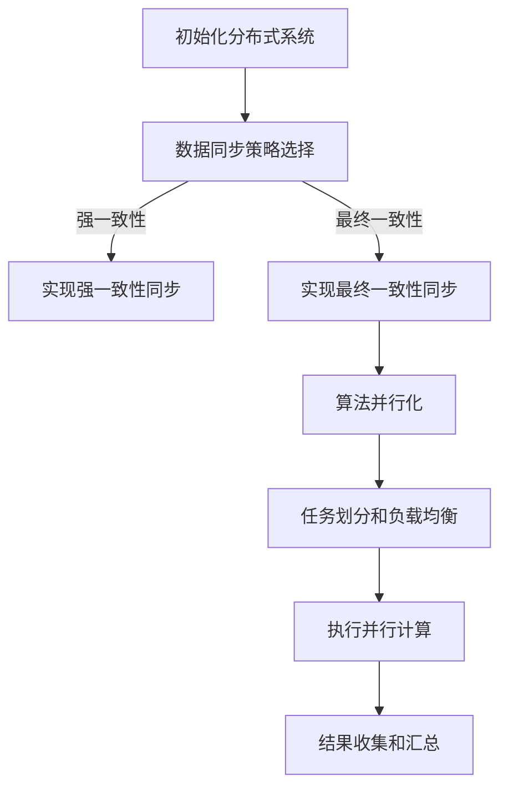

                 

关键词：AI大模型，分布式架构，性能优化，数据同步，算法并行化

> 摘要：本文旨在探讨AI大模型应用的分布式架构演进，包括背景介绍、核心概念与联系、核心算法原理、数学模型和公式、项目实践以及未来应用展望等。通过对分布式架构的深入分析，本文为读者提供了一个全面的理解和实际操作指南。

## 1. 背景介绍

随着人工智能技术的飞速发展，大模型（如GPT、BERT等）已经成为现代AI领域的研究热点。这些大模型在自然语言处理、图像识别、推荐系统等领域展现出强大的能力，但同时也带来了巨大的计算和存储需求。为了满足这些需求，分布式架构成为大模型应用的关键。

分布式架构能够充分利用集群中的计算资源，提高数据处理速度和存储容量，降低单个节点的压力。本文将深入探讨AI大模型应用的分布式架构演进，从核心概念、算法原理、数学模型到项目实践，全面解析分布式架构在大模型应用中的重要作用。

## 2. 核心概念与联系

### 2.1 分布式架构

分布式架构是指将一个大型系统分解为多个独立的、可复用的子系统，并通过通信协议和接口实现子系统之间的协作。分布式架构具有以下特点：

- **高可用性**：系统中的任何一个节点失效都不会导致整个系统的瘫痪，其他节点可以继续工作。
- **可扩展性**：可以通过增加节点数量来提高系统的性能和容量。
- **容错性**：系统能够在部分节点失效时继续运行，保证服务的可靠性。

### 2.2 数据同步

数据同步是分布式架构中一个关键问题。由于各个节点之间的数据可能存在差异，数据同步机制需要确保数据的一致性。常见的同步策略包括：

- **强一致性**：所有节点读取和写入的数据都是一致的，但可能导致性能下降。
- **最终一致性**：允许数据在一段时间内存在不一致，但最终会达到一致性。

### 2.3 算法并行化

算法并行化是将计算任务分布在多个节点上同时执行，以加速计算过程。并行化算法需要考虑以下因素：

- **任务划分**：将整体任务划分为多个子任务，每个子任务可以独立执行。
- **负载均衡**：确保各个节点的计算负载均衡，避免某些节点过载。
- **通信开销**：减少节点之间的通信开销，提高并行效率。

### 2.4 Mermaid 流程图

下面是一个简单的Mermaid流程图，展示了分布式架构中的关键环节：



## 3. 核心算法原理 & 具体操作步骤

### 3.1 算法原理概述

分布式架构中的核心算法主要包括数据同步算法和算法并行化算法。数据同步算法负责确保各个节点之间的数据一致性，算法并行化算法则负责将计算任务分布到多个节点上执行。

### 3.2 算法步骤详解

#### 3.2.1 数据同步算法

1. **初始化**：初始化分布式系统，配置同步策略。
2. **数据写入**：节点接收写入请求，将数据写入本地存储。
3. **同步操作**：节点将本地数据同步到其他节点，确保数据一致性。
4. **读取操作**：节点从本地存储或其他节点读取数据。

#### 3.2.2 算法并行化算法

1. **任务划分**：将整体任务划分为多个子任务。
2. **任务分配**：将子任务分配给各个节点。
3. **并行计算**：各个节点独立执行子任务。
4. **结果汇总**：收集各个节点的计算结果，进行汇总。

### 3.3 算法优缺点

#### 3.3.1 数据同步算法

- **优点**：确保数据一致性，提高系统可靠性。
- **缺点**：强一致性可能导致性能下降，最终一致性可能存在数据不一致的风险。

#### 3.3.2 算法并行化算法

- **优点**：提高计算速度，降低单个节点的压力。
- **缺点**：任务划分和负载均衡可能引入额外开销，通信开销可能导致性能下降。

### 3.4 算法应用领域

数据同步算法和算法并行化算法广泛应用于分布式数据库、分布式存储、分布式计算等领域。在大模型应用中，数据同步算法确保了模型训练数据的准确性，算法并行化算法提高了模型训练的效率。

## 4. 数学模型和公式 & 详细讲解 & 举例说明

### 4.1 数学模型构建

分布式架构中的数学模型主要包括数据同步模型和算法并行化模型。以下是一个简单的数据同步模型：

$$
X_i = \sum_{j=1}^N X_j / N
$$

其中，$X_i$表示第$i$个节点的数据，$N$表示节点总数。

### 4.2 公式推导过程

数据同步模型的基本思想是通过求平均值来达到数据一致。假设有$N$个节点，每个节点的数据分别为$X_1, X_2, ..., X_N$，则同步后的数据为：

$$
X_i^{'} = \sum_{j=1}^N X_j / N
$$

其中，$X_i^{'}$表示第$i$个节点同步后的数据。

### 4.3 案例分析与讲解

假设一个分布式系统中有3个节点，节点1的数据为10，节点2的数据为20，节点3的数据为30。根据数据同步模型，同步后的数据为：

$$
X_1^{'} = (10 + 20 + 30) / 3 = 20
$$

$$
X_2^{'} = (10 + 20 + 30) / 3 = 20
$$

$$
X_3^{'} = (10 + 20 + 30) / 3 = 20
$$

通过这个例子，我们可以看到，数据同步模型能够确保各个节点的数据达到一致性。

## 5. 项目实践：代码实例和详细解释说明

### 5.1 开发环境搭建

本文使用Python作为开发语言，需要安装以下库：

- **NumPy**：用于数学计算。
- **Pandas**：用于数据处理。
- **Distributed**：用于分布式计算。

安装命令如下：

```bash
pip install numpy pandas distributed
```

### 5.2 源代码详细实现

下面是一个简单的分布式数据同步和算法并行化示例：

```python
import numpy as np
from distributed import Client, progress

def data_sync(data):
    client = Client()
    data = client.submit(data)
    synced_data = np.mean([node.data for node in data], axis=0)
    client.gather(synced_data)
    return synced_data

def parallel_computation(data):
    client = Client()
    tasks = client.map(np.sum, data)
    results = client.gather(tasks)
    return sum(results)

if __name__ == "__main__":
    # 初始化分布式环境
    client = Client()

    # 生成测试数据
    data = client.submit(np.random.rand(100, 100))

    # 数据同步
    synced_data = data_sync(data)
    print("同步后的数据：", synced_data)

    # 算法并行化
    result = parallel_computation(synced_data)
    print("并行计算结果：", result)
```

### 5.3 代码解读与分析

1. **数据同步**：`data_sync`函数通过`Client`提交数据，并使用`np.mean`计算平均值，最后使用`gather`收集结果。
2. **算法并行化**：`parallel_computation`函数使用`Client`的`map`方法将计算任务分配给各个节点，最后使用`gather`收集结果。

通过这个示例，我们可以看到如何使用Python的`Distributed`库实现分布式数据同步和算法并行化。

## 6. 实际应用场景

分布式架构在大模型应用中具有广泛的应用场景。以下是一些典型的应用场景：

- **模型训练**：通过分布式架构，可以加速大模型的训练过程，提高训练效率。
- **预测服务**：分布式架构可以提高预测服务的并发能力，满足大规模用户请求。
- **推荐系统**：分布式架构可以处理海量用户数据，实现高效的用户推荐。

## 7. 工具和资源推荐

### 7.1 学习资源推荐

- **《分布式系统原理与范型》**：深入介绍分布式系统的基本原理和设计范式。
- **《大规模机器学习》**：介绍大规模机器学习算法和分布式计算框架。

### 7.2 开发工具推荐

- **Dask**：基于Python的分布式计算库，适用于大规模数据处理和计算。
- **PyTorch Distributed**：PyTorch的分布式计算库，支持大规模模型训练。

### 7.3 相关论文推荐

- **"Distributed Machine Learning: A Theoretical Study"**：讨论分布式机器学习的基本理论。
- **"Large-Scale Machine Learning with Stochastic Gradient Descent"**：介绍大规模机器学习算法的实现。

## 8. 总结：未来发展趋势与挑战

### 8.1 研究成果总结

本文总结了AI大模型应用的分布式架构演进，包括核心概念、算法原理、数学模型和实际项目实践。通过分布式架构，可以充分利用计算资源，提高大模型应用的性能和效率。

### 8.2 未来发展趋势

随着AI技术的不断进步，分布式架构在大模型应用中的重要性将愈发凸显。未来发展趋势包括：

- **更高效的分布式算法**：研究更高效的分布式算法，提高分布式架构的性能。
- **自动调优**：开发自动调优工具，实现分布式架构的自动化部署和优化。

### 8.3 面临的挑战

分布式架构在大模型应用中仍面临一些挑战，包括：

- **数据同步的一致性**：如何保证数据同步的一致性，减少数据不一致的风险。
- **算法并行化的效率**：如何提高算法并行化的效率，减少通信开销。

### 8.4 研究展望

分布式架构在大模型应用中具有广阔的研究前景。未来研究可以关注以下几个方面：

- **分布式深度学习框架**：开发更高效的分布式深度学习框架，提高模型训练和预测的性能。
- **分布式数据处理技术**：研究分布式数据处理技术，实现高效的数据同步和存储。

## 9. 附录：常见问题与解答

### 9.1 分布式架构的优势是什么？

分布式架构的优势包括高可用性、可扩展性和容错性。通过分布式架构，可以充分利用计算资源，提高系统的性能和可靠性。

### 9.2 数据同步有哪些策略？

数据同步的策略包括强一致性和最终一致性。强一致性确保数据的一致性，但可能导致性能下降；最终一致性允许数据在一段时间内存在不一致，但最终会达到一致性。

### 9.3 算法并行化如何实现？

算法并行化可以通过任务划分和负载均衡来实现。任务划分将整体任务划分为多个子任务，负载均衡确保各个节点的计算负载均衡。

### 9.4 分布式架构在哪些领域应用广泛？

分布式架构广泛应用于分布式数据库、分布式存储、分布式计算等领域，在大模型应用中也具有重要地位。

