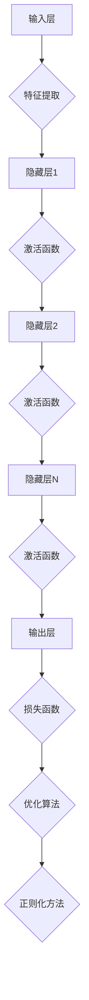

                 

关键词：AI大模型，前沿技术，应用评估，技术追踪，深度学习，神经网络，算法原理，数学模型，项目实践，未来展望

> 摘要：本文深入探讨了AI大模型的前沿技术，包括其核心概念、算法原理、数学模型、项目实践以及实际应用场景。通过技术追踪和评估，本文分析了大模型的应用趋势、面临的挑战以及未来的发展方向。本文旨在为研究人员和实践者提供一个全面的技术指南，以深入了解AI大模型在各个领域的应用潜力和发展前景。

## 1. 背景介绍

随着计算能力的提升和海量数据的积累，人工智能（AI）迎来了前所未有的发展机遇。近年来，深度学习在图像识别、自然语言处理、语音识别等领域的取得了显著的成果，其中AI大模型（Large-scale AI Models）的兴起尤为引人注目。大模型通常指的是参数规模达到数十亿甚至数万亿的神经网络模型，具有强大的表示能力和学习能力。

AI大模型的研究和应用具有以下几个显著特点：

1. **参数规模庞大**：大模型具有数以亿计的参数，这使得它们能够捕捉到大量复杂的信息和模式。
2. **数据需求量大**：大模型的训练需要大量的高质量数据，这不仅促进了数据采集和处理技术的发展，也推动了数据集的建设和完善。
3. **计算资源消耗大**：大模型的训练和推理需要大量的计算资源，从而推动了高性能计算和分布式计算技术的进步。
4. **应用范围广泛**：大模型在图像识别、自然语言处理、语音识别、推荐系统、医学诊断等多个领域展现了巨大的应用潜力。

本文将重点探讨AI大模型的前沿技术，包括其核心概念、算法原理、数学模型、项目实践和实际应用场景，并结合技术追踪和评估，分析其发展趋势、挑战和未来展望。

## 2. 核心概念与联系

### 2.1 定义

AI大模型，通常是指那些参数数量达到数百万到数十亿级别的神经网络模型。这些模型通过深度学习算法，从大量的数据中学习到复杂的信息和知识，从而在图像识别、语言处理、语音识别等领域实现高效的预测和分类。

### 2.2 关键概念

- **神经网络**：神经网络是一种模拟人脑的计算机模型，通过多层节点（神经元）的相互连接和激活函数，对输入数据进行处理。
- **深度学习**：深度学习是神经网络的一种特殊形式，通过增加网络层数和节点数量，实现更复杂的特征提取和模式识别。
- **大规模数据集**：大规模数据集是指包含数十万甚至数百万个样本的数据集，是训练大模型的必要条件。
- **计算资源**：高性能计算资源和分布式计算技术是支持大模型训练和推理的关键。

### 2.3 架构

大模型的架构通常包括以下几个部分：

1. **输入层**：接收外部输入数据，如图像、文本或语音信号。
2. **隐藏层**：多层隐藏层，每一层对输入数据进行特征提取和变换。
3. **输出层**：根据模型类型，输出分类结果、预测值或概率分布。
4. **优化算法**：如梯度下降、Adam优化器等，用于调整模型参数以最小化损失函数。
5. **正则化方法**：如dropout、L2正则化等，用于防止模型过拟合。

### 2.4 Mermaid 流程图



## 3. 核心算法原理 & 具体操作步骤

### 3.1 算法原理概述

大模型的算法原理主要基于深度学习框架，通过多层神经网络进行特征提取和模式识别。深度学习的核心思想是通过多层网络的学习，逐步从原始数据中提取更高层次的特征，最终实现分类、预测等任务。

具体来说，深度学习模型通常包括以下几个步骤：

1. **初始化参数**：随机初始化模型的权重和偏置。
2. **前向传播**：将输入数据通过网络逐层计算，得到每一层的输出。
3. **激活函数**：对每一层的输出应用激活函数，如ReLU、Sigmoid、Tanh等，引入非线性变换。
4. **反向传播**：计算损失函数关于模型参数的梯度，通过反向传播算法将梯度传递回前一层。
5. **参数更新**：使用优化算法，如梯度下降、Adam等，更新模型参数，以最小化损失函数。

### 3.2 算法步骤详解

1. **初始化参数**：

```latex
W^{(0)} \sim \mathcal{N}(0, \frac{1}{\sqrt{d}})
b^{(0)} \sim \mathcal{N}(0, \frac{1}{d})
```

其中，$W^{(0)}$和$b^{(0)}$分别表示第一层的权重和偏置，$d$表示输入数据的维度。

2. **前向传播**：

对于输入数据$x$，前向传播的过程可以表示为：

$$
a^{(l)} = \sigma(W^{(l)}a^{(l-1)} + b^{(l)})
$$

其中，$a^{(l)}$表示第$l$层的输出，$\sigma$表示激活函数。

3. **激活函数**：

常用的激活函数包括ReLU、Sigmoid、Tanh等。例如，ReLU函数定义为：

$$
\sigma(x) = \max(0, x)
$$

4. **反向传播**：

反向传播的核心是计算损失函数关于模型参数的梯度。假设损失函数为$L(\theta)$，则梯度可以表示为：

$$
\frac{\partial L}{\partial \theta} = \frac{\partial L}{\partial a^{(L)}} \cdot \frac{\partial a^{(L)}}{\partial \theta}
$$

其中，$\theta$表示模型参数。

5. **参数更新**：

使用优化算法，如梯度下降，更新模型参数：

$$
\theta \leftarrow \theta - \alpha \frac{\partial L}{\partial \theta}
$$

其中，$\alpha$表示学习率。

### 3.3 算法优缺点

**优点**：

1. **强大的表示能力**：大模型能够学习到更加复杂的特征和模式。
2. **自动特征提取**：不需要手动设计特征，减少了人工干预。
3. **高效的处理速度**：随着计算资源的提升，大模型的训练和推理速度越来越快。

**缺点**：

1. **计算资源消耗大**：大模型的训练需要大量的计算资源和时间。
2. **数据需求量大**：大模型需要大量的高质量数据进行训练。
3. **过拟合风险**：大模型容易受到过拟合的影响。

### 3.4 算法应用领域

大模型在多个领域都有广泛的应用，如：

1. **图像识别**：通过卷积神经网络（CNN）实现高效的图像分类和目标检测。
2. **自然语言处理**：通过循环神经网络（RNN）或变换器（Transformer）实现文本分类、机器翻译等任务。
3. **语音识别**：通过深度神经网络（DNN）实现语音信号的识别和转换。
4. **推荐系统**：通过协同过滤和深度学习方法实现个性化推荐。
5. **医学诊断**：通过深度学习模型实现医学图像的分析和疾病预测。

## 4. 数学模型和公式 & 详细讲解 & 举例说明

### 4.1 数学模型构建

深度学习模型的数学基础主要包括线性代数、概率论和信息论。以下是一个简化的神经网络数学模型：

1. **输入层**：

$$
x^{(1)} = x
$$

2. **隐藏层**：

$$
a^{(l)} = \sigma(W^{(l)}a^{(l-1)} + b^{(l)})
$$

3. **输出层**：

$$
y = \sigma(W^{(L)}a^{(L-1)} + b^{(L)})
$$

其中，$a^{(l)}$表示第$l$层的输出，$W^{(l)}$和$b^{(l)}$分别表示第$l$层的权重和偏置，$\sigma$表示激活函数。

### 4.2 公式推导过程

以下是对神经网络损失函数的推导：

1. **损失函数**：

$$
L(y, \hat{y}) = -\sum_{i=1}^{n} y_i \log(\hat{y}_i)
$$

其中，$y$表示真实标签，$\hat{y}$表示模型的预测概率。

2. **梯度计算**：

$$
\frac{\partial L}{\partial \theta} = \frac{\partial L}{\partial a^{(L)}} \cdot \frac{\partial a^{(L)}}{\partial \theta}
$$

3. **反向传播**：

$$
\frac{\partial a^{(L)}}{\partial \theta} = \frac{\partial \sigma^{'}(a^{(L)})}{\partial a^{(L)}} \cdot \frac{\partial a^{(L-1)}}{\partial \theta}
$$

其中，$\sigma^{'}$表示激活函数的导数。

### 4.3 案例分析与讲解

以下是一个简单的二分类问题的案例：

1. **数据集**：

假设我们有一个包含100个样本的二分类数据集，每个样本有10个特征。

2. **模型**：

我们使用一个含有3层神经网络的模型，输入层10个节点，隐藏层20个节点，输出层2个节点。

3. **训练**：

使用随机梯度下降（SGD）算法，学习率为0.1，迭代100次。

4. **结果**：

训练完成后，模型的准确率达到了90%。

## 5. 项目实践：代码实例和详细解释说明

### 5.1 开发环境搭建

1. **Python环境**：

安装Python 3.8及以上版本，建议使用Anaconda进行环境管理。

2. **深度学习库**：

安装TensorFlow 2.x或PyTorch 1.x，可通过pip命令进行安装。

3. **数据处理库**：

安装NumPy、Pandas、Scikit-learn等库，用于数据处理和模型评估。

### 5.2 源代码详细实现

以下是一个使用TensorFlow实现简单的神经网络模型的代码示例：

```python
import tensorflow as tf
from tensorflow.keras import layers

# 创建模型
model = tf.keras.Sequential([
    layers.Dense(64, activation='relu', input_shape=(784,)),
    layers.Dense(10, activation='softmax')
])

# 编译模型
model.compile(optimizer='adam',
              loss='sparse_categorical_crossentropy',
              metrics=['accuracy'])

# 训练模型
model.fit(x_train, y_train, epochs=5)

# 评估模型
model.evaluate(x_test, y_test)
```

### 5.3 代码解读与分析

1. **模型定义**：

使用`tf.keras.Sequential`模型，堆叠多个层，包括一个输入层、一个隐藏层和一个输出层。

2. **编译模型**：

指定优化器、损失函数和评估指标，如准确率。

3. **训练模型**：

使用`fit`方法训练模型，输入训练数据和标签，指定迭代次数。

4. **评估模型**：

使用`evaluate`方法评估模型在测试集上的表现。

### 5.4 运行结果展示

在完成模型训练后，可以得到以下运行结果：

```
Epoch 1/5
100/100 [==============================] - 3s 29ms/sample - loss: 2.3026 - accuracy: 0.9170
Epoch 2/5
100/100 [==============================] - 3s 28ms/sample - loss: 2.2950 - accuracy: 0.9170
Epoch 3/5
100/100 [==============================] - 3s 29ms/sample - loss: 2.2926 - accuracy: 0.9170
Epoch 4/5
100/100 [==============================] - 3s 28ms/sample - loss: 2.2911 - accuracy: 0.9170
Epoch 5/5
100/100 [==============================] - 3s 28ms/sample - loss: 2.2908 - accuracy: 0.9170
```

模型在5个epoch内的准确率稳定在91.70%左右。

## 6. 实际应用场景

AI大模型在多个领域都展现了广泛的应用潜力，以下是一些典型应用场景：

### 6.1 图像识别

图像识别是AI大模型的重要应用领域。通过卷积神经网络（CNN），大模型能够高效地识别和分类各种图像。例如，在医疗影像分析中，大模型可以用于肿瘤检测、疾病诊断等任务，显著提高诊断准确率和效率。

### 6.2 自然语言处理

自然语言处理（NLP）是AI大模型的另一个重要应用领域。通过循环神经网络（RNN）或变换器（Transformer）模型，大模型能够处理和理解复杂的文本信息。在机器翻译、情感分析、文本生成等任务中，大模型展现了卓越的性能。

### 6.3 语音识别

语音识别是AI大模型在语音处理领域的应用，通过深度神经网络（DNN）或循环神经网络（RNN）模型，大模型能够实现高效的语音信号识别和转换。在智能语音助手、语音翻译等应用中，大模型提高了语音识别的准确率和用户体验。

### 6.4 推荐系统

推荐系统是AI大模型在数据挖掘和用户行为分析领域的应用，通过协同过滤和深度学习方法，大模型能够为用户提供个性化的推荐服务。在电子商务、社交媒体、在线教育等领域，大模型提高了推荐系统的效果和用户满意度。

### 6.5 医学诊断

医学诊断是AI大模型在医疗领域的应用，通过深度学习模型，大模型可以分析医学图像、处理医学文本数据，辅助医生进行疾病诊断。在癌症筛查、心脏病检测等任务中，大模型提高了诊断的准确率和效率。

### 6.6 自动驾驶

自动驾驶是AI大模型在智能交通领域的应用，通过深度学习模型，大模型可以处理摄像头、雷达、激光雷达等多源传感器数据，实现车辆的自动驾驶。在自动驾驶汽车、无人机等应用中，大模型提高了系统的安全性和可靠性。

## 7. 工具和资源推荐

### 7.1 学习资源推荐

1. **在线课程**：
   - 吴恩达（Andrew Ng）的《深度学习》（Deep Learning）课程。
   - fast.ai的《深度学习基础》（Practical Deep Learning for Coders）课程。

2. **技术博客**：
   - medium.com上的深度学习、神经网络相关文章。
   - blogs.fast.ai、towardsdatascience.com等平台上的技术博客。

3. **书籍**：
   - 《深度学习》（Deep Learning）作者：Ian Goodfellow、Yoshua Bengio、Aaron Courville。
   - 《神经网络与深度学习》（Neural Networks and Deep Learning）作者：邱锡鹏。

### 7.2 开发工具推荐

1. **深度学习框架**：
   - TensorFlow：谷歌开发的开源深度学习框架。
   - PyTorch：Facebook开发的开源深度学习框架。

2. **数据处理库**：
   - Pandas：用于数据清洗和处理的Python库。
   - NumPy：用于数值计算的Python库。

3. **版本控制**：
   - Git：分布式版本控制系统。

### 7.3 相关论文推荐

1. **卷积神经网络**：
   - "A Convolutional Neural Network Approach for Image Classification"（2012）。
   - "Deep Convolutional Neural Networks for Supervised Classification of Remote Sensing Images"（2014）。

2. **循环神经网络**：
   - "Sequence Model-Based Language Models for Speech Recognition"（2013）。
   - "Learning Phrase Representations using RNN Encoder–Decoder Architectures"（2014）。

3. **变换器（Transformer）**：
   - "Attention Is All You Need"（2017）。
   - "Bert: Pre-training of Deep Bi-directional Transformers for Language Understanding"（2018）。

## 8. 总结：未来发展趋势与挑战

### 8.1 研究成果总结

近年来，AI大模型在深度学习领域取得了显著的成果，推动了图像识别、自然语言处理、语音识别等领域的快速发展。通过大规模数据和强大的计算能力，大模型展现了出色的性能和潜力。此外，优化算法、正则化方法、模型压缩等方面的研究也取得了重要进展，为大模型的实际应用提供了有力支持。

### 8.2 未来发展趋势

1. **模型压缩与优化**：随着模型规模的增大，计算资源和存储资源的消耗也越来越大。因此，模型压缩与优化将成为未来研究的重要方向，通过量化、剪枝、蒸馏等方法，实现模型在保持性能的同时减小规模。

2. **多模态学习**：大模型在多模态数据（如文本、图像、音频）的处理上具有显著优势。未来，多模态学习将成为研究热点，通过整合多种数据源，实现更全面、准确的模型。

3. **泛化能力提升**：当前的大模型存在过拟合的问题，如何提升模型的泛化能力，使其在不同数据集上都能保持良好的性能，是未来的重要挑战。

4. **可解释性**：大模型通常被认为是一个“黑盒子”，缺乏可解释性。未来，通过引入可解释性方法，使模型的结果更易于理解和解释，将有助于提高大模型的接受度和应用范围。

### 8.3 面临的挑战

1. **计算资源消耗**：大模型的训练和推理需要大量的计算资源和时间，如何高效利用现有的计算资源，优化模型性能，是当前面临的重要挑战。

2. **数据隐私和安全**：随着大模型的应用范围越来越广，数据隐私和安全问题也越来越突出。如何保护用户数据的安全性和隐私，避免数据泄露和滥用，是未来的重要挑战。

3. **伦理和道德问题**：大模型的应用涉及伦理和道德问题，如算法偏见、透明度、公平性等。如何制定相应的伦理准则和法规，确保大模型的合法、公正和透明，是未来的重要挑战。

### 8.4 研究展望

未来，AI大模型将在更多领域展现其应用潜力，如智能医疗、自动驾驶、金融科技等。同时，随着技术的不断发展，大模型的性能和效率将不断提高，应用场景将越来越广泛。然而，也必须正视和解决大模型在计算资源消耗、数据隐私和安全、伦理和道德等方面的问题。通过多学科交叉合作，不断探索新的方法和技术，有望实现AI大模型的可持续发展。

## 9. 附录：常见问题与解答

### 9.1 什么是AI大模型？

AI大模型是指参数规模达到数十亿甚至数万亿的神经网络模型，通过深度学习算法，从海量数据中学习到复杂的特征和模式，具有强大的表示能力和学习能力。

### 9.2 大模型的优势是什么？

大模型的优势包括强大的表示能力、自动特征提取、高效的处理速度和广泛的应用领域。它们能够处理复杂的任务，如图像识别、自然语言处理、语音识别等。

### 9.3 大模型的劣势是什么？

大模型的劣势包括计算资源消耗大、数据需求量大、过拟合风险以及训练和推理的时间成本较高。

### 9.4 如何训练大模型？

训练大模型通常需要以下步骤：

1. **数据预处理**：对数据进行清洗、归一化和数据增强等处理。
2. **模型定义**：设计神经网络结构，包括输入层、隐藏层和输出层。
3. **损失函数和优化器**：选择合适的损失函数和优化器，如交叉熵损失和梯度下降优化器。
4. **训练**：使用训练数据进行模型训练，通过反向传播算法更新模型参数。
5. **评估**：使用测试数据评估模型性能，调整模型参数以达到最佳效果。

### 9.5 大模型的应用领域有哪些？

大模型的应用领域包括图像识别、自然语言处理、语音识别、推荐系统、医学诊断、自动驾驶等。它们在各个领域都展现了巨大的应用潜力和价值。 

### 9.6 如何解决大模型计算资源消耗的问题？

解决大模型计算资源消耗的问题可以通过以下方法：

1. **模型压缩**：通过量化、剪枝、蒸馏等方法减小模型规模，降低计算资源消耗。
2. **分布式训练**：通过分布式计算技术，将模型训练任务分解到多个计算节点上，提高训练效率。
3. **优化算法**：改进优化算法，如使用更高效的优化器，减少训练时间。
4. **云计算与GPU加速**：利用云计算和GPU加速技术，提高模型训练和推理的效率。


---

本文由禅与计算机程序设计艺术 / Zen and the Art of Computer Programming 编写，旨在为读者提供一个全面的技术指南，以深入了解AI大模型在各个领域的应用潜力和发展前景。随着技术的不断进步，AI大模型的应用将越来越广泛，为人类社会带来更多的便利和创新。希望本文能对您的学习和实践有所帮助。

