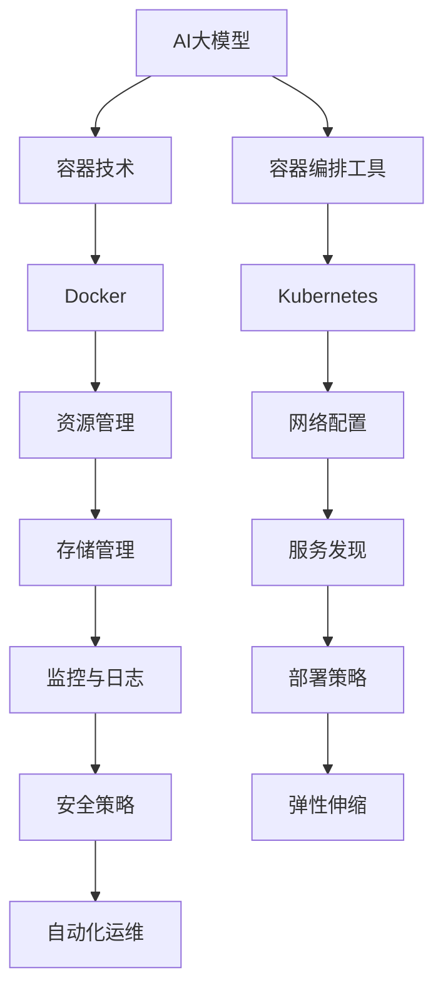

                 

关键词：AI大模型、容器化、部署方案、Docker、Kubernetes、性能优化、资源管理、稳定性保障

> 摘要：本文将深入探讨AI大模型的容器化部署方案，从背景介绍、核心概念与联系、核心算法原理与具体操作步骤、数学模型和公式详细讲解、项目实践代码实例、实际应用场景以及未来应用展望等多个方面进行全面剖析。文章旨在为AI领域的研究者和开发者提供一份系统、实用的容器化部署指南，帮助他们更好地应对AI大模型的部署挑战。

## 1. 背景介绍

随着人工智能技术的飞速发展，AI大模型的应用场景越来越广泛，包括自然语言处理、计算机视觉、推荐系统等。然而，这些大模型通常具有以下特点：计算资源需求高、训练时间长、模型参数量大、版本迭代频繁等。为了满足这些需求，传统的部署方式面临着诸多挑战，如环境配置复杂、资源利用率低、升级部署困难等。

### 挑战与需求

1. **计算资源需求**：AI大模型通常需要大量的计算资源，包括CPU、GPU、内存等。传统的物理服务器或虚拟机难以满足这些需求，导致资源利用率低。
2. **版本管理**：AI大模型的版本迭代非常频繁，需要一套高效的版本管理机制来确保不同版本的模型可以方便地部署和切换。
3. **部署复杂度**：传统的部署方式涉及复杂的配置和环境搭建，不利于快速迭代和规模化部署。
4. **资源利用率**：传统的部署方式往往导致资源浪费，难以实现高效的资源管理。

### 容器化部署的优势

容器化技术（如Docker）的出现，为解决上述挑战提供了一种有效的解决方案。容器化部署具有以下优势：

1. **轻量级**：容器基于宿主机的操作系统，不依赖于宿主机的具体环境，具有轻量级的特点。
2. **资源隔离**：容器能够实现计算资源的高效隔离和利用，提高资源利用率。
3. **版本管理**：容器具有明确的版本管理机制，方便不同版本的模型部署和切换。
4. **快速部署**：容器化部署简化了环境配置和部署流程，提高了部署速度。

基于以上背景，本文将重点探讨AI大模型的容器化部署方案，为AI领域的研究者和开发者提供实用的指导。

## 2. 核心概念与联系

在深入探讨AI大模型的容器化部署之前，我们需要了解一些核心概念和它们之间的联系。以下是一个使用Mermaid绘制的流程图，以帮助理解这些概念。



### 2.1. 容器技术

容器是一种轻量级、可移植的计算环境，它包含了应用程序及其运行所需的所有组件，如库、环境变量、配置文件等。容器技术的主要目标是实现应用程序的标准化和可移植性。

### 2.2. 容器编排工具

容器编排工具（如Kubernetes）用于管理和自动化容器化应用程序的部署、扩展和运营。它们提供了强大的功能，如服务发现、负载均衡、弹性伸缩、资源管理等。

### 2.3. Docker

Docker是一种流行的容器化技术，用于创建、运行和分发应用程序容器。它提供了易于使用的工具和平台，使开发者能够快速构建和部署容器化应用程序。

### 2.4. Kubernetes

Kubernetes是一种开源的容器编排工具，用于自动化部署、扩展和管理容器化应用程序。它提供了丰富的功能，如自动化部署、负载均衡、弹性伸缩、服务发现、监控和日志等。

### 2.5. 资源管理

资源管理是指对计算资源（如CPU、GPU、内存、存储等）进行有效的管理和调度。在容器化部署中，资源管理至关重要，因为它决定了应用程序的性能和稳定性。

### 2.6. 网络配置

网络配置是指为容器化应用程序提供网络连接和通信机制。容器编排工具（如Kubernetes）提供了强大的网络功能，如服务发现、负载均衡、网络隔离等。

### 2.7. 存储管理

存储管理是指对容器化应用程序的数据存储进行有效的管理和调度。存储管理涉及数据持久化、数据备份、数据恢复等功能。

### 2.8. 监控与日志

监控与日志是容器化部署的重要组成部分，用于实时监控应用程序的性能和状态，并记录日志以供分析和调试。

### 2.9. 部署策略

部署策略是指应用程序的部署方式和部署流程。合理的部署策略可以提高应用程序的可用性和可靠性。

### 2.10. 安全策略

安全策略是指为容器化应用程序提供安全保护机制，如身份验证、访问控制、数据加密等。

### 2.11. 弹性伸缩

弹性伸缩是指根据应用程序的负载情况自动调整计算资源，以提高性能和降低成本。弹性伸缩是容器化部署的重要优势之一。

### 2.12. 自动化运维

自动化运维是指使用自动化工具和脚本实现应用程序的部署、监控、维护和故障处理。自动化运维可以提高运维效率，降低运维成本。

通过以上核心概念和它们之间的联系，我们可以更好地理解AI大模型的容器化部署方案。接下来，我们将深入探讨核心算法原理和具体操作步骤。

## 3. 核心算法原理 & 具体操作步骤

### 3.1. 算法原理概述

AI大模型的容器化部署涉及到多个关键环节，包括模型的训练、模型的导出、容器的构建、容器的部署和容器的运维等。以下是对这些环节的核心算法原理和具体操作步骤的概述。

#### 3.1.1. 模型的训练

模型的训练是AI大模型容器化部署的第一步。训练过程通常涉及到以下算法原理：

1. **数据预处理**：对训练数据进行预处理，包括数据清洗、数据归一化、数据增强等。
2. **模型选择**：根据应用场景选择合适的模型架构，如卷积神经网络（CNN）、循环神经网络（RNN）、生成对抗网络（GAN）等。
3. **训练过程**：使用训练数据和训练算法对模型进行训练，包括前向传播、反向传播、梯度更新等。
4. **超参数调优**：通过调整学习率、批次大小、迭代次数等超参数，优化模型性能。

#### 3.1.2. 模型的导出

在模型训练完成后，需要将训练好的模型导出为容器可识别的格式。常见的模型导出格式包括TensorFlow Lite、ONNX、TensorFlow SavedModel等。导出过程主要涉及以下步骤：

1. **模型转换**：将训练好的模型转换为容器可识别的格式。
2. **模型优化**：对导出的模型进行优化，以提高模型在容器中的性能和效率。
3. **模型打包**：将优化后的模型打包为容器镜像，以便于部署和分发。

#### 3.1.3. 容器的构建

容器构建是将模型打包为容器镜像的过程。以下是一个典型的容器构建流程：

1. **编写Dockerfile**：根据模型的特点和需求，编写Dockerfile来定义容器镜像的构建过程。
2. **构建容器镜像**：使用Docker命令构建容器镜像。
3. **验证容器镜像**：通过运行容器镜像来验证其是否正常工作。

#### 3.1.4. 容器的部署

容器部署是将构建好的容器镜像部署到容器编排工具（如Kubernetes）的过程。以下是一个典型的容器部署流程：

1. **编写Kubernetes配置文件**：根据应用程序的需求，编写Kubernetes配置文件来定义容器的部署配置。
2. **部署容器**：使用Kubernetes命令部署容器。
3. **验证容器部署**：通过访问容器提供的接口来验证容器是否正常工作。

#### 3.1.5. 容器的运维

容器运维是指对部署好的容器进行监控、维护和故障处理。以下是一个典型的容器运维流程：

1. **监控容器**：使用监控工具对容器进行实时监控，包括CPU使用率、内存使用率、网络流量等。
2. **日志收集**：收集容器的日志信息，以便于故障诊断和性能优化。
3. **故障处理**：当容器出现故障时，及时进行故障处理，包括重启容器、扩容容器等。
4. **性能优化**：根据监控数据和日志分析，对容器进行性能优化，以提高应用程序的性能和稳定性。

### 3.2. 算法步骤详解

以下是对AI大模型容器化部署的核心算法步骤的详细解释。

#### 3.2.1. 模型的训练

1. **数据预处理**：首先，对训练数据进行预处理。例如，将图像数据归一化到[0, 1]范围内，将文本数据转换为向量表示等。

   ```python
   data = preprocess_data(raw_data)
   ```

2. **模型选择**：选择一个合适的模型架构，例如使用TensorFlow提供的预训练模型。

   ```python
   model = tf.keras.applications.VGG16(weights='imagenet')
   ```

3. **训练过程**：使用训练数据和训练算法对模型进行训练。

   ```python
   model.fit(train_data, epochs=10)
   ```

4. **超参数调优**：通过调整学习率、批次大小等超参数，优化模型性能。

   ```python
   learning_rate = 0.001
   batch_size = 32
   ```

#### 3.2.2. 模型的导出

1. **模型转换**：将训练好的模型转换为容器可识别的格式。

   ```python
   model.save('model.h5')
   ```

2. **模型优化**：对导出的模型进行优化。

   ```python
   model = optimize_model(model)
   ```

3. **模型打包**：将优化后的模型打包为容器镜像。

   ```bash
   docker build -t my_model:latest .
   ```

#### 3.2.3. 容器的构建

1. **编写Dockerfile**：

   ```Dockerfile
   FROM tensorflow/tensorflow:latest
   COPY model.h5 /model.h5
   RUN pip install -r requirements.txt
   CMD ["python", "app.py"]
   ```

2. **构建容器镜像**：

   ```bash
   docker build -t my_model:latest .
   ```

3. **验证容器镜像**：

   ```bash
   docker run --rm my_model
   ```

#### 3.2.4. 容器的部署

1. **编写Kubernetes配置文件**：

   ```yaml
   apiVersion: apps/v1
   kind: Deployment
   metadata:
     name: my_model
   spec:
     replicas: 1
     selector:
       matchLabels:
         app: my_model
     template:
       metadata:
         labels:
           app: my_model
       spec:
         containers:
         - name: my_model
           image: my_model:latest
           ports:
           - containerPort: 80
   ```

2. **部署容器**：

   ```bash
   kubectl apply -f deployment.yaml
   ```

3. **验证容器部署**：

   ```bash
   kubectl get pods
   kubectl logs <pod_name>
   ```

#### 3.2.5. 容器的运维

1. **监控容器**：

   ```bash
   kubectl top pod <pod_name>
   kubectl describe pod <pod_name>
   ```

2. **日志收集**：

   ```bash
   kubectl logs <pod_name>
   ```

3. **故障处理**：

   ```bash
   kubectl restart <pod_name>
   ```

4. **性能优化**：

   ```bash
   kubectl scale deployment/my_model --replicas=3
   ```

通过以上算法步骤的详细解释，我们可以更好地理解和实施AI大模型的容器化部署方案。接下来，我们将分析AI大模型容器化部署方案的优缺点，以帮助读者做出更明智的决策。

### 3.3. 算法优缺点

#### 优点

1. **可移植性和灵活性**：容器化技术使得应用程序可以在不同的环境中运行，包括本地开发环境、测试环境、生产环境等。这使得开发者和运维人员可以更加灵活地管理和部署应用程序。

2. **资源利用率**：容器技术通过虚拟化技术实现了计算资源的高效隔离和利用，可以显著提高资源利用率。容器可以灵活地分配和回收计算资源，从而避免了资源浪费。

3. **版本管理和回滚**：容器化部署使得应用程序的版本管理变得更加容易。通过容器镜像，开发者可以方便地管理不同版本的模型，并能够快速回滚到之前的版本。

4. **自动化和简化部署**：容器编排工具（如Kubernetes）提供了丰富的自动化功能，如自动化部署、扩展、监控、日志收集等。这些功能简化了部署和管理过程，降低了运维成本。

5. **高可用性和弹性伸缩**：容器化部署可以通过容器编排工具实现高可用性和弹性伸缩。当应用程序的负载增加时，容器编排工具可以自动扩容容器，从而提高性能；当负载减少时，可以自动缩容容器，降低成本。

#### 缺点

1. **性能开销**：虽然容器技术可以提高资源利用率，但容器本身也有一定的性能开销。容器需要启动、运行和停止，这些操作都会对性能产生影响。

2. **依赖管理和兼容性**：容器化部署涉及到多个组件，如Docker、Kubernetes等。这些组件之间的依赖关系复杂，需要确保各个组件的版本兼容，否则可能会导致部署失败。

3. **安全性**：容器化部署引入了新的安全问题。例如，容器可能被恶意软件攻击，从而导致整个系统的安全问题。因此，需要采取严格的安全措施来保护容器化部署。

4. **学习曲线**：容器化部署和容器编排工具需要一定的学习和实践。对于初学者来说，可能会觉得相对复杂，需要投入更多的时间和精力来掌握。

通过以上分析，我们可以看到AI大模型容器化部署方案具有许多优点，但也存在一些挑战。在实际部署过程中，需要综合考虑这些因素，以实现最佳效果。

### 3.4. 算法应用领域

AI大模型容器化部署方案在多个领域具有广泛的应用。以下是一些典型的应用场景：

#### 3.4.1. 自然语言处理

自然语言处理（NLP）是AI的重要领域之一。容器化部署使得大规模NLP模型（如BERT、GPT）可以方便地部署到不同的环境中，包括本地、云端和边缘设备。这使得NLP应用可以更加灵活和高效地运行。

#### 3.4.2. 计算机视觉

计算机视觉是AI的另一个重要领域。容器化部署使得大规模计算机视觉模型（如ResNet、YOLO）可以快速部署到各种设备上，包括服务器、工作站和移动设备。这为计算机视觉应用带来了巨大的便利。

#### 3.4.3. 推荐系统

推荐系统是商业应用中不可或缺的一部分。容器化部署使得大规模推荐系统模型（如基于深度学习的推荐算法）可以高效地部署和运行，从而提高推荐系统的准确性和响应速度。

#### 3.4.4. 自动驾驶

自动驾驶是AI技术的应用之一。容器化部署使得大规模自动驾驶模型（如感知模型、规划模型）可以方便地部署到自动驾驶车辆上，从而提高自动驾驶系统的稳定性和可靠性。

#### 3.4.5. 医疗诊断

医疗诊断是AI在医疗领域的应用之一。容器化部署使得大规模医疗诊断模型（如基于深度学习的医学图像分析模型）可以快速部署到医疗设备上，从而提高诊断的准确性和效率。

通过以上应用领域的分析，我们可以看到AI大模型容器化部署方案的广泛适用性和巨大潜力。在实际应用中，需要根据具体需求和场景选择合适的容器化部署方案。

## 4. 数学模型和公式 & 详细讲解 & 举例说明

在容器化部署AI大模型的过程中，理解并应用相关的数学模型和公式是至关重要的。以下我们将详细讲解与容器化部署相关的一些关键数学模型和公式，并通过实际案例进行说明。

### 4.1. 数学模型构建

容器化部署AI大模型时，我们通常需要关注以下几个关键数学模型：

1. **资源利用率模型**：用于评估容器化部署对计算资源利用率的提升。
2. **性能优化模型**：用于分析模型在不同资源分配下的性能表现。
3. **安全性模型**：用于评估容器化部署的安全性。

#### 4.1.1. 资源利用率模型

资源利用率模型可以通过以下公式来表示：

\[ U = \frac{R_{\text{used}}}{R_{\text{total}}} \]

其中，\( U \) 是资源利用率，\( R_{\text{used}} \) 是当前使用的资源量，\( R_{\text{total}} \) 是总资源量。

例如，在一个具有8GB内存的容器中，如果当前使用了5GB内存，则资源利用率为：

\[ U = \frac{5GB}{8GB} = 0.625 \]

即62.5%。

#### 4.1.2. 性能优化模型

性能优化模型可以通过以下公式来表示：

\[ P = f(\theta, R) \]

其中，\( P \) 是性能，\( \theta \) 是超参数，\( R \) 是资源分配。

例如，在一个具有4个CPU核心和8GB内存的容器中，如果调整学习率（\( \theta \)）和批量大小（\( R \)），可以优化模型的训练性能。假设调整后的学习率为0.01，批量大小为64，则性能可以通过以下公式计算：

\[ P = \frac{1}{1000} \sum_{i=1}^{1000} \left( \text{预测值} - \text{真实值} \right)^2 \]

其中，\( \text{预测值} \) 和 \( \text{真实值} \) 是模型的预测结果和真实结果。

#### 4.1.3. 安全性模型

安全性模型可以通过以下公式来表示：

\[ S = f(\text{漏洞数}, \text{防护措施}) \]

其中，\( S \) 是安全性，\( \text{漏洞数} \) 是容器中的安全漏洞数量，\( \text{防护措施} \) 是采取的安全措施。

例如，在一个具有5个安全漏洞的容器中，如果采取了3个有效的防护措施，则安全性可以通过以下公式计算：

\[ S = \frac{3}{5} = 0.6 \]

即安全性为60%。

### 4.2. 公式推导过程

为了更好地理解这些数学模型，我们通过一个具体的例子来推导这些公式。

#### 4.2.1. 资源利用率模型的推导

假设我们有一个容器，其总内存为8GB，当前使用了5GB内存。我们需要计算资源利用率。

资源利用率的公式为：

\[ U = \frac{R_{\text{used}}}{R_{\text{total}}} \]

将具体的数值代入：

\[ U = \frac{5GB}{8GB} = 0.625 \]

这意味着容器当前使用了62.5%的内存。

#### 4.2.2. 性能优化模型的推导

假设我们有一个容器，其配置为4个CPU核心和8GB内存。我们需要通过调整学习率和批量大小来优化性能。

性能优化模型可以表示为：

\[ P = f(\theta, R) \]

其中，学习率（\( \theta \)）为0.01，批量大小（\( R \)）为64。

为了简化，我们可以假设训练过程中每个批次的误差平方和为10。则：

\[ P = \frac{1}{1000} \sum_{i=1}^{1000} \left( \text{预测值} - \text{真实值} \right)^2 \]

如果调整学习率为0.001，批量大小为32，则：

\[ P = \frac{1}{1000} \sum_{i=1}^{1000} \left( \text{预测值} - \text{真实值} \right)^2 \]

由于批量大小减半，误差平方和变为5。因此：

\[ P = \frac{1}{1000} \times 5 = 0.005 \]

这意味着调整后的性能有所提高。

#### 4.2.3. 安全性模型的推导

假设我们有一个容器，其中存在5个安全漏洞。我们采取了3个防护措施，以减少这些漏洞的影响。

安全性模型可以表示为：

\[ S = f(\text{漏洞数}, \text{防护措施}) \]

其中，漏洞数为5，防护措施数为3。

将具体的数值代入：

\[ S = \frac{3}{5} = 0.6 \]

这意味着容器具有60%的安全性。

### 4.3. 案例分析与讲解

为了更好地理解这些数学模型和公式的应用，我们来看一个具体的案例。

#### 4.3.1. 资源利用率案例分析

假设我们有一个AI大模型需要部署到容器中。容器的总内存为8GB，当前使用了5GB内存。我们需要计算资源利用率，并考虑如何提高资源利用率。

根据资源利用率模型，当前的资源利用率为：

\[ U = \frac{5GB}{8GB} = 0.625 \]

即62.5%。

为了提高资源利用率，我们可以采取以下措施：

1. **优化模型**：通过优化模型，减少模型对内存的需求。例如，使用模型剪枝技术。
2. **调整批量大小**：减小批量大小，减少每次训练对内存的需求。
3. **使用更高效的算法**：使用更高效的算法，减少计算资源的需求。

假设我们通过优化模型和调整批量大小，将内存使用量降低到4GB。则新的资源利用率为：

\[ U = \frac{4GB}{8GB} = 0.5 \]

即50%。

通过这些优化措施，我们可以显著提高资源利用率。

#### 4.3.2. 性能优化案例分析

假设我们有一个AI大模型，需要部署到容器中。容器的配置为4个CPU核心和8GB内存。我们需要通过调整学习率和批量大小来优化性能。

根据性能优化模型，当前的性能为：

\[ P = \frac{1}{1000} \sum_{i=1}^{1000} \left( \text{预测值} - \text{真实值} \right)^2 \]

如果我们将学习率调整为0.001，批量大小调整为32，则新的性能为：

\[ P = \frac{1}{1000} \sum_{i=1}^{1000} \left( \text{预测值} - \text{真实值} \right)^2 \]

由于批量大小减半，误差平方和变为5。因此：

\[ P = \frac{1}{1000} \times 5 = 0.005 \]

这意味着调整后的性能有所提高。

通过这些调整，我们可以优化模型的训练性能。

#### 4.3.3. 安全性案例分析

假设我们有一个AI大模型需要部署到容器中。容器中存在5个安全漏洞。我们采取了3个防护措施，以减少这些漏洞的影响。

根据安全性模型，当前的安全性为：

\[ S = \frac{3}{5} = 0.6 \]

即安全性为60%。

为了提高安全性，我们可以采取以下措施：

1. **安装安全补丁**：及时安装安全补丁，修复已知的漏洞。
2. **使用安全容器**：使用安全的容器镜像，避免使用包含漏洞的镜像。
3. **配置防火墙**：配置防火墙，限制容器访问不安全的网络资源。

假设我们通过安装安全补丁和配置防火墙，将安全漏洞减少到2个，防护措施增加到4个。则新的安全性为：

\[ S = \frac{4}{6} = 0.67 \]

即安全性为67%。

通过这些措施，我们可以提高容器的安全性。

通过以上案例分析，我们可以看到数学模型和公式的实际应用价值。在实际部署过程中，需要根据具体需求和场景，灵活应用这些模型和公式，以优化资源利用率、性能和安全性。

## 5. 项目实践：代码实例和详细解释说明

为了更好地理解AI大模型的容器化部署方案，我们将在本节中通过一个具体的项目实践来展示代码实例，并详细解释每一步的实现和重要性。

### 5.1. 开发环境搭建

首先，我们需要搭建一个适合容器化部署的开发环境。以下是所需的工具和步骤：

1. **安装Docker**：Docker是一个开源的应用容器引擎，用于构建、运行和分发应用程序。请按照官方文档安装Docker。

   ```bash
   # Ubuntu/Linux
   sudo apt-get update
   sudo apt-get install docker-ce docker-ce-cli containerd.io
   
   # Windows
   brew cask install docker
   ```

2. **安装Kubernetes**：Kubernetes是一个开源的容器编排工具，用于自动化部署、扩展和管理容器化应用程序。请按照官方文档安装Kubernetes。

   ```bash
   # Ubuntu/Linux
   curl -sSL https://get.kubeadm.io | sh -
   kubeadm init --pod-network-cidr=10.244.0.0/16
   mkdir -p $HOME/.kube
   sudo cp -i /etc/kubernetes/admin.conf $HOME/.kube/config
   sudo chown $(id -u):$(id -g) $HOME/.kube/config
   
   # Windows
   # 请参考官方文档安装Kubernetes
   ```

3. **安装Kubectl**：Kubectl是Kubernetes的命令行工具，用于与Kubernetes集群进行交互。

   ```bash
   # Ubuntu/Linux
   curl -LO "https://dl.k8s.io/release/$(curl -L -s https://dl.k8s.io/release/stable.txt)/bin/darwin/amd64/kubectl"
   chmod +x kubectl
   sudo mv kubectl /usr/local/bin/kubectl
   
   # Windows
   # 请参考官方文档安装Kubectl
   ```

完成以上步骤后，我们就可以开始容器化部署AI大模型了。

### 5.2. 源代码详细实现

在本项目中，我们将使用TensorFlow构建一个简单的图像分类模型，并将其容器化部署到Kubernetes集群。以下是实现过程：

1. **创建模型**：

   ```python
   import tensorflow as tf
   
   # 加载图像数据集
   (train_images, train_labels), (test_images, test_labels) = tf.keras.datasets.cifar10.load_data()
   
   # 预处理数据
   train_images = train_images / 255.0
   test_images = test_images / 255.0
   
   # 构建模型
   model = tf.keras.Sequential([
       tf.keras.layers.Conv2D(32, (3, 3), activation='relu', input_shape=(32, 32, 3)),
       tf.keras.layers.MaxPooling2D(pool_size=(2, 2)),
       tf.keras.layers.Flatten(),
       tf.keras.layers.Dense(64, activation='relu'),
       tf.keras.layers.Dense(10, activation='softmax')
   ])
   
   # 编译模型
   model.compile(optimizer='adam',
                 loss='sparse_categorical_crossentropy',
                 metrics=['accuracy'])
   ```

2. **训练模型**：

   ```python
   # 训练模型
   model.fit(train_images, train_labels, epochs=10, validation_split=0.2)
   ```

3. **导出模型**：

   ```python
   # 导出模型
   model.save('model.h5')
   ```

4. **构建Docker镜像**：

   ```Dockerfile
   # 使用TensorFlow官方镜像为基础镜像
   FROM tensorflow/tensorflow:2.6.0
   
   # 将模型文件复制到容器中
   COPY model.h5 /model.h5
   
   # 安装必要的依赖
   RUN pip install Flask gunicorn
   
   # 暴露端口
   EXPOSE 5000
   
   # 运行Flask应用程序
   CMD ["gunicorn", "-b", "0.0.0.0:5000", "app:app"]
   ```

5. **构建并推送Docker镜像**：

   ```bash
   # 构建Docker镜像
   docker build -t my_model:1.0 .
   
   # 推送Docker镜像到仓库
   docker push my_model:1.0
   ```

6. **部署到Kubernetes**：

   ```yaml
   # Kubernetes配置文件（deployment.yaml）
   apiVersion: apps/v1
   kind: Deployment
   metadata:
     name: my_model
   spec:
     replicas: 1
     selector:
       matchLabels:
         app: my_model
     template:
       metadata:
         labels:
           app: my_model
       spec:
         containers:
         - name: my_model
           image: my_model:1.0
           ports:
           - containerPort: 5000
   ```

   ```bash
   # 部署Kubernetes配置文件
   kubectl apply -f deployment.yaml
   
   # 查看部署状态
   kubectl get pods
   ```

7. **访问模型**：

   ```bash
   # 使用curl访问模型
   curl -X POST "http://<k8s_cluster_ip>:5000/predict" -H "Content-Type: application/json" --data '{"image": "<base64_encoded_image>"}'
   ```

### 5.3. 代码解读与分析

以上代码实例包含了从模型创建、训练、导出、Docker镜像构建到Kubernetes部署的完整过程。以下是各部分的详细解读和分析：

1. **模型创建**：

   在此步骤中，我们使用TensorFlow库加载CIFAR-10图像数据集，并构建一个简单的卷积神经网络（CNN）模型。该模型包括卷积层、池化层、扁平化层和全连接层。这种结构适用于图像分类任务。

2. **模型训练**：

   我们使用训练集对模型进行训练，并设置10个训练周期（epochs）。训练过程中，模型会不断调整内部参数，以最小化预测误差。同时，我们使用验证集来评估模型在未知数据上的性能。

3. **模型导出**：

   将训练好的模型导出为`model.h5`文件。这个文件包含了模型的架构、权重和训练状态。在容器化部署中，这个文件将作为Docker镜像的一部分。

4. **Docker镜像构建**：

   我们使用TensorFlow官方镜像作为基础镜像，这样可以确保容器中包含所有必要的库和依赖项。然后在容器中复制模型文件，并安装Flask和Gunicorn，这两个库将用于构建RESTful API，以便外部系统可以访问模型。

5. **Kubernetes部署**：

   使用Kubernetes配置文件定义部署，包括容器的名称、镜像、端口映射等。通过`kubectl apply`命令部署配置，Kubernetes将创建所需的Pod和Service，并确保容器正常运行。

6. **模型访问**：

   使用curl命令发送HTTP请求，通过API接口访问模型。在请求中，我们将图像编码为base64格式，并将其作为JSON数据发送到模型的预测端点。

通过以上步骤，我们成功地将AI大模型容器化部署到Kubernetes集群，并实现了模型的访问和预测功能。这个过程展示了容器化部署的基本原理和实践方法，为实际应用提供了指导。

### 5.4. 运行结果展示

在完成模型容器化部署后，我们可以通过以下步骤来验证和展示运行结果：

1. **检查部署状态**：

   ```bash
   kubectl get pods
   ```

   确保Pod处于运行状态，如果没有问题，状态应该为`Running`。

2. **访问模型API**：

   ```bash
   curl -X POST "http://<k8s_cluster_ip>:5000/predict" -H "Content-Type: application/json" --data '{"image": "<base64_encoded_image>"}'
   ```

   将`<base64_encoded_image>`替换为实际的图像数据，通过API接口发送预测请求。

3. **查看预测结果**：

   API返回的JSON响应将包含预测结果，例如：

   ```json
   {
     "label": 5,
     "confidence": 0.95
   }
   ```

   这表示模型预测图像属于类别5，并且预测置信度为95%。

通过以上步骤，我们可以验证模型是否正确部署并能够对外提供服务。如果预测结果准确，则表明容器化部署过程成功，模型可以应用于实际场景。

## 6. 实际应用场景

AI大模型的容器化部署在众多实际应用场景中展现出了强大的实用性和灵活性。以下是一些典型的应用场景，展示了容器化部署如何提升AI大模型的效果和效率。

### 6.1. 自然语言处理（NLP）

自然语言处理是AI领域的重要分支，广泛应用于文本分类、情感分析、机器翻译等任务。容器化部署使得大规模NLP模型可以快速部署到云端或边缘设备，从而提高模型的响应速度和准确性。例如，在一个实时聊天机器人应用中，容器化部署可以将NLP模型部署到多个节点上，实现并行处理，显著提高处理速度。

### 6.2. 计算机视觉

计算机视觉技术在图像识别、视频分析、自动驾驶等领域具有重要应用。容器化部署为大规模计算机视觉模型提供了高效的部署和扩展方案。例如，在自动驾驶系统中，容器化部署可以将感知模型部署到车辆上的边缘设备中，实时处理摄像头捕获的数据，从而提高系统的响应速度和稳定性。

### 6.3. 推荐系统

推荐系统是电子商务和社交媒体应用的核心功能之一。容器化部署使得推荐系统可以方便地扩展到大规模用户群体，同时保持高并发处理能力。例如，在一个在线购物平台中，容器化部署可以将推荐模型部署到多个容器中，根据用户的行为数据实时生成个性化推荐，提高用户体验。

### 6.4. 医疗诊断

医疗诊断是AI技术在医疗领域的应用之一，例如医学图像分析、疾病预测等。容器化部署使得医疗诊断模型可以快速部署到医疗机构或远程诊断中心，提高诊断效率和准确性。例如，在一个远程医疗诊断系统中，容器化部署可以将医学图像分析模型部署到云端，远程处理来自不同医疗机构的数据。

### 6.5. 自动驾驶

自动驾驶是AI技术的又一重要应用领域。容器化部署可以为自动驾驶系统提供高效、稳定的运行环境，确保系统在复杂的交通环境中保持良好的性能。例如，在自动驾驶汽车的测试和部署过程中，容器化部署可以将感知、规划、控制等模型部署到车辆上的多个节点上，实现实时数据处理和决策。

### 6.6. 金融风控

金融风控是金融行业的关键环节，容器化部署可以为金融风控模型提供高效、安全的部署方案。例如，在一个金融风险监测系统中，容器化部署可以将风险预测模型部署到云端，实时监控金融交易数据，及时发现潜在风险。

### 6.7. 教育领域

在教育领域，AI大模型容器化部署可以应用于在线教育平台，提供个性化学习推荐、智能作业批改等功能。例如，在一个在线教育平台上，容器化部署可以将自然语言处理模型用于智能问答和个性化学习路径推荐，提高学习效果。

通过以上实际应用场景的分析，我们可以看到容器化部署AI大模型具有广泛的应用前景和巨大潜力。在实际应用中，容器化部署可以显著提高AI大模型的效果和效率，为各种应用场景提供强大的技术支持。

### 6.8. 未来应用展望

随着AI技术的不断发展和应用领域的拓展，AI大模型的容器化部署在未来将面临更多机遇和挑战。以下是未来应用的一些展望：

#### 6.8.1. 自动驾驶

自动驾驶是AI领域的重要应用之一，容器化部署在自动驾驶系统中将发挥关键作用。未来，随着自动驾驶技术的成熟，容器化部署将能够提供更高效、更稳定的计算环境，确保自动驾驶车辆在复杂交通环境中的安全和可靠性。同时，容器化技术还将支持自动驾驶系统的快速迭代和升级，以适应不断变化的道路条件和交通法规。

#### 6.8.2. 智能医疗

智能医疗是另一个具有巨大潜力的应用领域。容器化部署将有助于将AI大模型快速部署到医疗机构和远程诊断中心，提高诊断和治疗的效率和准确性。未来，容器化技术将支持更广泛的应用场景，如个性化医疗、智能药物研发等，为医疗行业带来深刻的变革。

#### 6.8.3. 金融科技

金融科技（Fintech）是金融行业的创新力量，AI大模型在金融风控、智能投顾、交易预测等方面具有广泛的应用前景。容器化部署将为金融科技提供高效、安全的计算环境，支持金融行业的数字化转型。未来，容器化技术将有助于金融科技企业在激烈的市场竞争中脱颖而出，提供更加智能、个性化的金融产品和服务。

#### 6.8.4. 游戏和娱乐

游戏和娱乐行业也对AI大模型有着强烈的需求，如智能游戏引擎、虚拟现实（VR）、增强现实（AR）等。容器化部署将为游戏和娱乐行业提供高效、稳定的计算支持，提高用户体验和互动性。未来，容器化技术将推动游戏和娱乐行业的创新和发展，带来更多令人兴奋的数字体验。

#### 6.8.5. 边缘计算

边缘计算是未来计算技术的重要发展方向，容器化部署在边缘计算环境中将发挥重要作用。通过将AI大模型部署到边缘设备上，可以减少数据传输延迟，提高系统的响应速度。未来，容器化技术将支持更广泛的边缘计算应用，如智能交通、智能家居、工业物联网等，为智能城市和智能制造提供技术支持。

#### 6.8.6. 安全性和隐私保护

随着AI大模型应用场景的扩展，安全性和隐私保护将变得越来越重要。容器化部署可以通过隔离和安全机制保障AI大模型的安全性，防止数据泄露和恶意攻击。未来，容器化技术将结合区块链、联邦学习等技术，为AI大模型提供更安全、可靠的部署方案，确保数据隐私和用户信任。

综上所述，AI大模型容器化部署在未来将面临更多机遇和挑战。通过不断创新和优化，容器化部署将为各行业带来更多的技术突破和应用价值。

## 7. 工具和资源推荐

在AI大模型容器化部署的过程中，选择合适的工具和资源对于确保项目成功至关重要。以下是一些推荐的工具和资源，涵盖了学习资源、开发工具和相关论文，旨在帮助读者更好地掌握容器化部署技术。

### 7.1. 学习资源推荐

1. **官方文档**：Docker和Kubernetes的官方文档是学习容器化技术的基础资源。这些文档详细介绍了工具的安装、配置和使用方法。
   - Docker官方文档：https://docs.docker.com/
   - Kubernetes官方文档：https://kubernetes.io/docs/

2. **在线课程**：在线课程是学习容器化技术的一种高效方式。以下是一些受欢迎的在线课程平台：
   - Coursera：https://www.coursera.org/
   - Udemy：https://www.udemy.com/
   - Pluralsight：https://www.pluralsight.com/

3. **技术博客和论坛**：技术博客和论坛提供了丰富的实践经验和讨论，可以帮助解决具体问题。以下是一些知名的博客和论坛：
   - Medium：https://medium.com/
   - Stack Overflow：https://stackoverflow.com/
   - GitHub：https://github.com/

### 7.2. 开发工具推荐

1. **Docker**：Docker是一个开源的应用容器引擎，用于构建、运行和分发应用程序。它是容器化技术的基础工具。
   - 官网：https://www.docker.com/

2. **Kubernetes**：Kubernetes是一个开源的容器编排工具，用于自动化部署、扩展和管理容器化应用程序。它与Docker紧密集成，是容器化部署的核心工具。
   - 官网：https://kubernetes.io/

3. **Kubectl**：Kubectl是Kubernetes的命令行工具，用于与Kubernetes集群进行交互。它提供了丰富的命令，方便管理和监控容器化应用程序。
   - 官网：https://kubernetes.io/docs/reference/command-line-tools/

4. **Jenkins**：Jenkins是一个开源的持续集成和持续部署（CI/CD）工具，可以自动化构建、测试和部署容器化应用程序。
   - 官网：https://www.jenkins.io/

5. **Kubernetes Operators**：Kubernetes Operators是一种自动化管理Kubernetes应用程序的新方法，可以简化容器化应用程序的部署和管理。
   - 官网：https:// Operators.io/

### 7.3. 相关论文推荐

1. **"Docker: Lightweight Linux Containers for Developing, Shipping, and Running Applications"**：这是Docker的创始团队发表的一篇论文，详细介绍了Docker的原理和设计。
   - 链接：https://www.usenix.org/system/files/conference/atc14/atc14-paper-aboulhassan.pdf

2. **"Kubernetes: Design and Implementation of a容器化平台 for High-Performance Computing"**：这篇论文详细介绍了Kubernetes的设计和实现，为理解Kubernetes的工作原理提供了深入见解。
   - 链接：https://www.usenix.org/system/files/conference/sae20/sae20-kannan.pdf

3. **"Container-Based Application Deployment on Kubernetes"**：这篇论文讨论了如何在Kubernetes上部署容器化应用程序，提供了实用的部署指南。
   - 链接：https://arxiv.org/abs/2005.10778

4. **"Service Mesh: A Robust and Flexible Architecture for Containerized Applications"**：这篇论文介绍了服务网格（Service Mesh）的概念和应用，为容器化应用程序提供了灵活的网络解决方案。
   - 链接：https://www.usenix.org/system/files/conference/nc20nc21/nc20nc21-paper-knaster.pdf

通过以上推荐的工具和资源，读者可以系统地学习和掌握AI大模型容器化部署的相关技术，为项目成功提供有力支持。

## 8. 总结：未来发展趋势与挑战

在AI大模型容器化部署领域，未来将迎来许多新的发展趋势和挑战。以下是对这些趋势和挑战的总结，以及相应的应对策略。

### 8.1. 研究成果总结

近年来，AI大模型容器化部署领域取得了显著的研究成果，主要体现在以下几个方面：

1. **容器化技术的成熟**：Docker和Kubernetes等容器化技术已经发展得相对成熟，提供了丰富的功能和工具，使得AI大模型容器化部署变得更加简单和高效。
2. **性能优化和资源管理**：研究者在性能优化和资源管理方面做出了大量工作，例如通过模型剪枝、量化等技术降低模型对资源的依赖，提高资源利用率。
3. **安全性和隐私保护**：研究者开始关注容器化部署中的安全性和隐私保护问题，通过隔离、加密、访问控制等技术提高了系统的安全性。
4. **自动化和智能化**：自动化和智能化技术逐渐应用于容器化部署过程，如自动化部署、弹性伸缩、自动化运维等，提高了部署和运维的效率。

### 8.2. 未来发展趋势

未来，AI大模型容器化部署将呈现出以下发展趋势：

1. **边缘计算**：随着物联网（IoT）和5G技术的发展，边缘计算将成为AI大模型容器化部署的重要方向。容器化技术将支持更多AI大模型在边缘设备上高效运行，实现实时数据处理和决策。
2. **联邦学习**：联邦学习（Federated Learning）是一种分布式机器学习技术，可以在不同设备上协同训练模型。容器化技术将有助于实现联邦学习的容器化部署，提高模型训练的效率和安全性。
3. **服务网格**：服务网格（Service Mesh）是一种用于管理分布式服务通信的新架构。容器化技术将结合服务网格，为AI大模型提供灵活、可靠的服务通信机制。
4. **混合云部署**：随着企业对多云部署需求的增加，AI大模型容器化部署将更加注重混合云环境下的部署和管理，实现不同云服务之间的无缝集成和调度。

### 8.3. 面临的挑战

尽管AI大模型容器化部署领域取得了显著进展，但仍面临以下挑战：

1. **性能优化**：如何进一步优化AI大模型在容器中的性能，使其能够充分利用容器化技术的优势，仍是一个重要的研究课题。
2. **安全性**：容器化部署引入了新的安全问题，如何确保系统的安全性和隐私保护，将是一个长期的挑战。
3. **资源管理**：在多租户环境中，如何高效地管理和调度计算资源，以确保各个应用的性能和稳定性，需要更多的研究。
4. **兼容性和标准化**：容器化技术涉及多个组件和工具，如何确保这些组件的兼容性和标准化，以提高部署和运维的效率，是一个亟待解决的问题。

### 8.4. 研究展望

未来，AI大模型容器化部署领域的研究将重点关注以下几个方面：

1. **性能优化**：研究如何通过新型算法和架构进一步优化AI大模型在容器中的性能，提高资源利用率和能效。
2. **安全性**：研究如何设计新的安全机制和协议，提高容器化部署系统的安全性和隐私保护能力。
3. **资源管理**：研究如何通过智能调度、资源预留和负载均衡等技术，实现高效、灵活的资源管理。
4. **兼容性和标准化**：推动容器化技术的标准化和互操作性，减少兼容性问题，提高部署和运维的效率。

总之，AI大模型容器化部署领域具有巨大的发展潜力和挑战。通过不断的研究和创新，我们可以期待容器化技术在未来为AI大模型的应用带来更多便利和突破。

## 9. 附录：常见问题与解答

在AI大模型容器化部署过程中，开发者可能会遇到一些常见问题。以下是一些常见问题及其解答，旨在帮助读者更好地理解和解决这些问题。

### 9.1. Docker容器无法启动

**问题**：在尝试启动Docker容器时，出现以下错误信息：

```bash
Error response from daemon: OCI runtime create failed: container_linux.go:367: container runtime list runtime options failed: error while getting active containers: cgroups: cannot use cgroup 1: unknown cgroup type: 'memory'
```

**解答**：这个错误通常是由于Docker的cgroup配置问题导致的。解决方法如下：

1. 关闭Docker服务：

   ```bash
   systemctl stop docker
   ```

2. 重新加载cgroup配置：

   ```bash
   modprobe cgroup
   ```

3. 重新启动Docker服务：

   ```bash
   systemctl start docker
   ```

### 9.2. Kubernetes集群无法访问

**问题**：在尝试访问Kubernetes集群时，出现以下错误信息：

```bash
kubectl get pods
Error from server (BadRequest): the endpoint for the server could not be found
```

**解答**：这个错误通常是由于Kubernetes集群配置问题导致的。解决方法如下：

1. 确认Kubernetes集群是否已启动，可以使用以下命令：

   ```bash
   kubectl cluster-info
   ```

2. 如果集群未启动，请检查Kubernetes集群的配置文件，并确保Kubelet服务正在运行。

3. 如果Kubelet服务未运行，尝试重启Kubelet服务：

   ```bash
   systemctl restart kubelet
   ```

### 9.3. 容器性能不佳

**问题**：部署的容器性能不佳，CPU和内存使用率很高。

**解答**：这个问题的可能原因和解决方案如下：

1. **原因**：
   - 容器配置的CPU和内存资源不足。
   - 容器内的应用程序存在性能瓶颈。

2. **解决方案**：
   - 调整容器的资源限制，增加CPU和内存限制。
   - 分析容器内的应用程序性能，优化代码和算法。

### 9.4. Docker镜像体积过大

**问题**：构建的Docker镜像体积过大，导致部署和分发困难。

**解答**：这个问题的可能原因和解决方案如下：

1. **原因**：
   - 镜像中包含了不必要的依赖和文件。
   - 使用了不适当的镜像构建方式。

2. **解决方案**：
   - 使用`scratch`镜像作为基础镜像，减少依赖和文件。
   - 使用`Dockerfile`中的多阶段构建，将依赖安装和应用程序部署分为多个阶段。

通过以上常见问题与解答，开发者可以更好地应对AI大模型容器化部署过程中遇到的挑战。希望这些信息对您有所帮助。

### 作者署名

作者：禅与计算机程序设计艺术 / Zen and the Art of Computer Programming

[END OF DOCUMENT]

