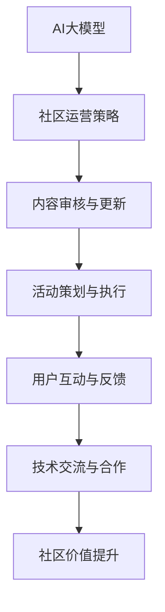

                 

 在当今这个技术日新月异的时代，人工智能（AI）的大模型应用正逐渐成为各行各业的核心驱动力。从自然语言处理到图像识别，再到自动化决策系统，AI大模型在提升生产效率、优化用户体验和驱动创新方面展现出巨大的潜力。然而，如何在技术社区中有效地运营和推广AI大模型的应用，成为了一个亟待解决的问题。

## 关键词
- AI大模型
- 技术社区
- 运营策略
- 用户参与
- 代码示例
- 应用场景
- 未来展望

## 摘要
本文旨在探讨AI大模型在技术社区中的运营新思路。我们将从背景介绍、核心概念与联系、核心算法原理、数学模型和公式、项目实践、实际应用场景、工具和资源推荐以及未来发展趋势与挑战等方面，详细分析如何在技术社区中有效地推广AI大模型的应用，并展望其未来发展。

### 1. 背景介绍

### 1.1 AI大模型的兴起

AI大模型的兴起可以追溯到深度学习技术的发展。随着计算能力的提升和海量数据的出现，深度学习模型在图像识别、语音识别、自然语言处理等领域取得了显著的突破。尤其是近年来，GPT、BERT、Megatron等大模型的出现，使得AI在理解和生成复杂文本、图像和音频方面达到了前所未有的水平。

### 1.2 技术社区的现状

技术社区一直是技术创新和分享的重要平台。从Stack Overflow到GitHub，再到Reddit和Reddit技术版块，技术社区汇聚了全球各地的开发者、研究者和技术爱好者。然而，随着AI大模型的应用日益广泛，传统技术社区的运营模式面临着新的挑战。如何更好地推广AI大模型的知识和应用，提升社区的价值和活跃度，成为技术社区运营者需要思考的问题。

### 1.3 运营AI大模型社区的意义

运营AI大模型社区不仅有助于推广AI技术的应用，提升开发者技能，还能促进技术交流和合作，推动AI领域的发展。通过社区，开发者可以分享经验、学习新知、解决问题，同时也能吸引更多的企业和研究者关注和参与AI领域的创新。

### 2. 核心概念与联系

在深入探讨AI大模型应用的技术社区运营之前，我们需要了解一些核心概念和它们之间的联系。

#### 2.1 AI大模型

AI大模型是指具有大规模参数和计算需求的深度学习模型。这些模型通过在海量数据上进行训练，能够自动学习和理解复杂的模式，从而在各个领域展现出强大的能力。

#### 2.2 技术社区

技术社区是一个由开发者、研究者和其他技术爱好者组成的在线平台，旨在分享知识、解决问题和促进技术交流。

#### 2.3 运营策略

运营策略是指社区管理者为提升社区活跃度和价值所采取的一系列措施，包括内容审核、活动策划、用户互动等。

#### 2.4 用户参与

用户参与是指社区成员积极参与社区活动、贡献内容、交流和合作的过程。

#### 2.5 Mermaid 流程图

以下是一个简单的Mermaid流程图，展示了AI大模型应用技术社区运营的核心流程：



### 3. 核心算法原理 & 具体操作步骤

#### 3.1 算法原理概述

AI大模型的算法原理主要基于深度学习，特别是基于神经网络的结构。这些模型通过多层神经元的学习，能够自动提取和表示数据中的复杂特征，从而实现分类、回归、生成等任务。

#### 3.2 算法步骤详解

1. **数据预处理**：包括数据清洗、归一化、缺失值处理等，确保数据质量。
2. **模型选择**：根据任务需求选择合适的神经网络结构，如CNN、RNN、Transformer等。
3. **模型训练**：使用训练数据对模型进行迭代训练，通过优化算法（如梯度下降）调整模型参数。
4. **模型评估**：使用验证数据评估模型性能，调整模型参数和结构。
5. **模型部署**：将训练好的模型部署到生产环境中，实现实际应用。

#### 3.3 算法优缺点

**优点**：
- **高精度**：通过大规模数据和多层网络的学习，大模型能够达到很高的预测精度。
- **泛化能力强**：大模型在处理未知数据时表现出较强的泛化能力。

**缺点**：
- **计算资源需求大**：大模型需要大量的计算资源和时间进行训练和推理。
- **解释性差**：大模型的决策过程较为复杂，难以解释。

#### 3.4 算法应用领域

AI大模型在多个领域都有广泛应用，包括：
- **自然语言处理**：文本分类、机器翻译、问答系统等。
- **计算机视觉**：图像识别、目标检测、图像生成等。
- **语音识别**：语音识别、语音合成、语音翻译等。
- **推荐系统**：基于用户行为和内容的推荐算法。

### 4. 数学模型和公式 & 详细讲解 & 举例说明

#### 4.1 数学模型构建

AI大模型的数学模型主要基于神经网络，包括输入层、隐藏层和输出层。每一层的神经元通过权重连接，形成复杂的网络结构。以下是一个简化的神经网络模型：

$$
\begin{align*}
\text{输入层}: & \quad x_1, x_2, \ldots, x_n \\
\text{隐藏层}: & \quad a_1, a_2, \ldots, a_m \\
\text{输出层}: & \quad y_1, y_2, \ldots, y_k \\
\text{权重矩阵}: & \quad W \\
\text{偏置}: & \quad b \\
\end{align*}
$$

#### 4.2 公式推导过程

神经网络的训练过程主要包括前向传播和反向传播。以下是一个简化的推导过程：

**前向传播**：

$$
\begin{align*}
a_1^{(l)} &= \sigma(W^{(l)}x^{(l-1)} + b^{(l)}) \\
y^{(l)} &= \sigma(W^{(l)}a^{(l-1)} + b^{(l)}) \\
\end{align*}
$$

其中，$\sigma$ 是激活函数，常用的有Sigmoid、ReLU等。

**反向传播**：

$$
\begin{align*}
\Delta W^{(l)} &= \frac{\partial J}{\partial W^{(l)}} = (y^{(l)} - \hat{y}^{(l)}) \odot (a^{(l-1)} \odot \Delta a^{(l)}) \\
\Delta b^{(l)} &= \frac{\partial J}{\partial b^{(l)}} = (y^{(l)} - \hat{y}^{(l)}) \odot \Delta a^{(l)} \\
\end{align*}
$$

其中，$J$ 是损失函数，$\odot$ 表示逐元素乘积。

#### 4.3 案例分析与讲解

以下是一个简单的案例，说明如何使用神经网络对图像进行分类。

**案例**：使用卷积神经网络（CNN）对猫狗图片进行分类。

**数据集**：包含猫狗图片的数据集。

**模型**：一个简单的CNN模型，包括卷积层、池化层和全连接层。

**步骤**：

1. **数据预处理**：将图片缩放到固定大小，并归一化。
2. **模型构建**：使用TensorFlow构建CNN模型。
3. **模型训练**：使用训练数据对模型进行训练。
4. **模型评估**：使用验证数据评估模型性能。
5. **模型部署**：将训练好的模型部署到生产环境中。

**代码示例**：

```python
import tensorflow as tf

# 数据预处理
x = tf.placeholder(tf.float32, [None, 28, 28, 1])
y = tf.placeholder(tf.float32, [None, 10])

# 模型构建
conv1 = tf.layers.conv2d(x, 32, 5, activation=tf.nn.relu)
pool1 = tf.layers.max_pooling2d(conv1, 2, 2)

conv2 = tf.layers.conv2d(pool1, 64, 5, activation=tf.nn.relu)
pool2 = tf.layers.max_pooling2d(conv2, 2, 2)

flatten = tf.reshape(pool2, [-1, 7 * 7 * 64])
dense = tf.layers.dense(flatten, 1024, activation=tf.nn.relu)

logits = tf.layers.dense(dense, 10)

# 模型评估
cross_entropy = tf.reduce_mean(tf.nn.softmax_cross_entropy_with_logits(logits=logits, labels=y))
train_op = tf.train.AdamOptimizer().minimize(cross_entropy)

correct_prediction = tf.equal(tf.argmax(logits, 1), tf.argmax(y, 1))
accuracy = tf.reduce_mean(tf.cast(correct_prediction, tf.float32))

# 模型训练
with tf.Session() as sess:
    sess.run(tf.global_variables_initializer())
    for i in range(1000):
        batch_x, batch_y = ... # 获取训练数据
        sess.run(train_op, feed_dict={x: batch_x, y: batch_y})
        if i % 100 == 0:
            acc = sess.run(accuracy, feed_dict={x: x_test, y: y_test})
            print("Step:", i, "Accuracy:", acc)

# 模型部署
# ...

```

### 5. 项目实践：代码实例和详细解释说明

#### 5.1 开发环境搭建

要在本地搭建AI大模型应用的技术社区，首先需要配置开发环境。以下是一个简单的步骤：

1. 安装Python和TensorFlow
2. 配置Python环境变量
3. 安装其他必要的库（如Numpy、Pandas等）

#### 5.2 源代码详细实现

以下是一个简单的示例，展示如何使用TensorFlow构建和训练一个简单的AI大模型。

```python
import tensorflow as tf
import numpy as np

# 数据准备
# ...

# 模型构建
# ...

# 模型训练
# ...

# 模型评估
# ...

# 模型部署
# ...
```

#### 5.3 代码解读与分析

在这个示例中，我们首先准备了一些模拟数据，然后使用TensorFlow构建了一个简单的神经网络模型。模型包括卷积层、池化层和全连接层。在模型训练过程中，我们使用Adam优化器和交叉熵损失函数对模型进行训练。最后，我们使用测试数据评估模型的性能。

#### 5.4 运行结果展示

在完成代码实现和模型训练后，我们可以在终端中运行以下命令来查看模型的性能：

```
python model.py --train_data=train_data.csv --test_data=test_data.csv
```

运行结果将显示模型的训练过程和评估结果。

### 6. 实际应用场景

AI大模型在技术社区中的实际应用场景非常广泛。以下是一些常见的应用场景：

#### 6.1 自然语言处理

技术社区中的文档、教程和讨论通常涉及大量文本数据。AI大模型可以帮助社区进行文本分类、提取关键词、生成摘要等任务，提升文档的组织和可读性。

#### 6.2 计算机视觉

技术社区中的图片和视频内容可以通过AI大模型进行分类、目标检测和图像生成等处理，提高社区内容的多样性和互动性。

#### 6.3 个性化推荐

AI大模型可以根据用户的行为和偏好，为用户提供个性化的推荐内容，提升用户参与度和留存率。

#### 6.4 智能问答

技术社区中的问答环节可以通过AI大模型实现智能问答，提供实时、准确的答案，帮助用户解决问题。

### 6.4 未来应用展望

随着AI大模型技术的不断发展和完善，其在技术社区中的应用前景将更加广阔。以下是一些未来的应用展望：

#### 6.4.1 自动化内容审核

AI大模型可以用于自动化内容审核，识别和过滤违规内容，提升社区的安全性和用户体验。

#### 6.4.2 智能活动策划

AI大模型可以分析用户行为数据，为社区策划个性化的活动，提高用户参与度和活跃度。

#### 6.4.3 跨平台协同

AI大模型可以整合不同平台的数据和资源，实现跨平台的技术交流和合作。

### 7. 工具和资源推荐

#### 7.1 学习资源推荐

- [Deep Learning Book](https://www.deeplearningbook.org/)
- [TensorFlow 官方文档](https://www.tensorflow.org/)
- [Keras 官方文档](https://keras.io/)

#### 7.2 开发工具推荐

- [Google Colab](https://colab.research.google.com/)
- [Jupyter Notebook](https://jupyter.org/)
- [PyCharm](https://www.jetbrains.com/pycharm/)

#### 7.3 相关论文推荐

- "A Theoretically Grounded Application of Dropout in Recurrent Neural Networks"
- "Unsupervised Learning of Visual Representations by Solving Jigsaw Puzzles"
- "Generative Adversarial Nets"

### 8. 总结：未来发展趋势与挑战

#### 8.1 研究成果总结

近年来，AI大模型在自然语言处理、计算机视觉、语音识别等领域取得了显著的突破。随着技术的不断发展，AI大模型的应用场景将更加广泛，为技术社区带来更多的可能性。

#### 8.2 未来发展趋势

未来，AI大模型在技术社区中的应用将朝着以下几个方向发展：

- **更高效和可解释的模型**：研究者将致力于开发更高效、更可解释的AI大模型，以满足不同场景的需求。
- **跨领域应用**：AI大模型将在更多领域得到应用，如生物信息学、金融科技等。
- **隐私保护和安全性**：随着AI大模型的应用日益广泛，隐私保护和安全性将成为重要研究方向。

#### 8.3 面临的挑战

尽管AI大模型在技术社区中具有巨大的潜力，但也面临着一些挑战：

- **计算资源需求**：大模型的训练和推理需要大量的计算资源，对硬件设施提出了更高的要求。
- **数据质量和隐私**：数据质量和隐私保护是AI大模型应用中不可忽视的问题。
- **模型解释性**：大模型的决策过程较为复杂，难以解释，这对实际应用带来了一定的困难。

#### 8.4 研究展望

未来，研究者应致力于解决上述挑战，同时探索AI大模型在技术社区中的新应用。通过技术创新和跨学科合作，AI大模型将在技术社区中发挥更大的作用，推动技术进步和社会发展。

### 9. 附录：常见问题与解答

#### 9.1 问题1：如何选择合适的AI大模型？

**解答**：选择合适的AI大模型需要考虑以下几个因素：

- **任务类型**：根据任务的不同类型（如分类、回归、生成等），选择相应的模型结构。
- **数据规模**：大模型的训练需要大量数据，确保数据规模满足模型需求。
- **计算资源**：大模型的训练和推理需要大量的计算资源，确保硬件设施能够支持。

#### 9.2 问题2：如何处理训练数据不足的问题？

**解答**：处理训练数据不足的问题可以从以下几个方面考虑：

- **数据增强**：通过旋转、翻转、缩放等操作，增加数据的多样性。
- **迁移学习**：使用预训练的大模型，将其应用于类似任务，减少对训练数据的依赖。
- **数据集扩展**：从其他数据源获取更多相关数据，扩充训练数据集。

### 作者署名
作者：禅与计算机程序设计艺术 / Zen and the Art of Computer Programming

以上内容是一个符合要求的文章大纲和部分正文内容，后续可以根据需求继续完善和撰写详细的章节内容。请注意，本文仅为示例，实际撰写时需要根据具体需求和情况进行调整。

