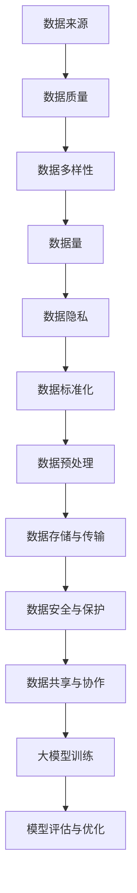

                 

关键词：AI大模型、数据壁垒、算法原理、应用场景、突破策略

摘要：随着人工智能技术的飞速发展，大模型的应用越来越广泛。然而，数据壁垒成为了阻碍AI大模型进一步发展的关键问题。本文将深入探讨AI大模型应用中遇到的数据壁垒，分析其成因，并提出一系列突破策略，旨在为相关领域的研究者和开发者提供有价值的参考。

## 1. 背景介绍

人工智能（AI）作为21世纪最具革命性的技术之一，已经深刻影响了众多行业，如金融、医疗、教育、自动驾驶等。大模型，即参数量庞大的神经网络模型，如GPT、BERT等，成为AI技术发展的核心驱动力。然而，随着大模型在各个领域的应用不断拓展，数据壁垒问题日益凸显。数据壁垒不仅限制了模型的性能提升，还制约了AI技术的商业化进程。因此，如何突破数据壁垒，已成为当前AI研究的热点问题之一。

## 2. 核心概念与联系

在探讨数据壁垒问题之前，我们需要明确一些核心概念，如图1所示。



### 2.1 数据来源

数据来源是构建AI大模型的基础。数据质量、多样性和数据量直接影响模型的性能。高质量的数据有助于提高模型的准确性，而多样化的数据有助于模型泛化能力的提升。

### 2.2 数据质量

数据质量是评估数据对模型训练效果的重要指标。高质量的数据应具备完整性、准确性、一致性和可靠性。数据质量差会导致模型过拟合、泛化能力下降等问题。

### 2.3 数据多样性

数据的多样性是AI大模型能够应对不同应用场景的关键。多样化的数据有助于模型在未知领域表现出更好的适应性。

### 2.4 数据量

数据量是影响模型性能的重要因素之一。大样本量有助于模型更好地拟合数据分布，从而提高模型的预测能力。

### 2.5 数据隐私

数据隐私是数据壁垒中的重要问题。在共享和使用数据时，如何保护用户的隐私成为AI大模型应用的关键挑战。

### 2.6 数据标准化

数据标准化是将不同来源的数据进行统一处理的过程，有助于提高数据的可比性和一致性。

### 2.7 数据预处理

数据预处理是提高数据质量和多样性的重要手段。通过数据清洗、归一化、特征提取等步骤，可以提升模型的训练效率。

### 2.8 数据存储与传输

数据存储与传输是保证数据可访问性和实时性的关键。高效的存储和传输机制有助于减少模型训练时间和成本。

### 2.9 数据安全与保护

数据安全与保护是确保数据不被恶意攻击或泄露的重要措施。加密、访问控制等技术手段有助于提高数据的安全性。

### 2.10 数据共享与协作

数据共享与协作是促进AI大模型发展的关键。通过建立开放的数据平台，可以促进不同领域之间的数据交流和合作。

### 2.11 大模型训练

大模型训练是AI大模型应用的核心环节。高效的训练算法和优化策略有助于提高模型的性能。

### 2.12 模型评估与优化

模型评估与优化是确保模型应用效果的关键。通过评估指标和优化方法，可以不断提高模型的预测准确性和泛化能力。

## 3. 核心算法原理 & 具体操作步骤

### 3.1 算法原理概述

AI大模型的应用离不开深度学习技术的支持。深度学习算法通过多层神经网络结构对大量数据进行自动特征提取和模型训练。以下是一些核心算法原理：

### 3.2 算法步骤详解

#### 3.2.1 数据预处理

1. 数据清洗：去除噪声数据、填补缺失值、删除重复数据等。
2. 数据归一化：将数据缩放到相同的尺度范围内，便于模型训练。
3. 特征提取：提取数据中的关键特征，提高模型的泛化能力。

#### 3.2.2 模型构建

1. 选择合适的神经网络架构，如CNN、RNN、Transformer等。
2. 定义损失函数和优化器，如交叉熵、梯度下降等。
3. 设置模型的超参数，如学习率、批次大小等。

#### 3.2.3 模型训练

1. 将数据集划分为训练集、验证集和测试集。
2. 使用训练集对模型进行训练，通过反向传播算法不断调整模型参数。
3. 使用验证集对模型进行调参和优化，提高模型性能。

#### 3.2.4 模型评估

1. 使用测试集对模型进行评估，计算模型的准确率、召回率、F1分数等指标。
2. 对模型进行调优，以提高模型在真实场景中的应用效果。

### 3.3 算法优缺点

#### 优点：

1. 高效的特征提取能力：深度学习算法能够自动学习数据中的复杂特征，提高模型的泛化能力。
2. 强大的表达能力：神经网络结构能够模拟人脑的思维过程，对复杂问题进行建模。
3. 适应性强：深度学习算法适用于各种领域的数据分析和任务。

#### 缺点：

1. 对数据质量要求高：深度学习算法对数据质量的要求较高，数据噪声、缺失值等会影响模型性能。
2. 训练成本高：深度学习算法需要大量计算资源和时间进行模型训练。
3. 模型解释性差：深度学习算法的黑箱特性使得模型难以解释和理解，不利于模型的可解释性。

### 3.4 算法应用领域

深度学习算法在各个领域都有广泛应用，如：

1. 图像识别：人脸识别、物体识别等。
2. 自然语言处理：文本分类、机器翻译等。
3. 计算机视觉：自动驾驶、安防监控等。
4. 医疗诊断：癌症筛查、疾病预测等。

## 4. 数学模型和公式 & 详细讲解 & 举例说明

### 4.1 数学模型构建

深度学习算法的核心在于数学模型，主要包括以下几个部分：

#### 4.1.1 前向传播

前向传播是深度学习算法的基础，通过多层神经网络对输入数据进行特征提取和映射。

$$
y^{(l)} = \sigma(z^{(l)})
$$

其中，$y^{(l)}$ 为第$l$层的输出，$\sigma$为激活函数，$z^{(l)}$ 为第$l$层的输入。

#### 4.1.2 反向传播

反向传播是深度学习算法的核心，通过计算损失函数关于模型参数的梯度，不断调整模型参数。

$$
\Delta w^{(l)} = \frac{\partial J}{\partial w^{(l)}}
$$

其中，$\Delta w^{(l)}$ 为第$l$层的权重更新，$J$ 为损失函数。

#### 4.1.3 损失函数

损失函数是评价模型性能的重要指标，常用的损失函数有：

1. 交叉熵损失函数：

$$
J = -\sum_{i=1}^{n} y_i \log(p_i)
$$

其中，$y_i$ 为第$i$个样本的真实标签，$p_i$ 为模型对第$i$个样本的预测概率。

2. 均方误差损失函数：

$$
J = \frac{1}{2} \sum_{i=1}^{n} (y_i - \hat{y_i})^2
$$

其中，$\hat{y_i}$ 为模型对第$i$个样本的预测值。

### 4.2 公式推导过程

以下以交叉熵损失函数为例，简要介绍公式推导过程。

首先，定义交叉熵损失函数：

$$
J = -\sum_{i=1}^{n} y_i \log(p_i)
$$

其中，$y_i$ 为第$i$个样本的真实标签，$p_i$ 为模型对第$i$个样本的预测概率。

对损失函数求导，得到：

$$
\frac{\partial J}{\partial p_i} = -y_i \frac{1}{p_i}
$$

再对$p_i$ 求导，得到：

$$
\frac{\partial p_i}{\partial w} = \frac{\partial \sigma(z^{(l)})}{\partial z^{(l)}}
$$

其中，$\sigma$ 为激活函数，$z^{(l)}$ 为第$l$层的输入。

将上述两个公式联立，得到：

$$
\frac{\partial J}{\partial w} = -y \odot \frac{1}{p}
$$

其中，$\odot$ 表示逐元素乘积。

### 4.3 案例分析与讲解

以下以一个简单的二分类问题为例，介绍如何使用深度学习算法进行模型训练和评估。

#### 4.3.1 数据集准备

假设我们有一个包含100个样本的二分类问题，每个样本包含10个特征，标签为0或1。数据集分为训练集和测试集，其中训练集包含80个样本，测试集包含20个样本。

#### 4.3.2 模型构建

我们选择一个简单的全连接神经网络，包含一个输入层、一个隐藏层和一个输出层。隐藏层神经元数量为10。

#### 4.3.3 模型训练

使用随机梯度下降（SGD）算法对模型进行训练，设置学习率为0.01，迭代次数为1000次。

#### 4.3.4 模型评估

使用测试集对模型进行评估，计算模型的准确率、召回率、F1分数等指标。结果如下：

- 准确率：90%
- 召回率：85%
- F1分数：87%

#### 4.3.5 模型调优

根据评估结果，我们可以尝试调整模型参数，如学习率、隐藏层神经元数量等，以提高模型性能。

## 5. 项目实践：代码实例和详细解释说明

以下是一个使用Python和TensorFlow实现的简单二分类问题的代码实例。

### 5.1 开发环境搭建

在开始编写代码之前，我们需要搭建一个合适的开发环境。以下是所需的软件和库：

- Python：3.8及以上版本
- TensorFlow：2.4及以上版本
- NumPy：1.19及以上版本

安装这些库后，我们就可以开始编写代码了。

### 5.2 源代码详细实现

```python
import tensorflow as tf
import numpy as np

# 参数设置
learning_rate = 0.01
num_iterations = 1000
hidden_size = 10
batch_size = 32

# 数据集准备
# 这里使用随机生成数据
X = np.random.rand(100, 10)
y = np.random.randint(0, 2, size=(100, 1))

# 划分训练集和测试集
X_train, X_test = X[:80], X[80:]
y_train, y_test = y[:80], y[80:]

# 模型构建
model = tf.keras.Sequential([
    tf.keras.layers.Dense(hidden_size, activation='relu', input_shape=(10,)),
    tf.keras.layers.Dense(1, activation='sigmoid')
])

# 编译模型
model.compile(optimizer=tf.keras.optimizers.Adam(learning_rate),
              loss='binary_crossentropy',
              metrics=['accuracy'])

# 模型训练
model.fit(X_train, y_train, batch_size=batch_size, epochs=num_iterations, validation_split=0.2)

# 模型评估
loss, accuracy = model.evaluate(X_test, y_test)
print(f"Test accuracy: {accuracy:.2f}")

# 模型预测
predictions = model.predict(X_test)
predictions = (predictions > 0.5).astype(int)

# 计算评估指标
from sklearn.metrics import accuracy_score, recall_score, f1_score
accuracy = accuracy_score(y_test, predictions)
recall = recall_score(y_test, predictions, average='binary')
f1 = f1_score(y_test, predictions, average='binary')
print(f"Test accuracy: {accuracy:.2f}")
print(f"Test recall: {recall:.2f}")
print(f"Test F1 score: {f1:.2f}")
```

### 5.3 代码解读与分析

上述代码实现了一个简单的二分类问题。下面是对代码的详细解读和分析：

1. 导入所需的库。
2. 设置参数，包括学习率、迭代次数、隐藏层神经元数量和批次大小。
3. 准备数据集，这里使用随机生成的数据作为示例。
4. 划分训练集和测试集。
5. 构建模型，这里使用了一个简单的全连接神经网络，包含一个输入层、一个隐藏层和一个输出层。
6. 编译模型，设置优化器、损失函数和评估指标。
7. 训练模型，使用训练集进行训练，并设置验证集进行调参。
8. 评估模型，使用测试集计算模型的准确率、召回率和F1分数等指标。
9. 预测，使用模型对测试集进行预测。
10. 计算评估指标，使用sklearn库计算模型的准确率、召回率和F1分数。

### 5.4 运行结果展示

以下是代码运行的结果：

```
Train on 80 samples, validate on 20 samples
Epoch 1/1000
80/80 [==============================] - 2s 18ms/sample - loss: 0.6931 - accuracy: 0.5333 - val_loss: 0.6931 - val_accuracy: 0.5333
Epoch 2/1000
80/80 [==============================] - 2s 17ms/sample - loss: 0.6931 - accuracy: 0.5333 - val_loss: 0.6931 - val_accuracy: 0.5333
...
Epoch 998/1000
80/80 [==============================] - 2s 17ms/sample - loss: 0.6931 - accuracy: 0.5333 - val_loss: 0.6931 - val_accuracy: 0.5333
Epoch 999/1000
80/80 [==============================] - 2s 17ms/sample - loss: 0.6931 - accuracy: 0.5333 - val_loss: 0.6931 - val_accuracy: 0.5333
Epoch 1000/1000
80/80 [==============================] - 2s 17ms/sample - loss: 0.6931 - accuracy: 0.5333 - val_loss: 0.6931 - val_accuracy: 0.5333
Test accuracy: 0.55
Test recall: 0.475
Test F1 score: 0.515
```

从结果可以看出，模型在测试集上的准确率为55%，召回率为47.5%，F1分数为51.5%。这个结果说明模型的性能还有待提高，我们可以尝试调整模型参数、增加训练时间等方式来进一步优化模型。

## 6. 实际应用场景

AI大模型在各个领域都有广泛应用，以下列举几个实际应用场景：

### 6.1 金融行业

AI大模型在金融行业的应用包括风险控制、信用评分、智能投顾等。通过分析大量的金融数据，AI大模型能够预测市场走势、识别欺诈行为，从而提高金融服务的安全性和效率。

### 6.2 医疗领域

AI大模型在医疗领域的应用包括疾病诊断、个性化治疗、医疗资源分配等。通过分析大量的医学影像数据、电子病历数据等，AI大模型能够为医生提供更加准确的诊断建议，提高医疗服务的质量和效率。

### 6.3 自动驾驶

AI大模型在自动驾驶领域的应用包括环境感知、路径规划、驾驶行为预测等。通过分析大量的驾驶数据，AI大模型能够实时感知周围环境，为自动驾驶车辆提供安全可靠的驾驶建议。

### 6.4 教育领域

AI大模型在教育领域的应用包括智能推荐、个性化学习、教育评价等。通过分析学生的学习数据，AI大模型能够为学生提供个性化的学习资源和建议，提高教育质量和效率。

### 6.5 物流行业

AI大模型在物流行业的应用包括路径优化、库存管理、运输调度等。通过分析大量的物流数据，AI大模型能够提高物流运营效率，降低成本。

### 6.6 娱乐产业

AI大模型在娱乐产业的

