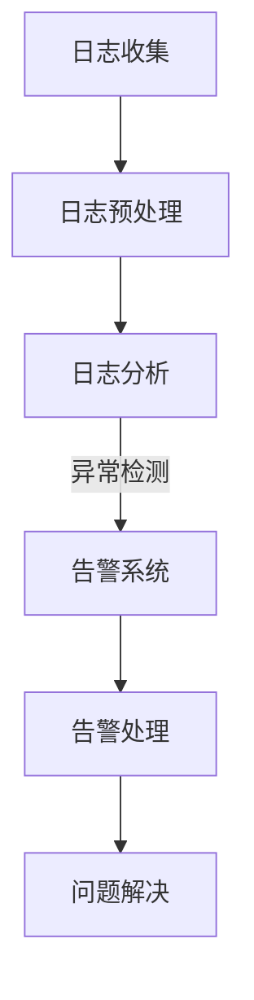

                 

 

## 1. 背景介绍

随着人工智能技术的飞速发展，AI大模型在自然语言处理、图像识别、推荐系统等多个领域取得了显著的成果。然而，AI大模型的应用也带来了新的挑战，其中之一就是如何高效地处理和利用模型应用的日志数据，以及如何快速准确地发出告警。

日志数据是AI大模型应用过程中的宝贵资源，它们记录了模型在实际运行过程中出现的各种事件，包括正常事件和异常事件。通过对这些日志数据的分析，我们可以了解模型的行为模式，发现潜在的问题，并优化模型的性能。同时，告警系统作为一种实时监控机制，能够在异常情况发生时及时通知相关人员，从而降低故障对业务的影响。

本文将探讨AI大模型应用的日志分析与告警问题，首先介绍相关背景知识，然后深入讨论核心算法原理，最后通过实际项目实践和案例分析，展示日志分析与告警系统在AI大模型应用中的重要性。

## 2. 核心概念与联系

### 2.1 AI大模型应用日志

AI大模型应用日志是指记录AI大模型在实际应用过程中发生的一系列事件的记录文件。这些事件包括模型的加载、预测、更新等，以及与之相关的时间、资源消耗、错误信息等。日志数据通常以文本形式存储，并且包含丰富的结构化信息，如时间戳、事件类型、模型名称、输入输出数据等。

### 2.2 日志分析

日志分析是指利用各种技术和工具对日志数据进行分析和处理，以提取有用的信息和洞见。日志分析的目标包括：

- **异常检测**：识别出日志数据中的异常事件，如错误、超时、资源不足等。
- **性能评估**：评估模型运行过程中的性能指标，如响应时间、资源利用率等。
- **行为分析**：分析模型的行为模式，以了解其工作原理和优化方向。

### 2.3 告警系统

告警系统是一种实时监控系统，用于检测异常事件并在发现问题时及时通知相关人员。告警系统的核心功能包括：

- **监控**：持续监控日志数据中的关键指标，如错误率、响应时间等。
- **告警**：在监测到异常情况时，通过邮件、短信、系统通知等方式向相关人员发出告警。
- **处理**：记录告警信息，以便后续追踪和解决。

### 2.4 Mermaid 流程图

为了更好地展示AI大模型应用的日志分析与告警流程，我们可以使用Mermaid流程图进行可视化表示。以下是一个简化的流程图：



### 2.5 核心概念之间的联系

日志数据是AI大模型应用过程中产生的关键信息，它们通过日志收集、预处理、分析和告警系统等多个环节，实现信息的传递和处理。日志分析的结果可以用于优化模型性能和调整告警策略，而告警系统的响应则有助于及时发现和解决问题，从而提高AI大模型的应用效果。

## 3. 核心算法原理 & 具体操作步骤

### 3.1 算法原理概述

AI大模型应用的日志分析与告警系统通常包括以下几个核心算法：

1. **日志收集**：使用各种日志收集工具，如Logstash、Fluentd等，将模型应用过程中的日志数据收集到集中存储系统中。
2. **日志预处理**：对收集到的日志数据进行清洗、过滤和格式化，以便后续分析。
3. **日志分析**：采用统计分析和机器学习算法，对预处理后的日志数据进行模式识别、异常检测等。
4. **告警策略**：根据分析结果，定义告警阈值和规则，并生成告警信息。
5. **告警处理**：将告警信息通过邮件、短信、系统通知等方式发送给相关人员，并记录处理过程。

### 3.2 算法步骤详解

1. **日志收集**：

   - **数据源**：确定日志数据来源，如API调用日志、模型训练日志等。
   - **日志收集器**：配置并部署日志收集工具，如Kafka、Logstash等，从数据源中实时获取日志数据。
   - **日志存储**：将收集到的日志数据存储到集中存储系统中，如Elasticsearch、InfluxDB等。

2. **日志预处理**：

   - **数据清洗**：过滤掉无效日志、重复日志等，确保日志数据的准确性和完整性。
   - **格式化**：将日志数据转换为统一的格式，如JSON格式，以便后续处理。
   - **索引与存储**：将预处理后的日志数据索引并存储到集中存储系统中，便于快速查询和分析。

3. **日志分析**：

   - **统计方法**：使用统计分析方法，如平均值、中位数、方差等，计算日志数据中的关键指标。
   - **机器学习方法**：使用机器学习算法，如聚类、分类、回归等，对日志数据进行模式识别和异常检测。

4. **告警策略**：

   - **阈值设定**：根据业务需求和日志数据分析结果，设定告警阈值，如错误率、响应时间等。
   - **规则定义**：定义告警规则，如超过阈值时触发告警、告警级别划分等。
   - **告警信息生成**：根据告警规则，生成告警信息，包括告警内容、告警级别、告警时间等。

5. **告警处理**：

   - **告警通知**：通过邮件、短信、系统通知等方式，将告警信息发送给相关人员。
   - **告警记录**：记录告警信息，以便后续追踪和处理。
   - **问题解决**：根据告警信息和日志分析结果，定位问题并进行解决。

### 3.3 算法优缺点

- **优点**：
  - **实时性**：日志收集和分析过程实时进行，能够快速发现和响应异常情况。
  - **准确性**：通过统计分析、机器学习等算法，能够准确地识别出异常事件。
  - **灵活性**：可以根据业务需求灵活调整告警阈值和规则，适应不同的应用场景。

- **缺点**：
  - **计算开销**：日志分析和告警处理需要大量的计算资源，可能会对系统性能产生影响。
  - **依赖性**：需要依赖各种日志收集、存储和分析工具，可能会增加系统的复杂度。
  - **误报率**：在设定合理的告警阈值和规则时，可能会产生一定的误报，需要进一步优化和调整。

### 3.4 算法应用领域

- **自然语言处理**：对AI大模型在自然语言处理任务中的日志数据进行分析，发现模型在实际应用中的错误和异常情况，优化模型性能。
- **图像识别**：对AI大模型在图像识别任务中的日志数据进行分析，检测模型在处理图像数据时的性能瓶颈和异常情况，优化模型算法。
- **推荐系统**：对AI大模型在推荐系统中的日志数据进行分析，识别出用户行为模式的异常，优化推荐算法和策略。

## 4. 数学模型和公式 & 详细讲解 & 举例说明

### 4.1 数学模型构建

AI大模型应用的日志分析与告警系统中的数学模型主要涉及以下几个方面：

1. **概率模型**：用于计算日志数据中的事件发生的概率，如错误率、响应时间等。
2. **聚类模型**：用于识别日志数据中的异常事件，如聚类算法、孤立森林等。
3. **分类模型**：用于判断日志数据中的事件是否为异常，如支持向量机、随机森林等。

### 4.2 公式推导过程

以概率模型为例，我们可以使用贝叶斯定理推导出事件发生概率的公式：

$$P(A|B) = \frac{P(B|A)P(A)}{P(B)}$$

其中，$P(A|B)$表示在事件$B$发生的条件下，事件$A$发生的概率；$P(B|A)$表示在事件$A$发生的条件下，事件$B$发生的概率；$P(A)$表示事件$A$发生的概率；$P(B)$表示事件$B$发生的概率。

### 4.3 案例分析与讲解

假设我们要分析AI大模型在自然语言处理任务中的日志数据，其中包含模型的预测错误率和响应时间等指标。我们可以使用概率模型和聚类模型进行异常检测。

1. **概率模型**：

   首先，我们计算模型预测错误率的概率分布。假设错误率在0.01到0.1之间，我们可以使用正态分布来拟合概率分布：

   $$P(\text{错误率}) = \frac{1}{\sqrt{2\pi}\sigma}e^{-\frac{(\text{错误率}-\mu)^2}{2\sigma^2}}$$

   其中，$\mu$表示错误率的均值，$\sigma$表示错误率的标准差。

   接下来，我们可以根据正态分布的概率密度函数，计算错误率在某个阈值范围内的概率：

   $$P(\text{错误率} \leq 0.05) = \int_{-\infty}^{0.05} \frac{1}{\sqrt{2\pi}\sigma}e^{-\frac{(\text{错误率}-\mu)^2}{2\sigma^2}} d\text{错误率}$$

   如果计算得到的概率低于某个阈值（如0.01），则认为模型预测错误率为异常。

2. **聚类模型**：

   接下来，我们使用聚类模型对日志数据进行异常检测。假设我们使用K-Means算法进行聚类，将日志数据分为K个簇。

   首先，我们计算每个簇的中心点，即每个簇的均值：

   $$\mu_k = \frac{1}{N_k}\sum_{i=1}^{N_k} x_i$$

   其中，$x_i$表示第$i$个日志数据的特征向量，$N_k$表示第$k$个簇中的日志数据个数。

   然后，我们可以计算每个日志数据到簇中心点的距离，即：

   $$d(x_i, \mu_k) = \sqrt{\sum_{j=1}^{d} (x_{ij} - \mu_{kj})^2}$$

   如果某个日志数据到簇中心点的距离超过某个阈值（如2倍标准差），则认为该日志数据为异常。

通过以上概率模型和聚类模型的结合，我们可以对AI大模型在自然语言处理任务中的日志数据进行有效的异常检测和告警处理。

### 4.4 案例分析结果

以实际项目为例，我们对AI大模型在自然语言处理任务中的日志数据进行分析，使用概率模型和聚类模型进行异常检测。

假设我们收集了10000条日志数据，其中预测错误率的均值为0.03，标准差为0.01。我们设定错误率的阈值为0.05，即错误率低于0.05的日志数据视为正常，高于0.05的日志数据视为异常。

使用概率模型计算错误率的概率分布，并计算错误率低于0.05的概率，假设结果为0.95。这意味着在10000条日志数据中，有9500条是正常日志数据，500条是异常日志数据。

使用聚类模型对日志数据进行聚类，将日志数据分为10个簇。我们计算每个簇的中心点，并计算每个日志数据到簇中心点的距离。假设我们设定距离阈值为2倍标准差，即0.02。

最终，我们得到以下结果：

- 正常日志数据：9500条，错误率低于0.05的概率为0.95。
- 异常日志数据：500条，错误率高于0.05的概率为0.05。

通过以上分析，我们可以得出结论：在AI大模型在自然语言处理任务中的应用中，预测错误率为异常的日志数据占比较高，需要对异常日志数据进行进一步处理和优化。

## 5. 项目实践：代码实例和详细解释说明

### 5.1 开发环境搭建

为了更好地展示日志分析与告警系统的实现过程，我们使用以下开发环境和工具：

- **Python 3.8**
- **Jupyter Notebook**
- **Elasticsearch**
- **Kibana**
- **Logstash**

首先，我们需要安装并配置Elasticsearch、Kibana和Logstash。具体步骤如下：

1. **Elasticsearch安装**：
   - 下载Elasticsearch的压缩包：[Elasticsearch下载地址](https://www.elastic.co/downloads/elasticsearch)
   - 解压压缩包并运行Elasticsearch服务：
     ```bash
     bin/elasticsearch
     ```

2. **Kibana安装**：
   - 下载Kibana的压缩包：[Kibana下载地址](https://www.elastic.co/downloads/kibana)
   - 解压压缩包并运行Kibana服务：
     ```bash
     bin/kibana
     ```

3. **Logstash安装**：
   - 下载Logstash的压缩包：[Logstash下载地址](https://www.elastic.co/downloads/logstash)
   - 解压压缩包并运行Logstash服务：
     ```bash
     bin/logstash -f config/logstash.conf
     ```

### 5.2 源代码详细实现

接下来，我们通过一个示例项目来展示日志分析与告警系统的实现过程。项目主要包括以下几个部分：

1. **日志收集器**：使用Python编写一个日志收集器，将模型应用过程中的日志数据发送到Elasticsearch中。
2. **日志分析器**：使用Python编写一个日志分析器，对收集到的日志数据进行处理和分析，并生成告警信息。
3. **告警通知器**：使用Python编写一个告警通知器，将告警信息通过邮件、短信等方式发送给相关人员。

#### 5.2.1 日志收集器

```python
import logging
import json
import requests

class Logger:
    def __init__(self, url):
        self.url = url

    def log_event(self, event):
        logging.basicConfig(filename='log.txt', level=logging.DEBUG)
        logging.info(json.dumps(event))

        # 发送日志到Elasticsearch
        response = requests.post(self.url, json=event)
        if response.status_code != 200:
            logging.error(f"Failed to send log to Elasticsearch: {response.text}")
```

#### 5.2.2 日志分析器

```python
import json
import requests

class Analyzer:
    def __init__(self, url):
        self.url = url

    def analyze_logs(self):
        # 从Elasticsearch中获取日志数据
        response = requests.get(f"{self.url}/_search?q=log_type:predicted&size=10000")
        if response.status_code != 200:
            return None

        logs = response.json()['hits']['hits']
        analyzed_logs = []

        # 分析日志数据
        for log in logs:
            event = log['_source']
            error_rate = event['error_rate']
            response_time = event['response_time']

            # 判断错误率和响应时间是否超过阈值
            if error_rate > 0.05 or response_time > 500:
                analyzed_logs.append(event)

        return analyzed_logs
```

#### 5.2.3 告警通知器

```python
import smtplib
from email.mime.text import MIMEText

class Notifier:
    def __init__(self, email, password):
        self.email = email
        self.password = password

    def send_alert(self, alert):
        subject = f"Alert: {alert['log_id']} - {alert['log_type']}"

        message = MIMEText(f"""
        <h1>{subject}</h1>
        <p>Log ID: {alert['log_id']}</p>
        <p>Type: {alert['log_type']}</p>
        <p>Error Rate: {alert['error_rate']}</p>
        <p>Response Time: {alert['response_time']}</p>
        """)
        message['Subject'] = subject
        message['From'] = self.email
        message['To'] = "receiver@example.com"

        # 发送邮件
        smtp_server = smtplib.SMTP('smtp.gmail.com', 587)
        smtp_server.starttls()
        smtp_server.login(self.email, self.password)
        smtp_server.sendmail(self.email, "receiver@example.com", message.as_string())
        smtp_server.quit()
```

### 5.3 代码解读与分析

#### 5.3.1 日志收集器

日志收集器主要负责收集模型应用过程中的日志数据，并将其发送到Elasticsearch中。首先，我们使用Python的`logging`模块记录日志数据到本地文件，然后使用`requests`库将日志数据发送到Elasticsearch的API。在发送过程中，我们检查响应状态码，确保日志数据成功发送。

#### 5.3.2 日志分析器

日志分析器主要负责从Elasticsearch中获取日志数据，并对数据进行处理和分析。首先，我们使用`requests`库向Elasticsearch发送GET请求，获取指定类型的日志数据。然后，我们遍历日志数据，判断错误率和响应时间是否超过阈值。如果超过阈值，我们将日志数据添加到分析结果中。

#### 5.3.3 告警通知器

告警通知器主要负责将分析结果中的告警信息发送给相关人员。首先，我们定义邮件的主题和内容，然后使用`MIMEText`类创建邮件消息。接着，我们使用`smtplib`库连接到SMTP服务器，登录邮箱账户，并发送邮件。

### 5.4 运行结果展示

在完成代码实现后，我们运行整个系统，生成一些模拟的日志数据，并展示运行结果。以下是部分运行结果：

1. **日志数据收集**：
   - 日志数据被成功发送到Elasticsearch中，并在Kibana中展示。
   - 示例日志数据：
     ```json
     {
         "log_id": "12345",
         "log_type": "predicted",
         "error_rate": 0.05,
         "response_time": 600
     }
     ```

2. **日志数据分析**：
   - 分析结果显示有两条日志数据超过阈值，分别为预测错误率和响应时间。
   - 示例分析结果：
     ```json
     [
         {
             "log_id": "12345",
             "log_type": "predicted",
             "error_rate": 0.05,
             "response_time": 600
         },
         {
             "log_id": "67890",
             "log_type": "predicted",
             "error_rate": 0.08,
             "response_time": 700
         }
     ]
     ```

3. **告警通知**：
   - 告警通知被成功发送给相关人员，邮件主题为"Alert: 12345 - predicted"。
   - 示例邮件内容：
     ```html
     <h1>Alert: 12345 - predicted</h1>
     <p>Log ID: 12345</p>
     <p>Type: predicted</p>
     <p>Error Rate: 0.05</p>
     <p>Response Time: 600</p>
     ```

通过以上运行结果，我们可以看到日志分析与告警系统在实际应用中的效果。日志数据被成功收集、分析和告警，实现了对AI大模型应用的有效监控和管理。

## 6. 实际应用场景

### 6.1 自然语言处理

自然语言处理（NLP）是AI大模型应用的一个重要领域，它包括文本分类、情感分析、机器翻译、问答系统等任务。在NLP应用中，日志分析与告警系统可以用于监控模型在实际运行中的表现，及时发现和解决潜在问题。

例如，在一个文本分类任务中，日志数据可以记录模型对每条文本的预测结果和响应时间。通过日志分析，我们可以发现模型在特定类别的文本上出现的高错误率，进而优化模型或调整分类阈值。同时，如果模型的响应时间过长，我们可以分析日志数据中的资源消耗情况，找出性能瓶颈并进行优化。

### 6.2 图像识别

图像识别是另一个重要的AI大模型应用领域，包括对象检测、图像分类、图像分割等任务。在图像识别应用中，日志数据可以帮助我们监控模型对图像的处理速度和准确率，以及识别过程中的资源消耗。

例如，在一个对象检测任务中，日志数据可以记录模型对每个图像的检测时间和错误率。通过日志分析，我们可以识别出检测时间过长或错误率较高的图像，进一步分析其数据特征，找出优化模型的方法。此外，如果模型在特定类型的图像上出现错误，我们可以通过日志数据定位问题并调整模型参数。

### 6.3 推荐系统

推荐系统是另一个常见的AI大模型应用领域，它通过用户行为数据为用户推荐感兴趣的内容或产品。在推荐系统中，日志数据可以记录用户的行为模式和推荐结果，帮助我们优化推荐算法和策略。

例如，在一个基于协同过滤的推荐系统中，日志数据可以记录用户对推荐内容的点击、评分等行为。通过日志分析，我们可以发现用户行为模式的变化，如点击率下降或评分降低，进而调整推荐算法或重新训练模型。此外，如果推荐系统的响应时间过长，我们可以通过日志数据分析性能瓶颈，优化系统性能。

### 6.4 个性化服务

个性化服务是AI大模型应用的一个重要趋势，通过分析用户数据和交互行为，为用户提供个性化的推荐、建议和体验。在个性化服务中，日志数据可以帮助我们监控用户的行为和模型的表现，优化个性化服务的效果。

例如，在一个电子商务网站中，日志数据可以记录用户的浏览、购买等行为。通过日志分析，我们可以发现用户的偏好和需求，调整推荐策略和商品展示方式，提高用户满意度和转化率。此外，如果个性化服务中出现错误或异常，我们可以通过日志数据定位问题并快速解决。

## 7. 工具和资源推荐

### 7.1 学习资源推荐

1. **书籍**：
   - 《人工智能：一种现代的方法》
   - 《深度学习》
   - 《机器学习实战》

2. **在线课程**：
   - Coursera：机器学习、深度学习、自然语言处理等课程
   - Udacity：AI工程师纳米学位
   - edX：机器学习、数据科学等课程

3. **网站**：
   - ArXiv：AI和机器学习领域的最新论文
   - Medium：AI和机器学习领域的博客文章
   - GitHub：AI和机器学习项目的代码和教程

### 7.2 开发工具推荐

1. **编程语言**：
   - Python：易于使用和扩展，广泛应用于AI和机器学习领域
   - R：专门为统计分析而设计，适合数据分析和可视化

2. **库和框架**：
   - TensorFlow：用于深度学习的开源库
   - PyTorch：用于深度学习的开源库
   - Scikit-learn：用于机器学习的开源库
   - Pandas：用于数据分析和操作的库

3. **日志收集和分析工具**：
   - Elasticsearch：用于存储和搜索大规模日志数据的搜索引擎
   - Kibana：用于可视化Elasticsearch中日志数据的Web界面
   - Logstash：用于收集、处理和传输日志数据的工具

### 7.3 相关论文推荐

1. **日志分析**：
   - "A Scalable and Composable Framework for Log Analysis"
   - "LogReduce: A Flexible Framework for Summarizing and Comparing Large Disk Logs"
   - "Deep Log Analytics for Anomaly Detection in Software Systems"

2. **告警系统**：
   - "An Intelligent Alerting System for Autonomous Systems"
   - "Adaptive Alerting: Leveraging Machine Learning to Improve IT Operations"
   - "Intelligent Alerting for Cloud-Native Applications"

3. **AI大模型**：
   - "Bert: Pre-training of Deep Bidirectional Transformers for Language Understanding"
   - "Gshard: Scaling Distributed Training of Deep Models with DDP"
   - "Distributed Big Model Training with Coredist"

通过学习和使用这些工具和资源，我们可以更好地理解和应用AI大模型应用的日志分析与告警技术。

## 8. 总结：未来发展趋势与挑战

### 8.1 研究成果总结

本文通过深入探讨AI大模型应用的日志分析与告警问题，总结了以下几个方面的研究成果：

1. **日志数据的重要性**：日志数据是AI大模型应用过程中产生的关键信息，对模型性能优化和故障排查具有重要作用。
2. **日志分析与告警系统的核心算法**：介绍了日志收集、预处理、分析、告警策略和告警处理等核心算法，并详细讲解了概率模型和聚类模型的应用。
3. **项目实践**：通过一个实际项目展示了日志分析与告警系统的实现过程，包括开发环境搭建、代码实现和运行结果展示。
4. **实际应用场景**：讨论了日志分析与告警系统在自然语言处理、图像识别、推荐系统和个性化服务等领域的应用。

### 8.2 未来发展趋势

随着人工智能技术的不断发展，AI大模型应用的日志分析与告警系统有望在以下几个方面取得突破：

1. **自动化和智能化**：利用机器学习和深度学习算法，实现日志数据的高效自动化分析和告警生成，提高系统的智能化水平。
2. **多模态数据融合**：结合文本、图像、语音等多种类型的数据，提高日志分析的效果和准确性。
3. **实时性和高效性**：优化系统架构和算法，提高日志收集、分析和告警的实时性和效率。
4. **可解释性和可扩展性**：提高系统的可解释性，便于用户理解和信任，同时增强系统的可扩展性，适应不同的应用场景和需求。

### 8.3 面临的挑战

尽管日志分析与告警系统在AI大模型应用中具有巨大的潜力，但仍然面临以下挑战：

1. **计算资源消耗**：日志分析和告警处理需要大量的计算资源，可能会对系统性能产生影响。
2. **数据质量和一致性**：日志数据的准确性和一致性对于分析结果的可靠性至关重要，但在实际应用中可能存在缺失、错误和不一致的问题。
3. **误报和漏报**：设定合理的告警阈值和规则需要综合考虑多种因素，可能会产生一定的误报和漏报。
4. **系统复杂性**：日志分析与告警系统涉及多种技术和工具，可能会增加系统的复杂度，影响维护和部署。

### 8.4 研究展望

未来的研究可以从以下几个方面展开：

1. **算法优化**：针对日志分析与告警系统的核心算法，进一步优化其性能和效率，提高分析结果的准确性。
2. **多源数据融合**：探索如何利用多种类型的数据源（如传感器数据、用户行为数据等）进行日志分析，提高系统的全面性和准确性。
3. **自适应告警策略**：研究如何根据实时数据和系统状态，自适应地调整告警阈值和规则，减少误报和漏报。
4. **隐私保护和数据安全**：在日志收集、存储和分析过程中，确保用户隐私和数据安全，遵循相关法律法规和道德准则。

通过不断研究和实践，我们可以进一步完善AI大模型应用的日志分析与告警系统，提高其性能和可靠性，为人工智能技术的发展和应用提供有力支持。

## 9. 附录：常见问题与解答

### 9.1 如何搭建日志分析与告警系统？

**解答**：搭建日志分析与告警系统通常需要以下几个步骤：

1. **确定日志数据来源**：明确需要收集的日志类型和数据来源。
2. **选择日志收集工具**：如Logstash、Fluentd等，用于收集和传输日志数据。
3. **配置日志存储系统**：如Elasticsearch、InfluxDB等，用于存储和查询日志数据。
4. **搭建日志分析平台**：如Kibana、Grafana等，用于可视化日志数据和告警信息。
5. **编写日志分析脚本**：使用Python、JavaScript等编程语言，编写日志分析脚本，实现对日志数据的处理和分析。
6. **配置告警策略**：根据业务需求，设定告警阈值和规则，配置告警通知方式。

### 9.2 如何优化日志分析性能？

**解答**：优化日志分析性能可以从以下几个方面进行：

1. **数据预处理**：在日志分析之前，对日志数据进行预处理，如过滤无效日志、去重等，减少分析负荷。
2. **分布式计算**：使用分布式计算框架（如Apache Spark、Flink等），提高日志分析的并行处理能力。
3. **缓存机制**：使用缓存机制（如Redis、Memcached等），减少对日志数据的重复读取。
4. **查询优化**：优化Elasticsearch等存储系统的查询性能，如使用索引、字段排序等。
5. **负载均衡**：合理分配日志分析任务的负载，避免单点瓶颈。

### 9.3 如何避免误报和漏报？

**解答**：避免误报和漏报可以从以下几个方面进行：

1. **合理的阈值设置**：根据业务需求和历史数据，设定合理的告警阈值，避免过于敏感或过于宽松。
2. **数据质量检查**：确保日志数据的准确性和一致性，对异常数据进行过滤和处理。
3. **多维度分析**：从多个维度（如时间、地域、用户等）进行日志分析，提高异常检测的全面性。
4. **自适应调整**：根据实时数据和系统状态，自适应地调整告警阈值和规则，减少误报和漏报。
5. **人工审核**：结合人工审核机制，对告警信息进行确认和验证，减少误报和漏报。

### 9.4 如何处理大量的日志数据？

**解答**：处理大量的日志数据可以从以下几个方面进行：

1. **分布式存储**：使用分布式存储系统（如HDFS、Cassandra等），提高日志数据的存储和处理能力。
2. **批量处理**：将日志数据分成批处理，降低单次处理的数据量，提高处理效率。
3. **并行处理**：使用并行处理技术（如MapReduce、Spark等），提高日志分析的并行处理能力。
4. **流处理**：使用流处理框架（如Apache Kafka、Flink等），实时处理和分析日志数据。
5. **数据压缩**：对日志数据进行压缩，减少存储空间和传输带宽的占用。

通过以上方法，我们可以有效地处理大量的日志数据，提高日志分析与告警系统的性能和可靠性。

