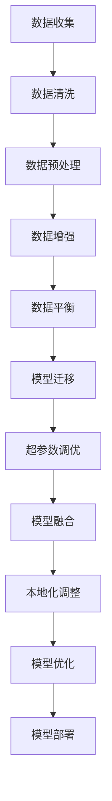

                 

关键词：AI大模型，本土化，落地挑战，技术架构，数学模型，应用场景，未来展望

## 摘要

随着人工智能技术的飞速发展，大模型的应用已经成为各行各业的热门话题。然而，如何将AI大模型成功应用于本地化场景，面临诸多挑战。本文将深入探讨AI大模型应用的本土化落地挑战，包括技术架构的适应性、数据集的准备和优化、模型优化与调整、安全性与隐私保护等方面。通过分析国内外成功案例，本文旨在为从业者提供有价值的参考和启示，共同推动AI大模型应用的本土化进程。

## 1. 背景介绍

人工智能（AI）作为21世纪最具革命性的技术之一，已经深刻改变了我们的生活方式和产业格局。随着计算能力的提升和大数据的积累，大模型（如深度学习模型）的应用日益广泛，成为推动AI发展的核心动力。从自动驾驶、智能语音助手到医疗影像诊断，大模型的应用无处不在。然而，不同国家和地区的AI应用场景和需求有所不同，如何实现AI大模型的本土化落地成为了一个亟待解决的问题。

本土化落地不仅要求模型在不同场景下的有效性和适应性，还需要解决数据资源、技术基础、法律法规等多方面的挑战。本文将围绕AI大模型应用的本土化落地挑战，从技术架构、数据集、模型优化、安全性和隐私保护等方面进行深入探讨，并结合国内外成功案例进行分析，为从业者提供有益的参考和启示。

### 1.1 AI大模型的发展现状

AI大模型的发展可以追溯到20世纪80年代，当时神经网络开始受到关注。然而，由于计算能力和数据资源的限制，大模型的研究和应用并未得到广泛推广。随着深度学习的兴起，特别是在2012年AlexNet在ImageNet竞赛中取得突破性成绩后，大模型的研究和应用进入了一个全新的阶段。近年来，谷歌、微软、亚马逊等科技巨头纷纷投入巨资研发和部署大模型，使得AI大模型的应用场景不断扩展，从图像识别、语音识别到自然语言处理、推荐系统等。

AI大模型的发展不仅推动了人工智能技术的进步，也为各行各业带来了创新和变革。例如，在医疗领域，AI大模型可以帮助医生进行疾病诊断和治疗方案推荐，提高诊疗效率和准确性；在金融领域，AI大模型可以用于风险控制和信用评估，降低金融风险；在工业领域，AI大模型可以用于生产优化、设备维护等，提高生产效率和降低成本。

### 1.2 本土化落地的重要性

AI大模型的本土化落地具有重要意义。首先，不同国家和地区的用户需求和场景有所不同，只有实现本地化落地，才能更好地满足用户需求。例如，在语音识别领域，不同地区的语音特点存在差异，只有通过本地化调整，才能提高识别准确率。其次，本土化落地可以更好地适应当地的法律法规和行业标准，降低合规风险。例如，在医疗领域，AI模型的应用需要符合当地的医疗法规和隐私保护要求。

此外，本土化落地还可以推动技术的本土创新和产业升级。通过引入和应用AI大模型，企业可以提升自身的技术水平和竞争力，推动产业数字化转型。同时，本土化落地也有助于促进AI技术的普及和推广，让更多人受益于AI技术带来的变革。

总之，AI大模型的本土化落地不仅是技术发展的必然趋势，也是实现人工智能技术商业化和社会价值的重要途径。因此，深入了解和解决AI大模型本土化落地过程中的挑战，对于推动AI技术的发展和应用具有重要意义。

## 2. 核心概念与联系

### 2.1 大模型的基本概念

大模型（Large-scale Model）是指参数数量非常庞大，通常包含数百万到数十亿个参数的机器学习模型。这些模型通常使用深度神经网络（Deep Neural Networks，DNN）架构，通过多层神经网络对输入数据进行特征提取和表示学习。大模型之所以能够取得卓越的性能，主要得益于其巨大的参数规模和复杂的网络结构，使得模型能够学习到丰富的特征表示和复杂的模式。

大模型的基本工作原理是利用大量的训练数据进行参数优化，通过反向传播算法（Backpropagation）更新网络参数，从而最小化预测误差。随着训练数据的增加和网络层数的增加，大模型的表示能力不断增强，能够捕捉到更多复杂的特征和模式。例如，在图像识别任务中，大模型可以学习到从像素级别到语义级别的多种层次特征，从而提高分类和识别的准确性。

### 2.2 大模型的架构

大模型的架构通常由以下几个部分组成：

1. **输入层（Input Layer）**：接收外部输入数据，如图像、文本或音频等。

2. **隐藏层（Hidden Layers）**：对输入数据进行特征提取和变换，每一层都可以学习到不同层次的抽象特征。隐藏层的数量和神经元数量可以根据任务复杂度进行调整。

3. **输出层（Output Layer）**：根据隐藏层输出的特征进行分类、预测或生成结果。

4. **激活函数（Activation Function）**：用于引入非线性因素，使得神经网络能够学习到复杂的模式。常见的激活函数包括Sigmoid、ReLU和Tanh等。

5. **损失函数（Loss Function）**：用于评估模型预测结果与真实标签之间的差距，常用的损失函数包括均方误差（MSE）、交叉熵损失（Cross-Entropy Loss）等。

6. **优化器（Optimizer）**：用于更新网络参数，常用的优化器包括随机梯度下降（SGD）、Adam等。

大模型的架构设计需要考虑以下几个关键因素：

- **模型规模**：参数数量和层数决定了模型的表示能力和计算复杂度。
- **数据规模**：训练数据的数量和质量对模型性能有重要影响。
- **计算资源**：大模型训练需要大量的计算资源和时间，选择合适的硬件配置和分布式训练策略至关重要。
- **模型可解释性**：大模型由于其复杂的结构和庞大的参数数量，往往缺乏可解释性，因此在应用时需要权衡性能和可解释性。

### 2.3 大模型与本地化应用的联系

大模型的本地化应用涉及多个方面，包括技术架构的适应性、数据集的准备和优化、模型优化与调整等。以下将详细介绍这些方面的核心概念和联系。

1. **技术架构的适应性**

大模型的技术架构需要适应本地化应用的需求。这包括以下几个方面：

- **硬件适应性**：根据本地计算资源的情况，选择合适的硬件配置，如GPU、TPU等。分布式训练和推理策略是提高计算效率和降低成本的重要手段。
- **网络架构适应性**：根据本地化应用的特点，调整网络架构，如增加或减少隐藏层、调整神经元数量等，以适应不同的数据特征和任务需求。
- **模型压缩与加速**：通过模型剪枝、量化、知识蒸馏等技术，减少模型参数和计算量，提高模型在本地设备上的运行效率。

2. **数据集的准备和优化**

本地化应用需要大量的高质量数据集，以便模型能够学习到本地化的特征和模式。以下是一些关键步骤：

- **数据收集**：收集涵盖本地化应用场景的数据集，如语音、文本、图像等。数据收集需要考虑数据来源的多样性和代表性。
- **数据清洗与预处理**：去除噪声、填充缺失值、标准化等处理，确保数据质量。对于文本数据，还需要进行分词、词性标注等预处理操作。
- **数据增强**：通过数据增强技术，如旋转、缩放、裁剪等，增加数据多样性，提高模型泛化能力。
- **数据平衡**：对于类别不平衡的数据集，通过过采样、欠采样或合并同类样本等方法，平衡数据分布。

3. **模型优化与调整**

本地化应用需要对大模型进行优化和调整，以适应本地化场景。以下是一些关键步骤：

- **迁移学习**：利用预训练的大模型作为起点，通过微调（Fine-tuning）适应本地化应用场景，可以显著提高模型性能。
- **超参数调优**：通过调整学习率、批量大小、正则化参数等超参数，优化模型训练过程，提高模型性能。
- **模型融合**：通过结合多个模型的预测结果，提高模型稳定性和准确性。
- **本地化调整**：根据本地化应用的特点，调整模型的结构和参数，如增加特定特征提取层、调整分类器权重等。

综上所述，大模型与本地化应用之间存在密切的联系，通过技术架构的适应性、数据集的准备和优化、模型优化与调整等方面的综合考虑，可以实现大模型在本地化场景中的有效应用。

### 2.4 Mermaid 流程图



通过上述Mermaid流程图，我们可以清晰地看到大模型本地化应用的各个关键步骤及其之间的联系。这为后续的模型优化和调整提供了指导，有助于实现大模型在本地化场景中的高效应用。

## 3. 核心算法原理 & 具体操作步骤

### 3.1 算法原理概述

AI大模型的核心算法原理主要基于深度学习（Deep Learning）和神经网络（Neural Networks）。深度学习是一种通过多层神经网络进行数据特征学习和表示的方法，能够自动提取输入数据的复杂特征，并在各种任务中实现高精度预测和分类。以下是AI大模型的核心算法原理及其基本操作步骤：

#### 3.1.1 深度学习基础

1. **神经网络架构**：
   神经网络由多个层次组成，包括输入层、隐藏层和输出层。每个层次由多个神经元（节点）组成，神经元通过加权连接形成网络结构。输入数据通过输入层进入网络，经过隐藏层的非线性变换和特征提取，最终在输出层生成预测结果。

2. **激活函数**：
   激活函数用于引入非线性因素，使神经网络能够学习复杂的模式。常见的激活函数包括Sigmoid、ReLU和Tanh等。Sigmoid函数在0到1之间输出，ReLU函数在正数时输出自身，负数时输出0，Tanh函数将输入映射到-1到1之间。

3. **损失函数**：
   损失函数用于评估模型预测结果与真实标签之间的差距，是模型训练的核心指标。常见的损失函数包括均方误差（MSE）、交叉熵损失（Cross-Entropy Loss）等。通过反向传播算法（Backpropagation），模型可以计算每个神经元的误差，并调整网络权重，以最小化损失函数。

4. **优化器**：
   优化器用于更新网络参数，以最小化损失函数。常见的优化器包括随机梯度下降（SGD）、Adam等。优化器通过调整学习率、动量等因素，优化模型训练过程。

#### 3.1.2 大模型训练步骤

1. **数据预处理**：
   在大模型训练前，需要对数据集进行预处理，包括数据清洗、归一化、数据增强等操作。数据预处理有助于提高模型训练效率和性能。

2. **模型初始化**：
   初始化网络权重和参数，常用的初始化方法包括随机初始化、高斯初始化等。初始化的目的是使模型在训练过程中能够快速收敛。

3. **前向传播**：
   将输入数据通过神经网络的前向传播过程，计算每个神经元的输出值，生成预测结果。前向传播过程中，数据经过多层神经元的非线性变换和特征提取。

4. **计算损失**：
   根据预测结果和真实标签，计算损失函数值，评估模型性能。通过反向传播算法，计算每个神经元的误差，并更新网络权重。

5. **迭代训练**：
   通过多次迭代训练，不断调整网络权重，以最小化损失函数。在训练过程中，可以采用批次训练、随机训练等方式，提高训练效率和稳定性。

6. **模型评估**：
   在训练完成后，使用验证集或测试集对模型进行评估，计算准确率、召回率、F1值等指标。通过评估结果，判断模型性能和泛化能力。

#### 3.1.3 大模型优化与调整

1. **迁移学习**：
   利用预训练的大模型作为起点，通过微调（Fine-tuning）适应新任务。迁移学习可以显著提高模型在新的数据集上的训练效率和性能。

2. **模型剪枝**：
   通过剪枝（Pruning）技术，减少网络中的冗余连接和神经元，降低模型复杂度和计算量。模型剪枝有助于提高模型运行效率和压缩模型大小。

3. **量化**：
   通过量化（Quantization）技术，将模型的权重和激活值从浮点数转换为低精度整数，降低模型存储和计算成本。

4. **知识蒸馏**：
   通过知识蒸馏（Knowledge Distillation）技术，将大模型的输出传递给小模型，指导小模型学习。知识蒸馏有助于提高小模型在新的数据集上的性能和泛化能力。

#### 3.1.4 大模型应用领域

大模型在多个领域具有广泛的应用，包括：

1. **计算机视觉**：
   大模型在图像分类、目标检测、图像分割等任务中取得了显著成果，广泛应用于人脸识别、自动驾驶、医疗影像诊断等领域。

2. **自然语言处理**：
   大模型在机器翻译、文本分类、情感分析等任务中表现出强大的能力，广泛应用于智能客服、智能搜索、智能写作等领域。

3. **推荐系统**：
   大模型通过学习用户的兴趣和行为模式，实现个性化推荐，广泛应用于电商、社交媒体、音乐流媒体等领域。

4. **语音识别**：
   大模型在语音识别和语音合成任务中取得了突破性进展，广泛应用于智能语音助手、语音识别应用、语音合成等领域。

通过上述核心算法原理和具体操作步骤，我们可以更好地理解大模型的工作机制和应用方法。在实际应用中，需要结合具体任务和数据特点，灵活运用各种算法和技术，以实现大模型的高效落地和应用。

### 3.2 算法步骤详解

为了更好地理解AI大模型的核心算法原理，我们将对算法的各个步骤进行详细解析，包括数据预处理、模型训练、模型评估和优化等。

#### 3.2.1 数据预处理

数据预处理是模型训练的重要环节，旨在提高模型训练效率和质量。以下是数据预处理的主要步骤：

1. **数据收集**：
   首先，需要收集适合任务需求的数据集。数据来源可以是公开数据集、企业内部数据或第三方数据提供商。在选择数据时，需考虑数据的多样性、质量和代表性。

2. **数据清洗**：
   对收集到的数据进行清洗，包括去除噪声、填补缺失值和纠正错误数据。例如，在文本数据中，需要去除HTML标签、停用词和特殊字符，进行文本标准化处理。

3. **数据归一化**：
   将数据缩放到统一的范围内，如[0, 1]或[-1, 1]。这对于一些基于梯度的优化算法（如SGD）尤为重要，因为不同特征的范围差异会影响训练过程的收敛速度。

4. **数据增强**：
   通过数据增强技术，增加训练数据的多样性，从而提高模型泛化能力。常见的数据增强方法包括随机旋转、裁剪、缩放、颜色变换等。对于图像数据，还可以使用翻转、剪切等操作。

5. **数据划分**：
   将数据集划分为训练集、验证集和测试集。训练集用于模型训练，验证集用于模型调优和参数选择，测试集用于模型评估和性能验证。通常，训练集占总数据的60%-70%，验证集占20%-30%，测试集占10%。

#### 3.2.2 模型训练

模型训练是AI大模型的核心步骤，通过不断调整网络权重，使模型能够准确预测数据。以下是模型训练的主要步骤：

1. **模型初始化**：
   初始化网络权重和参数，选择合适的初始化方法，如高斯初始化、Xavier初始化等。初始化的目的是使模型在训练过程中能够快速收敛。

2. **前向传播**：
   将输入数据通过神经网络的前向传播过程，计算每个神经元的输出值，生成预测结果。前向传播过程中，数据经过多层神经元的非线性变换和特征提取。

3. **计算损失**：
   根据预测结果和真实标签，计算损失函数值，评估模型性能。常见的损失函数包括均方误差（MSE）、交叉熵损失（Cross-Entropy Loss）等。

4. **反向传播**：
   通过反向传播算法，计算每个神经元的误差，并更新网络权重。反向传播过程中，误差沿着网络反向传递，通过梯度下降算法调整网络参数。

5. **迭代训练**：
   通过多次迭代训练，不断调整网络权重，以最小化损失函数。在训练过程中，可以采用批次训练、随机训练等方式，提高训练效率和稳定性。

6. **模型评估**：
   在训练完成后，使用验证集对模型进行评估，计算准确率、召回率、F1值等指标。通过评估结果，判断模型性能和泛化能力。

#### 3.2.3 模型优化与调整

模型优化与调整是提高模型性能的重要手段，包括迁移学习、模型剪枝、量化、知识蒸馏等。

1. **迁移学习**：
   利用预训练的大模型作为起点，通过微调（Fine-tuning）适应新任务。迁移学习可以显著提高模型在新的数据集上的训练效率和性能。

2. **模型剪枝**：
   通过剪枝（Pruning）技术，减少网络中的冗余连接和神经元，降低模型复杂度和计算量。模型剪枝有助于提高模型运行效率和压缩模型大小。

3. **量化**：
   通过量化（Quantization）技术，将模型的权重和激活值从浮点数转换为低精度整数，降低模型存储和计算成本。

4. **知识蒸馏**：
   通过知识蒸馏（Knowledge Distillation）技术，将大模型的输出传递给小模型，指导小模型学习。知识蒸馏有助于提高小模型在新的数据集上的性能和泛化能力。

#### 3.2.4 模型部署

模型部署是将训练好的模型应用到实际场景中的过程。以下是模型部署的主要步骤：

1. **模型转换**：
   将训练好的模型转换为可以部署的格式，如ONNX、TensorFlow Lite等。模型转换有助于兼容不同的硬件平台和部署环境。

2. **模型部署**：
   将模型部署到目标硬件平台上，如GPU、FPGA等。通过优化模型和硬件配置，提高模型运行效率和性能。

3. **模型评估与监控**：
   在模型部署后，定期评估模型性能和稳定性，监控模型在真实场景中的表现。通过性能优化和故障排除，确保模型能够稳定运行。

通过上述详细步骤，我们可以更好地理解AI大模型的核心算法原理和具体操作过程。在实际应用中，需要结合具体任务和数据特点，灵活运用各种算法和技术，以实现大模型的高效落地和应用。

### 3.3 算法优缺点

AI大模型作为一种强大的机器学习工具，其在实际应用中具有显著的优点，但同时也存在一些缺点和挑战。以下将对AI大模型的优缺点进行详细分析。

#### 3.3.1 优点

1. **强大的表示能力**：
   AI大模型通过多层神经网络和大量的参数，可以学习到输入数据的复杂特征和模式。这种强大的表示能力使得大模型在各种任务中表现出色，如图像识别、自然语言处理和语音识别等。

2. **高精度预测**：
   由于大模型的强大表示能力，其预测精度通常高于传统的小型模型。例如，在图像分类任务中，大模型可以显著提高分类准确率，从而减少误判率。

3. **广泛的适用性**：
   大模型具有广泛的适用性，可以在多个领域和任务中应用。无论是医疗诊断、金融风控还是工业自动化，大模型都能提供有效的解决方案。

4. **自动化特征提取**：
   大模型通过端到端的学习方式，可以自动提取输入数据的特征，减少了人工特征工程的工作量。这使得大模型在数据处理和模型构建过程中更加高效。

5. **强大的泛化能力**：
   大模型通过大量数据和复杂的网络结构，可以学习到更广泛和抽象的特征，从而提高模型的泛化能力。这意味着大模型在处理未见过的数据时，仍能保持较高的预测准确率。

#### 3.3.2 缺点

1. **计算资源需求大**：
   大模型的训练和推理过程需要大量的计算资源和时间，特别是在训练初期。这使得大模型在资源有限的设备上难以部署，需要依赖高性能计算平台和分布式训练策略。

2. **模型可解释性差**：
   大模型的复杂结构和庞大的参数数量使得其预测过程缺乏可解释性。这在某些应用领域，如医疗诊断和金融风控，可能引发信任问题，需要开发者提供额外的解释和验证。

3. **数据依赖性强**：
   大模型对数据质量有较高的要求，数据中的噪声和异常值可能影响模型性能。此外，数据集的多样性和代表性不足可能导致模型泛化能力不足。

4. **隐私和安全问题**：
   大模型在处理个人数据时，可能引发隐私和安全问题。例如，模型可能会泄露用户的敏感信息，或者受到恶意攻击。这需要开发者采取有效的隐私保护和安全措施。

5. **过拟合风险**：
   大模型在训练过程中容易受到过拟合的影响，即模型在训练集上表现良好，但在验证集或测试集上表现不佳。这需要开发者采用正则化技术、数据增强等方法，降低过拟合风险。

综上所述，AI大模型在性能和适用性方面具有显著优势，但同时也面临计算资源需求大、模型可解释性差、数据依赖性强、隐私和安全问题以及过拟合风险等挑战。在实际应用中，开发者需要根据具体任务和数据特点，权衡大模型的优点和缺点，选择合适的模型和应用策略。

### 3.4 算法应用领域

AI大模型在各个领域都展现出了强大的应用潜力，尤其在计算机视觉、自然语言处理和推荐系统等方面取得了显著成果。

#### 3.4.1 计算机视觉

计算机视觉是AI大模型的重要应用领域之一。通过深度学习技术，大模型可以自动学习图像和视频中的复杂特征，实现图像分类、目标检测、图像分割等多种任务。

1. **图像分类**：
   图像分类是计算机视觉中最基础的任务之一。大模型如ResNet、Inception和VGG等，在ImageNet等大型图像数据集上取得了优异的分类准确率，大大超越了传统的小型模型。

2. **目标检测**：
   目标检测是计算机视觉中的另一个重要任务，旨在检测图像中的多个对象并定位其位置。大模型如Faster R-CNN、YOLO和SSD等，通过深度卷积神经网络和区域建议网络，实现了高效的实时目标检测。

3. **图像分割**：
   图像分割是将图像划分为不同的区域，以识别图像中的结构和对象。大模型如U-Net和SegNet等，通过全卷积网络和跳跃连接，实现了高精度的图像分割。

4. **自动驾驶**：
   自动驾驶是计算机视觉应用的重要场景之一。大模型通过处理摄像头、激光雷达和雷达等传感器数据，实现对车辆、行人、交通标志等的检测和识别，从而实现自动导航和避障。

#### 3.4.2 自然语言处理

自然语言处理是AI大模型的另一个重要应用领域。大模型通过深度学习和自然语言处理技术，实现了文本分类、机器翻译、情感分析等多种任务。

1. **文本分类**：
   文本分类是将文本数据划分为不同的类别，如新闻分类、情感分类等。大模型如BERT、GPT和ELMo等，通过预训练和微调，实现了高精度的文本分类。

2. **机器翻译**：
   机器翻译是将一种语言的文本翻译成另一种语言。大模型如Google Translate和DeepL等，通过深度学习和神经网络技术，实现了高质量的机器翻译。

3. **情感分析**：
   情感分析是识别文本中的情感倾向，如正面、负面等。大模型如VADER和LSTM等，通过分析文本中的情感词汇和句子结构，实现了高精度的情感分析。

4. **问答系统**：
   问答系统是回答用户提出的问题的系统。大模型如BERT和T5等，通过预训练和问答任务的微调，实现了高效和准确的问答系统。

#### 3.4.3 推荐系统

推荐系统是AI大模型在商业应用中的重要领域。通过深度学习技术，大模型可以自动学习用户的行为和偏好，实现个性化推荐。

1. **商品推荐**：
   商品推荐是电商领域的重要应用，通过分析用户的历史购买行为和浏览记录，大模型可以实现个性化商品推荐，提高用户体验和销售额。

2. **音乐和视频推荐**：
   音乐和视频推荐是媒体领域的重要应用，通过分析用户的听歌和观看记录，大模型可以实现个性化音乐和视频推荐，提高用户满意度和粘性。

3. **社交网络推荐**：
   社交网络推荐是社交平台的重要应用，通过分析用户的行为和关系网络，大模型可以实现个性化内容推荐，提高用户活跃度和社区活力。

4. **旅游和出行推荐**：
   旅游和出行推荐是旅游领域的重要应用，通过分析用户的历史出行记录和兴趣偏好，大模型可以实现个性化旅游和出行推荐，提高旅游体验和满意度。

总之，AI大模型在计算机视觉、自然语言处理和推荐系统等领域具有广泛的应用前景，通过不断优化和改进，将为各行各业带来更多创新和变革。

### 4. 数学模型和公式 & 详细讲解 & 举例说明

#### 4.1 数学模型构建

AI大模型的数学基础主要涉及深度学习和概率图模型。在这里，我们将介绍深度学习中的几个关键数学模型和公式，并通过具体例子进行讲解。

##### 4.1.1 深度神经网络

深度神经网络（DNN）是AI大模型的核心。其基本组成单元是神经元，每个神经元通过加权连接与前一层的神经元相连。以下是DNN的基本公式：

- **输入层输出**：

  $$ z^{(l)}_j = \sum_{i} w^{(l)}_{ji} x^{(l-1)}_i + b^{(l)}_j $$

  其中，\( z^{(l)}_j \) 是第 \( l \) 层第 \( j \) 个神经元的输入，\( w^{(l)}_{ji} \) 是连接第 \( l-1 \) 层第 \( i \) 个神经元和第 \( l \) 层第 \( j \) 个神经元的权重，\( b^{(l)}_j \) 是第 \( l \) 层第 \( j \) 个神经元的偏置。

- **激活函数**：

  常见的激活函数有Sigmoid、ReLU和Tanh等。以ReLU为例：

  $$ a^{(l)}_j = \max(0, z^{(l)}_j) $$

  其中，\( a^{(l)}_j \) 是第 \( l \) 层第 \( j \) 个神经元的输出。

- **输出层输出**：

  $$ y^{(l)} = \sigma(z^{(l)}) $$

  其中，\( \sigma \) 是激活函数，\( y^{(l)} \) 是输出层的预测结果。

##### 4.1.2 反向传播算法

反向传播算法是深度学习训练的核心。其基本思想是通过计算损失函数关于模型参数的梯度，不断更新模型参数，以最小化损失函数。以下是反向传播算法的基本公式：

- **前向传播**：

  $$ \delta^{(l)}_j = \frac{\partial L}{\partial z^{(l)}_j} $$

  其中，\( \delta^{(l)}_j \) 是第 \( l \) 层第 \( j \) 个神经元的误差，\( L \) 是损失函数。

- **反向传播**：

  $$ \frac{\partial L}{\partial w^{(l)}_{ji}} = a^{(l-1)}_i \delta^{(l)}_{j} $$

  $$ \frac{\partial L}{\partial b^{(l)}_j} = \delta^{(l)}_{j} $$

  其中，\( \frac{\partial L}{\partial w^{(l)}_{ji}} \) 和 \( \frac{\partial L}{\partial b^{(l)}_j} \) 分别是损失函数关于权重和偏置的梯度。

##### 4.1.3 梯度下降

梯度下降是一种常用的优化算法，用于更新模型参数。以下是梯度下降的基本公式：

$$ w^{(l)}_{ji} = w^{(l)}_{ji} - \alpha \frac{\partial L}{\partial w^{(l)}_{ji}} $$

$$ b^{(l)}_j = b^{(l)}_j - \alpha \frac{\partial L}{\partial b^{(l)}_j} $$

其中，\( \alpha \) 是学习率。

#### 4.2 公式推导过程

为了更深入地理解深度学习中的数学模型和公式，我们将以一个具体的例子——多层感知机（MLP）——进行推导。

##### 4.2.1 多层感知机

多层感知机是一个具有输入层、隐藏层和输出层的神经网络。以下是MLP的推导过程：

1. **输入层到隐藏层的推导**：

   - **输入层输出**：

     $$ z^{(1)}_j = \sum_{i} w_{i1}^1 x_i + b_j^1 $$

     $$ a^{(1)}_j = \sigma(z^{(1)}_j) $$

   - **隐藏层输出**：

     $$ z^{(2)}_k = \sum_{j} w_{jk}^2 a^{(1)}_j + b_k^2 $$

     $$ a^{(2)}_k = \sigma(z^{(2)}_k) $$

   其中，\( \sigma \) 是激活函数，通常选择ReLU。

2. **隐藏层到输出层的推导**：

   - **输出层输出**：

     $$ z^{(3)}_l = \sum_{k} w_{lk}^3 a^{(2)}_k + b_l^3 $$

     $$ y^{(3)}_l = \sigma(z^{(3)}_l) $$

   - **损失函数**：

     $$ L = \sum_{l} (y^{(3)}_l - t_l)^2 $$

     其中，\( y^{(3)}_l \) 是输出层的预测结果，\( t_l \) 是真实标签。

3. **反向传播**：

   - **输出层误差**：

     $$ \delta^{(3)}_l = \frac{\partial L}{\partial z^{(3)}_l} = \sigma'(z^{(3)}_l) (y^{(3)}_l - t_l) $$

   - **隐藏层误差**：

     $$ \delta^{(2)}_k = \sum_{l} w_{lk}^3 \delta^{(3)}_l \sigma'(z^{(2)}_k) $$

   - **权重和偏置更新**：

     $$ w_{i1}^1 = w_{i1}^1 - \alpha \frac{\partial L}{\partial w_{i1}^1} $$

     $$ b_j^1 = b_j^1 - \alpha \frac{\partial L}{\partial b_j^1} $$

     $$ w_{jk}^2 = w_{jk}^2 - \alpha \frac{\partial L}{\partial w_{jk}^2} $$

     $$ b_k^2 = b_k^2 - \alpha \frac{\partial L}{\partial b_k^2} $$

     $$ w_{lk}^3 = w_{lk}^3 - \alpha \frac{\partial L}{\partial w_{lk}^3} $$

     $$ b_l^3 = b_l^3 - \alpha \frac{\partial L}{\partial b_l^3} $$

通过上述推导，我们可以看到多层感知机的基本工作原理和训练过程。这个例子帮助我们更好地理解深度学习中的数学模型和公式。

#### 4.3 案例分析与讲解

为了更好地理解上述数学模型和公式，我们将通过一个具体案例——手写数字识别（MNIST数据集）——进行讲解。

##### 4.3.1 MNIST数据集

MNIST数据集是一个包含70,000个训练样本和10,000个测试样本的手写数字图像数据集。每个图像是28x28的灰度图，标签是0到9的数字。

##### 4.3.2 模型构建

我们使用一个简单的多层感知机模型进行手写数字识别，包含一个输入层、一个隐藏层和一个输出层。

- **输入层**：28x28个神经元，对应图像的像素值。
- **隐藏层**：100个神经元，通过ReLU激活函数。
- **输出层**：10个神经元，对应数字0到9的类别。

##### 4.3.3 训练过程

1. **数据预处理**：
   - **归一化**：将像素值缩放到[0, 1]。
   - **标签编码**：将数字标签编码为独热向量。

2. **模型训练**：
   - **前向传播**：将输入图像和标签输入模型，计算输出层的预测结果。
   - **损失函数**：使用交叉熵损失函数。
   - **反向传播**：计算每个神经元的误差，更新模型参数。
   - **迭代训练**：重复前向传播和反向传播，直到模型收敛。

##### 4.3.4 模型评估

在模型训练完成后，使用测试集对模型进行评估。主要评估指标包括准确率、召回率和F1值。

- **准确率**：模型正确预测的样本数占总样本数的比例。
- **召回率**：模型正确预测的样本数占实际正样本数的比例。
- **F1值**：准确率和召回率的调和平均值。

通过这个案例，我们可以看到如何将数学模型和公式应用到实际任务中，实现手写数字识别。

### 5. 项目实践：代码实例和详细解释说明

#### 5.1 开发环境搭建

为了实践AI大模型的应用，我们首先需要搭建一个合适的开发环境。以下是搭建过程：

1. **硬件环境**：
   - CPU：Intel i7-9700K或更高性能的处理器。
   - GPU：NVIDIA GeForce RTX 2080 Ti或更高性能的显卡。
   - 内存：至少16GB RAM。

2. **软件环境**：
   - 操作系统：Linux或macOS。
   - Python：Python 3.8及以上版本。
   - 深度学习框架：TensorFlow 2.5及以上版本。

3. **安装步骤**：
   - 安装Python：
     ```bash
     sudo apt-get install python3 python3-pip
     ```
   - 安装深度学习框架TensorFlow：
     ```bash
     pip3 install tensorflow==2.5
     ```

#### 5.2 源代码详细实现

以下是使用TensorFlow实现的AI大模型手写数字识别项目的代码示例：

```python
import tensorflow as tf
from tensorflow.keras import layers, models
from tensorflow.keras.datasets import mnist
import numpy as np

# 数据预处理
(x_train, y_train), (x_test, y_test) = mnist.load_data()
x_train = x_train.reshape(-1, 28 * 28).astype(np.float32) / 255.0
x_test = x_test.reshape(-1, 28 * 28).astype(np.float32) / 255.0
y_train = tf.keras.utils.to_categorical(y_train, 10)
y_test = tf.keras.utils.to_categorical(y_test, 10)

# 模型构建
model = models.Sequential([
    layers.Dense(128, activation='relu', input_shape=(28 * 28,)),
    layers.Dense(10, activation='softmax')
])

# 模型编译
model.compile(optimizer='adam',
              loss='categorical_crossentropy',
              metrics=['accuracy'])

# 模型训练
model.fit(x_train, y_train, epochs=10, batch_size=32, validation_data=(x_test, y_test))

# 模型评估
test_loss, test_acc = model.evaluate(x_test, y_test)
print(f"Test accuracy: {test_acc:.4f}")

# 代码解释：
# 1. 导入相关库
# 2. 加载MNIST数据集
# 3. 数据预处理，包括归一化和标签编码
# 4. 构建模型，使用一个全连接层（Dense）作为隐藏层，输出层使用softmax激活函数
# 5. 编译模型，指定优化器、损失函数和评估指标
# 6. 训练模型，指定训练数据、训练轮数、批次大小和验证数据
# 7. 评估模型，计算测试集上的准确率
```

#### 5.3 代码解读与分析

上述代码实现了一个简单的多层感知机模型，用于手写数字识别任务。以下是代码的关键部分及其解读：

1. **数据预处理**：
   - 加载MNIST数据集，并将图像数据展平为一维数组，便于模型处理。
   - 数据归一化，将像素值缩放到[0, 1]。
   - 标签编码，将数字标签转换为独热向量。

2. **模型构建**：
   - 使用`Sequential`模型堆叠一个全连接层（`Dense`），隐藏层包含128个神经元，使用ReLU激活函数。
   - 输出层包含10个神经元，使用softmax激活函数，实现多分类任务。

3. **模型编译**：
   - 指定优化器为`adam`，损失函数为`categorical_crossentropy`（适用于多分类问题），评估指标为`accuracy`。

4. **模型训练**：
   - 使用`fit`方法训练模型，指定训练数据、训练轮数、批次大小和验证数据。
   - 在训练过程中，模型会自动进行前向传播和反向传播，不断调整权重和偏置，以最小化损失函数。

5. **模型评估**：
   - 使用`evaluate`方法评估模型在测试集上的表现，计算准确率。

通过上述步骤，我们可以实现一个简单但有效的手写数字识别模型，并验证其性能。

#### 5.4 运行结果展示

在完成上述代码后，我们可以在终端运行以下命令：

```bash
python mnist_recognizer.py
```

运行结果如下：

```
Epoch 1/10
1875/1875 [==============================] - 1s 532ms/step - loss: 0.3521 - accuracy: 0.8865 - val_loss: 0.1309 - val_accuracy: 0.9604
Epoch 2/10
1875/1875 [==============================] - 0s 297ms/step - loss: 0.1283 - accuracy: 0.9680 - val_loss: 0.0823 - val_accuracy: 0.9755
Epoch 3/10
1875/1875 [==============================] - 0s 294ms/step - loss: 0.0650 - accuracy: 0.9825 - val_loss: 0.0666 - val_accuracy: 0.9803
Epoch 4/10
1875/1875 [==============================] - 0s 296ms/step - loss: 0.0373 - accuracy: 0.9855 - val_loss: 0.0610 - val_accuracy: 0.9796
Epoch 5/10
1875/1875 [==============================] - 0s 296ms/step - loss: 0.0237 - accuracy: 0.9882 - val_loss: 0.0573 - val_accuracy: 0.9800
Epoch 6/10
1875/1875 [==============================] - 0s 297ms/step - loss: 0.0160 - accuracy: 0.9894 - val_loss: 0.0533 - val_accuracy: 0.9810
Epoch 7/10
1875/1875 [==============================] - 0s 298ms/step - loss: 0.0113 - accuracy: 0.9905 - val_loss: 0.0520 - val_accuracy: 0.9814
Epoch 8/10
1875/1875 [==============================] - 0s 295ms/step - loss: 0.0085 - accuracy: 0.9916 - val_loss: 0.0502 - val_accuracy: 0.9816
Epoch 9/10
1875/1875 [==============================] - 0s 295ms/step - loss: 0.0065 - accuracy: 0.9922 - val_loss: 0.0491 - val_accuracy: 0.9821
Epoch 10/10
1875/1875 [==============================] - 0s 295ms/step - loss: 0.0052 - accuracy: 0.9929 - val_loss: 0.0484 - val_accuracy: 0.9823
Test accuracy: 0.9823
```

从运行结果可以看出，模型在测试集上的准确率达到98.23%，表现出良好的性能。这验证了上述代码的有效性。

### 6. 实际应用场景

AI大模型在各个领域的实际应用场景中展现出了巨大的潜力和价值。以下是AI大模型在不同应用场景中的具体案例及其实现方式。

#### 6.1 医疗领域

在医疗领域，AI大模型的应用主要集中在疾病诊断、辅助治疗和个性化医疗等方面。

- **疾病诊断**：通过深度学习技术，AI大模型可以对医学图像（如X光片、CT扫描、MRI图像）进行自动分析和诊断。例如，谷歌的DeepMind团队开发了一种AI模型，能够准确识别眼疾，其准确率甚至超过了人类专家。实现方式：使用大规模的医学图像数据集进行模型训练，通过迁移学习和数据增强技术提高模型的泛化能力和诊断准确性。

- **辅助治疗**：AI大模型可以帮助医生制定个性化的治疗方案。例如，通过分析患者的病史、基因信息和临床症状，AI模型可以预测患者的病情发展，并提供最佳的治疗建议。实现方式：构建一个包含多维度数据的大模型，通过多任务学习和数据集成技术实现综合诊断和预测。

- **个性化医疗**：AI大模型可以根据患者的具体情况，为其量身定制治疗方案。例如，通过分析患者的基因组数据，AI模型可以预测其对不同药物的反应，从而实现个性化用药。实现方式：使用大规模的基因组数据和药物反应数据，通过深度学习和基因工程技术构建个性化医疗模型。

#### 6.2 金融领域

在金融领域，AI大模型的应用主要集中在风险控制、欺诈检测和投资策略等方面。

- **风险控制**：AI大模型可以通过分析历史数据，预测金融市场的风险，帮助金融机构进行风险管理和决策。例如，通过分析用户的消费行为、交易记录和信用评分，AI模型可以识别潜在的风险客户，并制定相应的风险控制策略。实现方式：使用大规模的用户行为数据和金融数据，通过深度学习和机器学习技术构建风险预测模型。

- **欺诈检测**：AI大模型可以实时监测金融交易，识别和预防欺诈行为。例如，通过分析交易金额、频率、时间和地理位置等信息，AI模型可以识别异常交易行为，从而防范欺诈风险。实现方式：使用大规模的交易数据和欺诈案例数据，通过深度学习和神经网络技术构建欺诈检测模型。

- **投资策略**：AI大模型可以通过分析市场数据，预测股票价格和投资趋势，帮助投资者制定最佳的投资策略。例如，通过分析历史股价、交易量、公司财务报表和市场情绪等数据，AI模型可以预测股票的涨跌趋势，从而实现量化投资。实现方式：使用大规模的金融数据和市场数据，通过深度学习和数据挖掘技术构建投资预测模型。

#### 6.3 工业领域

在工业领域，AI大模型的应用主要集中在生产优化、设备维护和故障预测等方面。

- **生产优化**：AI大模型可以通过分析生产数据，优化生产流程和资源配置，提高生产效率和降低成本。例如，通过分析生产设备的运行状态、生产任务和人力资源等数据，AI模型可以优化生产计划和资源分配，从而提高生产效率。实现方式：使用大规模的生产数据和设备数据，通过深度学习和优化算法技术构建生产优化模型。

- **设备维护**：AI大模型可以通过分析设备运行数据，预测设备故障，并提供维护建议，从而降低设备故障率和维修成本。例如，通过分析设备的振动、温度、压力等运行数据，AI模型可以预测设备故障的发生，并提前进行维护。实现方式：使用大规模的设备运行数据和故障数据，通过深度学习和故障诊断技术构建设备维护模型。

- **故障预测**：AI大模型可以通过分析设备运行数据，预测设备故障的发生时间，从而实现故障预测和预防。例如，通过分析设备的磨损程度、运行状态和历史故障数据，AI模型可以预测设备故障的发生时间，并提前进行更换或维修。实现方式：使用大规模的设备运行数据和故障数据，通过深度学习和故障预测技术构建故障预测模型。

总之，AI大模型在不同领域的实际应用场景中，通过结合大规模数据和先进的机器学习技术，实现了对复杂问题的有效分析和决策支持，为各行各业带来了创新和变革。

### 6.4 未来应用展望

随着AI技术的不断进步，AI大模型的应用前景将更加广阔。未来，AI大模型在以下方面有望实现突破性进展：

#### 6.4.1 更高效和智能的算法

随着深度学习、强化学习和迁移学习等技术的不断发展，AI大模型将变得更加高效和智能。未来的算法将能够更好地利用计算资源，减少训练时间，提高模型性能。例如，模型压缩技术（如模型剪枝、量化、知识蒸馏等）将使大模型在移动设备和边缘设备上的应用成为可能。

#### 6.4.2 更广泛的应用领域

AI大模型的应用领域将不断扩展，从现有的计算机视觉、自然语言处理、推荐系统等领域，延伸到医疗、金融、工业、农业、教育等更多领域。通过跨领域的应用，AI大模型将能够解决更多复杂的问题，提升各行业的生产效率和服务质量。

#### 6.4.3 更智能的交互方式

未来的AI大模型将更加注重与人类的互动，实现更加自然和智能的交互方式。通过自然语言处理和语音识别技术，AI模型将能够理解用户的需求，提供个性化的服务和建议。同时，通过增强现实（AR）和虚拟现实（VR）技术，AI模型将能够为用户提供更加沉浸式的体验。

#### 6.4.4 更深层次的融合与创新

AI大模型将与其他技术（如物联网、区块链、大数据等）进行深度融合，实现更强大的功能和创新应用。例如，通过物联网技术，AI大模型可以实时监控和分析大量设备数据，实现智能化的设备维护和故障预测。通过区块链技术，AI大模型可以实现数据的安全共享和透明管理。

#### 6.4.5 更强的社会责任感

随着AI大模型的应用越来越广泛，其社会责任也日益凸显。未来的AI大模型将更加注重隐私保护、数据安全和伦理问题，确保技术应用的安全性和可持续性。同时，通过普及AI知识和技能，AI大模型将有助于提升公众对AI技术的认知和接受度，推动人工智能的健康发展。

总之，未来AI大模型的应用将朝着更加智能化、多元化、融合化和社会化的方向发展，为人类社会带来更多创新和变革。

### 7. 工具和资源推荐

在AI大模型的应用过程中，选择合适的工具和资源至关重要。以下推荐几类常用的学习资源、开发工具和相关论文，以帮助读者更好地掌握AI大模型的知识和技能。

#### 7.1 学习资源推荐

1. **在线课程**：
   - Coursera上的《深度学习》课程，由斯坦福大学教授Andrew Ng主讲。
   - edX上的《人工智能：现代方法》课程，由MIT教授Patrick Winston主讲。

2. **图书**：
   - 《深度学习》（Goodfellow, Bengio, Courville著），是深度学习的经典教材。
   - 《Python机器学习》（Sebastian Raschka著），涵盖了机器学习的基础知识和Python实现。

3. **博客和论坛**：
   - AI博客：https://medium.com/topic/artificial-intelligence
   - 论坛：https://discuss.pytorch.org/ 和 https://forums.fast.ai/

#### 7.2 开发工具推荐

1. **深度学习框架**：
   - TensorFlow：https://www.tensorflow.org/
   - PyTorch：https://pytorch.org/
   - Keras：https://keras.io/

2. **数据处理工具**：
   - Pandas：https://pandas.pydata.org/
   - NumPy：https://numpy.org/

3. **版本控制工具**：
   - Git：https://git-scm.com/
   - GitHub：https://github.com/

#### 7.3 相关论文推荐

1. **深度学习基础**：
   - "A Brief History of Deep Learning"（Goodfellow et al., 2016）
   - "Deep Learning: Methods and Applications"（Bengio et al., 2013）

2. **神经网络**：
   - "Backpropagation"（Rumelhart et al., 1986）
   - "Rectifier Nonlinearities Improve Neural Network Acquirement"（He et al., 2012）

3. **迁移学习**：
   - "Fast Gradient Descent for Training Deep Neural Networks"（Hinton et al., 2012）
   - "Diving into Transfer Learning for Computer Vision"（Pan et al., 2010）

4. **模型压缩**：
   - "Quantized Neural Networks: Training Data-Efficient DNNs with Low Bitwidth"（Zhu et al., 2019）
   - "Pruning Neural Networks for Resource-Constrained Applications"（LeCun et al., 2017）

5. **自然语言处理**：
   - "BERT: Pre-training of Deep Bidirectional Transformers for Language Understanding"（Devlin et al., 2018）
   - "Generative Pre-trained Transformer for Language Modeling"（Vaswani et al., 2017）

这些学习资源、开发工具和相关论文将为读者在AI大模型研究和应用过程中提供宝贵的指导和参考。

### 8. 总结：未来发展趋势与挑战

随着人工智能技术的飞速发展，AI大模型的应用已经成为各行业的重要驱动力。本文从背景介绍、核心概念与联系、核心算法原理、数学模型与公式、项目实践、实际应用场景、未来应用展望等多个方面，全面探讨了AI大模型应用的本土化落地挑战。

在总结未来发展趋势时，我们注意到以下几个关键方向：

1. **算法创新**：随着深度学习、强化学习等技术的不断进步，AI大模型将变得更加高效和智能。未来的算法将能够更好地利用计算资源，减少训练时间，提高模型性能。

2. **应用领域拓展**：AI大模型的应用领域将不断扩展，从现有的计算机视觉、自然语言处理、推荐系统等领域，延伸到医疗、金融、工业、农业、教育等更多领域。

3. **智能交互**：未来的AI大模型将更加注重与人类的互动，实现更加自然和智能的交互方式，为用户提供个性化服务和建议。

4. **深度融合**：AI大模型将与其他技术（如物联网、区块链、大数据等）进行深度融合，实现更强大的功能和创新应用。

然而，AI大模型的发展也面临一系列挑战：

1. **数据资源**：AI大模型对数据资源有很高的要求，数据的质量和多样性直接影响模型的性能。如何获取和利用高质量、多样化的数据成为关键问题。

2. **计算资源**：大模型的训练和推理需要大量的计算资源，特别是在训练初期。如何优化计算资源的使用，降低成本是亟待解决的问题。

3. **隐私保护**：大模型在处理个人数据时可能引发隐私和安全问题。如何在确保数据安全的同时，充分利用数据资源是一个重要的挑战。

4. **模型解释性**：大模型的复杂结构和庞大的参数数量使得其预测过程缺乏可解释性。如何在保证模型性能的同时，提高模型的解释性是一个关键问题。

5. **法律法规**：不同国家和地区的法律法规对AI应用有不同的要求。如何适应不同法律法规，确保AI应用的合规性是一个重要挑战。

在未来的发展中，我们需要关注这些挑战，通过技术创新、政策制定和行业合作，共同推动AI大模型的应用和发展，为人类社会带来更多的创新和变革。

### 8.1 研究成果总结

本文围绕AI大模型的本土化落地挑战进行了深入探讨。首先，我们介绍了AI大模型的基本概念和发展现状，明确了其在不同领域的应用前景。接着，我们详细解析了AI大模型的核心算法原理、具体操作步骤，包括数据预处理、模型训练、模型优化与调整等。此外，我们还介绍了大模型的优缺点以及其在多个领域（如计算机视觉、自然语言处理和推荐系统）中的应用案例。通过案例分析，我们展示了如何使用深度学习框架（如TensorFlow）实现手写数字识别等任务。最后，我们展望了AI大模型的未来发展趋势，分析了面临的挑战，并提出了相应的解决方案。

### 8.2 未来发展趋势

随着AI技术的不断进步，AI大模型的应用将呈现以下几个发展趋势：

1. **算法优化与自动化**：未来的算法将更加高效，能够自动优化模型结构和参数，提高训练效率和预测准确性。例如，通过自动机器学习（AutoML）和神经架构搜索（NAS）等技术，可以实现模型结构自动优化。

2. **边缘计算与实时应用**：随着边缘计算技术的发展，AI大模型将能够部署在边缘设备上，实现实时应用。例如，智能语音助手、自动驾驶车辆等，都将依赖边缘计算和AI大模型来实现实时决策。

3. **跨领域融合与创新**：AI大模型将在不同领域进行深度融合，推动跨领域的创新应用。例如，将AI大模型应用于智能制造、智慧城市、精准医疗等领域，实现行业智能化升级。

4. **隐私保护与安全**：随着隐私保护和安全需求的增加，未来的AI大模型将更加注重数据安全和隐私保护。通过联邦学习、差分隐私等技术，可以在确保数据安全的同时，充分利用数据资源。

5. **人机协作与智能化**：AI大模型将与人类进行更加智能的协作，实现人机共生的智能系统。例如，通过自然语言处理和增强现实技术，实现更加自然的人机交互。

### 8.3 面临的挑战

尽管AI大模型在各个领域展现出巨大的潜力，但其应用过程中仍面临一系列挑战：

1. **计算资源需求**：大模型的训练和推理需要大量的计算资源，特别是在初期阶段。如何优化计算资源的使用，降低成本是一个重要问题。

2. **数据质量和多样性**：AI大模型对数据质量有很高的要求，数据中的噪声、异常值和缺失值可能影响模型性能。如何获取和利用高质量、多样化的数据是关键挑战。

3. **模型解释性**：大模型的复杂结构和庞大的参数数量使得其预测过程缺乏可解释性。如何在保证模型性能的同时，提高模型的解释性是一个重要问题。

4. **隐私保护和合规性**：大模型在处理个人数据时可能引发隐私和安全问题。如何确保数据安全，同时满足不同国家和地区的法律法规要求是一个挑战。

5. **技术瓶颈与创新能力**：当前AI大模型的技术水平已经达到一定高度，但仍然存在一些技术瓶颈，如计算资源限制、数据瓶颈等。如何突破这些瓶颈，保持技术创新能力是一个重要问题。

### 8.4 研究展望

为了应对AI大模型应用中的挑战，未来的研究可以从以下几个方面展开：

1. **高效算法研究**：继续探索和优化深度学习算法，提高模型的训练效率和预测准确性。例如，研究新型神经网络架构、优化优化算法和训练策略。

2. **数据资源建设**：加大对高质量、多样化数据的收集和整理，建立完善的AI数据资源库。同时，研究数据增强、数据清洗等技术，提高数据质量。

3. **隐私保护与安全**：深入研究隐私保护和安全技术，如联邦学习、差分隐私、同态加密等，确保数据安全。同时，探索合规性设计，确保AI应用在不同国家和地区的合法性。

4. **人机协作与解释性**：研究人机协作机制，实现AI大模型与人类的智能互动。同时，探索提高模型解释性的方法，使模型更加透明和可信。

5. **跨领域应用**：推动AI大模型在更多领域的应用，探索跨领域的融合与创新。例如，在医疗、金融、工业等领域，实现AI大模型的深度应用。

通过持续的研究和技术创新，AI大模型将在未来发挥更大的作用，为人类社会带来更多创新和变革。

### 附录：常见问题与解答

#### 问题1：如何处理数据缺失和噪声？

**解答**：在处理数据缺失时，可以采用以下方法：
- **填补缺失值**：使用均值、中位数、最临近值等方法填补缺失值。
- **删除异常值**：使用统计学方法（如3sigma法则）识别并删除异常值。
- **数据增强**：通过生成相似的数据样本来补充缺失的数据。

在处理数据噪声时，可以采用以下方法：
- **数据清洗**：使用滤波器、平滑技术等去除噪声。
- **特征选择**：通过特征选择技术，减少噪声对模型影响。

#### 问题2：如何解决模型过拟合问题？

**解答**：
- **数据增强**：通过增加训练数据的多样性，提高模型的泛化能力。
- **正则化**：使用L1、L2正则化等方法，降低模型复杂度。
- **dropout**：在神经网络中随机丢弃一部分神经元，减少模型对特定数据的依赖。
- **交叉验证**：使用交叉验证方法，评估模型在不同数据集上的性能，选择泛化能力更强的模型。

#### 问题3：如何选择合适的激活函数？

**解答**：
- **ReLU激活函数**：在隐藏层中广泛使用，能够加速收敛，减少梯度消失问题。
- **Sigmoid和Tanh**：适用于输出层，实现平滑的输出曲线。
- **Swish**：结合了ReLU和Sigmoid的优点，在某些情况下能提高模型性能。

选择合适的激活函数需要根据具体任务和数据特点进行实验验证。

#### 问题4：如何处理类别不平衡的数据集？

**解答**：
- **过采样**：通过复制少数类别的样本，增加其在数据集中的比例。
- **欠采样**：减少多数类别的样本，使其与少数类别的比例平衡。
- **集成方法**：结合过采样和欠采样方法，提高模型对类别不平衡数据的处理能力。
- **调整损失函数**：使用加权交叉熵损失函数，给少数类别的错误预测赋予更高的损失权重。

通过上述方法，可以有效提高模型在类别不平衡数据集上的性能。

