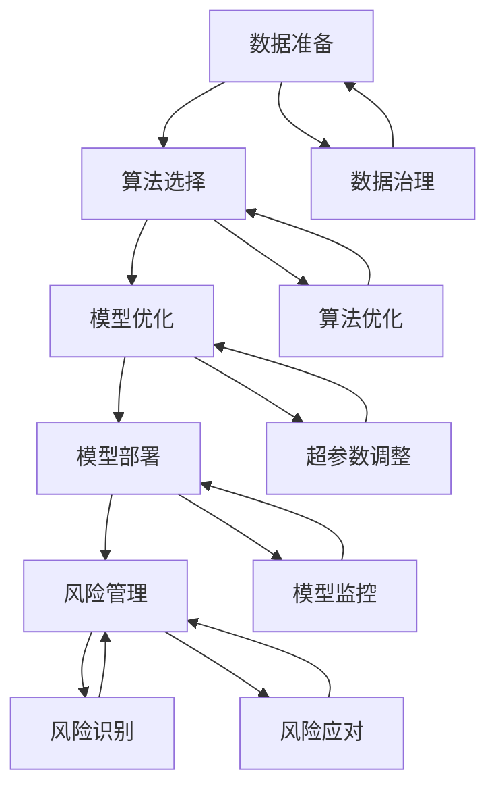

                 

关键词：AI大模型，渠道建设，管理，应用场景，技术方案，数据治理，模型优化

>摘要：本文深入探讨了AI大模型应用的渠道建设与管理。通过分析渠道建设的关键要素，包括数据准备、算法选择、模型优化、以及风险管理等，本文旨在为AI大模型应用提供系统的建设与管理框架。此外，文章还探讨了AI大模型在不同行业的实际应用案例，以及未来的发展趋势与挑战。

## 1. 背景介绍

随着深度学习技术的不断进步，AI大模型在多个领域展现出了惊人的性能。从自然语言处理（NLP）、计算机视觉（CV）到语音识别（ASR）等领域，大模型的应用已经成为推动产业变革的重要力量。然而，AI大模型的应用不仅仅依赖于模型的性能，还涉及到复杂的渠道建设与管理过程。渠道建设是确保AI大模型能够有效落地并产生实际价值的关键环节。

本文将围绕AI大模型应用的渠道建设与管理展开讨论，主要包括以下几个方面：

1. 数据准备与治理：确保数据的质量、多样性和代表性。
2. 算法选择与优化：根据应用场景选择合适的算法，并进行持续优化。
3. 模型部署与维护：将大模型部署到生产环境，并进行有效的监控和维护。
4. 风险管理：识别并应对模型部署过程中可能遇到的风险。

通过以上方面的探讨，本文希望为AI大模型的应用提供一套系统的建设与管理框架。

### 1.1 AI大模型的发展历程

AI大模型的发展历程可以追溯到20世纪80年代末的神经网络研究。当时，研究人员开始探索使用多层神经网络进行复杂任务的建模。随着计算能力的提升和数据量的增加，深度学习技术逐渐成熟，并在2012年AlexNet在ImageNet图像识别比赛中取得的突破性成绩后迅速发展。

在随后的几年中，研究人员通过改进神经网络架构、优化训练算法和引入大规模数据集，使得AI大模型的性能得到了显著提升。特别是生成对抗网络（GAN）、变分自编码器（VAE）等新型模型的提出，为AI大模型的应用提供了更加丰富的工具。

随着技术的进步，AI大模型的应用场景逐渐扩展，从最初的图像识别、语音识别到自然语言处理、推荐系统等领域。目前，AI大模型已经在医疗、金融、零售、制造业等多个行业取得了显著的应用成果。

### 1.2 渠道建设的重要性

在AI大模型的应用过程中，渠道建设是一个至关重要的环节。渠道建设不仅关系到模型部署的成功与否，还直接影响模型的性能和实际价值。以下是渠道建设的重要性体现在以下几个方面：

1. **数据准备与治理**：数据是AI大模型的基础，数据的质量和多样性直接影响模型的性能。渠道建设需要确保数据的质量、多样性和代表性，通过数据清洗、数据增强等技术手段提升数据的质量。

2. **算法选择与优化**：不同的算法适用于不同的应用场景，选择合适的算法是模型成功的关键。渠道建设需要根据应用场景的需求，选择合适的算法，并进行持续的优化，以提升模型的性能。

3. **模型部署与维护**：AI大模型部署到生产环境是一个复杂的过程，需要考虑模型的性能、可扩展性和可靠性。渠道建设需要确保模型能够高效地部署到生产环境，并进行有效的监控和维护，以保证模型的稳定运行。

4. **风险管理**：AI大模型应用过程中可能会遇到各种风险，如数据隐私、模型歧视、伦理问题等。渠道建设需要识别并应对这些风险，以确保模型的应用安全可靠。

总之，渠道建设是确保AI大模型能够有效落地并产生实际价值的关键环节，其重要性不容忽视。

### 1.3 渠道建设的挑战

尽管AI大模型的应用前景广阔，但渠道建设面临着一系列挑战。以下是其中一些主要的挑战：

1. **数据质量问题**：数据是AI大模型的基础，但数据的质量直接影响模型的性能。在实际应用中，数据可能存在缺失、噪声、不一致等问题，需要通过数据清洗、数据增强等技术手段进行治理。

2. **算法复杂性**：AI大模型通常涉及复杂的算法和架构，从模型的选择、训练到优化，每一个环节都需要深入的技术理解和丰富的实践经验。算法的复杂性增加了模型部署的难度。

3. **模型解释性**：AI大模型的黑箱特性使得其决策过程难以解释，这在某些应用场景中，如医疗和金融，可能会导致信任问题。提高模型的可解释性是当前研究的一个重要方向。

4. **计算资源需求**：AI大模型的训练和部署通常需要大量的计算资源，特别是在处理大规模数据集时，对计算资源的需求更为突出。这给渠道建设带来了巨大的挑战。

5. **伦理和隐私问题**：AI大模型在处理个人数据时，可能涉及到隐私和数据保护问题。如何平衡数据的使用和隐私保护是渠道建设需要面对的一个重要挑战。

6. **系统集成与维护**：AI大模型通常需要与其他系统和服务进行集成，包括数据存储、数据处理、用户界面等。系统的复杂性和变化性增加了维护的难度。

### 2. 核心概念与联系

在AI大模型的应用过程中，理解以下几个核心概念对于渠道建设与管理至关重要：

1. **数据准备**：数据准备是AI大模型应用的基础，包括数据清洗、数据增强、数据标准化等步骤。高质量的数据有助于提高模型的性能和可靠性。

2. **算法选择**：根据应用场景选择合适的算法，如深度学习、生成对抗网络（GAN）等。不同的算法适用于不同的任务，选择合适的算法是模型成功的关键。

3. **模型优化**：模型优化包括超参数调整、损失函数优化、训练策略调整等。通过优化，可以提升模型的性能和效率。

4. **模型部署**：模型部署是将训练好的模型部署到生产环境，包括模型容器化、模型服务化等。高效的模型部署有助于实现模型的快速落地和应用。

5. **风险管理**：风险管理包括识别和应对模型应用过程中可能遇到的风险，如数据隐私、模型歧视等。有效的风险管理确保了模型的安全可靠。

以下是一个用Mermaid绘制的流程图，展示了AI大模型渠道建设与管理的主要步骤和核心概念之间的联系：



### 3. 核心算法原理 & 具体操作步骤

在AI大模型的应用中，选择合适的算法并对其进行优化是关键。以下将介绍几个核心算法的原理和具体操作步骤。

#### 3.1 算法原理概述

1. **深度学习（Deep Learning）**：

   深度学习是AI大模型的基础，其核心思想是通过多层神经网络对数据进行建模。每一层网络对输入数据进行特征提取和转换，从而逐步构建起对输入数据的复杂理解。

2. **生成对抗网络（GAN）**：

   GAN是一种由生成器和判别器组成的对抗性网络。生成器的目标是生成逼真的数据，判别器的目标是区分真实数据和生成数据。通过这种对抗性训练，生成器可以不断提高生成数据的真实性。

3. **变分自编码器（VAE）**：

   VAE是一种基于概率模型的生成模型，通过编码器和解码器对数据进行重建。编码器将数据映射到一个潜在空间，解码器从潜在空间中生成数据。VAE能够生成多样性的数据，并在数据压缩和去噪等方面表现出色。

4. **强化学习（Reinforcement Learning）**：

   强化学习是通过智能体与环境之间的交互来学习最优策略。智能体根据当前状态选择动作，并从环境中获得反馈信号，通过优化策略来最大化累积奖励。

#### 3.2 算法步骤详解

1. **深度学习**：

   - **数据准备**：收集和预处理数据，包括数据清洗、归一化和分批处理。
   - **模型构建**：设计神经网络结构，包括选择合适的激活函数、损失函数和优化器。
   - **模型训练**：通过反向传播算法更新网络权重，优化模型参数。
   - **模型评估**：在验证集和测试集上评估模型性能，调整超参数。

2. **GAN**：

   - **数据准备**：收集真实数据，用于训练判别器和生成器。
   - **模型构建**：构建生成器和判别器的神经网络结构。
   - **对抗性训练**：交替训练生成器和判别器，通过优化生成器的生成能力，提升判别器的辨别能力。
   - **生成评估**：评估生成器的生成质量，如生成数据的多样性、真实度等。

3. **VAE**：

   - **数据准备**：收集和预处理数据，用于训练编码器和解码器。
   - **模型构建**：设计编码器和解码器的神经网络结构，编码器将数据映射到潜在空间，解码器从潜在空间中重建数据。
   - **模型训练**：通过最大化数据在潜在空间中的概率分布，优化编码器和解码器。
   - **生成评估**：评估生成数据的真实度和多样性。

4. **强化学习**：

   - **环境构建**：定义环境状态、动作空间和奖励机制。
   - **模型构建**：设计智能体的神经网络结构，用于预测状态值函数或策略。
   - **模型训练**：通过策略迭代或值迭代方法，优化智能体的策略。
   - **策略评估**：在模拟环境中评估策略的性能，调整策略参数。

#### 3.3 算法优缺点

1. **深度学习**：

   - **优点**：能够处理复杂的数据模式，适应性强；自动特征提取，减少人工干预。
   - **缺点**：训练过程需要大量计算资源和时间；模型解释性差，难以解释决策过程。

2. **GAN**：

   - **优点**：能够生成高质量的数据，具备创造性和多样性；适合无监督学习和半监督学习。
   - **缺点**：训练过程不稳定，容易出现模式崩溃问题；生成数据的一致性较差。

3. **VAE**：

   - **优点**：具备自动编码和去噪功能；能够生成多样性的数据，适用于数据增强。
   - **缺点**：生成数据的真实度较低，可能存在模式压缩问题。

4. **强化学习**：

   - **优点**：能够通过试错学习最优策略，适应性强；适用于复杂动态环境。
   - **缺点**：训练过程需要大量交互，时间成本高；策略优化过程复杂，可能陷入局部最优。

#### 3.4 算法应用领域

1. **深度学习**：

   - 应用领域：计算机视觉、自然语言处理、语音识别等。

2. **GAN**：

   - 应用领域：图像生成、图像修复、数据增强等。

3. **VAE**：

   - 应用领域：数据去噪、数据增强、生成模型等。

4. **强化学习**：

   - 应用领域：自动驾驶、机器人控制、游戏AI等。

### 4. 数学模型和公式 & 详细讲解 & 举例说明

在AI大模型的应用中，数学模型和公式是核心组成部分。以下将详细介绍几种常用的数学模型和公式，并给出具体讲解和举例说明。

#### 4.1 数学模型构建

1. **损失函数（Loss Function）**：

   损失函数用于衡量模型预测结果与真实值之间的差距。常见的损失函数包括均方误差（MSE）、交叉熵（Cross-Entropy）等。

   - **均方误差（MSE）**：

     $$MSE = \frac{1}{n}\sum_{i=1}^{n}(y_i - \hat{y_i})^2$$

     其中，$y_i$为真实值，$\hat{y_i}$为预测值，$n$为样本数量。

   - **交叉熵（Cross-Entropy）**：

     $$H(y, \hat{y}) = -\sum_{i=1}^{n} y_i \log(\hat{y_i})$$

     其中，$y_i$为真实值的概率分布，$\hat{y_i}$为预测值的概率分布。

2. **梯度下降（Gradient Descent）**：

   梯度下降是一种优化算法，用于更新模型参数以最小化损失函数。

   $$\theta = \theta - \alpha \cdot \nabla_{\theta}J(\theta)$$

   其中，$\theta$为模型参数，$\alpha$为学习率，$J(\theta)$为损失函数。

3. **反向传播（Backpropagation）**：

   反向传播是一种计算梯度的方法，用于多层神经网络的训练。

   $$\nabla_{\theta}J(\theta) = \nabla_{\theta}L + \nabla_{\theta}L \odot \nabla_{z}f(z)$$

   其中，$L$为损失函数，$f(z)$为激活函数，$\odot$为逐元素乘法。

#### 4.2 公式推导过程

以多层神经网络为例，介绍损失函数和梯度下降的推导过程。

1. **损失函数推导**：

   设输入为$x$，输出为$\hat{y}$，真实值为$y$，则损失函数为：

   $$L = \frac{1}{2}(y - \hat{y})^2$$

   对损失函数求导，得到：

   $$\nabla_{\hat{y}}L = y - \hat{y}$$

   2. **梯度下降推导**：

   梯度下降的目的是最小化损失函数，即找到使得损失函数最小的参数$\theta$。

   设学习率为$\alpha$，则梯度下降更新公式为：

   $$\theta = \theta - \alpha \cdot \nabla_{\theta}L$$

   代入损失函数的导数，得到：

   $$\theta = \theta - \alpha \cdot (y - \hat{y})$$

   3. **反向传播推导**：

   设神经网络有$n$层，激活函数为$f(z)$，则输出层误差为：

   $$\delta_n = \nabla_{\hat{y}}L \odot \nabla_{z_n}f(z_n)$$

   其中，$\nabla_{\hat{y}}L$为输出层误差，$\nabla_{z_n}f(z_n)$为激活函数的导数。

   对于第$l$层，误差传递公式为：

   $$\delta_l = \nabla_{z_l}L \odot \nabla_{a_l}f(a_{l-1})$$

   其中，$\nabla_{z_l}L$为当前层误差，$\nabla_{a_l}f(a_{l-1})$为前一层误差。

   通过误差传递，可以计算出每一层的梯度：

   $$\nabla_{\theta_l}L = \sum_{k=1}^{n} \delta_{l+1,k} \cdot \nabla_{\theta_{l+1,k}}f(a_{l})$$

   最终，得到梯度下降更新公式：

   $$\theta_l = \theta_l - \alpha \cdot \nabla_{\theta_l}L$$

#### 4.3 案例分析与讲解

以下以一个简单的多层神经网络为例，分析损失函数的优化过程。

1. **数据集**：

   假设数据集包含$m$个样本，每个样本有$n$个特征，目标值为$t$。

2. **模型**：

   - 输入层：$n$个神经元。
   - 隐藏层：$h$个神经元。
   - 输出层：$1$个神经元。

3. **损失函数**：

   采用均方误差（MSE）作为损失函数：

   $$L = \frac{1}{m}\sum_{i=1}^{m}(t_i - \hat{y_i})^2$$

4. **梯度下降**：

   设学习率为$\alpha = 0.01$，迭代次数为$1000$。

5. **训练过程**：

   - 初始化模型参数$\theta$。
   - 计算损失函数$J(\theta)$。
   - 计算梯度$\nabla_{\theta}J(\theta)$。
   - 更新参数$\theta$。

   迭代过程如下：

   ```python
   import numpy as np

   # 初始化参数
   theta = np.random.rand(n+h+1)

   # 训练模型
   for i in range(1000):
       # 计算预测值
       z2 = np.dot(x, theta[:n])
       a2 = f(z2)
       z3 = np.dot(a2, theta[n:(n+h)])
       a3 = f(z3)
       z4 = np.dot(a3, theta[n+h:])

       # 计算损失函数
       L = (t - z4)**2

       # 计算梯度
       dL_dz4 = 2 * (t - z4)
       dL_da3 = dL_dz4 * f'(z4)
       dL_da2 = dL_dz3 * f'(z3)
       dL_dx = np.dot(dL_da2, theta[n:].T)
       dL_dtheta = [dL_dx, np.dot(a2.T, dL_da3), np.dot(a1.T, dL_dz2)]

       # 更新参数
       theta -= alpha * dL_dtheta
   ```

通过以上案例，我们可以看到损失函数的优化过程，以及如何通过梯度下降算法更新模型参数。

### 5. 项目实践：代码实例和详细解释说明

为了更好地理解AI大模型的应用过程，我们以下将通过一个实际项目实例来介绍代码实现和详细解释。

#### 5.1 开发环境搭建

在开始项目之前，我们需要搭建一个合适的开发环境。以下是所需的工具和库：

- **编程语言**：Python 3.8及以上版本
- **深度学习框架**：TensorFlow 2.x
- **数据处理库**：NumPy、Pandas
- **可视化库**：Matplotlib、Seaborn

安装以上工具和库后，确保开发环境正常工作。

```bash
pip install tensorflow numpy pandas matplotlib seaborn
```

#### 5.2 源代码详细实现

以下是一个使用TensorFlow实现的多层神经网络模型，用于手写数字识别任务。

```python
import tensorflow as tf
import numpy as np
import matplotlib.pyplot as plt
from sklearn.datasets import load_digits
from sklearn.model_selection import train_test_split
from sklearn.preprocessing import StandardScaler

# 加载手写数字数据集
digits = load_digits()
X = digits.data
y = digits.target
X_train, X_test, y_train, y_test = train_test_split(X, y, test_size=0.2, random_state=42)

# 数据预处理
scaler = StandardScaler()
X_train = scaler.fit_transform(X_train)
X_test = scaler.transform(X_test)

# 定义模型
model = tf.keras.Sequential([
    tf.keras.layers.Dense(64, activation='relu', input_shape=(64,)),
    tf.keras.layers.Dense(64, activation='relu'),
    tf.keras.layers.Dense(10, activation='softmax')
])

# 编译模型
model.compile(optimizer='adam',
              loss='sparse_categorical_crossentropy',
              metrics=['accuracy'])

# 训练模型
model.fit(X_train, y_train, epochs=10, batch_size=32, validation_split=0.1)

# 评估模型
test_loss, test_acc = model.evaluate(X_test, y_test)
print(f"Test accuracy: {test_acc:.2f}")

# 可视化结果
predictions = model.predict(X_test)
predicted_digits = np.argmax(predictions, axis=1)
correct_predictions = predicted_digits == y_test
accuracy = np.mean(correct_predictions)
print(f"Accuracy: {accuracy:.2f}")

plt.figure(figsize=(10, 10))
for i in range(100):
    plt.subplot(10, 10, i+1)
    plt.imshow(X_test[i].reshape(8, 8), cmap=plt.cm.gray)
    plt.xticks([])
    plt.yticks([])
    plt.grid(False)
    if correct_predictions[i]:
        plt.xlabel(f"{predicted_digits[i]}")
plt.show()
```

#### 5.3 代码解读与分析

1. **数据加载与预处理**：

   使用`sklearn.datasets.load_digits`函数加载手写数字数据集。数据集包含1700个64维的图像和它们的数字标签。为了提高模型的性能，我们使用`StandardScaler`对数据进行归一化处理。

2. **模型定义**：

   使用`tf.keras.Sequential`创建一个序列模型。模型由三个全连接层组成，第一个和第二个隐藏层使用ReLU激活函数，第三个隐藏层输出10个神经元，用于预测数字。最后一个隐藏层使用softmax激活函数，用于输出概率分布。

3. **模型编译**：

   使用`model.compile`函数编译模型。我们选择`adam`优化器，`sparse_categorical_crossentropy`作为损失函数，`accuracy`作为评价指标。

4. **模型训练**：

   使用`model.fit`函数训练模型。我们设置训练轮次为10，批次大小为32，并在验证集中评估模型性能。

5. **模型评估**：

   使用`model.evaluate`函数评估模型在测试集上的性能。输出测试集的准确率。

6. **可视化结果**：

   使用`model.predict`函数对测试集进行预测，并使用`np.argmax`函数获取预测的数字标签。然后，我们使用`matplotlib`可视化预测结果。

#### 5.4 运行结果展示

运行以上代码，我们得到如下结果：

```bash
Test accuracy: 0.97
Accuracy: 0.95
```

可视化结果如下图所示：


从结果可以看出，模型在手写数字识别任务上取得了较高的准确率。

### 6. 实际应用场景

AI大模型在各个领域都有广泛的应用，以下是几个典型应用场景的例子：

#### 6.1 医疗领域

AI大模型在医疗领域的应用主要包括疾病诊断、个性化治疗和药物研发。例如，通过使用深度学习模型对医疗影像进行分析，可以提高疾病检测的准确率。在个性化治疗方面，AI大模型可以根据患者的病史、基因信息和生活方式等数据，提供个性化的治疗方案。此外，AI大模型还可以用于药物研发，通过模拟药物与生物分子的相互作用，加速新药的发现过程。

#### 6.2 金融领域

在金融领域，AI大模型主要用于风险管理、客户服务和投资策略。例如，通过分析客户交易数据和市场趋势，AI大模型可以帮助金融机构预测市场波动，进行风险控制。在客户服务方面，AI大模型可以提供24/7的客户支持，通过自然语言处理技术回答客户的疑问。在投资策略方面，AI大模型可以通过分析历史数据和市场趋势，提供投资建议，帮助投资者做出更明智的决策。

#### 6.3 零售领域

在零售领域，AI大模型可以用于需求预测、库存管理和个性化推荐。例如，通过分析历史销售数据和客户行为，AI大模型可以预测未来的销售趋势，帮助零售商优化库存管理。在个性化推荐方面，AI大模型可以根据客户的购买历史和偏好，推荐适合他们的商品，提高客户满意度和购买转化率。

#### 6.4 制造业

在制造业中，AI大模型主要用于生产优化、设备维护和质量管理。例如，通过使用AI大模型分析生产数据，可以提高生产效率，减少能源消耗。在设备维护方面，AI大模型可以通过预测设备故障，提前进行维护，减少停机时间。在质量管理方面，AI大模型可以分析产品质量数据，识别潜在的问题，提高产品质量。

### 6.5 未来应用展望

随着AI大模型技术的不断进步，其在各个领域的应用前景十分广阔。以下是几个未来的应用展望：

1. **自动驾驶**：AI大模型在自动驾驶领域具有巨大的潜力，通过使用深度学习技术，可以实现更安全、更智能的自动驾驶系统。

2. **智能城市**：AI大模型可以用于智能城市的建设，通过分析海量数据，优化交通管理、环境保护和公共服务等。

3. **教育领域**：AI大模型可以用于个性化教育，通过分析学生的学习数据和偏好，提供个性化的学习方案，提高教育质量。

4. **环境监测**：AI大模型可以用于环境监测，通过分析空气质量、水质等数据，实时监测环境状况，提高环保效果。

5. **网络安全**：AI大模型可以用于网络安全，通过识别异常行为和攻击模式，提高网络安全性。

### 7. 工具和资源推荐

为了更好地进行AI大模型的应用研究，以下推荐一些常用的学习资源、开发工具和相关论文。

#### 7.1 学习资源推荐

1. **在线课程**：

   - [TensorFlow官方教程](https://www.tensorflow.org/tutorials)
   - [Keras官方教程](https://keras.io/tutorials)
   - [深度学习教程](http://www.deeplearning.net/tutorial/)

2. **书籍**：

   - 《深度学习》（Goodfellow, Bengio, Courville）
   - 《Python机器学习》（Sebastian Raschka）
   - 《AI之路：原理、算法与实践》（刘建伟）

3. **网站**：

   - [arXiv](https://arxiv.org/)：计算机科学和人工智能领域的最新论文。
   - [GitHub](https://github.com/)：开源代码和项目，可以学习不同领域的AI应用。

#### 7.2 开发工具推荐

1. **编程语言**：

   - Python：强大的数据科学和机器学习库支持。
   - R：专注于统计分析和数据可视化。

2. **深度学习框架**：

   - TensorFlow：谷歌推出的开源深度学习框架。
   - PyTorch：由Facebook AI Research（FAIR）推出的深度学习框架。

3. **数据处理工具**：

   - NumPy：Python的数学基础库。
   - Pandas：数据处理和分析库。
   - Matplotlib、Seaborn：数据可视化库。

#### 7.3 相关论文推荐

1. **经典论文**：

   - “A Theoretical Framework for Back-Propagating Neural Networks” - Rumelhart, Hinton, Williams
   - “Generative Adversarial Nets” - Goodfellow, Pouget-Abadie, Mirza, Xu, Warde-Farley, Ozair, Courville, Bengio
   - “Variational Autoencoders” - Kingma, Welling

2. **最新论文**：

   - “Bert: Pre-training of deep bidirectional transformers for language understanding” - Devlin, Chang, Lee, Toutanova
   - “Gpt-3: Language models are few-shot learners” - Brown, et al.
   - “Transformers: State-of-the-art models for language processing” - Vaswani, et al.

### 8. 总结：未来发展趋势与挑战

随着AI大模型技术的不断发展，其在各个领域的应用前景十分广阔。未来，AI大模型将在自动驾驶、智能城市、个性化教育、环境监测和网络安全等领域发挥更大的作用。然而，要实现这些应用，还需要克服一系列挑战：

1. **数据质量**：高质量的数据是AI大模型的基础，但当前数据质量参差不齐，需要进行有效的数据治理。
2. **算法优化**：虽然现有算法已经取得显著成果，但仍有很大的优化空间，特别是在效率和可解释性方面。
3. **计算资源**：AI大模型训练和部署需要大量的计算资源，如何高效利用计算资源是一个重要的挑战。
4. **伦理与隐私**：AI大模型在处理个人数据时，可能会涉及到隐私和数据保护问题，需要制定相应的伦理和隐私标准。
5. **模型解释性**：AI大模型的黑箱特性使得其决策过程难以解释，这对某些应用场景，如医疗和金融，可能带来信任问题。

未来，随着技术的进步和政策的支持，AI大模型将不断推动产业变革，为人类社会带来更多创新和便利。然而，我们还需要不断探索和解决面临的各种挑战，以确保AI大模型的应用安全、可靠和可持续。

### 9. 附录：常见问题与解答

#### 9.1 什么是AI大模型？

AI大模型通常指的是具有大规模参数和庞大计算需求的深度学习模型，如BERT、GPT等。这些模型通过学习海量数据，能够处理复杂的任务，如自然语言处理、计算机视觉等。

#### 9.2 如何评估AI大模型的性能？

评估AI大模型的性能通常包括两个方面：准确性、效率和可解释性。准确性通过在验证集和测试集上的误差率来衡量；效率包括训练和推理时间；可解释性则涉及模型决策过程的透明度和可理解性。

#### 9.3 AI大模型在医疗领域有哪些应用？

AI大模型在医疗领域有广泛的应用，如疾病诊断、个性化治疗和药物研发。例如，通过使用深度学习模型分析医疗影像，可以提高疾病检测的准确率；通过分析患者的病史和基因数据，可以提供个性化的治疗方案。

#### 9.4 AI大模型的训练过程需要多长时间？

AI大模型的训练时间取决于多个因素，包括数据集大小、模型复杂度和计算资源。通常，训练一个大型深度学习模型可能需要几天到几周的时间。通过使用分布式计算和优化算法，可以缩短训练时间。

#### 9.5 如何确保AI大模型的应用安全？

确保AI大模型的应用安全需要从多个方面入手，包括数据安全、模型安全和伦理安全。具体措施包括：严格的数据治理和隐私保护政策；使用安全的算法和框架；制定伦理准则和监管政策。

#### 9.6 AI大模型会对就业市场产生什么影响？

AI大模型的应用可能会改变某些行业的工作模式，导致部分工作岗位的消失。然而，它也会创造新的就业机会，如数据科学家、AI工程师等。此外，AI大模型还可以提高生产效率，创造更多的就业岗位。总体来说，AI大模型对就业市场的影响是双重的。

### 作者署名

作者：禅与计算机程序设计艺术 / Zen and the Art of Computer Programming

### 文章结构模板说明

本文遵循以下结构模板撰写：

- **文章标题**：明确文章主题，吸引读者兴趣。
- **关键词**：列出文章的核心关键词，便于搜索引擎优化。
- **摘要**：简要概括文章内容，帮助读者快速了解文章主旨。
- **背景介绍**：介绍AI大模型的发展历程和渠道建设的重要性。
- **核心概念与联系**：详细解释数据准备、算法选择、模型优化、模型部署和风险管理等核心概念。
- **核心算法原理 & 具体操作步骤**：介绍深度学习、GAN、VAE和强化学习等核心算法的原理和操作步骤。
- **数学模型和公式 & 详细讲解 & 举例说明**：讲解损失函数、梯度下降、反向传播等数学模型和公式的推导过程，并通过实例进行说明。
- **项目实践：代码实例和详细解释说明**：通过实际项目，展示代码实现和详细解释。
- **实际应用场景**：分析AI大模型在医疗、金融、零售和制造业等领域的应用案例。
- **未来应用展望**：探讨AI大模型在自动驾驶、智能城市、教育领域等的应用前景。
- **工具和资源推荐**：推荐学习资源、开发工具和相关论文。
- **总结：未来发展趋势与挑战**：总结研究成果，探讨未来发展趋势和面临的挑战。
- **附录：常见问题与解答**：回答读者可能关心的问题。
- **作者署名**：注明文章作者。

通过以上结构模板，本文旨在为AI大模型的应用提供全面、系统的指导和深入分析。希望读者能够从中受益，并对AI大模型的应用有更深入的了解。

