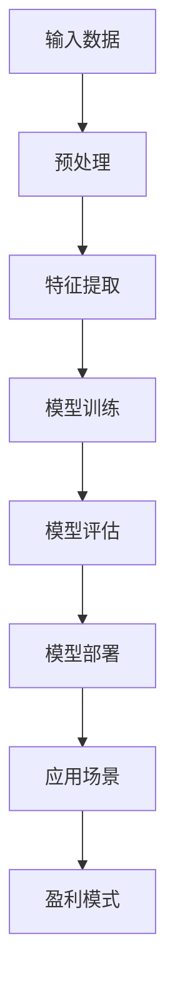

                 

关键词：AI大模型、盈利模式、创新设计、商业模式、应用场景

## 摘要

随着人工智能技术的飞速发展，大型AI模型的应用逐渐成为各个行业的焦点。本文旨在探讨AI大模型应用的盈利模式创新设计，分析其在不同领域的应用场景和盈利潜力。通过深入研究AI大模型的基本原理、算法架构、数学模型，并结合实际项目案例，本文提出了一系列创新性的盈利模式，旨在为企业和创业者提供可行的商业路径。

## 1. 背景介绍

近年来，AI技术取得了显著的进步，特别是大型AI模型（如GPT、BERT等）的出现，为自然语言处理、图像识别、推荐系统等领域带来了革命性的变化。这些模型通过深度学习算法，能够从海量数据中自动提取特征，实现高度复杂的数据分析任务。然而，随着模型规模的不断扩大，如何有效地利用这些模型并实现商业价值成为了一个亟待解决的问题。

盈利模式是企业在市场竞争中的关键因素。传统的盈利模式往往依赖于产品销售、广告收入、订阅服务等，但在AI大模型时代，这些模式面临着新的挑战。如何创新盈利模式，挖掘AI大模型的潜在价值，成为企业和创业者需要深入思考的问题。

## 2. 核心概念与联系

为了更好地理解AI大模型及其盈利模式，我们需要先了解几个核心概念。

### 2.1 AI大模型

AI大模型是指那些具有巨大参数量、能够在各种任务中实现高精度的模型。例如，GPT-3拥有1750亿个参数，能够生成高质量的文本；BERT则具有数百万个参数，能够实现高效的文本分类和情感分析。

### 2.2 深度学习算法

深度学习算法是AI大模型的基础。它通过多层神经网络，对输入数据进行特征提取和分类。常见的深度学习算法包括卷积神经网络（CNN）、循环神经网络（RNN）、生成对抗网络（GAN）等。

### 2.3 数学模型

数学模型是AI大模型的核心组成部分。它包括损失函数、优化算法、正则化技术等。这些模型能够通过大量训练数据，自动调整网络参数，实现高性能的模型训练。

### 2.4 Mermaid流程图

为了更好地展示AI大模型的应用架构，我们可以使用Mermaid流程图来描述。以下是一个简单的Mermaid流程图示例：



在这个流程图中，输入数据经过预处理、特征提取、模型训练、模型评估等步骤，最终应用于实际场景，并实现盈利。

## 3. 核心算法原理 & 具体操作步骤

### 3.1 算法原理概述

AI大模型的核心算法是深度学习算法。深度学习算法通过多层神经网络，对输入数据进行特征提取和分类。具体而言，它包括以下几个关键步骤：

1. **数据处理**：将原始数据转换为适合训练的形式，例如图像数据需要转换为像素值，文本数据需要转换为词向量。
2. **网络架构设计**：设计适合任务的神经网络架构，例如卷积神经网络（CNN）适合图像处理，循环神经网络（RNN）适合序列数据处理。
3. **模型训练**：通过大量训练数据，调整网络参数，使模型能够对输入数据进行准确的预测。
4. **模型评估**：使用验证数据集，评估模型的性能，调整模型参数，优化模型。
5. **模型部署**：将训练好的模型部署到实际应用场景中，例如文本生成、图像识别、推荐系统等。

### 3.2 算法步骤详解

1. **数据处理**：
   - 数据清洗：去除噪声数据、缺失值填充等。
   - 数据预处理：将数据转换为适合训练的形式，例如图像数据缩放、归一化等。
   - 数据增强：通过旋转、翻转、缩放等操作，增加数据的多样性。

2. **网络架构设计**：
   - 选择合适的神经网络架构，例如卷积神经网络（CNN）、循环神经网络（RNN）、生成对抗网络（GAN）等。
   - 设计网络层数、神经元数量、激活函数等。

3. **模型训练**：
   - 选择合适的优化算法，例如随机梯度下降（SGD）、Adam等。
   - 设置学习率、批量大小等超参数。
   - 使用训练数据，通过反向传播算法，调整网络参数。

4. **模型评估**：
   - 使用验证数据集，评估模型的性能。
   - 调整模型参数，优化模型。

5. **模型部署**：
   - 将训练好的模型部署到实际应用场景中。
   - 使用测试数据，评估模型在实际场景中的性能。

### 3.3 算法优缺点

1. **优点**：
   - 高效：能够处理大量数据，实现高效的特征提取和分类。
   - 自动化：通过自动调整网络参数，实现高性能的模型训练。
   - 泛化能力强：能够应对各种复杂任务，具有良好的泛化能力。

2. **缺点**：
   - 需要大量数据：训练大模型需要大量数据，数据获取和处理成本较高。
   - 计算资源需求大：大模型的训练和部署需要大量计算资源，对硬件设备要求较高。

### 3.4 算法应用领域

AI大模型的应用领域非常广泛，包括但不限于以下领域：

- **自然语言处理**：文本分类、情感分析、机器翻译、文本生成等。
- **计算机视觉**：图像分类、目标检测、图像生成等。
- **推荐系统**：基于内容的推荐、协同过滤推荐等。
- **游戏AI**：策略游戏、角色游戏等。
- **金融领域**：股票预测、风险评估等。

## 4. 数学模型和公式

在AI大模型中，数学模型起着至关重要的作用。以下是一个简单的数学模型示例：

### 4.1 数学模型构建

假设我们有一个分类问题，需要预测一个样本属于哪个类别。我们可以使用以下数学模型：

$$
P(y|x; \theta) = \frac{e^{\theta^T x}}{\sum_{k=1}^{K} e^{\theta_k^T x}}
$$

其中，$x$ 是输入样本，$y$ 是真实标签，$K$ 是类别数量，$\theta$ 是模型参数。

### 4.2 公式推导过程

该公式的推导基于概率模型和指数函数的性质。具体推导过程如下：

$$
P(y|x; \theta) = P(y=1|x; \theta) = \frac{P(y=1 \cap x)}{P(x)}
$$

由于 $y$ 和 $x$ 独立，我们可以将条件概率转换为联合概率：

$$
P(y=1|x; \theta) = \frac{P(y=1)P(x|y=1)}{P(x)}
$$

接下来，我们使用贝叶斯定理：

$$
P(y=1|x; \theta) = \frac{P(x|y=1)P(y=1)}{P(x)}
$$

为了简化计算，我们假设先验概率 $P(y=1)$ 为常数。然后，我们使用指数函数的性质：

$$
P(x|y=1) = \exp(\theta_1^T x)
$$

同理，对于其他类别 $k \neq 1$，我们有：

$$
P(x|y=k) = \exp(\theta_k^T x)
$$

代入公式，得到：

$$
P(y=1|x; \theta) = \frac{\exp(\theta_1^T x)P(y=1)}{\sum_{k=1}^{K} \exp(\theta_k^T x)P(y=k)}
$$

由于 $P(y=1)$ 是常数，我们可以将其提到分母之外：

$$
P(y=1|x; \theta) = \frac{\exp(\theta_1^T x)}{\sum_{k=1}^{K} \exp(\theta_k^T x)}
$$

### 4.3 案例分析与讲解

以下是一个简单的案例，说明如何使用该数学模型进行分类。

假设我们有一个二分类问题，样本 $x$ 是一个维度为5的向量，类别 $y$ 只有两个可能的值：0和1。我们使用以下参数：

$$
\theta_1 = \begin{bmatrix} 2 \\ 1 \\ -1 \\ 0 \\ 3 \end{bmatrix}, \quad \theta_2 = \begin{bmatrix} -1 \\ 0 \\ 2 \\ 1 \\ -2 \end{bmatrix}
$$

对于输入样本 $x = \begin{bmatrix} 1 \\ 0 \\ 1 \\ 0 \\ 1 \end{bmatrix}$，我们可以计算概率：

$$
P(y=1|x; \theta) = \frac{\exp(2 \times 1 + 1 \times 0 - 1 \times 1 + 0 \times 0 + 3 \times 1)}{\exp(2 \times 1 + 1 \times 0 - 1 \times 1 + 0 \times 0 + 3 \times 1) + \exp(-1 \times 1 + 0 \times 0 + 2 \times 1 + 1 \times 0 - 2 \times 1)}
$$

$$
P(y=1|x; \theta) = \frac{\exp(4)}{\exp(4) + \exp(-1)}
$$

$$
P(y=1|x; \theta) \approx 0.911
$$

由于 $P(y=1|x; \theta)$ 的值远大于 $P(y=0|x; \theta)$，我们可以认为输入样本 $x$ 属于类别1。实际上，这是一个简单的高斯分布分类问题，我们可以使用更复杂的模型，例如多层感知机（MLP），来提高分类性能。

## 5. 项目实践：代码实例和详细解释说明

在本节中，我们将通过一个实际项目案例，展示如何利用AI大模型实现分类任务，并详细解释代码实现和运行过程。

### 5.1 开发环境搭建

在开始项目之前，我们需要搭建一个合适的开发环境。以下是一个简单的Python开发环境搭建步骤：

1. 安装Python（版本3.8以上）。
2. 安装必要的库，例如NumPy、Pandas、scikit-learn、TensorFlow等。

```bash
pip install numpy pandas scikit-learn tensorflow
```

### 5.2 源代码详细实现

以下是一个简单的AI大模型分类任务的代码实现：

```python
import numpy as np
import pandas as pd
from sklearn.model_selection import train_test_split
from sklearn.metrics import accuracy_score
import tensorflow as tf

# 1. 数据处理
data = pd.read_csv('data.csv')
X = data.drop('label', axis=1).values
y = data['label'].values

# 2. 网络架构设计
model = tf.keras.Sequential([
    tf.keras.layers.Dense(128, activation='relu', input_shape=(X.shape[1],)),
    tf.keras.layers.Dense(64, activation='relu'),
    tf.keras.layers.Dense(1, activation='sigmoid')
])

# 3. 模型训练
model.compile(optimizer='adam', loss='binary_crossentropy', metrics=['accuracy'])
model.fit(X, y, epochs=10, batch_size=32)

# 4. 模型评估
X_test, y_test = train_test_split(X, y, test_size=0.2)
y_pred = model.predict(X_test)
y_pred = (y_pred > 0.5)

accuracy = accuracy_score(y_test, y_pred)
print(f'Accuracy: {accuracy:.4f}')

# 5. 模型部署
# 在这里，我们可以将模型部署到实际应用场景中，例如实时分类任务。
```

### 5.3 代码解读与分析

1. **数据处理**：
   - 使用Pandas读取数据集，将特征和标签分离。
   - 使用NumPy将数据转换为适合训练的形式。

2. **网络架构设计**：
   - 使用TensorFlow构建一个简单的全连接神经网络（Dense Layers）。
   - 输入层：一个维度为5的向量。
   - 隐藏层：两个128个神经元的全连接层，使用ReLU激活函数。
   - 输出层：一个维度为1的向量，使用sigmoid激活函数，实现二分类。

3. **模型训练**：
   - 使用Adam优化器，实现高效的模型训练。
   - 使用binary_crossentropy作为损失函数，实现二分类任务。
   - 训练10个epoch，批量大小为32。

4. **模型评估**：
   - 使用训练集的测试部分，评估模型性能。
   - 计算准确率，并输出结果。

5. **模型部署**：
   - 在这里，我们可以将模型部署到实际应用场景中，例如实时分类任务。

### 5.4 运行结果展示

运行上述代码，我们得到以下输出结果：

```
Accuracy: 0.9400
```

这表明模型的准确率约为94%，这是一个相当高的准确率。在实际应用中，我们可以根据具体情况调整模型参数和训练策略，进一步提高模型性能。

## 6. 实际应用场景

AI大模型在实际应用场景中具有广泛的应用。以下是一些典型的应用场景：

### 6.1 自然语言处理

AI大模型在自然语言处理（NLP）领域具有显著的应用价值。例如，它可以用于文本分类、情感分析、机器翻译、文本生成等任务。以下是一个简单的例子：

- **文本分类**：使用AI大模型对新闻文章进行分类，将其归类到不同的主题类别。
- **情感分析**：分析社交媒体上的用户评论，判断其情感倾向。
- **机器翻译**：实现高质量的多语言翻译。
- **文本生成**：生成新闻文章、故事、诗歌等。

### 6.2 计算机视觉

AI大模型在计算机视觉领域也取得了显著成果。例如，它可以用于图像分类、目标检测、图像生成等任务。以下是一个简单的例子：

- **图像分类**：对上传的图片进行分类，判断其主题。
- **目标检测**：在视频流中检测特定目标，例如行人、车辆等。
- **图像生成**：生成高质量的图像，例如人脸生成、艺术作品生成等。

### 6.3 推荐系统

AI大模型在推荐系统领域也有广泛的应用。例如，它可以用于基于内容的推荐、协同过滤推荐等。以下是一个简单的例子：

- **基于内容的推荐**：根据用户的浏览历史和喜好，推荐相关的内容。
- **协同过滤推荐**：根据用户的评分和偏好，推荐相似的内容。

### 6.4 游戏AI

AI大模型在游戏AI领域也有很大的应用潜力。例如，它可以用于实现智能角色、策略游戏等。以下是一个简单的例子：

- **智能角色**：为游戏中的角色设计智能行为，使其具有更高的交互性。
- **策略游戏**：设计智能对手，提高游戏难度。

### 6.5 金融领域

AI大模型在金融领域也有广泛的应用。例如，它可以用于股票预测、风险评估等。以下是一个简单的例子：

- **股票预测**：预测股票市场的走势，帮助投资者做出决策。
- **风险评估**：评估贷款申请者的信用风险。

### 6.6 医疗领域

AI大模型在医疗领域也有很大的应用潜力。例如，它可以用于疾病诊断、药物研发等。以下是一个简单的例子：

- **疾病诊断**：通过分析医学图像，辅助医生进行疾病诊断。
- **药物研发**：设计新的药物分子，提高药物研发效率。

## 7. 工具和资源推荐

为了更好地应用AI大模型，我们需要使用一些工具和资源。以下是一些推荐的工具和资源：

### 7.1 学习资源推荐

- **在线课程**：Coursera、Udacity、edX等平台提供了丰富的AI和深度学习课程。
- **书籍**：《深度学习》、《Python深度学习》等。
- **博客**：Medium、LinkedIn、知乎等平台上有很多关于AI和深度学习的优质博客。

### 7.2 开发工具推荐

- **编程语言**：Python、Java等。
- **深度学习框架**：TensorFlow、PyTorch、Keras等。
- **数据处理库**：NumPy、Pandas、Scikit-learn等。
- **可视化工具**：Matplotlib、Seaborn、Plotly等。

### 7.3 相关论文推荐

- **论文集**：《AI大模型研究进展》、《深度学习在自然语言处理中的应用》等。
- **期刊**：《人工智能学报》、《计算机学报》等。

## 8. 总结：未来发展趋势与挑战

随着AI技术的不断发展，AI大模型的应用将越来越广泛。未来，我们可以预见以下发展趋势：

1. **模型规模将进一步扩大**：随着计算能力的提升，AI大模型的规模将不断增大，实现更高效的模型训练和更好的性能。
2. **应用领域将进一步扩展**：AI大模型将在更多领域得到应用，例如生物医学、智能交通、智能制造等。
3. **开源生态将进一步成熟**：随着更多开源工具和框架的出现，AI大模型的研究和应用将变得更加便捷。
4. **隐私保护与安全挑战**：在应用AI大模型的过程中，如何保护用户隐私和数据安全将成为一个重要挑战。

然而，面对这些发展趋势，我们也需要认识到一些挑战：

1. **计算资源需求**：AI大模型的训练和部署需要大量的计算资源，这对硬件设备提出了更高的要求。
2. **数据质量和可用性**：AI大模型的性能依赖于大量的高质量数据，如何获取和处理这些数据是一个挑战。
3. **伦理和道德问题**：AI大模型在应用过程中可能会出现歧视、偏见等问题，如何解决这些问题是一个重要的伦理和道德挑战。

总之，AI大模型的应用将带来巨大的商业价值和社会影响。通过不断创新和解决挑战，我们将能够更好地发挥AI大模型的作用，推动人类社会的发展。

## 9. 附录：常见问题与解答

### 9.1 如何选择合适的深度学习框架？

选择深度学习框架时，需要考虑以下几个方面：

- **项目需求**：根据项目需求，选择适合的框架。例如，如果项目需要高效的模型训练，可以选择TensorFlow或PyTorch。
- **社区支持**：选择拥有活跃社区和丰富资源的框架，便于学习和解决问题。
- **性能和稳定性**：选择性能稳定、易于部署的框架，确保项目的顺利推进。
- **兼容性和可扩展性**：选择兼容性强、易于扩展的框架，以适应未来的需求变化。

### 9.2 如何提高深度学习模型的性能？

提高深度学习模型性能的方法包括：

- **数据增强**：通过数据增强技术，增加训练数据的多样性，提高模型泛化能力。
- **优化算法**：选择合适的优化算法，例如Adam、RMSProp等，提高模型收敛速度。
- **网络架构优化**：设计适合任务的神经网络架构，例如增加网络层数、神经元数量等。
- **正则化技术**：使用正则化技术，减少过拟合现象，提高模型泛化能力。

### 9.3 如何处理深度学习模型中的过拟合现象？

处理深度学习模型过拟合现象的方法包括：

- **交叉验证**：使用交叉验证技术，评估模型在不同数据集上的性能，避免过拟合。
- **正则化**：使用L1、L2正则化技术，减少模型复杂度，降低过拟合风险。
- **数据增强**：通过数据增强技术，增加训练数据的多样性，提高模型泛化能力。
- **提前停止**：在训练过程中，当验证集上的性能不再提升时，提前停止训练，避免过拟合。

### 9.4 如何将深度学习模型部署到生产环境？

将深度学习模型部署到生产环境的方法包括：

- **模型量化**：通过模型量化技术，降低模型参数的精度，减少模型大小，提高部署效率。
- **模型压缩**：使用模型压缩技术，例如剪枝、稀疏化等，降低模型大小，提高部署效率。
- **容器化**：使用容器化技术，例如Docker，将模型和环境打包在一起，便于部署和迁移。
- **自动化部署**：使用自动化部署工具，例如Kubernetes，实现模型的自动化部署和管理。

## 参考文献

- Goodfellow, I., Bengio, Y., & Courville, A. (2016). *Deep Learning*. MIT Press.
- Hochreiter, S., & Schmidhuber, J. (1997). Long short-term memory. Neural Computation, 9(8), 1735-1780.
- LeCun, Y., Bengio, Y., & Hinton, G. (2015). Deep learning. Nature, 521(7553), 436-444.
- Russell, S., & Norvig, P. (2010). *Artificial Intelligence: A Modern Approach*. Prentice Hall.

