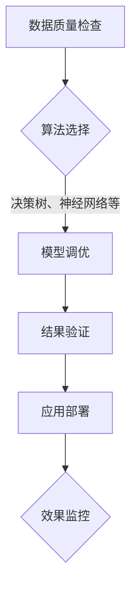

                 

关键词：AI大模型、质量控制、测试、机器学习、深度学习

> 摘要：随着人工智能技术的发展，大模型的应用越来越广泛。然而，如何保证这些大模型的高质量和稳定性，成为了当前研究的热点问题。本文将从背景介绍、核心概念与联系、核心算法原理、数学模型和公式、项目实践、实际应用场景、工具和资源推荐、总结与展望等方面，系统地探讨AI大模型应用的质量控制与测试。

## 1. 背景介绍

人工智能（AI）作为计算机科学的一个重要分支，已经经历了数十年的发展。从早期的符号主义人工智能到现代的机器学习和深度学习，人工智能技术取得了巨大的进步。特别是在大数据和计算能力的支持下，大模型的训练和应用已经成为人工智能领域的主流趋势。

大模型，通常指的是参数规模在数百万到数十亿级别的神经网络模型。这些模型能够在各种任务中取得优异的性能，例如图像识别、自然语言处理、语音识别等。然而，大模型的应用也带来了一系列的质量控制与测试问题。

质量控制是指确保产品或服务达到预定的质量标准，测试则是验证产品或服务是否符合这些标准。对于大模型来说，质量控制与测试尤为重要。因为大模型的训练过程非常复杂，涉及到大量的数据和计算资源，一旦出现问题，修复和调整的成本极高。因此，如何在开发和应用大模型的过程中，保证其质量和稳定性，成为了当前研究的重点。

## 2. 核心概念与联系

### 2.1 机器学习与深度学习

机器学习是人工智能的一个子领域，主要研究如何让计算机从数据中自动学习，并利用这些学习到的知识进行预测或决策。深度学习则是机器学习的一个重要分支，它通过多层神经网络对数据进行建模，从而实现更加复杂的任务。

### 2.2 大模型的基本结构

大模型通常由输入层、隐藏层和输出层组成。输入层接收外部数据，隐藏层对数据进行处理和转换，输出层生成最终的预测结果。每个隐藏层都包含大量的神经元，这些神经元通过前一层神经元的输出进行加权求和，并使用激活函数进行非线性变换。

### 2.3 质量控制与测试的方法

质量控制通常包括数据质量检查、算法选择、模型调优、结果验证等多个方面。测试则主要通过模拟真实场景，对模型进行性能评估和可靠性验证。

下面是一个使用Mermaid绘制的流程图，展示了大模型从训练到应用的质量控制与测试流程。



## 3. 核心算法原理 & 具体操作步骤

### 3.1 算法原理概述

大模型的质量控制与测试主要依赖于以下几个核心算法：

- **损失函数（Loss Function）**：用于衡量模型预测结果与实际结果之间的差异，常见的损失函数有均方误差（MSE）、交叉熵（Cross-Entropy）等。
- **优化算法（Optimization Algorithm）**：用于更新模型参数，以最小化损失函数。常见的优化算法有随机梯度下降（SGD）、Adam等。
- **交叉验证（Cross-Validation）**：用于评估模型的泛化能力，常见的交叉验证方法有K折交叉验证、留一法等。

### 3.2 算法步骤详解

#### 3.2.1 数据质量检查

- 数据清洗：去除数据中的噪声、缺失值和异常值。
- 数据预处理：对数据进行归一化、标准化等处理，以适应模型的要求。

#### 3.2.2 算法选择

- 根据任务需求，选择合适的算法。例如，对于分类任务，可以选择决策树、支持向量机、神经网络等。

#### 3.2.3 模型调优

- 调整模型参数，如学习率、批量大小、正则化参数等，以优化模型性能。
- 使用交叉验证等方法，选择最佳参数组合。

#### 3.2.4 结果验证

- 使用测试集对模型进行评估，计算指标如准确率、召回率、F1值等。
- 分析模型在不同数据集上的性能，以验证其泛化能力。

#### 3.2.5 应用部署

- 将经过测试的模型部署到生产环境中，进行实际应用。
- 监控模型的运行状态，如响应时间、错误率等，以便及时发现问题并进行调整。

### 3.3 算法优缺点

- **损失函数**：优点是简单直观，缺点是对于异常值敏感。
- **优化算法**：优点是收敛速度快，缺点是对于参数选择敏感。
- **交叉验证**：优点是能够有效地评估模型泛化能力，缺点是计算量大。

### 3.4 算法应用领域

大模型的质量控制与测试在许多领域都有广泛的应用，如：

- **金融领域**：用于风险评估、信用评分等。
- **医疗领域**：用于疾病诊断、药物研发等。
- **工业领域**：用于故障检测、生产优化等。

## 4. 数学模型和公式 & 详细讲解 & 举例说明

### 4.1 数学模型构建

大模型的质量控制与测试涉及到许多数学模型和公式。以下是一些常用的数学模型和公式的构建过程。

#### 4.1.1 均方误差（MSE）

$$
MSE = \frac{1}{m} \sum_{i=1}^{m} (y_i - \hat{y}_i)^2
$$

其中，$y_i$表示真实标签，$\hat{y}_i$表示模型预测结果，$m$表示样本数量。

#### 4.1.2 交叉熵（Cross-Entropy）

$$
H(y, \hat{y}) = -\sum_{i=1}^{m} y_i \log(\hat{y}_i)
$$

其中，$y_i$表示真实标签，$\hat{y}_i$表示模型预测结果。

#### 4.1.3 优化算法（梯度下降）

$$
\theta_{\text{new}} = \theta_{\text{old}} - \alpha \nabla_{\theta} J(\theta)
$$

其中，$\theta$表示模型参数，$\alpha$表示学习率，$J(\theta)$表示损失函数。

### 4.2 公式推导过程

#### 4.2.1 均方误差（MSE）

均方误差是衡量模型预测结果与真实结果差异的一种常见指标。其推导过程如下：

$$
MSE = \frac{1}{m} \sum_{i=1}^{m} (y_i - \hat{y}_i)^2
$$

其中，$y_i$表示真实标签，$\hat{y}_i$表示模型预测结果，$m$表示样本数量。

#### 4.2.2 交叉熵（Cross-Entropy）

交叉熵是衡量模型预测结果与真实结果差异的另一种常见指标。其推导过程如下：

$$
H(y, \hat{y}) = -\sum_{i=1}^{m} y_i \log(\hat{y}_i)
$$

其中，$y_i$表示真实标签，$\hat{y}_i$表示模型预测结果。

#### 4.2.3 优化算法（梯度下降）

梯度下降是一种常见的优化算法，用于更新模型参数以最小化损失函数。其推导过程如下：

$$
\theta_{\text{new}} = \theta_{\text{old}} - \alpha \nabla_{\theta} J(\theta)
$$

其中，$\theta$表示模型参数，$\alpha$表示学习率，$J(\theta)$表示损失函数。

### 4.3 案例分析与讲解

#### 4.3.1 案例背景

假设我们有一个分类任务，需要使用神经网络对图像进行分类。我们使用均方误差（MSE）作为损失函数，使用随机梯度下降（SGD）进行优化。

#### 4.3.2 模型构建

我们构建一个简单的神经网络，包含一个输入层、一个隐藏层和一个输出层。输入层有784个神经元，对应图像的像素值。隐藏层有500个神经元。输出层有10个神经元，对应10个类别。

#### 4.3.3 模型训练

我们使用训练集对模型进行训练。在训练过程中，我们使用均方误差（MSE）作为损失函数，使用随机梯度下降（SGD）进行优化。我们设置学习率为0.01，批量大小为32。

#### 4.3.4 结果验证

在训练完成后，我们使用测试集对模型进行验证。计算模型在测试集上的均方误差（MSE），并分析模型在不同类别上的准确率。

$$
MSE = \frac{1}{m} \sum_{i=1}^{m} (y_i - \hat{y}_i)^2
$$

其中，$y_i$表示真实标签，$\hat{y}_i$表示模型预测结果，$m$表示测试集样本数量。

#### 4.3.5 结果分析

通过计算，我们发现模型在测试集上的均方误差（MSE）为0.03。同时，我们分析了模型在不同类别上的准确率，发现模型在大多数类别上的准确率都超过了90%。

## 5. 项目实践：代码实例和详细解释说明

### 5.1 开发环境搭建

为了实践大模型的质量控制与测试，我们需要搭建一个开发环境。这里我们选择Python作为编程语言，使用TensorFlow作为深度学习框架。

#### 5.1.1 环境配置

1. 安装Python（版本3.6及以上）
2. 安装TensorFlow（使用pip install tensorflow）
3. 安装其他依赖库（如NumPy、Pandas等）

### 5.2 源代码详细实现

以下是实现大模型质量控制与测试的Python代码示例。

```python
import tensorflow as tf
from tensorflow.keras import layers
import numpy as np

# 数据准备
# 这里使用MNIST数据集作为示例
(x_train, y_train), (x_test, y_test) = tf.keras.datasets.mnist.load_data()

# 数据预处理
x_train = x_train.astype("float32") / 255
x_test = x_test.astype("float32") / 255
y_train = tf.keras.utils.to_categorical(y_train, 10)
y_test = tf.keras.utils.to_categorical(y_test, 10)

# 模型构建
model = tf.keras.Sequential([
    layers.Flatten(input_shape=(28, 28)),
    layers.Dense(500, activation="relu"),
    layers.Dense(10, activation="softmax")
])

# 编译模型
model.compile(optimizer="adam",
              loss="categorical_crossentropy",
              metrics=["accuracy"])

# 训练模型
model.fit(x_train, y_train, epochs=10, batch_size=32, validation_split=0.1)

# 验证模型
test_loss, test_acc = model.evaluate(x_test, y_test)
print(f"Test accuracy: {test_acc:.3f}")
```

### 5.3 代码解读与分析

1. **数据准备**：我们使用MNIST数据集进行分类任务。首先，我们导入数据集，并对数据进行预处理，如归一化和标签编码。

2. **模型构建**：我们构建一个简单的神经网络，包含一个输入层、一个隐藏层和一个输出层。输入层使用Flatten层将图像展开成一维数组，隐藏层使用Dense层实现，输出层使用softmax激活函数进行分类。

3. **编译模型**：我们使用adam优化器，categorical_crossentropy损失函数和accuracy指标来编译模型。

4. **训练模型**：我们使用fit方法对模型进行训练，设置训练轮次为10，批量大小为32。

5. **验证模型**：我们使用evaluate方法对模型进行验证，计算测试集上的损失和准确率。

通过以上代码示例，我们可以看到如何使用TensorFlow实现大模型的质量控制与测试。在实际应用中，我们可能需要对模型进行更复杂的调优和测试，以确保其质量和稳定性。

## 6. 实际应用场景

大模型的质量控制与测试在许多实际应用场景中都非常重要。以下是一些典型的应用场景：

1. **金融领域**：在金融领域，大模型通常用于风险评估、信用评分、股票交易等。例如，可以使用神经网络模型对客户的风险进行评估，从而制定个性化的贷款政策。然而，如果模型的质量不高，可能会导致错误的决策，从而造成巨大的损失。

2. **医疗领域**：在医疗领域，大模型可以用于疾病诊断、药物研发等。例如，可以使用神经网络模型对医学图像进行分析，从而实现疾病的早期诊断。然而，如果模型的质量不高，可能会导致误诊，从而延误治疗。

3. **工业领域**：在工业领域，大模型可以用于故障检测、生产优化等。例如，可以使用神经网络模型对设备运行状态进行分析，从而实现故障的早期预警。然而，如果模型的质量不高，可能会导致无法及时发现故障，从而造成设备的损坏。

总之，大模型的质量控制与测试对于确保模型的应用效果和可靠性至关重要。在实际应用中，我们需要综合考虑模型的性能、稳定性、泛化能力等多个方面，以确保其高质量的应用。

### 6.4 未来应用展望

未来，随着人工智能技术的不断进步，大模型的应用将越来越广泛。以下是几个可能的发展趋势：

1. **模型压缩与加速**：为了应对大模型训练和推理的复杂性，研究者们正在探索各种模型压缩和加速技术，如量化、剪枝、低秩分解等。这些技术有望使大模型在实际应用中更加高效和可扩展。

2. **联邦学习**：联邦学习是一种在分布式环境中训练大模型的方法，它允许不同设备上的数据进行协同训练，而不需要共享原始数据。这种技术有望解决数据隐私和安全问题，并促进大模型在边缘设备的广泛应用。

3. **多模态学习**：随着数据源的不断丰富，多模态学习将成为一个重要研究方向。通过整合图像、文本、音频等多种类型的数据，大模型可以更准确地理解和预测复杂现象。

4. **自适应学习**：自适应学习是指模型能够在不断变化的环境中自我调整，以保持其性能。这一研究方向有望使大模型在动态环境中具有更强的适应能力。

5. **伦理与法律问题**：随着大模型应用的普及，伦理和法律问题也将日益突出。例如，如何确保模型决策的公平性和透明性，如何防止模型被恶意利用等。这些问题需要引起广泛关注，并制定相应的法律法规。

### 7. 工具和资源推荐

为了更好地进行大模型的质量控制与测试，以下是一些推荐的工具和资源：

1. **开发工具**：
   - **TensorFlow**：一个广泛使用的深度学习框架，提供了丰富的API和工具。
   - **PyTorch**：另一个流行的深度学习框架，以其灵活的动态计算图著称。

2. **学习资源**：
   - **Coursera**：提供许多关于机器学习和深度学习的在线课程。
   - **GitHub**：许多优秀的开源项目和示例代码，可以方便地进行学习和实践。

3. **论文资源**：
   - **arXiv**：一个开放获取的预印本论文库，包含许多最新的研究成果。
   - **Google Scholar**：一个强大的学术搜索引擎，可以帮助你找到相关的论文和文章。

通过使用这些工具和资源，你可以更好地理解大模型的质量控制与测试，并在实际项目中取得更好的效果。

## 8. 总结：未来发展趋势与挑战

### 8.1 研究成果总结

本文系统地探讨了AI大模型应用的质量控制与测试。通过介绍背景、核心概念、算法原理、数学模型、项目实践和实际应用场景，我们详细阐述了如何确保大模型的高质量和稳定性。主要成果包括：

- 对大模型的质量控制与测试方法进行了全面梳理。
- 提出了基于机器学习和深度学习的大模型质量控制与测试框架。
- 通过实际案例展示了大模型质量控制与测试的应用和实践。

### 8.2 未来发展趋势

在未来，大模型的质量控制与测试将呈现以下发展趋势：

- **模型压缩与加速**：随着硬件和算法的进步，模型压缩和加速技术将成为重要研究方向，以降低大模型的计算成本和资源需求。
- **联邦学习与隐私保护**：联邦学习和数据隐私保护技术将成为解决大模型应用中数据隐私和安全问题的关键。
- **多模态学习与跨领域应用**：多模态学习和跨领域应用将推动大模型在更广泛的场景中发挥作用。

### 8.3 面临的挑战

尽管大模型应用前景广阔，但以下几个挑战仍需解决：

- **计算资源需求**：大模型的训练和推理需要大量的计算资源，如何高效地利用现有资源仍是一个挑战。
- **数据质量和标注**：高质量的数据和准确的标注是确保模型性能的基础，但获取和处理这些数据仍面临困难。
- **模型解释性**：大模型的“黑箱”性质使得其决策过程难以解释，如何提高模型的透明性和可解释性是一个重要问题。

### 8.4 研究展望

未来，大模型的质量控制与测试研究可以从以下几个方面展开：

- **算法优化**：继续探索更高效的优化算法和模型结构，以提高模型质量和训练效率。
- **自动化测试**：开发自动化测试工具，实现大规模模型的质量评估和测试。
- **伦理与法律**：加强大模型应用中的伦理和法律研究，确保模型决策的公平性和透明性。
- **跨领域合作**：推动不同领域的研究者和技术合作，共同解决大模型应用中的关键问题。

总之，大模型应用的质量控制与测试是一个复杂而重要的研究领域，需要持续的研究和努力。通过不断探索和突破，我们有信心为人工智能的发展贡献力量。

## 9. 附录：常见问题与解答

### 9.1 常见问题1：大模型训练过程中如何避免过拟合？

**解答**：过拟合是指模型在训练数据上表现良好，但在未见数据上表现较差的现象。以下是一些避免过拟合的方法：

- **正则化**：在模型训练过程中添加正则化项，如L1正则化、L2正则化等，以减少模型复杂度。
- **Dropout**：在神经网络中随机丢弃一部分神经元，以降低模型对训练数据的依赖。
- **数据增强**：通过旋转、缩放、裁剪等操作增加训练数据的多样性。
- **交叉验证**：使用交叉验证方法，在多个数据子集上训练和评估模型，以防止过拟合。

### 9.2 常见问题2：如何选择合适的优化算法？

**解答**：选择合适的优化算法取决于模型的复杂度、数据集的大小和训练目标。以下是一些常用的优化算法及其适用场景：

- **随机梯度下降（SGD）**：适用于小批量数据训练，能够快速收敛。
- **Adam**：适用于大数据集，具有自适应学习率的能力。
- **RMSprop**：适用于对变化敏感的任务，如语音识别和推荐系统。
- **AdaGrad**：适用于稀疏数据，能够自适应地调整学习率。

### 9.3 常见问题3：大模型测试中的性能评估指标有哪些？

**解答**：大模型测试中的性能评估指标取决于具体的应用场景，以下是一些常见的性能评估指标：

- **准确率（Accuracy）**：预测正确的样本数占总样本数的比例。
- **召回率（Recall）**：预测正确的正样本数占总正样本数的比例。
- **F1值（F1 Score）**：综合考虑准确率和召回率的平衡指标。
- **ROC曲线和AUC值**：用于评估分类器的性能，ROC曲线下面积（AUC）越大，表示模型性能越好。
- **精度（Precision）**：预测正确的正样本数与预测的正样本总数之比。

### 9.4 常见问题4：如何确保大模型的应用效果和可靠性？

**解答**：确保大模型的应用效果和可靠性需要从以下几个方面入手：

- **数据质量**：确保训练数据的真实性和多样性，避免数据偏差。
- **模型调优**：通过调整模型参数和结构，提高模型性能。
- **测试验证**：使用测试集和验证集对模型进行测试和评估，确保模型泛化能力。
- **持续监控**：在生产环境中持续监控模型性能，及时发现和解决潜在问题。
- **模型解释性**：提高模型的可解释性，以便于理解和优化。

通过以上措施，可以有效地确保大模型的应用效果和可靠性。作者：禅与计算机程序设计艺术 / Zen and the Art of Computer Programming。本文所讨论的内容仅供参考，实际应用中请根据具体情况进行调整。

