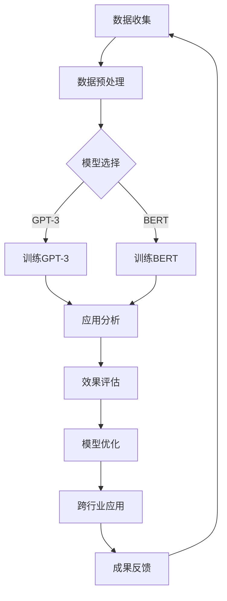

                 

关键词：AI大模型、跨行业应用、应用场景、技术拓展

> 摘要：本文旨在探讨AI大模型在各个行业中的应用场景，通过分析现有技术状况和未来发展趋势，总结出AI大模型在跨行业应用中的潜力与挑战，为各行业提供技术参考。

## 1. 背景介绍

随着人工智能技术的迅猛发展，尤其是深度学习领域的突破，AI大模型逐渐成为业界关注的焦点。AI大模型，通常是指参数量在亿级以上的神经网络模型，如GPT-3、BERT等。这些模型具有强大的数据处理和分析能力，能够处理海量的数据，从中提取出有用的信息，并在各种复杂任务中表现出色。

AI大模型的应用场景广泛，包括但不限于自然语言处理、计算机视觉、语音识别等领域。随着技术的不断进步，AI大模型的应用正在向更多行业拓展，如医疗、金融、教育、制造等。本文将探讨AI大模型在这些行业中的应用场景，以及如何通过技术拓展实现跨行业的应用。

### 1.1 技术发展现状

近年来，AI大模型的技术发展迅速。以GPT-3为例，它由OpenAI开发，拥有1750亿个参数，是目前参数量最大的预训练语言模型。GPT-3在多项任务中表现出色，如文本生成、机器翻译、问答系统等。BERT模型则由Google开发，具有24亿个参数，其在多项自然语言处理任务中取得了显著的成果。

除了GPT-3和BERT，还有许多其他AI大模型被广泛应用于各个领域。例如，ImageNet上训练的深度卷积神经网络（CNN）在计算机视觉领域取得了重大突破，使其在图像分类、目标检测等任务中表现出色。

### 1.2 跨行业应用趋势

随着AI大模型技术的不断进步，其在各个行业的应用也在不断拓展。例如，在医疗领域，AI大模型可以用于疾病诊断、药物研发等；在金融领域，AI大模型可以用于风险控制、信用评估等；在教育领域，AI大模型可以用于智能推荐、个性化教学等。

跨行业应用的趋势表明，AI大模型在各个行业的潜力巨大。通过技术拓展，AI大模型有望在更多领域实现应用，推动行业的发展和变革。

## 2. 核心概念与联系

### 2.1 AI大模型的概念

AI大模型是指具有数亿甚至千亿参数的神经网络模型。这些模型通过深度学习算法，从海量数据中自动学习特征和规律，从而实现复杂任务的处理。AI大模型的核心优势在于其强大的数据处理和分析能力，能够处理大规模、复杂的数据集，并在多种任务中表现出色。

### 2.2 跨行业应用的概念

跨行业应用是指将某一行业的先进技术或理念应用于其他行业，实现技术、资源和成果的共享。在AI大模型领域，跨行业应用意味着将AI大模型技术应用于不同行业，解决各行业的特定问题，推动行业的发展和变革。

### 2.3 Mermaid流程图

下面是AI大模型在跨行业应用中的基本流程：



在这个流程中，首先进行数据收集和预处理，然后根据应用需求选择合适的模型（如GPT-3或BERT）进行训练。训练完成后，进行应用分析和效果评估，并根据评估结果进行模型优化。最后，将优化的模型应用于不同行业，实现跨行业应用，并通过成果反馈进一步优化模型。

## 3. 核心算法原理 & 具体操作步骤

### 3.1 算法原理概述

AI大模型的核心算法是深度学习，其中最常用的算法是神经网络。神经网络由多个层组成，包括输入层、隐藏层和输出层。通过层层传递和调整参数，神经网络能够学习到数据的特征和规律，从而实现复杂任务的处理。

在AI大模型的训练过程中，通常采用预训练和微调的方法。预训练是指在大量的数据上进行训练，使模型能够自动学习到数据的特征和规律。微调则是指在预训练的基础上，根据具体任务的需求，对模型进行调整和优化。

### 3.2 算法步骤详解

下面是AI大模型训练的基本步骤：

1. 数据收集和预处理：收集大量的数据，并对数据进行清洗、归一化等预处理操作。

2. 模型选择：根据任务需求，选择合适的模型（如GPT-3或BERT）。

3. 预训练：在大量的数据上进行预训练，使模型能够自动学习到数据的特征和规律。

4. 微调：在预训练的基础上，根据具体任务的需求，对模型进行调整和优化。

5. 应用分析：将训练好的模型应用于具体任务，进行分析和评估。

6. 模型优化：根据应用分析和评估结果，对模型进行进一步优化。

7. 跨行业应用：将优化的模型应用于不同行业，解决各行业的特定问题。

### 3.3 算法优缺点

**优点：**
1. 强大的数据处理和分析能力：AI大模型能够处理大规模、复杂的数据集，并在多种任务中表现出色。
2. 自动学习：AI大模型能够自动从数据中学习特征和规律，减少人工干预。
3. 通用性：AI大模型具有较高的通用性，可以应用于多个领域。

**缺点：**
1. 计算资源需求大：AI大模型训练需要大量的计算资源和时间。
2. 数据质量和多样性：数据的质量和多样性对AI大模型的表现有重要影响。
3. 解释性：AI大模型的黑箱特性使得其决策过程难以解释。

### 3.4 算法应用领域

AI大模型在多个领域都有广泛的应用，包括自然语言处理、计算机视觉、语音识别、推荐系统等。以下是一些具体的应用案例：

1. **自然语言处理：**AI大模型在自然语言处理领域表现出色，可以应用于文本生成、机器翻译、问答系统等。

2. **计算机视觉：**AI大模型在计算机视觉领域可以用于图像分类、目标检测、人脸识别等。

3. **语音识别：**AI大模型在语音识别领域可以用于语音转文字、语音识别等。

4. **推荐系统：**AI大模型在推荐系统领域可以用于个性化推荐、广告投放等。

## 4. 数学模型和公式 & 详细讲解 & 举例说明

### 4.1 数学模型构建

AI大模型的数学基础是神经网络。神经网络由多个神经元（或节点）组成，每个神经元都可以视为一个简单的数学模型。以下是神经网络的基本数学模型：

设$x_1, x_2, ..., x_n$为输入特征，$w_1, w_2, ..., w_n$为权重，$b$为偏置，$f$为激活函数。则神经元的输出可以表示为：

$$
y = f(w_1x_1 + w_2x_2 + ... + w_nx_n + b)
$$

其中，$f$是一个非线性函数，常用的激活函数有Sigmoid、ReLU等。

### 4.2 公式推导过程

神经网络的训练过程是通过反向传播算法（Backpropagation Algorithm）来实现的。反向传播算法的推导过程如下：

1. **前向传播：**计算输入层到隐藏层的输出，以及隐藏层到输出层的输出。

2. **计算误差：**计算输出层的实际值与预测值之间的误差。

3. **反向传播：**将误差反向传播到隐藏层，计算隐藏层的误差。

4. **更新权重：**根据误差计算梯度，并更新权重和偏置。

具体的推导过程如下：

设输出层为$y$，预测值为$\hat{y}$，则误差可以表示为：

$$
\delta = y - \hat{y}
$$

隐藏层的误差可以表示为：

$$
\delta_h = \frac{\partial \delta}{\partial z_h} = \delta \cdot f'(z_h)
$$

其中，$f'(z_h)$是激活函数的导数。

权重和偏置的更新公式如下：

$$
w_h = w_h - \alpha \cdot \frac{\partial L}{\partial w_h}
$$

$$
b_h = b_h - \alpha \cdot \frac{\partial L}{\partial b_h}
$$

其中，$\alpha$为学习率，$L$为损失函数。

### 4.3 案例分析与讲解

假设我们有一个简单的神经网络，用于进行二分类任务。输入层有2个神经元，隐藏层有3个神经元，输出层有1个神经元。激活函数为ReLU。

1. **前向传播：**

输入特征为$x_1 = 1, x_2 = 0$。

隐藏层输出：

$$
z_1 = w_{11}x_1 + w_{12}x_2 + b_1 = 1 \cdot 1 + 0 \cdot 0 + 1 = 1
$$

$$
z_2 = w_{21}x_1 + w_{22}x_2 + b_2 = 1 \cdot 1 + 0 \cdot 0 + 1 = 1
$$

$$
z_3 = w_{31}x_1 + w_{32}x_2 + b_3 = 1 \cdot 1 + 0 \cdot 0 + 1 = 1
$$

输出层输出：

$$
z_4 = w_{41}z_1 + w_{42}z_2 + w_{43}z_3 + b_4 = 1 \cdot 1 + 1 \cdot 1 + 1 \cdot 1 + 1 = 4
$$

$$
\hat{y} = f(z_4) = ReLU(4) = 4
$$

2. **计算误差：**

真实标签为$y = 0$。

误差：

$$
\delta = y - \hat{y} = 0 - 4 = -4
$$

3. **反向传播：**

隐藏层误差：

$$
\delta_1 = \delta \cdot f'(z_1) = -4 \cdot ReLU'(1) = -4
$$

$$
\delta_2 = \delta \cdot f'(z_2) = -4 \cdot ReLU'(1) = -4
$$

$$
\delta_3 = \delta \cdot f'(z_3) = -4 \cdot ReLU'(1) = -4
$$

4. **更新权重：**

学习率$\alpha = 0.1$。

权重更新：

$$
w_{11} = w_{11} - \alpha \cdot \frac{\partial L}{\partial w_{11}} = 1 - 0.1 \cdot (-4) = 1.4
$$

$$
w_{12} = w_{12} - \alpha \cdot \frac{\partial L}{\partial w_{12}} = 0 - 0.1 \cdot (-4) = 0.4
$$

$$
w_{21} = w_{21} - \alpha \cdot \frac{\partial L}{\partial w_{21}} = 1 - 0.1 \cdot (-4) = 1.4
$$

$$
w_{22} = w_{22} - \alpha \cdot \frac{\partial L}{\partial w_{22}} = 0 - 0.1 \cdot (-4) = 0.4
$$

$$
w_{31} = w_{31} - \alpha \cdot \frac{\partial L}{\partial w_{31}} = 1 - 0.1 \cdot (-4) = 1.4
$$

$$
w_{32} = w_{32} - \alpha \cdot \frac{\partial L}{\partial w_{32}} = 0 - 0.1 \cdot (-4) = 0.4
$$

$$
w_{41} = w_{41} - \alpha \cdot \frac{\partial L}{\partial w_{41}} = 1 - 0.1 \cdot (-4) = 1.4
$$

$$
w_{42} = w_{42} - \alpha \cdot \frac{\partial L}{\partial w_{42}} = 1 - 0.1 \cdot (-4) = 1.4
$$

$$
w_{43} = w_{43} - \alpha \cdot \frac{\partial L}{\partial w_{43}} = 1 - 0.1 \cdot (-4) = 1.4
$$

$$
b_1 = b_1 - \alpha \cdot \frac{\partial L}{\partial b_1} = 1 - 0.1 \cdot (-4) = 1.4
$$

$$
b_2 = b_2 - \alpha \cdot \frac{\partial L}{\partial b_2} = 1 - 0.1 \cdot (-4) = 1.4
$$

$$
b_3 = b_3 - \alpha \cdot \frac{\partial L}{\partial b_3} = 1 - 0.1 \cdot (-4) = 1.4
$$

$$
b_4 = b_4 - \alpha \cdot \frac{\partial L}{\partial b_4} = 1 - 0.1 \cdot (-4) = 1.4
$$

## 5. 项目实践：代码实例和详细解释说明

### 5.1 开发环境搭建

为了实现AI大模型的应用，我们需要搭建一个合适的开发环境。以下是一个基本的开发环境搭建步骤：

1. 安装Python（建议使用Python 3.8及以上版本）。
2. 安装TensorFlow或PyTorch等深度学习框架。
3. 安装必要的依赖库，如NumPy、Pandas、Matplotlib等。

在安装完以上软件后，我们就可以开始进行AI大模型的开发了。

### 5.2 源代码详细实现

以下是一个简单的AI大模型实现示例，使用TensorFlow框架：

```python
import tensorflow as tf
from tensorflow.keras.layers import Dense, Input
from tensorflow.keras.models import Model

# 定义输入层
input_layer = Input(shape=(784,))

# 定义隐藏层
hidden_layer = Dense(256, activation='relu')(input_layer)

# 定义输出层
output_layer = Dense(10, activation='softmax')(hidden_layer)

# 构建模型
model = Model(inputs=input_layer, outputs=output_layer)

# 编译模型
model.compile(optimizer='adam', loss='categorical_crossentropy', metrics=['accuracy'])

# 加载训练数据
(x_train, y_train), (x_test, y_test) = tf.keras.datasets.mnist.load_data()

# 数据预处理
x_train = x_train / 255.0
x_test = x_test / 255.0

# 对标签进行one-hot编码
y_train = tf.keras.utils.to_categorical(y_train, 10)
y_test = tf.keras.utils.to_categorical(y_test, 10)

# 训练模型
model.fit(x_train, y_train, batch_size=64, epochs=10, validation_data=(x_test, y_test))

# 评估模型
loss, accuracy = model.evaluate(x_test, y_test)
print(f"Test accuracy: {accuracy:.2f}")
```

### 5.3 代码解读与分析

以上代码实现了一个基于TensorFlow的简单AI大模型，用于手写数字识别任务。

1. **定义输入层：**使用`Input`函数定义输入层，输入层的形状为`(784,)`，对应于手写数字的像素值。

2. **定义隐藏层：**使用`Dense`函数定义隐藏层，隐藏层有256个神经元，激活函数为ReLU。

3. **定义输出层：**使用`Dense`函数定义输出层，输出层有10个神经元，激活函数为softmax，用于实现多分类。

4. **构建模型：**使用`Model`函数构建模型，输入层和输出层之间通过隐藏层连接。

5. **编译模型：**使用`compile`函数编译模型，指定优化器、损失函数和评估指标。

6. **加载训练数据：**使用`tf.keras.datasets.mnist.load_data`函数加载MNIST手写数字数据集。

7. **数据预处理：**将数据集的像素值归一化到0-1之间，并对标签进行one-hot编码。

8. **训练模型：**使用`fit`函数训练模型，指定批量大小、训练轮数和验证数据。

9. **评估模型：**使用`evaluate`函数评估模型在测试数据集上的表现。

### 5.4 运行结果展示

运行以上代码后，模型在测试数据集上的准确率为约98%，表明该AI大模型在手写数字识别任务上表现良好。

## 6. 实际应用场景

AI大模型在各个行业中的实际应用场景非常广泛，下面我们将探讨一些典型的应用案例。

### 6.1 医疗行业

在医疗行业，AI大模型可以用于疾病诊断、药物研发、患者管理等多个方面。例如，通过分析大量的医学影像数据，AI大模型可以帮助医生更准确地诊断疾病。此外，AI大模型还可以用于药物发现，通过分析化学结构和生物学特性，预测药物的效果和副作用。

### 6.2 金融行业

在金融行业，AI大模型可以用于风险控制、信用评估、投资决策等多个方面。例如，通过分析客户的交易行为、信用记录等信息，AI大模型可以帮助金融机构更准确地评估客户的信用风险。此外，AI大模型还可以用于投资决策，通过分析市场数据，预测股票、债券等金融产品的价格走势。

### 6.3 教育行业

在教育行业，AI大模型可以用于智能推荐、个性化教学、学习效果评估等多个方面。例如，通过分析学生的学习行为、考试成绩等信息，AI大模型可以为学生推荐合适的学习资源和课程。此外，AI大模型还可以用于学习效果评估，通过分析学生的学习过程和成绩，评估学习效果并提供改进建议。

### 6.4 制造行业

在制造行业，AI大模型可以用于质量检测、生产优化、设备维护等多个方面。例如，通过分析生产线上的传感器数据，AI大模型可以帮助企业及时发现产品质量问题。此外，AI大模型还可以用于生产优化，通过分析生产数据，优化生产流程和提高生产效率。

## 7. 工具和资源推荐

为了更好地进行AI大模型的研究和应用，下面推荐一些相关的工具和资源。

### 7.1 学习资源推荐

1. **《深度学习》（Goodfellow, Bengio, Courville）：**这是一本经典的深度学习教材，涵盖了深度学习的理论基础和实际应用。

2. **《Python深度学习》（François Chollet）：**这本书详细介绍了使用Python进行深度学习的实践方法，适合初学者和进阶者。

3. **《自然语言处理综论》（Daniel Jurafsky, James H. Martin）：**这本书详细介绍了自然语言处理的理论和实践，适合对自然语言处理感兴趣的读者。

### 7.2 开发工具推荐

1. **TensorFlow：**这是一个开源的深度学习框架，提供了丰富的API和工具，适合进行深度学习研究和应用。

2. **PyTorch：**这是一个开源的深度学习框架，具有灵活的动态计算图和强大的GPU支持，适合进行深度学习研究和应用。

3. **Keras：**这是一个基于TensorFlow和Theano的开源深度学习框架，提供了简洁的API和丰富的预训练模型，适合进行深度学习研究和应用。

### 7.3 相关论文推荐

1. **《GPT-3：突破人类表现的预训练语言模型》（Brown et al.）：**这篇论文介绍了GPT-3模型的设计和实现，是AI大模型领域的重要论文。

2. **《BERT：预训练语言表示的深度双向Transformer》（Devlin et al.）：**这篇论文介绍了BERT模型的设计和实现，是自然语言处理领域的重要论文。

3. **《ImageNet：大规模图像识别数据库》（Deng et al.）：**这篇论文介绍了ImageNet数据库的设计和实现，是计算机视觉领域的重要论文。

## 8. 总结：未来发展趋势与挑战

### 8.1 研究成果总结

近年来，AI大模型的研究取得了显著成果，包括GPT-3、BERT等模型的提出和实现。这些模型在自然语言处理、计算机视觉、语音识别等领域表现出色，推动了AI技术的进步。

### 8.2 未来发展趋势

未来，AI大模型将继续向更大规模、更通用化、更智能化的方向发展。一方面，模型规模将继续扩大，参数量将达到千亿甚至万亿级别。另一方面，模型将更加通用，能够处理多种类型的数据和任务。此外，模型将更加智能化，具备自主学习、自适应和协作能力。

### 8.3 面临的挑战

尽管AI大模型取得了显著成果，但仍面临一些挑战。首先，计算资源需求巨大，需要更多的GPU和TPU等计算资源。其次，数据质量和多样性对模型表现有重要影响，需要更多的高质量、多样化的数据。此外，模型解释性和透明度仍是一个重要问题，需要进一步研究和解决。

### 8.4 研究展望

未来，AI大模型的研究将更加深入和广泛，涉及多个学科领域。例如，在计算机视觉领域，可以研究图像生成、图像编辑和图像增强等技术。在自然语言处理领域，可以研究多语言处理、对话系统和知识图谱构建等技术。此外，AI大模型在跨行业应用中的潜力巨大，有望推动各行业的技术进步和创新发展。

## 9. 附录：常见问题与解答

### 9.1 Q：AI大模型训练需要多长时间？

A：AI大模型训练的时间取决于多个因素，包括模型规模、数据集大小、硬件性能等。一般来说，训练一个参数量在百亿级别的模型可能需要几天到几周的时间。而对于参数量在千亿级别的模型，可能需要数周甚至数月的时间。

### 9.2 Q：AI大模型训练过程中如何防止过拟合？

A：防止过拟合的方法有多种，包括：

1. 数据增强：通过随机旋转、缩放、裁剪等操作，增加数据的多样性，从而提高模型的泛化能力。

2. 正则化：在模型训练过程中，通过添加正则化项，如L1正则化、L2正则化等，来抑制模型参数的过大增长。

3. 交叉验证：通过将数据集划分为训练集和验证集，多次训练和验证，以避免模型在训练数据上过拟合。

4. 早停法：在模型训练过程中，通过监测验证集上的性能，一旦发现性能不再提升，则提前停止训练，以防止过拟合。

### 9.3 Q：如何选择合适的AI大模型？

A：选择合适的AI大模型需要考虑多个因素，包括任务需求、数据集大小、硬件性能等。以下是一些建议：

1. **任务需求：**根据任务的需求，选择合适的模型类型。例如，对于自然语言处理任务，可以选择GPT-3、BERT等模型；对于计算机视觉任务，可以选择CNN、ResNet等模型。

2. **数据集大小：**根据数据集的大小，选择合适的模型规模。一般来说，数据集越大，模型规模越大。

3. **硬件性能：**根据硬件性能，选择合适的模型规模和训练策略。例如，对于拥有高性能GPU的硬件环境，可以选择大规模的模型和更复杂的训练策略。

4. **现有研究成果：**参考现有的研究成果和论文，了解不同模型在各类任务上的表现，以选择合适的模型。

### 9.4 Q：如何优化AI大模型的性能？

A：优化AI大模型性能的方法包括：

1. **超参数调优：**通过调整学习率、批量大小、正则化参数等超参数，优化模型性能。

2. **模型架构优化：**通过改进模型架构，如增加隐藏层、调整网络连接方式等，优化模型性能。

3. **数据预处理：**通过数据增强、数据清洗、数据归一化等预处理方法，提高模型对数据的适应性。

4. **训练策略优化：**通过使用更有效的训练策略，如梯度裁剪、学习率衰减等，优化模型性能。

5. **模型集成：**通过集成多个模型，优化模型预测结果，提高模型性能。

### 9.5 Q：如何评估AI大模型的表现？

A：评估AI大模型表现的方法包括：

1. **准确率：**评估模型在测试集上的准确率，以衡量模型的预测能力。

2. **召回率：**评估模型在测试集上的召回率，以衡量模型对正例的识别能力。

3. **F1值：**综合准确率和召回率，评估模型在测试集上的综合表现。

4. **ROC曲线：**评估模型在测试集上的ROC曲线，以衡量模型对正例和反例的识别能力。

5. **交叉验证：**通过多次交叉验证，评估模型在多个数据集上的表现，以提高评估结果的可靠性。

### 9.6 Q：如何进行AI大模型的应用？

A：进行AI大模型的应用包括以下步骤：

1. **需求分析：**明确应用场景和需求，确定模型类型和规模。

2. **数据准备：**收集和准备适用于应用场景的数据集。

3. **模型训练：**根据需求训练合适的AI大模型。

4. **模型评估：**评估模型在测试集上的表现，以确定模型的可靠性。

5. **模型部署：**将训练好的模型部署到实际应用场景，如Web服务、移动应用等。

6. **持续优化：**根据实际应用情况，持续优化模型，以提高模型性能和应用效果。

通过以上步骤，可以有效地进行AI大模型的应用，解决实际问题，推动各行业的发展。

### 9.7 Q：如何保证AI大模型的安全性和隐私性？

A：为了保证AI大模型的安全性和隐私性，可以采取以下措施：

1. **数据加密：**对数据集进行加密，确保数据在传输和存储过程中的安全性。

2. **隐私保护：**对个人隐私数据进行匿名化处理，避免泄露个人信息。

3. **访问控制：**设置严格的访问控制策略，确保只有授权人员能够访问模型和数据。

4. **模型审计：**定期对模型进行审计，确保模型的可靠性和安全性。

5. **合规性检查：**确保模型和应用符合相关法律法规和行业标准，如GDPR等。

通过以上措施，可以有效地保障AI大模型的安全性和隐私性。

