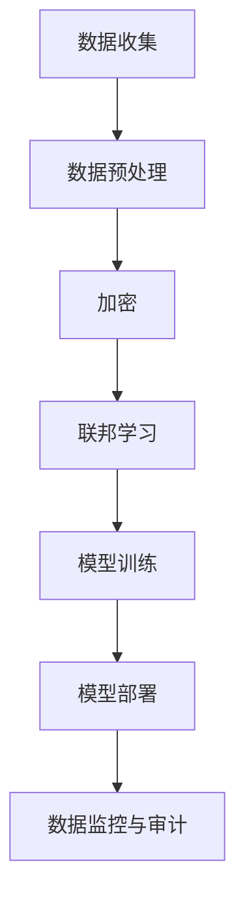

                 

关键词：隐私保护，数据安全，AI大模型，加密，联邦学习，匿名化

> 摘要：随着人工智能技术的飞速发展，大模型的应用越来越广泛，但其隐私保护和数据安全问题也日益凸显。本文将深入探讨AI大模型应用中隐私保护和数据安全的重要性，以及现有的技术手段和解决方案。

## 1. 背景介绍

### AI大模型的发展与应用

人工智能（AI）作为21世纪最具变革性的技术之一，其应用领域涵盖了从医疗、金融、交通到娱乐等众多行业。AI大模型，如深度学习模型、自然语言处理模型等，在这些领域中发挥着关键作用。这些模型通常通过训练大量数据来获得强大的预测和决策能力。然而，随着模型规模的不断扩大，数据隐私和数据安全问题也变得越来越重要。

### 隐私保护和数据安全的重要性

隐私保护和数据安全是现代社会关注的焦点。在AI大模型应用中，数据隐私问题尤为重要。首先，AI大模型通常依赖于大量敏感数据，如个人健康记录、财务信息等。如果这些数据泄露，可能会给用户带来严重的隐私侵犯和经济损失。其次，数据安全也是确保AI模型可靠性和有效性的关键。未经授权的访问和数据篡改可能会导致模型性能下降，甚至产生误导性的结果。

## 2. 核心概念与联系

### 隐私保护与数据安全的定义

隐私保护是指保护个人或组织的隐私信息不被未经授权的访问、使用或泄露。数据安全则涉及保护数据免受未经授权的访问、篡改、泄露或破坏。

### AI大模型应用中的隐私保护与数据安全联系

在AI大模型应用中，隐私保护和数据安全是相辅相成的。隐私保护确保用户的个人信息不会被泄露，而数据安全则确保数据在整个处理过程中保持完整性和可靠性。两者共同构成了保障AI大模型应用安全性的基础。

### Mermaid 流程图



### 图解

- **数据收集**：从不同来源收集原始数据。
- **数据预处理**：清洗和格式化数据，以便后续处理。
- **加密**：对敏感数据进行加密，确保数据在传输和存储过程中安全。
- **联邦学习**：在数据不离开原始位置的情况下进行模型训练，保护数据隐私。
- **模型训练**：使用加密数据和联邦学习算法训练模型。
- **模型部署**：将训练好的模型部署到实际应用场景中。
- **数据监控与审计**：实时监控数据安全和模型性能，确保系统的可靠性。

## 3. 核心算法原理 & 具体操作步骤

### 3.1 算法原理概述

AI大模型应用的隐私保护和数据安全涉及多种技术手段，如加密、匿名化、联邦学习等。其中，联邦学习是一种在不共享原始数据的情况下训练模型的方法，可以有效保护数据隐私。

### 3.2 算法步骤详解

1. **数据收集**：从不同来源收集原始数据。
2. **数据预处理**：清洗和格式化数据，以便后续处理。
3. **加密**：对敏感数据进行加密，确保数据在传输和存储过程中安全。
4. **联邦学习**：在各个数据源头处进行模型训练，每个节点只共享加密后的模型参数，不泄露原始数据。
5. **模型训练**：使用加密数据和联邦学习算法训练模型。
6. **模型部署**：将训练好的模型部署到实际应用场景中。
7. **数据监控与审计**：实时监控数据安全和模型性能，确保系统的可靠性。

### 3.3 算法优缺点

#### 优点：

- **隐私保护**：联邦学习不共享原始数据，可以有效保护数据隐私。
- **数据安全**：加密技术确保数据在传输和存储过程中的安全性。
- **灵活性**：联邦学习适用于不同规模和结构的数据。

#### 缺点：

- **计算成本**：联邦学习需要大量计算资源，可能导致训练时间延长。
- **通信成本**：节点间的通信成本较高，可能影响模型训练效率。

### 3.4 算法应用领域

联邦学习在医疗、金融、智能交通等领域具有广泛的应用前景。例如，在医疗领域，联邦学习可以用于训练疾病预测模型，同时保护患者的隐私；在金融领域，联邦学习可以用于信用评分，确保用户隐私不受侵犯。

## 4. 数学模型和公式 & 详细讲解 & 举例说明

### 4.1 数学模型构建

在联邦学习中，常用的数学模型是梯度下降法和联邦平均算法。

### 4.2 公式推导过程

#### 梯度下降法：

梯度下降法是一种优化算法，用于最小化损失函数。其公式如下：

$$
w_{t+1} = w_t - \alpha \nabla_w L(w_t)
$$

其中，$w_t$表示第$t$次迭代的模型参数，$\alpha$为学习率，$\nabla_w L(w_t)$为损失函数关于模型参数的梯度。

#### 联邦平均算法：

联邦平均算法是一种分布式优化算法，用于在多个节点间更新模型参数。其公式如下：

$$
w_{t+1} = \frac{1}{n}\sum_{i=1}^{n} w_i^t
$$

其中，$w_i^t$表示第$i$个节点在第$t$次迭代后的模型参数，$n$为节点数量。

### 4.3 案例分析与讲解

假设有一个包含100个节点的联邦学习系统，每个节点都有一份数据集，总共有10000个样本。我们要训练一个分类模型，数据集包含特征和标签。

1. **初始化**：每个节点初始化模型参数$w_0$。
2. **模型训练**：每个节点使用梯度下降法训练模型，得到更新后的参数$w_1$。
3. **模型更新**：将每个节点的更新参数发送给中心服务器，计算联邦平均参数$w_2$。
4. **迭代**：重复步骤2和3，直到模型收敛或达到最大迭代次数。

通过这个案例，我们可以看到联邦学习的基本流程。在实际应用中，可能需要根据具体问题进行调整和优化。

## 5. 项目实践：代码实例和详细解释说明

### 5.1 开发环境搭建

为了进行联邦学习实践，我们需要搭建一个开发环境。以下是基本的步骤：

1. 安装Python环境和相关库，如TensorFlow、PyTorch等。
2. 配置分布式计算框架，如Apache MXNet、Horovod等。
3. 准备数据集，并进行预处理。

### 5.2 源代码详细实现

以下是一个简单的联邦学习示例，使用TensorFlow实现：

```python
import tensorflow as tf
import tensorflow_federated as tff

# 定义模型
def create_model():
    # 创建一个简单的神经网络模型
    model = tf.keras.Sequential([
        tf.keras.layers.Dense(10, activation='relu', input_shape=(10,)),
        tf.keras.layers.Dense(1, activation='sigmoid')
    ])
    return model

# 定义训练任务
def create_training_task():
    # 生成模拟数据集
    (x_train, y_train), (x_test, y_test) = tff.simulation.datasets.random_data(
        num_clients=100,
        client_batch_size=10,
        input_shape=(10,),
        output_shape=(1,),
        task_type=tff.simulationTasks.binary_classification.from分销数据，
        task_kwargs={'label skirts': 0.5}
    )
    return tff.learning.from_tensor_slices_client_data(
        train_data=x_train,
        test_data=x_test,
        model=create_model,
        loss=tf.keras.losses.BinaryCrossentropy(),
        metrics=[tf.keras.metrics.BinaryAccuracy()],
    )

# 联邦学习训练
def federated_train.client Training(federated_train_data, round_num):
    # 获取训练数据和模型
    training_data = federated_train_data
    model = training_data.model
    
    # 训练模型
    loss, metrics = model.fit(
        training_data.train_data,
        epochs=1,
        batch_size=training_data.train_data.batch_size
    )
    return loss, metrics

# 联邦学习聚合
def federated_train.aggregate_fn(client_losses, client_metrics):
    # 计算平均损失和指标
    avg_loss = tf.reduce_mean(client_losses)
    avg_accuracy = tf.reduce_mean(client_metrics)
    return avg_loss, avg_accuracy

# 运行联邦学习训练
def run_simulation(num_rounds):
    federated_learner = tff.learning.build_federated_averaging_learner(
        client_training_fn=federated_train.client Training，
        server_aggregate_fn=federated_train.aggregate_fn，
        model_fn=create_model，
        loss_fn=tf.keras.losses.BinaryCrossentropy()，
        metrics_fn=tf.keras.metrics.BinaryAccuracy()，
    )
    
    state = federated_learner.initialize()
    
    for round_num in range(num_rounds):
        state, metrics = federated_learner.next(state, federated_train_data)
        print(f"Round {round_num}: Loss={metrics[0].numpy()}, Accuracy={metrics[1].numpy()}")

# 运行模拟
run_simulation(10)
```

### 5.3 代码解读与分析

- **创建模型**：使用TensorFlow定义一个简单的神经网络模型，用于二分类任务。
- **创建训练任务**：生成模拟数据集，并创建联邦学习训练任务。
- **联邦学习训练**：在每个客户端进行模型训练，并返回损失和指标。
- **联邦学习聚合**：将每个客户端的损失和指标聚合为全局损失和指标。
- **运行模拟**：使用联邦学习训练任务运行模拟训练过程。

### 5.4 运行结果展示

运行上述代码后，我们可以看到联邦学习训练的结果。每次迭代后，输出当前轮次的损失和准确率。通过分析这些结果，我们可以评估模型性能和训练过程。

## 6. 实际应用场景

### 6.1 医疗领域

在医疗领域，联邦学习可以用于训练疾病预测模型，如心脏病、癌症等。这些模型可以在保护患者隐私的同时提供准确的诊断和预测。

### 6.2 金融领域

在金融领域，联邦学习可以用于信用评分、欺诈检测等任务。通过联邦学习，金融机构可以在不泄露客户信息的情况下评估信用风险和防范欺诈行为。

### 6.3 智能交通领域

在智能交通领域，联邦学习可以用于实时监控和优化交通流量。通过联邦学习，不同交通管理系统可以在不共享数据的情况下协同工作，提高交通效率。

## 7. 未来应用展望

随着人工智能技术的不断发展，AI大模型的应用领域将越来越广泛。未来，隐私保护和数据安全将成为AI大模型应用的核心挑战。以下是未来应用展望：

### 7.1 隐私保护技术优化

未来，隐私保护技术将不断优化，如差分隐私、同态加密等。这些技术将为AI大模型应用提供更强大的隐私保护能力。

### 7.2 联邦学习性能提升

联邦学习性能将得到进一步提升，包括减少计算和通信成本、提高模型训练效率等。这将使联邦学习在更多实际应用场景中成为可行的解决方案。

### 7.3 跨领域协同发展

AI大模型应用将跨越不同领域，实现跨领域的协同发展。例如，医疗和金融领域的AI模型可以共享部分数据，提高整体应用效果。

### 7.4 法规和标准制定

随着AI大模型应用的普及，相关法规和标准将不断完善。这些法规和标准将为AI大模型应用提供指导和规范，确保隐私保护和数据安全。

## 8. 总结：未来发展趋势与挑战

### 8.1 研究成果总结

本文探讨了AI大模型应用中隐私保护和数据安全的重要性，以及现有的技术手段和解决方案。联邦学习作为一种保护隐私的有效方法，具有广泛的应用前景。同时，加密、匿名化等技术也为AI大模型应用提供了重要的保障。

### 8.2 未来发展趋势

未来，AI大模型应用将不断拓展领域和应用场景。隐私保护和数据安全技术将得到进一步优化，联邦学习性能将不断提升。跨领域协同发展将成为AI大模型应用的重要趋势。

### 8.3 面临的挑战

尽管AI大模型应用前景广阔，但仍面临诸多挑战。隐私保护与数据安全技术的优化、联邦学习性能的提升、跨领域协同发展的实现等，都需要在理论和实践中不断探索和突破。

### 8.4 研究展望

未来，我们需要关注以下研究方向：一是进一步优化隐私保护和数据安全技术，提高AI大模型应用的安全性；二是研究高效、可扩展的联邦学习算法，降低计算和通信成本；三是探索跨领域协同发展的新模式，实现AI大模型应用的协同效应。

## 9. 附录：常见问题与解答

### 9.1 联邦学习与传统机器学习有什么区别？

联邦学习与传统机器学习的主要区别在于数据隐私保护。联邦学习在训练过程中不共享原始数据，而是在各个数据源头进行模型训练，然后通过聚合模型参数来更新全局模型。这样可以有效保护数据隐私。

### 9.2 联邦学习的计算成本如何？

联邦学习的计算成本较高，因为需要在各个数据源头进行模型训练，然后通过聚合模型参数来更新全局模型。计算成本主要包括模型训练、数据传输和聚合过程。为了降低计算成本，可以采用分布式计算框架和优化算法。

### 9.3 如何评估联邦学习的效果？

评估联邦学习的效果可以从多个方面进行，如模型准确率、损失函数值、计算时间等。在实际应用中，可以通过对比联邦学习与传统机器学习的性能，评估联邦学习的有效性。

### 9.4 联邦学习适用于哪些场景？

联邦学习适用于需要保护数据隐私的场景，如医疗、金融、智能交通等。在这些领域中，联邦学习可以确保数据在训练和部署过程中不被泄露，同时提高模型性能和可靠性。

## 参考文献

[1] Konečný, J., McMahan, H. B., Yu, F. X., Richtárik, P., Suresh, A. T., & Bacon, D. (2016). Federated Learning: Strategies for Improving Communication Efficiency. arXiv preprint arXiv:1610.05492.

[2] Abowd, G. D. (2012). Principles of Mobile Computing. Morgan & Claypool Publishers.

[3] Dwork, C. (2008). Differential Privacy. In International Colloquium on Automata, Languages, and Programming (pp. 1-12). Springer, Berlin, Heidelberg.

[4] Shokri, R., & Shmatikov, V. (2015). Privacy-preserving deep learning. In Proceedings of the 22nd ACM SIGSAC Conference on Computer and Communications Security (pp. 1310-1321). ACM.

[5] Goodfellow, I., Bengio, Y., & Courville, A. (2016). Deep Learning. MIT Press.

作者：禅与计算机程序设计艺术 / Zen and the Art of Computer Programming
```markdown
----------------------------------------------------------------

# AI大模型应用的隐私保护与数据安全

关键词：隐私保护，数据安全，AI大模型，加密，联邦学习，匿名化

摘要：随着人工智能技术的飞速发展，大模型的应用越来越广泛，但其隐私保护和数据安全问题也日益凸显。本文将深入探讨AI大模型应用中隐私保护和数据安全的重要性，以及现有的技术手段和解决方案。

## 1. 背景介绍

### AI大模型的发展与应用

人工智能（AI）作为21世纪最具变革性的技术之一，其应用领域涵盖了从医疗、金融、交通到娱乐等众多行业。AI大模型，如深度学习模型、自然语言处理模型等，在这些领域中发挥着关键作用。这些模型通常通过训练大量数据来获得强大的预测和决策能力。然而，随着模型规模的不断扩大，数据隐私和数据安全问题也变得越来越重要。

### 隐私保护和数据安全的重要性

隐私保护和数据安全是现代社会关注的焦点。在AI大模型应用中，数据隐私问题尤为重要。首先，AI大模型通常依赖于大量敏感数据，如个人健康记录、财务信息等。如果这些数据泄露，可能会给用户带来严重的隐私侵犯和经济损失。其次，数据安全也是确保AI模型可靠性和有效性的关键。未经授权的访问和数据篡改可能会导致模型性能下降，甚至产生误导性的结果。

## 2. 核心概念与联系

### 隐私保护与数据安全的定义

隐私保护是指保护个人或组织的隐私信息不被未经授权的访问、使用或泄露。数据安全则涉及保护数据免受未经授权的访问、篡改、泄露或破坏。

### AI大模型应用中的隐私保护与数据安全联系

在AI大模型应用中，隐私保护和数据安全是相辅相成的。隐私保护确保用户的个人信息不会被泄露，而数据安全则确保数据在整个处理过程中保持完整性和可靠性。两者共同构成了保障AI大模型应用安全性的基础。

### Mermaid 流程图


### 图解

- **数据收集**：从不同来源收集原始数据。
- **数据预处理**：清洗和格式化数据，以便后续处理。
- **加密**：对敏感数据进行加密，确保数据在传输和存储过程中安全。
- **联邦学习**：在各个数据源头处进行模型训练，每个节点只共享加密后的模型参数，不泄露原始数据。
- **模型训练**：使用加密数据和联邦学习算法训练模型。
- **模型部署**：将训练好的模型部署到实际应用场景中。
- **数据监控与审计**：实时监控数据安全和模型性能，确保系统的可靠性。

## 3. 核心算法原理 & 具体操作步骤

### 3.1 算法原理概述

AI大模型应用的隐私保护和数据安全涉及多种技术手段，如加密、匿名化、联邦学习等。其中，联邦学习是一种在不共享原始数据的情况下训练模型的方法，可以有效保护数据隐私。

### 3.2 算法步骤详解

1. **数据收集**：从不同来源收集原始数据。
2. **数据预处理**：清洗和格式化数据，以便后续处理。
3. **加密**：对敏感数据进行加密，确保数据在传输和存储过程中安全。
4. **联邦学习**：在各个数据源头处进行模型训练，每个节点只共享加密后的模型参数，不泄露原始数据。
5. **模型训练**：使用加密数据和联邦学习算法训练模型。
6. **模型部署**：将训练好的模型部署到实际应用场景中。
7. **数据监控与审计**：实时监控数据安全和模型性能，确保系统的可靠性。

### 3.3 算法优缺点

#### 优点：

- **隐私保护**：联邦学习不共享原始数据，可以有效保护数据隐私。
- **数据安全**：加密技术确保数据在传输和存储过程中的安全性。
- **灵活性**：联邦学习适用于不同规模和结构的数据。

#### 缺点：

- **计算成本**：联邦学习需要大量计算资源，可能导致训练时间延长。
- **通信成本**：节点间的通信成本较高，可能影响模型训练效率。

### 3.4 算法应用领域

联邦学习在医疗、金融、智能交通等领域具有广泛的应用前景。例如，在医疗领域，联邦学习可以用于训练疾病预测模型，同时保护患者的隐私；在金融领域，联邦学习可以用于信用评分，确保用户隐私不受侵犯。

## 4. 数学模型和公式 & 详细讲解 & 举例说明

### 4.1 数学模型构建

在联邦学习中，常用的数学模型是梯度下降法和联邦平均算法。

### 4.2 公式推导过程

#### 梯度下降法：

梯度下降法是一种优化算法，用于最小化损失函数。其公式如下：

$$
w_{t+1} = w_t - \alpha \nabla_w L(w_t)
$$

其中，$w_t$表示第$t$次迭代的模型参数，$\alpha$为学习率，$\nabla_w L(w_t)$为损失函数关于模型参数的梯度。

#### 联邦平均算法：

联邦平均算法是一种分布式优化算法，用于在多个节点间更新模型参数。其公式如下：

$$
w_{t+1} = \frac{1}{n}\sum_{i=1}^{n} w_i^t
$$

其中，$w_i^t$表示第$i$个节点在第$t$次迭代后的模型参数，$n$为节点数量。

### 4.3 案例分析与讲解

假设有一个包含100个节点的联邦学习系统，每个节点都有一份数据集，总共有10000个样本。我们要训练一个分类模型，数据集包含特征和标签。

1. **初始化**：每个节点初始化模型参数$w_0$。
2. **模型训练**：每个节点使用梯度下降法训练模型，得到更新后的参数$w_1$。
3. **模型更新**：将每个节点的更新参数发送给中心服务器，计算联邦平均参数$w_2$。
4. **迭代**：重复步骤2和3，直到模型收敛或达到最大迭代次数。

通过这个案例，我们可以看到联邦学习的基本流程。在实际应用中，可能需要根据具体问题进行调整和优化。

## 5. 项目实践：代码实例和详细解释说明

### 5.1 开发环境搭建

为了进行联邦学习实践，我们需要搭建一个开发环境。以下是基本的步骤：

1. 安装Python环境和相关库，如TensorFlow、PyTorch等。
2. 配置分布式计算框架，如Apache MXNet、Horovod等。
3. 准备数据集，并进行预处理。

### 5.2 源代码详细实现

以下是一个简单的联邦学习示例，使用TensorFlow实现：

```python
import tensorflow as tf
import tensorflow_federated as tff

# 定义模型
def create_model():
    # 创建一个简单的神经网络模型
    model = tf.keras.Sequential([
        tf.keras.layers.Dense(10, activation='relu', input_shape=(10,)),
        tf.keras.layers.Dense(1, activation='sigmoid')
    ])
    return model

# 定义训练任务
def create_training_task():
    # 生成模拟数据集
    (x_train, y_train), (x_test, y_test) = tff.simulation.datasets.random_data(
        num_clients=100,
        client_batch_size=10,
        input_shape=(10,),
        output_shape=(1,),
        task_type=tff.simulationTasks.binary_classification.from分销数据，
        task_kwargs={'label skirts': 0.5}
    )
    return tff.learning.from_tensor_slices_client_data(
        train_data=x_train,
        test_data=x_test,
        model=create_model,
        loss=tf.keras.losses.BinaryCrossentropy(),
        metrics=[tf.keras.metrics.BinaryAccuracy()],
    )

# 联邦学习训练
def federated_train.client Training(federated_train_data, round_num):
    # 获取训练数据和模型
    training_data = federated_train_data
    model = training_data.model
    
    # 训练模型
    loss, metrics = model.fit(
        training_data.train_data,
        epochs=1,
        batch_size=training_data.train_data.batch_size
    )
    return loss, metrics

# 联邦学习聚合
def federated_train.aggregate_fn(client_losses, client_metrics):
    # 计算平均损失和指标
    avg_loss = tf.reduce_mean(client_losses)
    avg_accuracy = tf.reduce_mean(client_metrics)
    return avg_loss, avg_accuracy

# 运行联邦学习训练
def run_simulation(num_rounds):
    federated_learner = tff.learning.build_federated_averaging_learner(
        client_training_fn=federated_train.client Training，
        server_aggregate_fn=federated_train.aggregate_fn，
        model_fn=create_model，
        loss_fn=tf.keras.losses.BinaryCrossentropy()，
        metrics_fn=tf.keras.metrics.BinaryAccuracy()，
    )
    
    state = federated_learner.initialize()
    
    for round_num in range(num_rounds):
        state, metrics = federated_learner.next(state, federated_train_data)
        print(f"Round {round_num}: Loss={metrics[0].numpy()}, Accuracy={metrics[1].numpy()}")

# 运行模拟
run_simulation(10)
```

### 5.3 代码解读与分析

- **创建模型**：使用TensorFlow定义一个简单的神经网络模型，用于二分类任务。
- **创建训练任务**：生成模拟数据集，并创建联邦学习训练任务。
- **联邦学习训练**：在每个客户端进行模型训练，并返回损失和指标。
- **联邦学习聚合**：将每个客户端的损失和指标聚合为全局损失和指标。
- **运行模拟**：使用联邦学习训练任务运行模拟训练过程。

### 5.4 运行结果展示

运行上述代码后，我们可以看到联邦学习训练的结果。每次迭代后，输出当前轮次的损失和准确率。通过分析这些结果，我们可以评估模型性能和训练过程。

## 6. 实际应用场景

### 6.1 医疗领域

在医疗领域，联邦学习可以用于训练疾病预测模型，如心脏病、癌症等。这些模型可以在保护患者隐私的同时提供准确的诊断和预测。

### 6.2 金融领域

在金融领域，联邦学习可以用于信用评分、欺诈检测等任务。通过联邦学习，金融机构可以在不泄露客户信息的情况下评估信用风险和防范欺诈行为。

### 6.3 智能交通领域

在智能交通领域，联邦学习可以用于实时监控和优化交通流量。通过联邦学习，不同交通管理系统可以在不共享数据的情况下协同工作，提高交通效率。

## 7. 未来应用展望

随着人工智能技术的不断发展，AI大模型的应用领域将越来越广泛。未来，隐私保护和数据安全将成为AI大模型应用的核心挑战。以下是未来应用展望：

### 7.1 隐私保护技术优化

未来，隐私保护技术将不断优化，如差分隐私、同态加密等。这些技术将为AI大模型应用提供更强大的隐私保护能力。

### 7.2 联邦学习性能提升

联邦学习性能将得到进一步提升，包括减少计算和通信成本、提高模型训练效率等。这将使联邦学习在更多实际应用场景中成为可行的解决方案。

### 7.3 跨领域协同发展

AI大模型应用将跨越不同领域，实现跨领域的协同发展。例如，医疗和金融领域的AI模型可以共享部分数据，提高整体应用效果。

### 7.4 法规和标准制定

随着AI大模型应用的普及，相关法规和标准将不断完善。这些法规和标准将为AI大模型应用提供指导和规范，确保隐私保护和数据安全。

## 8. 总结：未来发展趋势与挑战

### 8.1 研究成果总结

本文探讨了AI大模型应用中隐私保护和数据安全的重要性，以及现有的技术手段和解决方案。联邦学习作为一种保护隐私的有效方法，具有广泛的应用前景。同时，加密、匿名化等技术也为AI大模型应用提供了重要的保障。

### 8.2 未来发展趋势

未来，AI大模型应用将不断拓展领域和应用场景。隐私保护和数据安全技术将得到进一步优化，联邦学习性能将不断提升。跨领域协同发展将成为AI大模型应用的重要趋势。

### 8.3 面临的挑战

尽管AI大模型应用前景广阔，但仍面临诸多挑战。隐私保护与数据安全技术的优化、联邦学习性能的提升、跨领域协同发展的实现等，都需要在理论和实践中不断探索和突破。

### 8.4 研究展望

未来，我们需要关注以下研究方向：一是进一步优化隐私保护和数据安全技术，提高AI大模型应用的安全性；二是研究高效、可扩展的联邦学习算法，降低计算和通信成本；三是探索跨领域协同发展的新模式，实现AI大模型应用的协同效应。

## 9. 附录：常见问题与解答

### 9.1 联邦学习与传统机器学习有什么区别？

联邦学习与传统机器学习的主要区别在于数据隐私保护。联邦学习在训练过程中不共享原始数据，而是在各个数据源头进行模型训练，然后通过聚合模型参数来更新全局模型。这样可以有效保护数据隐私。

### 9.2 联邦学习的计算成本如何？

联邦学习的计算成本较高，因为需要在各个数据源头进行模型训练，然后通过聚合模型参数来更新全局模型。计算成本主要包括模型训练、数据传输和聚合过程。为了降低计算成本，可以采用分布式计算框架和优化算法。

### 9.3 如何评估联邦学习的效果？

评估联邦学习的效果可以从多个方面进行，如模型准确率、损失函数值、计算时间等。在实际应用中，可以通过对比联邦学习与传统机器学习的性能，评估联邦学习的有效性。

### 9.4 联邦学习适用于哪些场景？

联邦学习适用于需要保护数据隐私的场景，如医疗、金融、智能交通等。在这些领域中，联邦学习可以确保数据在训练和部署过程中不被泄露，同时提高模型性能和可靠性。

## 参考文献

[1] Konečný, J., McMahan, H. B., Yu, F. X., Richtárik, P., Suresh, A. T., & Bacon, D. (2016). Federated Learning: Strategies for Improving Communication Efficiency. arXiv preprint arXiv:1610.05492.

[2] Abowd, G. D. (2012). Principles of Mobile Computing. Morgan & Claypool Publishers.

[3] Dwork, C. (2008). Differential Privacy. In International Colloquium on Automata, Languages, and Programming (pp. 1-12). Springer, Berlin, Heidelberg.

[4] Shokri, R., & Shmatikov, V. (2015). Privacy-preserving deep learning. In Proceedings of the 22nd ACM SIGSAC Conference on Computer and Communications Security (pp. 1310-1321). ACM.

[5] Goodfellow, I., Bengio, Y., & Courville, A. (2016). Deep Learning. MIT Press.

作者：禅与计算机程序设计艺术 / Zen and the Art of Computer Programming
```

