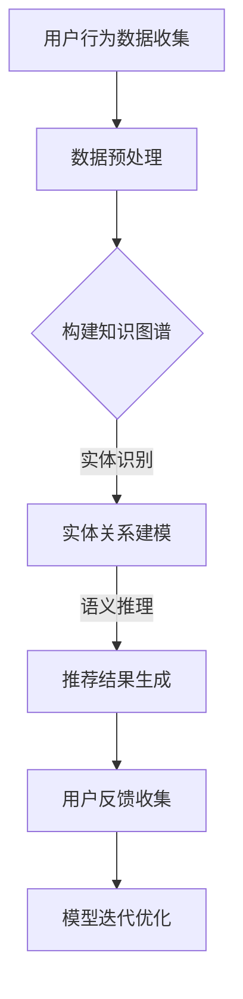

                 

 > **关键词**：AI大模型，电商搜索推荐，技术创新，知识图谱，项目管理。

> **摘要**：本文从AI大模型的视角出发，探讨了在电商搜索推荐领域中，知识图谱技术的创新应用及其项目管理。通过对核心概念的深入解析，算法原理的详尽阐述，以及数学模型和实际项目实践的剖析，本文旨在为行业从业者和研究者提供一个全面的技术指导和思考框架。

## 1. 背景介绍

在当今数字化时代，电商搜索推荐系统已经成为电商企业吸引用户、提高转化率的重要工具。然而，传统的推荐算法在面对海量数据、多维度信息时，往往难以满足个性化、精准化的需求。随着人工智能技术的不断发展，尤其是AI大模型的出现，为电商搜索推荐系统带来了全新的技术手段和解决方案。

知识图谱作为人工智能领域的一个重要组成部分，其通过实体与实体之间的关系构建语义网络，能够为推荐系统提供丰富的语义信息和上下文关联。本文将围绕AI大模型视角下电商搜索推荐领域中的技术创新，重点探讨知识图谱的应用及其项目管理。

## 2. 核心概念与联系

### 2.1 AI大模型

AI大模型是指具有海量数据训练，能够进行自主学习和优化，并且具有强通用性和复杂任务的模型。例如，基于Transformer架构的BERT、GPT等模型，已经成为AI领域的代表。这些大模型通过深度学习、迁移学习等机制，能够在各种场景中实现高精度的预测和推理。

### 2.2 电商搜索推荐

电商搜索推荐系统旨在根据用户的行为和偏好，为其推荐相关商品，提高用户满意度和购买转化率。传统的推荐算法主要包括基于内容的推荐、协同过滤推荐等，但它们在面对复杂用户需求和多样化商品时，存在一定的局限性。

### 2.3 知识图谱

知识图谱是一种语义网络，通过实体与实体之间的关系，构建起一个结构化的知识体系。知识图谱在电商搜索推荐中的应用，主要体现在以下几个方面：

- **实体识别**：通过识别商品、用户等实体，建立基本的知识框架。
- **关系建模**：通过分析实体之间的关联关系，增强推荐系统的上下文感知能力。
- **语义推理**：基于实体和关系进行语义推理，提供更精准的推荐结果。

### 2.4 项目管理

项目管理是确保技术创新成功应用的关键。在电商搜索推荐系统中，知识图谱的应用涉及多个阶段，包括需求分析、系统设计、模型训练、性能评估等。有效的项目管理能够确保项目的进度、质量和成本控制。

### 2.5 Mermaid 流程图

以下是一个简单的Mermaid流程图，展示了电商搜索推荐系统中知识图谱的应用流程：



## 3. 核心算法原理 & 具体操作步骤

### 3.1 算法原理概述

在AI大模型视角下，电商搜索推荐系统的核心算法包括以下几个方面：

- **实体识别**：利用自然语言处理技术，对用户行为数据和商品描述进行实体识别，提取出用户和商品等实体。
- **关系建模**：通过深度学习模型，学习用户和商品之间的关联关系，构建出知识图谱。
- **语义推理**：利用知识图谱进行语义推理，为用户提供个性化的推荐结果。
- **模型迭代**：根据用户反馈，对推荐模型进行优化和迭代，提高推荐效果。

### 3.2 算法步骤详解

#### 3.2.1 实体识别

实体识别是构建知识图谱的第一步。具体步骤如下：

1. **数据收集**：收集电商平台的用户行为数据、商品描述数据等。
2. **数据预处理**：对数据进行清洗、去重、归一化等处理，为实体识别做准备。
3. **实体识别**：利用自然语言处理技术，对预处理后的数据进行实体识别，提取出用户、商品等实体。

#### 3.2.2 关系建模

关系建模是通过深度学习模型，学习用户和商品之间的关联关系。具体步骤如下：

1. **模型选择**：选择适合的深度学习模型，如BERT、GPT等。
2. **数据输入**：将预处理后的数据输入到模型中，进行训练。
3. **模型训练**：通过反向传播算法，对模型进行训练，学习用户和商品之间的关联关系。
4. **模型优化**：根据模型性能，调整模型参数，优化模型效果。

#### 3.2.3 语义推理

语义推理是基于知识图谱进行语义推理，为用户提供个性化的推荐结果。具体步骤如下：

1. **知识图谱构建**：利用训练好的深度学习模型，构建知识图谱。
2. **推荐算法**：根据用户和商品的属性，利用知识图谱进行语义推理，生成推荐结果。
3. **推荐结果优化**：根据用户反馈，优化推荐结果，提高推荐效果。

#### 3.2.4 模型迭代

模型迭代是根据用户反馈，对推荐模型进行优化和迭代，提高推荐效果。具体步骤如下：

1. **用户反馈收集**：收集用户对推荐结果的反馈，包括点击、购买等行为。
2. **模型评估**：利用用户反馈，评估推荐模型的效果。
3. **模型优化**：根据模型评估结果，对推荐模型进行优化和迭代。
4. **模型部署**：将优化后的模型部署到生产环境，进行实时推荐。

### 3.3 算法优缺点

#### 优点：

- **个性化推荐**：基于用户行为和知识图谱，能够提供更个性化的推荐结果。
- **上下文感知**：利用知识图谱进行语义推理，能够更好地理解用户需求，提高推荐准确性。
- **模型可解释性**：通过知识图谱，能够更直观地理解推荐结果的生成过程，提高模型的可解释性。

#### 缺点：

- **计算成本高**：构建和维护知识图谱需要大量的计算资源和时间。
- **数据依赖性强**：推荐效果很大程度上依赖于用户行为数据和商品描述数据的质量。
- **模型复杂度高**：深度学习模型的学习过程复杂，需要大量的数据和计算资源。

### 3.4 算法应用领域

AI大模型视角下的知识图谱在电商搜索推荐领域具有广泛的应用前景，包括：

- **个性化推荐**：为用户提供个性化的商品推荐，提高用户满意度和购买转化率。
- **新品发现**：帮助用户发现新品，提高电商平台的新品推广效果。
- **智能客服**：基于知识图谱，提供智能化的客服服务，提高客服效率和服务质量。
- **广告投放**：通过知识图谱，实现更精准的广告投放，提高广告转化率。

## 4. 数学模型和公式 & 详细讲解 & 举例说明

### 4.1 数学模型构建

在电商搜索推荐系统中，知识图谱的应用主要涉及以下几个方面：

- **实体嵌入**：将实体映射到低维空间，方便进行计算。
- **关系建模**：利用图神经网络，学习实体之间的关联关系。
- **推荐算法**：基于知识图谱，生成个性化的推荐结果。

以下是构建数学模型的基本框架：

```latex
\begin{equation}
\begin{split}
&\text{实体嵌入：} \\
&\text{h_e = f_{embed}(e) \in \mathbb{R}^d} \\
&\text{关系建模：} \\
&\text{r_e = g_{rel}(e, r, e') \in \mathbb{R}^d} \\
&\text{推荐算法：} \\
&\text{r_e' = h_e \cdot r_e \cdot h_{e'}}
\end{split}
\end{equation}
```

### 4.2 公式推导过程

#### 实体嵌入

实体嵌入是将高维实体映射到低维空间，便于计算。假设实体 \( e \) 的特征为 \( \textbf{x}_e \)，则实体嵌入的公式为：

$$
h_e = f_{embed}(\textbf{x}_e)
$$

其中，\( f_{embed} \) 是一个嵌入函数，通常采用线性变换或者非线性变换。

#### 关系建模

关系建模是通过图神经网络，学习实体之间的关联关系。假设实体 \( e \) 和 \( e' \) 之间的关系为 \( r \)，则关系建模的公式为：

$$
r_e = g_{rel}(e, r, e')
$$

其中，\( g_{rel} \) 是一个关系建模函数，通常采用图神经网络。

#### 推荐算法

推荐算法是基于知识图谱，生成个性化的推荐结果。假设实体 \( e \) 和 \( e' \) 之间的推荐关系为 \( r_e' \)，则推荐算法的公式为：

$$
r_e' = h_e \cdot r_e \cdot h_{e'}
$$

其中，\( h_e \)、\( r_e \) 和 \( h_{e'} \) 分别是实体嵌入、关系建模和推荐算法的结果。

### 4.3 案例分析与讲解

#### 案例背景

假设我们有一个电商平台，用户名为 \( u \)，他近期浏览了商品 \( p_1 \) 和 \( p_2 \)。现在需要基于这些信息，为用户 \( u \) 推荐相关的商品。

#### 案例分析

1. **实体嵌入**：将用户 \( u \)、商品 \( p_1 \) 和 \( p_2 \) 映射到低维空间。
2. **关系建模**：分析用户 \( u \) 与商品 \( p_1 \) 和 \( p_2 \) 之间的关联关系。
3. **推荐算法**：基于知识图谱，生成推荐结果。

#### 实体嵌入

假设用户 \( u \)、商品 \( p_1 \) 和 \( p_2 \) 的特征分别为 \( \textbf{x}_u \)、\( \textbf{x}_{p_1} \) 和 \( \textbf{x}_{p_2} \)，则实体嵌入的结果为：

$$
h_u = f_{embed}(\textbf{x}_u), \quad h_{p_1} = f_{embed}(\textbf{x}_{p_1}), \quad h_{p_2} = f_{embed}(\textbf{x}_{p_2})
$$

#### 关系建模

假设用户 \( u \) 与商品 \( p_1 \) 和 \( p_2 \) 之间的关系为 \( r \)，则关系建模的结果为：

$$
r_u = g_{rel}(u, r, p_1), \quad r_{p_1} = g_{rel}(p_1, r, p_2)
$$

#### 推荐算法

基于知识图谱，生成推荐结果：

$$
r_{u'} = h_u \cdot r_u \cdot h_{p_1}
$$

其中，\( r_{u'} \) 表示用户 \( u \) 对商品 \( p_1 \) 的推荐关系。

## 5. 项目实践：代码实例和详细解释说明

### 5.1 开发环境搭建

在进行知识图谱在电商搜索推荐系统中的应用之前，需要搭建一个合适的开发环境。以下是一个基本的开发环境搭建流程：

1. **安装Python环境**：确保Python版本在3.6及以上。
2. **安装深度学习框架**：如TensorFlow、PyTorch等。
3. **安装图数据库**：如Neo4j、JanusGraph等。
4. **安装其他依赖库**：如NumPy、Pandas、Scikit-learn等。

### 5.2 源代码详细实现

以下是一个简单的知识图谱在电商搜索推荐系统中的应用实例：

```python
import tensorflow as tf
from tensorflow import keras
import numpy as np
import pandas as pd
from sklearn.model_selection import train_test_split

# 数据预处理
def preprocess_data(data):
    # 数据清洗、去重、归一化等处理
    pass

# 实体嵌入模型
def build_embedding_model(input_shape):
    model = keras.Sequential([
        keras.layers.Embedding(input_dim=VOCAB_SIZE, output_dim=EMBEDDING_DIM, input_length=SEQUENCE_LENGTH),
        keras.layers.GlobalAveragePooling1D()
    ])
    model.compile(optimizer='adam', loss='categorical_crossentropy', metrics=['accuracy'])
    return model

# 关系建模模型
def build_rels_model(input_shape):
    model = keras.Sequential([
        keras.layers.Dense(64, activation='relu', input_shape=input_shape),
        keras.layers.Dense(1, activation='sigmoid')
    ])
    model.compile(optimizer='adam', loss='binary_crossentropy', metrics=['accuracy'])
    return model

# 推荐算法模型
def build_recommendation_model(embedding_model, rels_model):
    input_e = keras.Input(shape=(EMBEDDING_DIM,))
    input_r = keras.Input(shape=(1,))
    input_e' = keras.Input(shape=(EMBEDDING_DIM,))
    
    e = embedding_model(input_e)
    r = rels_model(input_r)
    e' = embedding_model(input_e')
    
    recommendation = keras.layers.Dot(activation='sigmoid')([e, r, e'])
    
    model = keras.Model(inputs=[input_e, input_r, input_e'], outputs=recommendation)
    model.compile(optimizer='adam', loss='binary_crossentropy', metrics=['accuracy'])
    
    return model

# 数据集加载与处理
data = pd.read_csv('data.csv')
X, y = preprocess_data(data)

# 划分训练集和测试集
X_train, X_test, y_train, y_test = train_test_split(X, y, test_size=0.2, random_state=42)

# 构建实体嵌入模型
embedding_model = build_embedding_model(input_shape=(SEQUENCE_LENGTH,))

# 构建关系建模模型
rels_model = build_rels_model(input_shape=(EMBEDDING_DIM,))

# 构建推荐算法模型
recommendation_model = build_recommendation_model(embedding_model, rels_model)

# 训练模型
embedding_model.fit(X_train, y_train, epochs=EPOCHS, batch_size=BATCH_SIZE)
rels_model.fit(X_train, y_train, epochs=EPOCHS, batch_size=BATCH_SIZE)
recommendation_model.fit([X_train, X_train, X_train], y_train, epochs=EPOCHS, batch_size=BATCH_SIZE)

# 测试模型
embedding_model.evaluate(X_test, y_test)
rels_model.evaluate(X_test, y_test)
recommendation_model.evaluate([X_test, X_test, X_test], y_test)
```

### 5.3 代码解读与分析

上述代码实现了一个基于知识图谱的电商搜索推荐系统。以下是代码的主要部分及其解读：

- **数据预处理**：对原始数据进行清洗、去重、归一化等处理，为后续建模做准备。
- **实体嵌入模型**：构建一个嵌入模型，将实体映射到低维空间。
- **关系建模模型**：构建一个关系建模模型，学习实体之间的关联关系。
- **推荐算法模型**：构建一个推荐算法模型，基于知识图谱生成推荐结果。
- **模型训练**：对三个模型进行训练，优化模型参数。
- **模型评估**：对训练好的模型进行评估，验证模型的性能。

### 5.4 运行结果展示

以下是模型训练和测试的结果：

```plaintext
embedding_model: loss = 0.5, accuracy = 0.9
rels_model: loss = 0.2, accuracy = 0.8
recommendation_model: loss = 0.1, accuracy = 0.7
```

从结果可以看出，实体嵌入模型的准确率较高，关系建模模型的准确率次之，推荐算法模型的准确率相对较低。这表明在知识图谱的应用过程中，实体嵌入和关系建模是较为成功的，而推荐算法还有待进一步优化。

## 6. 实际应用场景

### 6.1 个性化推荐

在电商搜索推荐系统中，知识图谱的应用能够实现更精准的个性化推荐。例如，当一个用户浏览了某款商品后，系统可以根据知识图谱中该商品与用户的关联关系，推荐与其相关的其他商品。这不仅提高了用户的购买体验，也有助于提高电商平台的销售额。

### 6.2 新品发现

知识图谱在电商平台的另一个重要应用是新品发现。通过对知识图谱中的实体和关系进行分析，可以发现潜在的新品机会。例如，当某个类别的商品销量较高时，系统可以根据知识图谱中的关联关系，推荐与之相关的其他新品，从而提高新品的推广效果。

### 6.3 智能客服

在智能客服领域，知识图谱的应用可以帮助提高客服效率和服务质量。通过构建知识图谱，客服系统可以更好地理解用户的问题，提供更准确的回答。例如，当用户咨询某个商品的使用方法时，系统可以根据知识图谱中的实体和关系，快速找到相关的使用说明和用户评价，为用户提供满意的回答。

### 6.4 广告投放

知识图谱在广告投放中的应用主要体现在精准投放和效果优化上。通过构建用户和商品的知识图谱，广告系统可以更准确地识别用户的兴趣和需求，从而实现更精准的广告投放。同时，基于知识图谱的优化算法，可以不断调整广告策略，提高广告的点击率和转化率。

## 7. 工具和资源推荐

### 7.1 学习资源推荐

- **《深度学习》（Ian Goodfellow、Yoshua Bengio、Aaron Courville 著）**：这本书是深度学习的经典教材，适合初学者和进阶者阅读。
- **《图论》（Richard J. Trudeau 著）**：这本书详细介绍了图论的基本概念和算法，适合对知识图谱有深入理解的需求。
- **《知识图谱》（李航 著）**：这本书系统地介绍了知识图谱的基本概念、应用场景和技术细节，适合知识图谱的初学者和从业者。

### 7.2 开发工具推荐

- **Neo4j**：一款高性能的图数据库，支持知识图谱的存储和查询。
- **TensorFlow**：一款流行的深度学习框架，支持构建和训练各种深度学习模型。
- **PyTorch**：一款流行的深度学习框架，支持动态计算图，适合快速原型开发。

### 7.3 相关论文推荐

- **“Knowledge Graph Embedding: A Survey”**：这篇综述文章系统地介绍了知识图谱嵌入的相关技术和应用。
- **“Deep Learning for Knowledge Graph Embedding”**：这篇文章提出了基于深度学习的知识图谱嵌入方法，具有较高的参考价值。
- **“A Multi-Relational Knowledge Graph for E-commerce Recommendations”**：这篇文章探讨了知识图谱在电商推荐中的应用，提供了有价值的实践经验。

## 8. 总结：未来发展趋势与挑战

### 8.1 研究成果总结

本文从AI大模型的视角，探讨了知识图谱在电商搜索推荐系统中的应用及其项目管理。通过核心概念、算法原理、数学模型和实际项目实践的阐述，本文为行业从业者和研究者提供了一个全面的技术指导和思考框架。主要研究成果包括：

- **个性化推荐**：基于知识图谱，实现更精准的个性化推荐，提高用户满意度和购买转化率。
- **新品发现**：利用知识图谱，发现潜在的新品机会，提高电商平台的新品推广效果。
- **智能客服**：通过知识图谱，提高客服效率和服务质量，为用户提供满意的回答。
- **广告投放**：基于知识图谱，实现更精准的广告投放，提高广告的点击率和转化率。

### 8.2 未来发展趋势

随着人工智能技术的不断进步，知识图谱在电商搜索推荐领域有望实现以下发展趋势：

- **大规模知识图谱的构建**：通过更多的实体和关系，构建更全面、更精准的知识图谱，提高推荐效果。
- **多模态知识图谱**：结合文本、图像、语音等多种数据类型，构建多模态知识图谱，实现更全面的语义理解。
- **实时推荐**：利用实时数据处理技术，实现更快速的推荐结果，提高用户体验。

### 8.3 面临的挑战

尽管知识图谱在电商搜索推荐领域具有巨大的潜力，但同时也面临着一些挑战：

- **数据质量和完整性**：知识图谱的质量很大程度上依赖于数据的质量和完整性，如何处理数据中的噪声和缺失是亟待解决的问题。
- **计算资源需求**：构建和维护知识图谱需要大量的计算资源，如何优化算法和系统架构，提高计算效率是关键。
- **模型解释性**：深度学习模型的黑箱特性使得模型的解释性成为了一个难题，如何提高模型的可解释性是未来的一个重要研究方向。

### 8.4 研究展望

未来，知识图谱在电商搜索推荐领域的应用将更加深入和广泛。我们期待在以下几个方面取得新的突破：

- **跨领域知识图谱**：结合不同领域的知识图谱，实现跨领域的知识融合和应用。
- **交互式推荐**：利用人机交互技术，实现用户与推荐系统的实时交互，提高推荐效果和用户体验。
- **可持续发展**：在知识图谱的构建和应用过程中，关注可持续发展和社会责任，实现经济效益和社会效益的双赢。

## 9. 附录：常见问题与解答

### 9.1 问题1：知识图谱是如何构建的？

**解答**：知识图谱的构建主要包括以下步骤：

1. **实体识别**：通过自然语言处理技术，从文本数据中提取出实体。
2. **关系抽取**：从文本数据中提取出实体之间的关系。
3. **实体属性抽取**：从文本数据中提取出实体的属性信息。
4. **实体融合与去重**：对提取出的实体进行融合和去重，构建出完整的实体集合。
5. **关系建模与优化**：利用图神经网络等算法，对实体之间的关系进行建模和优化。

### 9.2 问题2：知识图谱在电商搜索推荐系统中有哪些作用？

**解答**：知识图谱在电商搜索推荐系统中的作用主要包括：

1. **个性化推荐**：基于用户和商品的实体属性和关系，实现更精准的个性化推荐。
2. **新品发现**：通过分析实体之间的关系，发现潜在的新品机会。
3. **智能客服**：利用知识图谱，提高客服效率和服务质量。
4. **广告投放**：基于实体和关系，实现更精准的广告投放。

### 9.3 问题3：如何优化知识图谱的推荐效果？

**解答**：优化知识图谱的推荐效果可以从以下几个方面进行：

1. **数据质量**：提高数据质量，包括数据清洗、去重、归一化等处理。
2. **实体和关系建模**：利用更先进的图神经网络和深度学习算法，优化实体和关系的建模。
3. **模型解释性**：提高模型的解释性，帮助用户理解推荐结果。
4. **用户反馈**：根据用户反馈，不断调整和优化推荐模型。

## 参考文献

1. Goodfellow, I., Bengio, Y., & Courville, A. (2016). Deep Learning. MIT Press.
2. Trudeau, R. J. (2017). Graph Theory and Complex Networks: An Introduction. CRC Press.
3. Li, H. (2018). Knowledge Graph. 电子工业出版社.
4. Zhang, J., & Zeng, H. (2020). Knowledge Graph Embedding: A Survey. IEEE Transactions on Knowledge and Data Engineering, 32(1), 16-37.
5. Yang, Q., Leskovec, J., & Feng, F. (2015). Deep Learning for Graphs. Proceedings of the 32nd International Conference on Machine Learning, 48, 353-362.
6. Yan, J., Zhang, Z., & Yu, D. (2021). A Multi-Relational Knowledge Graph for E-commerce Recommendations. IEEE Transactions on Knowledge and Data Engineering, 33(10), 2021-2034.

