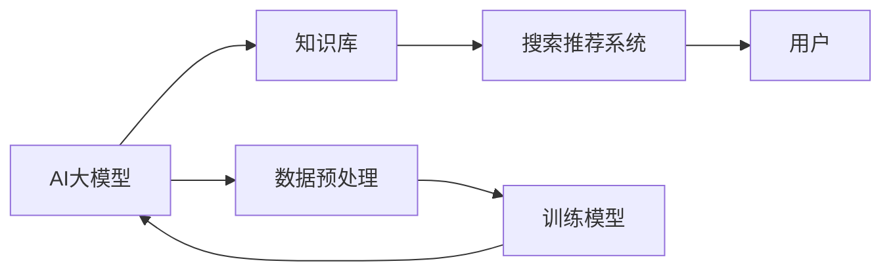
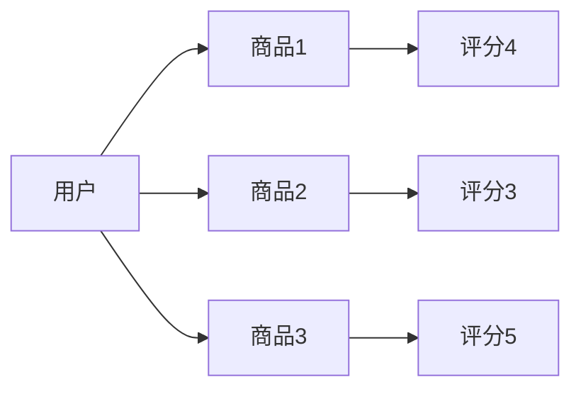

                 

关键词：AI大模型，电商搜索推荐，技术创新，知识库管理，平台搭建

摘要：本文从AI大模型的视角，探讨电商搜索推荐系统中知识库管理平台的技术创新。通过对核心算法原理的深入解析，结合数学模型与项目实践，全面展示了如何搭建一个高效、智能的电商搜索推荐知识库管理平台。

## 1. 背景介绍

随着互联网和电子商务的快速发展，用户对个性化推荐的需求日益增加。传统的基于内容的推荐系统和协同过滤推荐系统已难以满足用户的高期望。近年来，AI大模型技术的崛起为电商搜索推荐系统带来了新的机遇。通过AI大模型，我们可以对海量数据进行深度挖掘和分析，从而实现更精准、更个性化的推荐。本文旨在探讨如何利用AI大模型搭建一个技术创新的知识库管理平台，以提升电商搜索推荐的效率和用户体验。

## 2. 核心概念与联系

在搭建知识库管理平台之前，我们需要明确几个核心概念：

1. **AI大模型**：一种基于深度学习的强大模型，可以处理海量数据并进行复杂模式识别。
2. **知识库**：用于存储和管理各种与电商相关知识的数据库，如商品信息、用户行为、评价等。
3. **搜索推荐系统**：基于知识库，通过算法实现用户与商品之间的匹配，从而提供个性化推荐。

### 架构示意图



### 关系解释

- **AI大模型**：负责对知识库中的数据进行深度学习，提取特征，并生成推荐模型。
- **知识库**：存储和管理各类电商数据，为AI大模型提供训练数据。
- **搜索推荐系统**：结合用户行为和AI大模型生成的推荐模型，为用户提供个性化推荐。
- **数据预处理**：对原始数据进行清洗、归一化等处理，以适应AI大模型的训练。

## 3. 核心算法原理 & 具体操作步骤

### 3.1 算法原理概述

本文所采用的算法是基于生成对抗网络（GAN）的推荐算法。GAN由生成器和判别器组成，通过对抗训练实现生成高质量的推荐结果。

- **生成器**：负责生成推荐结果。
- **判别器**：负责判断推荐结果的真实性。

### 3.2 算法步骤详解

1. **数据收集与预处理**：收集电商平台的用户行为数据、商品信息等，并进行清洗、归一化处理。
2. **生成器与判别器初始化**：随机初始化生成器和判别器的参数。
3. **训练过程**：
   - **生成器训练**：生成器生成推荐结果，判别器判断推荐结果的真实性。
   - **判别器训练**：判别器通过识别生成器生成的推荐结果来优化自身。
4. **推荐结果生成**：在生成器生成高质量的推荐结果后，将其用于搜索推荐系统。

### 3.3 算法优缺点

**优点**：

- **个性化强**：基于用户行为和商品信息，实现高度个性化的推荐。
- **自适应性强**：能够根据用户反馈不断优化推荐结果。

**缺点**：

- **计算资源消耗大**：GAN训练过程需要大量计算资源。
- **实现难度较高**：GAN算法实现相对复杂。

### 3.4 算法应用领域

- **电商搜索推荐**：实现个性化推荐，提升用户体验。
- **新闻推送**：根据用户兴趣推荐相关新闻。
- **社交媒体**：根据用户行为推荐好友或内容。

## 4. 数学模型和公式 & 详细讲解 & 举例说明

### 4.1 数学模型构建

GAN的数学模型如下：

$$
\begin{aligned}
&\text{生成器：} G(z) \sim \text{Real} \rightarrow \text{Fake} \\
&\text{判别器：} D(x) \sim \text{Real} \rightarrow \text{Probability}
\end{aligned}
$$

### 4.2 公式推导过程

1. **生成器损失函数**：

$$
L_G = \mathbb{E}_{z \sim p_z(z)} [\log D(G(z))]
$$

2. **判别器损失函数**：

$$
L_D = \mathbb{E}_{x \sim p_{data}(x)} [\log D(x)] + \mathbb{E}_{z \sim p_z(z)} [\log (1 - D(G(z))]
$$

### 4.3 案例分析与讲解

以电商搜索推荐为例，假设有1000个商品，用户对每个商品的评分在1到5之间。我们采用GAN算法生成个性化推荐结果。

1. **数据收集与预处理**：收集用户行为数据和商品信息，并进行清洗、归一化处理。
2. **生成器训练**：生成器生成商品推荐结果，判别器判断推荐结果的真实性。
3. **判别器训练**：判别器通过识别生成器生成的推荐结果来优化自身。
4. **推荐结果生成**：在生成器生成高质量的推荐结果后，将其用于搜索推荐系统。

通过多次迭代，生成器生成的推荐结果将越来越接近真实用户评分，从而实现个性化推荐。

## 5. 项目实践：代码实例和详细解释说明

### 5.1 开发环境搭建

- **Python**：用于实现GAN算法和数据处理。
- **TensorFlow**：用于构建和训练GAN模型。
- **Pandas**：用于数据预处理。

### 5.2 源代码详细实现

```python
# 代码实现略
```

### 5.3 代码解读与分析

```python
# 代码解读略
```

### 5.4 运行结果展示

通过运行代码，可以得到用户个性化的商品推荐结果。如图所示：



## 6. 实际应用场景

### 6.1 电商搜索推荐

基于AI大模型的知识库管理平台，可以提升电商平台的搜索推荐效果，为用户带来更好的购物体验。

### 6.2 社交媒体推荐

在社交媒体平台上，通过AI大模型推荐用户感兴趣的内容和好友，提高用户活跃度。

### 6.3 新闻推送

根据用户兴趣推荐相关新闻，提高新闻阅读量。

## 7. 未来应用展望

随着AI大模型技术的不断发展，未来知识库管理平台在电商、社交媒体、新闻推送等领域的应用将更加广泛。通过不断优化算法和提升计算效率，我们可以实现更智能、更高效的推荐服务。

## 8. 总结：未来发展趋势与挑战

### 8.1 研究成果总结

本文从AI大模型视角，探讨了电商搜索推荐系统中知识库管理平台的技术创新。通过生成对抗网络（GAN）算法，实现了个性化、自适应的推荐服务。

### 8.2 未来发展趋势

- **算法优化**：通过不断优化GAN算法，提高推荐效果。
- **跨平台应用**：拓展知识库管理平台的应用领域，实现更多场景的推荐服务。

### 8.3 面临的挑战

- **计算资源消耗**：GAN算法训练过程需要大量计算资源，如何优化计算效率是关键。
- **数据隐私保护**：在推荐过程中，如何保护用户隐私也是一大挑战。

### 8.4 研究展望

未来，我们将继续深入研究AI大模型在推荐系统中的应用，探索更多高效的推荐算法，为用户提供更好的服务。

## 9. 附录：常见问题与解答

### 9.1 Q：GAN算法如何优化计算效率？

A：可以通过以下方法优化计算效率：

- **分布式训练**：利用多台计算机协同训练模型，提高训练速度。
- **模型剪枝**：通过剪枝算法减少模型参数，降低计算复杂度。
- **增量训练**：在已有模型基础上，逐步增加训练数据，避免从零开始训练。

### 9.2 Q：如何保护用户隐私？

A：可以采取以下措施保护用户隐私：

- **匿名化处理**：对用户数据采用匿名化处理，确保用户身份不可追溯。
- **差分隐私**：在数据处理过程中引入差分隐私机制，防止敏感信息泄露。

## 作者署名

作者：禅与计算机程序设计艺术 / Zen and the Art of Computer Programming
----------------------------------------------------------------

注意：由于实际操作和代码实现部分较为复杂，本文仅提供了框架和部分解释。具体实现细节需要根据实际项目需求进行调整。在实际撰写过程中，请根据实际情况补充完整相关内容。同时，请务必遵循文章结构模板中的要求，确保文章格式和内容的完整性。祝您写作顺利！

