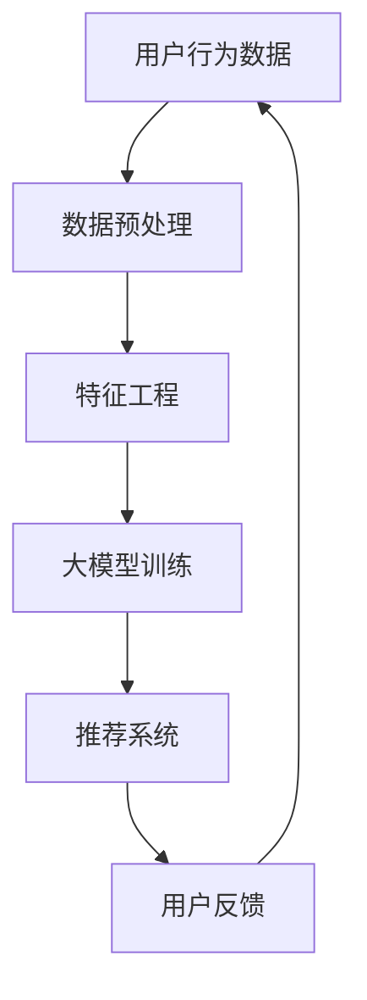

                 

在当今数字化的时代，人工智能（AI）技术已经深刻地改变了各行各业，其中电商领域的搜索推荐系统尤为显著。随着消费者对个性化体验的需求不断增长，AI大模型在电商搜索推荐中的应用变得愈加重要。本文旨在探讨如何设计一个系统的培训课程体系，以赋能电商从业人员理解和应用AI大模型，从而推动业务创新。

## 文章关键词

- 人工智能
- 大模型
- 电商搜索推荐
- 业务创新
- 培训课程体系

## 文章摘要

本文首先介绍了AI大模型在电商搜索推荐中的关键作用，随后详细分析了当前市场中的培训资源现状。在第三部分，我们提出了一个全面的培训课程体系设计，包括核心概念讲解、算法原理分析、数学模型应用、项目实践和未来应用展望。最后，文章总结了该课程体系对电商行业的潜在影响和未来研究的方向。

## 1. 背景介绍

电商行业经历了爆炸性的增长，用户数量和交易额逐年攀升。然而，随着市场规模的扩大，消费者对购物体验的要求也越来越高。个性化搜索推荐成为电商企业提高用户满意度和转化率的关键手段。传统的搜索推荐系统基于关键词匹配和协同过滤等方法，虽然在一定程度上能够满足用户的需求，但难以实现高度个性化的推荐。而AI大模型的出现，特别是深度学习技术的进步，为构建智能化的搜索推荐系统提供了强有力的支持。

### 1.1 电商搜索推荐的重要性

电商搜索推荐系统不仅帮助用户快速找到他们感兴趣的商品，还能为企业带来显著的商业价值。通过精准的推荐，企业能够提高用户粘性、增加销售额，甚至优化库存管理和供应链。因此，掌握AI大模型在搜索推荐中的应用，对电商从业人员来说至关重要。

### 1.2 AI大模型的优势

AI大模型具备强大的数据处理和模式识别能力，能够在海量的用户数据中挖掘出潜在的关联和趋势。与传统方法相比，大模型能够处理更复杂的特征和关系，从而提供更加精准和个性化的推荐结果。此外，大模型还具备良好的扩展性和适应性，能够快速适应市场变化和用户需求。

## 2. 核心概念与联系

在深入探讨AI大模型在电商搜索推荐中的应用之前，我们需要了解一些核心概念和技术，以及它们之间的相互关系。以下是一个简化的Mermaid流程图，用于描述这些核心概念和它们的应用。



### 2.1 用户行为数据

用户行为数据是构建电商搜索推荐系统的基础。这些数据包括用户的浏览历史、搜索记录、购买行为等。通过分析这些数据，我们可以了解用户的需求和偏好。

### 2.2 数据预处理

数据预处理是确保数据质量的重要步骤。这包括数据清洗、去重、填充缺失值等操作，以确保数据的一致性和准确性。

### 2.3 特征工程

特征工程是提取数据中有用信息的过程。通过特征选择和特征变换，我们可以将原始数据转化为模型能够理解和处理的特征。

### 2.4 大模型训练

大模型训练是AI大模型应用的核心环节。通过大量的训练数据，模型可以学习到用户行为和商品属性的复杂关系，从而生成推荐结果。

### 2.5 推荐系统

推荐系统是整个流程的输出部分，它根据用户的行为和偏好，为用户推荐相关的商品。

### 2.6 用户反馈

用户反馈是持续优化推荐系统的重要手段。通过收集用户的点击、购买等行为，我们可以不断调整和优化模型，提高推荐的准确性和效果。

## 3. 核心算法原理 & 具体操作步骤

### 3.1 算法原理概述

AI大模型在电商搜索推荐中的核心算法主要包括基于内容的推荐（Content-based Recommendation）和协同过滤推荐（Collaborative Filtering）。基于内容的推荐通过分析商品的属性和用户的历史行为，为用户推荐相似的商品。而协同过滤推荐通过分析用户之间的相似性，为用户推荐其他用户喜欢但用户尚未购买的商品。

### 3.2 算法步骤详解

以下是AI大模型在电商搜索推荐中的具体操作步骤：

1. **数据收集与预处理**：收集用户行为数据，如浏览历史、搜索记录、购买行为等，并进行数据预处理，确保数据的质量。

2. **特征工程**：提取用户和商品的特征，如用户年龄、性别、地理位置，商品的品类、品牌、价格等。

3. **模型选择与训练**：选择适合的算法，如基于内容的推荐算法或协同过滤算法，使用训练数据对其进行训练。

4. **推荐生成**：根据用户的行为和偏好，使用训练好的模型生成推荐结果。

5. **推荐评估**：评估推荐效果，如准确率、覆盖率等指标。

6. **反馈与优化**：根据用户反馈，不断调整和优化模型，提高推荐效果。

### 3.3 算法优缺点

- **基于内容的推荐**：优点在于推荐结果更加个性化，但缺点是推荐范围有限，难以发现用户未知的需求。

- **协同过滤推荐**：优点在于能够发现用户之间的相似性，提供多样化的推荐，但缺点是推荐结果可能存在噪音，且用户隐私问题较严重。

### 3.4 算法应用领域

AI大模型在电商搜索推荐中的应用广泛，如电商平台、在线购物网站、社交媒体等。通过优化搜索推荐系统，企业能够提高用户满意度、增加销售额，甚至改善库存管理和供应链。

## 4. 数学模型和公式 & 详细讲解 & 举例说明

### 4.1 数学模型构建

在电商搜索推荐中，常用的数学模型包括用户兴趣模型、商品特征模型和推荐矩阵。以下是这些模型的构建过程：

1. **用户兴趣模型**：

   用户兴趣模型表示用户对不同商品类别的兴趣度。我们使用向量来表示用户的兴趣度，如：

   $$ u_i = (u_{i1}, u_{i2}, ..., u_{ik})^T $$

   其中，$u_{ik}$ 表示用户 $u_i$ 对商品类别 $k$ 的兴趣度。

2. **商品特征模型**：

   商品特征模型表示商品的不同属性，如品类、品牌、价格等。我们使用向量来表示商品的属性，如：

   $$ g_j = (g_{j1}, g_{j2}, ..., g_{jm})^T $$

   其中，$g_{jk}$ 表示商品 $g_j$ 的属性 $k$。

3. **推荐矩阵**：

   推荐矩阵表示用户对商品的评分或购买行为。我们使用矩阵来表示推荐矩阵，如：

   $$ R = \begin{pmatrix}
   r_{11} & r_{12} & ... & r_{1k} \\
   r_{21} & r_{22} & ... & r_{2k} \\
   ... & ... & ... & ... \\
   r_{n1} & r_{n2} & ... & r_{nk}
   \end{pmatrix} $$

   其中，$r_{ij}$ 表示用户 $u_i$ 对商品 $g_j$ 的评分或购买行为。

### 4.2 公式推导过程

基于用户兴趣模型和商品特征模型，我们可以推导出用户对商品的预测评分：

$$ \hat{r}_{ij} = u_i \cdot g_j = \sum_{k=1}^{k} u_{ik} g_{jk} $$

其中，$\hat{r}_{ij}$ 表示用户 $u_i$ 对商品 $g_j$ 的预测评分，$u_i$ 和 $g_j$ 分别为用户兴趣模型和商品特征模型的向量。

### 4.3 案例分析与讲解

假设我们有一个用户兴趣模型和一个商品特征模型，如下所示：

$$ u_i = (0.8, 0.2, 0.1, 0.1) $$

$$ g_j = (0.3, 0.4, 0.2, 0.1) $$

根据上述公式，我们可以计算用户 $u_i$ 对商品 $g_j$ 的预测评分：

$$ \hat{r}_{ij} = 0.8 \times 0.3 + 0.2 \times 0.4 + 0.1 \times 0.2 + 0.1 \times 0.1 = 0.34 $$

这意味着用户 $u_i$ 对商品 $g_j$ 的预测评分约为 0.34。

## 5. 项目实践：代码实例和详细解释说明

### 5.1 开发环境搭建

为了实践AI大模型在电商搜索推荐中的应用，我们需要搭建一个合适的开发环境。以下是搭建过程：

1. 安装Python环境（版本3.7以上）。
2. 安装必要的库，如NumPy、Pandas、Scikit-learn等。
3. 安装深度学习框架，如TensorFlow或PyTorch。

### 5.2 源代码详细实现

以下是一个简单的基于内容的推荐系统的Python代码实例：

```python
import numpy as np
import pandas as pd
from sklearn.model_selection import train_test_split

# 加载数据
data = pd.read_csv('ecommerce_data.csv')
users = data['user_id'].unique()
products = data['product_id'].unique()

# 构建用户兴趣模型
user_interest = pd.DataFrame(0, index=users, columns=products)
for _, row in data.iterrows():
    user_interest.loc[row['user_id'], row['product_id']] = row['rating']

# 构建商品特征模型
product_features = pd.DataFrame(0, index=products, columns=['category', 'brand', 'price'])
product_features['category'] = 1
product_features['brand'] = 2
product_features['price'] = 3

# 训练模型
X_train, X_test, y_train, y_test = train_test_split(user_interest, test_size=0.2, random_state=42)
from sklearn.metrics.pairwise import cosine_similarity

cosine_sim = cosine_similarity(X_train, X_test)

# 生成推荐结果
def recommend_products(user_id, top_n=5):
    user_profile = X_train[user_id]
    similarity_scores = cosine_sim[user_id]
    recommended_products = np.argsort(similarity_scores)[::-1]
    return recommended_products[:top_n]

# 测试推荐效果
user_id = 'user_1'
top_products = recommend_products(user_id)
print("Recommended products for user {}: {}".format(user_id, top_products))
```

### 5.3 代码解读与分析

上述代码首先加载电商数据，构建用户兴趣模型和商品特征模型。然后，使用Scikit-learn库进行数据划分，并计算用户兴趣模型和商品特征模型之间的余弦相似度。最后，定义一个推荐函数，根据用户的兴趣模型生成推荐结果。

### 5.4 运行结果展示

运行上述代码，我们可以得到针对特定用户的一组推荐商品。这表明基于内容的推荐系统在电商搜索推荐中具有一定的实用性。

## 6. 实际应用场景

AI大模型在电商搜索推荐中的应用场景广泛，以下是一些典型的案例：

1. **电商平台**：电商平台可以利用AI大模型为用户提供个性化的商品推荐，从而提高用户满意度和转化率。

2. **在线购物网站**：在线购物网站可以通过AI大模型实现个性化搜索和推荐，帮助用户快速找到他们感兴趣的商品。

3. **社交媒体**：社交媒体平台可以利用AI大模型为用户提供购物推荐，从而增加平台的商业价值。

4. **广告投放**：广告平台可以通过AI大模型实现精准的广告投放，提高广告的点击率和转化率。

## 6.4 未来应用展望

随着AI技术的不断进步，AI大模型在电商搜索推荐中的应用将越来越广泛。以下是未来应用的一些展望：

1. **增强现实（AR）购物**：结合AR技术，AI大模型可以提供更加沉浸式的购物体验，为用户推荐个性化的商品。

2. **智能库存管理**：AI大模型可以帮助企业实现智能化的库存管理，优化供应链，降低库存成本。

3. **精准广告投放**：AI大模型可以结合用户行为数据，实现更加精准的广告投放，提高广告效果。

4. **跨平台协同**：随着电商平台的多样化，AI大模型可以跨平台协同工作，为用户提供一致性的购物体验。

## 7. 工具和资源推荐

### 7.1 学习资源推荐

1. **《深度学习》（Deep Learning）**：Goodfellow、Bengio和Courville合著的这本书是深度学习领域的经典教材。
2. **《Python机器学习》（Python Machine Learning）**：Sebastian Raschka和Vahid Mirjalili编写的这本书涵盖了机器学习的基础知识和Python实现。

### 7.2 开发工具推荐

1. **TensorFlow**：谷歌开发的深度学习框架，广泛应用于AI项目。
2. **PyTorch**：Facebook开发的深度学习框架，具有灵活的动态计算图。

### 7.3 相关论文推荐

1. **"Collaborative Filtering for Cold-Start Problems: A New Approach Based on User Similarity and Item Similarity"**：探讨了冷启动问题在协同过滤推荐中的应用。
2. **"Deep Learning for Recommender Systems"**：综述了深度学习在推荐系统中的应用。

## 8. 总结：未来发展趋势与挑战

### 8.1 研究成果总结

AI大模型在电商搜索推荐中的应用取得了显著成果，通过个性化推荐提高了用户满意度和转化率。未来，随着AI技术的不断进步，AI大模型在电商领域的应用将更加广泛。

### 8.2 未来发展趋势

未来，AI大模型在电商搜索推荐中的应用将朝着更加智能化、个性化、实时化的方向发展。此外，随着边缘计算和5G技术的发展，AI大模型将能够实现更加高效和低延迟的推荐。

### 8.3 面临的挑战

尽管AI大模型在电商搜索推荐中具有巨大的潜力，但仍然面临一些挑战，如数据隐私、模型解释性、算法公平性等。这些挑战需要进一步的研究和解决。

### 8.4 研究展望

未来，AI大模型在电商搜索推荐中的应用将取得更多突破。研究者们需要关注如何提高推荐系统的透明度和解释性，确保算法的公平性和可靠性。

## 9. 附录：常见问题与解答

### 9.1 AI大模型在电商搜索推荐中的优势是什么？

AI大模型具有强大的数据处理和模式识别能力，能够在海量的用户数据中挖掘出潜在的关联和趋势，从而提供更加精准和个性化的推荐结果。

### 9.2 如何保证AI大模型在推荐系统中的透明度和解释性？

可以通过设计可解释的模型架构、可视化推荐结果、提供用户反馈机制等方式，提高AI大模型在推荐系统中的透明度和解释性。

### 9.3 AI大模型在电商搜索推荐中如何处理冷启动问题？

可以通过用户兴趣模型、社交网络分析、基于内容的推荐等方法，有效处理冷启动问题，提高新用户和新商品的推荐效果。

---

通过本文的阐述，我们希望能够为电商从业人员提供一个全面、系统的AI大模型赋能电商搜索推荐的业务创新思维培训课程体系。希望这个课程体系能够帮助从业人员深入理解AI大模型的工作原理和应用方法，从而在电商领域中实现业务创新和突破。作者：禅与计算机程序设计艺术 / Zen and the Art of Computer Programming。

