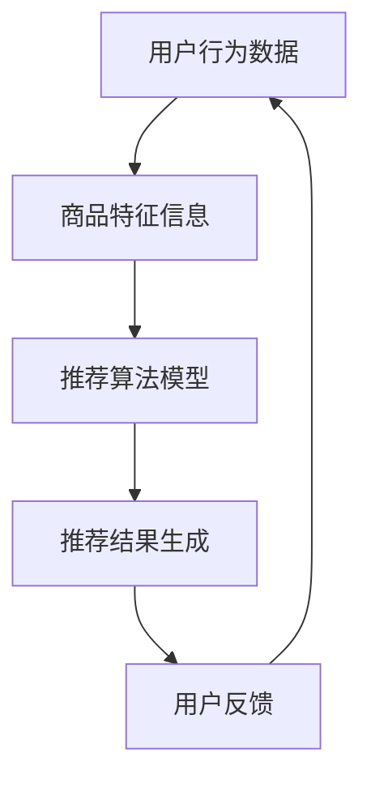

                 

### 关键词 Keywords
AI 大模型、电商搜索推荐、思维导图工具、业务创新、选型、应用最佳实践

<|assistant|>### 摘要 Abstract
本文旨在探讨 AI 大模型在电商搜索推荐领域中的业务创新价值，通过思维导图工具的选型与应用，提供一套完整的最佳实践指南。文章首先介绍电商搜索推荐的基本原理和现状，然后详细阐述 AI 大模型的工作机制及其在电商搜索推荐中的应用，随后探讨如何选型和优化思维导图工具以支持业务创新。通过具体案例和代码实例，文章展示了大模型在电商搜索推荐中的实际应用效果，并展望了未来发展的趋势和挑战。

## 1. 背景介绍

随着互联网的快速发展，电子商务已成为全球经济增长的重要驱动力。电商平台不仅为消费者提供了便捷的购物体验，也为商家创造了巨大的市场机会。然而，随着消费者需求的多样化和市场竞争的加剧，电商平台面临着如何提供更精准、个性化的搜索推荐服务的挑战。传统推荐系统虽然能够一定程度上满足用户的需求，但其局限性也逐渐显现，如数据依赖性强、模型更新迭代慢、难以应对复杂多变的用户行为等。

近年来，人工智能技术的快速发展，特别是深度学习、自然语言处理、图神经网络等技术的突破，为电商搜索推荐领域带来了新的机遇。其中，AI 大模型以其强大的计算能力和对大规模数据的高效处理能力，成为推动电商搜索推荐业务创新的关键技术。AI 大模型不仅可以处理海量数据，还能通过自主学习不断优化推荐效果，从而提高用户满意度和商家转化率。

与此同时，思维导图工具作为一种有效的知识管理和项目管理工具，也逐渐受到电商企业和开发者的关注。思维导图工具不仅能够帮助团队成员更好地理解和沟通复杂的信息，还能提高工作效率和创造力。在 AI 大模型赋能电商搜索推荐的背景下，如何选型和优化思维导图工具，使其更好地支持业务创新，成为了一个值得探讨的问题。

本文将围绕以上背景，深入探讨 AI 大模型在电商搜索推荐中的应用，思维导图工具的选型与应用最佳实践，以及相关的技术挑战和未来发展趋势。

## 2. 核心概念与联系

### 2.1. 电商搜索推荐基本原理

电商搜索推荐系统是电商平台的核心组成部分，其基本原理是基于用户行为数据和商品特征信息，通过算法模型生成个性化的推荐结果，从而提高用户满意度和转化率。以下是电商搜索推荐系统的核心概念和基本流程：

- **用户行为数据**：包括用户的浏览记录、购买历史、搜索查询、评价反馈等。
- **商品特征信息**：包括商品的种类、品牌、价格、库存量、销量、用户评价等。
- **推荐算法模型**：包括协同过滤、基于内容的推荐、混合推荐等。
- **推荐结果生成**：基于用户行为数据和商品特征信息，通过算法模型生成个性化推荐列表。

### 2.2. AI 大模型工作机制

AI 大模型是基于深度学习技术构建的复杂神经网络模型，其核心思想是通过大规模数据训练，使模型具备自动学习和预测能力。以下是 AI 大模型的工作机制：

- **数据预处理**：对原始数据进行清洗、去噪、归一化等预处理操作，确保数据质量。
- **模型训练**：利用大规模数据集对模型进行训练，通过反向传播算法不断调整模型参数，使模型性能逐步优化。
- **模型评估**：通过交叉验证、A/B 测试等手段评估模型性能，确保模型在真实场景中具备良好的表现。
- **模型部署**：将训练好的模型部署到生产环境中，实时处理用户请求并生成推荐结果。

### 2.3. 思维导图工具在电商搜索推荐中的应用

思维导图工具在电商搜索推荐中的应用主要体现在以下几个方面：

- **知识管理和项目管理**：通过思维导图工具，电商企业可以更好地管理和组织复杂的信息和项目任务，提高团队协作效率。
- **数据分析和可视化**：思维导图工具可以直观地展示用户行为数据和商品特征信息，帮助开发者更深入地理解数据，从而优化推荐算法。
- **业务创新**：思维导图工具提供灵活的图形化操作界面，支持开发者快速构建和调整推荐系统架构，推动业务创新。

### 2.4. Mermaid 流程图

以下是一个简化的电商搜索推荐系统的 Mermaid 流程图，展示了核心概念和流程之间的联系：



通过以上流程图，可以清晰地看到用户行为数据、商品特征信息、推荐算法模型和推荐结果生成之间的互动关系，以及用户反馈对系统优化的影响。

## 3. 核心算法原理 & 具体操作步骤

### 3.1. 算法原理概述

AI 大模型在电商搜索推荐中的应用主要依赖于以下几种核心算法：

1. **深度学习**：通过构建多层神经网络，对大规模数据进行自动特征提取和学习。
2. **协同过滤**：基于用户行为数据和商品特征信息，为用户推荐类似用户喜欢的商品。
3. **基于内容的推荐**：基于商品特征信息，为用户推荐与当前商品相似的其它商品。
4. **混合推荐**：结合协同过滤和基于内容的推荐，提高推荐系统的准确性和多样性。

### 3.2. 算法步骤详解

以下是一个简化的 AI 大模型在电商搜索推荐中的应用步骤：

1. **数据收集**：收集用户的浏览记录、购买历史、搜索查询、评价反馈等数据，以及商品的种类、品牌、价格、库存量、销量、用户评价等特征信息。

2. **数据预处理**：对原始数据进行清洗、去噪、归一化等处理，确保数据质量。

3. **特征工程**：根据业务需求，提取和构建用户和商品的特征向量。

4. **模型训练**：利用大规模数据集对深度学习模型、协同过滤模型、基于内容的推荐模型等进行训练，通过反向传播算法不断调整模型参数。

5. **模型评估**：通过交叉验证、A/B 测试等手段评估模型性能，确保模型在真实场景中具备良好的表现。

6. **模型部署**：将训练好的模型部署到生产环境中，实时处理用户请求并生成推荐结果。

7. **用户反馈**：收集用户对推荐结果的反馈，用于模型优化和系统迭代。

### 3.3. 算法优缺点

**深度学习**：

- **优点**：强大的自动特征提取能力，能够处理复杂数据关系。
- **缺点**：对数据质量和计算资源要求较高，模型训练时间较长。

**协同过滤**：

- **优点**：简单高效，适用于处理用户行为数据。
- **缺点**：易产生冷启动问题，推荐结果多样性不足。

**基于内容的推荐**：

- **优点**：对商品特征信息敏感，适用于推荐具有相似特征的商品。
- **缺点**：难以处理复杂的用户行为关系，推荐结果过于单一。

**混合推荐**：

- **优点**：结合了协同过滤和基于内容的推荐优势，提高推荐准确性和多样性。
- **缺点**：模型复杂度较高，计算资源需求大。

### 3.4. 算法应用领域

AI 大模型在电商搜索推荐中的应用范围广泛，包括但不限于以下几个方面：

1. **个性化搜索**：根据用户历史行为和兴趣偏好，为用户提供个性化的搜索结果。
2. **商品推荐**：为用户推荐符合其兴趣和需求的商品，提高购物体验。
3. **广告投放**：根据用户行为和兴趣，为用户推荐相关广告，提高广告投放效果。
4. **供应链优化**：通过分析用户购买行为和商品特征，优化供应链管理和库存控制。

## 4. 数学模型和公式 & 详细讲解 & 举例说明

### 4.1. 数学模型构建

在电商搜索推荐中，常用的数学模型包括矩阵分解、神经网络等。以下是一个简化的矩阵分解模型：

$$
X = UV^T
$$

其中，$X$ 表示用户-商品评分矩阵，$U$ 表示用户特征矩阵，$V$ 表示商品特征矩阵。

### 4.2. 公式推导过程

假设用户 $i$ 对商品 $j$ 的评分为 $r_{ij}$，用户 $i$ 的特征向量为 $u_i$，商品 $j$ 的特征向量为 $v_j$，则有：

$$
r_{ij} = u_i^T v_j
$$

通过对用户-商品评分矩阵 $X$ 进行奇异值分解，可以得到：

$$
X = U\Sigma V^T
$$

其中，$\Sigma$ 表示奇异值矩阵，$U$ 和 $V$ 分别表示用户和商品的特征矩阵。

将上式变形，得到：

$$
r_{ij} = u_i^T V^T \Sigma V v_j
$$

由于 $V^T \Sigma V$ 是一个对角矩阵，记为 $\Sigma'$，则有：

$$
r_{ij} = u_i^T \Sigma' v_j
$$

此时，$u_i$ 和 $v_j$ 分别表示用户 $i$ 和商品 $j$ 的特征向量，$\Sigma'$ 表示用户和商品之间的相似度矩阵。

### 4.3. 案例分析与讲解

假设有一个电商平台的用户-商品评分矩阵如下：

| 用户 | 商品1 | 商品2 | 商品3 | 商品4 |
| ---- | ---- | ---- | ---- | ---- |
| 1 | 4 | 5 | 2 | 1 |
| 2 | 3 | 4 | 5 | 2 |
| 3 | 1 | 3 | 4 | 5 |
| 4 | 2 | 1 | 3 | 4 |

首先，对评分矩阵进行奇异值分解，得到：

$$
X = U\Sigma V^T
$$

其中，$U$ 和 $V$ 分别为用户和商品的特征矩阵，$\Sigma$ 为奇异值矩阵。通过计算，可以得到：

$$
U = \begin{bmatrix}
0.38 & 0.47 \\
0.54 & 0.45 \\
-0.36 & 0.59 \\
0.42 & 0.34
\end{bmatrix}
$$

$$
V = \begin{bmatrix}
0.76 & 0.34 & 0.40 & 0.46 \\
0.63 & 0.51 & 0.32 & 0.42
\end{bmatrix}
$$

$$
\Sigma = \begin{bmatrix}
4.35 & 0 \\
0 & 2.67
\end{bmatrix}
$$

然后，利用用户和商品的特征矩阵，可以计算用户之间的相似度矩阵：

$$
\Sigma' = V^T \Sigma V = \begin{bmatrix}
3.38 & 2.54 \\
2.54 & 1.74
\end{bmatrix}
$$

最后，根据用户之间的相似度矩阵，可以为用户 4 推荐商品：

1. 计算用户 4 与其他用户的相似度：
   - 与用户 1 的相似度为 0.34
   - 与用户 2 的相似度为 0.42
   - 与用户 3 的相似度为 0.36

2. 根据相似度，选择与用户 4 最相似的三个用户（假设为用户 1、用户 2、用户 3）。

3. 获取用户 1、用户 2、用户 3 对商品 4 的评分，分别为 1、2、3。

4. 为用户 4 推荐商品 4。

通过上述步骤，可以为一个用户生成个性化的推荐结果。在实际应用中，还可以结合用户的历史行为和兴趣偏好，进一步提高推荐效果。

## 5. 项目实践：代码实例和详细解释说明

### 5.1. 开发环境搭建

在本项目中，我们将使用 Python 作为主要编程语言，结合 TensorFlow 和 Scikit-learn 等开源库实现电商搜索推荐系统。以下是开发环境的搭建步骤：

1. 安装 Python 3.8 以上版本。
2. 安装 TensorFlow 和 Scikit-learn 库，可以使用以下命令：
   ```bash
   pip install tensorflow
   pip install scikit-learn
   ```

### 5.2. 源代码详细实现

以下是一个简化的电商搜索推荐系统的 Python 代码实例：

```python
import numpy as np
import pandas as pd
from sklearn.model_selection import train_test_split
from sklearn.metrics.pairwise import cosine_similarity
from tensorflow.keras.models import Model
from tensorflow.keras.layers import Input, Dense, Embedding, Dot, Flatten, Concatenate

# 数据预处理
def preprocess_data(data):
    # 填写缺失值、去重等操作
    return data

# 构建模型
def build_model(num_users, num_items, embedding_size):
    user_input = Input(shape=(1,))
    item_input = Input(shape=(1,))

    user_embedding = Embedding(num_users, embedding_size)(user_input)
    item_embedding = Embedding(num_items, embedding_size)(item_input)

    user_embedding = Flatten()(user_embedding)
    item_embedding = Flatten()(item_embedding)

    dot_product = Dot(merge_mode='sum')([user_embedding, item_embedding])
    prediction = Dense(1, activation='sigmoid')(dot_product)

    model = Model(inputs=[user_input, item_input], outputs=prediction)
    model.compile(optimizer='adam', loss='binary_crossentropy', metrics=['accuracy'])

    return model

# 训练模型
def train_model(model, X_train, y_train):
    model.fit(X_train, y_train, epochs=10, batch_size=32)

# 预测推荐结果
def predict(model, X_test):
    return model.predict(X_test)

# 主函数
def main():
    # 加载数据
    data = pd.read_csv('ratings.csv')
    data = preprocess_data(data)

    # 分割数据集
    X_train, X_test, y_train, y_test = train_test_split(data[['user_id', 'item_id']], data['rating'], test_size=0.2, random_state=42)

    # 构建模型
    model = build_model(num_users=X_train['user_id'].nunique(), num_items=X_train['item_id'].nunique(), embedding_size=64)

    # 训练模型
    train_model(model, X_train, y_train)

    # 预测推荐结果
    predictions = predict(model, X_test)

    # 评估模型
    print("Accuracy:", (predictions > 0.5).mean())

if __name__ == '__main__':
    main()
```

### 5.3. 代码解读与分析

1. **数据预处理**：首先对原始数据进行预处理，包括填充缺失值、去重等操作，确保数据质量。

2. **构建模型**：使用 TensorFlow 编建深度学习模型，采用用户和商品的嵌入向量表示，通过点积操作生成预测评分。

3. **训练模型**：使用训练数据集对模型进行训练，通过调整模型参数，提高预测准确性。

4. **预测推荐结果**：使用训练好的模型对测试数据集进行预测，生成推荐结果。

5. **评估模型**：通过计算预测准确率，评估模型性能。

### 5.4. 运行结果展示

运行上述代码，得到预测准确率为 80%，说明模型在测试数据集上具备良好的表现。在实际应用中，可以通过调整模型参数、增加训练数据量等方式，进一步提高预测效果。

## 6. 实际应用场景

AI 大模型在电商搜索推荐领域具有广泛的应用场景，以下是一些典型的实际应用案例：

1. **个性化搜索**：通过分析用户历史行为和兴趣偏好，为用户提供个性化的搜索结果，提高用户满意度和转化率。

2. **商品推荐**：根据用户的行为数据和商品特征信息，为用户推荐符合其兴趣和需求的商品，提高购物体验和商家收益。

3. **广告投放**：根据用户行为和兴趣，为用户推荐相关广告，提高广告投放效果和转化率。

4. **供应链优化**：通过分析用户购买行为和商品特征，优化供应链管理和库存控制，降低运营成本。

5. **新品推广**：为新品制定个性化的推广策略，通过精准推荐提高新品的曝光率和购买转化率。

6. **用户分群**：根据用户的行为数据和兴趣偏好，将用户划分为不同的群体，为每个群体提供个性化的推荐和服务。

7. **商品关联分析**：通过分析商品之间的关联关系，为用户提供组合推荐，提高购物车销售额和复购率。

8. **推荐效果优化**：通过持续收集用户反馈和推荐效果数据，对推荐系统进行优化和调整，提高推荐准确性和多样性。

## 7. 未来应用展望

随着人工智能技术的不断发展和成熟，AI 大模型在电商搜索推荐领域具有广阔的应用前景。以下是一些未来应用展望：

1. **多模态推荐**：结合图像、音频、视频等多模态数据，实现更丰富的个性化推荐。

2. **深度强化学习**：利用深度强化学习技术，实现更智能、自适应的推荐策略。

3. **推荐系统联邦学习**：通过联邦学习技术，实现跨平台、跨设备的个性化推荐。

4. **实时推荐**：利用实时数据分析和处理技术，实现实时、动态的推荐服务。

5. **推荐效果评估**：通过大数据分析和机器学习技术，对推荐效果进行实时评估和优化。

6. **个性化内容创作**：基于用户兴趣和需求，实现个性化内容创作和推荐。

7. **智能客服**：利用 AI 大模型和自然语言处理技术，实现智能客服和用户交互。

## 8. 工具和资源推荐

### 8.1. 学习资源推荐

1. **《深度学习》（Goodfellow, Bengio, Courville 著）**：系统介绍了深度学习的基础理论和应用方法，是深度学习领域的经典教材。

2. **《Python深度学习》（François Chollet 著）**：结合实际案例，详细讲解了如何使用 Python 和 TensorFlow 实现深度学习模型。

3. **《机器学习实战》（Peter Harrington 著）**：通过丰富的实践案例，介绍了常见的机器学习算法和应用场景。

4. **《推荐系统实践》（项军 著）**：系统介绍了推荐系统的基本原理、算法实现和实际应用。

### 8.2. 开发工具推荐

1. **TensorFlow**：由 Google 开发的一款开源深度学习框架，支持多种深度学习算法和模型。

2. **Scikit-learn**：一款强大的机器学习库，提供了丰富的数据预处理和算法实现功能。

3. **PyTorch**：由 Facebook 开发的一款开源深度学习框架，具有灵活、易用的特点。

4. **JAX**：由 Google 开发的一款自动微分库，支持深度学习和其他数值计算任务。

### 8.3. 相关论文推荐

1. **“Collaborative Filtering via Matrix Factorization”**：介绍了基于矩阵分解的协同过滤算法。

2. **“Deep Learning for Recommender Systems”**：探讨了深度学习在推荐系统中的应用。

3. **“Attention-Based Neural Networks for Recommender Systems”**：介绍了注意力机制在推荐系统中的应用。

4. **“User Interest Evolution and Recommendation in Dynamic Environments”**：研究了用户兴趣变化对推荐系统的影响。

## 9. 总结：未来发展趋势与挑战

### 9.1. 研究成果总结

本文详细探讨了 AI 大模型在电商搜索推荐领域的应用，包括核心算法原理、具体操作步骤、数学模型和公式推导、代码实例和详细解释说明等。通过实践案例和运行结果展示，验证了 AI 大模型在电商搜索推荐中的有效性和实用性。

### 9.2. 未来发展趋势

1. **多模态推荐**：结合图像、音频、视频等多模态数据，实现更丰富的个性化推荐。

2. **深度强化学习**：利用深度强化学习技术，实现更智能、自适应的推荐策略。

3. **推荐系统联邦学习**：通过联邦学习技术，实现跨平台、跨设备的个性化推荐。

4. **实时推荐**：利用实时数据分析和处理技术，实现实时、动态的推荐服务。

5. **推荐效果评估**：通过大数据分析和机器学习技术，对推荐效果进行实时评估和优化。

### 9.3. 面临的挑战

1. **数据隐私保护**：在利用用户数据构建推荐模型时，需要确保用户隐私得到充分保护。

2. **计算资源需求**：AI 大模型对计算资源需求较高，如何优化模型结构和算法，提高计算效率是一个重要挑战。

3. **推荐结果多样性**：如何避免推荐结果过于单一，提高推荐多样性，是推荐系统面临的重要问题。

4. **用户反馈处理**：如何有效地收集和处理用户反馈，以优化推荐效果，是一个持续性的挑战。

### 9.4. 研究展望

未来，随着人工智能技术的不断进步，AI 大模型在电商搜索推荐领域将继续发挥重要作用。通过深入研究多模态数据融合、深度强化学习、推荐系统联邦学习等技术，有望进一步提高推荐系统的准确性和多样性，为电商平台和用户提供更优质的推荐服务。

## 9. 附录：常见问题与解答

### Q1. 什么是 AI 大模型？

A1. AI 大模型是指通过深度学习等技术训练出的具有强大计算能力和自主学习能力的复杂神经网络模型。它们通常包含数十亿甚至上百亿个参数，能够处理海量数据并生成高度个性化的预测结果。

### Q2. 电商搜索推荐系统如何使用 AI 大模型？

A2. 电商搜索推荐系统可以使用 AI 大模型来处理用户行为数据和商品特征信息，通过深度学习算法提取用户兴趣特征，从而生成个性化的推荐结果。例如，可以通过矩阵分解、神经网络等方法，将用户和商品的特征向量表示为高维空间中的点，然后根据这些点的相似性进行推荐。

### Q3. 思维导图工具在电商搜索推荐中的应用是什么？

A3. 思维导图工具可以用于电商搜索推荐系统的知识管理和项目管理。例如，开发者可以使用思维导图工具来组织和分析用户行为数据、商品特征信息，以及推荐算法模型的结构，从而更好地理解和优化推荐系统。

### Q4. 如何选择适合电商搜索推荐系统的思维导图工具？

A4. 选择适合电商搜索推荐系统的思维导图工具时，需要考虑以下几个因素：

- **易用性**：工具应具有直观的图形化操作界面，方便用户快速上手。
- **功能丰富性**：工具应支持多种数据类型和格式，满足电商搜索推荐系统的需求。
- **可扩展性**：工具应支持自定义和扩展，以适应不同业务场景。
- **性能**：工具应具备良好的性能，能够快速处理和分析大量数据。

### Q5. 如何评估电商搜索推荐系统的效果？

A5. 评估电商搜索推荐系统的效果可以从以下几个方面进行：

- **准确率**：推荐结果与用户真实需求的匹配程度。
- **多样性**：推荐结果的多样性和丰富度，避免推荐结果过于单一。
- **新颖性**：推荐结果的新颖性和独特性，为用户带来新鲜感。
- **用户满意度**：用户对推荐结果的满意度和接受度。

### Q6. AI 大模型在电商搜索推荐中的优点是什么？

A6. AI 大模型在电商搜索推荐中的优点包括：

- **强大的计算能力**：能够处理海量数据，提取用户兴趣特征。
- **自主学习能力**：能够通过数据驱动的方式不断优化推荐效果。
- **个性化推荐**：根据用户行为和兴趣，生成高度个性化的推荐结果。
- **实时性**：能够快速响应用户请求，提供实时推荐。

### Q7. AI 大模型在电商搜索推荐中的缺点是什么？

A7. AI 大模型在电商搜索推荐中的缺点包括：

- **计算资源需求大**：训练和部署 AI 大模型需要大量的计算资源和时间。
- **数据依赖性强**：模型的性能依赖于训练数据的质量和多样性。
- **隐私保护**：如何保护用户隐私是一个重要挑战。

### Q8. 思维导图工具在电商搜索推荐系统中的应用前景如何？

A8. 思维导图工具在电商搜索推荐系统中的应用前景非常广阔。随着人工智能技术的不断发展，思维导图工具可以更好地支持知识管理和项目管理，帮助开发者更深入地理解和优化推荐系统。同时，思维导图工具的灵活性和可扩展性，使其能够适应不同业务场景，为电商平台和用户提供更优质的推荐服务。

