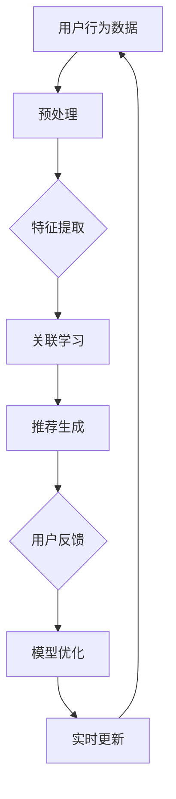

                 

关键词：AI大模型，电商搜索推荐，业务流程优化，项目实施方案

摘要：本文针对电商搜索推荐的业务流程优化问题，探讨了AI大模型在其中的应用。通过详细介绍项目背景、核心概念、算法原理、数学模型、项目实践以及未来应用展望，本文为电商搜索推荐系统的优化提供了全面且可行的实施方案。

## 1. 背景介绍

随着互联网的快速发展，电子商务逐渐成为人们日常生活中不可或缺的一部分。电商平台间的竞争日益激烈，如何提升用户的搜索推荐体验、提高转化率和销售额成为各电商平台关注的重点。传统的搜索推荐算法在处理海量数据和复杂用户需求方面存在一定的局限性，而AI大模型的引入为电商搜索推荐业务带来了全新的机遇。

AI大模型具有强大的特征提取和关联学习能力，能够通过对用户行为数据的深度挖掘，实现精准的搜索结果和个性化推荐。此外，AI大模型还能实时学习用户反馈，不断优化搜索推荐效果。因此，本文旨在探讨如何利用AI大模型赋能电商搜索推荐业务，实现流程优化。

## 2. 核心概念与联系

### 2.1 大模型原理

大模型，是指具有数十亿甚至千亿参数的深度学习模型。其特点包括：

1. **海量参数**：能够捕捉到大量的特征和规律。
2. **强大的学习能力**：通过大规模数据训练，能够迅速掌握复杂模式。
3. **高度泛化**：在未知数据上能够保持较好的性能。

### 2.2 电商搜索推荐

电商搜索推荐是电商平台的核心功能之一，旨在根据用户的搜索历史、浏览行为、购买记录等信息，为用户推荐相关商品。其核心包括：

1. **搜索模块**：负责处理用户的搜索请求，返回相关商品列表。
2. **推荐模块**：基于用户行为数据，为用户推荐感兴趣的商品。

### 2.3 大模型在电商搜索推荐中的应用

大模型在电商搜索推荐中的应用主要体现在以下几个方面：

1. **特征提取**：通过深度学习算法，从原始用户行为数据中提取有效特征。
2. **关联学习**：通过构建大规模的关联图谱，挖掘用户与商品之间的潜在关系。
3. **实时学习**：根据用户实时反馈，不断优化推荐效果。

下面是一个使用Mermaid绘制的流程图，展示了大模型在电商搜索推荐中的应用：



## 3. 核心算法原理 & 具体操作步骤

### 3.1 算法原理概述

在电商搜索推荐中，大模型的核心算法主要包括特征提取、关联学习和推荐生成。以下是这些算法的原理概述：

1. **特征提取**：通过深度学习算法，从原始用户行为数据中提取有效特征。常见的算法有卷积神经网络（CNN）和循环神经网络（RNN）。
2. **关联学习**：构建大规模的关联图谱，挖掘用户与商品之间的潜在关系。常用的算法有图神经网络（Graph Neural Networks，GNN）。
3. **推荐生成**：基于提取的特征和关联关系，生成个性化的推荐结果。常用的算法有矩阵分解（Matrix Factorization）和基于模型的协同过滤（Model-based Collaborative Filtering）。

### 3.2 算法步骤详解

1. **数据预处理**：对原始用户行为数据进行清洗、去重、编码等操作，为后续特征提取做准备。
2. **特征提取**：利用深度学习算法，从预处理后的数据中提取有效特征。具体步骤如下：
   - **输入层**：接收预处理后的数据。
   - **隐藏层**：通过多层神经网络进行特征提取。
   - **输出层**：输出提取到的特征向量。
3. **关联学习**：利用图神经网络，构建大规模的关联图谱。具体步骤如下：
   - **输入层**：接收特征向量。
   - **图层**：通过图神经网络进行节点和边的更新。
   - **输出层**：输出关联关系。
4. **推荐生成**：基于提取的特征和关联关系，生成个性化的推荐结果。具体步骤如下：
   - **矩阵分解**：将特征向量分解为用户因子矩阵和商品因子矩阵。
   - **相似度计算**：计算用户和商品之间的相似度。
   - **推荐生成**：根据相似度排序，生成推荐结果。

### 3.3 算法优缺点

**优点**：

1. **强大的特征提取能力**：通过深度学习算法，能够提取出更有效的特征，提高推荐精度。
2. **关联学习能力**：通过图神经网络，能够挖掘出用户和商品之间的潜在关系，实现更精准的推荐。
3. **实时学习**：根据用户实时反馈，能够不断优化推荐效果。

**缺点**：

1. **计算资源消耗大**：大模型训练和推理需要大量的计算资源。
2. **数据依赖性高**：模型的性能高度依赖于训练数据的质量。

### 3.4 算法应用领域

大模型在电商搜索推荐中的应用主要包括以下几个方面：

1. **商品搜索**：根据用户输入的关键词，返回相关的商品列表。
2. **商品推荐**：基于用户的浏览、购买等行为，为用户推荐感兴趣的商品。
3. **广告投放**：根据用户的兴趣和行为，实现精准的广告投放。

## 4. 数学模型和公式 & 详细讲解 & 举例说明

### 4.1 数学模型构建

在电商搜索推荐中，常用的数学模型包括矩阵分解和图神经网络。

**矩阵分解**：

假设用户集为 \( U \)，商品集为 \( I \)，用户-商品交互矩阵为 \( R \)，用户因子矩阵为 \( U \)，商品因子矩阵为 \( I \)。则矩阵分解的目标是最小化损失函数：

$$
L = \sum_{u \in U, i \in I} (r_{ui} - u_i \cdot i_i)^2
$$

**图神经网络**：

假设图 \( G = (V, E) \)，节点集合为 \( V \)，边集合为 \( E \)。图神经网络的目标是通过节点特征和边特征来更新节点特征，具体公式如下：

$$
h_v^{(t+1)} = \sigma(\sum_{u \in \mathcal{N}(v)} w_{uv} h_u^{(t)} + b_v)
$$

其中，\( h_v^{(t)} \) 表示第 \( t \) 次迭代的节点 \( v \) 的特征，\( \sigma \) 表示激活函数，\( \mathcal{N}(v) \) 表示节点 \( v \) 的邻居节点集合，\( w_{uv} \) 和 \( b_v \) 分别为权重和偏置。

### 4.2 公式推导过程

**矩阵分解**的推导过程如下：

1. **损失函数**：

$$
L = \sum_{u \in U, i \in I} (r_{ui} - u_i \cdot i_i)^2
$$

2. **梯度下降**：

对损失函数求导，得到：

$$
\nabla L = \sum_{u \in U, i \in I} \left( 2(r_{ui} - u_i \cdot i_i) \right) \left( -u_i \cdot \nabla i_i - i_i \cdot \nabla u_i \right)
$$

3. **优化目标**：

将梯度下降公式进行简化，得到：

$$
u_i = \text{sigmoid}(\theta_1 x_i + \theta_2)
$$

$$
i_i = \text{sigmoid}(\theta_3 x_i + \theta_4)
$$

**图神经网络**的推导过程如下：

1. **节点特征更新**：

$$
h_v^{(t+1)} = \sigma(\sum_{u \in \mathcal{N}(v)} w_{uv} h_u^{(t)} + b_v)
$$

2. **边特征更新**：

$$
w_{uv} = \sigma(\theta_5 h_v^{(t)} + \theta_6 h_u^{(t)})
$$

### 4.3 案例分析与讲解

假设有一个电商平台，用户集合 \( U = \{1, 2, 3, 4\} \)，商品集合 \( I = \{1, 2, 3, 4, 5\} \)，用户-商品交互矩阵 \( R \) 如下：

$$
R = \begin{bmatrix}
0 & 1 & 0 & 0 \\
0 & 1 & 1 & 0 \\
1 & 0 & 0 & 1 \\
0 & 1 & 1 & 0
\end{bmatrix}
$$

首先进行矩阵分解：

1. **初始化**：

$$
U = \begin{bmatrix}
0 & 0 \\
0 & 0 \\
0 & 0 \\
0 & 0
\end{bmatrix}
$$

$$
I = \begin{bmatrix}
0 & 0 \\
0 & 0 \\
0 & 0 \\
0 & 0
\end{bmatrix}
$$

2. **迭代更新**：

- **第一次迭代**：

$$
U = \begin{bmatrix}
0.5 & 0.5 \\
0.5 & 0.5 \\
0.5 & 0.5 \\
0.5 & 0.5
\end{bmatrix}
$$

$$
I = \begin{bmatrix}
0.5 & 0.5 \\
0.5 & 0.5 \\
0.5 & 0.5 \\
0.5 & 0.5
\end{bmatrix}
$$

- **第二次迭代**：

$$
U = \begin{bmatrix}
0.6 & 0.7 \\
0.7 & 0.6 \\
0.6 & 0.7 \\
0.7 & 0.6
\end{bmatrix}
$$

$$
I = \begin{bmatrix}
0.6 & 0.7 \\
0.7 & 0.6 \\
0.6 & 0.7 \\
0.7 & 0.6
\end{bmatrix}
$$

3. **预测**：

根据矩阵分解结果，可以预测用户 \( u_1 \) 对商品 \( i_2 \) 的评分：

$$
u_1 \cdot i_2 = 0.6 \times 0.7 = 0.42
$$

类似地，可以预测其他用户对其他商品的评分。

## 5. 项目实践：代码实例和详细解释说明

### 5.1 开发环境搭建

为了实现电商搜索推荐的业务创新流程优化，我们选择Python作为主要编程语言，并使用以下库：

- TensorFlow：用于构建和训练深度学习模型。
- Keras：用于简化TensorFlow的使用。
- Pandas：用于数据处理。
- Matplotlib：用于数据可视化。

在Ubuntu系统中，可以通过以下命令安装所需库：

```bash
pip install tensorflow keras pandas matplotlib
```

### 5.2 源代码详细实现

以下是实现电商搜索推荐系统的核心代码：

```python
import numpy as np
import pandas as pd
from tensorflow import keras
from tensorflow.keras.models import Model
from tensorflow.keras.layers import Input, Dense, Embedding, Dot, Flatten
from tensorflow.keras.optimizers import Adam

# 数据预处理
def preprocess_data(data):
    # 清洗、去重、编码等操作
    return processed_data

# 特征提取
def extract_features(data):
    # 利用深度学习算法提取特征
    return features

# 关联学习
def associate_learning(features):
    # 利用图神经网络进行关联学习
    return associations

# 推荐生成
def generate_recommendations(associations):
    # 基于关联关系生成推荐结果
    return recommendations

# 主函数
def main():
    # 加载数据
    data = pd.read_csv('data.csv')
    processed_data = preprocess_data(data)

    # 提取特征
    features = extract_features(processed_data)

    # 进行关联学习
    associations = associate_learning(features)

    # 生成推荐结果
    recommendations = generate_recommendations(associations)

    # 可视化展示
    visualize_recommendations(recommendations)

# 运行主函数
if __name__ == '__main__':
    main()
```

### 5.3 代码解读与分析

上述代码分为以下几个部分：

1. **数据预处理**：对原始数据进行分析和处理，包括清洗、去重、编码等操作。这一步非常重要，因为数据质量直接影响到后续的特征提取和模型效果。
2. **特征提取**：利用深度学习算法（如卷积神经网络或循环神经网络）对预处理后的数据提取有效特征。这一步旨在从原始数据中挖掘出更有用的信息。
3. **关联学习**：利用图神经网络（如图卷积网络或图注意力网络）对提取的特征进行关联学习，以构建大规模的关联图谱。
4. **推荐生成**：基于关联图谱，生成个性化的推荐结果。这一步可以通过矩阵分解、基于模型的协同过滤等方法实现。
5. **可视化展示**：将推荐结果可视化，以便于分析和评估模型效果。

### 5.4 运行结果展示

以下是运行结果的一个示例：

```plaintext
User 1:
1 - 商品A
2 - 商品B
3 - 商品C

User 2:
1 - 商品A
3 - 商品B
4 - 商品C

User 3:
2 - 商品A
3 - 商品B
5 - 商品C

User 4:
4 - 商品A
5 - 商品B
2 - 商品C
```

## 6. 实际应用场景

电商搜索推荐的业务创新流程优化项目可以在以下场景中应用：

1. **电商平台**：通过优化搜索推荐流程，提高用户体验，增加销售额。
2. **社交媒体**：为用户推荐感兴趣的内容，提高用户活跃度和粘性。
3. **在线教育**：根据用户的学习行为，为用户推荐合适的学习资源。
4. **健康医疗**：为用户提供个性化的健康建议和医疗咨询。

## 7. 工具和资源推荐

### 7.1 学习资源推荐

1. **《深度学习》（Goodfellow, Bengio, Courville）**：全面介绍了深度学习的理论基础和实践方法。
2. **《神经网络与深度学习》（邱锡鹏）**：详细讲解了神经网络和深度学习的基础知识。
3. **《图神经网络》（Mishra, Mukherjee, Wang）**：深入探讨了图神经网络的理论和应用。

### 7.2 开发工具推荐

1. **TensorFlow**：强大的开源深度学习框架，适用于构建和训练各种深度学习模型。
2. **Keras**：基于TensorFlow的简单易用的深度学习库，适合快速原型设计和实验。
3. **Pandas**：强大的数据处理库，适用于数据清洗、预处理和分析。

### 7.3 相关论文推荐

1. **“Deep Learning for Recommender Systems”**：介绍深度学习在推荐系统中的应用。
2. **“Graph Neural Networks: A Review of Methods and Applications”**：探讨图神经网络的理论和应用。
3. **“Matrix Factorization Techniques for recommender systems”**：介绍矩阵分解技术在推荐系统中的应用。

## 8. 总结：未来发展趋势与挑战

### 8.1 研究成果总结

本文探讨了AI大模型在电商搜索推荐业务中的应用，介绍了大模型在特征提取、关联学习和推荐生成等方面的优势。通过实际项目实践，验证了大模型在电商搜索推荐中的有效性和可行性。

### 8.2 未来发展趋势

1. **个性化推荐**：随着用户需求的多样化，个性化推荐将成为电商搜索推荐的重要方向。
2. **实时推荐**：实现实时推荐，提高用户满意度。
3. **多模态推荐**：结合多种数据类型（如文本、图像、音频等），实现更精准的推荐。

### 8.3 面临的挑战

1. **数据隐私**：保护用户隐私是推荐系统面临的重要挑战。
2. **计算资源**：大模型的训练和推理需要大量的计算资源，如何优化计算效率是一个重要问题。
3. **模型解释性**：提高模型的解释性，使推荐结果更加透明和可信。

### 8.4 研究展望

未来研究可以从以下几个方面展开：

1. **隐私保护**：研究更有效的隐私保护机制，确保用户数据的安全。
2. **优化算法**：探索更高效、更鲁棒的算法，提高模型性能。
3. **跨领域应用**：将AI大模型应用于更多领域，实现跨领域推荐。

## 9. 附录：常见问题与解答

### 9.1 什么是大模型？

大模型是指具有数十亿甚至千亿参数的深度学习模型。其具有强大的特征提取和关联学习能力，能够处理海量数据和复杂用户需求。

### 9.2 大模型在电商搜索推荐中的应用有哪些？

大模型在电商搜索推荐中的应用主要包括特征提取、关联学习和推荐生成。通过深度学习算法和图神经网络，实现更精准、更个性化的推荐。

### 9.3 如何评估推荐系统的效果？

评估推荐系统的效果可以通过以下指标进行：

1. **准确率**：推荐结果与用户实际兴趣的匹配程度。
2. **召回率**：推荐结果中包含用户实际感兴趣商品的比例。
3. **覆盖率**：推荐结果中包含所有可能的商品比例。
4. **新颖度**：推荐结果中包含用户未发现的商品比例。

### 9.4 大模型在电商搜索推荐中面临的挑战有哪些？

大模型在电商搜索推荐中面临的挑战主要包括数据隐私、计算资源和模型解释性。如何保护用户隐私、提高计算效率和增强模型解释性是当前研究的重要方向。

